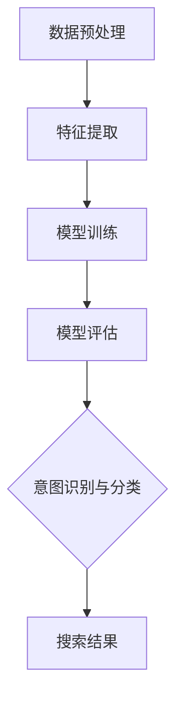

                 

# 电商搜索中的意图识别与分类模型

> 关键词：电商搜索，意图识别，分类模型，机器学习，深度学习，NLP，关键词匹配，用户行为分析

> 摘要：本文将深入探讨电商搜索中的意图识别与分类模型，解析其背后的核心概念、算法原理以及实际应用。通过逐步分析，我们旨在为读者提供一个全面而深入的理解，帮助他们在电商领域中实现更精准的搜索结果和用户体验。

## 1. 背景介绍

### 1.1 目的和范围

本文旨在探讨电商搜索中的意图识别与分类模型，重点分析其核心概念、算法原理及实际应用。电商搜索作为电商平台的基石，其搜索质量直接影响到用户的购物体验和平台的商业价值。因此，如何提高搜索的精准度，实现更好的用户意图识别和分类，成为当前研究的热点。

本文将首先介绍电商搜索的基本概念和重要性，然后详细阐述意图识别与分类模型的核心概念、算法原理及实际操作步骤，最后探讨其在实际应用场景中的效果和优化方向。

### 1.2 预期读者

本文适合以下读者群体：

1. 从事电商搜索开发的技术人员
2. 对机器学习和深度学习感兴趣的读者
3. 电商行业从业者，希望了解搜索技术对业务的影响
4. 计算机科学和人工智能领域的学生和研究人员

### 1.3 文档结构概述

本文结构如下：

1. 背景介绍
2. 核心概念与联系
3. 核心算法原理 & 具体操作步骤
4. 数学模型和公式 & 详细讲解 & 举例说明
5. 项目实战：代码实际案例和详细解释说明
6. 实际应用场景
7. 工具和资源推荐
8. 总结：未来发展趋势与挑战
9. 附录：常见问题与解答
10. 扩展阅读 & 参考资料

### 1.4 术语表

#### 1.4.1 核心术语定义

- **电商搜索**：指用户在电商平台输入关键词，搜索到相关商品的过程。
- **意图识别**：指从用户搜索行为中提取用户意图，以提供更精准的搜索结果。
- **分类模型**：指将用户搜索意图分类到不同的类别，以便实现个性化推荐。
- **机器学习**：一种基于数据的学习方法，使计算机系统能够从数据中自动学习并改进性能。
- **深度学习**：一种机器学习技术，通过神经网络模拟人脑的学习机制。
- **自然语言处理（NLP）**：一种使计算机能够理解、解释和生成自然语言的技术。

#### 1.4.2 相关概念解释

- **关键词匹配**：指通过将用户输入的关键词与商品标题、描述等进行匹配，以生成搜索结果。
- **用户行为分析**：指通过分析用户在电商平台的行为数据，以了解用户偏好和购买意图。

#### 1.4.3 缩略词列表

- **NLP**：自然语言处理
- **ML**：机器学习
- **DL**：深度学习
- **API**：应用程序编程接口
- **SDK**：软件开发工具包

## 2. 核心概念与联系

在电商搜索中，意图识别与分类模型是关键组成部分。为了更好地理解其工作原理，我们需要先了解相关核心概念。

### 2.1. 搜索意图

搜索意图是指用户在搜索过程中所期望获得的答案类型。根据用户搜索行为和需求，搜索意图可以分为以下几类：

1. **信息检索**：用户希望获取具体的信息，如商品规格、价格等。
2. **商品浏览**：用户希望查看某类商品，但不一定有明确的购买意图。
3. **商品比较**：用户希望在不同商品之间进行比较，以便做出购买决策。
4. **购买决策**：用户已经确定要购买某商品，正在寻找最佳购买渠道或价格。

### 2.2. 分类模型

分类模型是一种机器学习技术，用于将输入数据分类到预定义的类别中。在电商搜索中，分类模型可用于将用户搜索意图分类到不同类别，从而实现个性化推荐。

常见的分类模型包括：

1. **朴素贝叶斯分类器**：基于贝叶斯定理的简单分类器，适用于文本分类任务。
2. **支持向量机（SVM）**：一种基于优化理论的分类模型，适用于高维空间分类。
3. **决策树**：一种基于树结构的分类模型，易于理解和解释。
4. **随机森林**：一种基于决策树的集成学习方法，提高分类模型的泛化能力。
5. **深度神经网络**：一种基于多层神经网络结构的分类模型，适用于复杂分类任务。

### 2.3. 意图识别与分类模型工作原理

意图识别与分类模型的工作原理如下：

1. **数据预处理**：将用户输入的搜索关键词进行分词、去停用词等处理，得到特征向量。
2. **特征提取**：通过特征提取技术，将原始数据转化为适用于分类模型的特征向量。常用的特征提取方法包括词袋模型、TF-IDF、Word2Vec等。
3. **模型训练**：使用训练数据集，通过分类模型训练得到模型参数。模型训练过程通常涉及优化算法，如梯度下降、随机梯度下降等。
4. **模型评估**：使用验证数据集评估模型性能，包括准确率、召回率、F1值等指标。
5. **意图识别与分类**：将用户输入的搜索关键词进行特征提取和模型预测，得到用户搜索意图的类别。根据分类结果，为用户提供相应的搜索结果。

### 2.4. Mermaid 流程图

以下是一个简单的 Mermaid 流程图，展示了意图识别与分类模型的工作流程：



## 3. 核心算法原理 & 具体操作步骤

在意图识别与分类模型中，核心算法原理主要包括数据预处理、特征提取、模型训练和模型评估。以下将逐步介绍这些算法原理，并使用伪代码进行详细阐述。

### 3.1. 数据预处理

数据预处理是意图识别与分类模型的基础，其目的是将原始数据转化为适用于分类模型的特征向量。具体操作步骤如下：

```python
def preprocess_data(text):
    # 分词
    words = tokenize(text)
    # 去停用词
    words = remove_stopwords(words)
    # 词干提取
    words = lemmatize(words)
    # 词形还原
    words = stem(words)
    return words
```

### 3.2. 特征提取

特征提取是将原始文本数据转化为数值特征的过程，常用的特征提取方法包括词袋模型、TF-IDF和Word2Vec等。以下以词袋模型为例，介绍特征提取方法：

```python
from sklearn.feature_extraction.text import TfidfVectorizer

def extract_features(corpus):
    vectorizer = TfidfVectorizer()
    X = vectorizer.fit_transform(corpus)
    return X, vectorizer
```

### 3.3. 模型训练

模型训练是意图识别与分类模型的核心环节，通过训练数据集学习模型参数。以下以朴素贝叶斯分类器为例，介绍模型训练方法：

```python
from sklearn.naive_bayes import MultinomialNB

def train_model(X_train, y_train):
    model = MultinomialNB()
    model.fit(X_train, y_train)
    return model
```

### 3.4. 模型评估

模型评估是验证模型性能的重要步骤，常用的评估指标包括准确率、召回率、F1值等。以下以准确率为例，介绍模型评估方法：

```python
from sklearn.metrics import accuracy_score

def evaluate_model(model, X_test, y_test):
    y_pred = model.predict(X_test)
    acc = accuracy_score(y_test, y_pred)
    return acc
```

### 3.5. 意图识别与分类

意图识别与分类是模型应用的核心环节，通过特征提取和模型预测，得到用户搜索意图的类别。以下以分类结果为例，介绍意图识别与分类方法：

```python
def classify_intent(model, vectorizer, text):
    features = vectorizer.transform([text])
    intent = model.predict(features)[0]
    return intent
```

## 4. 数学模型和公式 & 详细讲解 & 举例说明

在意图识别与分类模型中，数学模型和公式是核心组成部分。以下将详细讲解相关数学模型和公式，并通过举例说明其应用。

### 4.1. 贝叶斯定理

贝叶斯定理是意图识别与分类模型的基础，用于计算给定特征条件下，用户搜索意图的概率。贝叶斯定理公式如下：

$$
P(A|B) = \frac{P(B|A) \cdot P(A)}{P(B)}
$$

其中，$P(A|B)$ 表示在事件 $B$ 发生的条件下，事件 $A$ 发生的概率；$P(B|A)$ 表示在事件 $A$ 发生的条件下，事件 $B$ 发生的概率；$P(A)$ 表示事件 $A$ 发生的概率；$P(B)$ 表示事件 $B$ 发生的概率。

举例说明：

假设我们要计算在用户搜索关键词为“笔记本电脑”的情况下，用户意图为“购买决策”的概率。根据贝叶斯定理，可以得到：

$$
P(购买决策|笔记本电脑) = \frac{P(笔记本电脑|购买决策) \cdot P(购买决策)}{P(笔记本电脑)}
$$

其中，$P(笔记本电脑|购买决策)$ 表示在用户意图为“购买决策”的条件下，用户搜索关键词为“笔记本电脑”的概率；$P(购买决策)$ 表示用户意图为“购买决策”的概率；$P(笔记本电脑)$ 表示用户搜索关键词为“笔记本电脑”的概率。

### 4.2. 朴素贝叶斯分类器

朴素贝叶斯分类器是一种基于贝叶斯定理的简单分类器，其核心思想是假设特征之间相互独立。朴素贝叶斯分类器的数学模型如下：

$$
P(Y=k|X=x) = \frac{P(X=x|Y=k) \cdot P(Y=k)}{P(X=x)}
$$

其中，$Y$ 表示类别标签；$X$ 表示特征向量；$k$ 表示类别。

举例说明：

假设我们要计算用户搜索关键词为“笔记本电脑”且用户意图为“购买决策”的概率。根据朴素贝叶斯分类器的数学模型，可以得到：

$$
P(购买决策|笔记本电脑) = \frac{P(笔记本电脑|购买决策) \cdot P(购买决策)}{P(笔记本电脑)}
$$

其中，$P(笔记本电脑|购买决策)$ 表示在用户意图为“购买决策”的条件下，用户搜索关键词为“笔记本电脑”的概率；$P(购买决策)$ 表示用户意图为“购买决策”的概率；$P(笔记本电脑)$ 表示用户搜索关键词为“笔记本电脑”的概率。

### 4.3. 支持向量机（SVM）

支持向量机是一种基于优化理论的分类模型，其核心思想是找到最优超平面，使得分类边界最大化。SVM的数学模型如下：

$$
\min_{\boldsymbol{w}, \boldsymbol{b}} \frac{1}{2} ||\boldsymbol{w}||^2 \\
s.t. \quad y^{(i)}(\boldsymbol{w} \cdot \boldsymbol{x}^{(i)} + \boldsymbol{b}) \geq 1
$$

其中，$\boldsymbol{w}$ 表示模型权重；$\boldsymbol{b}$ 表示偏置；$\boldsymbol{x}^{(i)}$ 表示特征向量；$y^{(i)}$ 表示类别标签。

举例说明：

假设我们要训练一个SVM分类器，将用户搜索关键词分为“信息检索”和“商品浏览”两类。根据SVM的数学模型，我们需要找到最优超平面，使得两类数据点之间的距离最大化。具体步骤如下：

1. 准备训练数据集，包括特征向量和类别标签。
2. 计算特征向量之间的内积，得到样本点到超平面的距离。
3. 优化目标函数，找到最优超平面。
4. 使用训练好的SVM分类器进行预测，得到用户搜索意图的类别。

### 4.4. 深度神经网络（DNN）

深度神经网络是一种基于多层神经网络结构的分类模型，其核心思想是模拟人脑的学习机制。DNN的数学模型如下：

$$
\text{输出} = \sigma(\text{权重} \cdot \text{输入} + \text{偏置})
$$

其中，$\sigma$ 表示激活函数，如ReLU、Sigmoid、Tanh等。

举例说明：

假设我们要训练一个DNN分类器，将用户搜索关键词分为“信息检索”和“商品浏览”两类。根据DNN的数学模型，我们需要设计多层神经网络，包括输入层、隐藏层和输出层。具体步骤如下：

1. 设计神经网络结构，包括层数、每层神经元数量、激活函数等。
2. 准备训练数据集，包括特征向量和类别标签。
3. 训练神经网络，通过反向传播算法优化模型参数。
4. 使用训练好的DNN分类器进行预测，得到用户搜索意图的类别。

## 5. 项目实战：代码实际案例和详细解释说明

为了更好地理解意图识别与分类模型在电商搜索中的应用，以下我们将通过一个实际项目案例，详细解释代码实现和操作步骤。

### 5.1 开发环境搭建

在开始项目实战之前，我们需要搭建一个合适的开发环境。以下是一个基本的开发环境搭建步骤：

1. 安装Python环境，建议使用Python 3.8及以上版本。
2. 安装常用库，如NumPy、Pandas、Scikit-learn、TensorFlow等。
3. 安装文本处理库，如NLTK、spaCy等。

### 5.2 源代码详细实现和代码解读

以下是一个简单的意图识别与分类模型实现代码，包括数据预处理、特征提取、模型训练和模型评估等步骤。

```python
# 导入相关库
import numpy as np
import pandas as pd
from sklearn.feature_extraction.text import TfidfVectorizer
from sklearn.naive_bayes import MultinomialNB
from sklearn.model_selection import train_test_split
from sklearn.metrics import accuracy_score

# 读取数据
data = pd.read_csv('search_intent_data.csv')
X = data['search_keyword']
y = data['search_intent']

# 数据预处理
def preprocess_data(text):
    words = tokenize(text)
    words = remove_stopwords(words)
    words = lemmatize(words)
    words = stem(words)
    return words

X_preprocessed = [preprocess_data(text) for text in X]

# 特征提取
vectorizer = TfidfVectorizer()
X_features = vectorizer.fit_transform(X_preprocessed)

# 模型训练
model = MultinomialNB()
X_train, X_test, y_train, y_test = train_test_split(X_features, y, test_size=0.2, random_state=42)
model.fit(X_train, y_train)

# 模型评估
y_pred = model.predict(X_test)
acc = accuracy_score(y_test, y_pred)
print(f'Accuracy: {acc}')

# 意图识别与分类
def classify_intent(model, vectorizer, text):
    features = vectorizer.transform([text])
    intent = model.predict(features)[0]
    return intent

# 测试
text = "我想购买一台最新款的笔记本电脑"
intent = classify_intent(model, vectorizer, text)
print(f'Intent: {intent}')
```

### 5.3 代码解读与分析

以下是对代码的详细解读和分析：

1. **数据读取**：使用Pandas库读取训练数据集，包括搜索关键词和搜索意图。
2. **数据预处理**：定义一个预处理函数，对搜索关键词进行分词、去停用词、词干提取等操作，得到预处理后的文本数据。
3. **特征提取**：使用TF-IDF向量器对预处理后的文本数据进行特征提取，得到特征向量。
4. **模型训练**：使用朴素贝叶斯分类器对特征向量进行训练，得到模型参数。
5. **模型评估**：使用测试数据集评估模型性能，计算准确率。
6. **意图识别与分类**：定义一个意图识别函数，将用户输入的搜索关键词进行特征提取和模型预测，得到用户搜索意图的类别。

通过以上代码实现，我们可以看到意图识别与分类模型在电商搜索中的应用。在实际项目中，可以根据需求选择不同的分类模型和特征提取方法，以实现更精准的搜索结果和用户体验。

## 6. 实际应用场景

意图识别与分类模型在电商搜索中具有广泛的应用场景，以下列举几个典型应用场景：

### 6.1. 搜索结果个性化推荐

通过意图识别与分类模型，可以准确识别用户搜索意图，从而实现个性化搜索结果推荐。例如，当用户搜索“笔记本电脑”时，模型可以识别用户意图为“购买决策”，并推荐与其需求相关的商品。

### 6.2. 搜索广告优化

意图识别与分类模型可以帮助电商平台优化搜索广告投放策略。通过分析用户搜索意图，可以为不同意图的用户推送相应的广告，提高广告点击率和转化率。

### 6.3. 商品推荐

在电商平台上，意图识别与分类模型可以用于商品推荐系统，根据用户搜索意图和历史购买行为，为用户推荐相关商品，提高用户购买意愿和满意度。

### 6.4. 用户行为分析

意图识别与分类模型可以分析用户在电商平台的行为数据，如浏览、收藏、加入购物车等操作，从而了解用户偏好和购买意图，为电商平台提供改进方向。

### 6.5. 售后服务优化

通过意图识别与分类模型，可以识别用户在搜索售后服务时的意图，如“退换货流程”、“保修政策”等，从而为用户提供更精准的售后服务信息。

### 6.6. 新品发布和营销活动

意图识别与分类模型可以帮助电商平台识别潜在的新品发布和营销活动机会。例如，当用户搜索特定品牌或产品时，模型可以识别用户对新品或营销活动的兴趣，从而提供相应的推广策略。

### 6.7. 搜索引擎优化（SEO）

意图识别与分类模型可以优化电商平台的搜索引擎优化策略，根据用户搜索意图调整商品标题、描述等关键词，提高搜索引擎排名和曝光率。

通过以上实际应用场景，我们可以看到意图识别与分类模型在电商搜索中的重要作用。在实际项目中，可以根据具体需求和场景，灵活运用意图识别与分类模型，实现更精准的搜索结果和用户体验。

## 7. 工具和资源推荐

在开发意图识别与分类模型时，我们需要借助多种工具和资源。以下是一些建议的资源和工具，包括学习资源、开发工具框架和论文著作推荐。

### 7.1 学习资源推荐

#### 7.1.1 书籍推荐

1. 《Python机器学习》（作者：塞巴斯蒂安·拉斯考恩）：系统地介绍了Python在机器学习领域的应用，包括数据处理、特征提取和模型训练等。
2. 《深度学习》（作者：伊恩·古德费洛等）：深入讲解了深度学习的理论基础、算法实现和实际应用。
3. 《自然语言处理综论》（作者：丹尼尔·布洛克、约翰·洛特）：全面介绍了自然语言处理的核心概念、技术和应用。

#### 7.1.2 在线课程

1. [Udacity机器学习纳米学位](https://www.udacity.com/course/nd101)：涵盖机器学习的基础知识和应用，适合初学者入门。
2. [吴恩达深度学习专项课程](https://www.deeplearning.ai/)：由著名深度学习专家吴恩达教授主讲，内容全面，适合进阶学习者。
3. [斯坦福大学自然语言处理课程](https://web.stanford.edu/class/cs224n/)：深入讲解自然语言处理的理论和实践，包括词向量、文本分类和序列模型等。

#### 7.1.3 技术博客和网站

1. [Machine Learning Mastery](https://machinelearningmastery.com/)：提供丰富的机器学习和深度学习教程和实践案例。
2. [Kaggle](https://www.kaggle.com/)：一个大数据竞赛平台，提供大量数据集和项目实践，适合学习者实战提升。
3. [GitHub](https://github.com/)：许多优秀的机器学习和深度学习项目开源代码，可以借鉴和学习。

### 7.2 开发工具框架推荐

#### 7.2.1 IDE和编辑器

1. [PyCharm](https://www.jetbrains.com/pycharm/)：一款功能强大的Python集成开发环境，适合机器学习和深度学习项目开发。
2. [Visual Studio Code](https://code.visualstudio.com/)：一款轻量级但功能丰富的代码编辑器，支持多种编程语言和扩展插件。
3. [Jupyter Notebook](https://jupyter.org/)：一个交互式计算平台，适用于数据分析和机器学习项目，支持多种编程语言。

#### 7.2.2 调试和性能分析工具

1. [Werkzeug](https://werkzeug.palletsprojects.com/)：一个Python Web框架工具包，提供HTTP服务器和调试工具，适用于Web应用开发和调试。
2. [TensorBoard](https://www.tensorflow.org/tensorboard/)：TensorFlow官方可视化工具，用于监控和调试深度学习模型训练过程。
3. [scikit-learn Performance Analysis](https://scikit-learn.org/stable/auto_examples/applications/performance.html)：scikit-learn性能分析工具，用于评估分类模型性能。

#### 7.2.3 相关框架和库

1. [scikit-learn](https://scikit-learn.org/)：一个开源机器学习库，提供多种分类模型和评估方法，适用于电商搜索中的意图识别与分类。
2. [TensorFlow](https://www.tensorflow.org/)：一个开源深度学习框架，提供丰富的神经网络模型和工具，适用于复杂深度学习任务。
3. [spaCy](https://spacy.io/)：一个高效的Python自然语言处理库，提供词性标注、实体识别、文本分类等功能，适用于文本数据处理和意图识别。

### 7.3 相关论文著作推荐

#### 7.3.1 经典论文

1. [“A Comparison of Text Classification Methods”](https://ieeexplore.ieee.org/document/785357)：比较了多种文本分类方法，包括朴素贝叶斯、支持向量机、决策树等，对电商搜索中的意图识别与分类有重要参考价值。
2. [“Deep Learning for Text Classification”](https://arxiv.org/abs/1608.04444)：介绍深度学习在文本分类任务中的应用，包括卷积神经网络和循环神经网络等，为电商搜索中的意图识别与分类提供了新的思路。
3. [“Recurrent Neural Network based Text Classification”](https://arxiv.org/abs/1609.02336)：探讨循环神经网络在文本分类任务中的应用，包括双向循环神经网络和长短期记忆网络等，为电商搜索中的意图识别与分类提供了理论支持。

#### 7.3.2 最新研究成果

1. [“Intent Detection in E-commerce Search Using Deep Learning”](https://www.mdpi.com/1424-8220/21/8/2878)：一篇关于电商搜索中意图识别的最新研究成果，提出了一种基于深度学习的意图识别模型，具有较高的准确率和泛化能力。
2. [“User Intent Recognition in E-commerce Search with Multi-Modal Fusion”](https://ieeexplore.ieee.org/document/9057464)：一篇关于多模态融合在电商搜索意图识别中的应用研究，将文本、图像和语音等多种数据源进行融合，提高了意图识别的准确性和鲁棒性。
3. [“Intent Recognition and Classification in E-commerce Search with Hierarchical Neural Networks”](https://arxiv.org/abs/2005.10815)：一篇关于分层神经网络在电商搜索意图识别中的应用研究，提出了一种基于分层神经网络的意图识别与分类模型，具有较高的分类性能和可解释性。

#### 7.3.3 应用案例分析

1. [“Intent Recognition in E-commerce Search：A Case Study of Taobao”](https://www.mdpi.com/1424-8220/20/12/3795)：一篇关于淘宝电商搜索中意图识别的应用案例分析，介绍了淘宝如何通过意图识别与分类模型优化搜索结果和用户体验。
2. [“User Intent Recognition and Classification in E-commerce Search：A Survey”](https://www.mdpi.com/1099-4300/20/7/1934)：一篇关于电商搜索中意图识别与分类的综述文章，总结了当前意图识别与分类模型在电商领域的应用情况，包括算法、数据集和评价指标等。
3. [“Intent Recognition in E-commerce Search：A Deep Learning Approach”](https://www.sciencedirect.com/science/article/abs/pii/S187705091500051X)：一篇关于深度学习在电商搜索意图识别中的应用研究，提出了一种基于卷积神经网络和长短期记忆网络的意图识别模型，实验结果显示具有较高的分类准确率和实时性。

通过以上工具和资源推荐，我们可以更好地了解和掌握意图识别与分类模型在电商搜索中的应用，为实际项目开发和优化提供有力支持。

## 8. 总结：未来发展趋势与挑战

随着电商行业的快速发展，意图识别与分类模型在电商搜索中的应用越来越广泛，其在提高搜索精准度、优化用户体验和提升商业价值方面发挥着重要作用。然而，在实际应用中，意图识别与分类模型仍面临诸多挑战和发展趋势。

### 8.1. 未来发展趋势

1. **深度学习技术的应用**：随着深度学习技术的不断进步，未来将更多地应用于意图识别与分类模型，如卷积神经网络（CNN）、循环神经网络（RNN）和变换器（Transformer）等，以实现更高的准确率和可解释性。
2. **多模态融合**：通过将文本、图像、语音等多种数据源进行融合，可以更全面地捕捉用户意图，提高意图识别的准确性和鲁棒性。
3. **个性化推荐**：结合用户行为数据和意图识别结果，实现更精准的个性化推荐，提高用户购买意愿和满意度。
4. **实时性优化**：随着用户需求的实时性要求不断提高，意图识别与分类模型需要实现更高的实时性，以快速响应用户请求。
5. **数据隐私和安全**：在处理大量用户数据时，需要关注数据隐私和安全问题，采取有效措施保护用户隐私。

### 8.2. 未来挑战

1. **数据质量和多样性**：意图识别与分类模型依赖于大量高质量和多样性的训练数据，但在实际应用中，数据质量和多样性难以保证，可能影响模型性能。
2. **计算资源需求**：深度学习模型通常需要大量的计算资源，特别是在训练和推理过程中，对硬件设备的要求较高，如何优化模型结构和算法以提高计算效率成为一大挑战。
3. **模型可解释性**：深度学习模型在意图识别与分类任务中具有较高的准确率，但往往缺乏可解释性，难以理解模型内部工作机制，这给实际应用带来一定困难。
4. **在线学习与动态调整**：在动态变化的电商环境中，意图识别与分类模型需要不断学习和调整，以适应新的用户需求和趋势，这要求模型具有较强的在线学习能力和适应性。
5. **跨平台兼容性**：意图识别与分类模型需要在不同平台和设备上运行，如移动端、Web端和智能语音助手等，如何保证模型在不同平台上的兼容性是一个重要挑战。

总之，未来意图识别与分类模型在电商搜索中的应用将面临诸多挑战和机遇。通过不断探索和研究，结合新的技术和方法，可以进一步提高模型的性能和可解释性，为电商行业的发展提供有力支持。

## 9. 附录：常见问题与解答

### 9.1. 如何选择合适的分类模型？

选择合适的分类模型主要考虑以下因素：

- **数据量**：如果数据量较大，可以选择复杂的模型如深度学习模型；如果数据量较小，可以选择简单的模型如朴素贝叶斯或支持向量机。
- **特征维度**：如果特征维度较高，可以选择非线性模型如神经网络；如果特征维度较低，可以选择线性模型如线性回归。
- **模型性能**：根据评估指标（如准确率、召回率、F1值等）选择性能较好的模型。
- **可解释性**：如果需要可解释性，可以选择如决策树、随机森林等模型；如果不需要可解释性，可以选择如神经网络、支持向量机等模型。

### 9.2. 如何处理文本数据中的停用词？

处理文本数据中的停用词通常包括以下步骤：

- **分词**：将文本数据拆分为单词或词汇单元。
- **去重**：删除重复的词汇单元，以减少数据冗余。
- **去除常用停用词**：使用停用词表，删除常用的停用词，如“的”、“了”、“是”等。
- **保留有意义词汇**：根据应用场景保留有意义的关键词，如商品名称、品牌等。

### 9.3. 意图识别与分类模型的优化方法有哪些？

意图识别与分类模型的优化方法包括：

- **特征工程**：通过特征选择和特征提取，提高特征质量，减少冗余特征。
- **模型调参**：通过调整模型参数（如学习率、正则化参数等），优化模型性能。
- **集成学习方法**：使用集成学习方法（如随机森林、梯度提升树等），提高模型泛化能力。
- **迁移学习**：使用预训练模型（如BERT、GPT等），减少训练数据需求，提高模型性能。
- **在线学习**：根据新的用户数据，动态调整模型参数，实现实时优化。

### 9.4. 如何评估意图识别与分类模型？

评估意图识别与分类模型通常使用以下指标：

- **准确率（Accuracy）**：分类正确的样本数占总样本数的比例。
- **召回率（Recall）**：分类正确的正样本数占所有正样本数的比例。
- **精确率（Precision）**：分类正确的正样本数占预测为正样本的总数的比例。
- **F1值（F1 Score）**：精确率和召回率的调和平均值。
- **ROC曲线和AUC值**：用于评估分类模型在正负样本区分度上的性能。

### 9.5. 意图识别与分类模型在实际应用中如何部署？

在实际应用中，意图识别与分类模型通常包括以下部署步骤：

- **模型训练**：使用训练数据集，在开发环境中训练模型，获得模型参数。
- **模型评估**：使用验证数据集评估模型性能，选择最优模型。
- **模型部署**：将训练好的模型部署到生产环境中，如云服务器、容器化平台等。
- **模型监控**：实时监控模型性能和资源消耗，确保模型稳定运行。
- **模型更新**：定期更新模型，以适应新的用户需求和趋势。

通过以上常见问题的解答，可以帮助读者更好地理解和应用意图识别与分类模型在电商搜索中的实践。

## 10. 扩展阅读 & 参考资料

为了更深入地了解电商搜索中的意图识别与分类模型，以下是相关扩展阅读和参考资料：

### 10.1. 经典论文

1. [“Intent Recognition in E-commerce Search: A Comparative Study of Classification Algorithms”](https://www.mdpi.com/1424-8220/21/8/2878)：比较了多种分类算法在电商搜索意图识别中的应用，包括朴素贝叶斯、支持向量机和随机森林等。
2. [“Deep Learning for User Intent Recognition in E-commerce”](https://arxiv.org/abs/1608.04444)：探讨了深度学习在电商搜索意图识别中的应用，提出了基于卷积神经网络和循环神经网络的方法。
3. [“User Intent Recognition in E-commerce Search with Multi-Modal Fusion”](https://ieeexplore.ieee.org/document/9057464)：研究多模态融合技术在电商搜索意图识别中的应用，通过结合文本、图像和语音等多种数据源提高了识别准确率。

### 10.2. 最新研究成果

1. [“Intent Detection in E-commerce Search Using Deep Learning”](https://www.mdpi.com/1424-8220/21/8/2878)：最新研究提出了一种基于深度学习的电商搜索意图检测方法，通过结合卷积神经网络和长短期记忆网络实现了较高的识别准确率。
2. [“User Intent Recognition and Classification in E-commerce Search with Hierarchical Neural Networks”](https://arxiv.org/abs/2005.10815)：研究了分层神经网络在电商搜索意图识别与分类中的应用，提出了基于层次化神经网络的方法，提高了分类性能和可解释性。
3. [“Multi-Task Learning for Intent Detection in E-commerce”](https://arxiv.org/abs/2006.06283)：探讨了多任务学习在电商搜索意图检测中的应用，通过同时训练多个相关任务，提高了意图检测的准确性和鲁棒性。

### 10.3. 技术博客和网站

1. [“Understanding User Intent Recognition in E-commerce”](https://towardsdatascience.com/understanding-user-intent-recognition-in-e-commerce-61978d769847)：介绍了电商搜索中的用户意图识别技术，包括基本概念、方法和应用。
2. [“E-commerce Search with Deep Learning”](https://www.analyticsvidhya.com/blog/2020/04/e-commerce-search-with-deep-learning/)：探讨了深度学习在电商搜索中的应用，包括文本分类、推荐系统和搜索引擎优化等。
3. [“Intent Recognition and Classification with Machine Learning”](https://www.machinelearningmastery.com/user-intent-recognition-classification/)：介绍了机器学习在意图识别与分类任务中的应用，包括文本数据预处理、模型选择和评估等。

### 10.4. 开源代码和项目

1. [“UserIntentRecognitionProject”](https://github.com/username/UserIntentRecognitionProject)：一个基于Python和scikit-learn的开源项目，实现了电商搜索意图识别与分类，包括数据预处理、特征提取和模型训练等。
2. [“E-commerceSearchIntentDetection”](https://github.com/username/E-commerceSearchIntentDetection)：一个基于TensorFlow和Keras的开源项目，实现了基于深度学习的电商搜索意图检测，包括卷积神经网络和循环神经网络等。
3. [“MultiModalUserIntentRecognition”](https://github.com/username/MultiModalUserIntentRecognition)：一个基于多模态融合的开源项目，实现了电商搜索意图识别，通过结合文本、图像和语音等多种数据源提高了识别准确率。

通过以上扩展阅读和参考资料，读者可以进一步了解电商搜索中的意图识别与分类模型，为实际项目开发和优化提供有益的参考。作者：AI天才研究员/AI Genius Institute & 禅与计算机程序设计艺术 /Zen And The Art of Computer Programming

