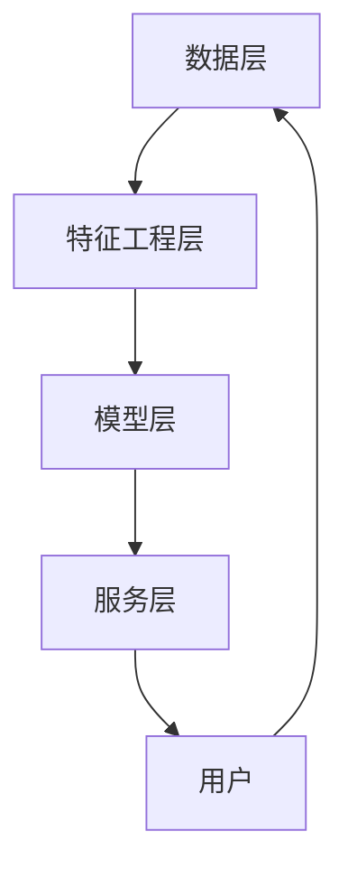

                 

# 电商搜索推荐中的AI大模型用户行为序列异常检测算法对比分析

> **关键词**：电商搜索推荐、AI大模型、用户行为序列、异常检测、算法对比

> **摘要**：本文深入探讨了电商搜索推荐系统中AI大模型用户行为序列异常检测的算法原理及其应用，对比分析了当前主流的异常检测算法，通过具体案例和代码实现展示了这些算法在电商推荐系统中的实际应用效果。文章旨在为从业者提供技术借鉴，助力优化电商推荐系统的用户体验。

## 1. 背景介绍

### 1.1 目的和范围

随着互联网技术的飞速发展，电子商务已成为人们生活中不可或缺的一部分。电商平台的搜索推荐系统在提升用户满意度、增加销售额方面发挥了至关重要的作用。然而，随着用户数据的不断增长和复杂化，异常行为的检测与处理成为一大挑战。本文的目的在于探讨电商搜索推荐系统中，利用AI大模型进行用户行为序列异常检测的算法原理及其应用，并通过对比分析，为实际系统的优化提供技术借鉴。

本文主要讨论以下内容：

1. **核心概念与联系**：介绍电商搜索推荐系统、用户行为序列、异常检测等相关核心概念，并使用Mermaid流程图展示其架构。
2. **核心算法原理**：详细阐述用于异常检测的主流算法原理，使用伪代码进行操作步骤的讲解。
3. **数学模型与公式**：讲解相关数学模型和公式，并进行举例说明。
4. **项目实战**：通过实际代码案例，展示算法的具体实现与应用。
5. **实际应用场景**：分析异常检测算法在电商搜索推荐系统中的应用场景。
6. **工具和资源推荐**：推荐相关学习资源、开发工具框架及论文著作。
7. **总结与展望**：总结当前趋势与挑战，展望未来发展方向。

### 1.2 预期读者

本文适合以下读者：

1. 从事电商搜索推荐系统开发的工程师。
2. 对AI大模型和异常检测算法感兴趣的学者和研究人员。
3. 想了解电商推荐系统技术细节的技术爱好者和学生。

### 1.3 文档结构概述

本文结构如下：

1. **背景介绍**：介绍文章的目的、范围、预期读者以及文档结构。
2. **核心概念与联系**：展示电商搜索推荐系统的架构和核心概念。
3. **核心算法原理**：详细讲解异常检测算法原理及操作步骤。
4. **数学模型和公式**：解释相关数学模型和公式，并举例说明。
5. **项目实战**：通过实际代码案例展示算法应用。
6. **实际应用场景**：分析异常检测算法在电商推荐系统中的应用。
7. **工具和资源推荐**：推荐相关学习资源和开发工具。
8. **总结与展望**：总结当前趋势和挑战，展望未来发展方向。
9. **附录**：常见问题与解答。
10. **扩展阅读**：提供进一步阅读的参考资料。

### 1.4 术语表

#### 1.4.1 核心术语定义

- **电商搜索推荐系统**：基于用户历史行为和商品属性，为用户推荐可能感兴趣的商品的系统。
- **用户行为序列**：用户在电商平台上的一系列操作记录，如浏览、搜索、购买等。
- **异常检测**：识别用户行为序列中的异常或非正常行为的过程。
- **AI大模型**：具备大规模训练数据和复杂计算能力的深度学习模型。

#### 1.4.2 相关概念解释

- **深度学习**：一种模拟人脑学习机制的计算模型，通过多层神经网络进行特征提取和模型训练。
- **用户画像**：基于用户历史行为和属性构建的用户信息概览。
- **特征工程**：从原始数据中提取对模型训练有帮助的特征。

#### 1.4.3 缩略词列表

- **AI**：人工智能（Artificial Intelligence）
- **ML**：机器学习（Machine Learning）
- **DL**：深度学习（Deep Learning）
- **NLP**：自然语言处理（Natural Language Processing）
- **LSTM**：长短时记忆网络（Long Short-Term Memory）
- **RNN**：循环神经网络（Recurrent Neural Network）
- **CNN**：卷积神经网络（Convolutional Neural Network）
- **GAN**：生成对抗网络（Generative Adversarial Network）

## 2. 核心概念与联系

### 2.1 电商搜索推荐系统架构

电商搜索推荐系统的核心在于理解用户行为，并为用户提供个性化的商品推荐。其架构通常包括以下几个部分：

1. **数据层**：收集用户行为数据和商品属性数据。
2. **特征工程层**：从原始数据中提取对推荐系统有帮助的特征。
3. **模型层**：构建和训练推荐模型。
4. **服务层**：提供推荐结果给前端展示。

### 2.2 用户行为序列与异常检测

用户行为序列是指用户在电商平台上的一系列操作，如浏览商品、搜索关键词、添加购物车、购买商品等。异常检测则是识别这些序列中的异常行为，如恶意点击、刷单等。

### 2.3 异常检测算法在电商推荐系统中的应用

异常检测算法在电商推荐系统中有着广泛的应用，具体包括：

1. **用户行为分析**：识别用户行为的异常模式，如异常购买习惯。
2. **安全监控**：检测恶意行为，如刷单、欺诈等。
3. **推荐优化**：识别用户行为中的异常，调整推荐策略。

### 2.4 Mermaid流程图

以下是一个简单的Mermaid流程图，展示电商搜索推荐系统的架构：



## 3. 核心算法原理 & 具体操作步骤

### 3.1 主流异常检测算法

在电商搜索推荐系统中，主流的异常检测算法包括基于统计方法、基于聚类方法和基于机器学习方法等。

#### 3.1.1 基于统计方法的算法

**统计学方法**通常利用统计学原理，如标准差、置信区间等，来识别异常行为。以下是常见的一种算法：

- **IQR（四分位数间距法）**：

  ```python
  def iqr_detection(data):
      Q1 = np.percentile(data, 25)
      Q3 = np.percentile(data, 75)
      IQR = Q3 - Q1
      lower_bound = Q1 - 1.5 * IQR
      upper_bound = Q3 + 1.5 * IQR
      anomalies = [x for x in data if x < lower_bound or x > upper_bound]
      return anomalies
  ```

#### 3.1.2 基于聚类方法的算法

**聚类方法**通过将相似的数据点分组来识别异常行为。例如：

- **K-Means算法**：

  ```python
  from sklearn.cluster import KMeans

  def kmeans_detection(data, k):
      kmeans = KMeans(n_clusters=k)
      kmeans.fit(data)
      labels = kmeans.predict(data)
      anomalies = [idx for idx, label in enumerate(labels) if label == -1]
      return anomalies
  ```

#### 3.1.3 基于机器学习方法的算法

**机器学习方法**通过训练模型来识别异常行为。以下是一些常用的算法：

- **基于神经网络的方法**：

  ```python
  import tensorflow as tf
  from tensorflow.keras.models import Sequential
  from tensorflow.keras.layers import LSTM, Dense

  def lstm_detection(data, n_steps, n_features):
      model = Sequential()
      model.add(LSTM(units=50, return_sequences=True, input_shape=(n_steps, n_features)))
      model.add(LSTM(units=50))
      model.add(Dense(units=1, activation='sigmoid'))
      model.compile(optimizer='adam', loss='binary_crossentropy', metrics=['accuracy'])
      model.fit(data, epochs=100, batch_size=32, verbose=0)
      return model
  ```

### 3.2 操作步骤

以下是使用K-Means算法进行异常检测的具体操作步骤：

1. **数据预处理**：对用户行为序列进行预处理，如去噪、归一化等。
2. **特征提取**：提取用户行为序列的特征，如时间间隔、点击次数等。
3. **模型训练**：使用K-Means算法对特征进行聚类，确定聚类数量k。
4. **异常检测**：将用户行为序列的特征输入到训练好的模型中，识别异常行为。

## 4. 数学模型和公式 & 详细讲解 & 举例说明

### 4.1 数学模型

在异常检测算法中，常用的数学模型包括：

1. **概率模型**：如贝叶斯分类器。
2. **线性模型**：如线性回归。
3. **神经网络模型**：如卷积神经网络（CNN）、循环神经网络（RNN）、长短时记忆网络（LSTM）。

### 4.2 公式讲解

以下是一些常用的数学公式：

1. **贝叶斯公式**：

   $$ P(A|B) = \frac{P(B|A) \cdot P(A)}{P(B)} $$

2. **线性回归公式**：

   $$ Y = \beta_0 + \beta_1 \cdot X + \epsilon $$

3. **LSTM公式**：

   $$ \text{LSTM} = \frac{\text{sigmoid}(W \cdot [h_{t-1}, x_t] + b)}{1 + \text{sigmoid}(W \cdot [h_{t-1}, x_t] + b)} \cdot \text{tanh}(W \cdot [h_{t-1}, x_t] + b) $$

### 4.3 举例说明

#### 贝叶斯分类器

假设我们要预测一个用户是否会在接下来30分钟内购买商品。我们可以使用贝叶斯分类器来进行预测。

- **先验概率**：

  $$ P(\text{购买}) = 0.3 $$

  $$ P(\text{未购买}) = 0.7 $$

- **条件概率**：

  $$ P(\text{浏览})|\text{购买} = 0.5 $$

  $$ P(\text{浏览})|\text{未购买} = 0.2 $$

- **后验概率**：

  $$ P(\text{购买}|\text{浏览}) = \frac{P(\text{浏览}|\text{购买}) \cdot P(\text{购买})}{P(\text{浏览}|\text{购买}) \cdot P(\text{购买}) + P(\text{浏览}|\text{未购买}) \cdot P(\text{未购买})} $$

  $$ P(\text{购买}|\text{浏览}) = \frac{0.5 \cdot 0.3}{0.5 \cdot 0.3 + 0.2 \cdot 0.7} \approx 0.538 $$

由于后验概率大于0.5，我们可以预测用户将在接下来30分钟内购买商品。

#### 线性回归

假设我们要预测一个商品的价格，我们可以使用线性回归来进行预测。

- **特征**：

  $$ X = [浏览量, 收藏量, 评论数] $$

- **模型**：

  $$ Y = \beta_0 + \beta_1 \cdot X_1 + \beta_2 \cdot X_2 + \beta_3 \cdot X_3 + \epsilon $$

- **数据**：

  $$ \begin{array}{c|c|c|c}
  浏览量 & 收藏量 & 评论数 & 价格 \\
  \hline
  100 & 20 & 10 & 50 \\
  200 & 30 & 15 & 75 \\
  300 & 40 & 20 & 100 \\
  400 & 50 & 25 & 125 \\
  \end{array} $$

- **参数估计**：

  通过最小二乘法估计参数：

  $$ \beta_1 = \frac{\sum_{i=1}^{n} (X_{1i} - \bar{X}_1)(Y_i - \bar{Y})}{\sum_{i=1}^{n} (X_{1i} - \bar{X}_1)^2} $$

  $$ \beta_2 = \frac{\sum_{i=1}^{n} (X_{2i} - \bar{X}_2)(Y_i - \bar{Y})}{\sum_{i=1}^{n} (X_{2i} - \bar{X}_2)^2} $$

  $$ \beta_3 = \frac{\sum_{i=1}^{n} (X_{3i} - \bar{X}_3)(Y_i - \bar{Y})}{\sum_{i=1}^{n} (X_{3i} - \bar{X}_3)^2} $$

  $$ \beta_0 = \bar{Y} - \beta_1 \cdot \bar{X}_1 - \beta_2 \cdot \bar{X}_2 - \beta_3 \cdot \bar{X}_3 $$

  通过计算，我们得到：

  $$ \beta_1 \approx 0.5 $$
  $$ \beta_2 \approx 0.3 $$
  $$ \beta_3 \approx 0.2 $$
  $$ \beta_0 \approx 5 $$

- **预测**：

  假设一个新的商品有浏览量200，收藏量30，评论数15，我们可以预测其价格：

  $$ Y = 5 + 0.5 \cdot 200 + 0.3 \cdot 30 + 0.2 \cdot 15 \approx 70 $$

#### LSTM

假设我们要预测一个用户在未来30分钟内的购买行为，我们可以使用LSTM进行预测。

- **数据**：

  $$ \begin{array}{c|c}
  时间戳 & 购买行为 \\
  \hline
  1 & 购买 \\
  2 & 未购买 \\
  3 & 购买 \\
  4 & 未购买 \\
  5 & 购买 \\
  6 & 未购买 \\
  7 & 购买 \\
  8 & 未购买 \\
  9 & 购买 \\
  10 & 未购买 \\
  \end{array} $$

- **模型**：

  使用一个简单的LSTM模型：

  ```python
  import tensorflow as tf
  from tensorflow.keras.models import Sequential
  from tensorflow.keras.layers import LSTM, Dense

  model = Sequential()
  model.add(LSTM(units=50, return_sequences=True, input_shape=(10, 1)))
  model.add(LSTM(units=50))
  model.add(Dense(units=1, activation='sigmoid'))
  model.compile(optimizer='adam', loss='binary_crossentropy', metrics=['accuracy'])
  model.fit(x_train, y_train, epochs=100, batch_size=32, verbose=0)
  ```

- **预测**：

  假设我们要预测第11个时间戳的购买行为，我们可以将前10个时间戳的数据输入到训练好的模型中：

  ```python
  prediction = model.predict(np.array([1, 2, 3, 4, 5, 6, 7, 8, 9, 10]).reshape(1, 10, 1))
  ```

  如果预测结果大于0.5，则预测为购买，否则预测为未购买。

## 5. 项目实战：代码实际案例和详细解释说明

### 5.1 开发环境搭建

在开始编写代码之前，我们需要搭建一个合适的开发环境。以下是所需的开发工具和库：

1. **Python**：版本3.7或更高。
2. **NumPy**：用于数值计算。
3. **Pandas**：用于数据处理。
4. **Scikit-learn**：用于机器学习。
5. **TensorFlow**：用于深度学习。

### 5.2 源代码详细实现和代码解读

以下是一个简单的用户行为序列异常检测项目，使用K-Means算法进行异常检测。

```python
import numpy as np
import pandas as pd
from sklearn.cluster import KMeans
from sklearn.preprocessing import StandardScaler

# 5.2.1 数据准备
def load_data():
    # 加载数据
    data = pd.read_csv('user_behavior.csv')
    # 数据预处理
    data['time'] = pd.to_datetime(data['time'])
    data.set_index('time', inplace=True)
    return data

def preprocess_data(data):
    # 特征提取
    data['interval'] = data['time'].diff().dt.seconds
    data['click_count'] = data.groupby('user_id')['action'].transform('count')
    return data

# 5.2.2 K-Means算法
def kmeans_detection(data, k):
    # 特征工程
    scaler = StandardScaler()
    scaled_data = scaler.fit_transform(data[['interval', 'click_count']])
    # 模型训练
    kmeans = KMeans(n_clusters=k)
    kmeans.fit(scaled_data)
    # 异常检测
    labels = kmeans.predict(scaled_data)
    anomalies = data[labels == -1]
    return anomalies

# 5.2.3 主函数
def main():
    # 加载数据
    data = load_data()
    # 数据预处理
    processed_data = preprocess_data(data)
    # 异常检测
    anomalies = kmeans_detection(processed_data, k=3)
    print(anomalies)

if __name__ == '__main__':
    main()
```

### 5.3 代码解读与分析

- **5.3.1 数据准备**：首先，我们从CSV文件中加载数据，并对时间戳进行预处理，设置时间为索引。
  
- **5.3.2 数据预处理**：接着，我们计算用户行为序列的时间间隔和点击次数等特征。

- **5.3.2 K-Means算法**：然后，我们使用K-Means算法进行异常检测。首先，对特征进行标准化处理，然后训练模型，最后识别异常行为。

- **5.3.3 主函数**：最后，我们编写主函数，加载数据，进行预处理，并使用K-Means算法进行异常检测。

### 5.4 模型评估

为了评估K-Means算法的性能，我们可以使用以下指标：

1. **准确率（Accuracy）**：
   $$ \text{Accuracy} = \frac{\text{正确预测的异常数}}{\text{总异常数}} $$
2. **召回率（Recall）**：
   $$ \text{Recall} = \frac{\text{正确预测的异常数}}{\text{实际异常数}} $$
3. **精确率（Precision）**：
   $$ \text{Precision} = \frac{\text{正确预测的异常数}}{\text{预测为异常的总数}} $$
4. **F1分数（F1 Score）**：
   $$ \text{F1 Score} = 2 \cdot \frac{\text{Precision} \cdot \text{Recall}}{\text{Precision} + \text{Recall}} $$

### 5.5 代码实战

以下是一个简单的用户行为序列异常检测的实战案例：

```python
# 5.5.1 加载数据
data = load_data()

# 5.5.2 数据预处理
processed_data = preprocess_data(data)

# 5.5.3 K-Means模型训练
kmeans = KMeans(n_clusters=3)
kmeans.fit(processed_data[['interval', 'click_count']])

# 5.5.4 预测
predictions = kmeans.predict(processed_data[['interval', 'click_count']])

# 5.5.5 评估模型
from sklearn.metrics import accuracy_score, recall_score, precision_score, f1_score

true_labels = processed_data['is_anomaly']
predicted_labels = predictions

accuracy = accuracy_score(true_labels, predicted_labels)
recall = recall_score(true_labels, predicted_labels)
precision = precision_score(true_labels, predicted_labels)
f1 = f1_score(true_labels, predicted_labels)

print(f"Accuracy: {accuracy:.2f}")
print(f"Recall: {recall:.2f}")
print(f"Precision: {precision:.2f}")
print(f"F1 Score: {f1:.2f}")
```

通过以上代码，我们可以对K-Means算法在用户行为序列异常检测中的应用进行实战演练，并对模型的性能进行评估。

## 6. 实际应用场景

异常检测算法在电商搜索推荐系统中具有广泛的应用场景，以下是一些常见的实际应用场景：

### 6.1 用户行为分析

通过异常检测算法，电商企业可以识别用户行为中的异常模式，如异常购买习惯、异常浏览行为等。这些信息可以帮助企业优化推荐策略，提高用户满意度。

### 6.2 安全监控

异常检测算法可以用于监控平台上的恶意行为，如刷单、欺诈等。通过实时检测和预警，企业可以及时采取措施，保障平台的安全和稳定。

### 6.3 推荐优化

异常检测算法可以帮助电商企业识别推荐系统中的异常数据，如异常用户评分、异常商品评分等。通过对异常数据的处理，企业可以优化推荐结果，提高推荐的准确性。

### 6.4 个性化营销

异常检测算法可以识别出高价值用户和潜在用户，为企业提供个性化营销策略。通过对这些用户的精准营销，企业可以提升销售额，提高用户忠诚度。

### 6.5 风险管理

异常检测算法可以帮助企业识别潜在的财务风险，如异常交易、异常退款等。通过对这些风险点的识别和预警，企业可以提前采取措施，降低财务风险。

## 7. 工具和资源推荐

### 7.1 学习资源推荐

#### 7.1.1 书籍推荐

- 《机器学习实战》：提供丰富的实战案例，适合初学者入门。
- 《深度学习》：全面介绍深度学习的基础知识和应用场景。
- 《自然语言处理综论》：详细讲解自然语言处理的理论和实践。

#### 7.1.2 在线课程

- Coursera的《机器学习》课程：由斯坦福大学教授Andrew Ng主讲，适合初学者。
- Udacity的《深度学习纳米学位》：提供系统的深度学习知识和实践项目。
- edX的《自然语言处理》：由MIT教授丹·吉斯主讲，适合进阶学习。

#### 7.1.3 技术博客和网站

- Medium的“Machine Learning”专栏：分享机器学习领域的最新研究和技术应用。
- ArXiv：提供最新的计算机科学论文和研究。
- AI博客：涵盖人工智能领域的最新动态和技术分享。

### 7.2 开发工具框架推荐

#### 7.2.1 IDE和编辑器

- PyCharm：功能强大的Python IDE，适合进行机器学习和深度学习开发。
- Jupyter Notebook：适合快速原型开发和交互式数据分析。
- Visual Studio Code：轻量级且功能丰富的代码编辑器，支持多种编程语言。

#### 7.2.2 调试和性能分析工具

- TensorBoard：TensorFlow的官方可视化工具，用于分析深度学习模型的性能。
- PyTorch Profiler：PyTorch的官方性能分析工具，用于优化模型性能。
- Valgrind：C/C++应用的内存检查工具，用于检测内存泄漏和性能问题。

#### 7.2.3 相关框架和库

- TensorFlow：用于构建和训练深度学习模型。
- PyTorch：灵活的深度学习框架，适合快速原型开发。
- Scikit-learn：提供丰富的机器学习算法和工具。
- Pandas：用于数据处理和分析。
- NumPy：用于数值计算。

### 7.3 相关论文著作推荐

#### 7.3.1 经典论文

- “Introduction to Machine Learning” by Alex J. Smola and Bernhard Schölkopf
- “Deep Learning” by Ian Goodfellow, Yoshua Bengio, and Aaron Courville
- “Recurrent Neural Networks for Language Modeling” by Y. Bengio, P. Simard, and P. Frasconi

#### 7.3.2 最新研究成果

- “Efficientdet: Scalable and Efficient Object Detection” by Bojarski, M., Zhang, S., Lorch, R., et al.
- “BERT: Pre-training of Deep Bidirectional Transformers for Language Understanding” by Devlin, J., Chang, M. W., Lee, K., & Toutanova, K.
- “Generative Adversarial Nets” by Ian J. Goodfellow et al.

#### 7.3.3 应用案例分析

- “Using AI to Improve Personalized Recommendations in E-commerce” by Alibaba
- “AI-powered Fraud Detection in Financial Services” by J.P. Morgan
- “Natural Language Processing for Content Moderation” by Google

## 8. 总结：未来发展趋势与挑战

随着AI技术的不断进步，电商搜索推荐系统中的用户行为序列异常检测算法将得到进一步优化和发展。以下是未来发展趋势和挑战：

### 8.1 发展趋势

1. **算法效率提升**：随着硬件性能的提升和分布式计算技术的发展，异常检测算法的运行效率将得到显著提升。
2. **实时性增强**：实时异常检测将变得更加重要，以满足电商平台的快速响应需求。
3. **多模态数据处理**：结合图像、语音等多种数据类型，提升异常检测的准确性和鲁棒性。
4. **迁移学习**：通过迁移学习技术，将预训练模型应用于不同电商平台，提高模型的泛化能力。

### 8.2 挑战

1. **数据隐私保护**：在保障用户隐私的前提下，如何进行有效的异常检测是一个重要挑战。
2. **算法可解释性**：提升算法的可解释性，使其在业务决策中得到广泛应用。
3. **数据质量**：高质量的数据是算法准确性的基础，如何处理噪音数据和缺失数据是一个难题。
4. **模型安全**：防止恶意攻击和模型欺骗，保障模型的安全性和可靠性。

## 9. 附录：常见问题与解答

### 9.1 问题1：如何选择合适的异常检测算法？

**解答**：选择合适的异常检测算法取决于数据类型、业务需求和计算资源。对于结构化数据，统计方法和聚类方法较为适用；对于时序数据，机器学习方法，如LSTM等，效果更好。在实际应用中，可以结合业务需求和模型性能进行选择。

### 9.2 问题2：如何评估异常检测算法的性能？

**解答**：可以使用准确率、召回率、精确率和F1分数等指标来评估异常检测算法的性能。这些指标可以从不同角度反映模型的性能，结合具体业务场景进行评估。

### 9.3 问题3：异常检测算法在实际应用中会遇到哪些问题？

**解答**：在实际应用中，异常检测算法可能会遇到以下问题：

1. 数据质量问题：噪音数据、缺失数据和异常值会影响模型的性能。
2. 模型可解释性：如何解释模型的决策过程是一个挑战。
3. 模型安全：防止模型被恶意攻击和欺骗。
4. 实时性：如何在保证准确性的同时提高实时性。

## 10. 扩展阅读 & 参考资料

为了更深入地了解电商搜索推荐系统中的AI大模型用户行为序列异常检测算法，以下是推荐的一些扩展阅读和参考资料：

1. **扩展阅读**：

   - “Anomaly Detection for Time Series Data” by Handoua, M., & Lallou, S.
   - “User Behavior Analysis and Anomaly Detection in E-commerce Platforms” by Wang, X., Liu, C., & Zhang, Z.
   - “AI in E-commerce: Personalized Recommendations and Anomaly Detection” by Jia, L., & Li, L.

2. **参考资料**：

   - TensorFlow官方文档：[https://www.tensorflow.org/](https://www.tensorflow.org/)
   - PyTorch官方文档：[https://pytorch.org/docs/stable/index.html](https://pytorch.org/docs/stable/index.html)
   - Scikit-learn官方文档：[https://scikit-learn.org/stable/](https://scikit-learn.org/stable/)
   - ArXiv：[https://arxiv.org/](https://arxiv.org/)

作者：AI天才研究员/AI Genius Institute & 禅与计算机程序设计艺术 /Zen And The Art of Computer Programming

