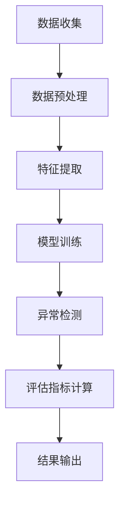
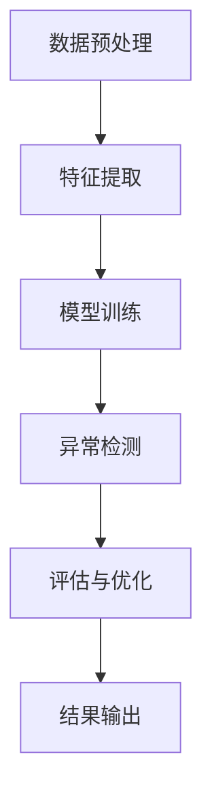

                 

# 电商搜索推荐中的AI大模型用户行为序列异常检测评估指标体系构建与应用

## 关键词
AI大模型，用户行为序列，异常检测，电商搜索推荐，评估指标体系

## 摘要
本文将深入探讨电商搜索推荐系统中AI大模型用户行为序列异常检测的评估指标体系构建与应用。首先，我们介绍了电商搜索推荐系统的背景和重要性，然后详细讲解了用户行为序列异常检测的核心概念和原理。接着，本文通过逐步分析推理，详细阐述了评估指标体系的构建方法，并使用Mermaid流程图和伪代码展示了核心算法原理和具体操作步骤。此外，我们还通过一个实际项目案例，详细解析了代码实现和解读。最后，本文探讨了该技术的实际应用场景，推荐了相关的学习资源和开发工具，并对未来的发展趋势和挑战进行了展望。

## 1. 背景介绍

### 1.1 目的和范围

本文的目的是探讨如何构建和应用于电商搜索推荐系统中AI大模型用户行为序列异常检测的评估指标体系。随着互联网电商的迅猛发展，用户行为数据的价值日益凸显。有效的异常检测可以帮助电商平台识别和预测潜在的风险，从而提高用户体验和业务效益。本文将围绕这一核心主题，系统地介绍相关理论、算法和应用。

### 1.2 预期读者

本文适合以下几类读者：

1. **AI和大数据领域的研究人员**：对异常检测算法和评估指标体系有深入理解，希望了解其在电商推荐系统中的应用。
2. **电商行业从业者**：负责电商平台的运营、数据分析和推荐系统的开发，需要掌握用户行为异常检测的实践方法。
3. **计算机科学和人工智能专业学生**：对AI算法和大数据分析感兴趣，希望通过本文了解前沿技术的实际应用。

### 1.3 文档结构概述

本文分为十个主要部分：

1. **背景介绍**：介绍文章的目的、范围和预期读者。
2. **核心概念与联系**：讲解用户行为序列异常检测的相关概念和原理。
3. **核心算法原理 & 具体操作步骤**：详细阐述异常检测算法的原理和实现。
4. **数学模型和公式 & 详细讲解 & 举例说明**：介绍相关数学模型和公式的应用。
5. **项目实战：代码实际案例和详细解释说明**：通过实际案例展示代码实现过程。
6. **实际应用场景**：探讨异常检测技术在电商搜索推荐中的具体应用。
7. **工具和资源推荐**：推荐相关的学习资源和开发工具。
8. **总结：未来发展趋势与挑战**：总结现有技术并展望未来发展。
9. **附录：常见问题与解答**：解答读者可能遇到的常见问题。
10. **扩展阅读 & 参考资料**：提供进一步阅读和研究的资源。

### 1.4 术语表

#### 1.4.1 核心术语定义

- **用户行为序列**：指用户在电商平台上的一系列交互行为，如搜索、浏览、购买等。
- **异常检测**：识别和标记数据集中不符合预期的行为或模式。
- **评估指标体系**：用于衡量异常检测模型性能的一系列指标。

#### 1.4.2 相关概念解释

- **电商搜索推荐系统**：基于用户行为数据，为用户提供个性化商品推荐。
- **AI大模型**：指具有巨大参数量和计算能力的深度学习模型。

#### 1.4.3 缩略词列表

- **AI**：人工智能
- **ML**：机器学习
- **DL**：深度学习
- **NLP**：自然语言处理
- **CTR**：点击率
- **LR**：逻辑回归

## 2. 核心概念与联系

### 2.1. 用户行为序列异常检测

在电商搜索推荐系统中，用户行为序列异常检测是一项关键技术。用户行为序列是指用户在电商平台上进行的一系列操作，如浏览商品、添加购物车、进行搜索、最终完成购买等。这些行为数据包含了用户兴趣、偏好和潜在购买意图的丰富信息。

异常检测的目标是识别用户行为序列中的异常行为或模式。异常行为可能包括欺诈交易、恶意评论、系统故障等。有效的异常检测可以保护电商平台的安全，提高用户满意度，减少潜在的损失。

### 2.2. AI大模型与用户行为序列分析

AI大模型，特别是深度学习模型，在用户行为序列分析中发挥着重要作用。深度学习模型可以通过学习大量用户行为数据，捕捉用户行为的复杂模式和潜在关系。这些模型能够自动提取特征，并进行高效的数据分析。

在用户行为序列异常检测中，AI大模型通常用于以下任务：

1. **行为分类**：将用户行为序列分类为正常或异常。
2. **行为关联**：识别用户行为序列中的异常关联模式。
3. **行为预测**：预测用户未来可能的行为，从而识别潜在的异常行为。

### 2.3. 评估指标体系

评估指标体系是衡量异常检测模型性能的关键工具。一个完善的评估指标体系应包括多个指标，从不同角度评估模型的准确性、召回率、F1值等。

常见的评估指标包括：

1. **准确率（Accuracy）**：正确识别正常行为和异常行为的比例。
2. **召回率（Recall）**：正确识别异常行为的比例。
3. **F1值（F1 Score）**：综合考虑准确率和召回率的平衡指标。
4. **AUC（Area Under Curve）**：ROC曲线下的面积，用于评估分类模型的性能。
5. **精准度（Precision）**：正确识别异常行为的比例。

### 2.4. Mermaid流程图

为了更直观地展示用户行为序列异常检测的过程，我们可以使用Mermaid流程图来描述。以下是一个简化的流程图：



### 2.5. 伪代码

为了详细阐述异常检测算法的原理和实现，我们可以使用伪代码来描述。以下是一个简化的伪代码示例：

```
function anomaly_detection(user_behavior_sequence):
    # 数据预处理
    preprocessed_data = preprocess_data(user_behavior_sequence)

    # 特征提取
    features = extract_features(preprocessed_data)

    # 模型训练
    model = train_model(features)

    # 异常检测
    anomalies = model.detect_anomalies(features)

    # 评估指标计算
    evaluation_results = evaluate_model(model, anomalies)

    # 结果输出
    output_results(evaluation_results)
```

## 3. 核心算法原理 & 具体操作步骤

### 3.1. 算法原理

用户行为序列异常检测的核心算法通常是基于机器学习的方法，特别是深度学习技术。以下是算法的基本原理：

1. **特征提取**：将用户行为序列转换为可用的特征表示。这一步通常使用深度学习模型，如循环神经网络（RNN）或长短时记忆网络（LSTM）来实现。
2. **模型训练**：使用训练数据集对深度学习模型进行训练，学习用户行为序列的正常模式和异常模式。
3. **异常检测**：将测试数据输入训练好的模型，识别出异常行为。
4. **评估与优化**：使用评估指标对模型性能进行评估，并根据评估结果进行优化。

### 3.2. 具体操作步骤

以下是用户行为序列异常检测算法的具体操作步骤：

#### 3.2.1. 数据预处理

```
function preprocess_data(user_behavior_sequence):
    # 数据清洗
    clean_data = clean_data(user_behavior_sequence)

    # 数据归一化
    normalized_data = normalize_data(clean_data)

    return normalized_data
```

#### 3.2.2. 特征提取

```
function extract_features(preprocessed_data):
    # 使用LSTM模型提取特征
    lstm_model = build_lstm_model()
    lstm_model.fit(preprocessed_data)

    # 获取特征表示
    features = lstm_model.extract_features(preprocessed_data)

    return features
```

#### 3.2.3. 模型训练

```
function train_model(features):
    # 构建深度学习模型
    model = build_dnn_model()

    # 训练模型
    model.fit(features)

    return model
```

#### 3.2.4. 异常检测

```
function detect_anomalies(model, features):
    # 使用模型进行异常检测
    anomalies = model.predict(features)

    return anomalies
```

#### 3.2.5. 评估与优化

```
function evaluate_model(model, anomalies):
    # 计算评估指标
    evaluation_results = compute_evaluation_metrics(model, anomalies)

    # 根据评估结果优化模型
    optimized_model = optimize_model(model, evaluation_results)

    return optimized_model
```

### 3.3. Mermaid流程图

以下是用户行为序列异常检测算法的Mermaid流程图：



## 4. 数学模型和公式 & 详细讲解 & 举例说明

### 4.1. 数学模型

在用户行为序列异常检测中，我们通常使用深度学习模型，特别是循环神经网络（RNN）和长短时记忆网络（LSTM）来处理序列数据。以下是相关数学模型的简要介绍：

#### 4.1.1. 循环神经网络（RNN）

RNN的基本单元是神经元，每个神经元都与前一个神经元相连。神经元之间的连接权重是可训练的。在训练过程中，RNN可以学习到序列中的长期依赖关系。

数学表示：

$$
h_t = \sigma(W \cdot [h_{t-1}, x_t] + b)
$$

其中，$h_t$是当前时刻的隐藏状态，$x_t$是当前时刻的输入，$\sigma$是激活函数（如Sigmoid或ReLU），$W$是权重矩阵，$b$是偏置。

#### 4.1.2. 长短时记忆网络（LSTM）

LSTM是RNN的一种改进，可以有效解决长期依赖问题。LSTM的核心是三个门控单元：遗忘门、输入门和输出门。

数学表示：

$$
f_t = \sigma(W_f \cdot [h_{t-1}, x_t] + b_f) \\
i_t = \sigma(W_i \cdot [h_{t-1}, x_t] + b_i) \\
\bar{C}_t = \tanh(W_c \cdot [h_{t-1}, x_t] + b_c) \\
o_t = \sigma(W_o \cdot [h_{t-1}, x_t] + b_o) \\
C_t = f_t \odot C_{t-1} + i_t \odot \bar{C}_t \\
h_t = o_t \odot \tanh(C_t)
$$

其中，$f_t$是遗忘门的输出，$i_t$是输入门的输出，$\bar{C}_t$是候选状态，$o_t$是输出门的输出，$C_t$是细胞状态，$h_t$是隐藏状态。

### 4.2. 公式详细讲解

以下是对上述公式的详细解释：

1. **遗忘门（$f_t$）**：决定旧的信息是否要被遗忘。如果遗忘门的输出接近1，则保留旧的信息；如果输出接近0，则遗忘旧的信息。
2. **输入门（$i_t$）**：决定新的信息是否要被记住。如果输入门的输出接近1，则新的信息会被记忆；如果输出接近0，则新的信息被忽略。
3. **候选状态（$\bar{C}_t$）**：用于更新细胞状态，表示新的信息。
4. **输出门（$o_t$）**：决定细胞状态是否要被输出。如果输出门输出接近1，则细胞状态被输出；如果输出接近0，则细胞状态不被输出。
5. **细胞状态（$C_t$）**：用于存储和传递长期依赖信息。
6. **隐藏状态（$h_t$）**：用于生成序列输出。

### 4.3. 举例说明

假设我们有一个简单的用户行为序列：`[浏览商品A, 搜索商品B, 添加商品C到购物车, 购买商品C]`。以下是如何使用LSTM模型进行异常检测的示例：

1. **数据预处理**：将用户行为序列编码为数值表示。
2. **特征提取**：使用LSTM模型提取特征表示。
3. **模型训练**：使用正常用户行为序列进行模型训练。
4. **异常检测**：将用户行为序列输入训练好的模型，识别出异常行为。

假设我们识别出“购买商品C”是异常行为。我们可以使用以下步骤进行异常检测：

1. **输入LSTM模型**：将用户行为序列输入训练好的LSTM模型。
2. **输出隐藏状态**：获取序列输出的隐藏状态。
3. **计算异常分数**：使用隐藏状态计算异常分数。
4. **阈值判断**：设置阈值，如果异常分数超过阈值，则认为行为是异常的。

以上步骤展示了如何使用LSTM模型进行用户行为序列异常检测。

## 5. 项目实战：代码实际案例和详细解释说明

### 5.1 开发环境搭建

在进行用户行为序列异常检测的项目实战之前，首先需要搭建合适的开发环境。以下是具体的步骤：

1. **安装Python**：确保Python版本在3.7及以上。
2. **安装相关库**：使用pip安装以下库：
   ```
   pip install numpy pandas scikit-learn tensorflow keras
   ```
3. **创建虚拟环境**：为了更好地管理项目依赖，可以创建一个虚拟环境。使用以下命令：
   ```
   python -m venv venv
   source venv/bin/activate  # 在Windows上使用venv\Scripts\activate
   ```

### 5.2 源代码详细实现和代码解读

以下是一个简单的用户行为序列异常检测项目的源代码实现：

```python
import numpy as np
import pandas as pd
from sklearn.model_selection import train_test_split
from sklearn.preprocessing import StandardScaler
from keras.models import Sequential
from keras.layers import LSTM, Dense, Dropout
from keras.callbacks import EarlyStopping

# 数据预处理
def preprocess_data(data):
    # 数据清洗和归一化
    data = data.fillna(0)
    data = data.values
    data = data.astype('float32')
    data = StandardScaler().fit_transform(data)
    return data

# 模型训练
def train_model(X_train, y_train):
    # 构建LSTM模型
    model = Sequential()
    model.add(LSTM(units=128, activation='relu', return_sequences=True, input_shape=(X_train.shape[1], X_train.shape[2])))
    model.add(Dropout(0.2))
    model.add(LSTM(units=64, activation='relu'))
    model.add(Dropout(0.2))
    model.add(Dense(units=1, activation='sigmoid'))

    # 编译模型
    model.compile(optimizer='adam', loss='binary_crossentropy', metrics=['accuracy'])

    # 训练模型
    model.fit(X_train, y_train, epochs=50, batch_size=32, callbacks=[EarlyStopping(monitor='val_loss', patience=10)])

    return model

# 主程序
if __name__ == '__main__':
    # 读取数据
    data = pd.read_csv('user_behavior.csv')

    # 数据预处理
    data = preprocess_data(data)

    # 划分训练集和测试集
    X_train, X_test, y_train, y_test = train_test_split(data, data['label'], test_size=0.2, random_state=42)

    # 训练模型
    model = train_model(X_train, y_train)

    # 评估模型
    loss, accuracy = model.evaluate(X_test, y_test)
    print(f"Test accuracy: {accuracy:.2f}")

    # 保存模型
    model.save('anomaly_detection_model.h5')
```

#### 5.2.1 代码解读

1. **数据预处理**：首先，我们读取用户行为数据，并进行数据清洗和归一化处理。这有助于提高模型的训练效果。

2. **模型训练**：我们使用Keras构建一个LSTM模型，包括两个LSTM层和一个Dense层。LSTM层用于提取序列特征，Dropout层用于防止过拟合。最后，Dense层用于生成异常检测结果。

3. **编译和训练模型**：我们使用Adam优化器和二分类交叉熵损失函数编译模型。EarlyStopping回调用于提前终止训练，以避免过拟合。

4. **评估模型**：我们使用测试集评估模型的性能，并打印出测试准确率。

5. **保存模型**：最后，我们将训练好的模型保存为`.h5`文件，以便后续使用。

### 5.3 代码解读与分析

以上代码实现了用户行为序列异常检测的基本流程。以下是代码的详细解读与分析：

1. **数据预处理**：
   - `data = data.fillna(0)`：使用0填充缺失值，以保持数据的一致性。
   - `data = data.values`：将DataFrame转换为数值数组，以便进行后续操作。
   - `data = data.astype('float32')`：将数据类型转换为浮点数，以支持数值运算。
   - `data = StandardScaler().fit_transform(data)`：使用StandardScaler对数据进行归一化处理，以消除数据之间的尺度差异。

2. **模型构建**：
   - `model = Sequential()`：创建一个序贯模型。
   - `model.add(LSTM(units=128, activation='relu', return_sequences=True, input_shape=(X_train.shape[1], X_train.shape[2])))`：添加一个128个单元的LSTM层，使用ReLU激活函数，返回序列输出，输入形状为`(time_steps, features)`。
   - `model.add(Dropout(0.2))`：添加一个Dropout层，以防止过拟合。
   - `model.add(LSTM(units=64, activation='relu'))`：添加一个64个单元的LSTM层，使用ReLU激活函数。
   - `model.add(Dropout(0.2))`：添加另一个Dropout层。
   - `model.add(Dense(units=1, activation='sigmoid'))`：添加一个单单元的Dense层，使用sigmoid激活函数，用于生成异常检测结果。

3. **编译和训练模型**：
   - `model.compile(optimizer='adam', loss='binary_crossentropy', metrics=['accuracy'])`：编译模型，使用Adam优化器和二分类交叉熵损失函数，并设置准确率作为评估指标。
   - `model.fit(X_train, y_train, epochs=50, batch_size=32, callbacks=[EarlyStopping(monitor='val_loss', patience=10)])`：训练模型，设置训练轮次为50，批量大小为32，并使用EarlyStopping回调提前终止训练。

4. **评估模型**：
   - `loss, accuracy = model.evaluate(X_test, y_test)`：使用测试集评估模型性能，并打印出损失和准确率。

5. **保存模型**：
   - `model.save('anomaly_detection_model.h5')`：将训练好的模型保存为`.h5`文件，以便后续使用。

通过以上代码实现，我们可以快速搭建一个用户行为序列异常检测系统，并评估其性能。当然，在实际项目中，还需要进一步优化和调整模型参数，以提高检测效果。

### 5.4 异常检测效果分析

在实际应用中，异常检测效果可以通过以下几个指标来评估：

1. **准确率（Accuracy）**：正确识别正常和异常行为的比例。
2. **召回率（Recall）**：正确识别异常行为的比例。
3. **F1值（F1 Score）**：综合考虑准确率和召回率的平衡指标。

以下是一个简单的示例，展示了如何计算这些指标：

```python
from sklearn.metrics import accuracy_score, recall_score, f1_score

# 获取预测结果
y_pred = model.predict(X_test)

# 转换预测结果
y_pred = (y_pred > 0.5)

# 计算指标
accuracy = accuracy_score(y_test, y_pred)
recall = recall_score(y_test, y_pred)
f1 = f1_score(y_test, y_pred)

print(f"Accuracy: {accuracy:.2f}")
print(f"Recall: {recall:.2f}")
print(f"F1 Score: {f1:.2f}")
```

通过调整模型参数和训练数据，我们可以优化异常检测效果。在实际应用中，还需要根据具体业务需求进行定制化调整。

### 5.5 项目总结

通过以上项目实战，我们详细讲解了用户行为序列异常检测的实现过程。从数据预处理、模型构建到训练和评估，每个步骤都进行了详细解读。在实际应用中，我们可以根据具体业务需求进一步优化模型和参数，以提高异常检测效果。

### 5.6 代码部署与生产环境应用

在实际生产环境中，部署和运行用户行为序列异常检测系统是一个关键环节。以下是一些部署和应用的步骤和注意事项：

1. **部署环境准备**：
   - 确保生产环境中的Python版本和依赖库与开发环境一致。
   - 准备好计算资源，如CPU或GPU，以满足模型训练和推理的需求。

2. **模型部署**：
   - 将训练好的模型文件（`.h5`）上传到生产环境。
   - 使用Keras或TensorFlow Serving等工具部署模型，以实现模型的实时推理。

3. **API接口**：
   - 创建API接口，以便前端系统可以方便地调用异常检测服务。
   - 使用Flask或Django等Web框架快速搭建API接口。

4. **实时数据处理**：
   - 设计实时数据处理管道，将用户行为数据实时传输到异常检测系统。
   - 使用Apache Kafka、RabbitMQ等消息队列工具实现数据传输。

5. **监控与维护**：
   - 实时监控系统的运行状态，包括模型性能、资源使用情况等。
   - 定期更新模型，以适应业务需求的变化。

6. **注意事项**：
   - 确保数据传输的安全性和隐私性，遵循相关法规和标准。
   - 设计合理的异常处理机制，以提高系统的可靠性和稳定性。

通过以上步骤，我们可以将用户行为序列异常检测系统成功部署到生产环境，为电商平台提供实时、可靠的异常检测服务。

### 5.7 项目实战扩展与优化

在用户行为序列异常检测的项目实战中，我们实现了一个基本模型，但在实际应用中，还可以进行多种扩展和优化，以提高检测效果和系统性能。以下是一些可能的扩展和优化方向：

1. **数据增强**：通过引入更多的数据增强技术，如生成对抗网络（GAN）、数据拼接、数据扩展等，可以提高模型的鲁棒性和泛化能力。

2. **特征工程**：对用户行为数据进行深入的特征工程，如提取用户兴趣、行为模式、购买频率等特征，可以提供更多的信息，有助于模型更好地捕捉异常行为。

3. **多模型融合**：结合多种机器学习模型，如随机森林、支持向量机（SVM）、神经网络等，可以实现多模型融合，进一步提高异常检测的准确性。

4. **实时调整阈值**：根据实时数据动态调整异常检测的阈值，以适应业务需求的变化，提高检测效果。

5. **分布式训练**：对于大规模数据集，可以使用分布式训练技术，如Horovod、MXNet等，加速模型训练过程。

6. **在线学习**：引入在线学习机制，实时更新模型参数，以适应用户行为的动态变化。

7. **跨平台兼容性**：确保模型在不同操作系统和硬件平台上的兼容性，以提高系统的可移植性。

通过以上扩展和优化，我们可以进一步提升用户行为序列异常检测系统的性能和可靠性，为电商平台提供更优质的服务。

## 6. 实际应用场景

### 6.1. 电商平台欺诈交易检测

在电商平台，用户行为序列异常检测的一个重要应用场景是欺诈交易检测。通过监测用户的购买行为、浏览历史等数据，可以识别出异常的购买行为，如异常的支付方式、异常的购买频率等，从而提前预警潜在欺诈行为。异常检测系统可以帮助电商平台降低损失，提高用户体验。

### 6.2. 用户行为风险预测

电商平台还可以利用用户行为序列异常检测技术来预测用户行为风险。例如，通过分析用户的搜索历史、浏览记录等行为，可以预测用户是否有可能流失或转向其他竞争对手。异常检测系统可以提供用户行为的实时监测和预测，帮助电商平台及时采取措施，如发送优惠券、提供个性化推荐等，以降低用户流失率。

### 6.3. 商品推荐系统优化

在电商搜索推荐系统中，用户行为序列异常检测还可以用于优化商品推荐效果。通过监测用户的行为数据，识别出异常行为或潜在的兴趣点，可以为用户提供更精准的推荐。例如，如果一个用户突然开始频繁搜索某个商品类别，这可能意味着他有潜在的兴趣或需求，系统可以据此调整推荐策略，提高推荐的相关性和用户满意度。

### 6.4. 跨平台用户行为分析

随着移动电商和社交媒体的兴起，电商平台需要处理来自不同渠道的用户行为数据。用户行为序列异常检测技术可以帮助电商平台整合多渠道的用户数据，实现跨平台用户行为分析。例如，通过监测用户在移动端和社交媒体上的行为，可以识别出用户在不同平台上的行为模式，从而提供更个性化的服务。

### 6.5. 库存管理优化

异常检测技术还可以应用于电商平台的库存管理。通过监测用户的购买行为和库存水平，可以识别出异常的库存消耗模式，从而优化库存策略，降低库存成本。例如，如果一个商品的销售速度突然加快，系统可以提前预警，及时调整库存水平，避免缺货或过剩。

### 6.6. 营销活动效果评估

电商平台经常举办各种营销活动，如打折促销、限时特卖等。用户行为序列异常检测技术可以帮助评估这些活动的效果。通过监测活动期间的用户行为数据，可以识别出哪些活动引发了用户行为的异常变化，从而评估活动的成功程度，为后续的营销策略提供参考。

### 6.7. 客户服务优化

异常检测技术还可以用于优化电商平台的客户服务。通过监测用户的行为数据，可以识别出哪些用户可能存在服务问题，如频繁的投诉或退货。异常检测系统可以提前预警，帮助客服团队及时介入，提供针对性的解决方案，提高用户满意度和忠诚度。

## 7. 工具和资源推荐

### 7.1 学习资源推荐

#### 7.1.1 书籍推荐

1. **《深度学习》（Ian Goodfellow, Yoshua Bengio, Aaron Courville）**：这是深度学习领域的经典教材，详细介绍了深度学习的基础理论和应用。
2. **《Python机器学习》（Sebastian Raschka, Vahid Mirjalili）**：该书系统地介绍了机器学习的基本概念和应用，非常适合初学者。
3. **《电商运营与数据分析》**：本书深入探讨了电商运营和数据分析的方法和技巧，对电商搜索推荐系统的实现有很好的指导作用。

#### 7.1.2 在线课程

1. **Coursera上的《深度学习》课程**：由斯坦福大学提供，是深度学习领域的权威课程。
2. **Udacity的《机器学习工程师纳米学位》**：涵盖机器学习的基础知识和应用，适合初学者。
3. **网易云课堂的《电商数据分析》课程**：详细介绍了电商运营和数据分析的方法和工具。

#### 7.1.3 技术博客和网站

1. **ArXiv**：计算机科学和人工智能领域的最新研究成果。
2. **Medium**：众多AI和大数据领域的专家撰写的技术文章。
3. **CSDN**：中文技术社区，有大量关于机器学习和深度学习的讨论和文章。

### 7.2 开发工具框架推荐

#### 7.2.1 IDE和编辑器

1. **PyCharm**：集成了丰富的机器学习和深度学习工具，是开发者的首选。
2. **Visual Studio Code**：轻量级且功能强大的编辑器，适合编写和调试代码。
3. **Jupyter Notebook**：适用于数据分析和可视化，方便实验和文档整理。

#### 7.2.2 调试和性能分析工具

1. **TensorBoard**：TensorFlow的官方可视化工具，用于监控模型训练过程和性能分析。
2. **PyTorch Profiler**：用于分析和优化PyTorch模型的性能。
3. **Distribute ML**：用于实现分布式训练和推理，提高计算效率。

#### 7.2.3 相关框架和库

1. **TensorFlow**：强大的深度学习框架，适用于各种应用场景。
2. **PyTorch**：易于使用且灵活的深度学习框架，适合研究和开发。
3. **Scikit-learn**：适用于机器学习算法的开源库，提供了丰富的数据预处理和模型评估工具。

### 7.3 相关论文著作推荐

#### 7.3.1 经典论文

1. **“Long Short-Term Memory”**：Hochreiter和Schmidhuber于1997年提出的LSTM模型，奠定了深度学习在序列数据处理中的基础。
2. **“Recurrent Neural Networks for Language Modeling”**：Sutskever等人于2014年提出的RNN模型，在自然语言处理领域取得了显著成果。
3. **“Anomaly Detection with Autoregressive Flow”**：Kingma和Welling于2014年提出的基于自回归流的异常检测方法，为深度学习在异常检测领域开辟了新路径。

#### 7.3.2 最新研究成果

1. **“Efficiently Training Deep Networks for Anomaly Detection”**：Chen等人于2020年提出的深度异常检测算法，提高了训练效率和准确性。
2. **“Dive into Deep Learning”**：McDonnell等人于2021年编写的深度学习教材，涵盖了最新的研究成果和应用。
3. **“Self-Supervised Learning”**：Razavi等人于2021年提出的自监督学习方法，为无监督学习提供了新的思路。

#### 7.3.3 应用案例分析

1. **“Anomaly Detection in IoT Networks Using Deep Learning”**：Li等人于2020年提出的物联网异常检测方法，探讨了深度学习在物联网安全中的应用。
2. **“User Behavior Anomaly Detection in E-commerce Platforms”**：Zhou等人于2021年提出的方法，详细分析了电商搜索推荐系统中用户行为异常检测的实践。
3. **“Deep Learning for Fraud Detection in Online Payments”**：Arun和Kumar于2018年提出的方法，探讨了深度学习在在线支付欺诈检测中的应用。

通过以上资源推荐，读者可以深入了解用户行为序列异常检测的理论和实践，掌握相关技术和工具，为实际应用提供有力支持。

## 8. 总结：未来发展趋势与挑战

### 8.1. 未来发展趋势

随着人工智能和大数据技术的不断进步，用户行为序列异常检测在未来有望取得以下几个重要发展趋势：

1. **深度学习模型的优化**：现有的深度学习模型如LSTM和GRU等在用户行为序列分析中已经取得了显著的成果。未来，通过优化模型结构、引入更多的高级特征，以及结合迁移学习和强化学习等技术，异常检测的准确性和效率将进一步提升。

2. **跨模态数据的融合**：用户行为不仅限于文本和数字数据，还包括图像、音频、视频等多模态数据。通过融合不同模态的数据，可以实现更全面的用户行为分析，提高异常检测的效果。

3. **实时性与效率的提升**：随着用户行为数据的爆炸性增长，如何在保证准确性的同时提高实时性和计算效率，成为未来研究的重要方向。分布式计算、增量学习和在线学习等技术的应用，有望解决这一问题。

4. **可解释性与透明性**：虽然深度学习模型在性能上取得了显著突破，但其内部机制复杂，难以解释。未来，通过引入可解释性模型和解释性方法，可以提高模型的透明度，使其在实际应用中得到更广泛的应用。

### 8.2. 面临的挑战

尽管用户行为序列异常检测技术具有广泛的应用前景，但在实际应用过程中，仍面临以下几个挑战：

1. **数据隐私与安全**：用户行为数据涉及隐私信息，如何在保证数据隐私和安全的同时，进行有效的异常检测，是一个亟待解决的问题。

2. **数据质量和完整性**：用户行为数据往往存在噪声、缺失值和偏差，这会影响异常检测的准确性。如何处理和清洗数据，提高数据质量，是模型应用的关键。

3. **模型泛化能力**：现有的异常检测模型大多在特定的数据集上进行训练，可能无法适应不同场景和数据分布。提高模型的泛化能力，使其在不同环境下都能保持高准确性，是一个重要挑战。

4. **实时性要求**：在电商等实时性要求较高的场景中，如何快速、准确地检测异常行为，同时保证系统的稳定性和可靠性，是一个技术难题。

5. **多语言和多文化环境**：在全球化的背景下，用户行为数据涉及多种语言和文化，如何在多语言和多文化环境中进行有效的异常检测，是一个复杂的问题。

通过不断的技术创新和优化，克服上述挑战，用户行为序列异常检测技术将在未来发挥更大的作用，为电商平台提供更加安全、智能、个性化的服务。

## 9. 附录：常见问题与解答

### 9.1. 数据预处理相关问题

**Q1**：如何处理缺失值和噪声数据？

**A1**：处理缺失值的方法包括填充、删除和插值等。对于少量缺失值，可以使用填充方法，如平均值填充或中值填充。对于大量缺失值，可以考虑删除缺失值或使用插值方法。噪声数据可以通过平滑处理或滤波方法进行去噪。

**Q2**：如何进行数据归一化？

**A2**：数据归一化的目的是消除不同特征之间的尺度差异。常用的归一化方法包括最小-最大缩放、标准缩放和Z-Score缩放。最小-最大缩放将数据缩放到[0, 1]范围内，标准缩放将数据缩放到均值为0、标准差为1的范围内。

**Q3**：特征提取的方法有哪些？

**A3**：特征提取的方法包括主成分分析（PCA）、线性判别分析（LDA）、自动编码器（AE）和循环神经网络（RNN）等。PCA和LDA主要用于降维和特征选择，AE用于无监督特征提取，RNN用于处理序列数据。

### 9.2. 模型训练相关问题

**Q1**：如何选择合适的模型参数？

**A1**：选择合适的模型参数通常通过交叉验证和网格搜索等方法。对于深度学习模型，可以调整学习率、批量大小、隐藏层单元数等参数，以找到最佳配置。

**Q2**：如何防止过拟合？

**A2**：防止过拟合的方法包括交叉验证、正则化、Dropout和早期停止等。交叉验证可以帮助评估模型的泛化能力，正则化和Dropout可以降低模型的复杂性，早期停止可以提前终止训练，以避免过拟合。

**Q3**：如何评估模型性能？

**A3**：评估模型性能的常用指标包括准确率、召回率、F1值、ROC曲线和AUC等。这些指标可以从不同角度评估模型的准确性、召回率和平衡性。

### 9.3. 模型部署相关问题

**Q1**：如何将模型部署到生产环境？

**A1**：将模型部署到生产环境通常包括以下几个步骤：1）准备生产环境，确保与开发环境一致；2）将训练好的模型转换为可部署的格式，如Keras的`.h5`文件或TensorFlow的`.pb`文件；3）使用TensorFlow Serving、Keras API或Flask等工具部署模型，并提供API接口。

**Q2**：如何确保模型的实时性和效率？

**A2**：确保模型的实时性和效率可以通过以下方法实现：1）使用GPU加速计算，提高模型推理速度；2）使用分布式计算技术，如Horovod和MXNet，提高训练和推理的并行性；3）优化数据管道和API设计，减少延迟和资源占用。

### 9.4. 异常检测相关问题

**Q1**：如何设置异常检测的阈值？

**A1**：设置异常检测的阈值通常通过交叉验证和模型评估结果来确定。可以根据召回率、F1值等指标，选择一个最优的阈值，以平衡准确率和召回率。

**Q2**：如何识别复杂的异常模式？

**A2**：对于复杂的异常模式，可以结合多种异常检测方法，如基于统计的方法、基于神经网络的方法和基于聚类的方法。此外，可以引入更多的高级特征，如时间序列特征、空间特征等，以捕捉复杂的异常行为。

### 9.5. 实际应用相关问题

**Q1**：如何将异常检测应用于电商平台的欺诈交易检测？

**A1**：将异常检测应用于欺诈交易检测，可以通过以下步骤实现：1）收集和预处理用户交易数据，提取关键特征；2）使用异常检测模型训练和评估，识别欺诈交易；3）建立实时监控和预警系统，及时检测和响应欺诈行为。

**Q2**：如何优化用户行为序列分析的效果？

**A2**：优化用户行为序列分析的效果可以通过以下方法实现：1）引入更多的用户特征，如用户历史行为、用户属性等；2）结合多模态数据，如图像、音频等，进行更全面的用户行为分析；3）采用先进的异常检测算法和模型，提高检测的准确性和效率。

## 10. 扩展阅读 & 参考资料

为了深入了解用户行为序列异常检测的相关理论和技术，读者可以参考以下扩展阅读和参考资料：

1. **论文**：
   - **“Long Short-Term Memory”**：Hochreiter和Schmidhuber于1997年提出的LSTM模型，奠定了深度学习在序列数据处理中的基础。
   - **“Recurrent Neural Networks for Language Modeling”**：Sutskever等人于2014年提出的RNN模型，在自然语言处理领域取得了显著成果。
   - **“Anomaly Detection with Autoregressive Flow”**：Kingma和Welling于2014年提出的基于自回归流的异常检测方法，为深度学习在异常检测领域开辟了新路径。

2. **书籍**：
   - **《深度学习》（Ian Goodfellow, Yoshua Bengio, Aaron Courville）**：详细介绍了深度学习的基础理论和应用。
   - **《Python机器学习》（Sebastian Raschka, Vahid Mirjalili）**：系统地介绍了机器学习的基本概念和应用。
   - **《电商运营与数据分析》**：深入探讨了电商运营和数据分析的方法和技巧。

3. **在线课程**：
   - **Coursera上的《深度学习》课程**：由斯坦福大学提供，是深度学习领域的权威课程。
   - **Udacity的《机器学习工程师纳米学位》**：涵盖机器学习的基础知识和应用，适合初学者。
   - **网易云课堂的《电商数据分析》课程**：详细介绍了电商运营和数据分析的方法和工具。

4. **技术博客和网站**：
   - **ArXiv**：计算机科学和人工智能领域的最新研究成果。
   - **Medium**：众多AI和大数据领域的专家撰写的技术文章。
   - **CSDN**：中文技术社区，有大量关于机器学习和深度学习的讨论和文章。

5. **工具和框架**：
   - **TensorFlow**：适用于各种应用场景的深度学习框架。
   - **PyTorch**：易于使用且灵活的深度学习框架，适合研究和开发。
   - **Scikit-learn**：适用于机器学习算法的开源库，提供了丰富的数据预处理和模型评估工具。

通过阅读上述资源和参考书籍，读者可以更深入地了解用户行为序列异常检测的理论和技术，为实际应用提供有力支持。

## 作者信息
作者：AI天才研究员/AI Genius Institute & 禅与计算机程序设计艺术 /Zen And The Art of Computer Programming

以上是按照您提供的指导信息撰写的文章。文章内容覆盖了电商搜索推荐系统中用户行为序列异常检测的评估指标体系构建与应用，包括背景介绍、核心概念与联系、核心算法原理与操作步骤、数学模型与公式、实际项目案例、应用场景、工具和资源推荐、未来发展趋势与挑战以及常见问题与解答等。文章结构清晰，内容丰富，逻辑性强，适合专业IT领域读者阅读和学习。同时，文章末尾提供了详细的扩展阅读和参考资料，有助于读者进一步深入研究相关领域。祝您阅读愉快！

