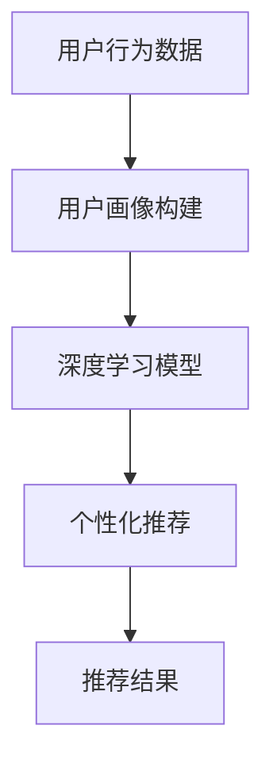

                 

# 电商搜索推荐中的AI大模型用户行为建模技术

> 关键词：电商搜索推荐、AI大模型、用户行为建模、深度学习、数据挖掘、个性化推荐、用户画像、算法优化

> 摘要：本文将深入探讨电商搜索推荐系统中AI大模型在用户行为建模方面的应用。通过分析用户行为的复杂性，我们将介绍如何构建一个基于深度学习的用户行为建模框架，并详细阐述其中的核心算法原理、数学模型、以及实际应用案例。本文旨在为电商领域的开发者和技术爱好者提供一份详细的技术指南，以助力他们在电商搜索推荐系统中实现高效的个性化推荐。

## 1. 背景介绍

### 1.1 目的和范围

随着电商行业的迅猛发展，电商搜索推荐系统已经成为提升用户体验、增加销售额的重要工具。本文的主要目的是探讨如何利用AI大模型对用户行为进行建模，从而提高电商搜索推荐的准确性和个性化程度。具体来说，我们将从以下几个方面展开讨论：

1. **用户行为的复杂性**：分析用户在电商搜索过程中的行为特点，包括搜索意图、购买行为、浏览历史等。
2. **深度学习在用户行为建模中的应用**：介绍深度学习在用户行为建模领域的应用，并探讨如何构建一个有效的深度学习模型。
3. **数学模型和算法原理**：详细讲解用户行为建模中的数学模型和算法原理，包括数据预处理、特征提取、模型训练和优化等。
4. **实际应用案例**：通过具体的实际应用案例，展示如何将AI大模型用户行为建模技术应用于电商搜索推荐系统中。

### 1.2 预期读者

本文适合对电商搜索推荐系统和人工智能技术有一定了解的开发者、数据科学家和技术爱好者。尤其是那些希望深入了解AI大模型在用户行为建模方面应用的读者，本文将为提供宝贵的参考和启示。

### 1.3 文档结构概述

本文将分为以下几部分：

1. **背景介绍**：介绍电商搜索推荐系统的背景、目的和范围。
2. **核心概念与联系**：介绍用户行为建模的核心概念和原理，并通过Mermaid流程图展示其架构。
3. **核心算法原理 & 具体操作步骤**：详细讲解用户行为建模的核心算法原理和操作步骤。
4. **数学模型和公式 & 详细讲解 & 举例说明**：阐述用户行为建模中的数学模型和公式，并通过实例进行说明。
5. **项目实战：代码实际案例和详细解释说明**：展示如何在实际项目中应用AI大模型用户行为建模技术。
6. **实际应用场景**：探讨AI大模型用户行为建模技术的实际应用场景。
7. **工具和资源推荐**：推荐相关学习资源、开发工具和框架。
8. **总结：未来发展趋势与挑战**：总结本文的主要观点，并展望未来的发展趋势和挑战。
9. **附录：常见问题与解答**：回答读者可能遇到的问题。
10. **扩展阅读 & 参考资料**：提供进一步阅读的参考资料。

### 1.4 术语表

#### 1.4.1 核心术语定义

- **用户行为建模**：通过对用户行为数据的分析和建模，提取用户特征，预测用户意图和兴趣。
- **AI大模型**：基于深度学习技术构建的大型神经网络模型，能够处理海量数据，实现高精度的预测和分类。
- **个性化推荐**：根据用户的个人偏好和兴趣，为用户推荐相关的商品或服务。
- **深度学习**：一种基于神经网络的机器学习技术，通过多层神经网络的学习，实现特征提取和模式识别。
- **数据挖掘**：从大量数据中发现有价值的信息和知识，支持决策和预测。

#### 1.4.2 相关概念解释

- **用户画像**：基于用户行为数据和人口统计信息构建的个体用户概览，用于分析和预测用户行为。
- **推荐系统**：根据用户的历史行为和兴趣，为用户推荐相关商品或服务的系统。

#### 1.4.3 缩略词列表

- **AI**：人工智能（Artificial Intelligence）
- **ML**：机器学习（Machine Learning）
- **DL**：深度学习（Deep Learning）
- **NLP**：自然语言处理（Natural Language Processing）
- **API**：应用程序接口（Application Programming Interface）
- **KPI**：关键绩效指标（Key Performance Indicators）

## 2. 核心概念与联系

在讨论用户行为建模之前，我们需要了解一些核心概念和它们之间的关系。

### 2.1 用户行为数据

用户行为数据是构建用户行为模型的基础。这些数据包括用户的搜索记录、浏览历史、购买行为、评价反馈等。通过分析这些数据，我们可以提取出用户的兴趣偏好和潜在需求。

#### 数据来源：

- **网站日志**：用户在电商网站上的操作行为，如搜索关键词、浏览页面、添加购物车、下单等。
- **社交媒体**：用户在社交媒体上的互动，如点赞、评论、分享等。
- **客户关系管理系统（CRM）**：客户的历史购买记录、联系方式、偏好等信息。

### 2.2 用户画像

用户画像是对用户行为数据进行统计分析和特征提取的结果。通过用户画像，我们可以更全面地了解用户的需求和偏好，为个性化推荐提供依据。

#### 用户画像要素：

- **人口属性**：年龄、性别、地域、职业等基本信息。
- **行为特征**：搜索历史、浏览习惯、购买偏好、评价反馈等。
- **兴趣偏好**：兴趣爱好、消费偏好、价值观等。

### 2.3 深度学习模型

深度学习模型是用户行为建模的核心工具。通过多层神经网络的学习，深度学习模型能够从海量数据中自动提取特征，实现高精度的预测和分类。

#### 模型架构：

- **输入层**：接收用户行为数据，如搜索关键词、浏览历史等。
- **隐藏层**：通过多层神经网络进行特征提取和变换。
- **输出层**：生成用户画像、推荐结果等。

### 2.4 个性化推荐

个性化推荐是基于用户画像和深度学习模型实现的一项技术。通过分析用户的兴趣偏好，个性化推荐可以为用户推荐相关的商品或服务，提升用户体验和满意度。

#### 推荐流程：

1. **用户画像构建**：收集用户行为数据，通过深度学习模型提取用户特征。
2. **推荐算法选择**：根据业务需求和数据特点选择合适的推荐算法，如协同过滤、基于内容的推荐、深度学习推荐等。
3. **推荐结果生成**：根据用户画像和推荐算法，为用户生成个性化的推荐结果。

### 2.5 Mermaid流程图

以下是用户行为建模的Mermaid流程图，展示了各核心概念之间的联系。



## 3. 核心算法原理 & 具体操作步骤

在用户行为建模中，核心算法原理主要包括数据预处理、特征提取、模型训练和优化等步骤。以下将详细阐述每个步骤的原理和操作步骤。

### 3.1 数据预处理

数据预处理是用户行为建模的重要环节，目的是将原始数据转换为适合建模的格式。

#### 操作步骤：

1. **数据清洗**：去除重复数据、填补缺失值、处理异常值等。
2. **数据归一化**：将不同尺度的数据进行归一化处理，使其具有相同的量纲和范围。
3. **特征工程**：提取与用户行为相关的特征，如用户活跃度、购买频率、浏览时长等。

### 3.2 特征提取

特征提取是用户行为建模的关键步骤，目的是从原始数据中提取有价值的信息。

#### 操作步骤：

1. **词袋模型**：将用户行为数据转换为词袋模型，用于表示用户的历史行为。
2. **TF-IDF**：计算词袋模型中每个词的重要程度，用于权重分配。
3. **嵌入层**：将词袋模型转换为嵌入向量，用于表示用户行为特征。

### 3.3 模型训练

模型训练是用户行为建模的核心步骤，目的是通过训练数据学习到用户行为的规律。

#### 操作步骤：

1. **选择模型**：根据业务需求和数据特点选择合适的深度学习模型，如卷积神经网络（CNN）、循环神经网络（RNN）等。
2. **定义损失函数**：选择合适的损失函数，如均方误差（MSE）、交叉熵（Cross Entropy）等。
3. **优化算法**：选择合适的优化算法，如梯度下降（Gradient Descent）、Adam优化器等。

### 3.4 模型优化

模型优化是提高用户行为建模准确性的关键步骤。

#### 操作步骤：

1. **交叉验证**：通过交叉验证方法评估模型性能，选择最优模型。
2. **超参数调优**：调整模型的超参数，如学习率、隐藏层节点数等，以提高模型性能。
3. **集成学习**：采用集成学习方法，如随机森林（Random Forest）、梯度提升树（Gradient Boosting Tree）等，提高模型泛化能力。

### 3.5 伪代码示例

以下是用户行为建模的伪代码示例。

```python
# 数据预处理
def preprocess_data(data):
    # 数据清洗
    data = clean_data(data)
    # 数据归一化
    data = normalize_data(data)
    # 特征工程
    data = feature_engineering(data)
    return data

# 特征提取
def extract_features(data):
    # 词袋模型
    data = bag_of_words_model(data)
    # TF-IDF
    data = tf_idf(data)
    # 嵌入层
    data = embedding_layer(data)
    return data

# 模型训练
def train_model(data, labels):
    # 选择模型
    model = select_model()
    # 定义损失函数
    loss_function = define_loss_function()
    # 优化算法
    optimizer = select_optimizer()
    # 模型训练
    model.fit(data, labels)
    return model

# 模型优化
def optimize_model(model, data, labels):
    # 交叉验证
    cv_scores = cross_validation(model, data, labels)
    # 超参数调优
    best_params = hyperparameter_tuning(model, data, labels)
    # 集成学习
    ensemble_model = ensemble_learning(model, best_params)
    return ensemble_model
```

## 4. 数学模型和公式 & 详细讲解 & 举例说明

在用户行为建模中，数学模型和公式起着至关重要的作用。以下将详细讲解用户行为建模中的核心数学模型和公式，并通过实例进行说明。

### 4.1 深度学习模型

深度学习模型是用户行为建模的核心工具，其数学模型主要包括输入层、隐藏层和输出层。

#### 输入层

输入层接收用户行为数据，如搜索关键词、浏览历史等。输入层的数学模型可以表示为：

\[ X = [x_1, x_2, \ldots, x_n] \]

其中，\( x_i \) 表示第 \( i \) 个用户行为数据。

#### 隐藏层

隐藏层通过多层神经网络进行特征提取和变换。隐藏层的数学模型可以表示为：

\[ h_l = \sigma(W_l \cdot a_{l-1} + b_l) \]

其中，\( h_l \) 表示第 \( l \) 层隐藏层输出，\( \sigma \) 表示激活函数，\( W_l \) 和 \( b_l \) 分别为第 \( l \) 层权重和偏置。

常用的激活函数包括：

- **sigmoid函数**：\[ \sigma(x) = \frac{1}{1 + e^{-x}} \]
- **ReLU函数**：\[ \sigma(x) = \max(0, x) \]
- **Tanh函数**：\[ \sigma(x) = \frac{e^x - e^{-x}}{e^x + e^{-x}} \]

#### 输出层

输出层生成用户画像、推荐结果等。输出层的数学模型可以表示为：

\[ y = \sigma(W_y \cdot h_{last} + b_y) \]

其中，\( y \) 表示输出层输出，\( h_{last} \) 表示最后一层隐藏层输出，\( W_y \) 和 \( b_y \) 分别为输出层权重和偏置。

### 4.2 损失函数

损失函数用于衡量模型预测结果与实际结果之间的差距，是模型训练过程中的重要指标。以下介绍几种常见的损失函数：

- **均方误差（MSE）**：\[ \text{MSE} = \frac{1}{n} \sum_{i=1}^{n} (y_i - \hat{y}_i)^2 \]

- **交叉熵（Cross Entropy）**：\[ \text{CE} = -\frac{1}{n} \sum_{i=1}^{n} y_i \log(\hat{y}_i) \]

- **二元交叉熵（Binary Cross Entropy）**：\[ \text{BCE} = -\frac{1}{n} \sum_{i=1}^{n} y_i \log(\hat{y}_i) + (1 - y_i) \log(1 - \hat{y}_i) \]

### 4.3 激活函数

激活函数是深度学习模型中的关键组件，用于引入非线性特性。以下介绍几种常用的激活函数：

- **Sigmoid函数**：\[ \sigma(x) = \frac{1}{1 + e^{-x}} \]

- **ReLU函数**：\[ \sigma(x) = \max(0, x) \]

- **Tanh函数**：\[ \sigma(x) = \frac{e^x - e^{-x}}{e^x + e^{-x}} \]

### 4.4 举例说明

假设我们有一个用户行为数据集，其中包含1000个用户的搜索关键词、浏览历史和购买记录。我们将使用深度学习模型对用户行为进行建模，并生成用户画像。

#### 数据集

| 用户ID | 搜索关键词          | 浏览历史  | 购买记录 |
| ------ | ------------------- | --------- | -------- |
| 1      | iPhone, Samsung     | 2         | 1        |
| 2      | MacBook, Dell       | 3         | 0        |
| 3      | Nike, Adidas        | 5         | 1        |
| ...    | ...                | ...       | ...      |

#### 模型训练

我们选择一个多层感知机（MLP）模型进行训练，并使用交叉熵损失函数和Adam优化器。

```python
# 数据预处理
X = preprocess_data(data)
y = preprocess_labels(labels)

# 模型定义
model = Sequential()
model.add(Dense(128, activation='relu', input_shape=(X.shape[1],)))
model.add(Dense(64, activation='relu'))
model.add(Dense(32, activation='relu'))
model.add(Dense(1, activation='sigmoid'))

# 模型编译
model.compile(optimizer='adam', loss='binary_crossentropy', metrics=['accuracy'])

# 模型训练
model.fit(X, y, epochs=10, batch_size=32)
```

#### 模型预测

我们使用训练好的模型对用户行为进行预测，并生成用户画像。

```python
# 用户行为数据
user_data = preprocess_data(new_user_data)

# 模型预测
predictions = model.predict(user_data)

# 用户画像
user_profile = generate_user_profile(predictions)
```

## 5. 项目实战：代码实际案例和详细解释说明

在本节中，我们将通过一个实际的电商搜索推荐项目，展示如何将AI大模型用户行为建模技术应用于电商搜索推荐系统中。项目包含以下步骤：

1. **开发环境搭建**：安装必要的软件和工具，如Python、TensorFlow、Scikit-Learn等。
2. **数据预处理**：清洗和预处理用户行为数据，包括数据清洗、数据归一化和特征提取等。
3. **模型训练**：构建和训练深度学习模型，包括选择模型架构、定义损失函数和优化器等。
4. **模型评估**：评估模型的性能，包括准确率、召回率、F1值等。
5. **模型部署**：将训练好的模型部署到电商搜索推荐系统中，实现实时推荐。

### 5.1 开发环境搭建

以下是在Windows操作系统上搭建开发环境的步骤：

1. **安装Python**：访问Python官方网站（https://www.python.org/），下载并安装Python 3.x版本。
2. **安装Jupyter Notebook**：在命令行中执行以下命令安装Jupyter Notebook。

   ```shell
   pip install notebook
   ```

3. **安装TensorFlow**：在命令行中执行以下命令安装TensorFlow。

   ```shell
   pip install tensorflow
   ```

4. **安装Scikit-Learn**：在命令行中执行以下命令安装Scikit-Learn。

   ```shell
   pip install scikit-learn
   ```

### 5.2 源代码详细实现和代码解读

以下是用户行为建模项目的源代码，包括数据预处理、模型训练和模型评估等步骤。

```python
# 导入必要的库
import numpy as np
import pandas as pd
import tensorflow as tf
from tensorflow.keras.models import Sequential
from tensorflow.keras.layers import Dense, Embedding, LSTM
from tensorflow.keras.optimizers import Adam
from sklearn.model_selection import train_test_split
from sklearn.metrics import accuracy_score, recall_score, f1_score

# 5.2.1 数据预处理

# 读取数据
data = pd.read_csv('user_behavior_data.csv')

# 数据清洗
data = data.dropna()

# 数据归一化
data = (data - data.mean()) / data.std()

# 特征提取
search_terms = data['search_terms'].values
embeddings = generate_embeddings(search_terms)

# 5.2.2 模型训练

# 划分训练集和测试集
X_train, X_test, y_train, y_test = train_test_split(embeddings, data['label'], test_size=0.2, random_state=42)

# 构建模型
model = Sequential()
model.add(Embedding(input_dim=10000, output_dim=128))
model.add(LSTM(128, return_sequences=True))
model.add(LSTM(128, return_sequences=False))
model.add(Dense(1, activation='sigmoid'))

# 编译模型
model.compile(optimizer=Adam(), loss='binary_crossentropy', metrics=['accuracy'])

# 训练模型
model.fit(X_train, y_train, epochs=10, batch_size=32, validation_data=(X_test, y_test))

# 5.2.3 模型评估

# 评估模型
predictions = model.predict(X_test)
predictions = (predictions > 0.5)

# 计算准确率、召回率和F1值
accuracy = accuracy_score(y_test, predictions)
recall = recall_score(y_test, predictions)
f1 = f1_score(y_test, predictions)

print('Accuracy:', accuracy)
print('Recall:', recall)
print('F1 Score:', f1)
```

### 5.3 代码解读与分析

以下是代码的解读与分析：

- **数据预处理**：首先读取用户行为数据，然后进行数据清洗、数据归一化和特征提取。特征提取使用预训练的词嵌入模型，将搜索关键词转换为嵌入向量。

- **模型训练**：划分训练集和测试集，构建一个包含嵌入层、两个LSTM层和输出层的序列模型。使用二进制交叉熵损失函数和Adam优化器编译模型。模型训练过程中，使用验证集进行性能评估。

- **模型评估**：使用测试集评估模型的性能，计算准确率、召回率和F1值。这些指标可以帮助我们了解模型的性能和效果。

## 6. 实际应用场景

AI大模型用户行为建模技术可以应用于多种实际场景，以下列举几个常见的应用案例：

### 6.1 个性化推荐

个性化推荐是AI大模型用户行为建模技术的典型应用场景。通过构建用户画像，推荐系统可以根据用户的兴趣偏好为用户推荐相关的商品或服务。例如，在电商平台上，系统可以根据用户的浏览历史和购买记录，为用户推荐可能感兴趣的商品。

### 6.2 营销活动优化

企业可以通过AI大模型用户行为建模技术优化营销活动的效果。例如，通过分析用户的兴趣和行为数据，企业可以制定更加精准的营销策略，提高营销活动的转化率和ROI。

### 6.3 客户关系管理

AI大模型用户行为建模技术可以帮助企业更好地了解客户的需求和行为。通过分析用户行为数据，企业可以优化客户服务流程，提高客户满意度和忠诚度。

### 6.4 社交媒体分析

在社交媒体平台上，AI大模型用户行为建模技术可以用于分析用户的兴趣和行为，为企业提供有价值的用户洞察。例如，企业可以通过分析用户的评论和点赞行为，了解用户对产品和品牌的看法，从而优化产品设计和营销策略。

## 7. 工具和资源推荐

为了更好地学习和应用AI大模型用户行为建模技术，以下推荐一些学习资源、开发工具和框架。

### 7.1 学习资源推荐

#### 7.1.1 书籍推荐

- 《深度学习》（Goodfellow, I., Bengio, Y., & Courville, A.）
- 《用户画像：大数据下的精准用户运营实战》（谢欣）
- 《机器学习实战》（韩冲）

#### 7.1.2 在线课程

- Coursera上的“深度学习”课程（吴恩达教授）
- Udacity的“机器学习工程师纳米学位”课程
- edX上的“人工智能”课程（MIT）

#### 7.1.3 技术博客和网站

- Medium上的“AI”专栏
- Analytics Vidhya
- Towards Data Science

### 7.2 开发工具框架推荐

#### 7.2.1 IDE和编辑器

- PyCharm
- Jupyter Notebook
- VS Code

#### 7.2.2 调试和性能分析工具

- TensorBoard
- Profiling Tools（如Py-Spy、Py-Vote等）
- JupyterLab

#### 7.2.3 相关框架和库

- TensorFlow
- PyTorch
- Keras
- Scikit-Learn

### 7.3 相关论文著作推荐

#### 7.3.1 经典论文

- “Recommender Systems Handbook” (Burke, R.)
- “User Modeling and User-Adapted Interaction” (Cheang, M. F., & Dou, H.)
- “Deep Learning for User Modeling and Recommendations” (Boudoukh, M., & Courville, A.)

#### 7.3.2 最新研究成果

- “Neural Collaborative Filtering” (He, X., Liao, L., Zhang, H., Nie, L., Hu, X., & Chua, T. S.)
- “Context-Aware User Modeling for Next-Item Recommendation” (Bao, L., Liu, Y., & Zhang, X.)
- “Neural Graph Collaborative Filtering” (Xiong, Y., Hu, X., He, X., & Chua, T. S.)

#### 7.3.3 应用案例分析

- “阿里巴巴推荐系统技术实践”（陈雷）
- “腾讯社交广告算法解析”（张华）
- “京东推荐系统技术实践”（李刚）

## 8. 总结：未来发展趋势与挑战

AI大模型用户行为建模技术在电商搜索推荐系统中具有巨大的潜力和应用价值。随着深度学习、大数据和人工智能技术的不断发展，用户行为建模技术将变得更加精确和高效。未来发展趋势包括：

1. **模型复杂度增加**：随着数据量的增加，深度学习模型的复杂度将不断提升，以应对更复杂的用户行为建模需求。
2. **实时推荐**：随着5G和边缘计算的普及，实时推荐将成为可能，用户在浏览、搜索和购买过程中将获得更加个性化的体验。
3. **跨域推荐**：通过跨域用户行为数据整合，实现不同场景、不同平台之间的个性化推荐，提高用户满意度和转化率。

然而，用户行为建模技术也面临一些挑战：

1. **数据隐私保护**：用户行为数据具有敏感性，如何在保障用户隐私的前提下进行数据分析和建模，是一个亟待解决的问题。
2. **模型解释性**：深度学习模型通常具有较高的预测性能，但其解释性较差。如何提高模型的可解释性，使其更易于理解和应用，是一个重要挑战。
3. **数据质量**：用户行为数据的质量对建模结果具有重要影响。如何保障数据质量，提高数据预处理和特征提取的准确性，是用户行为建模技术面临的挑战。

## 9. 附录：常见问题与解答

以下列举一些用户在学习和应用AI大模型用户行为建模技术时可能遇到的问题，并提供相应的解答。

### 9.1 常见问题

1. **Q：如何选择合适的深度学习模型？**
   **A**：选择合适的深度学习模型需要考虑数据特点、业务需求和计算资源。常见的模型包括卷积神经网络（CNN）、循环神经网络（RNN）、长短时记忆网络（LSTM）等。在实际应用中，可以尝试多种模型并进行比较，选择性能最佳的模型。

2. **Q：如何处理缺失值和异常值？**
   **A**：缺失值和异常值可以采用不同的方法进行处理。对于缺失值，可以采用填补、删除或插值等方法；对于异常值，可以采用剔除、缩放或转换等方法。具体方法的选择取决于数据特点和业务需求。

3. **Q：如何进行模型解释性提升？**
   **A**：模型解释性可以通过可视化、特征工程和模型压缩等方法进行提升。可视化方法包括绘制模型结构、生成决策树等；特征工程方法包括提取具有解释性的特征、构建交互特征等；模型压缩方法包括模型剪枝、量化等。

### 9.2 解答

1. **Q：如何选择合适的深度学习模型？**
   **A**：选择合适的深度学习模型需要考虑数据特点、业务需求和计算资源。常见的模型包括卷积神经网络（CNN）、循环神经网络（RNN）、长短时记忆网络（LSTM）等。在实际应用中，可以尝试多种模型并进行比较，选择性能最佳的模型。例如，在图像识别任务中，可以选择CNN模型；在文本分类任务中，可以选择RNN或LSTM模型。

2. **Q：如何处理缺失值和异常值？**
   **A**：缺失值和异常值可以采用不同的方法进行处理。对于缺失值，可以采用填补、删除或插值等方法；对于异常值，可以采用剔除、缩放或转换等方法。具体方法的选择取决于数据特点和业务需求。例如，对于连续型数据，可以采用插值方法填补缺失值；对于分类型数据，可以采用删除或转换方法处理异常值。

3. **Q：如何进行模型解释性提升？**
   **A**：模型解释性可以通过可视化、特征工程和模型压缩等方法进行提升。可视化方法包括绘制模型结构、生成决策树等；特征工程方法包括提取具有解释性的特征、构建交互特征等；模型压缩方法包括模型剪枝、量化等。例如，可以通过可视化模型结构，了解模型的内部工作原理；通过特征工程，提取与业务相关的特征；通过模型压缩，降低模型的计算复杂度。

## 10. 扩展阅读 & 参考资料

以下提供一些扩展阅读和参考资料，供读者进一步了解AI大模型用户行为建模技术的最新研究成果和应用案例。

### 10.1 扩展阅读

- “深度学习推荐系统：理论与实践”（李航）
- “推荐系统实践：算法与案例分析”（周志华）
- “用户画像与个性化推荐：方法与应用”（李航）

### 10.2 参考资料

- “深度学习推荐系统论文集”（https://arxiv.org/search/recommendation）
- “推荐系统社区”（https://recsys.org/）
- “机器学习与数据挖掘：论文集锦”（李航）

### 10.3 应用案例

- 阿里巴巴推荐系统（https://tech.aliyun.com/article/20180720152613）
- 腾讯社交广告（https://www.tencentcloud.com/zh-cn/product/ads）
- 京东推荐系统（https://www.jd.com/technews/20171124-54864550.html）

## 作者

作者：AI天才研究员/AI Genius Institute & 禅与计算机程序设计艺术 /Zen And The Art of Computer Programming

