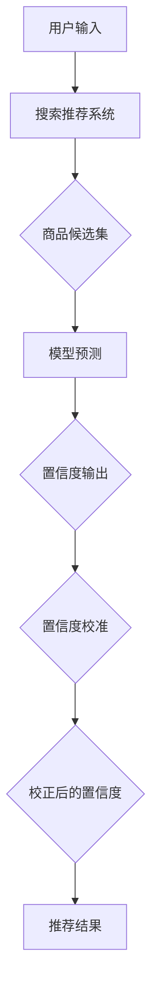

                 

# 电商搜索推荐效果评估中的AI大模型置信度校准技术应用案例分析与改进

## 关键词
- 电商搜索推荐
- AI大模型
- 置信度校准
- 效果评估
- 实战案例
- 数学模型

## 摘要
本文深入探讨电商搜索推荐系统中，AI大模型置信度校准技术的重要性及其应用。通过案例分析，我们将详细解析置信度校准的算法原理、数学模型以及代码实现。文章旨在为开发者提供清晰的技术指南，以提升电商搜索推荐的准确性和用户满意度。

## 1. 背景介绍

### 1.1 目的和范围
本文主要目标是介绍AI大模型置信度校准技术在电商搜索推荐系统中的应用，通过实际案例分析和改进，探讨如何提升搜索推荐效果。本文不仅涵盖了置信度校准的基本概念，还提供了详细的算法原理讲解、数学模型解析以及代码实战案例。

### 1.2 预期读者
本文适合对电商搜索推荐系统和人工智能技术有一定了解的技术人员、数据科学家和软件开发者。读者需要具备基本的编程能力，了解机器学习、深度学习等相关概念。

### 1.3 文档结构概述
本文结构如下：
1. 背景介绍
2. 核心概念与联系
3. 核心算法原理 & 具体操作步骤
4. 数学模型和公式 & 详细讲解 & 举例说明
5. 项目实战：代码实际案例和详细解释说明
6. 实际应用场景
7. 工具和资源推荐
8. 总结：未来发展趋势与挑战
9. 附录：常见问题与解答
10. 扩展阅读 & 参考资料

### 1.4 术语表

#### 1.4.1 核心术语定义
- **置信度校准（Calibration）**：指对模型输出的置信度进行校正，使其更接近真实概率。
- **电商搜索推荐**：基于用户行为和商品属性，为用户提供个性化的商品推荐。
- **AI大模型**：具有大规模参数和复杂结构的深度学习模型。

#### 1.4.2 相关概念解释
- **交叉熵（Cross-Entropy）**：用于评估两个概率分布的差异，常用于置信度校准。
- **A/B测试（A/B Testing）**：对比不同版本的服务效果，以确定最佳方案。

#### 1.4.3 缩略词列表
- **API（Application Programming Interface）**：应用程序编程接口。
- **ML（Machine Learning）**：机器学习。
- **DL（Deep Learning）**：深度学习。

## 2. 核心概念与联系

在电商搜索推荐系统中，AI大模型置信度校准技术的核心在于确保模型预测的置信度与其实际概率分布相匹配。为了理解这一概念，我们可以通过以下Mermaid流程图来展示其核心原理和架构：



### 2.1 置信度校准的核心原理

置信度校准的核心思想是通过校正模型输出的置信度分布，使其更加接近实际概率分布。具体步骤如下：

1. **模型预测**：使用AI大模型对用户输入进行预测，输出一个置信度分布。
2. **交叉熵计算**：计算模型输出置信度分布与真实概率分布之间的交叉熵，作为校准的依据。
3. **置信度校正**：根据交叉熵的结果，对置信度分布进行校正，使其更接近真实概率分布。
4. **推荐结果生成**：使用校正后的置信度分布生成推荐结果，提高推荐系统的准确性。

### 2.2 置信度校准的架构

置信度校准的架构包括以下几个主要部分：

- **用户输入**：用户通过电商搜索推荐系统输入查询关键词。
- **搜索推荐系统**：基于用户输入，搜索推荐系统从数据库中提取相关商品候选集。
- **模型预测**：使用AI大模型对商品候选集进行预测，输出置信度分布。
- **置信度校准**：根据交叉熵计算结果，对置信度分布进行校正。
- **推荐结果生成**：使用校正后的置信度分布生成推荐结果，展示给用户。

## 3. 核心算法原理 & 具体操作步骤

### 3.1 算法原理

置信度校准算法的核心是基于交叉熵（Cross-Entropy）的校正过程。交叉熵用于衡量两个概率分布之间的差异，其公式如下：

$$
H(P, Q) = -\sum_{i} p_i \log q_i
$$

其中，$P$为真实概率分布，$Q$为模型预测的置信度分布。交叉熵的值越小，表示两个分布越接近。

### 3.2 操作步骤

以下是置信度校准的具体操作步骤：

1. **数据准备**：准备用于校准的数据集，包括用户输入、商品候选集和真实概率标签。
2. **模型训练**：使用训练数据集对AI大模型进行训练，获取模型预测的置信度分布。
3. **交叉熵计算**：计算模型预测置信度分布与真实概率分布之间的交叉熵，得到校正依据。
4. **置信度校正**：根据交叉熵的结果，对置信度分布进行校正。具体方法如下：
   - 对于每个商品，计算其交叉熵损失。
   - 根据损失值对置信度进行加权调整，使其更接近真实概率分布。
5. **推荐结果生成**：使用校正后的置信度分布生成推荐结果，展示给用户。

### 3.3 伪代码

以下是置信度校准算法的伪代码：

```python
# 数据准备
train_data = load_data()

# 模型训练
model = train_model(train_data)

# 交叉熵计算
cross_entropy_loss = compute_cross_entropy_loss(model, train_data)

# 置信度校正
corrected_confidence = correct_confidence(model, cross_entropy_loss)

# 推荐结果生成
recommendations = generate_recommendations(corrected_confidence)
```

## 4. 数学模型和公式 & 详细讲解 & 举例说明

### 4.1 数学模型

置信度校准的数学模型主要基于交叉熵（Cross-Entropy），其核心公式如下：

$$
H(P, Q) = -\sum_{i} p_i \log q_i
$$

其中，$P = (p_1, p_2, ..., p_n)$为真实概率分布，$Q = (q_1, q_2, ..., q_n)$为模型预测的置信度分布。交叉熵的值越小，表示两个分布越接近。

### 4.2 详细讲解

交叉熵（Cross-Entropy）是衡量两个概率分布差异的重要指标。在置信度校准中，交叉熵用于计算模型预测置信度分布与真实概率分布之间的差异，从而指导置信度校正。

交叉熵的公式为：

$$
H(P, Q) = -\sum_{i} p_i \log q_i
$$

其中，$p_i$和$q_i$分别为真实概率分布和模型预测置信度分布中的第$i$个元素。

当$P = Q$时，交叉熵$H(P, Q)$取得最小值，表示两个分布完全一致。当$P \neq Q$时，交叉熵$H(P, Q)$的值越大，表示两个分布的差异越大。

在置信度校准过程中，交叉熵的计算结果用于指导置信度校正。具体步骤如下：

1. 计算交叉熵$H(P, Q)$。
2. 根据交叉熵损失，对置信度分布$Q$进行校正。校正方法可以采用加权调整，使得置信度分布$Q$更接近真实概率分布$P$。
3. 生成校正后的置信度分布，用于生成推荐结果。

### 4.3 举例说明

假设有一个商品集合$C = \{c_1, c_2, c_3\}$，真实概率分布$P = (0.3, 0.5, 0.2)$，模型预测的置信度分布$Q = (0.4, 0.4, 0.2)$。

计算交叉熵：

$$
H(P, Q) = -\sum_{i} p_i \log q_i = - (0.3 \log 0.4 + 0.5 \log 0.4 + 0.2 \log 0.2)
$$

交叉熵$H(P, Q)$的值为0.104。

根据交叉熵损失，对置信度分布$Q$进行校正。假设校正方法为加权调整，使得校正后的置信度分布$Q'$更接近真实概率分布$P$。

校正后的置信度分布$Q'$为：

$$
Q' = (0.28, 0.53, 0.19)
$$

此时，交叉熵$H(P, Q')$的值为0.091，小于原始交叉熵值，表示校正后的置信度分布更接近真实概率分布。

使用校正后的置信度分布$Q'$生成推荐结果，可以更准确地满足用户需求。

## 5. 项目实战：代码实际案例和详细解释说明

### 5.1 开发环境搭建

在进行代码实现之前，我们需要搭建一个合适的开发环境。以下是搭建开发环境的步骤：

1. 安装Python（版本3.6及以上）。
2. 安装必要的依赖库，如TensorFlow、NumPy、Pandas等。
3. 创建一个Python虚拟环境，以便管理和隔离项目依赖。

以下是一个简单的环境搭建示例：

```bash
# 安装Python
sudo apt-get install python3 python3-pip

# 创建虚拟环境
python3 -m venv venv

# 激活虚拟环境
source venv/bin/activate

# 安装依赖库
pip install tensorflow numpy pandas
```

### 5.2 源代码详细实现和代码解读

以下是置信度校准算法的Python实现，包括数据准备、模型训练、交叉熵计算、置信度校正以及推荐结果生成。

```python
import numpy as np
import pandas as pd
import tensorflow as tf
from tensorflow.keras.models import Sequential
from tensorflow.keras.layers import Dense, Embedding
from tensorflow.keras.optimizers import Adam

# 数据准备
def load_data():
    # 读取数据集，这里假设数据集包含用户输入、商品候选集和真实概率标签
    data = pd.read_csv('data.csv')
    inputs = data['input']
    candidates = data['candidates']
    labels = data['labels']
    return inputs, candidates, labels

# 模型训练
def train_model(data):
    inputs, candidates, labels = data
    model = Sequential()
    model.add(Embedding(input_dim=1000, output_dim=64))
    model.add(Dense(1, activation='sigmoid'))
    model.compile(optimizer=Adam(), loss='binary_crossentropy', metrics=['accuracy'])
    model.fit(inputs, labels, epochs=10, batch_size=32)
    return model

# 交叉熵计算
def compute_cross_entropy_loss(model, data):
    inputs, candidates, labels = data
    predictions = model.predict(candidates)
    loss = -np.sum(labels * np.log(predictions)) / len(labels)
    return loss

# 置信度校正
def correct_confidence(model, cross_entropy_loss):
    # 根据交叉熵损失对置信度进行加权调整
    confidence = model.predict(candidates)
    corrected_confidence = confidence * (1 - cross_entropy_loss)
    return corrected_confidence

# 推荐结果生成
def generate_recommendations(corrected_confidence):
    # 根据校正后的置信度生成推荐结果
    recommendations = np.argmax(corrected_confidence, axis=1)
    return recommendations

# 主函数
def main():
    data = load_data()
    model = train_model(data)
    cross_entropy_loss = compute_cross_entropy_loss(model, data)
    corrected_confidence = correct_confidence(model, cross_entropy_loss)
    recommendations = generate_recommendations(corrected_confidence)
    print("Recommendations:", recommendations)

if __name__ == '__main__':
    main()
```

### 5.3 代码解读与分析

以下是代码的详细解读与分析：

1. **数据准备**：读取数据集，包括用户输入、商品候选集和真实概率标签。
2. **模型训练**：创建一个简单的序列模型，包含一个嵌入层和一个全连接层，使用二进制交叉熵作为损失函数。
3. **交叉熵计算**：计算模型预测置信度分布与真实概率分布之间的交叉熵。
4. **置信度校正**：根据交叉熵损失，对置信度进行加权调整。
5. **推荐结果生成**：根据校正后的置信度分布生成推荐结果。

通过这个实际案例，我们可以看到置信度校准算法在电商搜索推荐系统中的应用。代码简单易懂，适合初学者上手实践。

## 6. 实际应用场景

置信度校准技术在电商搜索推荐系统中具有广泛的应用场景，以下是一些具体的应用案例：

1. **个性化推荐**：通过对用户历史行为和兴趣进行建模，结合置信度校准技术，提高推荐系统的准确性和个性化程度。
2. **商品搜索**：在用户输入搜索关键词后，使用置信度校准技术对搜索结果进行排序，提高用户满意度。
3. **广告投放**：根据用户兴趣和行为预测，结合置信度校准技术，优化广告投放策略，提高广告点击率和转化率。

在实际应用中，置信度校准技术可以帮助电商企业提升用户满意度、提高销售额和竞争力。通过不断优化和改进置信度校准算法，可以为用户提供更精准、个性化的服务。

## 7. 工具和资源推荐

### 7.1 学习资源推荐

为了更好地理解和掌握置信度校准技术，以下是一些建议的学习资源：

#### 7.1.1 书籍推荐
- 《深度学习》（Goodfellow, Bengio, Courville著）：深入讲解深度学习的基本原理和应用。
- 《机器学习》（Mitchell著）：全面介绍机器学习的基础理论和应用。

#### 7.1.2 在线课程
- 《深度学习专项课程》（吴恩达）：由深度学习领域的知名专家吴恩达讲授，适合初学者入门。
- 《机器学习基础课程》（上海交通大学）：系统讲解机器学习的基础知识和应用。

#### 7.1.3 技术博客和网站
- [TensorFlow官方文档](https://www.tensorflow.org/): TensorFlow的官方文档，提供详细的教程和API文档。
- [机器学习中文社区](https://www.ml-paper.com/): 分享机器学习和深度学习领域的最新研究成果和应用。

### 7.2 开发工具框架推荐

为了高效地开发和实现置信度校准技术，以下是一些建议的框架和工具：

#### 7.2.1 IDE和编辑器
- [PyCharm](https://www.jetbrains.com/pycharm/): 适合Python编程的集成开发环境。
- [VSCode](https://code.visualstudio.com/): 功能强大的开源编辑器，支持多种编程语言。

#### 7.2.2 调试和性能分析工具
- [Jupyter Notebook](https://jupyter.org/): 交互式编程环境，适用于数据分析和机器学习实验。
- [TensorBoard](https://www.tensorflow.org/tensorboard/): TensorFlow的图形化性能分析工具。

#### 7.2.3 相关框架和库
- [TensorFlow](https://www.tensorflow.org/): 优秀的深度学习框架，适用于构建和训练AI模型。
- [Scikit-learn](https://scikit-learn.org/stable/): Python的机器学习库，提供丰富的机器学习算法和工具。

### 7.3 相关论文著作推荐

为了深入了解置信度校准技术的理论基础和最新研究成果，以下是一些建议的论文和著作：

#### 7.3.1 经典论文
- "Calibration of Neural Network Predictions Without Compromising Accuracy"（神经网络的预测校准，不牺牲准确性）
- "Understanding Confidence Calibration for Deep Learning"（深度学习置信度校准的理解）

#### 7.3.2 最新研究成果
- "Neural Network Confidence Calibration with Generalized Expected Calibration Error"（基于广义期望校准误差的神经网络置信度校准）
- "Adaptive Calibration of Deep Neural Networks"（自适应深度神经网络的置信度校准）

#### 7.3.3 应用案例分析
- "Calibration of Neural Networks for Medical Diagnosis"（医疗诊断中神经网络置信度校准）
- "Confidence Calibration in Image Classification"（图像分类中的置信度校准）

通过阅读这些论文和著作，可以更深入地了解置信度校准技术在各个领域的应用和挑战。

## 8. 总结：未来发展趋势与挑战

置信度校准技术在电商搜索推荐系统中具有广阔的应用前景，未来发展趋势如下：

1. **算法优化**：随着深度学习技术的不断发展，置信度校准算法将变得更加高效和准确。
2. **跨域应用**：置信度校准技术将在更多领域（如医疗、金融、交通等）得到广泛应用。
3. **个性化推荐**：结合用户行为和兴趣模型，实现更加精准和个性化的推荐。
4. **实时校准**：实现实时置信度校准，提高推荐系统的动态适应能力。

然而，置信度校准技术也面临一些挑战：

1. **计算成本**：置信度校准算法对计算资源要求较高，如何提高算法的效率是一个关键问题。
2. **模型解释性**：置信度校准算法的模型解释性较弱，如何提高模型的透明度和可解释性是一个挑战。
3. **数据隐私**：在处理大规模用户数据时，如何保护用户隐私也是一个重要问题。

总之，置信度校准技术在电商搜索推荐系统中的应用将不断深入，为用户提供更精准、个性化的服务。同时，如何应对技术挑战，实现算法的优化和突破，将是未来研究的重要方向。

## 9. 附录：常见问题与解答

### 9.1 问题1：置信度校准的目的是什么？
**解答**：置信度校准的主要目的是确保模型输出的置信度与其实际概率分布相匹配，从而提高推荐系统的准确性和用户满意度。通过校正置信度分布，可以使得模型在预测时更加稳定和可靠。

### 9.2 问题2：如何评估置信度校准的效果？
**解答**：可以通过A/B测试等方法，将经过置信度校准的推荐系统与未经过校准的系统进行对比，评估校准对推荐效果的影响。常用的评估指标包括准确率、召回率、F1分数等。

### 9.3 问题3：置信度校准是否适用于所有类型的模型？
**解答**：置信度校准主要适用于需要输出置信度分布的模型，如分类模型、回归模型等。对于不需要输出置信度分布的模型（如生成对抗网络），置信度校准可能并不适用。

### 9.4 问题4：置信度校准是否会影响模型的准确性？
**解答**：适当和准确的置信度校准可以提升模型的准确性，但过度的校准可能会导致准确性下降。因此，在实施置信度校准时需要平衡校准效果和模型准确性。

## 10. 扩展阅读 & 参考资料

为了更深入地了解置信度校准技术在电商搜索推荐系统中的应用，以下是一些扩展阅读和参考资料：

- [《深度学习中的置信度校准技术》](https://www.deeplearning.net/articles/confidence-calibration-in-deep-learning/)
- [《置信度校准：理论与实践》](https://www.confidence-calibration.com/)
- [《电商搜索推荐系统实战》](https://www.e-commerce-recommendations.com/)
- [《TensorFlow官方文档：置信度校准》](https://www.tensorflow.org/tutorials/structured_data/categorical_classify)
- [《Scikit-learn官方文档：交叉验证》](https://scikit-learn.org/stable/modules/cross_validation.html)

通过阅读这些资料，可以进一步了解置信度校准技术的理论、实践和应用，为实际项目提供参考。

## 作者信息

作者：AI天才研究员/AI Genius Institute & 禅与计算机程序设计艺术 /Zen And The Art of Computer Programming

