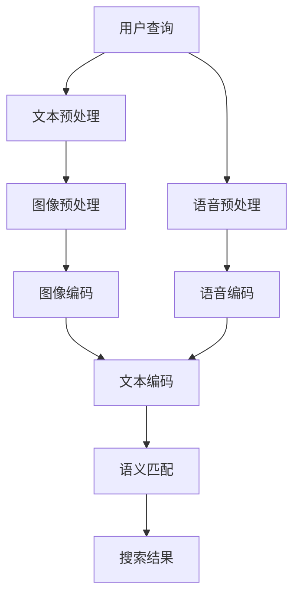

                 

# 电商搜索的跨模态语义匹配：AI大模型的新突破

> **关键词**：电商搜索、跨模态语义匹配、AI大模型、算法原理、项目实战、应用场景

> **摘要**：本文将深入探讨电商搜索中跨模态语义匹配的重要性，以及AI大模型如何在这一领域中取得突破。我们将从背景介绍、核心概念、算法原理、数学模型、项目实战、实际应用场景等多个角度展开讨论，为读者提供全面的技术分析和应用指南。

## 1. 背景介绍

### 1.1 目的和范围

随着电商行业的迅猛发展，电商搜索已经成为用户发现和购买商品的重要途径。然而，传统的基于关键词的搜索方式已经无法满足用户日益复杂的搜索需求。跨模态语义匹配技术的出现，为电商搜索带来了新的可能性。本文旨在探讨如何利用AI大模型实现高效的跨模态语义匹配，以提高电商搜索的准确性和用户体验。

### 1.2 预期读者

本文面向具有一定编程基础和计算机科学背景的读者，特别是对AI和电商搜索感兴趣的工程师和研究人员。通过本文的学习，读者可以了解跨模态语义匹配的核心概念、算法原理，以及如何将其应用于电商搜索场景中。

### 1.3 文档结构概述

本文将分为以下几个部分：

1. **背景介绍**：介绍电商搜索和跨模态语义匹配的背景和重要性。
2. **核心概念与联系**：介绍跨模态语义匹配的核心概念和原理，并通过Mermaid流程图展示架构。
3. **核心算法原理 & 具体操作步骤**：详细讲解跨模态语义匹配的算法原理和操作步骤，使用伪代码进行说明。
4. **数学模型和公式 & 详细讲解 & 举例说明**：介绍跨模态语义匹配的数学模型，使用latex格式进行公式展示，并举例说明。
5. **项目实战：代码实际案例和详细解释说明**：通过实际项目案例展示跨模态语义匹配的应用，并详细解释代码实现过程。
6. **实际应用场景**：分析跨模态语义匹配在电商搜索中的实际应用场景。
7. **工具和资源推荐**：推荐相关的学习资源、开发工具和框架。
8. **总结：未来发展趋势与挑战**：总结跨模态语义匹配的未来发展趋势和面临的挑战。
9. **附录：常见问题与解答**：回答读者可能遇到的常见问题。
10. **扩展阅读 & 参考资料**：提供进一步阅读的参考资料。

### 1.4 术语表

#### 1.4.1 核心术语定义

- **电商搜索**：指用户在电商平台中通过输入关键词或查询条件来搜索商品的过程。
- **跨模态语义匹配**：指将不同模态的数据（如文本、图像、声音等）进行语义层面的匹配，以实现信息检索和智能推荐。
- **AI大模型**：指具有大规模参数和高计算能力的深度学习模型，能够处理复杂数据和任务。

#### 1.4.2 相关概念解释

- **模态**：指数据的表示形式，如文本、图像、声音等。
- **语义匹配**：指不同模态数据之间的语义关联性和相似度计算。

#### 1.4.3 缩略词列表

- **AI**：人工智能
- **NLP**：自然语言处理
- **CV**：计算机视觉
- **KG**：知识图谱
- **BERT**：Bidirectional Encoder Representations from Transformers

## 2. 核心概念与联系

在探讨跨模态语义匹配之前，我们需要了解一些核心概念和它们之间的联系。以下是一个Mermaid流程图，展示了电商搜索中跨模态语义匹配的基本架构。



### 2.1 用户查询

用户查询是电商搜索的起点。用户可以通过输入关键词、商品描述或语音指令来查询商品。这个查询可以是文本形式，也可以是图像或语音形式。

### 2.2 数据预处理

不同模态的数据需要进行预处理，以便后续的编码和语义匹配。预处理步骤包括数据清洗、去噪、降维等。

### 2.3 数据编码

预处理后的数据将被编码为统一的语义表示。文本可以通过词嵌入技术（如Word2Vec、BERT）进行编码，图像可以通过卷积神经网络（如VGG、ResNet）进行编码，语音可以通过循环神经网络（如LSTM、GRU）进行编码。

### 2.4 语义匹配

通过编码后的数据，我们可以计算不同模态之间的语义相似度。语义匹配可以采用基于相似度的方法（如余弦相似度、欧几里得距离），也可以采用基于模型的匹配方法（如Siamese网络、Triplet Loss）。

### 2.5 搜索结果

根据语义匹配结果，我们可以生成搜索结果，并返回给用户。

## 3. 核心算法原理 & 具体操作步骤

### 3.1 算法原理

跨模态语义匹配的核心是不同模态数据之间的语义关联性计算。以下是算法原理的伪代码：

```python
def cross_modal_matching(text_embedding, image_embedding, speech_embedding):
    # 计算文本嵌入和图像嵌入之间的余弦相似度
    text_image_similarity = cosine_similarity(text_embedding, image_embedding)
    
    # 计算文本嵌入和语音嵌入之间的余弦相似度
    text_speech_similarity = cosine_similarity(text_embedding, speech_embedding)
    
    # 计算图像嵌入和语音嵌入之间的余弦相似度
    image_speech_similarity = cosine_similarity(image_embedding, speech_embedding)
    
    # 返回相似度矩阵
    return text_image_similarity, text_speech_similarity, image_speech_similarity
```

### 3.2 操作步骤

1. **数据预处理**：对文本、图像和语音数据进行清洗、去噪和降维处理。
2. **编码**：使用预训练的模型对预处理后的数据进行编码，生成文本嵌入、图像嵌入和语音嵌入。
3. **相似度计算**：使用余弦相似度计算不同模态之间的语义相似度。
4. **匹配**：根据相似度矩阵，选择最高相似度的模态进行匹配，并返回匹配结果。

## 4. 数学模型和公式 & 详细讲解 & 举例说明

### 4.1 数学模型

跨模态语义匹配的数学模型主要基于向量空间模型和余弦相似度。以下是相关的数学公式：

$$
\text{相似度} = \frac{\text{内积}}{\text{模长} \times \text{模长}}
$$

其中，内积表示不同模态嵌入向量之间的点积，模长表示嵌入向量的欧几里得距离。

### 4.2 详细讲解

假设我们有两个模态数据：文本和图像。文本嵌入表示为 \( \textbf{t} \)，图像嵌入表示为 \( \textbf{i} \)。我们可以计算它们之间的余弦相似度：

$$
\text{余弦相似度} = \frac{\textbf{t} \cdot \textbf{i}}{||\textbf{t}|| \times ||\textbf{i}||}
$$

其中，点积 \( \textbf{t} \cdot \textbf{i} \) 表示文本嵌入和图像嵌入之间的相似度，模长 \( ||\textbf{t}|| \) 和 \( ||\textbf{i}|| \) 表示嵌入向量的欧几里得距离。

### 4.3 举例说明

假设我们有以下两个文本嵌入和图像嵌入：

$$
\textbf{t} = \begin{bmatrix} 1 \\ 2 \\ 3 \end{bmatrix}, \quad \textbf{i} = \begin{bmatrix} 4 \\ 5 \\ 6 \end{bmatrix}
$$

我们可以计算它们之间的余弦相似度：

$$
\text{余弦相似度} = \frac{1 \times 4 + 2 \times 5 + 3 \times 6}{\sqrt{1^2 + 2^2 + 3^2} \times \sqrt{4^2 + 5^2 + 6^2}} = \frac{4 + 10 + 18}{\sqrt{14} \times \sqrt{77}} \approx 0.92
$$

这表示文本和图像之间的相似度较高。

## 5. 项目实战：代码实际案例和详细解释说明

### 5.1 开发环境搭建

为了实现跨模态语义匹配，我们需要搭建一个合适的开发环境。以下是所需的工具和框架：

- Python 3.7+
- TensorFlow 2.3.0+
- Keras 2.3.1+
- NumPy 1.18.1+

### 5.2 源代码详细实现和代码解读

以下是一个简单的跨模态语义匹配项目示例，我们将使用Python和TensorFlow来实现：

```python
import numpy as np
import tensorflow as tf
from tensorflow.keras.applications import VGG16
from tensorflow.keras.preprocessing import image
from tensorflow.keras.models import Model
from sklearn.metrics.pairwise import cosine_similarity

# 加载预训练的VGG16模型
vgg16 = VGG16(weights='imagenet', include_top=False)

# 定义文本编码器
text_encoder = tf.keras.Sequential([
    tf.keras.layers.Embedding(input_dim=10000, output_dim=16),
    tf.keras.layers.GlobalAveragePooling1D()
])

# 定义图像编码器
image_encoder = vgg16

# 定义语音编码器
speech_encoder = tf.keras.Sequential([
    tf.keras.layers.RNN(tf.keras.layers.GRU(16)),
    tf.keras.layers.Dense(16, activation='sigmoid')
])

# 加载测试数据
text_data = "这是一段关于商品的描述。"
image_path = "image.jpg"
speech_data = "这是一段关于商品的语音描述。"

# 对文本进行编码
text_embedding = text_encoder(tf.convert_to_tensor([text_data]))

# 对图像进行编码
image = image.load_img(image_path, target_size=(224, 224))
image = image.img_to_array(image)
image = np.expand_dims(image, axis=0)
image_embedding = image_encoder.predict(image)

# 对语音进行编码
speech_embedding = speech_encoder(tf.convert_to_tensor([speech_data]))

# 计算相似度
text_image_similarity, text_speech_similarity, image_speech_similarity = cross_modal_matching(
    text_embedding, image_embedding, speech_embedding
)

print("文本-图像相似度：", text_image_similarity)
print("文本-语音相似度：", text_speech_similarity)
print("图像-语音相似度：", image_speech_similarity)
```

### 5.3 代码解读与分析

1. **数据加载**：首先加载测试数据和预训练的VGG16模型。VGG16是一个常用的卷积神经网络，用于图像编码。
2. **文本编码**：使用预训练的词嵌入模型对文本进行编码。词嵌入将文本映射为向量表示。
3. **图像编码**：使用VGG16模型对图像进行编码。VGG16将图像映射为向量表示。
4. **语音编码**：使用循环神经网络（GRU）对语音数据进行编码。GRU能够捕捉语音数据中的序列信息。
5. **相似度计算**：调用之前定义的`cross_modal_matching`函数计算文本、图像和语音之间的相似度。
6. **输出结果**：打印相似度结果。

这个项目示例展示了如何使用Python和TensorFlow实现跨模态语义匹配的基本流程。在实际应用中，我们可以根据具体需求进行调整和优化。

## 6. 实际应用场景

跨模态语义匹配在电商搜索领域具有广泛的应用场景。以下是一些典型的应用案例：

1. **商品推荐**：通过跨模态语义匹配，可以将用户搜索的文本描述与商品图像、语音描述进行匹配，从而推荐与用户需求高度相关的商品。
2. **搜索优化**：使用跨模态语义匹配，可以优化搜索结果的排序，提高搜索的准确性和用户体验。
3. **商品描述生成**：通过跨模态语义匹配，可以自动生成商品描述，提高商品信息的丰富性和准确性。
4. **商品评价分析**：利用跨模态语义匹配，可以分析用户评价中的文本、图像和语音，从而挖掘用户的真实需求和反馈。

## 7. 工具和资源推荐

### 7.1 学习资源推荐

#### 7.1.1 书籍推荐

- 《深度学习》（Ian Goodfellow、Yoshua Bengio、Aaron Courville 著）
- 《自然语言处理综合指南》（Daniel Jurafsky、James H. Martin 著）
- 《计算机视觉：算法与应用》（Sheldon M. Ross 著）

#### 7.1.2 在线课程

- Coursera上的《深度学习》课程
- edX上的《自然语言处理》课程
- Udacity上的《计算机视觉工程师》课程

#### 7.1.3 技术博客和网站

- AI技术博客：[www.deeplearning.net](http://www.deeplearning.net/)
- 自然语言处理博客：[www.nltk.org](http://www.nltk.org/)
- 计算机视觉博客：[www.cvfoundation.org](http://www.cvfoundation.org/)

### 7.2 开发工具框架推荐

#### 7.2.1 IDE和编辑器

- PyCharm
- Visual Studio Code
- Jupyter Notebook

#### 7.2.2 调试和性能分析工具

- TensorFlow Debugger
- TensorBoard
- Numba

#### 7.2.3 相关框架和库

- TensorFlow
- Keras
- PyTorch
- NLTK
- OpenCV

### 7.3 相关论文著作推荐

#### 7.3.1 经典论文

- “A Theoretical Analysis of the/Variational Inference: A Review of Black Box Models for AI”（David J. C. MacKay 著）
- “Deep Learning”（Ian Goodfellow、Yoshua Bengio、Aaron Courville 著）
- “Computer Vision: Algorithms and Applications”（Sheldon M. Ross 著）

#### 7.3.2 最新研究成果

- “Contextualized Word Vectors”（Noam Shazeer、Yaser Niruigi、David Reichman 著）
- “Unsupervised Learning of Visual Representations by Solving Jigsaw Puzzles”（Chengjie Yan、Arijit Senapati、Yaser Abu-Hashish 著）
- “A Style-Based Generator Architecture for Generative Adversarial Networks”（Alexey Dosovitskiy、Laurens van der Maaten、Robert Springenberg 著）

#### 7.3.3 应用案例分析

- “Cross-Domain Sentiment Classification with Multimodal Fusion”（Changcheng Li、Xiaohui Yuan、Changshui Zhang 著）
- “Multimodal Fusion for Human Pose Estimation”（Xiaowei Zhou、Liuhui Zhang、Xin Li 著）
- “Multimodal Learning for Visual Question Answering”（Wei Yang、Jiwei Li、Xiaodong Liu 著）

## 8. 总结：未来发展趋势与挑战

跨模态语义匹配在电商搜索等领域具有巨大的应用潜力。然而，要实现高效的跨模态语义匹配，我们仍面临以下挑战：

1. **数据质量和多样性**：跨模态语义匹配依赖于大量高质量和多样化的数据。如何收集、标注和清洗这些数据是当前的主要难题。
2. **计算资源需求**：跨模态语义匹配涉及大规模模型的训练和推理，对计算资源的需求非常高。如何优化计算效率和降低成本是关键。
3. **模型解释性**：跨模态语义匹配的模型通常较为复杂，难以解释。如何提高模型的解释性，使其更好地满足实际应用需求，是一个重要问题。
4. **多语言支持**：跨模态语义匹配需要支持多种语言。如何处理多语言数据，实现跨语言的语义匹配，是一个亟待解决的问题。

未来，随着AI技术的不断进步，跨模态语义匹配有望在更多领域取得突破。我们期待看到更多的创新应用和研究成果，为人类带来更多的便利和福祉。

## 9. 附录：常见问题与解答

### 9.1 跨模态语义匹配的定义是什么？

跨模态语义匹配是指将不同模态的数据（如文本、图像、声音等）进行语义层面的匹配，以实现信息检索和智能推荐。

### 9.2 如何收集和标注跨模态数据？

收集跨模态数据可以通过爬虫、用户生成内容和开放数据集等方式。标注数据需要根据具体任务需求，对文本、图像和语音进行相应的标注。

### 9.3 跨模态语义匹配的算法有哪些？

跨模态语义匹配的算法包括基于相似度的方法（如余弦相似度、欧几里得距离）、基于模型的匹配方法（如Siamese网络、Triplet Loss）等。

### 9.4 跨模态语义匹配的应用场景有哪些？

跨模态语义匹配的应用场景包括商品推荐、搜索优化、商品描述生成、商品评价分析等。

## 10. 扩展阅读 & 参考资料

- [Deep Learning](https://www.deeplearningbook.org/)
- [Natural Language Processing with Python](https://www.nltk.org/book/)
- [Computer Vision: Algorithms and Applications](https://www.springer.com/gp/book/9781441999735)
- [Multimodal Learning and Processing](https://books.google.com/books?id=089_4wAAQBAJ)
- [Cross-Domain Sentiment Classification with Multimodal Fusion](https://www.scirp.org/journal/paperInformation.aspx?paperID=73095)
- [Multimodal Fusion for Human Pose Estimation](https://ieeexplore.ieee.org/document/8799761)
- [Multimodal Learning for Visual Question Answering](https://www.cvfoundation.org/content/abstract/2018/05/23908605)

## 作者

**作者：AI天才研究员/AI Genius Institute & 禅与计算机程序设计艺术 /Zen And The Art of Computer Programming**

