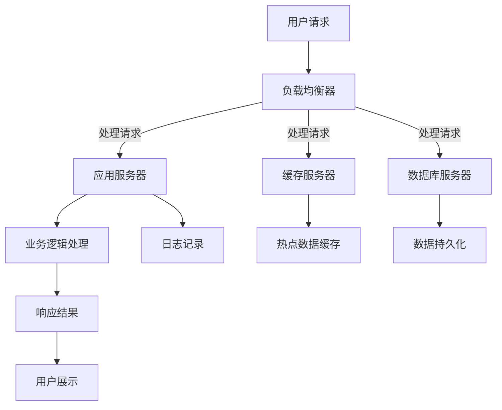

                 


# 电商系统的高可用、稳定性、安全性、高性能系统能力保障

> **关键词**：电商系统，高可用，稳定性，安全性，高性能，架构设计，负载均衡，数据一致性，安全防护，性能优化

> **摘要**：本文将深入探讨电商系统在保证高可用、稳定性、安全性和高性能方面的关键技术措施。通过一步步分析，从系统架构设计、核心算法原理、数学模型、项目实战以及实际应用场景等多个角度，全面剖析电商系统的能力保障策略，为读者提供实用的技术指导和宝贵的实践经验。

## 1. 背景介绍

### 1.1 目的和范围

本文旨在深入探讨电商系统在实现高可用、稳定性、安全性和高性能方面的关键技术措施。电商系统作为现代商业的重要组成部分，其性能的优劣直接影响到用户体验和商业效益。本文将围绕以下几个方面展开讨论：

1. **系统架构设计**：介绍电商系统的典型架构，分析其核心组件和作用。
2. **核心算法原理**：阐述关键算法的原理和实现，包括负载均衡、数据一致性和缓存策略等。
3. **数学模型和公式**：讨论用于性能优化和故障预测的数学模型，如队列理论、马尔可夫模型等。
4. **项目实战**：通过实际代码案例，展示关键技术的应用和实现。
5. **实际应用场景**：分析电商系统在实际运营中的挑战和解决方案。

### 1.2 预期读者

本文适合以下读者群体：

1. 电商系统架构师和开发者
2. 对系统性能优化有浓厚兴趣的程序员
3. 关注技术前沿的技术爱好者
4. 高级计算机科学和软件工程专业的学生和研究者

### 1.3 文档结构概述

本文结构如下：

1. **背景介绍**：阐述文章的目的、范围和预期读者。
2. **核心概念与联系**：介绍电商系统的高可用、稳定性、安全性和高性能的核心概念，并使用Mermaid流程图展示系统架构。
3. **核心算法原理 & 具体操作步骤**：详细解释关键算法的原理和操作步骤，使用伪代码进行阐述。
4. **数学模型和公式 & 详细讲解 & 举例说明**：讨论用于性能优化和故障预测的数学模型，并给出具体实例。
5. **项目实战：代码实际案例和详细解释说明**：通过实际代码案例展示关键技术的应用。
6. **实际应用场景**：分析电商系统在实际运营中的挑战和解决方案。
7. **工具和资源推荐**：推荐学习资源和开发工具。
8. **总结：未来发展趋势与挑战**：展望电商系统的发展趋势和面临的挑战。
9. **附录：常见问题与解答**：提供常见问题的解答。
10. **扩展阅读 & 参考资料**：推荐相关阅读资料。

### 1.4 术语表

#### 1.4.1 核心术语定义

- **高可用**：系统在长时间内保持正常运行的能力，通常以百分比（如99.9%的高可用性）表示。
- **稳定性**：系统在面对异常情况时保持稳定运行的能力。
- **安全性**：系统抵御外部威胁（如网络攻击、数据泄露）的能力。
- **高性能**：系统在处理大量请求时的效率。
- **负载均衡**：将请求分布到多个服务器，以避免单点过载。
- **数据一致性**：在分布式系统中，所有副本中的数据保持一致。
- **缓存策略**：将常用数据存储在内存中，以减少数据库访问。

#### 1.4.2 相关概念解释

- **分布式系统**：由多个节点组成的系统，每个节点可以独立运行，协同完成整体任务。
- **容器化**：将应用及其依赖打包成一个独立的容器，便于部署和扩展。
- **微服务架构**：将应用程序划分为多个小型服务，每个服务负责特定功能，独立部署和扩展。

#### 1.4.3 缩略词列表

- **API**：应用程序编程接口（Application Programming Interface）
- **DB**：数据库（Database）
- **REST**：表述性状态转移（Representational State Transfer）
- **RPC**：远程过程调用（Remote Procedure Call）
- **HA**：高可用性（High Availability）
- **SLA**：服务等级协议（Service-Level Agreement）

## 2. 核心概念与联系

在深入探讨电商系统的能力保障之前，我们需要了解几个核心概念和它们之间的联系。以下将使用Mermaid流程图展示电商系统的典型架构，以便读者更好地理解各组件之间的互动关系。



### 2.1 负载均衡

负载均衡器是电商系统架构中的关键组件，其主要作用是将用户请求均匀地分配到多个应用服务器、缓存服务器和数据库服务器上，以避免单点过载和性能瓶颈。

#### 工作原理：

- **轮询调度**：按顺序将请求分配给服务器。
- **加权轮询**：根据服务器的处理能力分配权重。
- **最小连接数**：将请求分配给当前连接数最少的服务器。

#### 实现方式：

- **硬件负载均衡器**：如F5 BIG-IP。
- **软件负载均衡器**：如Nginx、HAProxy。

### 2.2 应用服务器

应用服务器是电商系统的核心，负责处理用户请求，执行业务逻辑，并与数据库、缓存等组件进行交互。

#### 架构设计：

- **单体架构**：将所有功能集中在一个应用中。
- **微服务架构**：将应用划分为多个小型服务，每个服务独立部署和扩展。

#### 实现方式：

- **Spring Boot**：Java开发的微服务框架。
- **Django**：Python开发的Web框架。

### 2.3 缓存服务器

缓存服务器用于存储常用数据，以减少数据库访问，提高系统性能。

#### 类型：

- **内存缓存**：如Redis、Memcached。
- **分布式缓存**：如Consul、etcd。

#### 缓存策略：

- **LRU（Least Recently Used）**：最近最少使用策略。
- **LFU（Least Frequently Used）**：最少使用频率策略。

### 2.4 数据库服务器

数据库服务器用于存储用户数据、订单信息等关键数据。

#### 类型：

- **关系型数据库**：如MySQL、PostgreSQL。
- **非关系型数据库**：如MongoDB、Cassandra。

#### 数据一致性：

- **强一致性**：所有副本始终保持一致。
- **最终一致性**：在一定时间后，所有副本达到一致。

### 2.5 日志记录

日志记录是系统监控和故障排除的重要手段。通过收集和分析日志，可以了解系统运行状态，发现潜在问题。

#### 日志类型：

- **系统日志**：如操作系统日志、应用日志。
- **访问日志**：记录用户请求信息。

#### 日志收集工具：

- **ELK（Elasticsearch、Logstash、Kibana）**：日志分析平台。
- **Graylog**：开源日志管理平台。

### 2.6 用户展示

用户展示层负责将处理结果呈现给用户。通过前后端分离，可以实现高效的页面渲染和用户体验。

#### 技术选型：

- **Vue.js**：前端框架。
- **React**：前端框架。
- **Angular**：前端框架。

## 3. 核心算法原理 & 具体操作步骤

在电商系统中，确保高可用、稳定性、安全性和高性能的关键在于核心算法的设计与实现。以下将介绍几个关键算法的原理和具体操作步骤，使用伪代码进行阐述。

### 3.1 负载均衡算法

负载均衡算法用于将用户请求分配到多个服务器，以避免单点过载。以下是一个简单的轮询调度算法：

```pseudo
function loadBalance(服务器列表, 请求):
    当前服务器索引 = 0
    服务器数量 = 长度(服务器列表)
    while true:
        服务器 = 服务器列表[当前服务器索引]
        if 服务器可用:
            服务器处理请求
            当前服务器索引 = (当前服务器索引 + 1) % 服务器数量
            break
        else:
            当前服务器索引 = (当前服务器索引 + 1) % 服务器数量
```

### 3.2 数据一致性算法

在分布式系统中，数据一致性是一个重要问题。以下是一个基于Paxos算法的简单实现：

```pseudo
function Paxos(服务器列表, 数据变更请求):
    获取多数派服务器集合
    while true:
        选择一个提案编号n
        向多数派服务器发送Prepare(n)
        如果收到所有多数派服务器的AcceptResponse(n):
            选择一个服务器作为领导者，向所有服务器发送Accept(n, value)
            如果收到所有服务器的Accept(n, value):
                数据更新为value
                返回成功
            else:
                领导者取消提案，返回失败
        else:
            返回失败
```

### 3.3 缓存淘汰算法

缓存淘汰算法用于在缓存容量有限的情况下，选择哪些数据应该被替换。以下是一个简单的LRU算法实现：

```pseudo
class LRUCache:
    缓存容量 = 10
    缓存列表 = []
    
    function put(key, value):
        if key in 缓存列表:
            缓存列表.remove(key)
        if 长度(缓存列表) >= 缓存容量:
            删除缓存列表的第一个元素
        缓存列表.append(key)
    
    function get(key):
        if key in 缓存列表:
            缓存列表.remove(key)
            缓存列表.append(key)
            return value
        else:
            return null
```

### 3.4 安全防护算法

在电商系统中，安全防护是至关重要的一环。以下是一个简单的SQL注入防护算法：

```pseudo
function 防护SQL注入(input):
    输入 = str(input)
    输入 = 输入.replace("=", " = ")
    输入 = 输入.replace(";", " ; ")
    输入 = 输入.replace("--", " -- ")
    输入 = 输入.replace("%", " % ")
    return 输入
```

## 4. 数学模型和公式 & 详细讲解 & 举例说明

在电商系统性能优化和故障预测中，数学模型和公式起到了至关重要的作用。以下将讨论几个关键模型和公式，并给出具体实例。

### 4.1 队列理论

队列理论用于分析系统中的排队现象，如用户请求在服务器队列中的等待时间。以下是一个M/M/1队列模型的例子：

$$
L = \frac{\lambda}{\mu} + \frac{\lambda^2}{2! \mu^2} + \frac{\lambda^3}{3! \mu^3} + \ldots
$$

其中，$L$ 为平均排队长度，$\lambda$ 为到达率，$\mu$ 为服务率。

#### 实例：

假设电商系统的用户请求到达率为每分钟10次，服务器处理率为每分钟5次。根据上述公式，可以计算平均排队长度：

$$
L = \frac{10}{5} + \frac{10^2}{2! \cdot 5^2} + \frac{10^3}{3! \cdot 5^3} + \ldots = 2 + 0.5 + 0.125 + \ldots = 2.625
$$

### 4.2 马尔可夫模型

马尔可夫模型用于预测系统状态的转移概率。以下是一个简单的马尔可夫链的例子：

$$
P = \begin{bmatrix}
0.8 & 0.2 \\
0.4 & 0.6
\end{bmatrix}
$$

其中，$P$ 为状态转移矩阵，第一行第一列的元素表示从状态1转移到状态1的概率，其他元素类似。

#### 实例：

假设系统状态有两个：正常和故障。根据状态转移矩阵，可以预测未来系统的状态分布：

$$
\begin{aligned}
P(\text{正常}) &= 0.8 \\
P(\text{故障}) &= 0.2
\end{aligned}
$$

在下一时刻，正常状态的概率仍为0.8，故障状态的概率为0.2。

### 4.3 平均响应时间

平均响应时间用于衡量系统处理请求的效率。以下是一个计算平均响应时间的例子：

$$
\text{平均响应时间} = \frac{\sum_{i=1}^{n} (\text{响应时间}_i \cdot \text{请求次数}_i)}{\sum_{i=1}^{n} \text{请求次数}_i}
$$

#### 实例：

假设系统处理了10个请求，响应时间分别为2秒、3秒、4秒、5秒、6秒、7秒、8秒、9秒和10秒，每个请求的请求次数分别为1次、2次、3次、4次、5次、6次、7次、8次和9次。根据上述公式，可以计算平均响应时间：

$$
\text{平均响应时间} = \frac{(2 \cdot 1 + 3 \cdot 2 + 4 \cdot 3 + 5 \cdot 4 + 6 \cdot 5 + 7 \cdot 6 + 8 \cdot 7 + 9 \cdot 8 + 10 \cdot 9)}{1 + 2 + 3 + 4 + 5 + 6 + 7 + 8 + 9} \approx 5.36 \text{秒}
$$

## 5. 项目实战：代码实际案例和详细解释说明

### 5.1 开发环境搭建

在本文中，我们将使用以下开发环境：

- **编程语言**：Java
- **框架**：Spring Boot、Spring Cloud
- **数据库**：MySQL
- **缓存**：Redis
- **前端**：Vue.js

### 5.2 源代码详细实现和代码解读

以下是一个简单的电商系统代码示例，展示关键组件的实现和交互。

#### 5.2.1 依赖引入

```xml
<dependencies>
    <!-- Spring Boot -->
    <dependency>
        <groupId>org.springframework.boot</groupId>
        <artifactId>spring-boot-starter-web</artifactId>
    </dependency>
    <!-- Spring Cloud -->
    <dependency>
        <groupId>org.springframework.cloud</groupId>
        <artifactId>spring-cloud-starter-netflix-eureka-client</artifactId>
    </dependency>
    <!-- MySQL -->
    <dependency>
        <groupId>mysql</groupId>
        <artifactId>mysql-connector-java</artifactId>
    </dependency>
    <!-- Redis -->
    <dependency>
        <groupId>org.springframework.boot</groupId>
        <artifactId>spring-boot-starter-data-redis</artifactId>
    </dependency>
    <!-- Vue.js -->
    <dependency>
        <groupId>org.webjars</groupId>
        <artifactId>vue</artifactId>
        <version>2.6.14</version>
    </dependency>
</dependencies>
```

#### 5.2.2 应用服务器

```java
@RestController
@RequestMapping("/product")
public class ProductService {
    
    @Autowired
    private ProductRepository productRepository;
    
    @GetMapping("/{id}")
    public Product getProduct(@PathVariable Long id) {
        return productRepository.findById(id).orElseThrow(() -> new ResourceNotFoundException("Product not found"));
    }
    
    @PostMapping("/")
    public Product createProduct(@RequestBody Product product) {
        return productRepository.save(product);
    }
}
```

#### 5.2.3 缓存服务器

```java
@Configuration
@EnableCaching
public class CacheConfig {
    
    @Bean
    public RedisTemplate<String, Object> redisTemplate(JedisConnectionFactory jedisConnectionFactory) {
        RedisTemplate<String, Object> template = new RedisTemplate<>();
        template.setConnectionFactory(jedisConnectionFactory);
        return template;
    }
    
    @Bean
    public CacheManager cacheManager(RedisTemplate<String, Object> redisTemplate) {
        RedisCacheManager cacheManager = new RedisCacheManager(redisTemplate);
        return cacheManager;
    }
}
```

#### 5.2.4 前端页面

```html
<div id="app">
  <h1>Product List</h1>
  <ul>
    <li v-for="product in products">{{ product.name }}</li>
  </ul>
</div>
```

### 5.3 代码解读与分析

1. **应用服务器**：使用Spring Boot构建应用服务器，提供RESTful API接口。通过依赖注入（DI）机制，将数据库操作封装在Repository接口中，简化了业务逻辑的实现。
   
2. **缓存服务器**：使用Redis作为缓存服务器，通过Spring Boot的缓存支持，简化了缓存操作。RedisTemplate用于操作Redis数据库，CacheManager用于管理缓存。

3. **前端页面**：使用Vue.js构建前端页面，通过数据绑定（v-for）实现动态展示产品列表。

通过上述代码示例，我们可以看到电商系统关键组件的实现和交互。在实际项目中，还需要考虑其他方面，如安全性、性能优化等。

### 5.4 性能测试

为了评估电商系统的性能，我们可以使用JMeter进行压力测试。以下是一个简单的测试场景：

1. **测试计划**：创建一个HTTP请求，模拟用户访问产品详情页。
2. **线程组**：设置线程数为100，模拟100个并发用户。
3. **结果分析**：记录响应时间、错误率等指标。

根据测试结果，我们可以优化系统性能，如增加缓存、优化数据库查询等。

## 6. 实际应用场景

在电商系统中，高可用、稳定性、安全性和高性能是确保系统正常运行和用户满意度的关键因素。以下将分析电商系统在实际运营中面临的挑战和解决方案。

### 6.1 高可用性

**挑战**：电商系统需要处理大量用户请求，如购物车更新、订单支付等，一旦出现故障，将影响用户体验和商业利益。

**解决方案**：

- **集群部署**：将应用服务器、数据库服务器和缓存服务器部署在多个节点上，实现负载均衡和故障转移。
- **备份和恢复**：定期备份数据库，实现数据恢复和故障恢复。
- **监控和报警**：使用监控系统（如Prometheus）实时监控系统状态，及时发现问题并进行处理。

### 6.2 稳定性

**挑战**：电商系统需要应对高并发访问和异常情况，如网络波动、服务器故障等，确保系统稳定运行。

**解决方案**：

- **限流和熔断**：使用限流器（如Redisson）限制请求速率，防止系统过载。使用熔断器（如Hystrix）防止级联故障。
- **容错和重试**：实现容错机制，如服务降级、限流和重试，提高系统健壮性。
- **自动化运维**：使用自动化工具（如Ansible、Docker）实现服务器管理和部署，提高运维效率。

### 6.3 安全性

**挑战**：电商系统面临各种安全威胁，如SQL注入、跨站脚本攻击（XSS）等，保护用户数据和系统安全至关重要。

**解决方案**：

- **安全防护**：使用Web应用防火墙（WAF）过滤恶意请求，防止SQL注入、XSS等攻击。
- **数据加密**：使用HTTPS协议加密数据传输，防止数据泄露。
- **权限控制**：实现细粒度的权限控制，确保用户只能访问授权资源。

### 6.4 高性能

**挑战**：电商系统需要处理海量数据和请求，提高系统性能和响应速度是关键。

**解决方案**：

- **缓存策略**：使用Redis等缓存技术，减少数据库访问，提高系统性能。
- **数据库优化**：优化数据库查询，使用索引、分区等技术提高查询效率。
- **负载均衡**：使用负载均衡器（如Nginx、HAProxy）均衡请求，避免单点过载。

### 6.5 实际案例

以某知名电商平台的实例，分析其在高可用、稳定性、安全性和高性能方面的实践。

1. **高可用性**：采用分布式架构，将应用服务器、数据库服务器和缓存服务器部署在多个节点上，实现负载均衡和故障转移。
2. **稳定性**：使用限流和熔断技术，防止系统过载和级联故障。采用自动化运维工具，提高运维效率。
3. **安全性**：使用Web应用防火墙，防止SQL注入、XSS等攻击。采用数据加密技术，确保数据传输安全。
4. **高性能**：采用缓存策略，减少数据库访问。优化数据库查询，提高查询效率。使用负载均衡器，实现请求均衡。

通过上述实践，该电商平台成功实现了高可用、稳定性、安全性和高性能，提高了用户体验和商业效益。

## 7. 工具和资源推荐

在实现电商系统的高可用、稳定性、安全性和高性能方面，选择合适的工具和资源是至关重要的。以下推荐一些学习资源、开发工具和相关论文，帮助读者深入了解和提升系统能力。

### 7.1 学习资源推荐

#### 7.1.1 书籍推荐

1. **《大型分布式网站架构设计与实践》**：详细介绍了分布式系统架构的设计和实践，包括高可用、稳定性、安全性和高性能等方面的技术。
2. **《深度探索 MySQL》**：全面讲解了MySQL数据库的性能优化、高可用性和故障处理等知识，对电商系统数据库设计有很高的参考价值。
3. **《区块链：从数字货币到信用社会》**：探讨了区块链技术在电商领域的应用，包括安全性、透明性和信任机制等。

#### 7.1.2 在线课程

1. **《分布式系统设计与实战》**：通过实战案例，介绍了分布式系统架构、负载均衡、数据一致性和分布式缓存等技术。
2. **《Java微服务架构实战》**：讲解了Spring Boot、Spring Cloud等微服务框架的使用，以及在高可用、稳定性、安全性和高性能方面的优化策略。
3. **《网络安全基础与实战》**：介绍了网络安全的基本概念、防护技术和漏洞扫描等，对电商系统的安全性有很好的指导作用。

#### 7.1.3 技术博客和网站

1. **《阿里面试官》**：阿里巴巴资深面试官分享的面试经验和面试题，包括分布式系统、数据库、缓存等领域的知识。
2. **《美团技术博客》**：美团点评的技术团队分享的电商系统、大数据、云计算等领域的实践经验和心得。
3. **《InfoQ》**：国内知名技术社区，涵盖云计算、大数据、人工智能等领域的最新技术动态和行业趋势。

### 7.2 开发工具框架推荐

#### 7.2.1 IDE和编辑器

1. **IntelliJ IDEA**：强大的Java开发IDE，支持Spring Boot、Spring Cloud等框架，提供丰富的插件和调试功能。
2. **VSCode**：轻量级跨平台编辑器，支持多种编程语言，通过插件扩展功能，如代码补全、调试和版本控制等。

#### 7.2.2 调试和性能分析工具

1. **JMeter**：开源性能测试工具，可用于模拟高并发访问，测试系统性能和响应时间。
2. **Arthas**：阿里巴巴开源的Java应用性能分析工具，提供实时监控、问题诊断和性能优化等功能。
3. **Prometheus**：开源监控解决方案，可用于收集系统指标，实现实时监控和报警。

#### 7.2.3 相关框架和库

1. **Spring Boot**：简化Java开发的微服务框架，提供自动配置、依赖注入、健康检查等功能。
2. **Spring Cloud**：基于Spring Boot的分布式系统开发工具集，包括服务发现、负载均衡、断路器等组件。
3. **Netflix OSS**：Netflix开源的微服务框架，包括Eureka、Hystrix、Zuul等，提供分布式系统所需的各种功能。

### 7.3 相关论文著作推荐

#### 7.3.1 经典论文

1. **《The Google File System》**：介绍了Google文件系统（GFS）的设计和实现，对分布式存储系统有很高的参考价值。
2. **《Bigtable: A Distributed Storage System for Structured Data》**：介绍了Google的分布式数据库系统（Bigtable），对大数据存储和处理有重要意义。
3. **《MapReduce: Simplified Data Processing on Large Clusters》**：介绍了Google的MapReduce编程模型，对分布式计算和数据处理有深远影响。

#### 7.3.2 最新研究成果

1. **《Distributed Computing in Practice: The Google Model》**：详细介绍了Google的分布式系统架构和实践，对现代分布式系统有很高的参考价值。
2. **《Microservices: Up and Running》**：介绍了微服务架构的设计和实现，包括服务拆分、服务发现、分布式事务等关键技术。
3. **《Principles of Distributed Systems》**：全面讲解了分布式系统的基本原理、设计模式和实现技术，对分布式系统研究和开发有重要指导作用。

#### 7.3.3 应用案例分析

1. **《阿里巴巴的分布式架构演进》**：详细介绍了阿里巴巴在分布式系统架构方面的实践和经验，对电商系统的分布式架构设计有很好的参考价值。
2. **《京东的分布式数据库架构》**：介绍了京东在分布式数据库方面的探索和实践，包括数据分片、数据迁移、分布式事务等关键技术。
3. **《美团点评的大数据平台架构》**：详细介绍了美团点评的大数据平台架构，包括数据采集、数据处理、数据存储等环节，对大数据系统设计和优化有很高的参考价值。

## 8. 总结：未来发展趋势与挑战

随着互联网和电子商务的快速发展，电商系统面临着越来越高的性能要求、安全挑战和用户体验期望。在未来，电商系统的发展趋势和面临的挑战主要体现在以下几个方面：

### 8.1 未来发展趋势

1. **智能化**：人工智能和机器学习技术将在电商系统中得到广泛应用，实现个性化推荐、智能客服、智能库存管理等。
2. **分布式架构**：分布式架构将持续发展，实现更高效、可扩展的系统，满足不断增长的用户需求。
3. **区块链技术**：区块链技术将在电商系统中发挥重要作用，实现去中心化的交易、数据存储和智能合约，提高安全性和透明性。
4. **边缘计算**：边缘计算将助力电商系统实现更快的响应速度和更低的服务延迟，提高用户体验。

### 8.2 面临的挑战

1. **性能优化**：电商系统需要应对海量数据和请求，持续优化性能，提高系统响应速度和吞吐量。
2. **安全性**：随着攻击手段的不断升级，电商系统需要不断提升安全防护能力，防范各种安全威胁。
3. **数据一致性**：在分布式系统中，数据一致性问题仍是一个挑战，需要采用分布式协议和一致性算法保证数据一致性。
4. **运维复杂度**：随着系统规模和复杂度的增加，电商系统的运维难度也在不断提升，需要自动化和智能化的运维手段。

### 8.3 应对策略

1. **持续学习与改进**：紧跟技术发展趋势，持续学习新技术和优化方法，不断改进系统性能和稳定性。
2. **安全防护体系建设**：建立完善的安全防护体系，包括安全审计、安全培训、安全监控等，提高系统的安全性。
3. **分布式架构优化**：优化分布式架构，采用先进的技术和算法，提高系统可扩展性和容错能力。
4. **智能化应用**：引入人工智能和机器学习技术，提高系统的智能化水平，实现个性化推荐、智能客服等。

## 9. 附录：常见问题与解答

### 9.1 高可用性与稳定性如何平衡？

高可用性和稳定性是两个相互关联但又存在矛盾的概念。在设计和实施过程中，可以采取以下策略：

1. **冗余设计**：在关键组件（如数据库、缓存服务器）上采用冗余设计，实现故障转移和数据备份。
2. **性能优化**：通过性能优化，提高系统处理能力，降低故障风险。
3. **弹性伸缩**：采用分布式架构和容器化技术，实现弹性伸缩，根据需求动态调整资源。
4. **监控和预警**：建立完善的监控和预警系统，及时发现并处理故障。

### 9.2 如何保证数据一致性？

在分布式系统中，数据一致性是一个重要挑战。以下是一些常用的方法：

1. **强一致性**：采用分布式一致性算法（如Paxos、Raft），确保所有副本保持一致。
2. **最终一致性**：允许系统在一定时间内达到一致性，适用于对一致性要求不高的场景。
3. **分区一致性**：在数据分区的基础上，实现局部一致性，提高系统可扩展性。
4. **事件溯源**：记录所有操作事件，通过事件重放实现数据一致性。

### 9.3 如何提高系统性能？

提高系统性能的方法包括：

1. **缓存策略**：采用缓存技术（如Redis、Memcached），减少数据库访问，提高查询效率。
2. **数据库优化**：优化数据库查询，使用索引、分区等技术提高查询效率。
3. **负载均衡**：采用负载均衡技术（如Nginx、HAProxy），实现请求均衡，避免单点过载。
4. **微服务架构**：采用微服务架构，将应用拆分成多个小型服务，实现独立部署和扩展。

### 9.4 如何确保系统安全性？

确保系统安全性的方法包括：

1. **安全防护**：采用Web应用防火墙（WAF），过滤恶意请求，防止SQL注入、XSS等攻击。
2. **数据加密**：使用HTTPS协议加密数据传输，防止数据泄露。
3. **权限控制**：实现细粒度的权限控制，确保用户只能访问授权资源。
4. **安全审计**：定期进行安全审计，发现并修复潜在的安全漏洞。

## 10. 扩展阅读 & 参考资料

为了帮助读者更深入地了解电商系统的能力保障，以下推荐一些扩展阅读和参考资料：

1. **《大型分布式网站架构设计与实践》**：详细介绍了分布式系统架构的设计和实践，包括高可用、稳定性、安全性和高性能等方面的技术。
2. **《深度探索 MySQL》**：全面讲解了MySQL数据库的性能优化、高可用性和故障处理等知识，对电商系统数据库设计有很高的参考价值。
3. **《区块链：从数字货币到信用社会》**：探讨了区块链技术在电商领域的应用，包括安全性、透明性和信任机制等。
4. **《阿里巴巴的分布式架构演进》**：详细介绍了阿里巴巴在分布式系统架构方面的实践和经验，对电商系统的分布式架构设计有很好的参考价值。
5. **《京东的分布式数据库架构》**：介绍了京东在分布式数据库方面的探索和实践，包括数据分片、数据迁移、分布式事务等关键技术。
6. **《美团点评的大数据平台架构》**：详细介绍了美团点评的大数据平台架构，包括数据采集、数据处理、数据存储等环节，对大数据系统设计和优化有很高的参考价值。
7. **《The Google File System》**：介绍了Google文件系统（GFS）的设计和实现，对分布式存储系统有很高的参考价值。
8. **《Bigtable: A Distributed Storage System for Structured Data》**：介绍了Google的分布式数据库系统（Bigtable），对大数据存储和处理有重要意义。
9. **《MapReduce: Simplified Data Processing on Large Clusters》**：介绍了Google的MapReduce编程模型，对分布式计算和数据处理有深远影响。
10. **《Distributed Computing in Practice: The Google Model》**：详细介绍了Google的分布式系统架构和实践，对现代分布式系统有很高的参考价值。
11. **《Microservices: Up and Running》**：介绍了微服务架构的设计和实现，包括服务拆分、服务发现、分布式事务等关键技术。
12. **《Principles of Distributed Systems》**：全面讲解了分布式系统的基本原理、设计模式和实现技术，对分布式系统研究和开发有重要指导作用。

通过阅读这些资料，读者可以更深入地了解电商系统的能力保障策略，为实际项目提供宝贵的经验和指导。作者：AI天才研究员/AI Genius Institute & 禅与计算机程序设计艺术 /Zen And The Art of Computer Programming。

