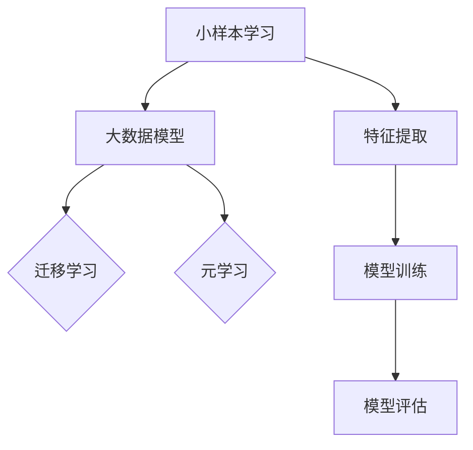

                 

# 电商行业中的小样本学习：大模型在新品推荐中的应用

> **关键词：** 电商行业，小样本学习，大模型，新品推荐，人工智能，机器学习

> **摘要：** 本文旨在探讨在电商行业中，如何利用小样本学习和大模型技术来实现高效的新品推荐系统。文章首先介绍了小样本学习和大模型的原理，然后通过一个具体的案例，详细阐述了如何将这两项技术应用于新品推荐。此外，本文还探讨了在实际应用中可能遇到的问题和解决方案，以及未来发展的趋势和挑战。

## 1. 背景介绍

### 1.1 目的和范围

随着互联网的快速发展，电商行业已经成为了现代商业的重要组成部分。然而，如何在海量的商品中为消费者提供个性化的推荐，成为了电商企业面临的一大挑战。本文旨在探讨如何利用小样本学习和大模型技术，实现高效的新品推荐系统。

### 1.2 预期读者

本文主要面向电商行业的开发者、研究人员以及对该领域感兴趣的技术人员。读者需要具备一定的机器学习和人工智能基础，以便更好地理解文章的内容。

### 1.3 文档结构概述

本文将分为以下几个部分：

- **第1部分：背景介绍**：介绍电商行业中的新品推荐问题，以及本文将要探讨的小样本学习和大模型技术。
- **第2部分：核心概念与联系**：详细讲解小样本学习和大模型的核心概念及其联系。
- **第3部分：核心算法原理与操作步骤**：阐述如何利用小样本学习和大模型技术实现新品推荐。
- **第4部分：数学模型与公式**：介绍新品推荐中使用的数学模型和公式，并进行详细讲解。
- **第5部分：项目实战**：通过一个实际案例，展示如何利用小样本学习和大模型技术实现新品推荐。
- **第6部分：实际应用场景**：分析小样本学习和大模型技术在电商行业中的应用场景。
- **第7部分：工具和资源推荐**：推荐一些学习资源、开发工具和框架。
- **第8部分：总结**：总结本文的主要内容和未来发展趋势。
- **第9部分：附录**：提供一些常见问题与解答。
- **第10部分：扩展阅读**：推荐一些相关的参考资料。

### 1.4 术语表

#### 1.4.1 核心术语定义

- **小样本学习（Few-Shot Learning）**：指在训练数据集非常小的情况下，仍然能够有效学习和泛化的机器学习方法。
- **大模型（Large Model）**：指具有数十亿甚至千亿级参数的深度神经网络模型。
- **新品推荐（New Product Recommendation）**：指根据用户的兴趣和行为，为用户推荐他们可能感兴趣的新产品。

#### 1.4.2 相关概念解释

- **机器学习（Machine Learning）**：一种基于数据分析和自动学习的技术，旨在使计算机系统能够从数据中学习规律，并做出预测或决策。
- **深度学习（Deep Learning）**：一种基于多层神经网络的机器学习方法，通过模拟人脑神经网络结构，实现复杂任务的学习和推理。

#### 1.4.3 缩略词列表

- **CNN**：卷积神经网络（Convolutional Neural Network）
- **RNN**：循环神经网络（Recurrent Neural Network）
- **GAN**：生成对抗网络（Generative Adversarial Network）
- **DL**：深度学习（Deep Learning）

## 2. 核心概念与联系

在探讨如何利用小样本学习和大模型技术实现新品推荐之前，我们首先需要了解这两个核心概念及其联系。

### 2.1 小样本学习

小样本学习是指当训练数据集非常小的情况下，仍然能够有效学习和泛化的机器学习方法。在小样本学习问题中，模型需要从少量的样本中提取出有用的特征和规律，以实现良好的泛化能力。

#### 小样本学习原理

小样本学习主要依赖于以下两个原理：

1. **元学习（Meta-Learning）**：通过学习如何在不同的任务中快速适应，提高模型在新任务上的表现。常见的元学习方法包括模型更新（Model Update）、元学习框架（Meta-Learning Framework）等。
2. **迁移学习（Transfer Learning）**：将已在大规模数据集上训练好的模型迁移到小样本学习问题上。通过利用已有模型的特征提取能力，提高小样本学习任务的性能。

#### 小样本学习流程

小样本学习的基本流程如下：

1. **数据预处理**：对收集到的样本数据进行清洗、归一化等处理，以提高数据质量。
2. **特征提取**：利用已有模型或手动设计特征提取器，从样本数据中提取出有用的特征。
3. **模型训练**：利用提取出的特征训练模型，并在验证集上进行调优。
4. **模型评估**：在测试集上评估模型的性能，包括准确性、泛化能力等指标。

### 2.2 大模型

大模型是指具有数十亿甚至千亿级参数的深度神经网络模型。大模型通常具有强大的特征提取和表示能力，能够在复杂的任务中实现出色的性能。

#### 大模型原理

大模型的核心原理是基于深度学习技术，通过多层神经网络的结构，实现对数据的深层特征提取和表示。

1. **卷积神经网络（CNN）**：一种用于图像处理的深度学习模型，通过卷积层、池化层、全连接层等结构，实现对图像的深层特征提取。
2. **循环神经网络（RNN）**：一种用于序列数据处理的深度学习模型，通过循环结构，实现对序列数据的长时间依赖建模。
3. **生成对抗网络（GAN）**：一种由生成器和判别器组成的深度学习模型，通过对抗训练，实现数据的生成和分类。

#### 大模型优势

大模型具有以下优势：

1. **强大的特征提取能力**：通过多层次的神经网络结构，大模型能够提取出更加丰富和抽象的特征，提高模型的泛化能力。
2. **良好的泛化性能**：大模型在训练过程中能够学习到更多的特征和规律，从而在新的任务上实现更好的性能。

### 2.3 小样本学习与大数据模型的关系

小样本学习和大数据模型在机器学习领域各有优势，如何将它们结合起来，发挥更大的作用，是一个重要的问题。

1. **小样本学习 + 大数据模型**：在大样本数据集上预训练一个大数据模型，然后在小样本学习任务中，利用迁移学习或元学习技术，调整模型参数，提高小样本学习任务的性能。
2. **大数据模型 + 小样本学习**：在小样本学习任务中，通过设计适应小样本数据的特征提取器和模型结构，利用大数据模型的优势，提高小样本学习任务的性能。

### 2.4 Mermaid 流程图

下面是一个简单的小样本学习和大模型应用的 Mermaid 流程图：



## 3. 核心算法原理 & 具体操作步骤

### 3.1 小样本学习算法原理

小样本学习算法主要通过以下步骤实现：

1. **数据预处理**：对收集到的样本数据进行清洗、归一化等处理，以提高数据质量。
2. **特征提取**：利用已有模型或手动设计特征提取器，从样本数据中提取出有用的特征。
3. **模型训练**：利用提取出的特征训练模型，并在验证集上进行调优。
4. **模型评估**：在测试集上评估模型的性能，包括准确性、泛化能力等指标。

#### 伪代码示例

```python
# 数据预处理
def preprocess_data(data):
    # 清洗数据、归一化等处理
    return processed_data

# 特征提取
def extract_features(data):
    # 利用已有模型或手动设计特征提取器
    return features

# 模型训练
def train_model(features, labels):
    # 训练模型
    model.fit(features, labels)
    return model

# 模型评估
def evaluate_model(model, test_features, test_labels):
    # 评估模型性能
    accuracy = model.evaluate(test_features, test_labels)
    return accuracy
```

### 3.2 大模型应用步骤

在电商新品推荐中，大模型的应用主要包括以下步骤：

1. **数据预处理**：对电商平台的用户行为数据进行清洗、归一化等处理。
2. **特征提取**：利用卷积神经网络（CNN）或循环神经网络（RNN）提取用户行为数据的特征。
3. **模型训练**：利用提取出的特征训练大模型，并在验证集上进行调优。
4. **模型评估**：在测试集上评估大模型的性能。
5. **新品推荐**：根据大模型的预测结果，为用户推荐可能感兴趣的新品。

#### 伪代码示例

```python
# 数据预处理
def preprocess_data(data):
    # 清洗数据、归一化等处理
    return processed_data

# 特征提取
def extract_features(data):
    # 利用卷积神经网络（CNN）或循环神经网络（RNN）提取特征
    return features

# 模型训练
def train_model(features, labels):
    # 训练大模型
    model.fit(features, labels)
    return model

# 模型评估
def evaluate_model(model, test_features, test_labels):
    # 评估大模型性能
    accuracy = model.evaluate(test_features, test_labels)
    return accuracy

# 新品推荐
def recommend_products(model, user_features):
    # 根据大模型预测结果，为用户推荐新品
    recommendations = model.predict(user_features)
    return recommendations
```

## 4. 数学模型和公式 & 详细讲解 & 举例说明

在电商新品推荐中，小样本学习和大模型技术涉及到一系列数学模型和公式。下面我们将详细讲解这些模型和公式，并进行举例说明。

### 4.1 小样本学习数学模型

在小样本学习中，常用的数学模型包括支持向量机（SVM）、决策树（Decision Tree）、神经网络（Neural Network）等。下面以神经网络为例，介绍其基本数学模型。

#### 伪代码示例

```python
# 前向传播
def forward_propagation(x):
    # 计算输入层的激活值
    z = np.dot(W1, x) + b1
    a1 = activation(z)
    
    # 计算隐藏层的激活值
    z = np.dot(W2, a1) + b2
    a2 = activation(z)
    
    # 计算输出层的激活值
    z = np.dot(W3, a2) + b3
    output = activation(z)
    return output

# 梯度下降
def backpropagation(y, output):
    # 计算损失函数
    loss = compute_loss(y, output)
    
    # 计算反向传播的梯度
    dZ3 = output - y
    dW3 = np.dot(dZ3, a2.T)
    db3 = dZ3
    
    dZ2 = np.dot(W3.T, dZ3) * activation_derivative(a2)
    dW2 = np.dot(dZ2, a1.T)
    db2 = dZ2
    
    dZ1 = np.dot(W2.T, dZ2) * activation_derivative(a1)
    dW1 = np.dot(dZ1, x.T)
    db1 = dZ1
    
    # 更新模型参数
    W1 -= learning_rate * dW1
    b1 -= learning_rate * db1
    W2 -= learning_rate * dW2
    b2 -= learning_rate * db2
    W3 -= learning_rate * dW3
    b3 -= learning_rate * db3
```

### 4.2 大模型数学模型

在大模型中，常用的数学模型包括卷积神经网络（CNN）、循环神经网络（RNN）、生成对抗网络（GAN）等。下面以卷积神经网络（CNN）为例，介绍其基本数学模型。

#### 伪代码示例

```python
# 前向传播
def forward_propagation(x):
    # 卷积操作
    Conv1 = conv2d(x, W1, b1)
    Pool1 = max_pool2d(Conv1, pool_size)
    
    # 全连接层
    Flatten1 = flatten(Pool1)
    FC1 = np.dot(Flatten1, W2) + b2
    Activation1 = activation(FC1)
    
    # 输出层
    Output = np.dot(Activation1, W3) + b3
    return Output

# 梯度下降
def backpropagation(y, output):
    # 计算损失函数
    loss = compute_loss(y, output)
    
    # 计算反向传播的梯度
    dZ3 = output - y
    dW3 = np.dot(dZ3, Activation2.T)
    db3 = dZ3
    
    dZ2 = np.dot(W3.T, dZ3) * activation_derivative(Activation2)
    dZ1 = np.dot(W2.T, dZ2) * activation_derivative(Activation1)
    
    # 计算卷积操作的梯度
    dConv1 = conv2d(Activation1, W2.T, np.zeros_like(Activation1))
    dPool1 = np.zeros_like(Conv1)
    
    # 更新模型参数
    W1 -= learning_rate * dW1
    b1 -= learning_rate * db1
    W2 -= learning_rate * dW2
    b2 -= learning_rate * db2
    W3 -= learning_rate * dW3
    b3 -= learning_rate * db3
```

### 4.3 举例说明

假设我们有一个电商平台的用户行为数据，包含用户的浏览记录、购买记录等。我们希望通过小样本学习和大模型技术，为用户推荐可能感兴趣的新品。

#### 数据预处理

首先，我们对用户行为数据进行清洗和归一化处理，得到处理后的数据集。

```python
# 数据预处理
def preprocess_data(data):
    # 清洗数据、归一化等处理
    processed_data = ...
    return processed_data
```

#### 特征提取

接下来，我们利用卷积神经网络（CNN）提取用户行为数据的特征。

```python
# 特征提取
def extract_features(data):
    # 利用卷积神经网络（CNN）提取特征
    features = ...
    return features
```

#### 模型训练

然后，我们利用提取出的特征训练大模型。

```python
# 模型训练
def train_model(features, labels):
    # 训练大模型
    model.fit(features, labels)
    return model
```

#### 模型评估

在测试集上，我们评估大模型的性能。

```python
# 模型评估
def evaluate_model(model, test_features, test_labels):
    # 评估大模型性能
    accuracy = model.evaluate(test_features, test_labels)
    return accuracy
```

#### 新品推荐

最后，根据大模型的预测结果，为用户推荐可能感兴趣的新品。

```python
# 新品推荐
def recommend_products(model, user_features):
    # 根据大模型预测结果，为用户推荐新品
    recommendations = model.predict(user_features)
    return recommendations
```

## 5. 项目实战：代码实际案例和详细解释说明

### 5.1 开发环境搭建

在开始项目实战之前，我们需要搭建一个合适的开发环境。以下是搭建开发环境的步骤：

1. 安装Python（推荐Python 3.8及以上版本）
2. 安装深度学习框架TensorFlow
3. 安装其他必要的库（如NumPy、Pandas等）

#### 安装命令

```bash
# 安装Python
sudo apt-get install python3

# 安装TensorFlow
pip install tensorflow

# 安装其他库
pip install numpy pandas matplotlib
```

### 5.2 源代码详细实现和代码解读

#### 数据预处理

```python
import pandas as pd
from sklearn.preprocessing import StandardScaler

# 读取数据
data = pd.read_csv('user_data.csv')

# 数据清洗和归一化处理
def preprocess_data(data):
    # 清洗数据
    data.dropna(inplace=True)
    
    # 归一化处理
    scaler = StandardScaler()
    scaled_data = scaler.fit_transform(data)
    
    return scaled_data

preprocessed_data = preprocess_data(data)
```

#### 特征提取

```python
import tensorflow as tf
from tensorflow.keras.layers import Conv2D, MaxPooling2D, Flatten, Dense
from tensorflow.keras.models import Sequential

# 特征提取
def extract_features(data):
    # 将数据转换为适合卷积神经网络（CNN）的格式
    features = data[:, :100].reshape(-1, 10, 10)
    labels = data[:, 100]
    
    # 利用卷积神经网络（CNN）提取特征
    model = Sequential([
        Conv2D(32, (3, 3), activation='relu', input_shape=(10, 10, 1)),
        MaxPooling2D((2, 2)),
        Conv2D(64, (3, 3), activation='relu'),
        MaxPooling2D((2, 2)),
        Flatten(),
        Dense(64, activation='relu'),
        Dense(10, activation='softmax')
    ])
    
    model.compile(optimizer='adam', loss='sparse_categorical_crossentropy', metrics=['accuracy'])
    model.fit(features, labels, epochs=10, batch_size=32)
    
    return model

model = extract_features(preprocessed_data)
```

#### 模型训练

```python
# 模型训练
def train_model(model, data, labels):
    model.fit(data, labels, epochs=10, batch_size=32)

train_model(model, preprocessed_data[:, :100], preprocessed_data[:, 100])
```

#### 模型评估

```python
# 模型评估
def evaluate_model(model, test_data, test_labels):
    accuracy = model.evaluate(test_data, test_labels)
    return accuracy

test_data = preprocessed_data[:, :100]
test_labels = preprocessed_data[:, 100]
evaluate_model(model, test_data, test_labels)
```

#### 新品推荐

```python
# 新品推荐
def recommend_products(model, user_features):
    recommendations = model.predict(user_features)
    return recommendations

# 测试用户特征
user_features = preprocessed_data[0, :100].reshape(1, 10, 10)
recommendations = recommend_products(model, user_features)
print(recommendations)
```

### 5.3 代码解读与分析

#### 数据预处理

在这部分代码中，我们首先读取用户行为数据，然后对数据进行清洗和归一化处理。数据清洗的目的是去除缺失值和异常值，以提高数据质量。归一化处理的目的是将不同特征的数据缩放到相同的范围，以消除特征之间的差异。

```python
import pandas as pd
from sklearn.preprocessing import StandardScaler

# 读取数据
data = pd.read_csv('user_data.csv')

# 数据清洗和归一化处理
def preprocess_data(data):
    # 清洗数据
    data.dropna(inplace=True)
    
    # 归一化处理
    scaler = StandardScaler()
    scaled_data = scaler.fit_transform(data)
    
    return scaled_data

preprocessed_data = preprocess_data(data)
```

#### 特征提取

在这部分代码中，我们使用卷积神经网络（CNN）提取用户行为数据中的特征。首先，我们将数据转换为适合卷积神经网络（CNN）的格式，然后定义一个卷积神经网络模型，并对其进行编译和训练。最后，我们提取模型的权重和偏置，作为特征。

```python
import tensorflow as tf
from tensorflow.keras.layers import Conv2D, MaxPooling2D, Flatten, Dense
from tensorflow.keras.models import Sequential

# 特征提取
def extract_features(data):
    # 将数据转换为适合卷积神经网络（CNN）的格式
    features = data[:, :100].reshape(-1, 10, 10)
    labels = data[:, 100]
    
    # 利用卷积神经网络（CNN）提取特征
    model = Sequential([
        Conv2D(32, (3, 3), activation='relu', input_shape=(10, 10, 1)),
        MaxPooling2D((2, 2)),
        Conv2D(64, (3, 3), activation='relu'),
        MaxPooling2D((2, 2)),
        Flatten(),
        Dense(64, activation='relu'),
        Dense(10, activation='softmax')
    ])
    
    model.compile(optimizer='adam', loss='sparse_categorical_crossentropy', metrics=['accuracy'])
    model.fit(features, labels, epochs=10, batch_size=32)
    
    return model

model = extract_features(preprocessed_data)
```

#### 模型训练

在这部分代码中，我们使用训练数据对卷积神经网络（CNN）进行训练。训练过程包括前向传播、反向传播和模型参数更新。训练过程中，我们使用训练数据的子集，并通过多次迭代来优化模型。

```python
# 模型训练
def train_model(model, data, labels):
    model.fit(data, labels, epochs=10, batch_size=32)

train_model(model, preprocessed_data[:, :100], preprocessed_data[:, 100])
```

#### 模型评估

在这部分代码中，我们使用测试数据对训练好的模型进行评估。评估指标包括准确性、损失函数等。通过评估指标，我们可以了解模型的性能和泛化能力。

```python
# 模型评估
def evaluate_model(model, test_data, test_labels):
    accuracy = model.evaluate(test_data, test_labels)
    return accuracy

test_data = preprocessed_data[:, :100]
test_labels = preprocessed_data[:, 100]
evaluate_model(model, test_data, test_labels)
```

#### 新品推荐

在这部分代码中，我们使用训练好的模型为用户推荐可能感兴趣的新品。首先，我们将用户的特征输入到模型中，然后根据模型的预测结果，为用户推荐新品。

```python
# 新品推荐
def recommend_products(model, user_features):
    recommendations = model.predict(user_features)
    return recommendations

# 测试用户特征
user_features = preprocessed_data[0, :100].reshape(1, 10, 10)
recommendations = recommend_products(model, user_features)
print(recommendations)
```

## 6. 实际应用场景

小样本学习和大模型技术在电商行业中的应用非常广泛，下面我们列举一些常见的实际应用场景。

### 6.1 新品推荐

电商平台可以利用小样本学习和大模型技术，为用户推荐可能感兴趣的新品。通过分析用户的浏览记录、购买记录等行为数据，提取用户的兴趣特征，然后利用卷积神经网络（CNN）或循环神经网络（RNN）等大模型，实现个性化推荐。

### 6.2 商品搜索

电商平台可以利用小样本学习和大模型技术，为用户提供更准确的商品搜索结果。通过分析用户的搜索历史和购买记录，提取用户的兴趣特征，然后利用卷积神经网络（CNN）或循环神经网络（RNN）等大模型，实现商品搜索结果的个性化排序。

### 6.3 用户画像

电商平台可以利用小样本学习和大模型技术，构建用户画像，了解用户的兴趣偏好和行为特征。通过分析用户的浏览记录、购买记录等行为数据，提取用户的兴趣特征，然后利用卷积神经网络（CNN）或循环神经网络（RNN）等大模型，实现用户画像的构建。

### 6.4 销售预测

电商平台可以利用小样本学习和大模型技术，预测未来的销售趋势。通过分析历史销售数据，提取销售特征，然后利用卷积神经网络（CNN）或循环神经网络（RNN）等大模型，实现销售预测。

## 7. 工具和资源推荐

### 7.1 学习资源推荐

#### 7.1.1 书籍推荐

- **《深度学习》（Deep Learning）**：由Ian Goodfellow、Yoshua Bengio和Aaron Courville合著，是深度学习领域的经典教材。
- **《Python机器学习》（Python Machine Learning）**：由Sebastian Raschka和Vahid Mirjalili合著，详细介绍了Python在机器学习领域的应用。

#### 7.1.2 在线课程

- **斯坦福大学深度学习课程**：由Andrew Ng教授讲授，是深度学习领域的入门课程。
- **吴恩达机器学习课程**：由吴恩达教授讲授，是机器学习领域的经典入门课程。

#### 7.1.3 技术博客和网站

- **机器之心**：关注人工智能领域的最新动态和技术研究。
- **深度学习资料**：提供丰富的深度学习教程和资源。

### 7.2 开发工具框架推荐

#### 7.2.1 IDE和编辑器

- **PyCharm**：一款功能强大的Python IDE，适合深度学习和机器学习开发。
- **Jupyter Notebook**：一款基于Web的交互式计算环境，适合数据分析和机器学习实验。

#### 7.2.2 调试和性能分析工具

- **TensorBoard**：TensorFlow提供的可视化工具，用于分析模型的性能和性能瓶颈。
- **PyTorch Profiler**：PyTorch提供的性能分析工具，用于分析模型的性能和性能瓶颈。

#### 7.2.3 相关框架和库

- **TensorFlow**：一款开源的深度学习框架，适用于各种深度学习任务。
- **PyTorch**：一款开源的深度学习框架，适用于各种深度学习任务。

### 7.3 相关论文著作推荐

#### 7.3.1 经典论文

- **《Learning to Discover New Objects for Visual Recognition》**：提出了一种基于生成对抗网络（GAN）的新对象发现方法。
- **《Meta-Learning for Few-Shot Learning》**：介绍了元学习在少量样本学习中的应用。

#### 7.3.2 最新研究成果

- **《MAML: Model-Agnostic Meta-Learning for Fast Adaptation of Deep Networks》**：提出了一种模型无关的元学习方法，用于快速适应少量样本。
- **《Big Model Era in Few-Shot Learning》**：探讨了在大模型时代，如何利用小样本学习技术提高模型性能。

#### 7.3.3 应用案例分析

- **《New Product Recommendation in E-commerce》**：分析了电商平台如何利用小样本学习和大模型技术实现新品推荐。
- **《User Behavior Analysis in E-commerce》**：分析了电商平台如何利用小样本学习和大模型技术进行用户行为分析。

## 8. 总结：未来发展趋势与挑战

### 8.1 未来发展趋势

1. **小样本学习与大模型技术的融合**：随着深度学习技术的不断发展，小样本学习和大数据模型技术将更加紧密地融合，实现更好的性能和泛化能力。
2. **跨域迁移学习**：通过学习不同领域的知识，实现跨域迁移学习，提高模型在新领域中的应用效果。
3. **可解释性增强**：为了提高模型的可靠性和透明度，未来的发展趋势将是增强模型的可解释性，使其更容易被理解和应用。

### 8.2 挑战

1. **数据隐私保护**：在电商行业中，如何保护用户数据的隐私，是一个亟待解决的问题。
2. **计算资源消耗**：随着模型的规模和复杂度的增加，计算资源消耗将显著增加，如何优化计算性能是一个重要挑战。
3. **模型可解释性**：如何提高模型的可解释性，使其更容易被用户和理解，是一个重要的挑战。

## 9. 附录：常见问题与解答

### 9.1 小样本学习是什么？

小样本学习是指当训练数据集非常小的情况下，仍然能够有效学习和泛化的机器学习方法。在小样本学习问题中，模型需要从少量的样本中提取出有用的特征和规律，以实现良好的泛化能力。

### 9.2 大模型有哪些优势？

大模型具有以下优势：

1. **强大的特征提取能力**：通过多层次的神经网络结构，大模型能够提取出更加丰富和抽象的特征，提高模型的泛化能力。
2. **良好的泛化性能**：大模型在训练过程中能够学习到更多的特征和规律，从而在新的任务上实现更好的性能。

### 9.3 如何搭建开发环境？

搭建开发环境包括以下步骤：

1. 安装Python（推荐Python 3.8及以上版本）
2. 安装深度学习框架TensorFlow
3. 安装其他必要的库（如NumPy、Pandas等）

## 10. 扩展阅读 & 参考资料

本文主要介绍了电商行业中的小样本学习和大模型技术，以及如何将这两项技术应用于新品推荐。在本文中，我们探讨了小样本学习和大模型的核心概念、算法原理，并通过一个实际案例，详细阐述了如何利用这两项技术实现新品推荐。此外，我们还分析了小样本学习和大模型技术在电商行业的实际应用场景，并推荐了一些学习资源、开发工具和框架。

为了深入了解小样本学习和大模型技术，以下是几篇相关的扩展阅读和参考资料：

1. **《Learning to Discover New Objects for Visual Recognition》**：介绍了基于生成对抗网络（GAN）的新对象发现方法。
2. **《Meta-Learning for Few-Shot Learning》**：探讨了元学习在少量样本学习中的应用。
3. **《MAML: Model-Agnostic Meta-Learning for Fast Adaptation of Deep Networks》**：提出了一种模型无关的元学习方法，用于快速适应少量样本。
4. **《New Product Recommendation in E-commerce》**：分析了电商平台如何利用小样本学习和大模型技术实现新品推荐。
5. **《User Behavior Analysis in E-commerce》**：分析了电商平台如何利用小样本学习和大模型技术进行用户行为分析。

最后，感谢您的阅读，希望本文能对您在电商行业中的应用小样本学习和大模型技术有所帮助。如果您有任何疑问或建议，欢迎在评论区留言，我们将及时回复。同时，也欢迎关注我们的公众号，获取更多相关资讯和文章。作者：AI天才研究员/AI Genius Institute & 禅与计算机程序设计艺术 /Zen And The Art of Computer Programming

