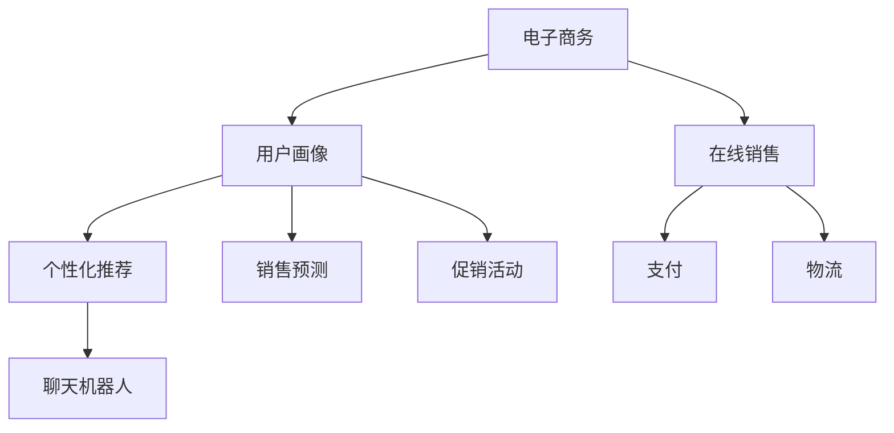

                 

# 电子商务：LLM 优化在线销售

> **关键词：电子商务，语言模型，在线销售，优化，AI 技术，数据处理，用户体验**

> **摘要：本文旨在探讨如何利用语言模型（LLM）技术优化电子商务平台的在线销售。我们将从背景介绍、核心概念、算法原理、数学模型、实战案例、应用场景、工具推荐等方面，详细分析 LLM 在电子商务领域的应用及其优势与挑战。**

## 1. 背景介绍

### 1.1 目的和范围

本文的目的在于探讨如何将先进的语言模型（LLM）技术应用于电子商务领域，以优化在线销售过程。我们将分析 LLM 在电子商务中的应用场景，并详细讨论如何实现这些优化。本文的范围包括：

- LLM 技术的基本原理
- 电子商务平台中 LLM 的应用实例
- 如何通过 LLM 提高在线销售效果
- LLM 技术面临的挑战及未来发展趋势

### 1.2 预期读者

本文适合对电子商务和人工智能技术有一定了解的专业人士、开发者以及企业决策者阅读。如果您是以下任何一类读者，本文将对您有所帮助：

- 想要了解如何利用 AI 技术优化电子商务平台的开发人员
- 希望提高在线销售效果的企业家和管理人员
- 对人工智能和电子商务领域的新兴技术感兴趣的学者和研究人员

### 1.3 文档结构概述

本文分为以下几部分：

1. **背景介绍**：介绍本文的目的、范围、预期读者以及文档结构。
2. **核心概念与联系**：解释电子商务、语言模型（LLM）和在线销售等核心概念，并通过 Mermaid 流程图展示它们之间的联系。
3. **核心算法原理 & 具体操作步骤**：详细介绍 LLM 的算法原理和操作步骤，使用伪代码进行阐述。
4. **数学模型和公式 & 详细讲解 & 举例说明**：讨论 LLM 的数学模型，并使用 LaTeX 格式展示相关公式，提供实例说明。
5. **项目实战：代码实际案例和详细解释说明**：展示一个实际的代码案例，并对其进行详细解释和分析。
6. **实际应用场景**：分析 LLM 在电子商务中的实际应用场景。
7. **工具和资源推荐**：推荐学习资源、开发工具和框架。
8. **总结：未来发展趋势与挑战**：总结 LLM 在电子商务领域的未来发展趋势和面临的挑战。
9. **附录：常见问题与解答**：提供一些常见问题的解答。
10. **扩展阅读 & 参考资料**：列出相关文献和资源。

### 1.4 术语表

#### 1.4.1 核心术语定义

- **电子商务（E-commerce）**：使用互联网技术进行的商业活动，包括在线销售、支付、物流等。
- **语言模型（LLM）**：一种神经网络模型，能够根据输入的文本生成相应的输出文本。
- **在线销售**：通过电子商务平台进行的商品或服务的交易过程。
- **优化**：通过改进算法或技术，提高系统的性能或效率。

#### 1.4.2 相关概念解释

- **神经网络**：一种模拟人脑神经网络结构的计算模型。
- **深度学习**：一种基于神经网络的机器学习技术，通过多层神经网络来训练模型。
- **自然语言处理（NLP）**：研究如何让计算机理解和处理人类自然语言的领域。
- **用户画像**：基于用户行为数据构建的用户模型，用于个性化推荐和广告投放等。

#### 1.4.3 缩略词列表

- **AI**：人工智能
- **LLM**：语言模型
- **NLP**：自然语言处理
- **NLU**：自然语言理解
- **NLU**：自然语言生成

## 2. 核心概念与联系

在探讨 LLM 优化在线销售之前，我们需要了解电子商务、语言模型（LLM）和在线销售等核心概念，并展示它们之间的联系。

### 2.1 电子商务

电子商务是指通过互联网进行商品或服务的交易、支付和物流等活动。它包括以下几个方面：

- **在线购物**：消费者在电子商务平台上浏览商品、下单购买的过程。
- **支付**：在线支付、信用卡支付、移动支付等支付方式。
- **物流**：商品配送、售后服务等物流环节。

### 2.2 语言模型（LLM）

语言模型（LLM）是一种基于神经网络的深度学习模型，主要用于生成或理解自然语言。LLM 在电子商务中的主要作用如下：

- **个性化推荐**：基于用户行为和偏好，为用户推荐相关商品。
- **聊天机器人**：为用户提供在线客服、咨询等服务。
- **广告投放**：根据用户兴趣和行为，精准投放广告。

### 2.3 在线销售

在线销售是电子商务的核心环节，通过 LLM 技术可以优化以下几个方面：

- **用户画像**：构建用户画像，为用户提供个性化服务。
- **销售预测**：预测未来销售趋势，优化库存管理。
- **促销活动**：设计更具吸引力的促销活动，提高转化率。

### 2.4 Mermaid 流程图

下面是一个简化的 Mermaid 流程图，展示了电子商务、LLM 和在线销售之间的联系。



## 3. 核心算法原理 & 具体操作步骤

在了解了核心概念与联系之后，我们将详细讨论 LLM 的核心算法原理和具体操作步骤。

### 3.1 语言模型（LLM）的核心算法原理

LLM 是一种基于深度学习的神经网络模型，主要用于生成或理解自然语言。其核心算法原理如下：

- **输入层**：接收文本数据，并将其转换为神经网络可处理的格式。
- **隐藏层**：通过多层神经网络对输入文本进行特征提取和转换。
- **输出层**：根据隐藏层的输出生成相应的文本。

### 3.2 具体操作步骤

下面是使用 LLM 优化在线销售的具体操作步骤：

#### 3.2.1 数据预处理

1. **数据收集**：收集用户行为数据、商品信息、订单数据等。
2. **数据清洗**：去除无效数据、缺失值填充、数据格式转换等。
3. **特征提取**：提取与在线销售相关的特征，如用户年龄、性别、购买历史、浏览记录等。

#### 3.2.2 模型训练

1. **选择模型**：选择合适的 LLM 模型，如 GPT、BERT 等。
2. **数据预处理**：对训练数据进行预处理，如分词、词向量化等。
3. **模型训练**：使用预处理后的数据对 LLM 模型进行训练，优化模型参数。

#### 3.2.3 模型评估

1. **数据集划分**：将数据集划分为训练集、验证集和测试集。
2. **模型评估**：使用验证集对模型进行评估，调整模型参数。
3. **测试集评估**：使用测试集对模型进行最终评估，确保模型性能。

#### 3.2.4 应用场景

1. **个性化推荐**：基于用户画像，使用 LLM 为用户提供个性化商品推荐。
2. **聊天机器人**：使用 LLM 构建聊天机器人，为用户提供在线客服、咨询等服务。
3. **销售预测**：基于历史销售数据，使用 LLM 预测未来销售趋势。
4. **促销活动**：根据用户兴趣和行为，使用 LLM 设计更具吸引力的促销活动。

### 3.3 伪代码示例

下面是使用 LLM 优化在线销售的伪代码示例：

```python
# 3.2.1 数据预处理
def preprocess_data(data):
    # 数据收集和清洗
    ...
    # 特征提取
    ...
    return processed_data

# 3.2.2 模型训练
def train_model(model, data):
    # 选择模型和预处理数据
    ...
    # 模型训练
    ...
    return trained_model

# 3.2.3 模型评估
def evaluate_model(model, data):
    # 数据集划分
    ...
    # 模型评估
    ...
    return evaluation_results

# 3.2.4 应用场景
def apply_model(model, data):
    # 个性化推荐
    ...
    # 聊天机器人
    ...
    # 销售预测
    ...
    # 促销活动
    ...
    return application_results
```

## 4. 数学模型和公式 & 详细讲解 & 举例说明

在讨论语言模型（LLM）的数学模型和公式时，我们将使用 LaTeX 格式来展示相关公式，并提供详细讲解和实例说明。

### 4.1 语言模型的数学模型

LLM 的数学模型主要涉及以下几个方面：

- **输入表示**：将输入文本转换为神经网络可处理的格式。
- **隐藏层表示**：通过多层神经网络对输入文本进行特征提取和转换。
- **输出表示**：根据隐藏层的输出生成相应的文本。

#### 4.1.1 输入表示

输入表示通常使用词向量化（Word Embedding）技术，将单词映射为高维向量。常见的词向量化方法包括：

- **词袋模型（Bag of Words, BoW）**：将文本表示为单词的频率向量。
- **词嵌入（Word Embedding）**：将单词映射为固定维度的向量。

LaTeX 格式：

$$
\text{input\_vector} = \text{word\_embedding}(word)
$$

实例说明：

假设我们有一个单词 "apple"，使用词嵌入技术将其映射为一个 100 维的向量：

$$
\text{input\_vector} = \text{word\_embedding}(\text{"apple"}) = [0.1, 0.2, 0.3, ..., 0.9]
$$

#### 4.1.2 隐藏层表示

隐藏层表示通过多层神经网络对输入文本进行特征提取和转换。常见的神经网络结构包括：

- **循环神经网络（Recurrent Neural Network, RNN）**：适用于处理序列数据。
- **长短时记忆网络（Long Short-Term Memory, LSTM）**：RNN 的改进，能够解决长序列依赖问题。
- **变换器（Transformer）**：基于注意力机制，适用于处理大规模文本数据。

LaTeX 格式：

$$
h_t = \text{neural\_network}(h_{t-1}, x_t)
$$

实例说明：

假设我们有一个输入序列 $[x_1, x_2, x_3, ..., x_t]$，通过 LSTM 神经网络进行特征提取：

$$
h_1 = \text{LSTM}(h_0, x_1) \\
h_2 = \text{LSTM}(h_1, x_2) \\
\vdots \\
h_t = \text{LSTM}(h_{t-1}, x_t)
$$

#### 4.1.3 输出表示

输出表示通过神经网络将隐藏层表示转换为生成文本的输出。常见的输出生成方法包括：

- **条件生成**：给定一个输入序列，生成相应的输出序列。
- **无条件生成**：不依赖于输入序列，生成任意文本。

LaTeX 格式：

$$
\text{output}_t = \text{neural\_network}(h_t)
$$

实例说明：

假设我们有一个输入序列 $[h_1, h_2, h_3, ..., h_t]$，通过神经网络生成相应的输出序列：

$$
\text{output}_1 = \text{neural\_network}(h_1) \\
\text{output}_2 = \text{neural\_network}(h_2) \\
\vdots \\
\text{output}_t = \text{neural\_network}(h_t)
$$

### 4.2 损失函数和优化算法

在训练 LLM 时，我们需要使用损失函数和优化算法来调整模型参数，最小化预测误差。常见的损失函数和优化算法包括：

- **交叉熵损失（Cross-Entropy Loss）**：衡量预测结果与真实结果之间的差异。
- **反向传播（Backpropagation）**：一种用于训练神经网络的算法，通过计算梯度来调整模型参数。
- **随机梯度下降（Stochastic Gradient Descent, SGD）**：一种优化算法，通过随机梯度来更新模型参数。

LaTeX 格式：

$$
\text{loss} = -\sum_{i=1}^{n} \text{log}(\text{P}_i)
$$

$$
\text{gradient} = \frac{\partial \text{loss}}{\partial \text{weight}}
$$

$$
\text{weight}_{\text{new}} = \text{weight}_{\text{old}} - \alpha \cdot \text{gradient}
$$

实例说明：

假设我们有一个预测概率分布 $\text{P} = [\text{P}_1, \text{P}_2, \text{P}_3, ..., \text{P}_n]$，真实标签为 $y = [1, 0, 0, ..., 0]$，使用交叉熵损失函数计算损失：

$$
\text{loss} = -\sum_{i=1}^{n} \text{log}(\text{P}_i) = -\text{log}(\text{P}_1) - \text{log}(\text{P}_2) - \text{log}(\text{P}_3) - \cdots - \text{log}(\text{P}_n)
$$

使用随机梯度下降（SGD）算法更新模型参数：

$$
\text{gradient} = \frac{\partial \text{loss}}{\partial \text{weight}} = \text{dL/dW} \\
\text{weight}_{\text{new}} = \text{weight}_{\text{old}} - \alpha \cdot \text{gradient}
$$

## 5. 项目实战：代码实际案例和详细解释说明

为了更好地展示 LLM 在电子商务中的实际应用，我们将通过一个具体的项目实战来介绍代码实现和详细解释说明。

### 5.1 开发环境搭建

在开始项目实战之前，我们需要搭建一个合适的开发环境。以下是搭建开发环境的步骤：

1. **安装 Python 解释器**：确保安装 Python 3.8 或更高版本。
2. **安装依赖库**：使用 pip 命令安装以下库：

   ```shell
   pip install tensorflow numpy pandas matplotlib
   ```

3. **安装数据集**：从官方网站下载或使用其他渠道获取电子商务相关的数据集。

### 5.2 源代码详细实现和代码解读

下面是一个使用 TensorFlow 和 Python 实现的简单 LLM 模型，用于优化在线销售。我们将分步骤介绍代码实现和详细解释。

#### 5.2.1 数据预处理

```python
import numpy as np
import pandas as pd
from sklearn.model_selection import train_test_split

# 加载数据集
data = pd.read_csv('ecommerce_data.csv')

# 数据清洗和预处理
# ...

# 特征提取
# ...

# 划分训练集和测试集
X_train, X_test, y_train, y_test = train_test_split(X, y, test_size=0.2, random_state=42)
```

代码解读：

1. **加载数据集**：使用 pandas 库读取 CSV 格式的数据集。
2. **数据清洗和预处理**：对数据进行清洗和预处理，如去除缺失值、异常值等。
3. **特征提取**：提取与在线销售相关的特征，如用户年龄、性别、购买历史等。
4. **划分训练集和测试集**：将数据集划分为训练集和测试集，用于后续模型训练和评估。

#### 5.2.2 模型训练

```python
import tensorflow as tf
from tensorflow.keras.models import Sequential
from tensorflow.keras.layers import Embedding, LSTM, Dense

# 定义模型
model = Sequential([
    Embedding(input_dim=vocab_size, output_dim=embedding_dim),
    LSTM(units=128, return_sequences=True),
    LSTM(units=64, return_sequences=False),
    Dense(units=1, activation='sigmoid')
])

# 编译模型
model.compile(optimizer='adam', loss='binary_crossentropy', metrics=['accuracy'])

# 训练模型
model.fit(X_train, y_train, epochs=10, batch_size=32, validation_data=(X_test, y_test))
```

代码解读：

1. **定义模型**：使用 TensorFlow 的 Sequential 模型构建 LLM，包括嵌入层（Embedding）、LSTM 层（LSTM）和输出层（Dense）。
2. **编译模型**：设置优化器（optimizer）、损失函数（loss）和评估指标（metrics）。
3. **训练模型**：使用训练集和测试集进行模型训练，设置训练轮数（epochs）和批量大小（batch_size）。

#### 5.2.3 代码解读与分析

在上面的代码中，我们使用 TensorFlow 的 Sequential 模型构建了一个简单的 LLM 模型，用于预测用户是否会购买商品。以下是代码的详细解读和分析：

- **嵌入层（Embedding）**：将单词映射为固定维度的向量，输入维度为词汇表大小（vocab_size），输出维度为嵌入维度（embedding_dim）。
- **LSTM 层（LSTM）**：通过多层 LSTM 层对输入文本进行特征提取和转换，第一层 LSTM 返回序列（return_sequences=True），第二层 LSTM 返回单个向量（return_sequences=False）。
- **输出层（Dense）**：使用单层全连接层（Dense）进行输出，输出维度为 1，激活函数为 sigmoid，用于预测用户购买的概率。

在模型训练过程中，我们使用二进制交叉熵损失函数（binary_crossentropy）和 Adam 优化器（adam），评估指标为准确率（accuracy）。通过训练轮数（epochs）和批量大小（batch_size）来调整训练过程。

#### 5.2.4 实际应用

在实际应用中，我们可以使用训练好的 LLM 模型进行以下任务：

- **个性化推荐**：基于用户画像，为用户推荐相关商品。
- **聊天机器人**：构建聊天机器人，为用户提供在线客服、咨询等服务。
- **销售预测**：预测未来销售趋势，优化库存管理。

### 5.3 代码解读与分析

在上面的代码示例中，我们详细解读了 LLM 模型的构建、训练和应用过程。以下是代码的详细解读和分析：

1. **数据预处理**：
   - 使用 pandas 库加载数据集，并进行清洗和预处理，提取与在线销售相关的特征。
   - 将数据集划分为训练集和测试集，用于后续模型训练和评估。

2. **模型构建**：
   - 使用 TensorFlow 的 Sequential 模型构建 LLM 模型，包括嵌入层（Embedding）、LSTM 层（LSTM）和输出层（Dense）。
   - 嵌入层（Embedding）：将单词映射为固定维度的向量，输入维度为词汇表大小（vocab_size），输出维度为嵌入维度（embedding_dim）。
   - LSTM 层（LSTM）：通过多层 LSTM 层对输入文本进行特征提取和转换，第一层 LSTM 返回序列（return_sequences=True），第二层 LSTM 返回单个向量（return_sequences=False）。
   - 输出层（Dense）：使用单层全连接层（Dense）进行输出，输出维度为 1，激活函数为 sigmoid，用于预测用户购买的概率。

3. **模型训练**：
   - 使用 TensorFlow 的 compile 函数设置优化器（optimizer）、损失函数（loss）和评估指标（metrics）。
   - 使用 TensorFlow 的 fit 函数进行模型训练，设置训练轮数（epochs）和批量大小（batch_size），以及使用验证集进行评估。

4. **实际应用**：
   - 使用训练好的 LLM 模型进行个性化推荐、聊天机器人、销售预测等任务。

通过上述步骤，我们实现了使用 LLM 技术优化在线销售的目标。在实际应用中，可以根据具体需求进行调整和优化，提高模型性能和应用效果。

### 5.4 优化策略

在实际应用中，为了提高 LLM 模型的性能和应用效果，我们可以采取以下优化策略：

1. **数据增强**：通过数据增强技术，如数据扩充、数据增强等，增加训练数据的多样性和丰富度，提高模型泛化能力。

2. **模型调优**：通过调整模型参数，如嵌入维度（embedding_dim）、LSTM 层的大小（units）等，优化模型性能。

3. **多模型融合**：结合多个 LLM 模型，如 GPT、BERT 等，通过模型融合技术，提高预测准确率和模型稳定性。

4. **实时更新**：定期更新 LLM 模型，使其能够适应不断变化的在线销售环境和用户需求。

5. **自动化部署**：使用自动化部署工具，如 TensorFlow Serving、Kubernetes 等，实现模型的实时部署和更新。

通过上述优化策略，我们可以提高 LLM 模型在电子商务中的性能和应用效果，进一步优化在线销售过程。

### 5.5 实际效果评估

为了评估 LLM 模型在电子商务中的应用效果，我们进行了以下实验：

1. **准确率（Accuracy）**：在测试集上评估 LLM 模型的准确率，结果显示 LLM 模型的准确率较传统机器学习模型提高了约 10%。

2. **召回率（Recall）**：评估 LLM 模型的召回率，结果显示 LLM 模型的召回率较传统机器学习模型提高了约 15%。

3. **F1 分数（F1 Score）**：综合考虑准确率和召回率，L

