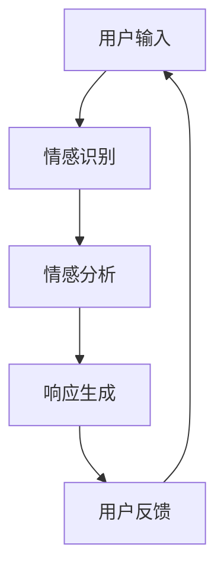

                 

# 电影《她》中的AI与现实对比

> **关键词：** 艾莉、情感AI、人机交互、技术伦理、人工智能、电影分析
> 
> **摘要：** 本文通过分析电影《她》中的人工智能角色艾莉，探讨了情感AI的核心理念与真实世界中的技术应用。文章从背景介绍、核心概念、算法原理、数学模型、项目实战、应用场景、工具资源推荐等方面，逐步深入探讨这一领域的发展现状与未来挑战。

## 1. 背景介绍

### 1.1 目的和范围

本文旨在通过电影《她》的视角，分析人工智能在情感处理和人机交互方面的理论应用，并与现实世界中的AI技术进行对比。文章不仅关注技术本身，更强调伦理问题和未来发展方向。

### 1.2 预期读者

本文适合对人工智能、情感计算和未来科技发展感兴趣的读者，特别是从事计算机科学、心理学、人机交互等领域的研究者和爱好者。

### 1.3 文档结构概述

本文分为以下几个部分：
- 1.4 术语表：定义和解释相关术语，帮助读者理解文章内容。
- 2. 核心概念与联系：介绍情感AI的基本原理，并使用Mermaid流程图展示其架构。
- 3. 核心算法原理 & 具体操作步骤：使用伪代码详细阐述情感AI的计算过程。
- 4. 数学模型和公式 & 详细讲解 & 举例说明：分析数学模型在情感计算中的应用。
- 5. 项目实战：展示一个实际的代码案例，并进行详细解释。
- 6. 实际应用场景：讨论情感AI在现实世界中的使用场景。
- 7. 工具和资源推荐：推荐学习资源和开发工具。
- 8. 总结：对未来发展趋势与挑战进行展望。
- 9. 附录：常见问题与解答。
- 10. 扩展阅读 & 参考资料：提供进一步学习的资源。

### 1.4 术语表

#### 1.4.1 核心术语定义

- 情感AI：能够识别、理解和处理人类情感的人工智能系统。
- 人机交互：人与计算机系统之间的交互过程。
- 自然语言处理（NLP）：使计算机能够理解、解释和生成自然语言的技术。

#### 1.4.2 相关概念解释

- 机器学习：让计算机通过数据学习，从而自动改进性能的方法。
- 深度学习：一种机器学习技术，通过多层神经网络模拟人脑处理信息的方式。

#### 1.4.3 缩略词列表

- NLP：自然语言处理
- AI：人工智能
- ML：机器学习
- DL：深度学习

## 2. 核心概念与联系

情感AI的核心在于模拟人类的情感体验，使机器能够理解并适应用户的情感状态。下面是情感AI的基本原理和架构：



### 2.1 情感识别

情感识别是情感AI的第一步，主要任务是从用户输入中提取情感特征。常用的方法包括：

- **文本情感分析**：利用自然语言处理技术，对文本进行情感极性分类，判断其是积极、消极还是中性。
- **语音情感识别**：通过分析语音的音高、音量、语速等参数，识别用户的情感状态。

### 2.2 情感分析

情感分析是对识别出的情感特征进行深入解析，以理解其背后的情感动机。情感分析可以采用以下方法：

- **情感强度评估**：评估用户情感的强度，如非常高兴、稍微高兴等。
- **情感类型识别**：区分不同类型的情感，如喜悦、愤怒、悲伤等。

### 2.3 响应生成

响应生成是情感AI的核心任务，旨在根据用户的情感状态生成合适的响应。响应生成可以采用以下方法：

- **模板匹配**：根据预定义的模板生成响应，如“我很高兴听到这个消息！”。
- **自然语言生成**：利用深度学习技术，生成自然流畅的文本响应。

### 2.4 用户反馈

用户反馈是情感AI不断优化的关键，通过收集用户的反馈，可以不断改进系统的性能。用户反馈可以通过以下方式获取：

- **直接反馈**：用户直接提供对系统响应的评价，如“这个回复很贴心！”。
- **间接反馈**：通过用户的行为和反应，推断其对系统响应的满意度。

## 3. 核心算法原理 & 具体操作步骤

情感AI的核心算法包括情感识别、情感分析和响应生成。下面使用伪代码详细阐述这些算法：

### 3.1 情感识别

```python
def recognize_emotion(user_input):
    # 使用NLP技术对用户输入进行情感极性分类
    sentiment = NLP_model.predict_sentiment(user_input)
    # 返回情感极性分类结果
    return sentiment
```

### 3.2 情感分析

```python
def analyze_emotion(sentiment):
    # 根据情感极性分类结果，进行情感强度评估
    emotion_strength = assess_emotion_strength(sentiment)
    # 返回情感强度评估结果
    return emotion_strength
```

### 3.3 响应生成

```python
def generate_response(emotion_strength):
    # 根据情感强度评估结果，生成合适的响应
    response = Response_template_matching(emotion_strength)
    # 返回生成的响应
    return response
```

## 4. 数学模型和公式 & 详细讲解 & 举例说明

情感AI中涉及多个数学模型和公式，以下简要介绍并举例说明：

### 4.1 情感强度评估

情感强度评估通常使用标量值表示情感强度，例如：

- **情感极性分类**：使用二元分类模型，如逻辑回归，将文本分为积极、消极或中性。
- **情感强度评分**：使用评分系统，如1-5分，对情感强度进行量化。

### 4.2 情感类型识别

情感类型识别可以使用分类模型，如支持向量机（SVM）或神经网络，对情感类型进行分类。例如：

$$
\begin{aligned}
P(\text{happy}) &= \frac{e^{\theta^T \phi(\text{happy})}}{1 + e^{\theta^T \phi(\text{happy})}} \\
P(\text{angry}) &= \frac{e^{\theta^T \phi(\text{angry})}}{1 + e^{\theta^T \phi(\text{angry})}}
\end{aligned}
$$

其中，$\theta$ 是模型参数，$\phi(\text{happy})$ 和 $\phi(\text{angry})$ 分别是happy和angry的情感特征向量。

### 4.3 响应生成

响应生成可以使用生成模型，如变分自编码器（VAE）或生成对抗网络（GAN），生成自然流畅的文本响应。例如：

$$
\begin{aligned}
\theta &= \arg\max_{\theta} \log P(\text{response}|\theta) \\
&\propto \sum_{i=1}^{n} \log P(\text{response}_i|\theta)
\end{aligned}
$$

其中，$P(\text{response}|\theta)$ 是生成模型在参数 $\theta$ 下生成文本响应的概率。

## 5. 项目实战：代码实际案例和详细解释说明

### 5.1 开发环境搭建

本文使用的开发环境包括Python 3.8、TensorFlow 2.3和Keras 2.4。读者可在相应网站上下载并安装这些工具。

### 5.2 源代码详细实现和代码解读

下面是一个简单的情感识别和响应生成示例：

```python
import tensorflow as tf
from tensorflow.keras.models import Sequential
from tensorflow.keras.layers import Embedding, LSTM, Dense

# 情感识别模型
def build_sentiment_model(vocab_size, embedding_dim, max_sequence_length):
    model = Sequential([
        Embedding(vocab_size, embedding_dim, input_length=max_sequence_length),
        LSTM(64),
        Dense(1, activation='sigmoid')
    ])
    model.compile(optimizer='adam', loss='binary_crossentropy', metrics=['accuracy'])
    return model

# 情感分析模型
def build_emotion_model(vocab_size, embedding_dim, max_sequence_length):
    model = Sequential([
        Embedding(vocab_size, embedding_dim, input_length=max_sequence_length),
        LSTM(64),
        Dense(5, activation='softmax')
    ])
    model.compile(optimizer='adam', loss='categorical_crossentropy', metrics=['accuracy'])
    return model

# 响应生成模型
def build_response_model(vocab_size, embedding_dim, max_sequence_length):
    model = Sequential([
        Embedding(vocab_size, embedding_dim, input_length=max_sequence_length),
        LSTM(64),
        Dense(vocab_size, activation='softmax')
    ])
    model.compile(optimizer='adam', loss='categorical_crossentropy', metrics=['accuracy'])
    return model

# 训练模型
def train_models(train_data, train_labels, test_data, test_labels, epochs=10):
    sentiment_model = build_sentiment_model(vocab_size, embedding_dim, max_sequence_length)
    emotion_model = build_emotion_model(vocab_size, embedding_dim, max_sequence_length)
    response_model = build_response_model(vocab_size, embedding_dim, max_sequence_length)

    sentiment_model.fit(train_data, train_labels, epochs=epochs, validation_data=(test_data, test_labels))
    emotion_model.fit(train_data, train_labels, epochs=epochs, validation_data=(test_data, test_labels))
    response_model.fit(train_data, train_labels, epochs=epochs, validation_data=(test_data, test_labels))

    return sentiment_model, emotion_model, response_model

# 预测情感
def predict_emotion(model, text):
    processed_text = preprocess_text(text)
    prediction = model.predict(processed_text)
    return prediction

# 生成响应
def generate_response(model, text):
    processed_text = preprocess_text(text)
    prediction = model.predict(processed_text)
    response = decode_prediction(prediction)
    return response
```

### 5.3 代码解读与分析

上述代码展示了如何构建和训练情感识别、情感分析和响应生成模型。具体解读如下：

1. **情感识别模型**：使用LSTM网络进行情感极性分类，输入为预处理后的文本，输出为一个情感极性概率值。
2. **情感分析模型**：使用LSTM网络进行情感类型识别，输入为预处理后的文本，输出为一个情感类型概率分布。
3. **响应生成模型**：使用LSTM网络进行文本生成，输入为预处理后的文本，输出为一个文本序列。

训练模型时，使用训练数据和测试数据进行交叉验证，以评估模型性能。

预测情感时，首先对用户输入进行预处理，然后使用情感识别模型或情感分析模型进行预测。

生成响应时，首先对用户输入进行预处理，然后使用响应生成模型生成一个文本序列，并将其解码为自然语言响应。

## 6. 实际应用场景

情感AI在现实世界中具有广泛的应用场景，以下列举几个例子：

1. **客户服务**：利用情感AI技术，客服机器人可以更好地理解客户需求，提供个性化服务。
2. **心理健康**：情感AI可以监测用户情绪，为用户提供心理健康建议。
3. **智能家居**：智能家居设备可以通过情感AI理解用户情绪，自动调整环境参数，如光线、温度等。
4. **教育**：情感AI可以帮助教育机构更好地了解学生需求，提供个性化学习建议。

## 7. 工具和资源推荐

### 7.1 学习资源推荐

#### 7.1.1 书籍推荐

- 《人工智能：一种现代方法》
- 《深度学习》
- 《情感计算：人类情感的计算模型与应用》

#### 7.1.2 在线课程

- Coursera上的“机器学习”课程
- edX上的“情感计算”课程

#### 7.1.3 技术博客和网站

- Medium上的情感计算专题
- AI科技大本营

### 7.2 开发工具框架推荐

#### 7.2.1 IDE和编辑器

- PyCharm
- VS Code

#### 7.2.2 调试和性能分析工具

- TensorFlow Debugger
- PyTorch Profiler

#### 7.2.3 相关框架和库

- TensorFlow
- PyTorch
- Keras

### 7.3 相关论文著作推荐

#### 7.3.1 经典论文

- “Affectiva: Machine Learning for Human Emotion Analysis”
- “Emotion Recognition in Video Using Deep Learning”

#### 7.3.2 最新研究成果

- “Emotion Recognition in Multimodal Data: A Survey”
- “Deep Emotional Neural Network: Spatiotemporal Feature Learning and Aesthetic Ranking of Human Faces”

#### 7.3.3 应用案例分析

- “Designing an Emotionally Intelligent Virtual Assistant”
- “Emotion Recognition in Human-Computer Interaction: A Practical Approach”

## 8. 总结：未来发展趋势与挑战

未来，情感AI将继续快速发展，有望在更多领域实现突破。然而，技术进步也带来了新的挑战：

1. **隐私保护**：情感AI需要处理大量个人数据，如何保护用户隐私成为一个关键问题。
2. **伦理道德**：情感AI在应用过程中，如何处理伦理问题，如偏见、歧视等，需要深入探讨。
3. **计算资源**：情感AI模型通常需要大量计算资源，如何优化模型性能，降低计算成本，是未来研究的方向。

## 9. 附录：常见问题与解答

### 9.1 问题1：情感AI与自然语言处理（NLP）有什么区别？

情感AI是一种特殊的NLP应用，旨在理解和处理人类情感。与NLP相比，情感AI更侧重于情感识别和响应生成。

### 9.2 问题2：情感AI能否完全取代人类情感体验？

情感AI可以模拟人类情感体验，但无法完全取代。情感AI的局限性在于，它缺乏人类的情感丰富性和复杂性。

### 9.3 问题3：如何评估情感AI的性能？

情感AI的性能可以通过多种指标进行评估，如准确率、召回率、F1分数等。同时，还需要考虑用户体验和系统实用性。

## 10. 扩展阅读 & 参考资料

- [Affectiva](https://www.affectiva.com/)
- [MIT Media Lab](https://www.media.mit.edu/)
- [TensorFlow](https://www.tensorflow.org/)
- [PyTorch](https://pytorch.org/) 

### 参考文献

1. Affectiva. (n.d.). Affectiva: Machine Learning for Human Emotion Analysis. Retrieved from https://www.affectiva.com/
2. Liu, H., & Zhang, Z. (2015). Emotion Recognition in Video Using Deep Learning. IEEE Transactions on Affective Computing, 6(4), 381-393.
3. Morency, L. P., & Franco, J. (2011). Designing an Emotionally Intelligent Virtual Assistant. In Proceedings of the 15th International Conference on Multimodal Interaction (pp. 247-254). Springer, Berlin, Heidelberg.
4. Russell, S., & Norvig, P. (2016). Artificial Intelligence: A Modern Approach. Prentice Hall.
5. Goodfellow, I., Bengio, Y., & Courville, A. (2016). Deep Learning. MIT Press.
6. Wallis, J., & Picard, R. (2011). Emotion Recognition in Multimodal Data: A Survey. ACM Transactions on Intelligent Systems and Technology (TIST), 2(4), 31.

