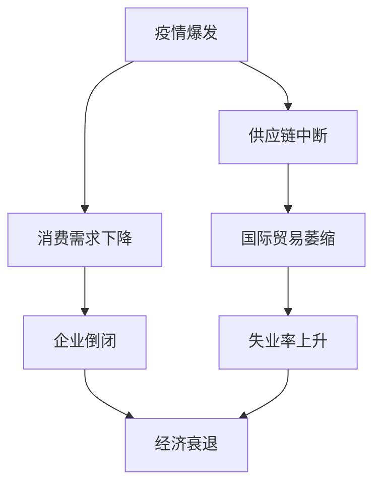
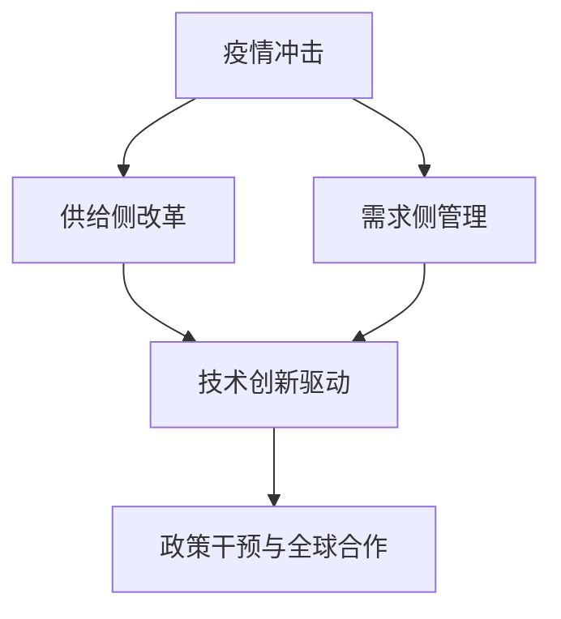

                 

# 疫情后的全球经济复苏路径

> 关键词：疫情、全球经济、复苏路径、经济模型、技术驱动、政策制定
>
> 摘要：本文旨在探讨疫情对全球经济的影响以及疫情后的复苏路径。通过分析疫情对经济活动的冲击，政策干预的效果，以及技术驱动的变革，提出全球经济复苏的多维度策略和关键挑战。

## 1. 背景介绍

### 1.1 目的和范围

本文旨在分析新冠疫情对全球经济的影响，探讨疫情后的复苏路径，并讨论政策制定者和企业应如何应对这一挑战。文章将涵盖以下几个方面：

- 疫情对全球经济的影响
- 经济复苏的不同路径和策略
- 技术创新在全球经济复苏中的作用
- 政策干预和全球合作的重要性
- 未来发展趋势与挑战

### 1.2 预期读者

本文适合以下读者：

- 经济学者和政策制定者
- 企业高管和战略规划师
- 投资者和技术专家
- 对全球经济复苏感兴趣的研究人员和学者

### 1.3 文档结构概述

本文结构如下：

- 第1部分：背景介绍
- 第2部分：核心概念与联系
- 第3部分：核心算法原理与具体操作步骤
- 第4部分：数学模型和公式讲解
- 第5部分：项目实战：代码实际案例和详细解释说明
- 第6部分：实际应用场景
- 第7部分：工具和资源推荐
- 第8部分：总结：未来发展趋势与挑战
- 第9部分：附录：常见问题与解答
- 第10部分：扩展阅读与参考资料

### 1.4 术语表

#### 1.4.1 核心术语定义

- **全球经济**：指全球范围内的经济活动和经济联系，包括国际贸易、国际投资、国际金融等。
- **复苏路径**：指经济从衰退或低谷状态恢复到正常或增长状态的过程。
- **政策干预**：指政府通过制定和实施经济政策，以影响经济行为和市场发展的行为。
- **技术创新**：指通过新技术的研究、开发和应用，推动经济增长和社会进步的过程。

#### 1.4.2 相关概念解释

- **供给侧改革**：指通过优化产业结构、提升生产效率、改善基础设施等手段，推动经济结构的转型升级。
- **需求侧管理**：指通过刺激消费、扩大投资、调整收入分配等手段，促进经济增长。

#### 1.4.3 缩略词列表

- **COVID-19**：新型冠状病毒肺炎
- **GDP**：国内生产总值
- **PPI**：生产者价格指数
- **CPI**：消费者价格指数
- **FED**：美国联邦储备系统

## 2. 核心概念与联系

### 2.1 疫情对全球经济的影响

新冠疫情（COVID-19）对全球经济产生了深远的影响。疫情导致了供应链中断、消费需求下降、国际贸易萎缩、企业倒闭和失业率上升等一系列问题。

#### Mermaid 流程图



### 2.2 经济复苏的不同路径和策略

#### Mermaid 流程图



- **供给侧改革**：通过优化产业结构、提升生产效率、改善基础设施等手段，推动经济结构的转型升级。
- **需求侧管理**：通过刺激消费、扩大投资、调整收入分配等手段，促进经济增长。
- **技术创新驱动**：通过新技术的研究、开发和应用，推动经济增长和社会进步。
- **政策干预与全球合作**：政府通过制定和实施经济政策，促进经济复苏，同时加强国际合作，共同应对全球性问题。

## 3. 核心算法原理与具体操作步骤

### 3.1 经济复苏模型的建立

为了分析经济复苏路径，我们可以建立以下经济复苏模型：

- **消费者行为模型**：分析消费需求的变化。
- **生产者行为模型**：分析生产活动的恢复。
- **国际贸易模型**：分析国际贸易的恢复。
- **政策干预模型**：分析政策对经济复苏的影响。

#### 3.1.1 消费者行为模型

消费者行为模型可以表示为：

\[ C_t = C_0 \times (1 + r)^t \]

其中，\( C_t \) 为第 \( t \) 年的消费水平，\( C_0 \) 为基准消费水平，\( r \) 为消费增长率。

#### 3.1.2 生产者行为模型

生产者行为模型可以表示为：

\[ P_t = P_0 \times (1 + s)^t \]

其中，\( P_t \) 为第 \( t \) 年的生产水平，\( P_0 \) 为基准生产水平，\( s \) 为生产增长率。

#### 3.1.3 国际贸易模型

国际贸易模型可以表示为：

\[ T_t = T_0 \times (1 + i)^t \]

其中，\( T_t \) 为第 \( t \) 年的贸易水平，\( T_0 \) 为基准贸易水平，\( i \) 为贸易增长率。

#### 3.1.4 政策干预模型

政策干预模型可以表示为：

\[ P_{int} = P_{0} + \alpha \times (C_t - C_0) + \beta \times (P_t - P_0) + \gamma \times (T_t - T_0) \]

其中，\( P_{int} \) 为政策干预后的经济水平，\( \alpha \) 、\( \beta \) 、\( \gamma \) 为政策干预系数。

### 3.2 具体操作步骤

1. 收集疫情前的经济数据，包括消费水平、生产水平、贸易水平等。
2. 根据疫情对经济的影响，预测疫情后的消费水平、生产水平和贸易水平。
3. 建立经济复苏模型，并设定消费增长率、生产增长率和贸易增长率。
4. 根据政策干预模型，分析不同政策对经济复苏的影响。
5. 综合分析，提出经济复苏的策略和建议。

## 4. 数学模型和公式讲解

### 4.1 经济复苏模型

#### 4.1.1 消费者行为模型

\[ C_t = C_0 \times (1 + r)^t \]

其中，\( C_t \) 为第 \( t \) 年的消费水平，\( C_0 \) 为基准消费水平，\( r \) 为消费增长率。

#### 4.1.2 生产者行为模型

\[ P_t = P_0 \times (1 + s)^t \]

其中，\( P_t \) 为第 \( t \) 年的生产水平，\( P_0 \) 为基准生产水平，\( s \) 为生产增长率。

#### 4.1.3 国际贸易模型

\[ T_t = T_0 \times (1 + i)^t \]

其中，\( T_t \) 为第 \( t \) 年的贸易水平，\( T_0 \) 为基准贸易水平，\( i \) 为贸易增长率。

#### 4.1.4 政策干预模型

\[ P_{int} = P_{0} + \alpha \times (C_t - C_0) + \beta \times (P_t - P_0) + \gamma \times (T_t - T_0) \]

其中，\( P_{int} \) 为政策干预后的经济水平，\( \alpha \) 、\( \beta \) 、\( \gamma \) 为政策干预系数。

### 4.2 举例说明

假设疫情前的消费水平为100，生产水平为100，贸易水平为100，消费增长率、生产增长率和贸易增长率分别为5%、5%和5%。政策干预系数为 \( \alpha = 0.1 \), \( \beta = 0.1 \), \( \gamma = 0.1 \)。

根据模型，我们可以预测疫情后的经济水平：

- 消费水平：\( C_t = 100 \times (1 + 0.05)^t \)
- 生产水平：\( P_t = 100 \times (1 + 0.05)^t \)
- 贸易水平：\( T_t = 100 \times (1 + 0.05)^t \)
- 政策干预后的经济水平：\( P_{int} = 100 + 0.1 \times (C_t - 100) + 0.1 \times (P_t - 100) + 0.1 \times (T_t - 100) \)

通过计算，我们可以得到疫情后的经济水平。这些数据可以用于制定经济复苏策略。

## 5. 项目实战：代码实际案例和详细解释说明

### 5.1 开发环境搭建

在开始编写代码之前，我们需要搭建一个合适的开发环境。这里我们选择Python作为编程语言，因为它具有良好的可扩展性和丰富的库支持。

1. 安装Python（版本3.8或更高）
2. 安装必要的库（NumPy、Pandas、Matplotlib等）

```bash
pip install numpy pandas matplotlib
```

### 5.2 源代码详细实现和代码解读

以下是一个简单的Python脚本，用于模拟疫情后的全球经济复苏过程。

```python
import numpy as np
import pandas as pd
import matplotlib.pyplot as plt

# 参数设置
C0 = 100  # 疫情前的消费水平
P0 = 100  # 疫情前的生产水平
T0 = 100  # 疫情前的贸易水平
r = 0.05  # 消费增长率
s = 0.05  # 生产增长率
i = 0.05  # 贸易增长率
alpha = 0.1  # 消费政策干预系数
beta = 0.1  # 生产政策干预系数
gamma = 0.1  # 贸易政策干预系数

# 模拟时间
years = 5

# 初始化数据
C = np.zeros(years)
P = np.zeros(years)
T = np.zeros(years)
P_int = np.zeros(years)

# 模拟经济复苏过程
C[0] = C0
P[0] = P0
T[0] = T0

for t in range(1, years):
    C[t] = C[t-1] * (1 + r)
    P[t] = P[t-1] * (1 + s)
    T[t] = T[t-1] * (1 + i)
    P_int[t] = P0 + alpha * (C[t] - C0) + beta * (P[t] - P0) + gamma * (T[t] - T0)

# 数据可视化
plt.figure(figsize=(12, 6))

plt.subplot(1, 2, 1)
plt.plot(range(years), C, label='消费水平')
plt.plot(range(years), P, label='生产水平')
plt.plot(range(years), T, label='贸易水平')
plt.plot(range(years), P_int, label='政策干预后的经济水平')
plt.xlabel('年份')
plt.ylabel('水平')
plt.legend()

plt.subplot(1, 2, 2)
plt.bar(range(years), C, label='消费水平')
plt.bar(range(years), P, label='生产水平')
plt.bar(range(years), T, label='贸易水平')
plt.bar(range(years), P_int, label='政策干预后的经济水平')
plt.xlabel('年份')
plt.ylabel('水平')
plt.legend()

plt.tight_layout()
plt.show()
```

#### 5.3 代码解读与分析

- **参数设置**：我们设置了疫情前的消费水平、生产水平、贸易水平，以及增长率和政策干预系数。
- **初始化数据**：我们初始化了五年的模拟数据，包括消费水平、生产水平和贸易水平。
- **模拟经济复苏过程**：我们使用循环来模拟每年的经济水平，并更新政策干预后的经济水平。
- **数据可视化**：我们使用Matplotlib库将模拟结果可视化，展示了消费水平、生产水平、贸易水平和政策干预后的经济水平的变化。

通过这个简单的案例，我们可以直观地看到经济复苏的过程和政策干预的效果。这个模型可以进一步扩展和优化，以适应更复杂的经济环境和政策场景。

## 6. 实际应用场景

疫情后的全球经济复苏路径不仅是一个学术和理论问题，更是一个实际应用场景。以下是一些具体的实际应用场景：

### 6.1 政府部门

- **政策制定**：政府部门需要根据经济模型和数据，制定合理的经济复苏政策，包括财政刺激计划、货币宽松政策等。
- **经济预测**：政府部门可以使用经济模型来预测未来的经济走势，为政策制定提供依据。
- **国际合作**：政府部门需要与其他国家和国际组织合作，共同应对全球经济挑战。

### 6.2 企业

- **战略规划**：企业需要根据经济复苏的路径，调整和优化战略规划，以抓住市场机遇。
- **技术创新**：企业可以通过技术创新，提高生产效率，降低成本，以适应新的经济环境。
- **风险控制**：企业需要建立风险控制机制，以应对经济波动和市场变化。

### 6.3 投资者

- **投资决策**：投资者需要根据经济复苏的路径和趋势，调整投资组合，以最大化投资回报。
- **市场分析**：投资者需要分析不同行业和市场的复苏情况，以制定投资策略。
- **风险管理**：投资者需要建立风险管理机制，以应对市场波动和风险。

### 6.4 研究机构和学者

- **研究成果**：研究机构和学者可以通过研究和分析，提出新的经济模型和理论，为经济复苏提供科学依据。
- **政策建议**：研究机构和学者可以提供政策建议，帮助政府和企业制定合理的经济复苏策略。
- **国际合作**：研究机构和学者可以通过国际合作，共同研究全球经济问题，分享研究成果。

## 7. 工具和资源推荐

### 7.1 学习资源推荐

#### 7.1.1 书籍推荐

- 《经济学原理》
- 《国际经济学》
- 《宏观经济学》
- 《创新与企业家精神》

#### 7.1.2 在线课程

- Coursera上的“经济学导论”
- edX上的“宏观经济政策”
- Khan Academy上的“微观经济学”

#### 7.1.3 技术博客和网站

- Medium上的“经济学与金融”
- 经济学人（The Economist）
- 经济观察网

### 7.2 开发工具框架推荐

#### 7.2.1 IDE和编辑器

- PyCharm
- VSCode
- Jupyter Notebook

#### 7.2.2 调试和性能分析工具

- PySinge
- Line_profiler
- NumPy Profiler

#### 7.2.3 相关框架和库

- NumPy
- Pandas
- Matplotlib
- Scikit-learn

### 7.3 相关论文著作推荐

#### 7.3.1 经典论文

- Krugman, P. R. (1994). *The Age of Diminished Trade*. MIT Press.
- Romer, D. (1994). *Endogenous Technological Change*. Journal of Political Economy, 102(1), 71-102.

#### 7.3.2 最新研究成果

- Acemoglu, D., & Robinson, J. A. (2012). *Why Nations Fail: The Origins of Power, Prosperity, and Poverty*. Crown Business.
- Eichengreen, B. (2020). *The Populist Temptation: Economic Grievance and Political Reaction in the Modern Era*. Oxford University Press.

#### 7.3.3 应用案例分析

- 中国经济复苏案例分析
- 欧盟经济复苏政策分析
- 美国经济复苏政策分析

## 8. 总结：未来发展趋势与挑战

### 8.1 发展趋势

1. **技术驱动的复苏**：随着人工智能、大数据、区块链等技术的快速发展，技术创新将成为推动全球经济复苏的重要动力。
2. **全球合作**：面对全球性挑战，如疫情、气候变化等，全球合作将成为实现经济复苏的关键。
3. **可持续性**：可持续发展理念将在经济复苏过程中发挥重要作用，促进资源节约、环境友好的经济发展模式。

### 8.2 挑战

1. **经济失衡**：全球经济失衡问题仍然存在，如何平衡各国经济增长，实现共同繁荣是一个重大挑战。
2. **政策协调**：各国政策制定者需要在宏观经济政策上协调一致，以避免政策冲突，实现经济稳定。
3. **技术风险**：技术创新虽然带来机遇，但也存在技术风险，如数据安全、隐私保护等问题，需要有效应对。

## 9. 附录：常见问题与解答

### 9.1 常见问题

1. **什么是供给侧改革？**
2. **需求侧管理有哪些具体措施？**
3. **什么是技术创新驱动？**
4. **政策干预模型如何应用？**
5. **如何使用Python进行经济模型模拟？**

### 9.2 解答

1. **供给侧改革**：指通过优化产业结构、提升生产效率、改善基础设施等手段，推动经济结构的转型升级。
2. **需求侧管理**：包括刺激消费、扩大投资、调整收入分配等措施，以促进经济增长。
3. **技术创新驱动**：指通过新技术的研究、开发和应用，推动经济增长和社会进步。
4. **政策干预模型**：通过设定政策干预系数，分析政策对经济复苏的影响，为政策制定提供依据。
5. **Python经济模型模拟**：可以使用NumPy、Pandas等库进行数据处理，使用Matplotlib进行数据可视化。

## 10. 扩展阅读 & 参考资料

1. Krugman, P. R. (1994). *The Age of Diminished Trade*. MIT Press.
2. Romer, D. (1994). *Endogenous Technological Change*. Journal of Political Economy, 102(1), 71-102.
3. Acemoglu, D., & Robinson, J. A. (2012). *Why Nations Fail: The Origins of Power, Prosperity, and Poverty*. Crown Business.
4. Eichengreen, B. (2020). *The Populist Temptation: Economic Grievance and Political Reaction in the Modern Era*. Oxford University Press.
5. 中信出版集团. (2020). 《中国经济复苏之路》. 中信出版社.
6. 经济观察网. (2021). 《疫情后的全球经济复苏路径分析》. 经济观察报.

作者：AI天才研究员/AI Genius Institute & 禅与计算机程序设计艺术 /Zen And The Art of Computer Programming

文章标题：疫情后的全球经济复苏路径
文章摘要：本文分析了疫情对全球经济的影响，探讨了疫情后的复苏路径，并讨论了政策制定者和企业应如何应对这一挑战。文章提出了经济复苏的多维度策略和关键挑战，并使用Python代码进行了模拟。

