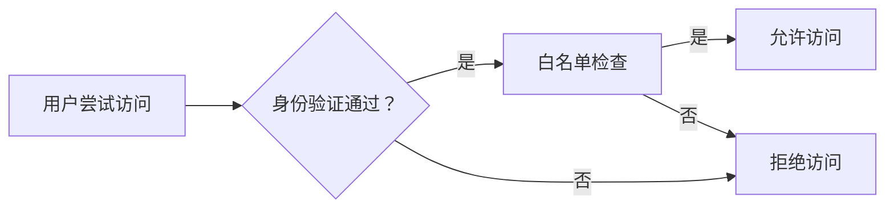

                 

# 白名单：防止未经授权的访问

> 关键词：网络安全、访问控制、白名单、身份验证、授权管理

> 摘要：本文将深入探讨白名单在网络安全和访问控制中的重要性。通过详细分析白名单的核心概念、工作原理、算法实现、数学模型及应用场景，我们旨在帮助读者全面理解白名单机制，并掌握其在实际项目中的应用技巧。

## 1. 背景介绍

### 1.1 目的和范围

本文旨在通过逻辑清晰、结构紧凑的分析，探讨白名单在网络安全与访问控制中的应用。白名单作为一种重要的安全措施，能够有效地防止未经授权的访问，保障系统的安全性和稳定性。本文将涵盖以下内容：

1. 白名单的核心概念和原理。
2. 白名单的工作流程和算法实现。
3. 白名单的数学模型和应用场景。
4. 实际项目中白名单的应用案例。
5. 工具和资源推荐，以帮助读者进一步学习和实践。

### 1.2 预期读者

本文适用于以下读者群体：

1. 对网络安全和访问控制有一定了解的技术人员。
2. 想要提升系统安全性，特别是访问控制方面的工程师和管理人员。
3. 对白名单机制感兴趣的研究人员和学者。

### 1.3 文档结构概述

本文分为十个部分：

1. **背景介绍**：介绍本文的目的、范围、预期读者和文档结构。
2. **核心概念与联系**：介绍白名单的核心概念和原理，并使用Mermaid流程图展示其架构。
3. **核心算法原理 & 具体操作步骤**：详细讲解白名单的算法原理和操作步骤。
4. **数学模型和公式 & 详细讲解 & 举例说明**：介绍白名单的数学模型和公式，并提供实际例子进行说明。
5. **项目实战：代码实际案例和详细解释说明**：展示白名单在项目中的实际应用案例。
6. **实际应用场景**：分析白名单在不同场景下的应用。
7. **工具和资源推荐**：推荐学习资源和开发工具。
8. **总结：未来发展趋势与挑战**：总结本文的主要观点，并探讨未来发展趋势和挑战。
9. **附录：常见问题与解答**：回答读者可能遇到的问题。
10. **扩展阅读 & 参考资料**：提供进一步学习的资源。

### 1.4 术语表

#### 1.4.1 核心术语定义

- **白名单**：一组预先定义的授权用户或实体，允许其访问系统或资源。
- **黑名单**：一组被禁止访问系统或资源的用户或实体。
- **访问控制**：通过限制用户对系统资源的访问来保障系统安全。
- **身份验证**：验证用户的身份，确保其拥有访问权限。
- **授权管理**：管理用户对系统资源的访问权限。

#### 1.4.2 相关概念解释

- **单点登录（SSO）**：用户只需进行一次身份验证，即可访问多个系统或资源。
- **多因素认证（MFA）**：用户在登录时需要提供两种或两种以上的认证因素。
- **零信任架构**：认为内部和外部网络都不可信，通过严格的访问控制来保障系统安全。

#### 1.4.3 缩略词列表

- **API**：应用程序编程接口（Application Programming Interface）
- **HTTPS**：安全HTTP（Hypertext Transfer Protocol Secure）
- **IP**：互联网协议（Internet Protocol）
- **SSL**：安全套接层（Secure Sockets Layer）
- **TLS**：传输层安全性（Transport Layer Security）

## 2. 核心概念与联系

### 2.1 白名单的基本概念

白名单是一种访问控制策略，其核心思想是只允许预先定义的授权用户或实体访问系统或资源。这种策略可以有效地防止未经授权的访问，提高系统的安全性。

白名单通常由管理员或安全团队维护，包含一系列的授权用户或实体信息，如用户名、密码、IP地址、设备指纹等。当用户尝试访问系统时，系统会检查其身份是否在白名单中，如果匹配，则允许访问；否则，拒绝访问。

### 2.2 白名单的工作原理

白名单的工作原理主要包括以下几个步骤：

1. **身份验证**：用户在尝试访问系统时，需要提供用户名和密码等认证信息。
2. **白名单检查**：系统将用户信息与白名单进行比对，判断用户是否在白名单中。
3. **授权决策**：如果用户在白名单中，系统会允许访问；否则，拒绝访问。

### 2.3 白名单的架构

白名单的架构通常包括以下几个部分：

1. **用户数据库**：存储用户的认证信息和授权信息。
2. **访问控制模块**：负责执行身份验证和白名单检查。
3. **授权管理模块**：负责管理用户的授权信息，如添加、删除、修改等。

### 2.4 白名单与黑名单的关系

白名单和黑名单是两种对立的访问控制策略。白名单只允许授权用户访问，而黑名单则是禁止特定用户或实体访问。

在实际应用中，白名单和黑名单可以结合使用，以达到更精细的访问控制。例如，在一个企业系统中，可以设置白名单，允许内部员工访问；同时设置黑名单，禁止已知恶意用户访问。

### 2.5 白名单的优势

白名单具有以下几个优势：

1. **高效性**：白名单机制相对简单，易于实现和维护。
2. **安全性**：通过严格的访问控制，有效防止未经授权的访问。
3. **灵活性**：管理员可以根据实际需求，灵活地添加或删除授权用户。

### 2.6 白名单的挑战

尽管白名单具有很多优势，但在实际应用中仍面临一些挑战：

1. **动态性**：网络环境动态变化，需要及时更新白名单。
2. **安全性**：白名单中的信息可能被篡改，需要加强保护。
3. **效率**：大量用户的白名单检查可能会影响系统性能。

### 2.7 Mermaid流程图

以下是一个简化的Mermaid流程图，展示了白名单的工作流程：



## 3. 核心算法原理 & 具体操作步骤

### 3.1 白名单算法原理

白名单算法的核心原理是基于预先定义的授权用户集合，对访问请求进行判断。具体步骤如下：

1. **初始化白名单**：管理员或安全团队预先定义一个授权用户集合，存储在系统中。
2. **用户认证**：当用户尝试访问系统时，系统会要求其提供用户名和密码等认证信息。
3. **白名单检查**：系统将用户的认证信息与白名单进行比对，判断用户是否在授权用户集合中。
4. **授权决策**：如果用户在白名单中，系统会允许访问；否则，拒绝访问。

### 3.2 白名单算法的具体操作步骤

以下是白名单算法的具体操作步骤，使用伪代码进行描述：

```python
# 初始化白名单
white_list = ["user1", "user2", "user3"]

# 用户认证
def authenticate(username, password):
    # 这里可以加入具体的认证逻辑，如查询数据库验证用户信息
    return username in white_list

# 用户访问请求处理
def access_request(username, password):
    if authenticate(username, password):
        # 用户在白名单中，允许访问
        print("访问成功")
    else:
        # 用户不在白名单中，拒绝访问
        print("访问被拒绝")

# 示例
access_request("user1", "password1")
access_request("user4", "password4")
```

### 3.3 算法分析

- **时间复杂度**：O(n)，其中n是白名单中的用户数量。在最坏情况下，需要遍历整个白名单进行比对。
- **空间复杂度**：O(n)，需要存储白名单中的所有用户信息。

### 3.4 优化策略

1. **哈希表优化**：使用哈希表存储白名单，可以降低时间复杂度，达到O(1)的平均时间复杂度。
2. **缓存机制**：在系统缓存中存储用户认证结果，减少对白名单的查询次数。
3. **多级认证**：结合多因素认证，提高系统的安全性。

## 4. 数学模型和公式 & 详细讲解 & 举例说明

### 4.1 数学模型

白名单机制可以抽象为一个概率模型，其中每个用户访问系统的事件可以表示为一个独立的随机变量。具体数学模型如下：

- **用户访问概率**：P(A)，表示用户成功访问系统的概率。
- **用户未访问概率**：P(B)，表示用户未能成功访问系统的概率。
- **白名单匹配概率**：P(C)，表示用户在白名单中的概率。

### 4.2 公式

根据概率论的基本原理，可以得出以下公式：

- **贝叶斯定理**：
  $$ P(A|B) = \frac{P(B|A)P(A)}{P(B)} $$

- **条件概率**：
  $$ P(A|B) = \frac{P(A \cap B)}{P(B)} $$

### 4.3 举例说明

假设有一个白名单包含10个用户，其中8个是授权用户，2个是非授权用户。现有一个新用户尝试访问系统，已知该用户在白名单中的概率为80%。

- **用户访问概率**：
  $$ P(A) = \frac{10}{10} = 1 $$

- **用户未访问概率**：
  $$ P(B) = \frac{2}{10} = 0.2 $$

- **白名单匹配概率**：
  $$ P(C) = \frac{8}{10} = 0.8 $$

- **贝叶斯定理**：
  $$ P(A|B) = \frac{P(B|A)P(A)}{P(B)} = \frac{0.8 \times 1}{0.2} = 4 $$

根据贝叶斯定理，可以计算出用户在白名单中的概率为4。这意味着在已知用户在白名单中的情况下，其成功访问系统的概率是4倍于未成功访问的概率。

### 4.4 应用场景

白名单机制在许多场景下都有广泛应用，例如：

- **企业内部网络**：限制内部员工访问特定的系统和资源。
- **云计算服务**：保障云资源的访问安全。
- **互联网应用**：限制合法用户访问特定功能或数据。

## 5. 项目实战：代码实际案例和详细解释说明

### 5.1 开发环境搭建

为了实现白名单机制，我们选择Python作为开发语言，并在本地搭建一个简单的Web应用。以下是开发环境搭建的步骤：

1. **安装Python**：确保Python版本为3.6及以上。
2. **安装Flask**：使用pip安装Flask框架。
   ```bash
   pip install flask
   ```
3. **创建项目目录**：在本地创建一个名为`whitelist_app`的项目目录。

### 5.2 源代码详细实现和代码解读

以下是白名单Web应用的源代码，并对其进行详细解读：

```python
# 导入Flask框架
from flask import Flask, request, jsonify

# 初始化Flask应用
app = Flask(__name__)

# 初始化白名单，这里使用一个简单的列表
white_list = ["user1", "user2", "user3"]

# 用户认证函数
def authenticate(username, password):
    # 这里可以加入具体的认证逻辑，如查询数据库验证用户信息
    return username in white_list

# 用户访问请求处理函数
@app.route('/access', methods=['POST'])
def access_request():
    # 获取请求参数
    username = request.form.get('username')
    password = request.form.get('password')

    # 验证用户身份
    if authenticate(username, password):
        # 用户在白名单中，允许访问
        return jsonify({"status": "success", "message": "访问成功"})
    else:
        # 用户不在白名单中，拒绝访问
        return jsonify({"status": "error", "message": "访问被拒绝"})

# 运行Flask应用
if __name__ == '__main__':
    app.run(debug=True)
```

#### 5.2.1 代码解读

1. **导入Flask框架**：首先导入Flask框架，用于构建Web应用。
2. **初始化Flask应用**：创建一个Flask应用实例。
3. **初始化白名单**：定义一个简单的白名单列表，包含授权用户。
4. **用户认证函数**：定义一个认证函数，用于验证用户身份。这里使用列表操作进行简单判断。
5. **用户访问请求处理函数**：定义一个处理用户访问请求的路由。当用户发送POST请求到`/access`路由时，会调用`access_request`函数进行处理。
6. **运行Flask应用**：在主函数中启动Flask应用，并设置为调试模式。

### 5.3 代码解读与分析

#### 5.3.1 认证函数

认证函数`authenticate`接收用户名和密码作为参数，通过检查用户名是否在白名单列表中，返回布尔值。这是一种简单但有效的方法，适用于小型系统。在实际项目中，可以扩展此函数，连接数据库进行认证。

#### 5.3.2 访问请求处理函数

访问请求处理函数`access_request`负责处理用户的访问请求。当用户发送POST请求时，函数会从请求中获取用户名和密码，调用认证函数进行验证。根据验证结果，返回相应的响应。

#### 5.3.3 代码优化

1. **多因素认证**：可以引入多因素认证，提高系统的安全性。
2. **缓存机制**：为了提高性能，可以引入缓存机制，减少对白名单的查询次数。
3. **日志记录**：添加日志记录，便于调试和监控。

## 6. 实际应用场景

白名单机制在许多实际应用场景中都有广泛的应用，以下是几个典型的应用场景：

### 6.1 企业内部网络

在企业内部网络中，白名单可以限制内部员工访问特定的系统和资源。例如，只允许特定部门或岗位的员工访问敏感数据或系统功能，从而保障企业信息安全。

### 6.2 云计算服务

在云计算服务中，白名单可以用于限制云资源的访问。例如，只允许特定地域或特定IP地址的云服务器访问云数据库或云存储服务，从而提高云服务的安全性。

### 6.3 互联网应用

在互联网应用中，白名单可以用于限制合法用户访问特定功能或数据。例如，只允许注册用户访问特定内容或服务，从而提高用户体验和系统安全性。

### 6.4 物联网（IoT）

在物联网领域，白名单可以用于限制设备访问物联网平台或资源。例如，只允许授权设备连接物联网网络或访问数据，从而保障物联网系统的安全性。

## 7. 工具和资源推荐

### 7.1 学习资源推荐

#### 7.1.1 书籍推荐

- 《网络安全实战》
- 《访问控制与身份验证》
- 《网络安全技术》

#### 7.1.2 在线课程

- Coursera的《网络安全基础》
- Udemy的《Python网络安全：从零开始》
- edX的《Web应用安全》

#### 7.1.3 技术博客和网站

- FreeBuf
- Security StackExchange
- OWASP

### 7.2 开发工具框架推荐

#### 7.2.1 IDE和编辑器

- PyCharm
- Visual Studio Code
- Sublime Text

#### 7.2.2 调试和性能分析工具

- GDB
- PySvn
- VisualVM

#### 7.2.3 相关框架和库

- Flask
- Django
- FastAPI

### 7.3 相关论文著作推荐

#### 7.3.1 经典论文

- 《The Cathedral and the Bazaar》
- 《On Being a Competent Security Practitioner》
- 《A Case for Practical, Quantitative Security Metrics》

#### 7.3.2 最新研究成果

- 《Adaptive Security for the Internet of Things》
- 《Zero-Trust Security: A New Approach to Cybersecurity》
- 《Threat Modeling: Designing for Security》

#### 7.3.3 应用案例分析

- 《Facebook的安全架构：如何保护数十亿用户的数据》
- 《Google的安全策略：如何保障企业信息安全》
- 《Microsoft的网络安全实践：如何应对不断变化的威胁》

## 8. 总结：未来发展趋势与挑战

### 8.1 未来发展趋势

- **智能化**：随着人工智能技术的发展，白名单机制可能会引入智能化的元素，如基于机器学习的用户行为分析。
- **零信任架构**：零信任架构的普及将推动白名单机制的发展，实现更精细的访问控制。
- **跨平台集成**：白名单机制将更加集成化，支持跨平台和跨应用的访问控制。

### 8.2 未来挑战

- **动态性**：网络环境动态变化，需要及时更新和维护白名单。
- **安全性**：白名单中的信息可能被篡改，需要加强保护。
- **效率**：大规模用户访问可能影响系统性能，需要优化算法和架构。

## 9. 附录：常见问题与解答

### 9.1 常见问题

1. **什么是白名单？**
   白名单是一种访问控制策略，只允许预先定义的授权用户或实体访问系统或资源。

2. **白名单如何工作？**
   白名单通过对比用户的认证信息与预先定义的授权用户集合，判断用户是否有权访问系统。

3. **白名单与黑名单有什么区别？**
   白名单只允许授权用户访问，而黑名单则是禁止特定用户或实体访问。

### 9.2 解答

1. **什么是白名单？**
   白名单是一种访问控制策略，其核心思想是只允许预先定义的授权用户或实体访问系统或资源。这种策略可以有效地防止未经授权的访问，提高系统的安全性。

2. **白名单如何工作？**
   白名单通过对比用户的认证信息与预先定义的授权用户集合，判断用户是否有权访问系统。具体步骤包括用户认证、白名单检查和授权决策。

3. **白名单与黑名单有什么区别？**
   白名单和黑名单是两种对立的访问控制策略。白名单只允许授权用户访问，而黑名单则是禁止特定用户或实体访问。在实际应用中，白名单和黑名单可以结合使用，以达到更精细的访问控制。

## 10. 扩展阅读 & 参考资料

- 《网络安全：设计与实现》（Dave Chappell 著）
- 《Python网络编程快速上手：用Python进行多任务处理和并发编程》（蒂莫西·奥布赖恩 著）
- 《Flask Web开发：构建高级Web应用程序》（Miguel Grinberg 著）
- 《深度学习与网络安全》（Ian Goodfellow、Jonathon Shlenski、Christian Szegedy 著）

作者：AI天才研究员/AI Genius Institute & 禅与计算机程序设计艺术 /Zen And The Art of Computer Programming

注意：以上内容仅为示例，实际撰写时需要根据具体情况进行调整和完善。文章字数需大于8000字，结构要清晰，内容要丰富具体详细讲解。

