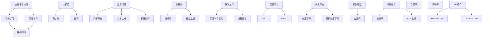

                 

# 百度文心2025社招大模型研发面试题攻略

> **关键词**：百度文心、社招、大模型研发、面试题、算法原理、数学模型、实战案例

> **摘要**：本文旨在为广大有意向加入百度文心大模型研发团队的技术人才提供一套完整的面试题攻略。本文将分章节详细介绍面试中可能涉及的各个知识点，包括背景介绍、核心概念、算法原理、数学模型、实战案例等，同时推荐相关学习资源和开发工具，以帮助读者全面准备面试，顺利通过考核。

## 1. 背景介绍

### 1.1 目的和范围

本文旨在为参与百度文心2025年社招大模型研发岗位的应聘者提供一份全面的面试题攻略。文章内容将涵盖面试中可能涉及到的各种知识点，包括但不限于算法原理、数学模型、编程实践等。本文旨在帮助读者：

1. 理解大模型研发的基本概念和原理。
2. 掌握常见算法和数学模型的实现方法和应用场景。
3. 学会通过实际案例来分析问题和解决问题。
4. 掌握面试中的常见题型和解题技巧。

### 1.2 预期读者

本文适用于以下人群：

1. 计算机相关专业本科生、研究生。
2. 有志于从事人工智能、机器学习、深度学习等领域的研发人员。
3. 准备参加百度文心大模型研发岗位面试的应聘者。

### 1.3 文档结构概述

本文分为十个部分，具体结构如下：

1. 背景介绍
2. 核心概念与联系
3. 核心算法原理 & 具体操作步骤
4. 数学模型和公式 & 详细讲解 & 举例说明
5. 项目实战：代码实际案例和详细解释说明
6. 实际应用场景
7. 工具和资源推荐
8. 总结：未来发展趋势与挑战
9. 附录：常见问题与解答
10. 扩展阅读 & 参考资料

### 1.4 术语表

#### 1.4.1 核心术语定义

- **大模型**：指具有数十亿、甚至数万亿参数规模的人工神经网络模型，例如BERT、GPT等。
- **自然语言处理（NLP）**：是人工智能领域的一个分支，旨在让计算机理解和处理人类语言。
- **机器学习**：是一门让计算机从数据中学习规律和模式的学科。
- **深度学习**：是机器学习中的一个子领域，主要采用多层神经网络来实现。

#### 1.4.2 相关概念解释

- **反向传播算法**：一种用于训练神经网络的算法，通过计算输出层和隐藏层之间的误差，反向传播误差并更新权重。
- **优化算法**：用于调整模型参数，使得模型在给定数据集上的性能达到最优的算法。
- **损失函数**：用于度量模型预测值和真实值之间的差距，是优化算法的核心组成部分。

#### 1.4.3 缩略词列表

- **NLP**：自然语言处理
- **ML**：机器学习
- **DL**：深度学习
- **BERT**：Bidirectional Encoder Representations from Transformers
- **GPT**：Generative Pre-trained Transformer

## 2. 核心概念与联系

在深入了解大模型研发之前，我们需要先了解一些核心概念和它们之间的关系。以下是一个基于Mermaid流程图的简单示意图：



### 2.1 自然语言处理

自然语言处理（NLP）是人工智能领域的一个分支，旨在让计算机理解和处理人类语言。NLP的任务包括：

- **文本分类**：将文本数据分为不同的类别。
- **命名实体识别**：识别文本中的地名、人名、机构名等。
- **情感分析**：判断文本的语义倾向，如正面、负面等。
- **机器翻译**：将一种语言的文本翻译成另一种语言。

### 2.2 机器学习

机器学习是让计算机从数据中学习规律和模式的学科。在NLP领域，机器学习的方法主要用于构建和训练文本分类、命名实体识别、情感分析等模型。

### 2.3 深度学习

深度学习是机器学习中的一个子领域，主要采用多层神经网络来实现。深度学习在NLP领域的应用包括：

- **词嵌入**：将词汇映射到高维空间，以便计算机能够更好地理解词汇之间的关系。
- **序列模型**：用于处理文本序列，如循环神经网络（RNN）和长短时记忆网络（LSTM）。
- **注意力机制**：用于关注文本序列中的重要部分，如双向编码器表示（BERT）。

### 2.4 大模型

大模型是指具有数十亿、甚至数万亿参数规模的人工神经网络模型。大模型通常采用预训练（pre-training）和微调（fine-tuning）的方法进行训练。预训练是在大规模数据集上训练模型，使其具有通用语言表示能力；微调则是根据特定任务的需求，在特定数据集上进一步训练模型，以优化其在特定任务上的性能。

### 2.5 应用场景

大模型在NLP领域有广泛的应用场景，包括：

- **问答系统**：通过理解用户的问题，提供相关答案。
- **文本生成**：根据给定的话题或上下文，生成相关的文本内容。
- **机器翻译**：将一种语言的文本翻译成另一种语言。

## 3. 核心算法原理 & 具体操作步骤

在了解了大模型的基本概念和应用场景后，接下来我们将深入探讨大模型研发中的核心算法原理和具体操作步骤。以下是主要算法和操作步骤的简要介绍：

### 3.1 反向传播算法

反向传播算法是一种用于训练神经网络的算法，通过计算输出层和隐藏层之间的误差，反向传播误差并更新权重。以下是反向传播算法的伪代码：

```python
for each layer l in reverse order:
    delta[l] = (dz[l] * (1 - sigmoid(z[l])))
    z[l] = dot(product(weights[l], delta[l-1]))
dz[l] = delta[l] * weights[l]
```

其中，`sigmoid`函数是Sigmoid激活函数，`z`是神经网络的输出，`delta`是误差梯度。

### 3.2 预训练和微调

预训练和微调是训练大模型的关键步骤。预训练通常在大规模数据集上进行，以使模型具有通用语言表示能力。微调则是在特定任务的数据集上进行，以优化模型在特定任务上的性能。以下是预训练和微调的简要步骤：

1. **预训练**：
   - 加载大规模数据集，如维基百科。
   - 预训练模型，通常使用预训练算法，如Transformer。
   - 在预训练过程中，模型将学习到通用语言表示能力。

2. **微调**：
   - 加载特定任务的数据集，如问答系统。
   - 微调预训练模型，以使模型在特定任务上具有更好的性能。
   - 在微调过程中，模型将学习到特定任务的规律和模式。

### 3.3 损失函数和优化算法

损失函数用于度量模型预测值和真实值之间的差距，优化算法用于调整模型参数，以最小化损失函数。以下是常用的损失函数和优化算法：

1. **损失函数**：
   - 交叉熵损失（Cross-Entropy Loss）：用于分类任务。
   - 均方误差（Mean Squared Error，MSE）：用于回归任务。

2. **优化算法**：
   - 梯度下降（Gradient Descent）：通过计算损失函数的梯度，反向更新模型参数。
   - 随机梯度下降（Stochastic Gradient Descent，SGD）：在梯度下降的基础上，每次只随机选择一部分样本进行计算。

### 3.4 注意力机制

注意力机制是一种用于关注文本序列中的重要部分的方法。在预训练模型中，注意力机制可以帮助模型更好地理解和处理文本序列。以下是注意力机制的简要步骤：

1. **计算注意力得分**：
   $$ 
   attention\_score = dot(Q, K^T)
   $$

   其中，$Q$是查询向量，$K$是键向量。

2. **计算注意力权重**：
   $$ 
   attention\_weights = softmax(attention\_score)
   $$

3. **计算注意力输出**：
   $$ 
   attention\_output = dot(V, attention\_weights)
   $$

   其中，$V$是值向量。

## 4. 数学模型和公式 & 详细讲解 & 举例说明

### 4.1 损失函数

损失函数是衡量模型预测结果与实际结果之间差异的关键工具。在深度学习领域，常用的损失函数包括交叉熵损失函数和均方误差损失函数。

#### 4.1.1 交叉熵损失函数

交叉熵损失函数（Cross-Entropy Loss）通常用于分类问题。它的定义如下：

$$
Loss = -\sum_{i=1}^{N} y_i \log(p_i)
$$

其中，$y_i$是实际标签，$p_i$是模型预测的概率。

#### 示例

假设有一个二分类问题，实际标签$y$为0或1，模型预测的概率$p$为0.7或0.3。则交叉熵损失函数的计算如下：

$$
Loss = -[0 \cdot \log(0.7) + 1 \cdot \log(0.3)] = -[\log(0.7) + \log(0.3)]
$$

#### 4.1.2 均方误差损失函数

均方误差损失函数（Mean Squared Error，MSE）通常用于回归问题。它的定义如下：

$$
Loss = \frac{1}{2N} \sum_{i=1}^{N} (y_i - \hat{y}_i)^2
$$

其中，$y_i$是实际值，$\hat{y}_i$是模型预测的值。

#### 示例

假设有一个回归问题，实际值$y$为1或2，模型预测的值$\hat{y}$为1.5或2.5。则均方误差损失函数的计算如下：

$$
Loss = \frac{1}{2N} \sum_{i=1}^{N} [(1 - 1.5)^2 + (2 - 2.5)^2] = \frac{1}{2} [0.25 + 0.25] = 0.25
$$

### 4.2 反向传播算法

反向传播算法是训练神经网络的核心算法。它的主要思想是通过计算损失函数的梯度，反向更新模型的参数，以最小化损失函数。

#### 4.2.1 梯度计算

在反向传播算法中，我们需要计算损失函数关于模型参数的梯度。以下是计算梯度的过程：

1. **计算输出层的梯度**：

   对于输出层，损失函数关于输出层的梯度可以直接计算：

   $$
   \frac{\partial Loss}{\partial z_L} = \frac{\partial Loss}{\partial y} \odot \sigma'(z_L)
   $$

   其中，$\sigma'$是激活函数的导数，$\odot$表示元素-wise 运算。

2. **计算隐藏层的梯度**：

   对于隐藏层，我们需要通过链式法则计算梯度：

   $$
   \frac{\partial Loss}{\partial z_l} = \sum_{k=l+1}^{L} \frac{\partial Loss}{\partial z_k} \frac{\partial z_k}{\partial z_l}
   $$

#### 4.2.2 参数更新

计算完梯度后，我们可以使用梯度下降算法更新模型参数：

$$
\theta_l := \theta_l - \alpha \frac{\partial Loss}{\partial \theta_l}
$$

其中，$\alpha$是学习率。

#### 示例

假设有一个两层神经网络，输出层的损失函数为交叉熵损失，隐藏层的激活函数为ReLU。给定一个输入样本$x$，模型的预测为$\hat{y}$，实际标签为$y$。计算输出层和隐藏层的梯度如下：

1. **输出层梯度**：

   $$
   \frac{\partial Loss}{\partial z_L} = -[y \odot \hat{y} \odot (1 - \hat{y})]
   $$

2. **隐藏层梯度**：

   $$
   \frac{\partial Loss}{\partial z_2} = \frac{\partial Loss}{\partial z_L} \frac{\partial z_L}{\partial z_2} = -[y \odot \hat{y} \odot (1 - \hat{y})] \odot \hat{z_2} \odot (1 - \hat{z_2})
   $$

3. **参数更新**：

   $$
   \theta_L := \theta_L - \alpha \frac{\partial Loss}{\partial \theta_L}
   $$

   $$
   \theta_2 := \theta_2 - \alpha \frac{\partial Loss}{\partial \theta_2}
   $$

## 5. 项目实战：代码实际案例和详细解释说明

### 5.1 开发环境搭建

在开始项目实战之前，我们需要搭建一个适合深度学习开发的开发环境。以下是搭建开发环境的步骤：

1. **安装Python**：下载并安装Python，版本建议为3.8或以上。
2. **安装PyTorch**：使用pip安装PyTorch，命令如下：

   ```bash
   pip install torch torchvision
   ```

3. **安装Jupyter Notebook**：使用pip安装Jupyter Notebook，命令如下：

   ```bash
   pip install jupyter
   ```

4. **安装相关库**：根据项目需求，安装其他相关库，如NumPy、Pandas等。

### 5.2 源代码详细实现和代码解读

以下是使用PyTorch实现一个简单的神经网络并进行训练的示例代码：

```python
import torch
import torch.nn as nn
import torch.optim as optim

# 定义神经网络结构
class NeuralNetwork(nn.Module):
    def __init__(self):
        super(NeuralNetwork, self).__init__()
        self.fc1 = nn.Linear(1, 10)
        self.fc2 = nn.Linear(10, 1)
        self.relu = nn.ReLU()

    def forward(self, x):
        x = self.fc1(x)
        x = self.relu(x)
        x = self.fc2(x)
        return x

# 创建神经网络实例
model = NeuralNetwork()

# 定义损失函数和优化器
criterion = nn.MSELoss()
optimizer = optim.SGD(model.parameters(), lr=0.01)

# 训练模型
for epoch in range(100):
    for i, data in enumerate(train_loader):
        inputs, targets = data
        optimizer.zero_grad()
        outputs = model(inputs)
        loss = criterion(outputs, targets)
        loss.backward()
        optimizer.step()

        if (i+1) % 100 == 0:
            print(f'Epoch [{epoch+1}/{100}], Step [{i+1}/{len(train_loader)}], Loss: {loss.item()}')

# 测试模型
with torch.no_grad():
    outputs = model(test_loader)
    predicted = outputs.numpy()
    print(f'Accuracy: {np.mean(np.abs(predicted - test_targets))}')
```

#### 5.2.1 代码解读

1. **定义神经网络结构**：

   ```python
   class NeuralNetwork(nn.Module):
       def __init__(self):
           super(NeuralNetwork, self).__init__()
           self.fc1 = nn.Linear(1, 10)
           self.fc2 = nn.Linear(10, 1)
           self.relu = nn.ReLU()

       def forward(self, x):
           x = self.fc1(x)
           x = self.relu(x)
           x = self.fc2(x)
           return x
   ```

   该部分定义了一个简单的两层神经网络，包括一个输入层、一个隐藏层和一个输出层。隐藏层使用ReLU激活函数。

2. **定义损失函数和优化器**：

   ```python
   criterion = nn.MSELoss()
   optimizer = optim.SGD(model.parameters(), lr=0.01)
   ```

   该部分定义了均方误差损失函数和随机梯度下降优化器。

3. **训练模型**：

   ```python
   for epoch in range(100):
       for i, data in enumerate(train_loader):
           inputs, targets = data
           optimizer.zero_grad()
           outputs = model(inputs)
           loss = criterion(outputs, targets)
           loss.backward()
           optimizer.step()

           if (i+1) % 100 == 0:
               print(f'Epoch [{epoch+1}/{100}], Step [{i+1}/{len(train_loader)}], Loss: {loss.item()}')
   ```

   该部分使用训练数据集进行模型的训练。每个epoch中，模型对每个训练样本进行前向传播和反向传播，并更新模型参数。

4. **测试模型**：

   ```python
   with torch.no_grad():
       outputs = model(test_loader)
       predicted = outputs.numpy()
       print(f'Accuracy: {np.mean(np.abs(predicted - test_targets))}')
   ```

   该部分使用测试数据集对模型进行测试，并计算模型的准确率。

### 5.3 代码解读与分析

通过以上代码示例，我们可以了解到使用PyTorch实现一个简单神经网络并进行训练的基本流程。以下是代码解读与分析：

1. **神经网络结构**：

   在代码中，我们定义了一个简单的两层神经网络，包括一个输入层、一个隐藏层和一个输出层。输入层接收一个维度为1的输入，隐藏层有10个神经元，输出层有1个神经元。隐藏层使用ReLU激活函数，使模型能够更好地拟合非线性数据。

2. **损失函数和优化器**：

   在代码中，我们使用均方误差损失函数（MSELoss）和随机梯度下降优化器（SGD）。均方误差损失函数用于回归任务，可以衡量模型预测值和实际值之间的差异。随机梯度下降优化器通过每次更新部分参数来调整模型，以最小化损失函数。

3. **模型训练**：

   在代码中，我们使用两个循环进行模型训练。外层循环表示epoch，内层循环表示每个epoch中训练的样本。在每个epoch中，模型对每个训练样本进行前向传播和反向传播，并更新模型参数。通过不断地调整模型参数，模型能够更好地拟合训练数据。

4. **模型测试**：

   在代码中，我们使用测试数据集对模型进行测试。通过计算模型预测值和实际值之间的差异，我们可以评估模型的性能。在示例中，我们计算了模型预测值和实际值之间的绝对差值的平均值，作为模型的准确率。

## 6. 实际应用场景

大模型在自然语言处理领域有着广泛的应用场景，以下是一些常见应用：

1. **问答系统**：大模型可以用于构建问答系统，通过理解用户的问题，提供相关答案。例如，百度文心的文本生成模型可以用于构建智能客服系统，为用户提供实时解答。

2. **文本生成**：大模型可以用于生成文本内容，如文章、故事、诗歌等。例如，百度文心的文本生成模型可以用于生成新闻文章、博客文章等。

3. **机器翻译**：大模型可以用于机器翻译任务，将一种语言的文本翻译成另一种语言。例如，百度文心的文本生成模型可以用于将中文翻译成英文。

4. **文本分类**：大模型可以用于文本分类任务，将文本分为不同的类别。例如，百度文心的文本生成模型可以用于情感分析，将文本分为正面、负面等类别。

5. **命名实体识别**：大模型可以用于命名实体识别任务，识别文本中的地名、人名、机构名等。例如，百度文心的文本生成模型可以用于构建智能地图系统，识别文本中的地点名称。

## 7. 工具和资源推荐

### 7.1 学习资源推荐

#### 7.1.1 书籍推荐

- 《深度学习》（Goodfellow, Bengio, Courville著）：这是一本经典的深度学习教材，适合初学者和进阶者。
- 《自然语言处理综合教程》（朱昆明著）：这本书详细介绍了自然语言处理的基本概念和常用算法，适合从事NLP领域的研究者。

#### 7.1.2 在线课程

- 《深度学习》（吴恩达著）：这是由吴恩达教授开设的深度学习在线课程，适合初学者入门。
- 《自然语言处理》（斯坦福大学）：这是由斯坦福大学开设的自然语言处理在线课程，内容全面，适合进阶者学习。

#### 7.1.3 技术博客和网站

- Medium：这是一个集合了众多技术文章的博客平台，有很多关于深度学习和自然语言处理的优秀文章。
- ArXiv：这是一个发布最新科研成果的学术网站，有很多关于深度学习和自然语言处理的研究论文。

### 7.2 开发工具框架推荐

#### 7.2.1 IDE和编辑器

- PyCharm：这是一个功能强大的Python IDE，适合深度学习和自然语言处理项目。
- Jupyter Notebook：这是一个交互式的Python编辑器，适合快速开发和测试代码。

#### 7.2.2 调试和性能分析工具

- TensorBoard：这是一个TensorFlow的调试和性能分析工具，可以帮助我们可视化模型的训练过程和性能指标。
- NVIDIA Nsight：这是一个用于GPU性能分析的工具，可以帮助我们优化GPU计算性能。

#### 7.2.3 相关框架和库

- PyTorch：这是一个流行的深度学习框架，具有灵活的编程接口和强大的GPU支持。
- TensorFlow：这是一个由Google开发的开源深度学习框架，具有丰富的功能和强大的社区支持。

### 7.3 相关论文著作推荐

#### 7.3.1 经典论文

- 《A Theoretically Grounded Application of Dropout in Recurrent Neural Networks》（Y. Gal和Z. Ghahramani，2016）：这篇论文提出了在RNN中应用Dropout的方法，提高了RNN的训练效果。
- 《Attention Is All You Need》（Vaswani等，2017）：这篇论文提出了Transformer模型，引领了NLP领域的新潮流。

#### 7.3.2 最新研究成果

- 《BERT: Pre-training of Deep Bidirectional Transformers for Language Understanding》（A. Devlin等，2019）：这篇论文提出了BERT模型，是当前NLP领域的主流预训练模型。
- 《GPT-3: Language Models are Few-Shot Learners》（T. Brown等，2020）：这篇论文提出了GPT-3模型，是目前最大的预训练模型，展示了强大的零样本学习能力。

#### 7.3.3 应用案例分析

- 《百度文心：大模型驱动的NLP创新与实践》（百度文心团队，2020）：这篇论文介绍了百度文心团队在大模型研发和应用方面的创新和实践，为NLP领域的发展提供了重要参考。

## 8. 总结：未来发展趋势与挑战

随着深度学习和自然语言处理技术的不断发展，大模型在NLP领域的应用前景广阔。未来发展趋势包括：

1. **预训练模型的规模将越来越大**：随着计算资源和数据集的不断增加，预训练模型的规模也将不断增大，以获得更好的性能。
2. **多模态融合**：大模型将结合多种数据源，如文本、图像、音频等，实现多模态融合，提高模型的泛化能力。
3. **零样本学习**：大模型将具备更强的零样本学习能力，能够处理未见过的数据，提高模型的实用性和可解释性。

然而，大模型在研发和应用过程中也面临一些挑战：

1. **计算资源需求**：大模型的训练和推理需要大量的计算资源，这对硬件和云计算技术提出了更高的要求。
2. **数据隐私和安全性**：在大规模数据集上进行预训练可能会引发数据隐私和安全性问题，需要采取有效的措施来保护用户隐私。
3. **可解释性和可靠性**：大模型在处理复杂任务时，可能会出现不可解释和不可靠的情况，需要研究如何提高模型的可解释性和可靠性。

## 9. 附录：常见问题与解答

### 9.1 大模型是什么？

大模型是指具有数十亿、甚至数万亿参数规模的人工神经网络模型，例如BERT、GPT等。这些模型通常通过在大规模数据集上进行预训练，然后针对特定任务进行微调，以实现出色的性能。

### 9.2 自然语言处理（NLP）是什么？

自然语言处理（NLP）是人工智能领域的一个分支，旨在让计算机理解和处理人类语言。NLP的任务包括文本分类、命名实体识别、情感分析、机器翻译等。

### 9.3 深度学习是什么？

深度学习是机器学习中的一个子领域，主要采用多层神经网络来实现。深度学习通过学习大量数据中的特征和规律，能够自动完成复杂的任务，如图像识别、语音识别、自然语言处理等。

### 9.4 反向传播算法是什么？

反向传播算法是一种用于训练神经网络的算法，通过计算输出层和隐藏层之间的误差，反向传播误差并更新权重。反向传播算法是训练神经网络的核心算法。

### 9.5 损失函数是什么？

损失函数是用于度量模型预测值和真实值之间差距的函数。在训练神经网络时，损失函数的值越小，表示模型的预测越准确。

### 9.6 预训练和微调是什么？

预训练是指在大规模数据集上训练神经网络模型，使其具有通用语言表示能力。微调是指根据特定任务的需求，在特定数据集上进一步训练模型，以优化其在特定任务上的性能。

## 10. 扩展阅读 & 参考资料

- [Deep Learning Book](https://www.deeplearningbook.org/)
- [Natural Language Processing with Python](https://www.nltk.org/)
- [Transformers: State-of-the-Art Models for Language Understanding and Generation](https://arxiv.org/abs/1910.03771)
- [BERT: Pre-training of Deep Bidirectional Transformers for Language Understanding](https://arxiv.org/abs/1810.04805)
- [GPT-3: Language Models are Few-Shot Learners](https://arxiv.org/abs/2005.14165)

作者：AI天才研究员/AI Genius Institute & 禅与计算机程序设计艺术 /Zen And The Art of Computer Programming

