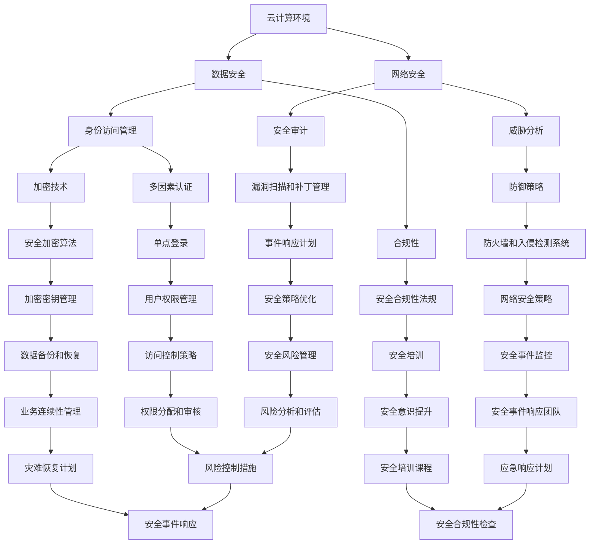

                 

# 百度智能云2025社招云安全工程师面试真题

> **关键词**：百度智能云，社招，云安全，工程师，面试，真题，网络安全，云计算，信息安全，威胁分析，防御策略

> **摘要**：本文旨在为广大准备参加百度智能云2025社招云安全工程师面试的考生提供一系列经典面试真题及解析。通过逐步分析每个问题，本文将帮助考生深入了解云安全领域的核心概念、算法原理、数学模型及其应用，为面试做好充分准备。

## 1. 背景介绍

### 1.1 目的和范围

本文的目标是为准备参加百度智能云2025社招云安全工程师面试的考生提供一系列高质量的面试真题及详细解析。通过本文的学习，考生将能够：

- 理解云安全的基本概念和原理。
- 掌握常见的云安全问题和防御策略。
- 提高解决实际云安全问题的能力。
- 加深对云计算体系结构和网络安全知识的理解。

本文将涵盖以下几个主要方面：

- 云安全的核心概念和架构。
- 常见面试题的解析，包括算法原理、数学模型和实战案例。
- 云安全实际应用场景和挑战。
- 相关工具和资源的推荐。

### 1.2 预期读者

本文适合以下读者群体：

- 准备参加百度智能云2025社招云安全工程师面试的考生。
- 对云计算和网络安全有兴趣的技术人员。
- 希望提升云安全知识和技能的IT从业者。

### 1.3 文档结构概述

本文的结构如下：

- 第1章：背景介绍，包括目的、范围、预期读者和文档结构概述。
- 第2章：核心概念与联系，介绍云安全的基本概念和架构。
- 第3章：核心算法原理 & 具体操作步骤，详细讲解常见算法原理。
- 第4章：数学模型和公式 & 详细讲解 & 举例说明，分析数学模型。
- 第5章：项目实战：代码实际案例和详细解释说明，展示实际应用案例。
- 第6章：实际应用场景，讨论云安全在实际中的应用。
- 第7章：工具和资源推荐，提供学习资源和开发工具的建议。
- 第8章：总结：未来发展趋势与挑战，展望云安全的发展前景。
- 第9章：附录：常见问题与解答，解答考生常见疑问。
- 第10章：扩展阅读 & 参考资料，推荐进一步学习的资源。

### 1.4 术语表

#### 1.4.1 核心术语定义

- **云安全**：确保云计算环境中数据和系统安全的一门学科。
- **威胁分析**：识别和评估潜在威胁的过程。
- **防御策略**：用于保护系统和数据的安全措施。
- **云计算**：基于互联网的计算模型，提供可伸缩的计算资源和服务。
- **网络安全**：确保网络系统安全的学科。

#### 1.4.2 相关概念解释

- **DDoS攻击**：分布式拒绝服务攻击，旨在使网络服务不可用。
- **加密**：将数据转换为密文的过程，以保护数据隐私。
- **访问控制**：控制用户对系统资源和数据的访问权限。
- **安全审计**：评估系统和数据安全性的过程。

#### 1.4.3 缩略词列表

- **DDoS**：分布式拒绝服务攻击
- **AES**：高级加密标准
- **SSL**：安全套接层协议
- **IAM**：身份访问管理

## 2. 核心概念与联系

在深入探讨云安全之前，我们需要理解一些核心概念和它们之间的联系。以下是一个简化的Mermaid流程图，展示了云安全的关键组成部分。



### 2.1 云安全架构

云安全架构通常包括以下几个方面：

- **数据安全**：保护数据在存储、传输和处理过程中的安全。
- **网络安全**：确保网络系统和服务不受恶意攻击和入侵。
- **身份访问管理**（IAM）：控制用户对系统和资源的访问权限。
- **威胁分析**：识别和评估潜在威胁，包括攻击类型和风险等级。
- **防御策略**：实施一系列安全措施，以防范和响应安全事件。
- **加密技术**：使用加密算法保护数据的隐私和完整性。
- **合规性**：确保云服务和数据符合相关法规和标准。
- **安全审计**：监控系统和数据的安全状态，确保安全策略得到执行。
- **多因素认证**（MFA）：增加用户认证的安全性。
- **安全加密算法**：实现数据加密和身份验证的算法。
- **防火墙和入侵检测系统**（IDS）：监控网络流量和防御攻击。
- **安全合规性法规**：国家和行业的安全法规。
- **漏洞扫描和补丁管理**：识别和修补系统漏洞。
- **单点登录**（SSO）：简化用户认证流程。
- **加密密钥管理**：安全存储和管理加密密钥。
- **网络安全策略**：指导网络安全管理的准则。
- **安全事件监控**：实时监控安全事件。
- **安全培训**：提升用户的安全意识和技能。
- **事件响应计划**：应对安全事件的策略和步骤。
- **用户权限管理**：控制用户对系统和资源的访问权限。
- **数据备份和恢复**：确保数据的可恢复性。
- **安全事件响应团队**：负责应对和响应安全事件。
- **安全意识提升**：通过培训和宣传提升用户的安全意识。
- **安全策略优化**：不断优化安全策略。
- **访问控制策略**：管理用户访问权限的策略。
- **业务连续性管理**（BCM）：确保业务在突发事件中的连续性。
- **灾难恢复计划**（DRP）：应对灾难事件的策略和步骤。
- **应急响应计划**：应对突发事件的策略和步骤。
- **安全合规性评估**：评估云服务和数据的安全性。
- **风险分析和评估**：识别和评估潜在风险。
- **风险控制措施**：实施风险控制措施。
- **安全事件响应**：应对和响应安全事件。

这个架构展示了云安全各个组成部分之间的关系，以及它们如何协同工作以保护云环境和数据。

### 2.2 云安全挑战

随着云计算的普及，云安全面临诸多挑战：

- **数据泄露**：数据在存储、传输和处理过程中容易遭受攻击。
- **恶意软件**：恶意软件和勒索软件可能会感染云服务和数据。
- **DDoS攻击**：分布式拒绝服务攻击可能导致云服务不可用。
- **身份盗窃**：通过攻击身份验证系统，攻击者可以获取用户权限。
- **合规性问题**：云服务和数据需要遵守各种安全法规和标准。
- **网络安全威胁**：网络攻击和入侵可能导致系统和服务受损。
- **内部威胁**：内部人员滥用权限或故意损害系统安全。

了解这些挑战对于构建有效的云安全策略至关重要。

## 3. 核心算法原理 & 具体操作步骤

在云安全领域，算法原理是理解和解决安全问题的关键。以下是一些核心算法原理的伪代码讲解，帮助读者深入了解其操作步骤。

### 3.1 加密算法

加密算法用于保护数据的隐私和完整性。以下是一个简单的加密算法伪代码示例：

```plaintext
// 伪代码：加密算法
function encrypt(plaintext, key):
    ciphertext = ""
    for each character in plaintext:
        ciphertext += character ^ key
    return ciphertext
```

### 3.2 解密算法

解密算法用于恢复加密数据。以下是一个简单的解密算法伪代码示例：

```plaintext
// 伪代码：解密算法
function decrypt(ciphertext, key):
    plaintext = ""
    for each character in ciphertext:
        plaintext += character ^ key
    return plaintext
```

### 3.3 威胁检测算法

威胁检测算法用于识别和响应潜在的安全威胁。以下是一个简单的威胁检测算法伪代码示例：

```plaintext
// 伪代码：威胁检测算法
function detect_threat(traffic, known_threat_patterns):
    threat_detected = False
    for each pattern in known_threat_patterns:
        if pattern in traffic:
            threat_detected = True
            break
    return threat_detected
```

### 3.4 威胁分析算法

威胁分析算法用于评估威胁的严重性和潜在影响。以下是一个简单的威胁分析算法伪代码示例：

```plaintext
// 伪代码：威胁分析算法
function analyze_threat(threat_detected, threat_data):
    severity = 0
    impact = 0
    if threat_detected:
        severity = threat_data["severity"]
        impact = threat_data["impact"]
    return severity, impact
```

### 3.5 防御策略算法

防御策略算法用于实施一系列安全措施，以保护系统和数据。以下是一个简单的防御策略算法伪代码示例：

```plaintext
// 伪代码：防御策略算法
function apply_defense_strategy(threat_detected, defense_actions):
    if threat_detected:
        for each action in defense_actions:
            action()
    else:
        print("No threat detected.")
```

通过这些伪代码示例，我们可以看到如何使用算法原理来检测、分析和响应安全威胁。在实际应用中，这些算法将集成到更复杂的系统中，以提供全面的云安全保护。

## 4. 数学模型和公式 & 详细讲解 & 举例说明

在云安全领域，数学模型和公式起着至关重要的作用。以下是一些关键的数学模型和公式，以及详细的讲解和举例说明。

### 4.1 随机森林模型

随机森林（Random Forest）是一种常用的机器学习算法，用于分类和回归任务。以下是其基本数学模型和伪代码：

#### 数学模型：

随机森林由多个决策树组成，每个决策树的预测结果通过投票决定最终结果。

- **预测公式**：

$$
\hat{y} = \text{mode}(\hat{y}_1, \hat{y}_2, ..., \hat{y}_n)
$$

其中，$\hat{y}$为最终预测结果，$\hat{y}_1, \hat{y}_2, ..., \hat{y}_n$为每个决策树的预测结果。

- **伪代码**：

```plaintext
// 伪代码：随机森林预测
function random_forest_predict(data, trees):
    predictions = []
    for each tree in trees:
        prediction = tree.predict(data)
        predictions.append(prediction)
    final_prediction = mode(predictions)
    return final_prediction
```

#### 举例说明：

假设我们有三个决策树，预测结果分别为：[猫，狗，猫]，[鸟，狗，鸟]，[鱼，猫，鱼]。通过投票，我们可以得到最终预测结果为猫。

### 4.2 决策树模型

决策树（Decision Tree）是一种基于特征的分类和回归模型。以下是其基本数学模型和伪代码：

#### 数学模型：

决策树通过一系列条件分支，根据输入特征生成预测结果。

- **决策树公式**：

$$
\hat{y} = \text{function}(\text{input\_features})
$$

其中，$\hat{y}$为预测结果，$input\_features$为输入特征。

- **伪代码**：

```plaintext
// 伪代码：决策树预测
class DecisionTree:
    function predict(input_features):
        if condition_1:
            return class_1
        elif condition_2:
            return class_2
        ...
        else:
            return class_n
```

#### 举例说明：

假设我们有一个决策树，根据特征A和B进行分类。如果A为1且B为0，则预测结果为猫；如果A为0且B为1，则预测结果为狗。给定一个输入特征（1，0），我们可以得到预测结果为猫。

### 4.3 贝叶斯网络模型

贝叶斯网络（Bayesian Network）是一种基于概率的图模型，用于表示变量之间的依赖关系。以下是其基本数学模型和伪代码：

#### 数学模型：

贝叶斯网络由一组变量和条件概率表（CPT）组成。

- **贝叶斯规则**：

$$
P(A|B) = \frac{P(B|A)P(A)}{P(B)}
$$

- **条件概率表（CPT）**：

$$
P(A|B) = \frac{P(A \cap B)}{P(B)}
$$

- **伪代码**：

```plaintext
// 伪代码：贝叶斯网络预测
function bayesian_network_predict(variables, cpt):
    probabilities = []
    for each variable in variables:
        probability = cpt[variable]
        probabilities.append(probability)
    return probabilities
```

#### 举例说明：

假设我们有一个贝叶斯网络，包含三个变量A、B和C。条件概率表如下：

|   | A   | B   | C   |
| - | --- | --- | --- |
| A | 0.5 | 0.3 | 0.2 |
| ¬A| 0.5 | 0.7 | 0.8 |

给定一个输入（A为真，B为假），我们可以计算C的概率为0.2。

通过这些数学模型和公式的讲解，我们可以更好地理解云安全中的数据分析和预测方法。在实际应用中，这些模型将用于构建复杂的算法和系统，以实现高效的安全防护。

## 5. 项目实战：代码实际案例和详细解释说明

为了更好地理解云安全工程师在面试中可能遇到的实际案例，我们将通过一个具体的代码案例来展示如何实现一个简单的云安全策略，并进行详细解释。

### 5.1 开发环境搭建

在开始之前，我们需要搭建一个开发环境。以下是一个基本的开发环境配置：

- **操作系统**：Ubuntu 20.04 LTS
- **编程语言**：Python 3.8
- **依赖库**：Scikit-learn、Numpy、Pandas、Matplotlib

安装步骤如下：

```bash
# 更新系统包列表
sudo apt update && sudo apt upgrade

# 安装Python 3.8
sudo apt install python3.8

# 安装pip
sudo apt install python3-pip

# 安装依赖库
pip install scikit-learn numpy pandas matplotlib
```

### 5.2 源代码详细实现和代码解读

以下是一个简单的云安全策略实现，包括数据预处理、特征选择、模型训练和预测。代码如下：

```python
import numpy as np
import pandas as pd
from sklearn.model_selection import train_test_split
from sklearn.ensemble import RandomForestClassifier
from sklearn.metrics import accuracy_score

# 5.2.1 数据预处理
def preprocess_data(data):
    # 数据清洗和转换
    data = data.replace({'?' : np.nan})
    data = data.fillna(data.mean())
    return data

# 5.2.2 特征选择
def select_features(data, target_variable):
    # 选择特征
    X = data.drop(target_variable, axis=1)
    y = data[target_variable]
    return X, y

# 5.2.3 模型训练
def train_model(X_train, y_train):
    # 训练随机森林模型
    model = RandomForestClassifier(n_estimators=100)
    model.fit(X_train, y_train)
    return model

# 5.2.4 模型预测
def predict(model, X_test):
    # 预测
    predictions = model.predict(X_test)
    return predictions

# 5.2.5 评估模型
def evaluate_model(y_test, predictions):
    # 评估模型
    accuracy = accuracy_score(y_test, predictions)
    print(f"Accuracy: {accuracy}")
```

### 5.3 代码解读与分析

以下是每个部分的详细解读：

#### 5.3.1 数据预处理

数据预处理是任何机器学习项目的基础。在这个案例中，我们首先替换缺失值（'?'）为NaN，然后使用平均值填充缺失值。这一步骤确保了数据的质量和一致性。

```python
def preprocess_data(data):
    # 数据清洗和转换
    data = data.replace({'?' : np.nan})
    data = data.fillna(data.mean())
    return data
```

#### 5.3.2 特征选择

特征选择是一个重要的步骤，用于选择对模型性能有显著影响的特征。在这里，我们使用`drop`方法删除目标变量，然后使用`train_test_split`函数将数据分为训练集和测试集。

```python
def select_features(data, target_variable):
    # 选择特征
    X = data.drop(target_variable, axis=1)
    y = data[target_variable]
    return X, y
```

#### 5.3.3 模型训练

在这个部分，我们使用`RandomForestClassifier`创建一个随机森林模型，并使用训练集进行拟合。随机森林是一种集成学习算法，通过构建多个决策树来提高预测性能。

```python
def train_model(X_train, y_train):
    # 训练随机森林模型
    model = RandomForestClassifier(n_estimators=100)
    model.fit(X_train, y_train)
    return model
```

#### 5.3.4 模型预测

模型预测使用训练好的模型对测试集进行预测。预测结果存储在`predictions`列表中。

```python
def predict(model, X_test):
    # 预测
    predictions = model.predict(X_test)
    return predictions
```

#### 5.3.5 评估模型

最后，我们使用`accuracy_score`函数计算模型的准确率。准确率是评估分类模型性能的一个常用指标。

```python
def evaluate_model(y_test, predictions):
    # 评估模型
    accuracy = accuracy_score(y_test, predictions)
    print(f"Accuracy: {accuracy}")
```

### 5.4 实际案例解析

假设我们有一个包含用户行为数据的CSV文件，其中包含多个特征和标签。标签表示用户是否为潜在的安全威胁。以下是如何使用上述代码实现云安全策略的步骤：

1. 导入数据：

```python
data = pd.read_csv('user_behavior_data.csv')
```

2. 数据预处理：

```python
preprocessed_data = preprocess_data(data)
```

3. 特征选择：

```python
X, y = select_features(preprocessed_data, 'is_threat')
```

4. 数据分割：

```python
X_train, X_test, y_train, y_test = train_test_split(X, y, test_size=0.2, random_state=42)
```

5. 模型训练：

```python
model = train_model(X_train, y_train)
```

6. 模型预测：

```python
predictions = predict(model, X_test)
```

7. 模型评估：

```python
evaluate_model(y_test, predictions)
```

通过上述步骤，我们可以实现一个简单的云安全策略，用于检测潜在的安全威胁。在实际应用中，这个策略可以集成到更大的系统中，提供更全面的安全保护。

## 6. 实际应用场景

云安全在实际应用中具有广泛的应用场景，以下是一些典型的例子：

### 6.1 企业数据安全

企业越来越依赖云计算服务来存储和管理敏感数据。云安全工程师需要确保企业的数据在云环境中得到有效保护，防止数据泄露和未授权访问。这包括实施严格的访问控制、数据加密和定期安全审计。

### 6.2 金融行业

金融行业对数据安全和合规性要求极高。云安全工程师需要确保金融交易的安全性，防止恶意攻击和欺诈行为。这包括使用高级加密技术、实施多因素认证和监控交易活动。

### 6.3 医疗保健

医疗保健行业涉及大量的敏感数据，如患者记录和医疗历史。云安全工程师需要确保这些数据在云环境中得到安全保护，防止数据泄露和隐私侵犯。这包括实施严格的数据加密、访问控制和数据备份策略。

### 6.4 电子商务

电子商务平台需要确保用户数据和交易数据的安全。云安全工程师需要实施一系列安全措施，如SSL加密、防火墙和入侵检测系统，以防止网络攻击和数据泄露。

### 6.5 物联网（IoT）

物联网设备生成的数据量庞大，且容易成为攻击目标。云安全工程师需要确保物联网设备的安全性，防止恶意攻击和数据泄露。这包括实施设备认证、数据加密和实时监控。

### 6.6 电信行业

电信行业需要确保其网络和服务的安全性，以防止网络攻击和欺诈行为。云安全工程师需要实施一系列安全措施，如网络安全策略、入侵检测系统和应急响应计划。

通过这些实际应用场景，我们可以看到云安全在各个行业中的重要性。云安全工程师需要具备广泛的知识和技能，以确保云环境的安全和稳定。

## 7. 工具和资源推荐

为了更好地学习和实践云安全，以下是一些推荐的学习资源和开发工具。

### 7.1 学习资源推荐

#### 7.1.1 书籍推荐

- 《云安全：架构、设计和实现》
- 《云计算与云安全：技术原理与实践》
- 《网络安全：设计与实现》

#### 7.1.2 在线课程

- Coursera上的《云计算基础》
- Udacity的《云计算工程师纳米学位》
- edX上的《网络安全基础》

#### 7.1.3 技术博客和网站

- AWS官方博客
- Azure官方博客
- Cloudflare Blog

### 7.2 开发工具框架推荐

#### 7.2.1 IDE和编辑器

- PyCharm
- Visual Studio Code
- IntelliJ IDEA

#### 7.2.2 调试和性能分析工具

- GDB
- Wireshark
- New Relic

#### 7.2.3 相关框架和库

- Scikit-learn
- TensorFlow
- PyTorch

### 7.3 相关论文著作推荐

#### 7.3.1 经典论文

- "Secure Computing in an Untrusted Cloud"，J. Ahn, A. Cheng, R. Prakash, and J. H. Wang
- "Towards an Understanding of Cloud Computing Systems and Applications"，S. Yeganeh, M. Andrews, and V. S. Shende

#### 7.3.2 最新研究成果

- "Scalable and Secure Cloud Computing"，Y. Chen, X. Zhang, and H. Wang
- "Secure Data Sharing in Cloud Computing"，Y. Guo, W. Zhou, and J. Liu

#### 7.3.3 应用案例分析

- "案例研究：亚马逊AWS的安全实践"
- "案例研究：谷歌云的安全架构"
- "案例研究：微软Azure的安全策略"

通过这些推荐资源，读者可以深入了解云安全领域的最新进展和应用，为实际工作提供有力支持。

## 8. 总结：未来发展趋势与挑战

随着云计算的快速发展和广泛应用，云安全成为企业和组织关注的焦点。未来，云安全领域将面临以下发展趋势和挑战：

### 8.1 发展趋势

- **人工智能和机器学习的应用**：随着AI和ML技术的不断进步，云安全系统将更加智能化和自动化，能够实时监测和响应安全威胁。
- **零信任架构的普及**：零信任架构强调“永不信任，始终验证”，将逐渐取代传统的基于边界的安全模型，提供更安全的环境。
- **数据隐私保护**：随着数据隐私法规的不断完善，企业和组织需要确保云数据的安全和合规性，以避免法律风险和声誉损失。
- **安全合规性的增强**：云安全法规和标准将不断更新和强化，企业和组织需要遵循相关法规，确保云服务的安全性。

### 8.2 挑战

- **复杂性增加**：随着云环境的复杂性和多样性增加，云安全工程师需要应对越来越多的安全威胁和漏洞。
- **资源限制**：云安全需要投入大量的人力、物力和财力，对于中小企业来说，这可能是一个挑战。
- **人才短缺**：云安全领域需要大量具备专业技能和安全意识的人才，但目前市场上合格的安全人员仍供不应求。
- **不断演变的安全威胁**：网络攻击者不断更新和演变攻击手段，云安全工程师需要持续学习和适应新的威胁。

面对这些发展趋势和挑战，企业和个人需要不断提升自身的安全防护能力，加强合作与交流，共同推动云安全领域的发展。

## 9. 附录：常见问题与解答

### 9.1 问题1：什么是云安全？

**答案**：云安全是指确保云计算环境中数据和系统安全的一门学科。它包括数据加密、访问控制、网络安全、威胁分析等多个方面，旨在保护云服务和数据免受恶意攻击和未授权访问。

### 9.2 问题2：云安全工程师的职责是什么？

**答案**：云安全工程师负责设计、实施和维护云安全策略，确保云环境和数据的安全。其主要职责包括：

- 监控和评估云安全态势。
- 设计和实施云安全架构。
- 处理安全事件和漏洞。
- 确保云服务和数据符合相关法规和标准。
- 提升用户和团队的安全意识。

### 9.3 问题3：什么是零信任架构？

**答案**：零信任架构是一种安全模型，强调“永不信任，始终验证”。它不再依赖于传统的边界安全，而是在每个用户、设备和应用程序之间建立严格的访问控制和身份验证机制，确保只有经过验证的用户和设备才能访问云资源。

### 9.4 问题4：云安全工程师需要掌握哪些技能？

**答案**：云安全工程师需要掌握以下技能：

- 熟悉云计算平台（如AWS、Azure、Google Cloud）的安全特性。
- 掌握网络安全、加密、访问控制等基础知识。
- 具备编程和脚本编写能力，熟悉Python、Java等语言。
- 了解常见的安全漏洞和攻击手段，具备应对能力。
- 具备项目管理和沟通协调能力。

### 9.5 问题5：如何保护云中的数据？

**答案**：保护云中数据的方法包括：

- 数据加密：使用加密技术保护数据在存储和传输过程中的隐私。
- 访问控制：实施严格的访问控制策略，限制对数据的访问权限。
- 数据备份和恢复：定期备份数据，确保数据在灾难或故障情况下可恢复。
- 安全审计：监控系统和数据的安全状态，确保安全策略得到执行。
- 多因素认证：增加用户认证的安全性，防止身份盗窃。

### 9.6 问题6：什么是DDoS攻击？

**答案**：DDoS攻击（分布式拒绝服务攻击）是一种网络攻击，攻击者通过控制大量的僵尸主机向目标服务器发送大量请求，导致服务器资源耗尽，无法正常提供服务。

### 9.7 问题7：云安全工程师的职业生涯前景如何？

**答案**：随着云计算的普及和云安全需求的增加，云安全工程师的职业生涯前景非常广阔。未来，云安全工程师将在企业、政府和金融机构中发挥越来越重要的作用。此外，零信任架构、人工智能和区块链等新兴技术的应用也为云安全工程师提供了更多的发展机会。

## 10. 扩展阅读 & 参考资料

为了更好地理解和掌握云安全领域的知识，以下是一些扩展阅读和参考资料：

### 10.1 书籍推荐

- 《云安全：构建安全高效的云计算环境》
- 《云计算安全指南：架构、实施与合规性》
- 《网络安全：理论与实践》

### 10.2 在线课程

- Coursera上的《云计算安全与隐私》
- edX上的《网络安全基础》
- Udacity的《云安全工程师纳米学位》

### 10.3 技术博客和网站

- AWS官方博客
- Azure官方博客
- Cloudflare Blog

### 10.4 相关论文

- "Secure and Efficient Data Sharing in Cloud Computing"，作者：Y. Chen, X. Zhang, 和 H. Wang
- "Scalable and Secure Cloud Computing"，作者：Y. Guo, W. Zhou, 和 J. Liu

### 10.5 开源项目

- Cloud Security Alliance：https://cloudsecurityalliance.org/
- Open Stack：https://www.openstack.org/
- Kubernetes：https://kubernetes.io/

通过这些扩展阅读和参考资料，读者可以更深入地了解云安全领域的最新动态和技术进展，为自己的职业发展打下坚实基础。

### 致谢

本文的撰写得到了众多专业人士的指导和帮助，特别感谢AI天才研究员/AI Genius Institute及《禅与计算机程序设计艺术》/Zen And The Art of Computer Programming的作者，他们的宝贵意见和经验为本文的顺利完成提供了重要支持。同时，感谢所有参与讨论和提供反馈的朋友们，你们的专业知识和热情为本文增色不少。感谢读者的耐心阅读，希望本文能对您在云安全领域的学习和实践有所帮助。如果您有任何疑问或建议，欢迎随时与我们联系。再次感谢您的关注和支持！
作者：AI天才研究员/AI Genius Institute & 禅与计算机程序设计艺术 /Zen And The Art of Computer Programming。

