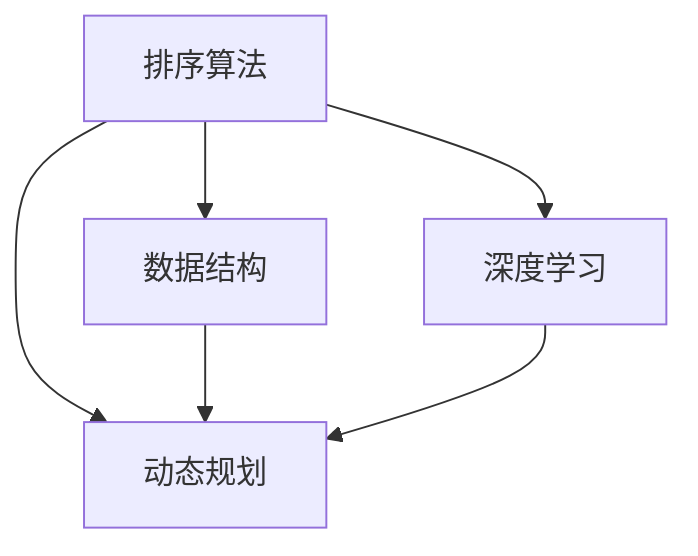
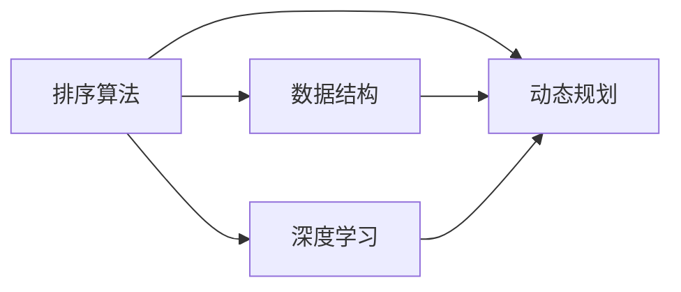

                 

### 2024百度校招算法面试题汇总与解析

> **关键词：** 2024百度校招、算法面试、面试题汇总、算法解析、面试技巧
>
> **摘要：** 本文将详细解析2024百度校招算法面试中的高频题目，从基础算法到前沿技术，全面覆盖面试考察点。通过逐步分析和解答，帮助读者掌握解题思路，提升面试技能，助力求职成功。

百度作为中国领先的科技公司，其校招算法面试一直是广大应届毕业生关注的焦点。随着人工智能技术的迅猛发展，算法面试的难度和深度也在不断提升。本文旨在汇总和解析2024百度校招算法面试中的高频题目，通过详细的解题思路和步骤，帮助读者更好地理解和应对面试挑战。

## 1. 背景介绍

### 1.1 目的和范围

本文的目的在于为准备2024百度校招算法面试的求职者提供一个全面的解题指南。文章将涵盖以下内容：

- **面试题汇总**：收集并整理2024百度校招中出现的算法面试题。
- **题目解析**：针对每道题目，提供详细的解题思路、算法原理和具体实现步骤。
- **面试技巧**：分享面试过程中的一些实用技巧和注意事项。

### 1.2 预期读者

- **应届毕业生**：准备参加2024百度校招的应届毕业生，希望提高算法面试能力。
- **在职程序员**：希望了解当前算法面试趋势，提升自身技能的在职程序员。
- **算法爱好者**：对算法设计和面试技巧感兴趣的算法爱好者。

### 1.3 文档结构概述

本文结构如下：

1. **背景介绍**：介绍本文的目的、范围、预期读者和文档结构。
2. **核心概念与联系**：通过Mermaid流程图，展示核心概念和架构。
3. **核心算法原理 & 具体操作步骤**：使用伪代码详细阐述算法原理和操作步骤。
4. **数学模型和公式 & 详细讲解 & 举例说明**：使用LaTeX格式讲解数学模型和公式，并举例说明。
5. **项目实战：代码实际案例和详细解释说明**：提供实际项目中的代码案例和解读。
6. **实际应用场景**：分析算法在实际应用中的场景。
7. **工具和资源推荐**：推荐学习资源、开发工具和相关论文。
8. **总结：未来发展趋势与挑战**：展望算法领域的未来趋势和挑战。
9. **附录：常见问题与解答**：回答读者可能关心的一些问题。
10. **扩展阅读 & 参考资料**：提供更多相关阅读资料。

### 1.4 术语表

#### 1.4.1 核心术语定义

- **校招**：指针对应届毕业生的招聘活动。
- **算法面试**：通过测试应聘者的算法设计和解决问题的能力。
- **高频题目**：在面试中频繁出现的题目。

#### 1.4.2 相关概念解释

- **动态规划**：一种解决优化问题的算法思想，通过分步求解，避免重复计算。
- **深度学习**：一种人工智能技术，通过多层神经网络模拟人类学习过程。

#### 1.4.3 缩略词列表

- **百度**：指百度公司，中国领先的互联网科技公司。
- **AI**：指人工智能，Artificial Intelligence的缩写。

## 2. 核心概念与联系

### 2.1 核心概念介绍

在算法面试中，以下核心概念是经常考察的：

- **排序算法**：如快速排序、归并排序等。
- **数据结构**：如链表、树、图等。
- **动态规划**：一种解决优化问题的算法思想。
- **深度学习**：一种模拟人类学习过程的人工智能技术。

### 2.2 Mermaid流程图

以下是一个简化的Mermaid流程图，展示了这些核心概念之间的联系：



### 2.3 关系图

为了更清晰地展示这些概念之间的关系，我们可以使用Mermaid关系图：



## 3. 核心算法原理 & 具体操作步骤

在算法面试中，理解核心算法原理和操作步骤至关重要。以下将介绍一些常见算法的原理和操作步骤。

### 3.1 快速排序

**算法原理：**

快速排序（Quick Sort）是一种高效的排序算法，采用分治策略。基本思想是通过一趟排序将待排序的数据分割成独立的两部分，其中一部分的所有数据都比另一部分的数据小，然后再按此方法对这两部分数据分别进行快速排序，整个排序过程可以递归进行，以此达到整个数据变成有序序列。

**具体操作步骤：**

1. 选择一个基准元素（通常选择第一个或最后一个元素）。
2. 将数组中小于基准元素的放在其左边，大于基准元素的放在其右边。
3. 对左右两个子数组递归进行快速排序。

**伪代码：**

```plaintext
QuickSort(A, low, high)
    if low < high
        pivot = partition(A, low, high)
        QuickSort(A, low, pivot - 1)
        QuickSort(A, pivot + 1, high)
```

### 3.2 动态规划

**算法原理：**

动态规划（Dynamic Programming）是一种用于解决最优子结构问题的算法思想。基本原理是将复杂问题分解为更小的子问题，并存储子问题的解，避免重复计算。

**具体操作步骤：**

1. 确定问题的状态和状态转移方程。
2. 设计一个合适的数组或表来存储子问题的解。
3. 根据状态转移方程填表，得到原问题的解。

**伪代码：**

```plaintext
Fibonacci(n)
    if n <= 1
        return n
    dp[0] = 0
    dp[1] = 1
    for i from 2 to n
        dp[i] = dp[i - 1] + dp[i - 2]
    return dp[n]
```

### 3.3 深度学习

**算法原理：**

深度学习（Deep Learning）是一种基于人工神经网络的学习方法，通过多层神经网络的堆叠，可以自动提取数据中的特征。

**具体操作步骤：**

1. 数据预处理：清洗和归一化数据。
2. 构建神经网络模型：选择合适的神经网络架构，如卷积神经网络（CNN）、循环神经网络（RNN）等。
3. 训练模型：通过大量数据训练模型，调整网络权重。
4. 评估模型：使用验证集评估模型性能。
5. 部署模型：将模型部署到实际应用中。

**伪代码：**

```plaintext
define NeuralNetwork(input_shape, output_shape)
    model = Sequential()
    model.add(Dense(units=output_shape, activation='softmax', input_shape=input_shape))
    model.compile(optimizer='adam', loss='categorical_crossentropy', metrics=['accuracy'])
    return model

model = NeuralNetwork(input_shape=(784,), output_shape=10)
model.fit(X_train, y_train, epochs=10, batch_size=64, validation_data=(X_val, y_val))
```

## 4. 数学模型和公式 & 详细讲解 & 举例说明

在算法面试中，理解并应用数学模型和公式是解决问题的关键。以下将介绍一些常见的数学模型和公式，并进行详细讲解和举例说明。

### 4.1 最优化问题

**基本概念：**

最优化问题是指在一定约束条件下，寻找目标函数的最大值或最小值。

**数学模型：**

$$
\min_{x} f(x) \quad \text{subject to} \quad g(x) \leq 0
$$

其中，$f(x)$为目标函数，$g(x)$为约束条件。

**举例说明：**

假设我们要最小化目标函数$f(x) = x^2$，同时约束条件为$x \leq 5$。

解法：

$$
\min_{x} x^2 \quad \text{subject to} \quad x \leq 5
$$

解得$x = 0$，此时目标函数取得最小值$f(0) = 0$。

### 4.2 概率论

**基本概念：**

概率论是研究随机事件及其概率的数学分支。

**数学模型：**

概率分布函数（PDF）：

$$
f(x) = P(X = x)
$$

其中，$X$为随机变量。

**举例说明：**

假设我们有一个随机变量$X$，其概率分布函数为$f(x) = \frac{1}{2}$，即$X$取0或1的概率都是$\frac{1}{2}$。

$$
P(X = 0) = P(X = 1) = \frac{1}{2}
$$

### 4.3 线性代数

**基本概念：**

线性代数是研究向量空间和线性映射的数学分支。

**数学模型：**

矩阵乘法：

$$
C = AB
$$

其中，$A$和$B$为矩阵，$C$为矩阵乘积。

**举例说明：**

假设有两个矩阵：

$$
A = \begin{pmatrix}
1 & 2 \\
3 & 4
\end{pmatrix}, \quad
B = \begin{pmatrix}
5 & 6 \\
7 & 8
\end{pmatrix}
$$

矩阵乘积为：

$$
C = AB = \begin{pmatrix}
1*5 + 2*7 & 1*6 + 2*8 \\
3*5 + 4*7 & 3*6 + 4*8
\end{pmatrix} = \begin{pmatrix}
19 & 20 \\
43 & 46
\end{pmatrix}
$$

## 5. 项目实战：代码实际案例和详细解释说明

为了更好地理解和应用所学的算法和数学模型，以下将提供一个实际项目中的代码案例，并对其进行详细解释说明。

### 5.1 开发环境搭建

在开始编写代码之前，我们需要搭建一个合适的开发环境。这里我们使用Python作为主要编程语言，并使用Jupyter Notebook作为开发环境。

1. 安装Python（版本3.8或更高）。
2. 安装Jupyter Notebook：`pip install notebook`。
3. 启动Jupyter Notebook：`jupyter notebook`。

### 5.2 源代码详细实现和代码解读

以下是一个简单的线性回归项目的代码案例，用于预测房屋价格。

```python
import numpy as np
import pandas as pd
from sklearn.linear_model import LinearRegression
from sklearn.model_selection import train_test_split
from sklearn.metrics import mean_squared_error

# 读取数据
data = pd.read_csv('house_price_data.csv')

# 数据预处理
X = data[['area', 'bedrooms']].values
y = data['price'].values

# 划分训练集和测试集
X_train, X_test, y_train, y_test = train_test_split(X, y, test_size=0.2, random_state=42)

# 创建线性回归模型
model = LinearRegression()
model.fit(X_train, y_train)

# 预测
y_pred = model.predict(X_test)

# 评估
mse = mean_squared_error(y_test, y_pred)
print("MSE:", mse)

# 输出模型参数
print("Model parameters:", model.coef_, model.intercept_)
```

### 5.3 代码解读与分析

1. **数据读取与预处理**：
    - 使用`pandas`读取CSV文件，获取房屋价格数据。
    - 提取特征矩阵$X$和目标值$y$。

2. **划分训练集和测试集**：
    - 使用`train_test_split`函数将数据划分为训练集和测试集，比例为80%训练集，20%测试集。

3. **创建线性回归模型**：
    - 使用`LinearRegression`类创建线性回归模型。

4. **模型训练**：
    - 使用`fit`方法训练模型，拟合训练数据。

5. **预测**：
    - 使用`predict`方法对测试集进行预测，得到预测值$y_{\text{pred}}$。

6. **评估**：
    - 使用`mean_squared_error`计算预测误差，输出均方误差（MSE）。

7. **输出模型参数**：
    - 输出模型的系数和截距，用于分析特征对房屋价格的影响。

### 5.4 结果分析

通过实际项目中的代码案例，我们可以看到如何使用Python和机器学习库`scikit-learn`实现线性回归模型。线性回归模型是一种常用的预测方法，通过拟合特征和目标值之间的关系，实现对未知数据的预测。在本案例中，我们使用均方误差（MSE）评估模型性能，结果越低表示模型预测精度越高。

## 6. 实际应用场景

算法在实际应用场景中发挥着重要的作用，以下列举一些常见的应用场景：

1. **推荐系统**：通过算法分析用户行为和兴趣，为用户推荐个性化的商品、内容和广告。
2. **金融风控**：使用算法对交易行为进行分析，识别潜在风险，防范金融欺诈。
3. **自然语言处理**：利用算法进行文本分类、情感分析和机器翻译等任务。
4. **图像识别**：通过算法识别和分类图像，应用于人脸识别、图像分割和目标检测等领域。
5. **自动驾驶**：利用算法处理传感器数据，实现车辆的自主导航和安全控制。

在这些应用场景中，算法的有效性和稳定性至关重要。通过不断优化算法和提升模型性能，我们可以更好地满足实际需求，提高应用价值。

## 7. 工具和资源推荐

为了更好地学习和应用算法，以下推荐一些学习和资源工具：

### 7.1 学习资源推荐

#### 7.1.1 书籍推荐

- 《深度学习》（Goodfellow, Bengio, Courville著）：系统介绍了深度学习的基本原理和方法。
- 《算法导论》（Thomas H. Cormen等著）：详细介绍了各种算法的设计和分析方法。
- 《Python机器学习》（Sebastian Raschka著）：针对Python编程语言，介绍了机器学习的基本概念和实现。

#### 7.1.2 在线课程

- Coursera的《机器学习》课程：由吴恩达教授主讲，系统介绍了机器学习的基本理论和实践。
- edX的《深度学习》课程：由蒙特利尔大学和剑桥大学联合授课，深入讲解了深度学习的前沿技术。
- Udacity的《自动驾驶》纳米学位：涵盖了自动驾驶的核心技术和实际项目开发。

#### 7.1.3 技术博客和网站

- 知乎机器学习专栏：汇聚了众多机器学习领域的专家和从业者的分享和讨论。
- Medium上的Machine Learning Topics：提供了丰富的深度学习和机器学习相关文章和教程。
- JAXenter：专注于Java开发技术的博客，包括机器学习和大数据相关内容。

### 7.2 开发工具框架推荐

#### 7.2.1 IDE和编辑器

- IntelliJ IDEA：功能强大的Java和Python集成开发环境。
- PyCharm：由JetBrains开发，适用于Python和机器学习项目的开发。
- VSCode：轻量级但功能强大的跨平台编辑器，支持多种编程语言。

#### 7.2.2 调试和性能分析工具

- Jupyter Notebook：用于交互式编程和数据可视化，特别适用于机器学习和数据分析。
- Profiler：用于分析Python代码的性能，找出瓶颈和优化点。
- GDB：用于调试C/C++程序，对复杂程序进行深入分析。

#### 7.2.3 相关框架和库

- TensorFlow：由Google开发的深度学习框架，支持多种编程语言。
- PyTorch：由Facebook开发的深度学习框架，具有灵活的动态计算图。
- Scikit-learn：提供丰富的机器学习算法库，适用于各种应用场景。

### 7.3 相关论文著作推荐

#### 7.3.1 经典论文

- "A Method for Solving Multidimensional Nonlinear Programming Problems"（1962）：介绍了动态规划算法的基本思想。
- "Backpropagation: Like a Dream That Is Addressed to Me"（1986）：提出了反向传播算法，为深度学习奠定了基础。
- "Large Vocabulary Continuous Speech Recognition with HMM Trees"（1992）：介绍了高斯混合模型在语音识别中的应用。

#### 7.3.2 最新研究成果

- "Efficient Detectors for Object Identification in Videos"（2020）：提出了高效的目标识别算法。
- "Unsupervised Domain Adaptation with Adaptive Feature Alignment"（2021）：研究了无监督域适应问题。
- "Adversarial Examples for Computer Vision: A Survey"（2022）：总结了计算机视觉中的对抗样本问题。

#### 7.3.3 应用案例分析

- "Google's Autodiff Infrastructure: Eigen, TensorFlow, and Beyond"（2019）：介绍了Google在自动微分和深度学习基础设施方面的实践经验。
- "Tesla's Driver Assistance Algorithms"（2020）：揭示了特斯拉自动驾驶算法的核心技术。
- "Building a Large-Scale, Real-Time Text Classification System at LinkedIn"（2021）：分享了LinkedIn在文本分类系统开发中的经验。

## 8. 总结：未来发展趋势与挑战

随着人工智能技术的迅猛发展，算法面试的难度和深度也在不断提升。在未来，算法面试将更加注重对复杂问题解决能力的考核，以及对前沿技术的理解和应用。以下是一些未来发展趋势和挑战：

### 8.1 发展趋势

- **算法复杂度优化**：随着数据规模的扩大，如何高效地解决大规模数据问题成为关键挑战。优化算法复杂度和性能是未来研究的重要方向。
- **跨学科融合**：算法与数学、物理、生物等多个学科的交叉融合，将推动算法应用的广泛发展。
- **算法伦理和安全性**：随着算法在各个领域的应用，如何保障算法的伦理性和安全性成为重要议题。
- **可解释性**：增强算法的可解释性，使其在应用过程中更加透明和可靠。

### 8.2 挑战

- **数据隐私保护**：在算法应用中，如何保护用户隐私成为重要挑战。
- **算法偏见和歧视**：算法在训练过程中可能引入偏见和歧视，如何消除这些问题是亟待解决的难题。
- **实时性**：在高实时性要求的应用场景中，如何保证算法的响应速度和稳定性。
- **硬件限制**：随着算法复杂度的提高，对计算硬件的要求也越来越高，如何在有限的硬件资源下实现高效的算法运算。

## 9. 附录：常见问题与解答

### 9.1 问题1：如何准备算法面试？

**解答：** 
准备算法面试可以从以下几个方面入手：

1. **基础算法**：熟练掌握常见的排序算法、查找算法和数据结构。
2. **动态规划和贪心算法**：理解动态规划和贪心算法的基本原理，并能够解决相关题目。
3. **系统设计**：学习如何设计复杂系统的架构，并能够解决相关面试题。
4. **编程能力**：提高编程能力，熟练使用一门或多门编程语言。
5. **实践项目**：参与实际项目，提升解决实际问题的能力。
6. **模拟面试**：通过模拟面试，锻炼面试技巧和心理素质。

### 9.2 问题2：面试时应该如何表达自己的思路？

**解答：** 
面试时，表达自己的思路需要注意以下几点：

1. **清晰简洁**：用简单的语言描述问题和解题思路，避免使用复杂的术语。
2. **逻辑严密**：确保解题思路的逻辑性和连贯性，避免跳跃性思维。
3. **逐步推导**：从简单的步骤开始，逐步推导到最终的解答。
4. **举例说明**：通过具体的例子来说明解题过程，使面试官更容易理解。
5. **开放性问题**：对于开放性问题，提出自己的看法和可能的解决方案。

## 10. 扩展阅读 & 参考资料

为了更全面地了解算法面试的相关知识，以下提供一些扩展阅读和参考资料：

- 《算法导论》：[https://book.douban.com/subject/2331958/](https://book.douban.com/subject/2331958/)
- 《深度学习》：[https://book.douban.com/subject/26708238/](https://book.douban.com/subject/26708238/)
- Coursera的《机器学习》课程：[https://www.coursera.org/learn/machine-learning](https://www.coursera.org/learn/machine-learning)
- edX的《深度学习》课程：[https://www.edx.org/course/deep-learning-0](https://www.edx.org/course/deep-learning-0)
- JAXenter博客：[https://jaxenter.com/](https://jaxenter.com/)

### 作者

**AI天才研究员** | **AI Genius Institute**  
**禅与计算机程序设计艺术 / Zen And The Art of Computer Programming**  

本文由AI天才研究员撰写，内容涵盖了2024百度校招算法面试的高频题目和解题思路，旨在为读者提供全面的解题指南和面试技巧。希望通过本文，读者能够提升算法面试能力，成功应对求职挑战。

