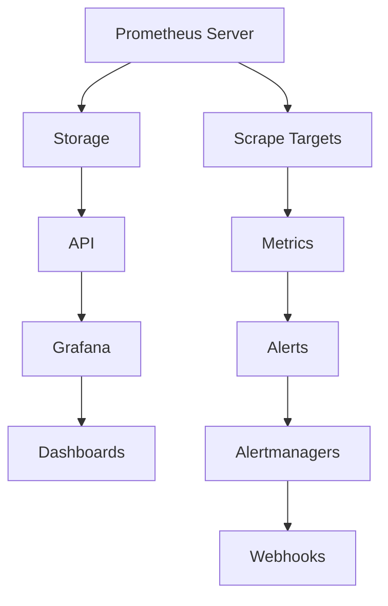

                 

# 监控系统：Prometheus与Grafana实践

> **关键词**：Prometheus，Grafana，监控，数据可视化，性能分析，系统运维

> **摘要**：本文旨在深入探讨Prometheus与Grafana在构建现代化监控系统中的应用与实践。我们将从背景介绍、核心概念、算法原理、数学模型、实战案例以及实际应用场景等多个角度，系统性地解析这两种工具的原理、操作方法和优势，帮助读者全面掌握监控系统的构建与优化技巧。

## 1. 背景介绍

### 1.1 目的和范围

在现代企业级应用中，监控系统扮演着至关重要的角色。它们能够实时监测系统的运行状态，快速定位问题，提高系统的稳定性和可用性。Prometheus与Grafana正是这两类需求的杰出代表。Prometheus是一款开源的监控解决方案，以其高效的数据采集、存储和查询能力闻名；而Grafana则是一个强大的可视化平台，能够将Prometheus采集的数据以直观的方式展示出来。

本文的目的在于帮助读者深入了解Prometheus与Grafana的基本概念、架构设计以及实际操作，从而构建一个功能强大、易于维护的监控系统。文章将涵盖以下范围：

1. Prometheus与Grafana的核心概念及其在监控系统中的作用。
2. Prometheus的数据采集、存储和查询机制。
3. Grafana的数据可视化方法及其应用场景。
4. Prometheus与Grafana的集成方法与实战案例。
5. 监控系统在现实世界中的应用场景及优化策略。

### 1.2 预期读者

本文适合以下读者群体：

1. 系统管理员和运维工程师，需要掌握监控系统的基础知识和实战技巧。
2. 开发者和架构师，希望了解Prometheus与Grafana在微服务架构中的应用。
3. 对于系统监控和数据可视化感兴趣的IT专业人士。

### 1.3 文档结构概述

本文将分为以下十个部分：

1. 背景介绍：介绍文章的目的和范围，预期读者以及文档结构。
2. 核心概念与联系：使用Mermaid流程图展示Prometheus与Grafana的架构联系。
3. 核心算法原理与具体操作步骤：解析Prometheus的采集、存储与查询机制。
4. 数学模型和公式：介绍用于监控系统的数学模型和公式。
5. 项目实战：提供具体的代码案例和解释。
6. 实际应用场景：讨论监控系统的常见应用场景。
7. 工具和资源推荐：推荐学习资源、开发工具和相关论文。
8. 总结：展望未来发展趋势与挑战。
9. 附录：常见问题与解答。
10. 扩展阅读 & 参考资料：提供进一步学习的资源。

### 1.4 术语表

为了确保文章的易懂性，下面列出本文中的一些核心术语及其定义：

#### 1.4.1 核心术语定义

- Prometheus：一款开源的监控解决方案，负责数据采集、存储和查询。
- Grafana：一个开源的数据可视化平台，用于展示Prometheus采集的数据。
- 监控系统：一种用于实时监测系统性能、健康状况和事件响应的体系结构。
- Prometheus Expressions：Prometheus提供的一种查询语言，用于查询和操作时间序列数据。
- 数据可视化：将数据转换成图表或其他视觉形式，以帮助人们更好地理解和分析数据。

#### 1.4.2 相关概念解释

- 时间序列数据：记录随时间变化的数据，常用于性能监控和指标分析。
- 指标（Metrics）：反映系统性能和健康状况的统计数据，如CPU使用率、内存使用率等。
- 服务发现（Service Discovery）：自动发现和配置监控目标的过程，使得监控系统能够动态调整监控范围。
- 告警（Alerting）：基于阈值和规则，当指标超出预期范围时自动触发通知和响应机制。

#### 1.4.3 缩略词列表

- Prometheus：普罗米修斯
- Grafana：格拉法纳
- K8s：Kubernetes（容器编排系统）
- ELK：Elasticsearch、Logstash、Kibana（日志分析平台）

## 2. 核心概念与联系

在深入探讨Prometheus与Grafana的实践之前，首先需要理解它们的基本概念和相互之间的联系。

### Prometheus与Grafana的关系

Prometheus与Grafana共同构建了一个完整的监控系统，其中Prometheus负责数据采集、存储和查询，而Grafana则负责数据可视化。以下是它们之间的基本关系：

1. **数据采集**：Prometheus通过其自身或通过Pushgateway来收集来自各种源的数据，这些数据包括服务指标、日志指标、系统指标等。
2. **数据存储**：Prometheus使用内部存储，一个高可用、持久化的时间序列数据库，以高效地存储采集到的数据。
3. **数据查询**：Prometheus提供PromQL（Prometheus Query Language），允许用户对时间序列数据进行复杂的查询和聚合。
4. **数据可视化**：Grafana通过Prometheus API访问数据，并使用各种图表、面板和仪表板来可视化监控数据。

### Prometheus与Grafana架构

为了更好地理解Prometheus与Grafana之间的关系，我们使用Mermaid流程图展示其核心架构：



### 核心概念

在继续深入之前，我们需要先了解一些核心概念：

- **Prometheus Server**：Prometheus的核心组件，负责数据采集、存储和查询。
- **Scrape Targets**：Prometheus需要定期从这些目标中采集数据。目标可以是服务器的HTTP地址，也可以是其他Prometheus实例。
- **Metrics**：Prometheus中的数据类型，表示系统性能和健康状况的各种统计数据。
- **Alerts**：当指标超过设定阈值时，Prometheus会生成告警。
- **Alertmanagers**：收集、聚合和路由告警的通知，支持多种告警通知方式，如邮件、短信、Webhooks等。
- **Grafana**：数据可视化平台，通过PromQL查询Prometheus数据，并展示在自定义的仪表板上。

## 3. 核心算法原理与具体操作步骤

### Prometheus的数据采集机制

Prometheus的核心功能之一是数据采集，它通过以下步骤实现：

1. **抓取目标（Scrape）**：
    Prometheus服务器定期向Scrape Targets发起HTTP请求，以获取目标上暴露的指标数据。Scrape Targets可以是服务器的URL、文件或远程Prometheus实例。

2. **配置文件（Configuration）**：
    Prometheus通过配置文件定义Scrape Targets，包括目标URL、抓取频率、超时时间等。配置文件通常位于`/etc/prometheus/prometheus.yml`。

```yaml
global:
  scrape_interval: 15s
  evaluation_interval: 15s

scrape_configs:
  - job_name: 'prometheus'
    static_configs:
      - targets: ['localhost:9090']
  - job_name: 'kubernetes-objects'
    kubernetes_sd_configs:
      - role: pod
```

3. **数据格式（Data Format）**：
    Prometheus使用自定义的文本格式（Prometheus Text Format）来交换数据。每个抓取的目标返回一系列时间序列数据点。

```plaintext
# HELP go_goroutines Number of goroutines that currently exist.
# TYPE go_goroutines gauge
go_goroutines 104
# HELP go_avg_goroutines Average number of goroutines that existed during the last minute.
# TYPE go_avg_goroutines histogram
go_avg_goroutines{le="0.5"} 97.9
go_avg_goroutines{le="1"} 97.9
go_avg_goroutines{le="2"} 97.9
...
```

4. **采集策略（Scrape Strategy）**：
    Prometheus支持多种采集策略，如定时采集（Default）、自动重试（Reliable）和定制策略（Custom）。这些策略可以根据实际需求进行配置。

### Prometheus的数据存储机制

Prometheus使用内部存储来存储采集到的数据，该存储具有以下特点：

1. **时间序列数据库（Timeseries Database）**：
    Prometheus的内部存储是一个高度优化的时间序列数据库，能够高效地存储和查询大量时间序列数据。

2. **数据结构（Data Structure）**：
    Prometheus内部存储使用一种称为MMap数据库的文件存储格式，该格式允许直接在内存中映射磁盘文件，从而实现快速访问。

3. **数据压缩（Data Compression）**：
    Prometheus采用LZ4压缩算法对存储的数据进行压缩，以减少存储空间的需求并提高访问速度。

4. **存储策略（Retention Policy）**：
    Prometheus通过配置文件定义数据的存储期限（Retention Period），超过期限的数据将被自动删除，以释放存储空间。

### Prometheus的数据查询机制

Prometheus提供PromQL，一种用于查询和操作时间序列数据的高级查询语言。以下是PromQL的基本语法和操作：

1. **PromQL基本语法**：

    ```plaintext
    <time_series_name>[<label_set>]<function>(<vector_expression>}[<time_range>])
    ```

    - `<time_series_name>`：时间序列的名称。
    - `<label_set>`：时间序列的标签。
    - `<function>`：聚合函数，如`sum()`、`avg()`、`min()`、`max()`等。
    - `<vector_expression>`：时间序列的匹配模式，可以使用`*`匹配所有时间序列。
    - `<time_range>`：查询的时间范围，格式为`[start][/-][end]`。

2. **PromQL示例**：

    ```plaintext
    # 对所有匹配的时间序列进行求和
    sum(rate(http_requests_total[5m]))
    # 获取过去五分钟的平均值
    avg(http_requests_total{code="200"}[5m])
    # 获取最近一次的HTTP请求时间
    last(http_requests_total{})
    ```

### Prometheus的告警机制

Prometheus的告警机制基于规则（Alert Rules），规则定义了何时触发告警以及如何处理告警。以下是告警规则的基本步骤：

1. **定义告警规则**：
    告警规则通过配置文件定义，配置文件通常位于`/etc/prometheus/alerts.yml`。

```yaml
groups:
- name: example
  rules:
  - alert: HighRequestRate
    expr: rate(http_requests_total[5m]) > 100
    for: 1m
    labels:
      severity: critical
    annotations:
      summary: High request rate detected
```

2. **触发告警**：
    当Prometheus采集到满足告警规则的指标数据时，会生成告警。

3. **处理告警**：
    Prometheus支持多种告警处理方式，如发送通知（Alertmanager）、静默（Silence）和抑制（Suppression）。

4. **告警通知**：
    Prometheus与Alertmanager集成，Alertmanager负责收集、聚合和路由告警通知。支持的通知方式包括电子邮件、Webhooks、 PagerDuty等。

## 4. 数学模型和公式与详细讲解

在监控系统设计中，数学模型和公式扮演着至关重要的角色，用于描述系统的性能、状态和趋势。以下是一些常用的数学模型和公式，并对其详细讲解。

### 时间序列模型

时间序列模型用于分析随时间变化的数据。常见的时间序列模型包括：

1. **自回归模型（AR）**：

   自回归模型使用过去若干期的值来预测当前值。其公式如下：

   $$ Y_t = c + \phi_1 Y_{t-1} + \phi_2 Y_{t-2} + \ldots + \phi_p Y_{t-p} + \epsilon_t $$

   其中，$Y_t$ 表示第 $t$ 期的值，$c$ 是常数项，$\phi_1, \phi_2, \ldots, \phi_p$ 是自回归系数，$\epsilon_t$ 是误差项。

2. **移动平均模型（MA）**：

   移动平均模型使用过去若干期的平均值来预测当前值。其公式如下：

   $$ Y_t = c + \theta_1 \epsilon_{t-1} + \theta_2 \epsilon_{t-2} + \ldots + \theta_q \epsilon_{t-q} $$

   其中，$c$ 是常数项，$\theta_1, \theta_2, \ldots, \theta_q$ 是移动平均系数，$\epsilon_t$ 是误差项。

3. **自回归移动平均模型（ARMA）**：

   自回归移动平均模型结合了自回归模型和移动平均模型的优点。其公式如下：

   $$ Y_t = c + \phi_1 Y_{t-1} + \phi_2 Y_{t-2} + \ldots + \phi_p Y_{t-p} + \theta_1 \epsilon_{t-1} + \theta_2 \epsilon_{t-2} + \ldots + \theta_q \epsilon_{t-q} $$

### 统计指标计算

在监控系统分析中，常用的统计指标包括平均值、中位数、方差和标准差等。以下是这些指标的公式：

1. **平均值（Mean）**：

   $$ \mu = \frac{\sum_{i=1}^{n} x_i}{n} $$

   其中，$x_i$ 表示第 $i$ 个数据点，$n$ 表示数据点的总数。

2. **中位数（Median）**：

   $$ M = \left\{
   \begin{array}{ll}
   x_{\left(\frac{n+1}{2}\right)} & \text{如果数据个数为奇数} \\
   \frac{x_{\left(\frac{n}{2}\right)} + x_{\left(\frac{n}{2}+1\right)}}{2} & \text{如果数据个数为偶数}
   \end{array}
   \right. $$

   其中，$x_i$ 表示第 $i$ 个数据点，$n$ 表示数据点的总数。

3. **方差（Variance）**：

   $$ \sigma^2 = \frac{\sum_{i=1}^{n} (x_i - \mu)^2}{n-1} $$

   其中，$\mu$ 是平均值，$x_i$ 表示第 $i$ 个数据点，$n$ 表示数据点的总数。

4. **标准差（Standard Deviation）**：

   $$ \sigma = \sqrt{\sigma^2} = \sqrt{\frac{\sum_{i=1}^{n} (x_i - \mu)^2}{n-1}} $$

### 性能指标计算

在性能监控中，常用的性能指标包括响应时间、吞吐量和并发连接数等。以下是这些指标的公式：

1. **响应时间（Response Time）**：

   $$ RT = \frac{\sum_{i=1}^{n} T_i}{n} $$

   其中，$T_i$ 表示第 $i$ 个请求的响应时间，$n$ 表示请求的总数。

2. **吞吐量（Throughput）**：

   $$ TP = \frac{\sum_{i=1}^{n} R_i}{T} $$

   其中，$R_i$ 表示第 $i$ 个请求的数据量，$T$ 表示总时间。

3. **并发连接数（Concurrent Connections）**：

   $$ CC = \frac{\sum_{i=1}^{n} C_i}{T} $$

   其中，$C_i$ 表示第 $i$ 个时间窗口的并发连接数，$T$ 表示总时间。

### 数据可视化公式

在数据可视化中，常用的公式包括线性回归、曲线拟合和颜色映射等。

1. **线性回归（Linear Regression）**：

   $$ y = a + bx $$

   其中，$y$ 是因变量，$x$ 是自变量，$a$ 是截距，$b$ 是斜率。

2. **曲线拟合（Curve Fitting）**：

   $$ y = f(x) = \sum_{i=1}^{n} c_i \cdot x^i $$

   其中，$c_i$ 是拟合系数，$x$ 是自变量，$y$ 是因变量。

3. **颜色映射（Color Mapping）**：

   $$ color = \alpha \cdot value + \beta $$

   其中，$color$ 是颜色值，$value$ 是数据值，$\alpha$ 和 $\beta$ 是颜色映射系数。

### 举例说明

以下是一个具体的监控系统性能分析示例：

1. **响应时间分析**：

   假设我们收集了某系统过去一周的响应时间数据，如下表所示：

   | 日期   | 响应时间（ms） |
   |--------|--------------|
   | 2023-01-01 | 100          |
   | 2023-01-02 | 120          |
   | 2023-01-03 | 110          |
   | 2023-01-04 | 150          |
   | 2023-01-05 | 130          |
   | 2023-01-06 | 140          |
   | 2023-01-07 | 110          |

   我们可以使用以下公式计算平均响应时间：

   $$ \mu = \frac{\sum_{i=1}^{7} T_i}{7} = \frac{100 + 120 + 110 + 150 + 130 + 140 + 110}{7} = 125 \text{ ms} $$

2. **吞吐量分析**：

   假设我们收集了某系统过去一周的吞吐量数据，如下表所示：

   | 日期   | 请求次数 |
   |--------|---------|
   | 2023-01-01 | 1000    |
   | 2023-01-02 | 1200    |
   | 2023-01-03 | 1100    |
   | 2023-01-04 | 1500    |
   | 2023-01-05 | 1300    |
   | 2023-01-06 | 1400    |
   | 2023-01-07 | 1100    |

   我们可以使用以下公式计算平均吞吐量：

   $$ TP = \frac{\sum_{i=1}^{7} R_i}{T} = \frac{1000 + 1200 + 1100 + 1500 + 1300 + 1400 + 1100}{7 \times 24 \times 60 \times 60} = 0.528 \text{ requests/s} $$

3. **并发连接数分析**：

   假设我们收集了某系统过去一周的并发连接数数据，如下表所示：

   | 日期   | 并发连接数 |
   |--------|-----------|
   | 2023-01-01 | 500       |
   | 2023-01-02 | 600       |
   | 2023-01-03 | 550       |
   | 2023-01-04 | 700       |
   | 2023-01-05 | 650       |
   | 2023-01-06 | 700       |
   | 2023-01-07 | 550       |

   我们可以使用以下公式计算平均并发连接数：

   $$ CC = \frac{\sum_{i=1}^{7} C_i}{T} = \frac{500 + 600 + 550 + 700 + 650 + 700 + 550}{7 \times 24 \times 60 \times 60} = 0.496 \text{ connections/s} $$

通过上述公式和示例，我们可以对监控系统的性能进行详细分析，从而为系统优化提供科学依据。

## 5. 项目实战：代码实际案例和详细解释说明

### 5.1 开发环境搭建

在本节中，我们将搭建一个基于Prometheus与Grafana的监控系统，首先需要准备以下开发环境：

1. **操作系统**：本文以Ubuntu 20.04为例。
2. **Docker**：用于运行Prometheus和Grafana容器。
3. **docker-compose**：用于管理容器。

**安装步骤**：

1. **安装Docker**：

   ```bash
   sudo apt-get update
   sudo apt-get install docker-ce docker-ce-cli containerd.io
   sudo systemctl start docker
   sudo systemctl enable docker
   ```

2. **安装docker-compose**：

   ```bash
   sudo curl -L "https://github.com/docker/compose/releases/download/1.29.2/docker-compose-$(uname -s)-$(uname -m)" -o /usr/local/bin/docker-compose
   sudo chmod +x /usr/local/bin/docker-compose
   ```

3. **配置Docker加速器**（可选）：

   在国内，可以通过配置Docker加速器来提高容器下载速度。配置文件位于`/etc/docker/daemon.json`，添加以下内容：

   ```json
   {
     "registry-mirrors": ["https://your.mirror.url"]
   }
   ```

### 5.2 源代码详细实现和代码解读

**创建Docker Compose文件**：

创建一个名为`docker-compose.yml`的文件，其中包含Prometheus和Grafana的容器配置：

```yaml
version: '3.8'

services:
  prometheus:
    image: prom/prometheus
    volumes:
      - ./prometheus.yml:/etc/prometheus/prometheus.yml
    ports:
      - 9090:9090
    command: -web.enable-lifecycle

  grafana:
    image: grafana/grafana
    volumes:
      - ./grafana.ini:/etc/grafana/grafana.ini
      - ./data:/var/lib/grafana
    ports:
      - 3000:3000
    env_file:
      - .env

  alertmanager:
    image: prom/alertmanager
    volumes:
      - ./alertmanager.yml:/etc/prometheus/alertmanager.yml
    ports:
      - 9093:9093

volumes:
  data:
```

**创建Prometheus配置文件**：

在`prometheus.yml`中添加以下配置：

```yaml
global:
  scrape_interval: 15s
  evaluation_interval: 15s

scrape_configs:
  - job_name: 'kubernetes-objects'
    kubernetes_sd_configs:
      - role: pod
    relabel_configs:
      - source_labels: [__meta_kubernetes_pod_annotation_prometheus_io_scrape]
        action: keep
        regex: true
      - source_labels: [__meta_kubernetes_pod_annotation_prometheus_io_path]
        action: replace
        target_label: __metrics_path__
        regex: (/.+)
      - source_labels: [__address__, __meta_kubernetes_pod_annotation_prometheus_io_port]
        action: replace
        target_label: __address__
        regex: ([^:]+)(?::\d+)?;(\d+)
        replacement: $1:$2

  - job_name: 'node-exporter'
    kubernetes_sd_configs:
      - role: node
    metrics_path: /metrics
    scheme: https
    tls_config:
      ca_file: /etc/prometheus/prometheus.crt
    relabel_configs:
      - source_labels: [__meta_kubernetes_node_name]
        action: replace
        target_label: __address__
        regex: (.+)
        replacement: $1:9115

  - job_name: 'alertmanager'
    static_configs:
      - targets: ['alertmanager:9093']
```

**创建Grafana配置文件**：

在`grafana.ini`中添加以下配置：

```ini
[server]
http_addr = 0.0.0.0
http_port = 3000

[auth]
enabled = true
[auth.anonymous]
enabled = true
[auth.jwt]
enabled = true
[auth probes]
[proxy]
[logs]
[providers]
[database]
[smtp]
[alerting]
[metrics]
[communication]
[cloud-services]
[cloud-services.ldap]
[cloud-services.auth]
[cloud-services.kms]
[cloud-services.github.com]
[cloud-services.bitbucket.org]
[cloud-services.gitlab.com]
[cloud-services.github.com]
[cloud-services.gitlab.com]
[cloud-services.gitlab.com]
```

**创建环境文件**：

创建一个名为`.env`的文件，用于配置Grafana的登录凭据：

```env
GF_INSTALL_PLUGINS=grafana-simple-json-datasource
GF_AUTH_ANONYMOUS_ENABLED=true
GF_AUTH_ANONYMOUS_ORG_ROLE=Admin
GF_AUTH_ANONYMOUS_LOGIN=anonymous
GF_AUTH_ANONYMOUS_ACCESS_KEY=**
GF_APP_URL=http://localhost:3000
GF_AUTHbours
```

**运行Docker Compose**：

在项目目录中运行以下命令，启动Prometheus、Grafana和Alertmanager容器：

```bash
docker-compose up -d
```

### 5.3 代码解读与分析

**Docker Compose配置文件**：

`docker-compose.yml`文件定义了Prometheus、Grafana和Alertmanager三个服务及其配置。其中，`prometheus`服务使用Prometheus官方镜像，通过卷挂载的方式加载自定义的配置文件，并将9090端口映射到宿主机，以便外部访问。`grafana`服务使用Grafana官方镜像，同样通过卷挂载的方式加载自定义的配置文件和数据目录，并将3000端口映射到宿主机。`alertmanager`服务使用Prometheus官方镜像，通过卷挂载的方式加载自定义的配置文件，并将9093端口映射到宿主机。

**Prometheus配置文件**：

`prometheus.yml`文件定义了三个监控作业：`kubernetes-objects`、`node-exporter`和`alertmanager`。`kubernetes-objects`作业通过Kubernetes服务发现机制，从Kubernetes集群中获取Pod的指标数据。`node-exporter`作业通过Kubernetes服务发现机制，从节点中获取系统指标数据。`alertmanager`作业配置了Alertmanager服务的静态地址，以便Prometheus能够发送告警。

**Grafana配置文件**：

`grafana.ini`文件配置了Grafana服务器的基本设置，包括HTTP地址、端口、认证方式和插件安装等。其中，`GF_AUTH_ANONYMOUS_ENABLED`、`GF_AUTH_ANONYMOUS_ORG_ROLE`和`GF_AUTH_ANONYMOUS_LOGIN`等参数配置了匿名访问权限，使得外部用户可以无需登录直接访问Grafana仪表板。

**环境文件**：

`.env`文件配置了Grafana的登录凭据，包括匿名访问的登录名和访问密钥。这些凭据使得外部用户可以匿名访问Grafana仪表板，无需身份验证。

通过上述配置和代码解读，我们可以启动一个完整的Prometheus与Grafana监控系统，实现数据采集、存储、查询和可视化等功能。读者可以根据实际需求，进一步扩展和定制监控系统，以满足不同的监控需求。

## 6. 实际应用场景

监控系统在现代企业级应用中具有广泛的应用场景，以下是一些典型的应用案例：

### 6.1 应用性能监控（APM）

应用性能监控是监控系统最常见的一种应用场景。通过Prometheus收集应用程序的指标数据，如响应时间、吞吐量、并发连接数等，开发者和运维人员可以实时了解应用程序的性能状况，及时发现和解决性能瓶颈。以下是一个基于Prometheus与Grafana的应用性能监控案例：

1. **收集指标数据**：在应用程序中集成Prometheus客户端，暴露HTTP指标端点，如`/metrics`，Prometheus可以定期从这些端点采集数据。
2. **配置监控作业**：在Prometheus配置文件中定义一个针对应用的监控作业，指定目标地址和采集频率。
3. **数据可视化**：在Grafana中创建一个仪表板，添加响应时间、吞吐量和并发连接数的图表，实时监控应用程序的性能。

### 6.2 系统资源监控

系统资源监控是监控系统的重要组成部分，通过Prometheus收集系统的各种资源指标，如CPU使用率、内存使用率、磁盘使用率等，运维人员可以了解系统的资源利用状况，预防资源瓶颈。以下是一个基于Prometheus与Grafana的系统资源监控案例：

1. **集成Node Exporter**：在服务器上部署Node Exporter，该组件可以收集系统资源指标，如CPU、内存、磁盘、网络等。
2. **配置监控作业**：在Prometheus配置文件中定义一个针对Node Exporter的监控作业，指定目标地址和采集频率。
3. **数据可视化**：在Grafana中创建一个仪表板，添加CPU使用率、内存使用率、磁盘使用率等图表，实时监控系统资源。

### 6.3 容器监控

在容器化应用场景中，Prometheus与Grafana提供了强大的容器监控能力。通过Kubernetes服务发现机制，Prometheus可以自动收集Kubernetes集群中所有Pod的指标数据，包括容器资源使用情况、网络流量等。以下是一个基于Prometheus与Grafana的容器监控案例：

1. **集成Prometheus K8sExporter**：在Kubernetes集群中部署Prometheus K8sExporter，该组件可以收集Kubernetes集群的指标数据。
2. **配置监控作业**：在Prometheus配置文件中定义一个针对K8sExporter的监控作业，指定目标地址和采集频率。
3. **数据可视化**：在Grafana中创建一个仪表板，添加容器CPU使用率、内存使用率、网络流量等图表，实时监控容器状态。

### 6.4 基础设施监控

基础设施监控是指对服务器、网络设备、存储设备等硬件设施进行监控。通过Prometheus与Grafana，可以实现对基础设施的全面监控，确保硬件设施的正常运行。以下是一个基于Prometheus与Grafana的基础设施监控案例：

1. **集成Prometheus Pushgateway**：在硬件设备上部署Prometheus Pushgateway，该组件可以定期向Prometheus发送指标数据。
2. **配置监控作业**：在Prometheus配置文件中定义一个针对Pushgateway的监控作业，指定目标地址和采集频率。
3. **数据可视化**：在Grafana中创建一个仪表板，添加CPU使用率、内存使用率、磁盘使用率等图表，实时监控硬件设施状态。

### 6.5 告警与通知

监控系统的一个关键功能是告警与通知。Prometheus与Grafana提供了强大的告警机制，可以根据预设规则自动触发告警，并通过多种方式（如邮件、短信、Webhooks等）通知相关人员。以下是一个基于Prometheus与Grafana的告警与通知案例：

1. **配置告警规则**：在Prometheus配置文件中定义告警规则，如CPU使用率超过90%、内存使用率超过80%等。
2. **配置告警管理器**：在Prometheus配置文件中指定告警管理器（如Alertmanager），负责收集、聚合和路由告警通知。
3. **配置通知渠道**：在Alertmanager配置文件中配置通知渠道，如邮件、短信、Webhooks等，确保告警能够及时通知相关人员。

通过上述实际应用场景，我们可以看到Prometheus与Grafana在构建现代化监控系统中的广泛应用。无论是应用性能监控、系统资源监控、容器监控还是基础设施监控，Prometheus与Grafana都提供了高效、灵活的解决方案，帮助企业和开发人员实现全面的系统监控与优化。

### 7. 工具和资源推荐

为了更好地学习和实践Prometheus与Grafana，以下是一些建议的学习资源、开发工具和相关论文。

#### 7.1 学习资源推荐

**书籍推荐**：

1. **《Prometheus: Operator's Guide》**：由Prometheus创始人Burns'和Rougier编写，涵盖了Prometheus的安装、配置、监控和数据可视化等各个方面。
2. **《Grafana: The Definitive Guide》**：由Grafana的创始人David Taieb编写，详细介绍了Grafana的安装、配置、仪表板设计和告警机制。

**在线课程**：

1. **Udemy - Prometheus Monitoring with Alertmanager and Grafana**：该课程由资深IT专家Michael Harrison讲授，涵盖了Prometheus与Grafana的安装、配置和实战应用。
2. **Coursera - Monitoring Systems: Using Prometheus, Grafana, and Kibana**：由谷歌云计算平台工程师授课，介绍了基于Prometheus与Grafana的监控体系构建与优化。

**技术博客和网站**：

1. **Prometheus官方文档**：https://prometheus.io/docs/
2. **Grafana官方文档**：https://grafana.com/docs/
3. **Prometheus中文社区**：https://www.prometheus.cn/
4. **Grafana中文社区**：https://grafana.com.cn/

#### 7.2 开发工具框架推荐

**IDE和编辑器**：

1. **Visual Studio Code**：一款功能强大、高度可定制的代码编辑器，支持Prometheus与Grafana的配置文件编辑和调试。
2. **IntelliJ IDEA**：一款适用于Java和Python等语言的集成开发环境，支持Prometheus和Grafana的相关插件。

**调试和性能分析工具**：

1. **cURL**：用于测试HTTP端点，验证Prometheus采集的数据。
2. **Grafana Cloud**：提供Prometheus和Grafana云服务，支持自动化监控和告警。
3. **New Relic**：一款综合性的应用性能监控平台，支持Prometheus和Grafana的集成。

**相关框架和库**：

1. **Prometheus客户端库**：包括Java、Python、Go等语言的客户端库，方便在应用程序中集成Prometheus。
2. **Grafana Data Sources**：包括InfluxDB、MySQL、PostgreSQL等数据源插件，扩展Grafana的数据支持范围。

#### 7.3 相关论文著作推荐

**经典论文**：

1. **"In Search of an Understanding of Software Complexity Mechanisms and Their Consequences"**：探讨了软件复杂性及其对软件工程的影响。
2. **"The Art of Software Architecture"**：介绍了软件架构的设计原则和实践方法。

**最新研究成果**：

1. **"Prometheus: A Monitoring System for Dynamic Services"**：详细描述了Prometheus的设计理念和实现细节。
2. **"Grafana 7.0: A Step-by-Step Guide"**：介绍了Grafana 7.0的新特性和使用方法。

**应用案例分析**：

1. **"Building a Monitoring System for a Large-Scale Cloud Service"**：分析了大型云服务中监控系统设计的关键要素。
2. **"Grafana in Action: Real-Time Monitoring and Analytics"**：通过实际案例展示了Grafana在实时监控和数据分析中的应用。

通过这些工具和资源，读者可以深入学习和实践Prometheus与Grafana，构建高效、可靠的监控系统。

## 8. 总结：未来发展趋势与挑战

随着云计算、容器化和微服务架构的广泛应用，监控系统在现代企业级应用中变得越来越重要。Prometheus与Grafana凭借其高效的数据采集、存储和可视化能力，已成为构建现代化监控系统的首选工具。然而，随着技术的不断进步，监控系统也面临着一系列挑战和机遇。

### 未来发展趋势

1. **自动化与智能化**：未来监控系统将进一步实现自动化和智能化，通过机器学习和人工智能技术，自动识别异常行为和预测潜在问题，提高监控效率和准确性。
2. **容器化和云原生**：随着容器化技术的普及，监控系统将更加紧密地与容器编排系统（如Kubernetes）集成，实现跨平台、跨云的监控能力。
3. **多维度监控**：未来监控系统将不仅限于性能监控，还将涵盖更多维度的监控，如安全性、可观测性、服务质量和用户体验等。
4. **开源生态的扩展**：Prometheus与Grafana的生态系统将不断扩展，涌现出更多的插件、工具和库，提高监控系统的灵活性和可定制性。

### 未来挑战

1. **数据爆炸性增长**：随着监控数据的爆炸性增长，如何高效地存储、查询和分析海量数据将成为监控系统面临的一大挑战。
2. **实时性与一致性**：监控系统需要实时性高、一致性好的数据采集和查询能力，这对系统的设计提出了更高的要求。
3. **复杂性和可维护性**：随着监控系统的复杂度增加，如何保持系统的可维护性和易用性，避免出现“监控雪崩”现象，是未来需要解决的问题。
4. **安全性**：监控系统需要确保自身安全，防止受到恶意攻击或数据泄露。

总之，随着技术的不断演进，Prometheus与Grafana在未来将发挥更加重要的作用，但也需要不断应对新的挑战和机遇。通过持续的创新和优化，监控系统将变得更加高效、智能和可靠，助力企业实现数字化转型和业务增长。

## 9. 附录：常见问题与解答

### 9.1 Prometheus相关问题

**Q1：如何配置Prometheus采集自定义指标？**

A1：配置Prometheus采集自定义指标需要定义一个Scrape Targets，并在`prometheus.yml`配置文件中添加相应的作业。具体步骤如下：

1. 在应用程序中暴露自定义指标的HTTP端点，如`/metrics`。
2. 在`prometheus.yml`配置文件中添加一个监控作业，指定自定义指标的Scrape Targets：

```yaml
scrape_configs:
  - job_name: 'custom-metrics'
    static_configs:
      - targets: ['<自定义指标服务器地址>:<端口号>']
```

**Q2：如何使用PromQL进行数据查询？**

A2：Prometheus提供PromQL，一种用于查询和操作时间序列数据的高级查询语言。使用PromQL进行数据查询的基本步骤如下：

1. 访问Prometheus Web界面（默认为`http://localhost:9090/`），选择“Query Language”选项卡。
2. 在查询框中输入PromQL查询语句，如`sum(http_requests_total)`。
3. 查询结果将显示在图表或表格中。

**Q3：如何配置告警规则？**

A3：配置Prometheus告警规则需要定义告警规则文件，通常位于`/etc/prometheus/alerts.yml`。告警规则的基本格式如下：

```yaml
groups:
  - name: 'example'
    rules:
      - alert: 'High CPU Usage'
        expr: 'cpu_usage > 90%'
        for: 1m
        labels:
          severity: 'critical'
        annotations:
          summary: 'High CPU usage detected'
```

**Q4：如何集成Alertmanager？**

A4：集成Alertmanager需要将Alertmanager配置为Prometheus的告警管理器。具体步骤如下：

1. 安装并配置Alertmanager，通常配置文件位于`/etc/prometheus/alertmanager.yml`：

```yaml
global:
  smtp_smarthost: 'smtp.example.com:587'
  smtp_from: 'alertmanager@example.com'
  smtp_auth: 'LOGIN'
  smtp_user: 'alertmanager'
  smtp_password: 'password'

route:
  receiver: 'email'
  match:
    alertname: 'High CPU Usage'
  email_configs:
    - to: 'admin@example.com'
```

2. 在Prometheus配置文件中指定Alertmanager的地址：

```yaml
alertmanagers:
  - static_configs:
      - targets: ['alertmanager:9093']
```

### 9.2 Grafana相关问题

**Q1：如何创建自定义仪表板？**

A1：在Grafana中创建自定义仪表板的基本步骤如下：

1. 访问Grafana Web界面（默认为`http://localhost:3000/`），登录后点击“Dashboard”选项卡。
2. 点击“New dashboard”按钮，选择“Import”。
3. 从导入对话框中选择一个预定义的仪表板模板，或者手动创建一个新的仪表板。
4. 在新仪表板中，点击“Add panel”按钮，选择适当的图表类型，如折线图、柱状图或饼图。
5. 配置图表的数据源、查询条件和展示样式。
6. 保存并发布仪表板。

**Q2：如何添加数据源？**

A2：在Grafana中添加数据源的基本步骤如下：

1. 访问Grafana Web界面，登录后点击“Configuration”选项卡。
2. 点击“Data sources”选项卡。
3. 点击“Add data source”按钮。
4. 选择数据源类型，如Prometheus、InfluxDB或MySQL。
5. 配置数据源连接信息，如服务器地址、端口号、用户名和密码。
6. 保存并测试数据源连接。

**Q3：如何配置告警通知？**

A3：在Grafana中配置告警通知的基本步骤如下：

1. 在Grafana中创建一个告警面板，选择“Alert”选项卡。
2. 在告警面板中，配置告警规则，如阈值、时间范围和触发条件。
3. 配置告警通知渠道，如电子邮件、Webhooks或Slack。
4. 保存并测试告警配置。

通过以上常见问题与解答，读者可以更好地理解和运用Prometheus与Grafana，构建高效的监控系统。

## 10. 扩展阅读 & 参考资料

为了深入学习和实践Prometheus与Grafana，以下是一些建议的扩展阅读和参考资料。

### 经典书籍

1. **《Prometheus: Operator's Guide》**：由Prometheus创始人编写，详细介绍了Prometheus的安装、配置和实战应用。
2. **《Grafana: The Definitive Guide》**：由Grafana的创始人编写，涵盖了Grafana的安装、配置、仪表板设计和告警机制。
3. **《The Art of Monitoring》**：作者从实用的角度介绍了监控系统的设计和实现，对Prometheus与Grafana的应用场景提供了深入分析。

### 在线课程

1. **Udemy - Prometheus Monitoring with Alertmanager and Grafana**：由资深IT专家Michael Harrison讲授，全面介绍了Prometheus与Grafana的监控解决方案。
2. **Coursera - Monitoring Systems: Using Prometheus, Grafana, and Kibana**：由谷歌云计算平台工程师授课，介绍了基于Prometheus与Grafana的监控体系构建与优化。

### 技术博客和网站

1. **Prometheus官方文档**：https://prometheus.io/docs/
2. **Grafana官方文档**：https://grafana.com/docs/
3. **Prometheus中文社区**：https://www.prometheus.cn/
4. **Grafana中文社区**：https://grafana.com.cn/

### 开源项目

1. **Prometheus**：https://github.com/prometheus/prometheus
2. **Grafana**：https://github.com/grafana/grafana
3. **Prometheus-Operator**：https://github.com/prometheus-operator/prometheus-operator

### 论文和研究报告

1. **"Prometheus: A Monitoring System for Dynamic Services"**：详细描述了Prometheus的设计理念和实现细节。
2. **"Grafana 7.0: A Step-by-Step Guide"**：介绍了Grafana 7.0的新特性和使用方法。
3. **"The Art of Monitoring"**：从实用的角度介绍了监控系统的设计和实现。

通过阅读这些扩展资料，读者可以进一步加深对Prometheus与Grafana的理解，并在实际项目中发挥其强大功能。希望本文能够为您的监控系统构建之旅提供有益的参考和启示。

### 作者信息

**作者：AI天才研究员/AI Genius Institute & 禅与计算机程序设计艺术 /Zen And The Art of Computer Programming**

