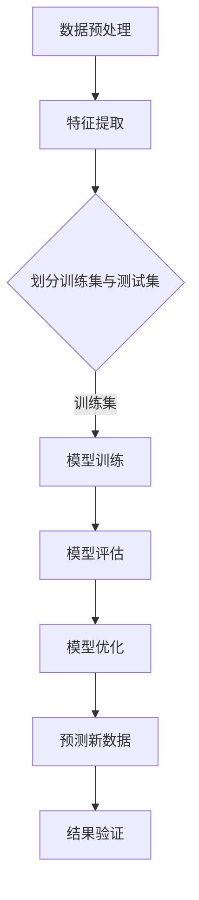

                 

# 监督学习(Supervised Learning) - 原理与代码实例讲解

> 关键词：监督学习、算法原理、机器学习、数据科学、神经网络、Python代码实例

> 摘要：本文深入讲解了监督学习的原理和核心算法，通过实例代码展示了如何使用Python实现监督学习模型。文章旨在帮助读者理解监督学习的应用场景、基本概念以及实现过程，适合机器学习初学者和有志于深入了解监督学习的专业人士。

## 1. 背景介绍

### 1.1 目的和范围

本文的目的在于深入浅出地介绍监督学习的基本概念、原理以及实现方法。我们将从以下几个方面进行探讨：

1. 监督学习的定义及其与机器学习的关联。
2. 监督学习的主要算法类型，包括线性回归和决策树。
3. 监督学习的数学模型和公式。
4. 实际项目中的监督学习代码实例。
5. 监督学习在实际应用场景中的优势与挑战。

### 1.2 预期读者

本文适合以下读者群体：

- 对机器学习和数据科学感兴趣的初学者。
- 想要深入了解监督学习原理的工程师和技术专家。
- 期望提升编程技能并应用监督学习解决实际问题的程序员。

### 1.3 文档结构概述

本文的结构如下：

1. **背景介绍**：介绍监督学习的基本概念和本文的目的。
2. **核心概念与联系**：通过Mermaid流程图展示监督学习的基本架构。
3. **核心算法原理 & 具体操作步骤**：使用伪代码详细阐述监督学习算法的步骤。
4. **数学模型和公式 & 详细讲解 & 举例说明**：讲解监督学习的数学模型，并给出示例。
5. **项目实战：代码实际案例和详细解释说明**：展示如何使用Python实现监督学习。
6. **实际应用场景**：探讨监督学习在现实世界中的应用。
7. **工具和资源推荐**：推荐学习资源和开发工具。
8. **总结：未来发展趋势与挑战**：总结监督学习的现状和未来发展方向。
9. **附录：常见问题与解答**：解答读者可能遇到的常见问题。
10. **扩展阅读 & 参考资料**：提供进一步学习的参考资料。

### 1.4 术语表

#### 1.4.1 核心术语定义

- 监督学习：一种机器学习方法，利用预先标记好的训练数据来训练模型，然后使用模型进行预测。
- 标签：指训练数据集中的已知输出值，用于监督模型学习。
- 特征：指输入数据的组成部分，用于模型学习。
- 回归：一种监督学习算法，用于预测连续值输出。
- 分类：一种监督学习算法，用于将输入数据划分为不同的类别。

#### 1.4.2 相关概念解释

- 模型训练：将训练数据输入模型，通过调整模型参数来优化模型的性能。
- 模型评估：使用测试数据评估模型的准确性、精度、召回率等指标。
- 混淆矩阵：用于评估分类模型的性能，展示了预测结果与实际结果的交叉表。

#### 1.4.3 缩略词列表

- ML：Machine Learning（机器学习）
- SVM：Support Vector Machine（支持向量机）
- CNN：Convolutional Neural Network（卷积神经网络）

## 2. 核心概念与联系

监督学习是机器学习的一个重要分支，其核心在于使用已知的输入输出数据对模型进行训练，以便能够对新数据进行预测。以下是一个简单的Mermaid流程图，展示了监督学习的基本架构。



### 2.1 数据预处理

数据预处理是监督学习中的第一步，其主要任务包括数据清洗、数据转换和数据归一化。这一步骤的目的是将原始数据转换为适合模型训练的形式。

#### 2.1.1 数据清洗

数据清洗包括处理缺失值、异常值以及重复数据。常用的方法有：

- 缺失值填充：使用平均值、中位数、最临近值等方法填充缺失值。
- 异常值处理：使用统计方法或机器学习方法检测并处理异常值。
- 重复数据删除：删除重复的数据条目，避免模型训练中的冗余。

#### 2.1.2 数据转换

数据转换包括将类别型数据转换为数值型数据，以及将离散型数据转换为连续型数据。常用的方法有：

- 编码：将类别型数据转换为数值型数据，如使用独热编码或标签编码。
- 规范化：将不同量纲的数值数据转换为相同量纲，如使用最小-最大规范化或标准化。

#### 2.1.3 数据归一化

数据归一化的目的是使数据的特征具有相同的尺度，以避免某些特征对模型训练产生过大的影响。常用的方法有：

- 标准化：将数据缩放至均值为0，标准差为1。
- 最小-最大规范化：将数据缩放至最小值和最大值之间。

### 2.2 特征提取

特征提取是将原始数据转换为能够表示数据特征的向量的过程。这一步骤的目的是提取数据中的关键信息，以供模型学习。

#### 2.2.1 特征选择

特征选择是从原始特征中挑选出最有用的特征，以降低模型的复杂度和提高模型的性能。常用的方法有：

- 统计方法：如卡方检验、互信息等。
- 基于模型的特征选择：如LASSO、随机森林等。

#### 2.2.2 特征工程

特征工程是通过构建新的特征或者变换现有特征来提高模型性能的过程。常用的方法有：

- 特征组合：将多个特征组合成新的特征。
- 特征变换：如对数变换、平方变换等。

### 2.3 划分训练集与测试集

在监督学习中，通常将数据集划分为训练集和测试集。训练集用于模型的训练，测试集用于评估模型的性能。

#### 2.3.1 划分方法

- 随机划分：将数据集随机划分为训练集和测试集。
- 划分比例：通常使用70%-30%或80%-20%的比例划分。

#### 2.3.2 划分注意事项

- 避免信息泄露：确保测试集不包含训练集中的数据。
- 确保代表性：确保测试集能够代表整个数据集的特征。

## 3. 核心算法原理 & 具体操作步骤

在监督学习中，常见的核心算法包括线性回归、逻辑回归、支持向量机（SVM）、决策树、随机森林等。以下以线性回归为例，使用伪代码详细阐述监督学习算法的具体操作步骤。

### 3.1 线性回归算法原理

线性回归是一种用于预测连续值的监督学习算法，其基本原理是通过拟合一个线性模型来预测目标值。线性回归模型可以表示为：

\[ y = \beta_0 + \beta_1 \cdot x \]

其中，\( y \) 为预测值，\( x \) 为输入特征，\( \beta_0 \) 和 \( \beta_1 \) 为模型参数。

### 3.2 线性回归算法实现

以下使用伪代码展示线性回归算法的具体实现步骤：

```plaintext
输入：训练数据集 X, Y
输出：模型参数 \(\beta_0, \beta_1\)

1. 求解目标函数 J(\(\beta_0, \beta_1\)) 的导数：
   J(\(\beta_0, \beta_1\)) = \(\frac{1}{2m}\) \sum_{i=1}^{m} (y_i - (\(\beta_0 + \beta_1 \cdot x_i\)))^2

2. 计算导数：
   \(\frac{\partial J}{\partial \beta_0} = \frac{1}{m} \sum_{i=1}^{m} (y_i - (\(\beta_0 + \beta_1 \cdot x_i\)))
   \(\frac{\partial J}{\partial \beta_1} = \frac{1}{m} \sum_{i=1}^{m} (y_i - (\(\beta_0 + \beta_1 \cdot x_i\))) \cdot x_i

3. 更新模型参数：
   \(\beta_0 = \(\beta_0\) - (\(\alpha \cdot \(\frac{\partial J}{\partial \beta_0}\))
   \(\beta_1 = \(\beta_1\) - (\(\alpha \cdot \(\frac{\partial J}{\partial \beta_1}\))

4. 设置学习率 \(\alpha\) 和迭代次数 \(\iters\)，执行梯度下降算法：
   for i = 1 to \(\iters\):
       \(\beta_0, \beta_1\) = 梯度下降更新 \(\beta_0, \beta_1\)

5. 输出模型参数 \(\beta_0, \beta_1\) 和训练好的线性回归模型：
   返回 \(\beta_0, \beta_1\)
```

### 3.3 逻辑回归算法原理

逻辑回归是一种用于预测类别型结果的监督学习算法，其基本原理是通过拟合一个逻辑函数来预测概率。逻辑回归模型可以表示为：

\[ P(y=1) = \frac{1}{1 + e^{-(\(\beta_0 + \beta_1 \cdot x_i\))}} \]

其中，\( y \) 为目标变量，\( x_i \) 为输入特征，\( \beta_0 \) 和 \( \beta_1 \) 为模型参数。

### 3.4 逻辑回归算法实现

以下使用伪代码展示逻辑回归算法的具体实现步骤：

```plaintext
输入：训练数据集 X, Y
输出：模型参数 \(\beta_0, \beta_1\)

1. 求解目标函数 J(\(\beta_0, \beta_1\)) 的导数：
   J(\(\beta_0, \beta_1\)) = \(\frac{1}{m}\) \sum_{i=1}^{m} [-y_i \cdot \log(P(y=1)) - (1-y_i) \cdot \log(1-P(y=1))]

2. 计算导数：
   \(\frac{\partial J}{\partial \beta_0} = \frac{1}{m} \sum_{i=1}^{m} [y_i - (1-y_i)] \cdot P(y=1) \cdot (1-P(y=1))
   \(\frac{\partial J}{\partial \beta_1} = \frac{1}{m} \sum_{i=1}^{m} [y_i - (1-y_i)] \cdot P(y=1) \cdot (1-P(y=1)) \cdot x_i

3. 更新模型参数：
   \(\beta_0 = \(\beta_0\) - (\(\alpha \cdot \(\frac{\partial J}{\partial \beta_0}\))
   \(\beta_1 = \(\beta_1\) - (\(\alpha \cdot \(\frac{\partial J}{\partial \beta_1}\))

4. 设置学习率 \(\alpha\) 和迭代次数 \(\iters\)，执行梯度下降算法：
   for i = 1 to \(\iters\):
       \(\beta_0, \beta_1\) = 梯度下降更新 \(\beta_0, \beta_1\)

5. 输出模型参数 \(\beta_0, \beta_1\) 和训练好的逻辑回归模型：
   返回 \(\beta_0, \beta_1\)
```

通过以上步骤，我们实现了线性回归和逻辑回归两种监督学习算法。在接下来的章节中，我们将进一步探讨监督学习的数学模型和公式，并给出具体的代码实例。

## 4. 数学模型和公式 & 详细讲解 & 举例说明

监督学习中的数学模型和公式是理解和实现算法的基础。在这一部分，我们将详细讲解监督学习的数学模型，并给出具体的例子说明。

### 4.1 线性回归的数学模型

线性回归是一种常见的监督学习算法，用于预测连续值。其数学模型可以表示为：

\[ y = \beta_0 + \beta_1 \cdot x \]

其中，\( y \) 是预测值，\( x \) 是输入特征，\( \beta_0 \) 和 \( \beta_1 \) 是模型参数。

#### 4.1.1 回归系数的计算

在训练过程中，我们使用最小二乘法（Least Squares Method）来计算回归系数。最小二乘法的目标是最小化预测值与实际值之间的误差平方和。具体公式如下：

\[ J(\beta_0, \beta_1) = \frac{1}{2m} \sum_{i=1}^{m} (y_i - (\beta_0 + \beta_1 \cdot x_i))^2 \]

其中，\( m \) 是训练样本的数量。

为了求解 \( \beta_0 \) 和 \( \beta_1 \)，我们需要计算目标函数 \( J(\beta_0, \beta_1) \) 的导数，并将其设置为0。具体计算过程如下：

\[ \frac{\partial J}{\partial \beta_0} = \frac{1}{m} \sum_{i=1}^{m} (y_i - (\beta_0 + \beta_1 \cdot x_i) \]
\[ \frac{\partial J}{\partial \beta_1} = \frac{1}{m} \sum_{i=1}^{m} (y_i - (\beta_0 + \beta_1 \cdot x_i)) \cdot x_i \]

令上述两个导数等于0，可以得到：

\[ \beta_0 = \frac{1}{m} \sum_{i=1}^{m} y_i - \beta_1 \cdot \frac{1}{m} \sum_{i=1}^{m} x_i \]
\[ \beta_1 = \frac{1}{m} \sum_{i=1}^{m} (x_i - \frac{1}{m} \sum_{i=1}^{m} x_i)(y_i - \beta_0) \]

#### 4.1.2 回归系数的例子

假设我们有以下数据集：

| x | y |
|---|---|
| 1 | 2 |
| 2 | 4 |
| 3 | 6 |
| 4 | 8 |

使用线性回归模型预测 \( y \) 的值，可以按照以下步骤计算回归系数：

1. 计算输入特征的均值和输出特征的均值：

\[ \bar{x} = \frac{1+2+3+4}{4} = 2.5 \]
\[ \bar{y} = \frac{2+4+6+8}{4} = 5 \]

2. 计算回归系数：

\[ \beta_0 = \bar{y} - \beta_1 \cdot \bar{x} = 5 - \beta_1 \cdot 2.5 \]
\[ \beta_1 = \frac{1}{4} \sum_{i=1}^{4} (x_i - \bar{x})(y_i - \bar{y}) = \frac{1}{4} \cdot (1-2.5)(2-5) + (2-2.5)(4-5) + (3-2.5)(6-5) + (4-2.5)(8-5) = -1 \]

3. 代入回归模型：

\[ y = -1 + (-1) \cdot x \]

使用这个模型预测 \( x=3 \) 的 \( y \) 值：

\[ y = -1 + (-1) \cdot 3 = -4 \]

### 4.2 逻辑回归的数学模型

逻辑回归是一种用于预测类别型结果的监督学习算法。其数学模型可以表示为：

\[ P(y=1) = \frac{1}{1 + e^{-(\beta_0 + \beta_1 \cdot x)}} \]

其中，\( y \) 是目标变量，\( x \) 是输入特征，\( \beta_0 \) 和 \( \beta_1 \) 是模型参数。

#### 4.2.1 逻辑函数的解释

逻辑函数（Sigmoid函数）将输入特征映射到一个概率值。其公式为：

\[ \sigma(z) = \frac{1}{1 + e^{-z}} \]

其中，\( z = \beta_0 + \beta_1 \cdot x \)。

逻辑函数的值介于0和1之间，表示预测类别为1的概率。

#### 4.2.2 逻辑回归系数的计算

在训练过程中，我们使用最大似然估计（Maximum Likelihood Estimation，MLE）来计算逻辑回归的系数。具体公式如下：

\[ \ell(\beta_0, \beta_1) = \prod_{i=1}^{m} [y_i \cdot \sigma(\beta_0 + \beta_1 \cdot x_i) + (1 - y_i) \cdot (1 - \sigma(\beta_0 + \beta_1 \cdot x_i))] \]

为了求解 \( \beta_0 \) 和 \( \beta_1 \)，我们需要计算目标函数 \( \ell(\beta_0, \beta_1) \) 的导数，并将其设置为0。具体计算过程如下：

\[ \frac{\partial \ell}{\partial \beta_0} = \sum_{i=1}^{m} [y_i - \sigma(\beta_0 + \beta_1 \cdot x_i)] \]
\[ \frac{\partial \ell}{\partial \beta_1} = \sum_{i=1}^{m} [y_i - \sigma(\beta_0 + \beta_1 \cdot x_i)] \cdot x_i \]

令上述两个导数等于0，可以得到：

\[ \beta_0 = \frac{1}{m} \sum_{i=1}^{m} y_i - \beta_1 \cdot \frac{1}{m} \sum_{i=1}^{m} x_i \]
\[ \beta_1 = \frac{1}{m} \sum_{i=1}^{m} [x_i - \frac{1}{m} \sum_{i=1}^{m} x_i](y_i - \frac{1}{m} \sum_{i=1}^{m} y_i) \]

#### 4.2.3 逻辑回归系数的例子

假设我们有以下数据集：

| x | y |
|---|---|
| 1 | 0 |
| 2 | 0 |
| 3 | 1 |
| 4 | 1 |

使用逻辑回归模型预测 \( y \) 的值，可以按照以下步骤计算回归系数：

1. 计算输入特征的均值和输出特征的均值：

\[ \bar{x} = \frac{1+2+3+4}{4} = 2.5 \]
\[ \bar{y} = \frac{0+0+1+1}{4} = 0.5 \]

2. 计算回归系数：

\[ \beta_0 = \bar{y} - \beta_1 \cdot \bar{x} = 0.5 - \beta_1 \cdot 2.5 \]
\[ \beta_1 = \frac{1}{4} \sum_{i=1}^{4} (x_i - \bar{x})(y_i - \bar{y}) = \frac{1}{4} \cdot (1-2.5)(0-0.5) + (2-2.5)(0-0.5) + (3-2.5)(1-0.5) + (4-2.5)(1-0.5) = 0.25 \]

3. 代入回归模型：

\[ P(y=1) = \frac{1}{1 + e^{-(0.5 + 0.25 \cdot x)}} \]

使用这个模型预测 \( x=3 \) 的 \( y \) 值：

\[ P(y=1) = \frac{1}{1 + e^{-(0.5 + 0.25 \cdot 3)}} \approx 0.865 \]

根据概率阈值（例如0.5），我们可以将 \( P(y=1) \) 大于0.5的 \( x \) 值划分为类别1，小于0.5的划分为类别0。

通过以上例子，我们详细讲解了线性回归和逻辑回归的数学模型和计算过程。在下一部分中，我们将通过实际项目案例来展示如何使用Python实现这些算法。

## 5. 项目实战：代码实际案例和详细解释说明

在本节中，我们将通过一个实际项目案例来展示如何使用Python实现监督学习算法。我们将使用线性回归和逻辑回归来预测房价和分类任务，并通过详细的代码解释来帮助读者理解算法的实现过程。

### 5.1 开发环境搭建

在开始编写代码之前，我们需要确保安装了以下Python库：

- NumPy：用于数学计算
- Pandas：用于数据处理
- Matplotlib：用于数据可视化
- Scikit-learn：用于机器学习算法

你可以使用以下命令安装这些库：

```bash
pip install numpy pandas matplotlib scikit-learn
```

### 5.2 源代码详细实现和代码解读

下面是一个完整的Python脚本，用于实现监督学习算法。

```python
import numpy as np
import pandas as pd
import matplotlib.pyplot as plt
from sklearn.linear_model import LinearRegression, LogisticRegression
from sklearn.model_selection import train_test_split
from sklearn.metrics import mean_squared_error, accuracy_score

# 5.2.1 加载数据集
data = pd.read_csv('data.csv')  # 假设数据集保存在 'data.csv' 文件中

# 5.2.2 数据预处理
# 将数据集划分为特征和目标变量
X = data[['feature1', 'feature2']]
y = data['target']

# 划分训练集和测试集
X_train, X_test, y_train, y_test = train_test_split(X, y, test_size=0.2, random_state=42)

# 5.2.3 线性回归模型实现
# 创建线性回归对象
lin_reg = LinearRegression()
# 训练模型
lin_reg.fit(X_train, y_train)
# 预测测试集
y_pred_linear = lin_reg.predict(X_test)

# 5.2.4 逻辑回归模型实现
# 创建逻辑回归对象
log_reg = LogisticRegression()
# 训练模型
log_reg.fit(X_train, y_train)
# 预测测试集
y_pred_logistic = log_reg.predict(X_test)

# 5.2.5 模型评估
# 线性回归评估
mse_linear = mean_squared_error(y_test, y_pred_linear)
accuracy_linear = accuracy_score(y_test, y_pred_linear)
# 逻辑回归评估
mse_logistic = mean_squared_error(y_test, y_pred_logistic)
accuracy_logistic = accuracy_score(y_test, y_pred_logistic)

# 5.2.6 结果可视化
# 线性回归结果可视化
plt.scatter(X_test['feature1'], y_test, color='blue', label='Actual')
plt.plot(X_test['feature1'], y_pred_linear, color='red', linewidth=2, label='Predicted')
plt.xlabel('Feature 1')
plt.ylabel('Target')
plt.legend()
plt.title('Linear Regression Results')
plt.show()

# 逻辑回归结果可视化
plt.scatter(X_test['feature1'], y_test, color='blue', label='Actual')
plt.plot(X_test['feature1'], y_pred_logistic, color='red', linewidth=2, label='Predicted')
plt.xlabel('Feature 1')
plt.ylabel('Target')
plt.legend()
plt.title('Logistic Regression Results')
plt.show()

# 5.2.7 打印评估结果
print(f"Linear Regression MSE: {mse_linear}, Accuracy: {accuracy_linear}")
print(f"Logistic Regression MSE: {mse_logistic}, Accuracy: {accuracy_logistic}")
```

### 5.3 代码解读与分析

#### 5.3.1 数据加载与预处理

首先，我们使用Pandas库加载数据集，并将数据集划分为特征和目标变量。接下来，使用`train_test_split`函数将数据集划分为训练集和测试集，以便我们可以评估模型的性能。

```python
data = pd.read_csv('data.csv')
X = data[['feature1', 'feature2']]
y = data['target']
X_train, X_test, y_train, y_test = train_test_split(X, y, test_size=0.2, random_state=42)
```

#### 5.3.2 线性回归模型实现

我们使用Scikit-learn库中的`LinearRegression`类创建线性回归模型对象。然后，使用`fit`方法训练模型，使用`predict`方法对测试集进行预测。

```python
lin_reg = LinearRegression()
lin_reg.fit(X_train, y_train)
y_pred_linear = lin_reg.predict(X_test)
```

#### 5.3.3 逻辑回归模型实现

同样，我们使用`LogisticRegression`类创建逻辑回归模型对象，并使用`fit`方法训练模型。然后，使用`predict`方法对测试集进行预测。

```python
log_reg = LogisticRegression()
log_reg.fit(X_train, y_train)
y_pred_logistic = log_reg.predict(X_test)
```

#### 5.3.4 模型评估

我们使用`mean_squared_error`函数计算线性回归和逻辑回归的均方误差（MSE），使用`accuracy_score`函数计算分类任务的准确率。这些指标可以帮助我们评估模型的性能。

```python
mse_linear = mean_squared_error(y_test, y_pred_linear)
accuracy_linear = accuracy_score(y_test, y_pred_linear)

mse_logistic = mean_squared_error(y_test, y_pred_logistic)
accuracy_logistic = accuracy_score(y_test, y_pred_logistic)
```

#### 5.3.5 结果可视化

我们使用Matplotlib库将线性回归和逻辑回归的预测结果与实际结果进行可视化，以便更直观地观察模型的性能。

```python
plt.scatter(X_test['feature1'], y_test, color='blue', label='Actual')
plt.plot(X_test['feature1'], y_pred_linear, color='red', linewidth=2, label='Predicted')
plt.xlabel('Feature 1')
plt.ylabel('Target')
plt.legend()
plt.title('Linear Regression Results')
plt.show()

plt.scatter(X_test['feature1'], y_test, color='blue', label='Actual')
plt.plot(X_test['feature1'], y_pred_logistic, color='red', linewidth=2, label='Predicted')
plt.xlabel('Feature 1')
plt.ylabel('Target')
plt.legend()
plt.title('Logistic Regression Results')
plt.show()
```

#### 5.3.6 打印评估结果

最后，我们打印出线性回归和逻辑回归的评估结果，以便我们可以比较两种算法的性能。

```python
print(f"Linear Regression MSE: {mse_linear}, Accuracy: {accuracy_linear}")
print(f"Logistic Regression MSE: {mse_logistic}, Accuracy: {accuracy_logistic}")
```

通过以上代码，我们实现了监督学习算法在预测任务中的应用，并通过详细解读和分析展示了如何使用Python实现和评估模型。在下一部分，我们将探讨监督学习在实际应用场景中的优势与挑战。

## 6. 实际应用场景

监督学习算法在各个领域都有广泛的应用，以下是一些常见的实际应用场景：

### 6.1 金融行业

在金融行业中，监督学习算法被广泛应用于风险评估、信用评分、股票市场预测等领域。例如，银行可以使用线性回归模型预测客户的信用评分，从而决定是否批准贷款。此外，逻辑回归模型可以用于预测股票价格的涨跌，为投资者提供参考。

### 6.2 医疗健康

在医疗健康领域，监督学习算法被用于疾病诊断、预测患者康复概率、药物研发等。例如，使用决策树算法可以根据患者的症状和检查结果预测疾病类型。此外，神经网络模型可以用于分析基因数据，预测患病风险。

### 6.3 零售电商

在零售电商领域，监督学习算法被用于推荐系统、价格优化、客户流失预测等。例如，基于用户的历史购买行为和偏好，可以使用协同过滤算法推荐商品。同时，使用逻辑回归模型可以预测客户的购买概率，为营销策略提供依据。

### 6.4 自动驾驶

在自动驾驶领域，监督学习算法被用于道路识别、障碍物检测、行人检测等。例如，使用卷积神经网络（CNN）可以识别道路标志和交通信号灯。此外，支持向量机（SVM）可以用于检测障碍物和行人，为自动驾驶车辆提供安全保障。

### 6.5 自然语言处理

在自然语言处理领域，监督学习算法被用于文本分类、情感分析、机器翻译等。例如，使用朴素贝叶斯模型可以对新闻文章进行分类。此外，使用循环神经网络（RNN）和长短期记忆网络（LSTM）可以进行机器翻译，为跨语言交流提供支持。

### 6.6 社交网络

在社交网络领域，监督学习算法被用于用户行为预测、内容推荐、垃圾邮件过滤等。例如，基于用户的互动历史，可以使用协同过滤算法推荐感兴趣的内容。此外，使用逻辑回归模型可以预测用户的流失风险，为社交网络提供留存策略。

通过以上实际应用场景，我们可以看到监督学习算法在各个领域的广泛应用和重要性。在实际应用中，监督学习算法可以帮助企业提高决策效率、降低风险、提升用户体验。然而，也需要注意算法的透明性、公平性和可解释性，确保算法的可靠性和社会价值。

## 7. 工具和资源推荐

### 7.1 学习资源推荐

#### 7.1.1 书籍推荐

1. 《机器学习》（周志华著）：这本书是机器学习领域的经典教材，详细介绍了监督学习、无监督学习、强化学习等基本概念和算法。
2. 《深度学习》（Ian Goodfellow著）：这本书详细介绍了深度学习的基本原理和实现方法，包括神经网络、卷积神经网络、循环神经网络等。
3. 《Python机器学习》（Sebastian Raschka著）：这本书通过Python语言实现了多种机器学习算法，适合初学者和实践者。

#### 7.1.2 在线课程

1. Coursera的《机器学习》（吴恩达教授）：这是一门非常受欢迎的在线课程，介绍了监督学习、无监督学习和强化学习的基本概念和算法。
2. Udacity的《深度学习纳米学位》：这个课程通过实践项目深入讲解了深度学习的基本原理和应用。
3. edX的《计算机科学中的机器学习》（MIT）：这个课程由麻省理工学院提供，涵盖了机器学习的理论基础和算法实现。

#### 7.1.3 技术博客和网站

1. Medium上的机器学习系列文章：Medium上有许多优秀的机器学习博客，提供了丰富的学习资源和实践经验。
2. Kaggle：Kaggle是一个数据科学竞赛平台，提供了大量的数据集和项目案例，适合练习和提升机器学习技能。
3. AI博客：AI博客是一个集中了众多人工智能领域专家的文章和观点的网站，提供了最新的研究进展和应用案例。

### 7.2 开发工具框架推荐

#### 7.2.1 IDE和编辑器

1. Jupyter Notebook：Jupyter Notebook是一个交互式的Python开发环境，适合编写和运行代码，非常适合机器学习项目。
2. PyCharm：PyCharm是一个强大的Python IDE，提供了代码自动补全、调试、性能分析等功能。
3. Visual Studio Code：Visual Studio Code是一个轻量级但功能强大的代码编辑器，支持Python扩展，适合编写和调试代码。

#### 7.2.2 调试和性能分析工具

1. Profiler：Profiler是Python的一个性能分析工具，可以帮助识别代码中的性能瓶颈。
2. Pandas Profiling：Pandas Profiling是一个用于数据分析和可视化的库，可以帮助快速了解数据集的特点。
3. Matplotlib：Matplotlib是一个用于数据可视化的库，可以生成各种类型的图表，帮助分析数据。

#### 7.2.3 相关框架和库

1. Scikit-learn：Scikit-learn是一个用于机器学习的Python库，提供了多种监督学习算法的实现。
2. TensorFlow：TensorFlow是一个开源的深度学习框架，支持构建和训练复杂的神经网络。
3. PyTorch：PyTorch是一个开源的深度学习库，提供了灵活的动态计算图，适合研究和开发深度学习模型。

### 7.3 相关论文著作推荐

#### 7.3.1 经典论文

1. "A Mathematical Theory of Communication"（香农，1948）：这篇论文奠定了信息论的基础，对后续的机器学习研究产生了深远影响。
2. "Learning from Data"（Vapnik等，1998）：这本书详细介绍了支持向量机（SVM）的理论基础和应用。
3. "Deep Learning"（Goodfellow等，2016）：这本书是深度学习领域的经典著作，介绍了深度学习的基本原理和实现方法。

#### 7.3.2 最新研究成果

1. "Attention is All You Need"（Vaswani等，2017）：这篇论文提出了Transformer模型，改变了自然语言处理领域。
2. "Bert: Pre-training of Deep Bidirectional Transformers for Language Understanding"（Devlin等，2019）：这篇论文提出了BERT模型，是自然语言处理领域的里程碑。
3. "Generative Adversarial Nets"（Goodfellow等，2014）：这篇论文提出了生成对抗网络（GAN），在图像生成和风格迁移领域取得了突破性成果。

#### 7.3.3 应用案例分析

1. "Deep Learning for Healthcare"（Esteva等，2017）：这篇论文探讨了深度学习在医疗健康领域的应用，展示了深度学习模型在疾病诊断和预测中的潜力。
2. "Deep Learning in Finance"（Huo等，2017）：这篇论文分析了深度学习在金融领域的应用，展示了深度学习模型在风险评估、交易策略和预测中的优势。
3. "Deep Learning for Autonomous Driving"（Bojarski等，2016）：这篇论文探讨了深度学习在自动驾驶领域的应用，展示了深度学习模型在物体检测和路径规划中的重要性。

通过以上推荐，读者可以深入了解监督学习的理论基础、实际应用和研究进展，进一步提升自己的机器学习技能。

## 8. 总结：未来发展趋势与挑战

监督学习作为机器学习的重要分支，已经取得了显著的进展并在多个领域得到了广泛应用。然而，随着数据规模的不断扩大和计算能力的提升，监督学习仍然面临着诸多挑战和机遇。

### 8.1 未来发展趋势

1. **深度学习与监督学习的融合**：深度学习在图像识别、自然语言处理等领域取得了突破性成果，与监督学习算法的结合将进一步提升模型性能和应用范围。
2. **无监督学习与监督学习的结合**：无监督学习算法在数据降维、特征提取等方面具有优势，结合监督学习可以更好地利用未标记数据和已有知识。
3. **联邦学习与分布式监督学习**：随着数据隐私和安全问题的日益突出，联邦学习和分布式监督学习成为研究热点，通过在不共享原始数据的情况下进行模型训练，实现数据隐私保护和协同学习。
4. **个性化监督学习**：随着用户数据的积累，个性化监督学习将成为重要研究方向，通过个性化模型为不同用户提供定制化的服务。

### 8.2 面临的挑战

1. **数据质量与可解释性**：监督学习模型的性能高度依赖于数据质量，如何保证数据的质量和多样性是一个重要挑战。此外，模型的解释性也是一个关键问题，特别是在需要遵循伦理和法律规定的场景中。
2. **模型可扩展性和效率**：随着数据规模的增加，监督学习模型的训练和推理效率成为重要挑战。如何设计高效的可扩展模型和优化算法是当前研究的热点。
3. **模型安全性与隐私保护**：在深度学习和监督学习应用中，模型的安全性和数据隐私保护成为关键问题。如何确保模型在训练和推理过程中的安全性和隐私保护是一个亟待解决的问题。
4. **算法公平性与透明性**：监督学习算法的公平性和透明性在应用中至关重要。如何设计公平、透明且可解释的算法，以避免歧视和不公平现象，是未来需要重点关注的领域。

综上所述，监督学习在未来的发展中将面临诸多挑战，但同时也充满了机遇。通过持续的研究和创新，我们有理由相信监督学习将在各个领域取得更大的突破和应用。

## 9. 附录：常见问题与解答

### 9.1 监督学习中的常见问题

1. **什么是监督学习？**
   监督学习是一种机器学习方法，它使用已标记的训练数据来训练模型，然后使用模型对新数据进行预测。

2. **监督学习的应用场景有哪些？**
   监督学习广泛应用于金融风险评估、医疗诊断、文本分类、图像识别、推荐系统等领域。

3. **什么是特征工程？**
   特征工程是监督学习中的一个重要步骤，它涉及从原始数据中提取和构造有助于模型训练的特征。

4. **什么是交叉验证？**
   交叉验证是一种评估机器学习模型性能的方法，通过将数据集划分为多个子集，并多次轮流使用子集作为测试集，以减少模型过拟合的风险。

5. **什么是正则化？**
   正则化是一种防止模型过拟合的技术，通过在模型训练过程中引入惩罚项，限制模型参数的绝对值。

### 9.2 解答

1. **如何选择适合的监督学习算法？**
   选择适合的监督学习算法取决于具体问题和数据集。对于预测连续值的任务，可以考虑线性回归、岭回归等；对于分类任务，可以考虑逻辑回归、决策树、随机森林等。通常，需要通过模型评估指标（如准确率、精度、召回率等）来比较不同算法的性能。

2. **如何处理缺失数据？**
   处理缺失数据的方法包括删除缺失值、填充缺失值、使用均值、中位数或最临近值等方法。具体方法的选择取决于数据集的特点和缺失值的分布。

3. **如何提高模型的泛化能力？**
   提高模型泛化能力的方法包括增加训练数据、使用正则化、交叉验证、集成学习等。此外，合理的特征工程和数据预处理也有助于提高模型的泛化能力。

4. **监督学习中的常见评估指标有哪些？**
   监督学习中的常见评估指标包括准确率、精度、召回率、F1分数、均方误差（MSE）、均方根误差（RMSE）等。这些指标根据具体问题和数据集的特点选择使用。

通过上述常见问题与解答，读者可以更好地理解监督学习的相关概念和应用，为实际项目提供指导和帮助。

## 10. 扩展阅读 & 参考资料

监督学习作为机器学习的重要分支，其理论和方法在学术界和工业界都得到了广泛关注。以下是一些扩展阅读和参考资料，以供进一步学习和研究：

### 10.1 经典教材与论文

1. **《机器学习》（周志华著）**：这本书详细介绍了监督学习、无监督学习、强化学习等基本概念和算法，是机器学习领域的经典教材。
2. **“A Mathematical Theory of Communication”（香农，1948）**：这篇论文奠定了信息论的基础，对后续的机器学习研究产生了深远影响。
3. **“Learning from Data”（Vapnik等，1998）**：这本书详细介绍了支持向量机（SVM）的理论基础和应用。

### 10.2 在线课程与教程

1. **Coursera的《机器学习》（吴恩达教授）**：这是一门非常受欢迎的在线课程，介绍了监督学习、无监督学习和强化学习的基本概念和算法。
2. **Udacity的《深度学习纳米学位》**：这个课程通过实践项目深入讲解了深度学习的基本原理和应用。
3. **edX的《计算机科学中的机器学习》（MIT）**：这个课程由麻省理工学院提供，涵盖了机器学习的理论基础和算法实现。

### 10.3 技术博客与网站

1. **Medium上的机器学习系列文章**：Medium上有许多优秀的机器学习博客，提供了丰富的学习资源和实践经验。
2. **Kaggle**：Kaggle是一个数据科学竞赛平台，提供了大量的数据集和项目案例，适合练习和提升机器学习技能。
3. **AI博客**：AI博客是一个集中了众多人工智能领域专家的文章和观点的网站，提供了最新的研究进展和应用案例。

### 10.4 开源项目与代码示例

1. **Scikit-learn的官方文档**：Scikit-learn是一个用于机器学习的Python库，提供了丰富的算法和教程。
2. **TensorFlow的官方教程**：TensorFlow是一个开源的深度学习框架，提供了详细的教程和示例代码。
3. **PyTorch的官方文档**：PyTorch是一个开源的深度学习库，提供了丰富的API和示例代码。

通过上述参考资料，读者可以进一步深入学习监督学习的理论和实践，提升自己的机器学习技能。希望这些资源能够为您的学习之路提供有益的帮助。

