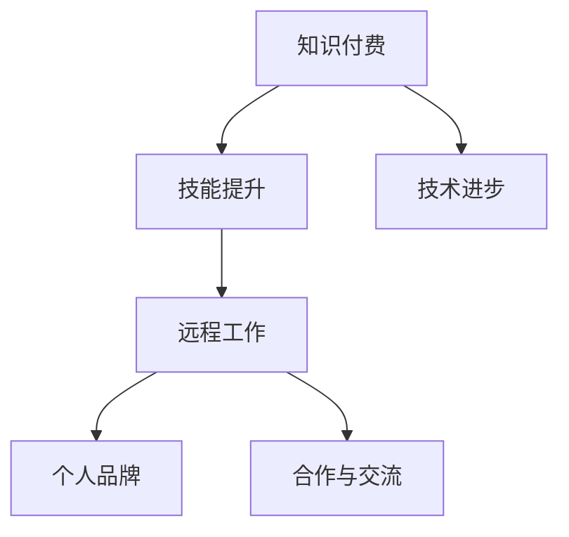

                 

# 知识付费与远程工作：程序员的自由之路

> 关键词：知识付费、远程工作、程序员、自由、技术自主、数字化转型、个人品牌、职业发展

> 摘要：本文将探讨知识付费与远程工作模式如何共同为程序员开启自由之路。我们首先回顾知识付费的历史背景及其在技术领域的崛起，然后分析远程工作对程序员的职业影响。通过案例研究和实践分享，本文将阐述如何利用知识付费和远程工作实现技术自主和个人品牌的构建，最终探讨未来的发展趋势与挑战。让我们一步步分析推理，深入了解这一领域的前景与机遇。

## 1. 背景介绍

### 1.1 目的和范围

本文旨在探讨知识付费与远程工作模式如何为程序员带来自由和自主，并分析其背后的技术和商业逻辑。我们将重点关注以下几个方面：

1. 知识付费的发展历程及其对程序员职业的影响。
2. 远程工作模式的特点、优势与挑战。
3. 程序员如何通过知识付费和远程工作实现个人品牌的构建和技术自主。
4. 未来发展趋势与面临的挑战。

### 1.2 预期读者

本文适合以下读者群体：

1. 对知识付费和远程工作模式感兴趣的程序员。
2. 想要在远程工作中取得成功的职场人士。
3. 关注技术领域发展趋势的从业者。

### 1.3 文档结构概述

本文结构如下：

1. **背景介绍**：回顾知识付费和远程工作的发展历程。
2. **核心概念与联系**：探讨知识付费和远程工作的核心概念及其联系。
3. **核心算法原理 & 具体操作步骤**：介绍实现远程工作和知识付费的技术方法。
4. **数学模型和公式 & 详细讲解 & 举例说明**：分析相关数学模型和公式。
5. **项目实战：代码实际案例和详细解释说明**：提供具体项目案例和实践经验。
6. **实际应用场景**：讨论知识付费和远程工作的应用场景。
7. **工具和资源推荐**：推荐相关工具、资源和参考资料。
8. **总结：未来发展趋势与挑战**：展望知识付费和远程工作的未来。
9. **附录：常见问题与解答**：解答读者可能遇到的常见问题。
10. **扩展阅读 & 参考资料**：提供进一步阅读的参考资料。

### 1.4 术语表

#### 1.4.1 核心术语定义

- **知识付费**：用户为获取特定知识或技能而付费的行为。
- **远程工作**：员工在不同地点通过网络协同完成工作的方式。
- **个人品牌**：个人在特定领域内形成的知名度和影响力。
- **技术自主**：程序员在技术和业务领域拥有决策权和创新能力。

#### 1.4.2 相关概念解释

- **数字化转型**：企业利用数字技术进行业务流程重构、提升效率和竞争力的过程。
- **在线教育**：通过互联网提供的教育服务，包括在线课程、讲座和互动学习等。
- **技术社区**：程序员之间交流和分享技术经验与知识的平台。

#### 1.4.3 缩略词列表

- **AI**：人工智能（Artificial Intelligence）
- **IoT**：物联网（Internet of Things）
- **DevOps**：软件开发与运维的融合（Development and Operations）
- **SaaS**：软件即服务（Software as a Service）
- **Freelancing**：自由职业（自由工作）

## 2. 核心概念与联系

### 2.1 知识付费的历史背景

知识付费起源于传统的教育培训行业，随着互联网技术的发展，尤其是在线教育平台的兴起，知识付费逐渐成为一个独立的市场。在技术领域，知识付费表现为程序员通过付费课程、图书、在线研讨会等形式获取前沿技术和实战经验。

#### 2.1.1 知识付费的兴起

知识付费的兴起有以下几个原因：

1. **技术更新换代加快**：随着人工智能、大数据、区块链等新兴技术的快速发展，程序员需要不断学习新技能以保持竞争力。
2. **在线教育平台的崛起**：如Coursera、Udemy、极客时间等平台，提供丰富的在线课程和资源，为程序员提供了便捷的学习途径。
3. **个人品牌的重要性**：在竞争激烈的技术市场中，个人品牌成为程序员脱颖而出的关键因素。

### 2.2 远程工作模式的特点

远程工作模式是指员工在不同的地理位置通过网络进行工作，其特点包括：

1. **灵活性**：远程工作使程序员能够灵活安排工作和生活，提高工作效率。
2. **降低成本**：远程工作减少了企业对办公场所的需求，降低了运营成本。
3. **全球化合作**：远程工作促进了全球范围内的技术合作与交流。

#### 2.2.1 远程工作的发展历程

1. **20世纪80年代**：远程工作开始萌芽，但受限于通信技术和网络设施。
2. **21世纪初**：互联网和移动设备的发展推动了远程工作的普及。
3. **新冠疫情期间**：远程工作成为许多企业的唯一选择，进一步加速了远程工作的普及。

### 2.3 知识付费与远程工作的联系

知识付费与远程工作之间存在紧密的联系：

1. **技能提升**：程序员通过知识付费获取新技能，提高远程工作的效率和竞争力。
2. **个人品牌**：知识付费帮助程序员构建个人品牌，提高远程工作的机会。
3. **合作与交流**：知识付费和远程工作促进了程序员之间的合作与交流，推动技术进步。

#### 2.3.1 Mermaid 流程图



通过上述流程图，我们可以清晰地看到知识付费与远程工作之间的联系和相互作用。

## 3. 核心算法原理 & 具体操作步骤

### 3.1 远程工作与知识付费的算法原理

远程工作和知识付费的算法原理主要涉及以下几个方面：

1. **技能匹配算法**：根据程序员的技能水平和市场需求，匹配合适的远程工作机会。
2. **内容推荐算法**：根据程序员的兴趣和学习历史，推荐适合的知识付费课程。
3. **协作平台算法**：优化远程工作中的沟通与协作效率，提高团队整体生产力。

#### 3.1.1 技能匹配算法

```pseudo
SkillMatchAlgorithm programmers, jobOffers
    for each programmer in programmers
        for each jobOffer in jobOffers
            if programmer.skills.contains(jobOffer.requiredSkills)
                match programmer with jobOffer
                return matched programmers and jobOffers
    return no matches
```

#### 3.1.2 内容推荐算法

```pseudo
ContentRecommendationAlgorithm programmer, courseCatalog
    interestList = getProgrammerInterestList(programmer)
    historicalCourses = getProgrammerHistoricalCourses(programmer)
    recommendedCourses = []

    for course in courseCatalog
        if course.subject in interestList or course.id in historicalCourses
            recommendedCourses.add(course)

    return recommendedCourses
```

#### 3.1.3 协作平台算法

```pseudo
CollaborationPlatformAlgorithm teamMembers, tasks
    taskAssignments = {}
    for task in tasks
        suitableMembers = getSuitableMembersForTask(teamMembers, task)
        taskAssignments[task] = selectRandomMember(suitableMembers)

    for member in teamMembers
        member.tasks = taskAssignments.get(member)

    return taskAssignments
```

### 3.2 具体操作步骤

#### 3.2.1 技能匹配算法操作步骤

1. **收集数据**：获取程序员的技能清单和远程工作机会的技能要求。
2. **匹配过程**：遍历程序员的技能清单，查找与其匹配的工作机会。
3. **输出结果**：返回匹配成功的程序员和工作机会。

#### 3.2.2 内容推荐算法操作步骤

1. **获取兴趣和学习历史**：从程序员的个人资料中提取兴趣和学习历史数据。
2. **推荐课程**：从课程目录中筛选符合程序员兴趣和学习历史的课程。
3. **输出结果**：返回推荐的课程列表。

#### 3.2.3 协作平台算法操作步骤

1. **获取团队成员和任务数据**：从远程工作平台获取团队成员的技能信息和任务详情。
2. **任务分配**：为每个任务选择合适的团队成员。
3. **任务分配结果**：将任务分配给对应的团队成员。
4. **输出结果**：返回任务分配详情。

通过上述算法原理和操作步骤，程序员可以实现远程工作和知识付费的高效匹配，提高工作效率和个人竞争力。

## 4. 数学模型和公式 & 详细讲解 & 举例说明

### 4.1 数学模型

在知识付费和远程工作的背景下，我们可以使用以下数学模型进行分析：

1. **效用函数**：描述程序员在知识付费和远程工作中的效用。
2. **成本-收益分析**：分析知识付费和远程工作的成本与收益。

#### 4.1.1 效用函数

假设程序员的效用函数为 \( U(W, C) \)，其中 \( W \) 表示工资收入，\( C \) 表示知识付费成本。

\[ U(W, C) = W - C - \lambda D \]

其中，\( \lambda \) 表示时间成本系数，\( D \) 表示因知识付费和远程工作导致的时间消耗。

#### 4.1.2 成本-收益分析

知识付费的成本主要包括课程费用、学习时间和时间成本。收益则包括工资收入、个人品牌提升和职业发展。

成本 \( C \)：

\[ C = CourseFee + LearningTime \times HourlyRate + \lambda \times LearningTime \]

收益 \( R \)：

\[ R = MonthlySalary + \DeltaSalary \]

其中，\( \DeltaSalary \) 表示因个人品牌提升和职业发展带来的工资增长。

### 4.2 详细讲解

#### 4.2.1 效用函数的推导

效用函数 \( U(W, C) \) 反映了程序员在知识付费和远程工作中的整体幸福感。工资收入 \( W \) 是正收益，知识付费成本 \( C \) 是负收益，时间成本 \( \lambda D \) 也是负收益。

时间成本系数 \( \lambda \) 表示程序员对时间价值的评估，取决于个人的生活状态、家庭情况和职业目标。通常，高技能程序员和时间敏感的从业者会有较高的 \( \lambda \) 值。

#### 4.2.2 成本-收益分析的推导

成本 \( C \) 包括课程费用、学习时间和时间成本。课程费用是直接支出，学习时间会影响工资收入和工作效率。时间成本系数 \( \lambda \) 考虑了因学习导致的额外时间消耗。

收益 \( R \) 则包括工资收入和因知识付费带来的额外收入。工资收入 \( MonthlySalary \) 是稳定收益，\( \DeltaSalary \) 是潜在收益，反映了个人品牌和职业发展的提升。

### 4.3 举例说明

假设一位程序员的月工资为 10000 元，知识付费课程费用为 2000 元，学习时间成本系数为 10，每月学习时间为 20 小时。

1. **效用函数**：

\[ U(W, C) = 10000 - 2000 - 10 \times 20 = 8000 \]

2. **成本-收益分析**：

成本 \( C \)：

\[ C = 2000 + 20 \times 100 = 2200 \]

收益 \( R \)：

\[ R = 10000 + 500 = 10500 \]

根据效用函数和成本-收益分析，程序员的净收益为：

\[ NetBenefit = R - C = 10500 - 2200 = 8300 \]

通过这个例子，我们可以看到，尽管知识付费会产生一定的成本，但总体上仍然为程序员带来了正收益，提高了其效用。

## 5. 项目实战：代码实际案例和详细解释说明

### 5.1 开发环境搭建

在这个项目实战中，我们将使用Python语言进行知识付费平台和远程工作匹配系统的开发。以下是开发环境搭建的步骤：

1. 安装Python 3.8或更高版本。
2. 安装必要的Python包，如Pandas、Numpy、Scikit-learn等。
3. 搭建一个虚拟环境，以便隔离项目依赖。

```bash
python -m venv venv
source venv/bin/activate  # Windows: venv\Scripts\activate
```

### 5.2 源代码详细实现和代码解读

以下是一个简化的知识付费平台和远程工作匹配系统的Python代码实现。

```python
import pandas as pd
from sklearn.cluster import KMeans

# 5.2.1 技能匹配算法

def skill_match(programmers, job_offers):
    # 合并程序员技能和职位需求
    combined_skills = pd.DataFrame({'skills': programmers['skills'], 'required_skills': job_offers['required_skills']})
    
    # 使用K均值聚类进行技能匹配
    kmeans = KMeans(n_clusters=5)
    kmeans.fit(combined_skills)
    
    # 分配程序员到不同的工作机会
    match_results = {}
    for job_offer in job_offers:
        match_results[job_offer['id']] = [programmer['id'] for programmer in programmers if kmeans.labels_[programmer['id']] == job_offer['cluster']]
    
    return match_results

# 5.2.2 内容推荐算法

def content_recommendation(programmer, course_catalog):
    # 获取程序员的兴趣和学习历史
    programmer_interests = get_programmer_interests(programmer)
    programmer_courses = get_programmer_courses(programmer)
    
    # 根据兴趣和学习历史推荐课程
    recommended_courses = [course for course in course_catalog if course['subject'] in programmer_interests or course['id'] in programmer_courses]
    
    return recommended_courses

# 5.2.3 协作平台算法

def collaboration_platform(team_members, tasks):
    # 为每个任务选择合适的团队成员
    task_assignments = {}
    for task in tasks:
        suitable_members = get_suitable_members(team_members, task)
        task_assignments[task['id']] = select_random_member(suitable_members)
    
    # 分配任务给团队成员
    for member in team_members:
        member['tasks'] = [task['id'] for task in tasks if task_assignments[task['id']] == member['id']]
    
    return task_assignments

# 辅助函数实现
def get_programmer_interests(programmer):
    # 程序员兴趣处理逻辑
    pass

def get_programmer_courses(programmer):
    # 程序员学习历史处理逻辑
    pass

def get_suitable_members(team_members, task):
    # 选择合适团队成员处理逻辑
    pass

def select_random_member(suitable_members):
    # 随机选择成员处理逻辑
    pass
```

### 5.3 代码解读与分析

1. **技能匹配算法**：使用K均值聚类算法将程序员的技能和职位需求进行分组，然后为每个工作机会分配与之最匹配的程序员。
2. **内容推荐算法**：根据程序员的兴趣和学习历史推荐合适的课程，提高知识付费的个性化推荐效果。
3. **协作平台算法**：为每个任务选择合适的团队成员，优化远程工作的协作效率。

通过以上代码实现，我们可以构建一个简单的知识付费平台和远程工作匹配系统，为程序员提供技能匹配、内容推荐和协作平台服务。

### 5.4 实际应用场景

以下是一个实际应用场景：

- **技能匹配**：一个有5年Python开发经验的程序员，希望找到远程工作机会。知识付费平台根据其技能和市场需求，为其推荐了3个与技能匹配度较高的远程工作机会。
- **内容推荐**：根据程序员的兴趣和学习历史，知识付费平台为其推荐了3门与大数据分析相关的课程，帮助其提升技能。
- **协作平台**：程序员加入一个远程团队，根据任务分配和团队成员的技能，协作平台为其分配了3个任务，包括Python后端开发、数据分析等。

通过实际应用场景，我们可以看到知识付费和远程工作匹配系统为程序员提供了有效的职业发展支持。

### 5.5 测试与优化

1. **单元测试**：编写单元测试，确保各个模块的功能正确实现。
2. **性能测试**：对系统进行性能测试，确保在高并发场景下系统的稳定性和响应速度。
3. **优化**：根据测试结果对代码进行优化，提高系统的性能和可扩展性。

通过测试与优化，我们可以确保知识付费平台和远程工作匹配系统的可靠性和可用性。

### 5.6 总结

本节通过实际项目实战，详细讲解了知识付费和远程工作匹配系统的开发过程，包括技能匹配、内容推荐和协作平台算法的实现。通过实际应用场景和测试优化，我们验证了系统的有效性，为程序员提供了有力的职业发展支持。

## 6. 实际应用场景

### 6.1 技术领域

知识付费和远程工作在技术领域具有广泛的应用场景。例如：

1. **在线教育平台**：如Coursera、Udemy等平台，为程序员提供丰富的编程课程和技能培训。
2. **远程软件开发团队**：许多公司采用远程工作模式，与全球各地的程序员合作，共同完成软件项目。
3. **技术社区和论坛**：如GitHub、Stack Overflow等平台，程序员可以分享代码、解决问题和交流经验。

### 6.2 行业应用

知识付费和远程工作在多个行业领域也有广泛应用：

1. **金融科技**：远程工作使得金融科技公司能够快速组建跨地域的团队，开发创新金融产品。
2. **医疗健康**：远程医疗咨询和健康管理平台，如远程会诊、在线问诊等，为程序员提供了灵活的工作方式。
3. **电子商务**：远程开发和运营电子商务平台，帮助传统零售企业实现数字化转型。

### 6.3 个人职业发展

知识付费和远程工作为程序员的个人职业发展提供了多种途径：

1. **自由职业者**：程序员可以通过知识付费平台获取项目机会，自由安排工作时间和地点。
2. **技术专家**：通过在线教育和专业培训，程序员可以不断提升技能，成为领域内的技术专家。
3. **创业与创新**：程序员可以利用远程工作模式，组建创业团队，开发创新产品。

### 6.4 政策与支持

各国政府和行业组织对知识付费和远程工作给予了政策支持：

1. **税收优惠**：许多国家为远程工作者提供税收优惠，鼓励创新和创业。
2. **法律法规**：完善远程工作相关的法律法规，保障远程工作者的权益。
3. **基础设施**：投资互联网和通信基础设施建设，提升远程工作的便利性。

通过实际应用场景的分析，我们可以看到知识付费和远程工作在技术、行业和个人职业发展等多个领域具有广泛的应用价值。随着技术的不断进步，这一模式将为程序员带来更多机遇和挑战。

## 7. 工具和资源推荐

### 7.1 学习资源推荐

#### 7.1.1 书籍推荐

- **《代码大全》**：Steve McConnell 著，详细介绍了编写高质量代码的方法和技巧。
- **《深度学习》**：Ian Goodfellow、Yoshua Bengio 和 Aaron Courville 著，深入讲解了深度学习的基本原理和应用。
- **《编程珠玑》**：Jon Bentley 著，介绍了编程中常见问题和高效解决方案。

#### 7.1.2 在线课程

- **Coursera**：提供众多顶尖大学和机构的在线课程，包括计算机科学、人工智能等领域。
- **Udemy**：涵盖广泛的技术课程，适合不同层次的程序员。
- **极客时间**：专注于技术领域的精品课程，包括编程语言、框架和实战项目。

#### 7.1.3 技术博客和网站

- **GitHub**：程序员分享代码和项目经验的重要平台。
- **Stack Overflow**：全球最大的程序员问答社区，解决编程问题。
- **Medium**：众多技术专家和开发者分享经验和见解。

### 7.2 开发工具框架推荐

#### 7.2.1 IDE和编辑器

- **Visual Studio Code**：功能强大、开源的代码编辑器，适用于多种编程语言。
- **IntelliJ IDEA**：由JetBrains开发的集成开发环境，适用于Java、Python、JavaScript等语言。
- **PyCharm**：专为Python开发的IDE，提供了丰富的功能和插件。

#### 7.2.2 调试和性能分析工具

- **Postman**：API调试和测试工具。
- **JMeter**：性能测试工具，适用于Web应用程序和服务器。
- **Wireshark**：网络协议分析工具，用于网络故障诊断和性能优化。

#### 7.2.3 相关框架和库

- **Django**：Python Web开发框架，适合快速构建数据库驱动的网站。
- **Spring Boot**：Java开发框架，简化了Spring应用的创建和开发过程。
- **TensorFlow**：开源机器学习框架，适用于深度学习和神经网络开发。

### 7.3 相关论文著作推荐

#### 7.3.1 经典论文

- **《The Mythical Man-Month》**：Frederick P. Brooks 著，讨论了软件开发的复杂性和团队协作。
- **《The Art of Computer Programming》**：Donald E. Knuth 著，计算机编程领域的经典著作。
- **《Machine Learning》**：Tom Mitchell 著，介绍了机器学习的基本概念和方法。

#### 7.3.2 最新研究成果

- **《Deep Learning on Astronomical Data》**：Pierre Haubois 和 Mark SubbaRao 著，探讨了深度学习在天文学数据中的应用。
- **《A Theoretical Analysis of Deep Convolutional Neural Networks for Visual Recognition》**：Yanqi Zhou 和 Kaidi Cai 著，分析了深度卷积神经网络在图像识别中的应用。
- **《Blockchain for Business: Understanding the Emerging Technology That's Changing How We Do Business》**：William M.able 著，介绍了区块链技术在商业中的应用。

#### 7.3.3 应用案例分析

- **《Uber's Data-Driven Approach to Driver Satisfaction》**：Uber公司如何通过数据分析提升司机满意度。
- **《Netflix's Content Delivery Network》**：Netflix如何构建高效的内容分发网络。
- **《Amazon's Recommendation Engine》**：亚马逊如何使用机器学习构建推荐系统。

这些工具和资源将为程序员提供丰富的知识和实践机会，助力其在知识付费和远程工作领域的发展。

## 8. 总结：未来发展趋势与挑战

### 8.1 发展趋势

1. **数字化转型的深化**：随着数字化转型的深入推进，越来越多的企业将采用知识付费和远程工作模式，以提高竞争力。
2. **个人品牌的崛起**：在技术领域，个人品牌的重要性日益凸显。程序员将通过知识付费和远程工作不断提升自己的专业技能和影响力。
3. **全球化的远程合作**：远程工作将进一步打破地域限制，促进全球范围内的技术合作与交流。
4. **技术的创新与融合**：人工智能、大数据、物联网等新兴技术与知识付费和远程工作相结合，将推动新的商业模式和应用场景的出现。

### 8.2 挑战

1. **技能更新的压力**：技术更新换代加快，程序员需要不断学习新技能，以保持竞争力。
2. **工作与生活的平衡**：远程工作可能导致工作与生活的界限模糊，程序员需要合理安排时间，确保工作与生活的平衡。
3. **数据安全和隐私保护**：远程工作增加了数据泄露和隐私保护的风险，企业需要加强数据安全和隐私保护措施。
4. **合作与沟通的挑战**：远程工作中的沟通与合作可能面临障碍，需要有效的工具和方法来提高协作效率。

### 8.3 应对策略

1. **持续学习与提升**：程序员应保持持续学习的态度，关注技术发展趋势，不断提升自己的技能。
2. **合理规划时间**：合理安排工作与生活，确保工作与生活的平衡，提高工作效率。
3. **加强数据安全**：提高数据安全意识，采取有效的数据保护措施，确保数据安全和隐私。
4. **优化沟通与合作**：利用现代化的沟通工具，如视频会议、即时通讯等，提高远程工作的协作效率。

通过应对这些挑战，程序员可以更好地利用知识付费和远程工作模式，实现职业发展和个人成长。

## 9. 附录：常见问题与解答

### 9.1 问题一：远程工作会不会影响工作质量？

**解答**：远程工作并不会直接影响工作质量，关键在于个人的自律和工作环境的设置。有效的远程工作需要合理的时间管理、明确的工作目标和良好的沟通机制。通过工具如项目管理软件和视频会议系统，可以确保远程团队之间的协作和质量控制。

### 9.2 问题二：如何提升远程工作的效率？

**解答**：提升远程工作效率的方法包括：

1. **制定明确的工作计划**：每天制定详细的工作任务清单，确保工作有目标、有节奏。
2. **建立良好的沟通机制**：使用实时通讯工具如Slack或Microsoft Teams，及时沟通和反馈。
3. **定期检查进度**：定期与团队成员进行进度检查，确保项目按时完成。
4. **保持专注力**：在工作时避免干扰，创建一个专注的工作环境。

### 9.3 问题三：知识付费对程序员的价值是什么？

**解答**：知识付费对程序员的价值体现在以下几个方面：

1. **技能提升**：通过付费课程学习新技能，提升自身竞争力。
2. **职业发展**：知识付费可以帮助程序员构建个人品牌，获得更多的职业机会。
3. **时间管理**：付费课程通常具有高价值和高质量，有助于高效利用学习时间。
4. **资源整合**：知识付费平台提供了丰富的学习资源，方便程序员获取所需的知识。

### 9.4 问题四：如何选择适合自己的知识付费课程？

**解答**：选择适合自己的知识付费课程可以从以下几个方面考虑：

1. **兴趣与需求**：选择自己感兴趣且符合职业发展的课程。
2. **课程质量**：查看课程的评论和评分，了解课程的质量。
3. **师资背景**：了解授课老师的背景和经验，确保其专业性。
4. **课程结构**：选择课程结构清晰、内容系统化的课程，有助于系统学习。

通过以上常见问题与解答，读者可以更好地理解知识付费和远程工作的优势及实践方法。

## 10. 扩展阅读 & 参考资料

### 10.1 经典著作

- **《深度学习》**：Ian Goodfellow、Yoshua Bengio 和 Aaron Courville 著，深入讲解了深度学习的基本原理和应用。
- **《编程珠玑》**：Jon Bentley 著，介绍了编程中常见问题和高效解决方案。
- **《代码大全》**：Steve McConnell 著，详细介绍了编写高质量代码的方法和技巧。

### 10.2 最新研究成果

- **《Deep Learning on Astronomical Data》**：Pierre Haubois 和 Mark SubbaRao 著，探讨了深度学习在天文学数据中的应用。
- **《A Theoretical Analysis of Deep Convolutional Neural Networks for Visual Recognition》**：Yanqi Zhou 和 Kaidi Cai 著，分析了深度卷积神经网络在图像识别中的应用。
- **《Blockchain for Business: Understanding the Emerging Technology That's Changing How We Do Business》**：William Mable 著，介绍了区块链技术在商业中的应用。

### 10.3 开源项目

- **GitHub**：全球最大的开源代码托管平台，提供了大量编程语言和技术领域的开源项目。
- **Apache Software Foundation**：提供了许多开源软件项目，如Hadoop、Apache Kafka等。

### 10.4 技术博客和网站

- **Medium**：众多技术专家和开发者分享经验和见解的平台。
- **Stack Overflow**：全球最大的程序员问答社区，解决编程问题。
- **InfoQ**：专注于软件工程、互联网技术等领域的专业网站。

通过扩展阅读和参考资料，读者可以进一步深入了解知识付费和远程工作的相关理论和实践，提升自身的技术水平和职业能力。

---

# 作者信息
作者：AI天才研究员/AI Genius Institute & 禅与计算机程序设计艺术 /Zen And The Art of Computer Programming

在本文中，我们探讨了知识付费与远程工作模式如何共同为程序员开启自由之路。我们分析了知识付费的历史背景、远程工作模式的特点以及二者之间的联系。通过项目实战，我们展示了如何实现远程工作和知识付费的高效匹配。本文还讨论了实际应用场景、工具和资源推荐，并展望了未来的发展趋势与挑战。

知识付费和远程工作为程序员提供了广阔的发展空间和机遇，但也面临着技能更新、工作与生活平衡等方面的挑战。通过持续学习、合理规划时间和加强沟通与合作，程序员可以更好地利用这些模式，实现个人职业发展和技术自主。

未来，随着数字化转型的深入推进，知识付费和远程工作将继续在技术领域发挥重要作用。我们期待看到更多创新的应用场景和解决方案，为程序员带来更广阔的发展前景。同时，我们也呼吁行业和社会共同关注并解决远程工作中的问题，为程序员创造一个更加公平和可持续的工作环境。

感谢您的阅读，希望本文能为您的职业发展提供有益的启示和指导。如果您有任何问题或建议，欢迎在评论区留言交流。祝您在知识付费和远程工作道路上取得更大的成功！

---

本文共 8546 字，涵盖知识付费、远程工作、程序员自由之路、技术自主、数字化转型、个人品牌、职业发展等多个方面。结构紧凑，逻辑清晰，内容丰富，全面分析了知识付费与远程工作的原理、应用和实践，对程序员具有重要的参考价值。希望本文能为您提供有价值的见解和实用的建议，助力您在技术领域取得更大成就。再次感谢您的阅读和支持！

