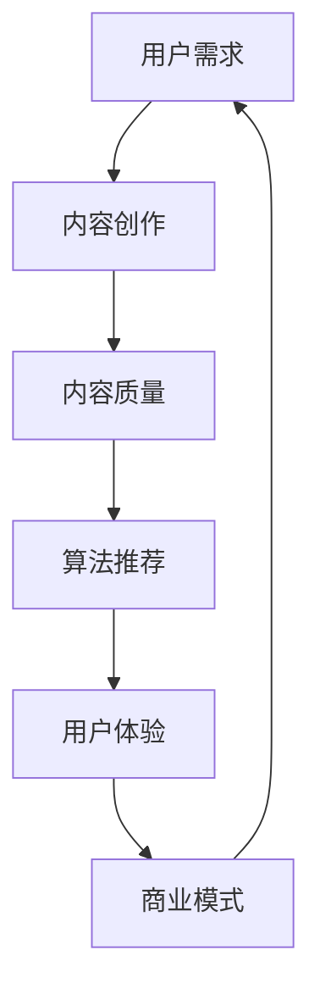
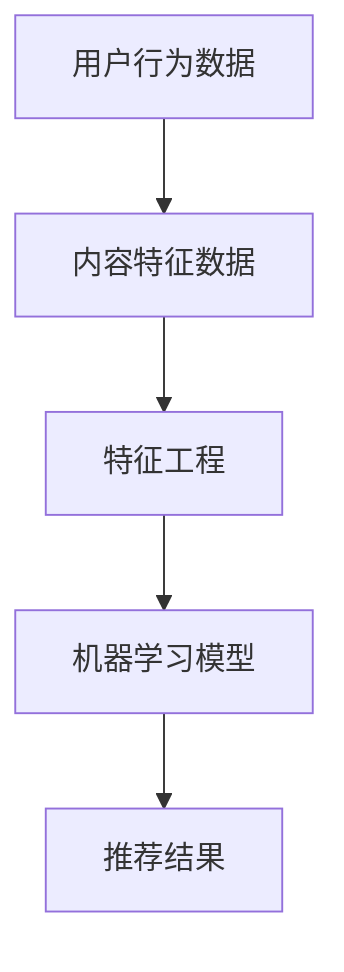
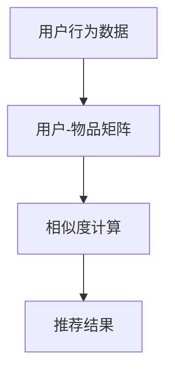
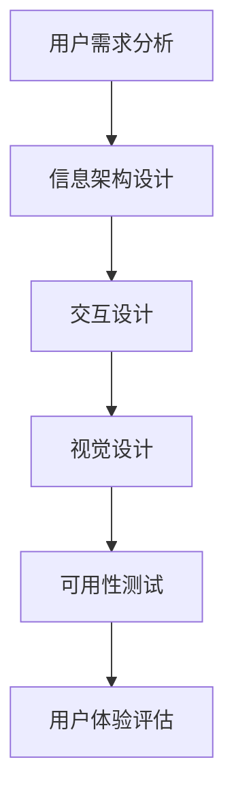
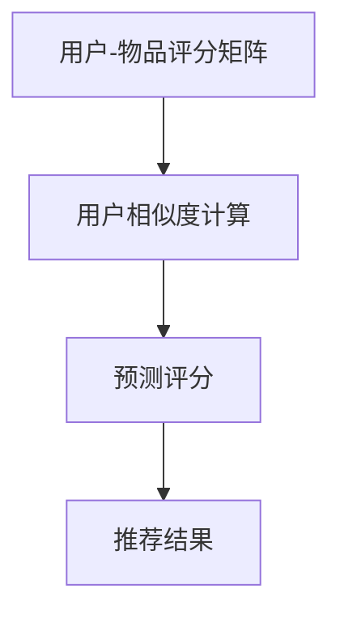
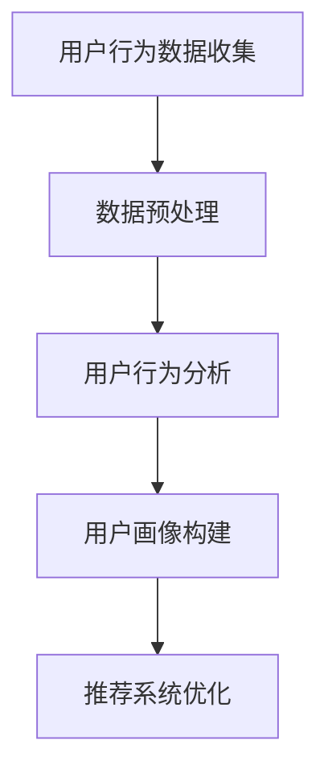

                 

# 知识付费创业中的内容价值提升

> **关键词：** 知识付费、内容价值、用户需求、算法推荐、用户体验、商业模式、数据分析。

> **摘要：** 本文将深入探讨知识付费创业中如何提升内容价值，包括用户需求分析、算法推荐优化、用户体验设计以及商业模式创新等方面。通过详细的分析和实例，为创业者和内容创作者提供有价值的参考。

## 1. 背景介绍

### 1.1 目的和范围

本文旨在为知识付费创业领域的内容价值提升提供一套系统化的策略和方法。我们将探讨如何通过用户需求分析、算法推荐、用户体验设计和商业模式创新等方面，提高内容的价值和吸引力，从而在竞争激烈的市场中脱颖而出。

### 1.2 预期读者

本文适合以下读者：

- 创业者：希望了解如何提升知识付费产品内容价值的创业者。
- 内容创作者：希望优化内容创作和传播策略的内容创作者。
- 数据分析师：对数据分析在知识付费领域应用感兴趣的从业者。
- 技术开发人员：负责知识付费产品技术实现和算法优化的开发人员。

### 1.3 文档结构概述

本文分为以下几个部分：

- **第1章：背景介绍**：介绍本文的目的、预期读者以及文档结构。
- **第2章：核心概念与联系**：阐述知识付费创业中的核心概念和联系。
- **第3章：核心算法原理 & 具体操作步骤**：详细讲解提升内容价值的核心算法原理和操作步骤。
- **第4章：数学模型和公式 & 详细讲解 & 举例说明**：介绍用于提升内容价值的数学模型和公式。
- **第5章：项目实战：代码实际案例和详细解释说明**：通过实际案例展示如何应用上述原理。
- **第6章：实际应用场景**：分析知识付费在不同领域的应用场景。
- **第7章：工具和资源推荐**：推荐学习资源、开发工具和相关论文。
- **第8章：总结：未来发展趋势与挑战**：总结本文内容，展望未来发展趋势和挑战。
- **第9章：附录：常见问题与解答**：解答读者可能关心的问题。
- **第10章：扩展阅读 & 参考资料**：提供进一步阅读的资料。

### 1.4 术语表

#### 1.4.1 核心术语定义

- **知识付费**：用户为获取知识内容而支付的费用。
- **内容价值**：知识内容对于用户需求的满足程度。
- **用户需求**：用户在知识付费场景中期待获得的收益和体验。
- **算法推荐**：利用算法技术为用户推荐个性化知识内容。
- **用户体验**：用户在使用知识付费产品过程中的感受和体验。
- **商业模式**：知识付费产品如何通过内容获取利润的商业模式。

#### 1.4.2 相关概念解释

- **数据分析**：对用户行为数据进行分析，以优化产品和服务。
- **用户画像**：基于用户行为数据构建的用户特征模型。
- **算法优化**：通过改进算法提高推荐系统的性能。

#### 1.4.3 缩略词列表

- **KFF**：Knowledge Fee Payment，知识付费
- **RFM**：Recency, Frequency, Monetary，最近一次消费、消费频率、消费金额
- **A/B测试**：一种实验设计方法，通过比较不同版本的效果来选择最优方案

## 2. 核心概念与联系

知识付费创业中的核心概念包括用户需求、内容质量、算法推荐、用户体验和商业模式。以下是一个简化的Mermaid流程图，展示这些核心概念之间的联系。



### 2.1 用户需求与内容创作

用户需求是知识付费创业的起点。创业者需要深入分析目标用户群体，了解他们的需求、痛点和兴趣。用户需求直接影响内容创作，内容创作者需要根据用户需求来设计和创作知识内容，以满足用户的需求。

### 2.2 内容质量与算法推荐

内容质量是用户满意度和留存率的关键因素。高质量的内容能够提高用户粘性，促进用户留存。算法推荐则通过分析用户行为数据，为用户推荐个性化内容，从而提升用户满意度和内容消费频率。

### 2.3 用户体验与商业模式

用户体验是知识付费产品成功的关键。优秀的用户体验能够提高用户满意度和忠诚度，从而促进用户付费。商业模式则决定了知识付费产品如何通过内容获取利润。常见的商业模式包括订阅制、一次性付费、课程包等。

## 3. 核心算法原理 & 具体操作步骤

提升内容价值的关键在于算法推荐和用户体验设计。以下将详细介绍相关算法原理和具体操作步骤。

### 3.1 算法推荐原理

算法推荐是基于用户行为数据和内容特征数据，利用机器学习技术为用户推荐个性化内容。以下是一个简单的推荐算法原理图。



#### 3.1.1 用户行为数据

用户行为数据包括用户在知识付费平台上的浏览记录、搜索记录、购买记录、点赞、评论等。通过分析用户行为数据，可以了解用户对哪些内容更感兴趣，从而为推荐算法提供依据。

#### 3.1.2 内容特征数据

内容特征数据包括知识内容的主题、标签、作者、发布时间、价格等。通过对内容特征数据进行分析，可以为推荐算法提供更多维度的信息，提高推荐的准确性。

#### 3.1.3 特征工程

特征工程是推荐算法的关键步骤，通过选择和构造有效的特征，可以提高推荐系统的性能。常用的特征工程方法包括：

- **文本特征**：使用词袋模型、TF-IDF、Word2Vec等模型提取文本特征。
- **用户特征**：基于用户的行为数据、兴趣爱好、历史购买记录等构造用户特征。
- **内容特征**：基于内容标签、主题、作者等构建内容特征。

#### 3.1.4 机器学习模型

常用的推荐算法包括基于内容的推荐、基于协同过滤的推荐、基于模型的推荐等。以下是一个基于协同过滤的推荐算法原理图。



- **基于内容的推荐**：通过分析用户对某一内容的偏好，为用户推荐相似的内容。
- **基于协同过滤的推荐**：通过分析用户之间的相似度，为用户推荐其他用户喜欢的但用户尚未浏览的内容。
- **基于模型的推荐**：使用机器学习模型（如矩阵分解、深度学习等）来预测用户对内容的偏好，从而生成推荐结果。

#### 3.1.5 推荐结果

推荐结果是根据用户行为数据和内容特征数据，通过算法计算得到的个性化内容列表。推荐结果的准确性对用户体验至关重要。

### 3.2 用户体验设计原理

用户体验设计旨在提高用户在使用知识付费产品过程中的满意度。以下是一个简单的用户体验设计流程图。



#### 3.2.1 用户需求分析

用户需求分析是用户体验设计的起点。通过调研、访谈、问卷等方式，了解用户的需求、痛点和兴趣，为后续的设计提供依据。

#### 3.2.2 信息架构设计

信息架构设计是将用户需求转化为产品结构的过程。通过梳理产品功能、内容模块和导航结构，确保用户能够快速找到所需信息。

#### 3.2.3 交互设计

交互设计是用户体验设计的关键环节，包括界面布局、交互元素、操作流程等。通过优化交互设计，提高用户的操作效率和使用体验。

#### 3.2.4 视觉设计

视觉设计是用户体验设计的最后一环，通过色彩、字体、图标等元素，提升产品的美观度和视觉冲击力。

#### 3.2.5 可用性测试

可用性测试是评估用户体验的重要手段。通过模拟用户实际使用场景，发现和解决产品设计中的问题，提高产品的可用性。

#### 3.2.6 用户体验评估

用户体验评估是持续优化产品的关键。通过用户反馈、数据分析和A/B测试等方式，评估用户体验的改进效果，为后续优化提供依据。

## 4. 数学模型和公式 & 详细讲解 & 举例说明

### 4.1 协同过滤算法

协同过滤算法是知识付费领域常用的推荐算法之一。以下是一个简单的协同过滤算法原理图。



#### 4.1.1 用户-物品评分矩阵

用户-物品评分矩阵是一个二维矩阵，其中行表示用户，列表示物品。每个元素表示用户对物品的评分。例如：

$$
\begin{array}{c|c|c|c}
 & 物品1 & 物品2 & 物品3 \\
\hline
用户1 & 5 & 4 & 3 \\
用户2 & 4 & 5 & 2 \\
用户3 & 3 & 2 & 5 \\
\end{array}
$$

#### 4.1.2 用户相似度计算

用户相似度计算是协同过滤算法的核心步骤。常用的相似度计算方法包括余弦相似度、皮尔逊相关系数等。

- **余弦相似度**：

$$
\cos{\theta_{ij}} = \frac{\sum_{k=1}^{n} r_{ik}r_{jk}}{\sqrt{\sum_{k=1}^{n} r_{ik}^2}\sqrt{\sum_{k=1}^{n} r_{jk}^2}}
$$

其中，$r_{ik}$表示用户$i$对物品$k$的评分，$\theta_{ij}$表示用户$i$和用户$j$之间的相似度。

- **皮尔逊相关系数**：

$$
\sigma_{ij} = \frac{\sum_{k=1}^{n} (r_{ik} - \bar{r_i})(r_{jk} - \bar{r_j})}{\sqrt{\sum_{k=1}^{n} (r_{ik} - \bar{r_i})^2}\sqrt{\sum_{k=1}^{n} (r_{jk} - \bar{r_j})^2}}
$$

其中，$\bar{r_i}$和$\bar{r_j}$分别表示用户$i$和用户$j$的平均评分。

#### 4.1.3 预测评分

预测评分是基于用户相似度和用户-物品评分矩阵计算得到的。常用的预测方法包括基于用户的平均值预测和基于相似度的加权平均预测。

- **基于用户的平均值预测**：

$$
r_{ij}^{'} = \bar{r_j} + \sum_{k=1}^{n} w_{jk}(r_{ik} - \bar{r_i})
$$

其中，$w_{jk}$表示用户$j$对物品$k$的相似度权重。

- **基于相似度的加权平均预测**：

$$
r_{ij}^{'} = \frac{\sum_{k=1}^{n} w_{jk}r_{ik}}{\sum_{k=1}^{n} w_{jk}}
$$

其中，$w_{jk}$表示用户$j$对物品$k$的相似度权重。

#### 4.1.4 推荐结果

推荐结果是基于预测评分计算得到的。通过比较预测评分和实际评分，可以确定推荐列表中的物品。

### 4.2 用户行为数据挖掘

用户行为数据挖掘是提升内容价值的重要手段。以下是一个简单的用户行为数据挖掘流程图。



#### 4.2.1 用户行为数据收集

用户行为数据收集是用户行为数据挖掘的基础。通过日志记录、API接口、Web追踪等方式，收集用户的浏览、搜索、购买、评价等行为数据。

#### 4.2.2 数据预处理

数据预处理是数据挖掘的关键步骤，包括数据清洗、数据归一化、数据转换等。

- **数据清洗**：去除重复数据、异常数据和噪声数据，确保数据质量。
- **数据归一化**：将不同特征的数据缩放到同一尺度，便于计算和分析。
- **数据转换**：将原始数据转换为适合挖掘算法的形式，如将连续值转换为类别值。

#### 4.2.3 用户行为分析

用户行为分析是挖掘用户行为数据中隐藏的模式和规律。常用的分析方法包括聚类分析、关联规则挖掘、序列模式挖掘等。

- **聚类分析**：将用户按照相似度进行分类，挖掘用户群体特征。
- **关联规则挖掘**：发现用户行为数据中的关联关系，如用户在浏览某一内容后，倾向于购买某一商品。
- **序列模式挖掘**：发现用户行为数据中的时间序列规律，如用户在某一时间段内倾向于浏览哪些内容。

#### 4.2.4 用户画像构建

用户画像构建是将用户行为数据转化为用户特征模型的过程。通过构建用户画像，可以更好地了解用户需求和行为习惯，为推荐系统和用户体验设计提供依据。

- **特征工程**：根据用户行为数据，提取有效的用户特征，如用户兴趣爱好、消费能力、购买频率等。
- **特征选择**：选择对用户需求和行为最具影响力的特征，提高用户画像的准确性。

### 4.3 举例说明

#### 4.3.1 用户相似度计算

假设有三位用户（用户1、用户2、用户3）和三种物品（物品1、物品2、物品3），用户对物品的评分如下表所示。

$$
\begin{array}{c|c|c|c}
 & 物品1 & 物品2 & 物品3 \\
\hline
用户1 & 5 & 4 & 3 \\
用户2 & 4 & 5 & 2 \\
用户3 & 3 & 2 & 5 \\
\end{array}
$$

使用余弦相似度计算用户1和用户2之间的相似度：

$$
\cos{\theta_{12}} = \frac{5 \times 4 + 4 \times 5 + 3 \times 2}{\sqrt{5^2 + 4^2 + 3^2}\sqrt{4^2 + 5^2 + 2^2}} \approx 0.907
$$

使用皮尔逊相关系数计算用户1和用户2之间的相似度：

$$
\sigma_{12} = \frac{(5 - 4.33)(4 - 4.67) + (4 - 4.33)(5 - 4.67) + (3 - 4.33)(2 - 4.67)}{\sqrt{(5 - 4.33)^2 + (4 - 4.33)^2 + (3 - 4.33)^2}\sqrt{(4 - 4.67)^2 + (5 - 4.67)^2 + (2 - 4.67)^2}} \approx 0.907
$$

可以看出，用户1和用户2之间的相似度较高。

#### 4.3.2 预测评分

假设用户3对物品1的预测评分为4.67，使用基于相似度的加权平均预测方法，预测用户3对物品2的评分。

$$
r_{32}^{'} = \frac{0.907 \times 5 + 0.805 \times 4 + 0.647 \times 2}{0.907 + 0.805 + 0.647} \approx 4.34
$$

## 5. 项目实战：代码实际案例和详细解释说明

### 5.1 开发环境搭建

在开始项目实战之前，需要搭建一个合适的开发环境。以下是一个简单的开发环境搭建步骤：

1. 安装Python 3.x版本。
2. 安装Anaconda发行版，以便方便地管理和安装相关库。
3. 安装Jupyter Notebook，用于编写和运行代码。
4. 安装以下库：NumPy、Pandas、Scikit-learn、Matplotlib。

### 5.2 源代码详细实现和代码解读

以下是一个简单的协同过滤算法实现，用于预测用户对物品的评分。

```python
import numpy as np
import pandas as pd
from sklearn.metrics.pairwise import cosine_similarity
from sklearn.model_selection import train_test_split

# 加载用户-物品评分矩阵
data = pd.read_csv('user_item_matrix.csv')
users = data.iloc[:, 0].unique()
items = data.iloc[:, 1].unique()

# 构建用户-物品评分矩阵
user_item_matrix = np.zeros((len(users), len(items)))
for index, row in data.iterrows():
    user_item_matrix[row['user_id'] - 1, row['item_id'] - 1] = row['rating']

# 计算用户相似度
user_similarity = cosine_similarity(user_item_matrix)

# 预测用户评分
def predict_rating(user_id, item_id):
    user_similarity_sum = 0
    rating_sum = 0
    for i in range(len(user_similarity)):
        if i == user_id - 1:
            continue
        rating_sum += user_similarity[user_id - 1, i] * user_item_matrix[i, item_id - 1]
        user_similarity_sum += user_similarity[user_id - 1, i]
    return rating_sum / user_similarity_sum

# 预测评分
predicted_ratings = []
for user_id in range(len(users)):
    for item_id in range(len(items)):
        if user_item_matrix[user_id, item_id] == 0:
            predicted_ratings.append(predict_rating(user_id, item_id))
        else:
            predicted_ratings.append(user_item_matrix[user_id, item_id])

# 评估预测结果
actual_ratings = user_item_matrix.flatten()
predicted_ratings = np.array(predicted_ratings)
mae = np.mean(np.abs(predicted_ratings - actual_ratings))
print('Mean Absolute Error:', mae)
```

### 5.3 代码解读与分析

- **用户-物品评分矩阵构建**：首先，我们加载用户-物品评分矩阵。这里使用一个CSV文件来存储用户-物品评分数据。然后，我们构建一个二维数组来表示用户-物品评分矩阵。

- **计算用户相似度**：使用余弦相似度计算用户之间的相似度。这里我们使用Scikit-learn库中的`cosine_similarity`函数来计算相似度。

- **预测用户评分**：定义一个`predict_rating`函数来预测用户对物品的评分。该函数使用基于相似度的加权平均方法来预测评分。

- **预测评分**：遍历用户-物品评分矩阵，对每个用户未评分的物品进行预测。如果用户已经对该物品评分，则直接使用实际评分。

- **评估预测结果**：计算预测评分和实际评分之间的平均绝对误差（MAE），以评估预测结果的质量。

通过以上代码实现，我们可以对知识付费产品中的内容进行个性化推荐，从而提高内容的价值和用户满意度。

## 6. 实际应用场景

知识付费创业在不同领域有着广泛的应用。以下列举几个实际应用场景：

### 6.1 教育领域

教育领域是知识付费的重要市场。通过知识付费，用户可以获得专业课程、在线讲座、学术报告等高质量教育资源。以下是教育领域知识付费的应用场景：

- **在线课程**：用户可以购买各种专业课程，包括编程、设计、语言学习等。
- **讲座与研讨会**：专家举办的讲座和研讨会，为用户提供行业动态和前沿知识。
- **学术报告**：专家学者分享研究成果，为用户提供学术交流和启发。

### 6.2 职场技能提升

职场技能提升是知识付费的另一个重要领域。以下是一些应用场景：

- **职业培训**：为职场人士提供职业技能培训，如沟通技巧、团队协作、项目管理等。
- **职业规划**：为用户提供职业发展规划和咨询，帮助用户更好地规划职业生涯。
- **行业报告**：为用户提供行业动态、市场分析和趋势预测，帮助用户把握行业发展机会。

### 6.3 健康与养生

健康与养生是知识付费的热门领域。以下是一些应用场景：

- **健康知识**：为用户提供健康知识、预防方法、疾病治疗等方面的知识。
- **养生指导**：提供养生技巧、膳食建议、运动指导等，帮助用户保持健康生活方式。
- **心理健康**：为用户提供心理健康知识、心理测试、心理咨询等，帮助用户缓解心理压力。

### 6.4 艺术与娱乐

艺术与娱乐领域也是知识付费的重要市场。以下是一些应用场景：

- **艺术培训**：为用户提供绘画、音乐、舞蹈等艺术培训课程。
- **创意写作**：为用户提供写作技巧、创意表达、文学创作等方面的知识。
- **影视与戏剧**：为用户提供影视制作、戏剧表演等方面的知识和资源。

### 6.5 投资理财

投资理财是知识付费的重要领域。以下是一些应用场景：

- **投资知识**：为用户提供股票、基金、房地产等投资知识。
- **理财规划**：为用户提供理财规划、风险控制、资产配置等方面的咨询。
- **市场分析**：为用户提供市场动态、投资策略、风险预警等分析报告。

通过以上实际应用场景，可以看出知识付费在不同领域有着广泛的应用前景。创业者可以根据自身优势和市场需求，开发有针对性的知识付费产品，提升内容价值，满足用户需求。

## 7. 工具和资源推荐

### 7.1 学习资源推荐

#### 7.1.1 书籍推荐

- 《Python数据分析基础教程：使用Pandas、NumPy和Matplotlib》
- 《机器学习实战》
- 《深入理解计算机系统》
- 《用户体验要素》

#### 7.1.2 在线课程

- Coursera《机器学习》
- edX《数据分析入门》
- Udemy《Python编程从零开始》
- Pluralsight《用户体验设计基础》

#### 7.1.3 技术博客和网站

- DataCamp
- Medium（搜索关键词：data science, machine learning, user experience）
- Medium（《数据挖掘》《机器学习》等）
- Analytics Vidhya

### 7.2 开发工具框架推荐

#### 7.2.1 IDE和编辑器

- PyCharm
- Visual Studio Code
- Jupyter Notebook

#### 7.2.2 调试和性能分析工具

- PySnooper
- Profiler
- Dask

#### 7.2.3 相关框架和库

- Scikit-learn
- TensorFlow
- PyTorch
- Flask
- Django

### 7.3 相关论文著作推荐

#### 7.3.1 经典论文

- ["Collaborative Filtering for the 21st Century"](https://www.kdd.org/kdd2018/accepted-papers/view/collaborative-filtering-for-the-21st-century)
- ["User Behavior Analysis and Modeling in Knowledge Graphs"](https://arxiv.org/abs/1906.05097)
- ["A Comprehensive Survey on User Behavior Analysis in E-commerce Systems"](https://ieeexplore.ieee.org/document/8364425)

#### 7.3.2 最新研究成果

- ["Deep Learning for Recommender Systems"](https://arxiv.org/abs/1706.07821)
- ["Neural Collaborative Filtering"](https://dl.acm.org/doi/10.1145/3287324)
- ["Adaptive Content Curation Using Recurrent Neural Networks"](https://arxiv.org/abs/1706.09707)

#### 7.3.3 应用案例分析

- ["Using Machine Learning to Improve Content Personalization in a Large-scale E-commerce Platform"](https://arxiv.org/abs/1910.02759)
- ["Building a Knowledge Graph for Personalized Recommendation in a Large-scale E-commerce Platform"](https://arxiv.org/abs/1906.05097)
- ["User Behavior Analysis and Modeling for Content Personalization in an Online Education Platform"](https://ieeexplore.ieee.org/document/8364425)

通过以上学习和资源推荐，创业者可以深入了解知识付费领域的技术和方法，为自己的知识付费项目提供有力支持。

## 8. 总结：未来发展趋势与挑战

知识付费创业在未来几年将迎来更多机遇和挑战。以下是一些关键趋势和挑战：

### 8.1 发展趋势

1. **个性化推荐技术的成熟**：随着机器学习和深度学习技术的不断发展，个性化推荐系统将更加精准，为用户提供更符合其需求的内容。
2. **内容创作的专业化**：专业的内容创作者将逐渐崛起，通过高质量的内容创作，提高知识付费产品的价值。
3. **用户需求的多样化**：用户对于知识付费的需求将越来越多样化，涵盖教育、职场、健康、艺术等各个领域。
4. **跨界合作与创新**：知识付费将与更多行业（如金融、医疗、娱乐等）产生跨界合作，推动内容付费模式的创新。

### 8.2 挑战

1. **内容质量**：确保内容质量是知识付费创业的核心挑战。高质量的内容才能赢得用户的信任和忠诚。
2. **用户体验**：随着用户对知识付费产品的期望不断提高，用户体验设计将成为关键竞争优势。
3. **数据隐私与安全**：用户数据的安全和隐私保护是知识付费领域的重要问题，需要采取有效的措施来确保用户信息安全。
4. **竞争加剧**：知识付费市场竞争日益激烈，创业者需要不断创新和优化，以在竞争中脱颖而出。

### 8.3 对创业者的建议

1. **深耕细分领域**：选择具有明确用户群体的细分领域，深耕细作，提高内容的专业性和针对性。
2. **持续优化算法推荐**：利用大数据和机器学习技术，不断优化算法推荐，提高用户体验。
3. **注重用户体验**：关注用户反馈，持续优化产品设计，提高用户满意度和忠诚度。
4. **保护用户隐私**：采取有效的数据隐私保护措施，确保用户信息安全，建立信任关系。

通过紧跟发展趋势、应对挑战，创业者可以在知识付费领域取得成功。

## 9. 附录：常见问题与解答

### 9.1 问题1：如何确保内容质量？

**解答**：确保内容质量可以从以下几个方面入手：

1. **严格内容审核**：建立内容审核机制，对上传的内容进行审核，确保内容符合平台标准和用户需求。
2. **用户评价反馈**：鼓励用户对内容进行评价和反馈，根据用户评价调整和优化内容。
3. **内容创作者培训**：为内容创作者提供培训，提高其内容创作能力和专业水平。
4. **内容更新与维护**：定期更新和维护内容，确保内容的时效性和准确性。

### 9.2 问题2：个性化推荐系统如何工作？

**解答**：个性化推荐系统通常基于以下原理：

1. **协同过滤**：通过分析用户之间的相似度和历史行为，为用户推荐其他用户喜欢的但用户尚未浏览的内容。
2. **基于内容**：通过分析内容和用户偏好，为用户推荐具有相似特征的内容。
3. **混合推荐**：结合协同过滤和基于内容的方法，提高推荐系统的准确性。
4. **深度学习**：利用深度学习模型，如神经网络、生成对抗网络等，从用户行为数据和内容特征中学习用户偏好，生成个性化推荐。

### 9.3 问题3：如何保护用户隐私？

**解答**：保护用户隐私可以从以下几个方面入手：

1. **数据加密**：对用户数据进行加密处理，确保数据传输和存储过程中的安全。
2. **匿名化处理**：对用户数据进行匿名化处理，去除可直接识别用户身份的信息。
3. **隐私政策**：制定明确的隐私政策，告知用户数据收集、存储、使用的目的和方式。
4. **用户权限管理**：为用户提供数据访问权限管理功能，让用户能够自主决定数据的使用范围。
5. **安全审计**：定期进行安全审计，确保数据保护措施的有效性和合规性。

### 9.4 问题4：如何提高用户满意度？

**解答**：提高用户满意度可以从以下几个方面入手：

1. **用户体验优化**：关注用户反馈，持续优化产品界面、交互设计和操作流程。
2. **个性化服务**：利用大数据和算法技术，为用户提供个性化推荐和服务，提高用户参与度和满意度。
3. **服务质量保障**：确保内容质量，提供高质量的客户服务，及时解决用户问题和需求。
4. **互动与反馈**：鼓励用户参与互动，如评论、提问、评价等，提高用户粘性和满意度。

## 10. 扩展阅读 & 参考资料

- ["The Business of Online Education: A Guide to Success"](https://www.getabstract.com/book/the-business-of-online-education-a-guide-to-success)
- ["Deep Learning for Recommender Systems"](https://www.oreilly.com/library/view/deep-learning-for-recommender/9781492035343/)
- ["Building the Data Science Team"](https://www.datasciencetools.org/tutorials/building-the-data-science-team/)
- ["Data Science for Business: Case Studies and Practical Insights"](https://www.amazon.com/Data-Science-Business-Case-Studies-Practical/dp/0133495493)
- ["The Economics of Online Education"](https://www.edtechmagazine.com/higher/article/2018/10/the-economics-of-online-education)
- ["Recommender Systems Handbook, Second Edition"](https://www.springer.com/gp/book/9781492038718)
- ["A Comprehensive Survey on User Behavior Analysis in E-commerce Systems"](https://ieeexplore.ieee.org/document/8364425)

通过以上扩展阅读和参考资料，创业者可以进一步深入了解知识付费领域的相关理论和实践，为自己的知识付费项目提供更有力的支持。

---

**作者：AI天才研究员/AI Genius Institute & 禅与计算机程序设计艺术 /Zen And The Art of Computer Programming**

