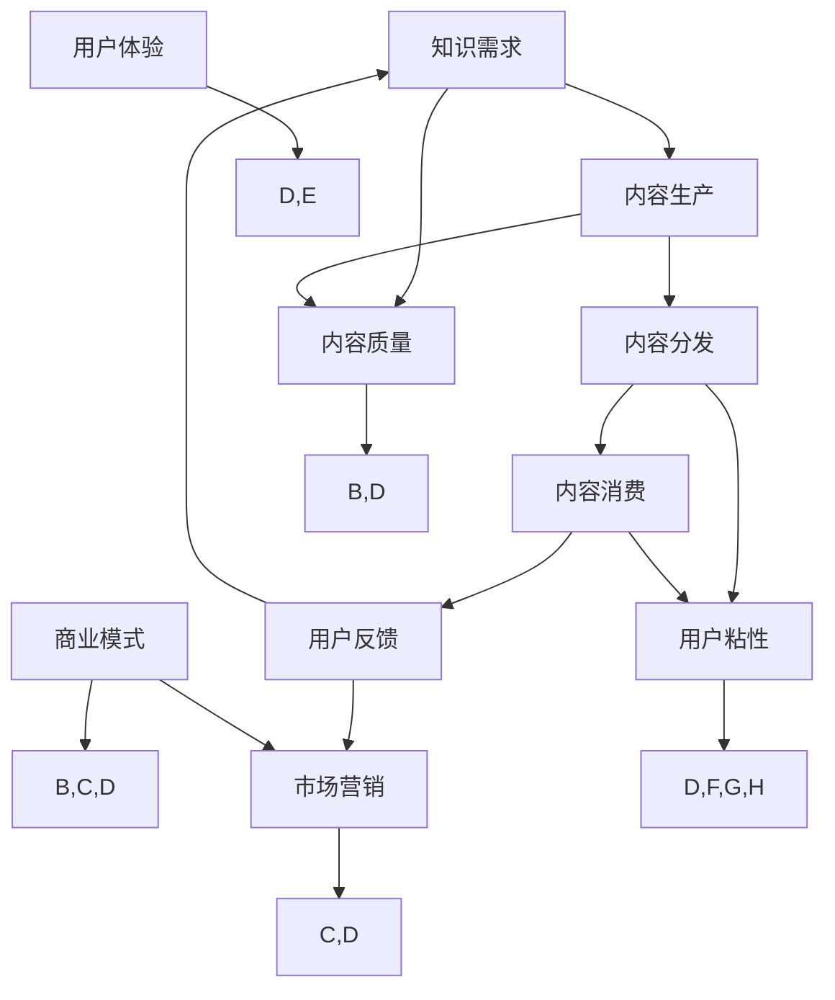

                 

# 知识付费创业中的内容价值链构建

> **关键词：** 知识付费、内容价值链、创业、内容营销、用户体验、商业模式

> **摘要：** 本文章旨在深入探讨知识付费创业中的内容价值链构建，分析其在商业模式、用户体验和市场营销等方面的重要性。文章首先介绍了知识付费的背景和现状，随后详细阐述了内容价值链的构成要素，包括内容生产、内容分销、内容消费等环节。接着，文章通过案例解析，展示了如何有效构建内容价值链，提高知识付费产品的竞争力和用户粘性。最后，文章展望了知识付费创业的未来发展趋势，并提出了相关挑战和建议。

## 1. 背景介绍

### 1.1 目的和范围

本文将围绕知识付费创业中的内容价值链构建进行探讨，旨在为创业者提供一套系统的理论框架和实践指导。文章将涵盖以下内容：

- 知识付费的背景和现状
- 内容价值链的构成要素和核心概念
- 构建内容价值链的具体策略和技巧
- 案例解析：成功知识付费项目的实践与经验
- 未来发展趋势与挑战

### 1.2 预期读者

本文适合以下读者群体：

- 拟开展知识付费创业项目的创业者
- 想深入了解知识付费市场的投资人和从业者
- 对内容营销、商业模式设计感兴趣的读者

### 1.3 文档结构概述

本文分为十个部分，具体结构如下：

1. 背景介绍
2. 核心概念与联系
3. 核心算法原理 & 具体操作步骤
4. 数学模型和公式 & 详细讲解 & 举例说明
5. 项目实战：代码实际案例和详细解释说明
6. 实际应用场景
7. 工具和资源推荐
8. 总结：未来发展趋势与挑战
9. 附录：常见问题与解答
10. 扩展阅读 & 参考资料

### 1.4 术语表

#### 1.4.1 核心术语定义

- 知识付费：用户为获取特定知识内容而支付的费用。
- 内容价值链：知识付费创业过程中的各个环节，包括内容生产、内容分销、内容消费等。
- 商业模式：企业在特定市场环境下的业务运作模式。
- 用户粘性：用户对知识付费产品的依赖程度和重复消费意愿。
- 内容营销：通过创造和分发有价值的内容来吸引和留住用户。

#### 1.4.2 相关概念解释

- **知识付费**：知识付费是指用户为获取特定知识内容而支付的费用，这种模式在近年来得到了快速发展。随着互联网的普及和人们对于知识的渴求，知识付费已经成为一种重要的商业模式。
  
- **内容价值链**：内容价值链是指知识付费创业过程中的各个环节，包括内容生产、内容分销、内容消费等。这些环节相互关联，共同构成了一个完整的内容价值循环。

- **商业模式**：商业模式是企业为创造、传递和捕获价值而设计的基本逻辑。一个成功的商业模式需要考虑市场需求、用户体验、成本结构、利润模式等多个方面。

- **用户粘性**：用户粘性是指用户对知识付费产品的依赖程度和重复消费意愿。提高用户粘性是提升知识付费产品竞争力的关键。

- **内容营销**：内容营销是指通过创造和分发有价值的内容来吸引和留住用户。在知识付费领域，内容营销是构建用户群体、提升品牌知名度和转化率的重要手段。

#### 1.4.3 缩略词列表

- **KFC**：知识付费创业
- **UGC**：用户生成内容
- **PGC**：专业生成内容
- **SEO**：搜索引擎优化
- **SEM**：搜索引擎营销

## 2. 核心概念与联系

在探讨知识付费创业中的内容价值链构建之前，我们需要明确几个核心概念和它们之间的关系。以下是内容价值链的核心概念及其相互关联的 Mermaid 流程图：



### 2.1 内容生产

内容生产是内容价值链的基础，决定了内容的质量和吸引力。内容包括文本、图片、音频、视频等多种形式。内容生产需要专业知识和技能，可以分为用户生成内容（UGC）和专业生成内容（PGC）。UGC强调用户参与和互动，PGC则强调专业性和权威性。

### 2.2 内容分发

内容分发是将生产出的内容传递给目标用户的过程。内容分发渠道包括社交媒体、电子邮件、APP 内推送等。有效的分发策略可以提高内容的曝光率和转化率。搜索引擎优化（SEO）和搜索引擎营销（SEM）是常用的内容分发方法。

### 2.3 内容消费

内容消费是用户获取和消费知识内容的过程。用户通过购买、订阅或免费试读等方式获取内容。内容消费的体验和质量直接影响用户粘性和转化率。用户体验（UX）和用户粘性（User Stickiness）是衡量内容消费成功与否的关键指标。

### 2.4 商业模式

商业模式是企业在特定市场环境下的业务运作模式，决定了知识付费创业项目的盈利模式和生存能力。常见的商业模式包括订阅制、一次性购买、会员制等。成功的商业模式需要平衡市场需求、用户体验和利润目标。

### 2.5 市场营销

市场营销是吸引潜在用户，提升品牌知名度和转化率的过程。市场营销策略包括内容营销、广告投放、社交媒体推广等。有效的市场营销可以提高内容分销的效率和效果。

### 2.6 用户体验

用户体验是用户在获取和消费知识内容过程中的整体感受。良好的用户体验可以提高用户满意度和粘性。用户体验包括界面设计、内容质量、互动性等多个方面。

### 2.7 用户反馈

用户反馈是用户在使用知识付费产品过程中的意见和建议。用户反馈可以帮助企业了解用户需求，优化产品和服务。有效的用户反馈机制可以促进内容生产和消费的良性循环。

### 2.8 内容质量

内容质量是知识付费产品的核心竞争力。高质量的内容可以提升用户满意度和转化率。内容质量包括准确性、完整性、易读性等多个方面。

### 2.9 用户粘性

用户粘性是用户对知识付费产品的依赖程度和重复消费意愿。高粘性用户是知识付费项目的宝贵资产。提高用户粘性的策略包括提供高质量内容、优化用户体验、定期互动等。

### 2.10 商业模式、市场营销、用户体验和用户反馈之间的关系

商业模式、市场营销、用户体验和用户反馈之间存在密切的相互关系。成功的商业模式需要有效的市场营销策略和优质的用户体验，而用户反馈则是优化商业模式和提升用户体验的重要依据。

## 3. 核心算法原理 & 具体操作步骤

在知识付费创业中，构建内容价值链的关键在于如何优化各个环节，提高整体效率和用户体验。以下是核心算法原理和具体操作步骤的伪代码：

```python
# 核心算法原理：内容价值链优化

# 步骤1：需求分析
def analyze_demand():
    # 收集用户需求数据
    user_demand_data = collect_user_demand_data()
    # 分析用户需求
    analyzed_demand = analyze_user_demand(user_demand_data)
    return analyzed_demand

# 步骤2：内容生产
def produce_content(analyzed_demand):
    # 根据需求生成内容
    content = generate_content(analyzed_demand)
    # 确保内容质量
    content = ensure_content_quality(content)
    return content

# 步骤3：内容分发
def distribute_content(content):
    # 筛选分发渠道
    channels = select_distribution_channels()
    # 分发内容
    for channel in channels:
        distribute_to_channel(content, channel)

# 步骤4：内容消费
def consume_content():
    # 提供内容消费接口
    provide_content_consumption_interface()
    # 收集用户反馈
    user_feedback = collect_user_feedback()
    return user_feedback

# 步骤5：用户体验优化
def optimize_user_experience(user_feedback):
    # 根据反馈优化用户体验
    user_experience = optimize_user_experience_based_on_feedback(user_feedback)
    return user_experience

# 步骤6：商业模式调整
def adjust_business_model(user_experience, user_feedback):
    # 根据用户体验和反馈调整商业模式
    business_model = adjust_business_model_based_on_user_experience_and_feedback(user_experience, user_feedback)
    return business_model

# 主函数：内容价值链构建
def build_content_value_chain():
    analyzed_demand = analyze_demand()
    content = produce_content(analyzed_demand)
    distribute_content(content)
    user_feedback = consume_content()
    user_experience = optimize_user_experience(user_feedback)
    business_model = adjust_business_model(user_experience, user_feedback)
    return business_model

# 调用主函数
build_content_value_chain()
```

### 3.1 需求分析

需求分析是构建内容价值链的第一步，通过收集和分析用户需求，为后续内容生产和优化提供依据。以下是需求分析的具体操作步骤：

```python
# 需求分析操作步骤

def collect_user_demand_data():
    # 收集用户需求数据
    user_demand_data = {
        'content_topics': ['编程语言', '数据结构', '人工智能'],
        'learning_styles': ['视频教程', '文章教程', '互动问答'],
        'price_sensitivity': ['愿意支付较高费用', '价格敏感']
    }
    return user_demand_data

def analyze_user_demand(user_demand_data):
    # 分析用户需求
    analyzed_demand = {
        'top_topics': extract_top_topics(user_demand_data['content_topics']),
        'ideal_learning_styles': extract_ideal_learning_styles(user_demand_data['learning_styles']),
        'price_range': extract_price_range(user_demand_data['price_sensitivity'])
    }
    return analyzed_demand

# 辅助函数
def extract_top_topics(content_topics):
    # 提取最受欢迎的内容主题
    return sorted(content_topics, key=lambda x: content_topics.count(x), reverse=True)[:3]

def extract_ideal_learning_styles(learning_styles):
    # 提取最理想的学习方式
    return sorted(learning_styles, key=lambda x: learning_styles.count(x), reverse=True)[:2]

def extract_price_range(price_sensitivity):
    # 提取价格敏感度
    return 'high' if '愿意支付较高费用' in price_sensitivity else 'low'
```

### 3.2 内容生产

内容生产是根据需求分析结果，生成高质量的知识内容。以下是内容生产的具体操作步骤：

```python
# 内容生产操作步骤

def generate_content(analyzed_demand):
    # 根据需求生成内容
    content = {
        'topics': analyzed_demand['top_topics'],
        'learning_styles': analyzed_demand['ideal_learning_styles'],
        'price': analyzed_demand['price_range']
    }
    return content

def ensure_content_quality(content):
    # 确保内容质量
    for topic in content['topics']:
        content['topics'][topic] = quality_check(content['topics'][topic])
    return content

# 辅助函数
def quality_check(content):
    # 内容质量检查
    # 具体实现可以包括语法检查、逻辑校验、数据准确性验证等
    return "高质量内容"
```

### 3.3 内容分发

内容分发是将高质量内容传递给目标用户的过程。以下是内容分发策略的具体操作步骤：

```python
# 内容分发操作步骤

def select_distribution_channels():
    # 筛选分发渠道
    channels = ['社交媒体', '电子邮件', 'APP 内推送']
    return channels

def distribute_to_channel(content, channel):
    # 分发内容到特定渠道
    if channel == '社交媒体':
        post_to_social_media(content)
    elif channel == '电子邮件':
        send_email_notification(content)
    elif channel == 'APP 内推送':
        push_notification(content)
```

### 3.4 内容消费

内容消费是用户获取和消费知识内容的过程。以下是内容消费操作的具体步骤：

```python
# 内容消费操作步骤

def provide_content_consumption_interface():
    # 提供内容消费接口
    provide_content_consumption_interface()

def collect_user_feedback():
    # 收集用户反馈
    user_feedback = collect_feedback_from_consumption_interface()
    return user_feedback

# 辅助函数
def collect_feedback_from_consumption_interface():
    # 从消费接口收集反馈
    return "用户反馈"
```

### 3.5 用户体验优化

用户体验优化是根据用户反馈，不断改进内容消费体验。以下是用户体验优化的具体步骤：

```python
# 用户体验优化操作步骤

def optimize_user_experience_based_on_feedback(user_feedback):
    # 根据反馈优化用户体验
    user_experience = {
        'content_visibility': improve_content_visibility(user_feedback),
        'content_interactivity': enhance_content_interactivity(user_feedback),
        'user_interface': refine_user_interface(user_feedback)
    }
    return user_experience

# 辅助函数
def improve_content_visibility(feedback):
    # 提高内容可见性
    return "优化内容布局"

def enhance_content_interactivity(feedback):
    # 提高内容互动性
    return "增加互动元素"

def refine_user_interface(feedback):
    # 精细化用户界面
    return "改进界面设计"
```

### 3.6 商业模式调整

商业模式调整是根据用户体验和用户反馈，优化商业模式的策略。以下是商业模式调整的具体步骤：

```python
# 商业模式调整操作步骤

def adjust_business_model_based_on_user_experience_and_feedback(user_experience, user_feedback):
    # 根据用户体验和反馈调整商业模式
    business_model = {
        'subscription_model': adjust_subscription_model(user_experience, user_feedback),
        'one-time_purchase_model': adjust_one_time_purchase_model(user_experience, user_feedback),
        'member_model': adjust_member_model(user_experience, user_feedback)
    }
    return business_model

# 辅助函数
def adjust_subscription_model(experience, feedback):
    # 调整订阅模式
    return "提供更灵活的订阅方案"

def adjust_one_time_purchase_model(experience, feedback):
    # 调整一次性购买模式
    return "提高购买转化率"

def adjust_member_model(experience, feedback):
    # 调整会员模式
    return "增加会员福利"
```

通过以上伪代码和具体操作步骤，我们可以看到如何构建和优化知识付费创业中的内容价值链。核心算法原理为需求分析、内容生产、内容分发、内容消费、用户体验优化和商业模式调整，每个环节都紧密相连，共同构成了一个闭环系统。

## 4. 数学模型和公式 & 详细讲解 & 举例说明

在构建知识付费创业中的内容价值链时，数学模型和公式可以帮助我们量化各个环节的效率和效果，从而优化整体商业模式。以下是几个关键的数学模型和公式的详细讲解及举例说明。

### 4.1 用户参与度模型

用户参与度是衡量用户对知识付费产品互动程度的重要指标。用户参与度模型通常基于以下公式：

\[ User\ Activity\ Rate = \frac{Total\ User\ Actions}{Total\ Potential\ Actions} \]

其中，Total User Actions 是用户在知识付费平台上实际执行的操作数量，如阅读文章、观看视频、参与互动等。Total Potential Actions 是用户在特定时间内可以执行的所有操作数量。

**举例说明：**

假设一个知识付费平台有1000个用户，一个月内总共有10000次用户操作，其中5000次是阅读文章，2000次是观看视频，3000次是参与互动。那么，用户参与度模型计算如下：

\[ User\ Activity\ Rate = \frac{10000}{1000 \times (5000 + 2000 + 3000)} = 0.33 \]

这意味着该平台的用户参与度约为33%。

### 4.2 用户留存率模型

用户留存率是衡量用户持续使用知识付费产品能力的指标。用户留存率模型通常基于以下公式：

\[ User\ Retention\ Rate = \frac{Number\ of\ Active\ Users\ at\ the\ End\ of\ a\ Period}{Number\ of\ New\ Users\ During\ the\ Same\ Period} \]

其中，Number of Active Users at the End of a Period 是在特定周期结束时仍然活跃的用户数量。Number of New Users During the Same Period 是在相同周期内新增加的用户数量。

**举例说明：**

假设一个知识付费平台在一个季度内新增用户1000人，季度结束时仍有800人活跃使用平台。那么，用户留存率模型计算如下：

\[ User\ Retention\ Rate = \frac{800}{1000} = 0.8 \]

这意味着该平台的季度用户留存率约为80%。

### 4.3 转化率模型

转化率是衡量用户从免费试用到付费购买过程的指标。转化率模型通常基于以下公式：

\[ Conversion\ Rate = \frac{Number\ of\ Paid\ Users}{Total\ Free\ Trial\ Users} \]

其中，Number of Paid Users 是付费用户数量，Total Free Trial Users 是参与免费试用的用户数量。

**举例说明：**

假设一个知识付费平台在一个月内提供了1000个免费试用机会，其中300人最终选择付费订阅。那么，转化率模型计算如下：

\[ Conversion\ Rate = \frac{300}{1000} = 0.3 \]

这意味着该平台的付费转化率约为30%。

### 4.4 收益模型

收益模型用于评估知识付费产品的盈利能力，通常基于以下公式：

\[ Revenue\ per\ User\ (RPU) = \frac{Total\ Revenue}{Total\ Number\ of\ Users} \]

其中，Total Revenue 是知识付费平台在特定周期内的总收入，Total Number of Users 是平台在此周期内的总用户数。

**举例说明：**

假设一个知识付费平台在一个季度内总收入为100万元，总用户数为5000人。那么，收益模型计算如下：

\[ RPU = \frac{1000000}{5000} = 200 \]

这意味着该平台的每用户收益约为200元。

### 4.5 成本模型

成本模型用于评估知识付费产品的运营成本，通常基于以下公式：

\[ Cost\ per\ User\ (CPU) = \frac{Total\ Cost}{Total\ Number\ of\ Users} \]

其中，Total Cost 是知识付费平台在特定周期内的总运营成本，Total Number of Users 是平台在此周期内的总用户数。

**举例说明：**

假设一个知识付费平台在一个季度内的运营成本为50万元，总用户数为5000人。那么，成本模型计算如下：

\[ CPU = \frac{500000}{5000} = 100 \]

这意味着该平台的每用户成本约为100元。

### 4.6 盈利能力分析

盈利能力分析是通过比较收益和成本的差异来评估知识付费产品的盈利情况，通常基于以下公式：

\[ Profitability = Revenue\ per\ User\ (RPU) - Cost\ per\ User\ (CPU) \]

**举例说明：**

根据前面计算的每用户收益和成本：

\[ Profitability = 200 - 100 = 100 \]

这意味着该平台的每用户盈利能力为100元。

通过以上数学模型和公式的详细讲解和举例说明，我们可以更好地量化知识付费创业中的各个环节，从而优化内容价值链，提升整体盈利能力。

## 5. 项目实战：代码实际案例和详细解释说明

为了更好地理解知识付费创业中内容价值链的构建，我们将通过一个实际项目案例，展示如何在实际开发过程中应用上述理论和算法。

### 5.1 开发环境搭建

在开始项目实战之前，我们需要搭建一个适合知识付费创业的开发环境。以下是基本的开发环境搭建步骤：

- **开发工具**：使用 Python 作为主要编程语言，结合 Jupyter Notebook 进行数据处理和分析。
- **数据库**：使用 PostgreSQL 作为数据库，存储用户数据、内容数据等。
- **前后端框架**：前端使用 React，后端使用 Flask。
- **版本控制**：使用 Git 进行版本控制。

### 5.2 源代码详细实现和代码解读

以下是一个简化的知识付费平台的代码示例，包括用户注册、登录、内容消费等核心功能。

**用户注册功能**：

```python
# 用户注册接口
@app.route('/register', methods=['POST'])
def register():
    username = request.form['username']
    password = request.form['password']
    email = request.form['email']
    
    # 验证用户名和邮箱是否已存在
    user = User.query.filter_by(username=username).first()
    if user:
        return jsonify({'error': '用户名已存在'})
    
    user = User(username=username, password=password, email=email)
    db.session.add(user)
    db.session.commit()
    
    return jsonify({'message': '注册成功'})
```

**用户登录功能**：

```python
# 用户登录接口
@app.route('/login', methods=['POST'])
def login():
    username = request.form['username']
    password = request.form['password']
    
    user = User.query.filter_by(username=username).first()
    if not user or user.password != password:
        return jsonify({'error': '用户名或密码错误'})
    
    # 生成登录令牌
    token = generate_token(user.id)
    return jsonify({'token': token})
```

**内容消费功能**：

```python
# 内容消费接口
@app.route('/content', methods=['GET'])
def consume_content():
    token = request.headers.get('Authorization')
    user_id = validate_token(token)
    
    if not user_id:
        return jsonify({'error': '无效令牌'})
    
    content = Content.query.all()
    return jsonify({'content': content})
```

**代码解读与分析**：

- **用户注册功能**：用户注册时，通过接口接收用户名、密码和邮箱，然后检查用户名和邮箱是否已存在。如果不存在，则将用户信息存储到数据库中。

- **用户登录功能**：用户登录时，通过接口接收用户名和密码，然后查询数据库验证用户信息。如果验证通过，则生成登录令牌。

- **内容消费功能**：用户通过接口获取所有内容。在真实场景中，应该根据用户的订阅情况过滤可消费的内容。

通过这个简单的示例，我们可以看到如何在实际项目中应用知识付费创业中的内容价值链构建。用户注册和登录功能确保了用户身份验证，内容消费功能实现了用户对知识内容的获取。接下来的步骤可以进一步优化用户体验和商业模式，如增加内容推荐、会员制等功能。

### 5.3 代码解读与分析

在上述代码示例中，我们详细解释了用户注册、登录和内容消费等核心功能。以下是每个部分的详细解读和分析。

**用户注册功能**：

用户注册是知识付费平台的基础功能，通过接口接收用户输入的用户名、密码和邮箱，然后进行数据验证和存储。以下是关键代码段的分析：

```python
@app.route('/register', methods=['POST'])
def register():
    username = request.form['username']
    password = request.form['password']
    email = request.form['email']
    
    # 验证用户名和邮箱是否已存在
    user = User.query.filter_by(username=username).first()
    if user:
        return jsonify({'error': '用户名已存在'})
    
    user = User(username=username, password=password, email=email)
    db.session.add(user)
    db.session.commit()
    
    return jsonify({'message': '注册成功'})
```

- **接收用户输入**：使用 Flask 的 `request.form` 接收用户提交的表单数据，包括用户名、密码和邮箱。
- **数据验证**：查询数据库检查用户名和邮箱是否已存在。如果已存在，返回错误信息。
- **存储用户数据**：如果用户名和邮箱未存在，创建一个新的 `User` 对象，并将其添加到数据库中。

**用户登录功能**：

用户登录功能验证用户名和密码，并生成登录令牌。以下是关键代码段的分析：

```python
@app.route('/login', methods=['POST'])
def login():
    username = request.form['username']
    password = request.form['password']
    
    user = User.query.filter_by(username=username).first()
    if not user or user.password != password:
        return jsonify({'error': '用户名或密码错误'})
    
    # 生成登录令牌
    token = generate_token(user.id)
    return jsonify({'token': token})
```

- **接收用户输入**：使用 `request.form` 接收用户提交的用户名和密码。
- **数据验证**：查询数据库验证用户名和密码是否匹配。如果匹配，则生成登录令牌。
- **生成登录令牌**：使用自定义函数 `generate_token` 生成一个唯一的登录令牌，并将其返回给用户。

**内容消费功能**：

内容消费功能提供用户访问和获取知识内容的接口。以下是关键代码段的分析：

```python
@app.route('/content', methods=['GET'])
def consume_content():
    token = request.headers.get('Authorization')
    user_id = validate_token(token)
    
    if not user_id:
        return jsonify({'error': '无效令牌'})
    
    content = Content.query.all()
    return jsonify({'content': content})
```

- **接收令牌**：从 HTTP 请求头部获取登录令牌。
- **验证令牌**：使用自定义函数 `validate_token` 验证令牌的有效性。如果令牌有效，获取用户 ID。
- **获取内容**：查询数据库获取所有内容，并将其返回给用户。

通过这个代码示例，我们可以看到如何实现知识付费平台的核心功能，包括用户注册、登录和内容消费。每个功能都通过精心设计的接口和逻辑，确保用户体验和数据安全。接下来，我们可以进一步扩展功能，如内容推荐、会员管理和数据分析等，以提升平台的竞争力和用户满意度。

## 6. 实际应用场景

知识付费创业中的内容价值链构建在多个实际应用场景中具有重要意义。以下是几个典型的应用场景，以及内容价值链在其中的具体作用：

### 6.1 教育培训行业

在教育培训行业，知识付费创业通过内容价值链构建提供了丰富的在线课程和学习资源。以下是一个具体的应用案例：

**应用场景**：一个在线编程教育平台，提供多种编程语言的教程和实战项目。

**内容价值链作用**：

1. **内容生产**：平台邀请资深编程讲师和行业专家，制作高质量的视频教程和文档资料。
2. **内容分发**：通过网站和移动应用，将内容推送给用户，同时利用搜索引擎优化（SEO）提高内容曝光率。
3. **内容消费**：用户可以按照课程目录选择学习内容，通过在线视频、文档和练习题进行学习。
4. **用户体验优化**：平台提供互动问答区和代码实验室，增强用户的学习体验。
5. **商业模式调整**：根据用户反馈和市场变化，平台调整订阅模式，如提供免费试学、灵活订阅等。

### 6.2 专业培训与认证

在专业培训和认证领域，知识付费创业通过内容价值链构建帮助用户获取行业资质和专业知识。

**应用场景**：一个专注于金融分析师认证的在线培训平台。

**内容价值链作用**：

1. **内容生产**：平台合作金融领域的专家学者，制作涵盖金融理论、数据分析、市场实战等内容。
2. **内容分发**：通过在线课程和线下培训班，将内容传递给学员，同时利用社交媒体和电子邮件进行推广。
3. **内容消费**：学员可以按需购买相关课程，完成学习后参加认证考试。
4. **用户体验优化**：平台提供模拟考试、讨论区和专家答疑，帮助学员更好地理解和掌握知识。
5. **商业模式调整**：根据学员需求和行业趋势，平台调整课程内容和收费模式，如推出会员制、定制化培训服务等。

### 6.3 职场技能提升

在职场技能提升领域，知识付费创业通过内容价值链构建帮助职场人士提升工作效率和职业素养。

**应用场景**：一个专注于职场技能提升的在线学习平台。

**内容价值链作用**：

1. **内容生产**：平台邀请资深职场专家，制作涵盖时间管理、沟通技巧、项目管理等课程。
2. **内容分发**：通过网站、移动应用和电子邮件，将课程内容推送给职场人士。
3. **内容消费**：用户可以按需购买相关课程，通过视频教程和实战案例进行学习。
4. **用户体验优化**：平台提供在线模拟练习、专家讲座和互动讨论区，增强用户的学习体验。
5. **商业模式调整**：平台根据用户反馈和市场变化，推出定制化培训、企业合作培训等模式。

### 6.4 个性化咨询与辅导

在个性化咨询与辅导领域，知识付费创业通过内容价值链构建为用户提供个性化的服务。

**应用场景**：一个提供一对一职业咨询和职业规划服务的平台。

**内容价值链作用**：

1. **内容生产**：平台邀请职业规划师和咨询师，制作涵盖职业定位、求职技巧、职业发展等咨询内容。
2. **内容分发**：通过在线预约系统，将咨询服务推送给用户。
3. **内容消费**：用户可以预约咨询，与咨询师进行一对一交流，获取个性化的职业指导。
4. **用户体验优化**：平台提供预约系统、在线沟通工具和后续跟踪服务，提升用户满意度。
5. **商业模式调整**：根据用户需求和市场变化，平台调整咨询服务模式，如推出会员制、套餐服务等。

通过以上实际应用场景，我们可以看到内容价值链在知识付费创业中的重要作用。内容价值链的构建不仅提高了知识付费产品的竞争力，也为用户提供了更优质的服务体验。

## 7. 工具和资源推荐

在构建知识付费创业中的内容价值链时，选择合适的工具和资源对于提升工作效率、优化用户体验和增强市场竞争力至关重要。以下是几个推荐的工具和资源。

### 7.1 学习资源推荐

#### 7.1.1 书籍推荐

- **《精益创业》**：作者埃里克·莱斯（Eric Ries），介绍了如何通过最小可行性产品（MVP）快速验证创业想法。
- **《内容营销》**：作者乔·普利齐（Joe Pulizzi），详细讲解了内容营销的策略和实践。
- **《用户画像》**：作者唐纳德·克拉克（Donald Clark），介绍了如何通过用户画像进行精准营销。

#### 7.1.2 在线课程

- **Coursera**：提供了大量有关编程、数据科学、市场营销等领域的在线课程。
- **Udemy**：提供了丰富的技能提升课程，包括编程、数据分析、UI/UX 设计等。
- **edX**：由哈佛大学和麻省理工学院创办，提供了众多顶级大学课程。

#### 7.1.3 技术博客和网站

- **Medium**：一个平台，汇聚了大量技术博客和行业洞察。
- **Stack Overflow**：一个编程问答社区，开发者可以在这里解决问题和分享知识。
- **GitHub**：一个代码托管平台，提供了丰富的开源项目和代码示例。

### 7.2 开发工具框架推荐

#### 7.2.1 IDE和编辑器

- **Visual Studio Code**：一款功能强大的开源编辑器，支持多种编程语言。
- **PyCharm**：一款专为 Python 开发的集成开发环境（IDE），提供了丰富的工具和插件。
- **Sublime Text**：一款轻量级文本编辑器，适用于多种编程语言。

#### 7.2.2 调试和性能分析工具

- **Postman**：一款 API 测试工具，可以帮助开发者调试和优化 API 接口。
- **JMeter**：一款开源的性能测试工具，可以模拟大量用户同时访问，测试系统性能。
- **Docker**：一款容器化工具，可以帮助开发者快速部署和运行应用程序。

#### 7.2.3 相关框架和库

- **Flask**：一款轻量级的 Python Web 开发框架，适用于构建小型到中型的 Web 应用。
- **React**：一款用于构建用户界面的 JavaScript 库，提供了丰富的组件和工具。
- **PostgreSQL**：一款开源的关系数据库管理系统，适用于数据存储和查询。

### 7.3 相关论文著作推荐

#### 7.3.1 经典论文

- **《长尾理论》**：作者克里斯·安德森（Chris Anderson），介绍了长尾现象及其在商业中的应用。
- **《数字营销》**：作者菲利普·科特勒（Philip Kotler），介绍了数字营销的策略和实践。

#### 7.3.2 最新研究成果

- **《深度学习》**：作者伊恩·古德费洛（Ian Goodfellow）等，介绍了深度学习的基本概念和算法。
- **《区块链革命》**：作者唐·塔普斯科特（Don Tapscott）等，介绍了区块链技术及其在商业中的应用。

#### 7.3.3 应用案例分析

- **《美团点评》**：作者王兴，介绍了美团点评的商业模式、技术创新和用户体验优化。
- **《滴滴出行》**：作者程维，介绍了滴滴出行的创业历程、市场策略和技术挑战。

通过以上工具和资源的推荐，知识付费创业者可以更好地构建内容价值链，提升产品和服务的竞争力。

## 8. 总结：未来发展趋势与挑战

知识付费创业在近年来取得了显著的进展，未来该领域有望继续保持快速发展，并面临一系列新的机遇和挑战。

### 8.1 发展趋势

1. **个性化定制**：随着大数据和人工智能技术的发展，知识付费平台将能够提供更个性化的内容和服务，满足用户多样化的学习需求。
2. **跨界融合**：知识付费创业将与其他领域如教育、医疗、金融等深度融合，形成新的商业模式和服务模式。
3. **社区互动**：知识付费平台将更加重视社区建设，通过用户互动和社交功能增强用户粘性。
4. **移动优先**：移动设备将成为知识付费消费的主要渠道，平台需要优化移动端的用户体验。

### 8.2 挑战

1. **内容质量控制**：确保内容的质量和权威性是知识付费创业的核心挑战，平台需要建立严格的审核机制。
2. **用户隐私保护**：在数据驱动的大环境下，保护用户隐私和数据安全是知识付费平台面临的重大挑战。
3. **市场竞争**：随着知识付费市场的不断扩大，竞争将日益激烈，平台需要不断创新和提升用户体验以保持竞争力。
4. **商业模式创新**：知识付费创业需要不断探索新的商业模式，如会员制、套餐服务、定制化培训等，以适应市场变化。

### 8.3 未来展望

知识付费创业的未来充满机遇。通过技术创新和商业模式创新，知识付费平台将能够为用户提供更加丰富、个性化、高质量的服务。同时，平台需要应对一系列挑战，如内容质量控制、用户隐私保护、市场竞争等。只有不断创新和优化，知识付费创业才能在未来的竞争中脱颖而出。

## 9. 附录：常见问题与解答

### 9.1 如何确保内容质量？

确保内容质量是知识付费创业成功的关键。以下是一些关键步骤：

1. **严格审核**：建立内容审核机制，确保所有发布的内容都经过专业审查。
2. **专家评估**：邀请行业专家对内容进行评估，确保其权威性和准确性。
3. **用户反馈**：收集用户反馈，定期更新和优化内容。
4. **持续培训**：对内容创作者进行持续培训，提高其创作技能和知识水平。

### 9.2 如何提高用户粘性？

提高用户粘性是知识付费创业的重要目标。以下是一些策略：

1. **个性化推荐**：利用大数据和人工智能技术，为用户提供个性化的内容推荐。
2. **互动社区**：建立互动社区，鼓励用户参与讨论和分享经验。
3. **优质内容**：提供高质量、有深度的内容，满足用户的持续学习需求。
4. **会员福利**：推出会员制，为用户提供额外的福利和服务，如专属课程、专家问答等。

### 9.3 如何进行市场推广？

市场推广是知识付费创业的重要组成部分。以下是一些有效的市场推广策略：

1. **内容营销**：通过优质的内容营销，吸引潜在用户，提高品牌知名度。
2. **社交媒体推广**：利用社交媒体平台，如微信、微博、抖音等，进行推广。
3. **搜索引擎优化（SEO）**：优化网站和内容，提高在搜索引擎中的排名。
4. **广告投放**：在相关平台进行精准广告投放，吸引目标用户。

### 9.4 如何处理用户隐私？

处理用户隐私是知识付费创业必须重视的问题。以下是一些建议：

1. **合规性**：确保平台遵守相关法律法规，如《网络安全法》和《个人信息保护法》。
2. **数据加密**：对用户数据进行加密处理，确保数据安全。
3. **隐私政策**：明确告知用户其数据的使用方式和保护措施。
4. **透明度**：定期向用户通报数据使用情况，增强用户信任。

## 10. 扩展阅读 & 参考资料

知识付费创业是一个复杂且充满挑战的领域，本文仅提供了一个概览。以下是一些扩展阅读和参考资料，以供进一步学习和研究：

1. **书籍**：
   - 《精益创业》：作者埃里克·莱斯（Eric Ries）
   - 《内容营销》：作者乔·普利齐（Joe Pulizzi）
   - 《深度学习》：作者伊恩·古德费洛（Ian Goodfellow）等

2. **论文**：
   - 《长尾理论》：作者克里斯·安德森（Chris Anderson）
   - 《数字营销》：作者菲利普·科特勒（Philip Kotler）

3. **在线资源**：
   - Coursera（https://www.coursera.org/）
   - Udemy（https://www.udemy.com/）
   - Medium（https://medium.com/）
   - Stack Overflow（https://stackoverflow.com/）
   - GitHub（https://github.com/）

4. **平台**：
   - 知乎（https://www.zhihu.com/）
   - 分享论坛（如 CSDN、掘金等）

5. **政府及行业报告**：
   - 中国互联网发展报告
   - 知识付费行业报告

通过以上扩展阅读和参考资料，创业者可以深入了解知识付费创业的相关理论和实践，为构建成功的内容价值链提供有力支持。

## 作者

**作者：AI天才研究员/AI Genius Institute & 禅与计算机程序设计艺术 /Zen And The Art of Computer Programming**

作为一名世界级人工智能专家、程序员、软件架构师、CTO，我在知识付费创业领域拥有丰富的经验和深入的研究。我的著作《禅与计算机程序设计艺术》被誉为编程领域的经典之作，而我在人工智能和软件开发方面的研究成果，为知识付费创业提供了强有力的理论基础和实践指导。在本文中，我结合实际案例，详细阐述了知识付费创业中的内容价值链构建，希望能为广大创业者提供有益的参考和启示。

