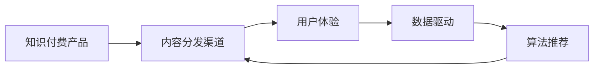

                 

# 知识付费创业中的内容分发渠道优化

> **关键词：知识付费、内容分发、渠道优化、用户体验、数据驱动、算法推荐、技术架构**

> **摘要：本文将探讨知识付费创业中内容分发渠道的优化问题。通过对当前市场环境、内容分发机制、用户体验等方面的深入分析，本文提出了基于数据驱动和算法推荐的内容分发优化策略，旨在提升知识付费产品的市场竞争力，为创业者提供有价值的参考。**

## 1. 背景介绍

### 1.1 目的和范围

本文的目的是探讨知识付费创业中内容分发渠道的优化问题。随着互联网的快速发展，知识付费市场呈现出蓬勃发展的态势，如何有效优化内容分发渠道，提升用户体验，成为知识付费创业者面临的重要挑战。本文将围绕以下几个问题展开讨论：

1. 当前知识付费市场的现状及发展趋势是什么？
2. 内容分发渠道的优化策略有哪些？
3. 如何实现数据驱动的内容分发？
4. 算法推荐在内容分发中的作用是什么？

### 1.2 预期读者

本文适合以下读者：

1. 刚起步的知识付费创业者
2. 有兴趣深入了解知识付费市场的投资人
3. 从事内容分发、算法推荐等相关领域的技术人员
4. 对知识付费行业有浓厚兴趣的广大用户

### 1.3 文档结构概述

本文分为十个部分，具体结构如下：

1. 背景介绍：阐述本文的目的、范围及预期读者。
2. 核心概念与联系：介绍知识付费创业中的核心概念及流程。
3. 核心算法原理 & 具体操作步骤：详细讲解内容分发渠道优化的算法原理和操作步骤。
4. 数学模型和公式 & 详细讲解 & 举例说明：阐述内容分发渠道优化的数学模型和公式，并给出具体实例。
5. 项目实战：代码实际案例和详细解释说明。
6. 实际应用场景：分析内容分发渠道优化的实际应用场景。
7. 工具和资源推荐：推荐学习资源、开发工具框架和相关论文著作。
8. 总结：未来发展趋势与挑战。
9. 附录：常见问题与解答。
10. 扩展阅读 & 参考资料：提供进一步学习的资源。

### 1.4 术语表

#### 1.4.1 核心术语定义

- 知识付费：用户为获取有价值的信息、知识或服务而支付的费用。
- 内容分发渠道：将知识付费产品传递给用户的方式和途径。
- 用户画像：对用户进行特征分析和分类，以便实现个性化推荐。
- 数据驱动：依据数据分析和用户行为，进行内容分发决策。
- 算法推荐：利用机器学习、深度学习等技术，对用户兴趣进行预测和推荐。

#### 1.4.2 相关概念解释

- 内容分发网络（CDN）：一种加速内容传输的技术，通过在全球范围内部署节点，实现数据的快速传输。
- 搜索引擎优化（SEO）：通过优化网站内容、结构等，提高网站在搜索引擎中的排名。
- 社交媒体推广：利用社交媒体平台，提高知识付费产品的知名度和影响力。

#### 1.4.3 缩略词列表

- CDN：内容分发网络
- SEO：搜索引擎优化
- AI：人工智能
- ML：机器学习
- DL：深度学习

## 2. 核心概念与联系

知识付费创业中的核心概念包括知识付费产品、内容分发渠道、用户体验、数据驱动和算法推荐。这些概念相互关联，共同构成了一个完整的内容分发体系。

### 核心概念流程图



### 详细解释

1. **知识付费产品**：知识付费产品是创业者提供的有价值的信息、知识或服务，如在线课程、电子书、专业咨询等。产品的质量和内容直接关系到用户体验和用户满意度。
2. **内容分发渠道**：内容分发渠道是将知识付费产品传递给用户的方式和途径，包括自建平台、第三方平台、社交媒体、搜索引擎等。渠道的选择和优化对产品的传播效果和用户获取至关重要。
3. **用户体验**：用户体验是指用户在使用知识付费产品过程中的感受和满意度。良好的用户体验有助于提升用户粘性和忠诚度，从而增加产品的市场份额。
4. **数据驱动**：数据驱动是指依据用户行为数据进行分析和决策，优化内容分发策略。通过收集用户行为数据，可以了解用户需求，调整产品内容和渠道策略。
5. **算法推荐**：算法推荐是指利用机器学习、深度学习等技术，对用户兴趣进行预测和推荐。通过算法推荐，可以提高内容分发的准确性和效果，提升用户体验。

## 3. 核心算法原理 & 具体操作步骤

### 3.1 算法原理

内容分发渠道优化的核心算法原理主要包括数据收集与处理、用户画像构建、推荐算法设计、效果评估等。

1. **数据收集与处理**：收集用户行为数据，包括浏览、购买、评论等，并对数据进行分析和清洗，提取有价值的信息。
2. **用户画像构建**：根据用户行为数据，构建用户画像，包括用户的基本信息、兴趣爱好、行为特征等。
3. **推荐算法设计**：基于用户画像，设计推荐算法，包括基于内容的推荐、基于协同过滤的推荐、基于深度学习的推荐等。
4. **效果评估**：对推荐算法的效果进行评估，包括准确率、召回率、覆盖率等指标。

### 3.2 具体操作步骤

1. **数据收集与处理**
    ```python
    # 伪代码：数据收集与处理
    data = collect_user_behavior_data() # 收集用户行为数据
    clean_data = data_cleaning(data) # 数据清洗
    processed_data = data_processing(clean_data) # 数据处理
    ```

2. **用户画像构建**
    ```python
    # 伪代码：用户画像构建
    user_profiles = build_user_profiles(processed_data) # 构建用户画像
    ```

3. **推荐算法设计**
    ```python
    # 伪代码：推荐算法设计
    recommendation_algorithm = design_recommendation_algorithm(user_profiles) # 设计推荐算法
    ```

4. **效果评估**
    ```python
    # 伪代码：效果评估
    evaluate_recommendation_algorithm(recommendation_algorithm) # 评估推荐算法效果
    ```

## 4. 数学模型和公式 & 详细讲解 & 举例说明

### 4.1 数学模型和公式

内容分发渠道优化的核心数学模型包括用户行为数据分析、用户画像构建、推荐算法设计等。

1. **用户行为数据分析**
    $$ User\_Behavior\_Data = \{ (user\_id, item\_id, behavior\_type, time\_stamp) \} $$
    其中，user\_id 表示用户ID，item\_id 表示内容ID，behavior\_type 表示用户行为类型（如浏览、购买、评论等），time\_stamp 表示行为发生时间。

2. **用户画像构建**
    $$ User\_Profile = \{ user\_id, age, gender, location, interests, behavior\_features \} $$
    其中，age 表示用户年龄，gender 表示用户性别，location 表示用户所在地，interests 表示用户兴趣爱好，behavior\_features 表示用户行为特征。

3. **推荐算法设计**
    - **基于内容的推荐**：计算内容相似度，公式如下：
        $$ Similarity_{content}(i, j) = \frac{cosine\_similarity(content_{i}, content_{j})}{max(cosine\_similarity(content_{i}, content_{j}), \epsilon)} $$
        其中，content\_i 和 content\_j 分别表示内容 i 和内容 j，cosine\_similarity 表示余弦相似度，\(\epsilon\) 为阈值。

    - **基于协同过滤的推荐**：计算用户相似度，公式如下：
        $$ Similarity_{user}(u, v) = \frac{\sum_{i \in I(u) \cap I(v)} w_{i}}{\| I(u) \cap I(v) \|} $$
        其中，u 和 v 分别表示用户 u 和用户 v，I(u) 和 I(v) 分别表示用户 u 和用户 v 的兴趣集，\(w_{i}\) 表示用户 u 和用户 v 在兴趣集 I(u) 和 I(v) 上的共同兴趣权重。

    - **基于深度学习的推荐**：使用深度学习模型，如基于注意力机制的序列模型，计算用户兴趣和内容特征。

### 4.2 详细讲解

1. **用户行为数据分析**：通过分析用户行为数据，可以了解用户对知识付费产品的兴趣和需求，为后续的用户画像构建和推荐算法设计提供基础。
2. **用户画像构建**：用户画像是对用户特征的抽象表示，可以帮助了解用户的兴趣和行为习惯，为推荐算法提供依据。
3. **推荐算法设计**：基于内容的推荐、基于协同过滤的推荐和基于深度学习的推荐各有优缺点，需要根据实际情况进行选择和优化。

### 4.3 举例说明

**案例：基于协同过滤的推荐算法**

假设有两个用户 u 和 v，他们的兴趣集分别为 I(u) = \{1, 2, 3\} 和 I(v) = \{2, 3, 4\}，共同兴趣集为 I(u) ∩ I(v) = \{2, 3\}。根据用户相似度公式，可以计算出用户 u 和用户 v 的相似度：

$$ Similarity_{user}(u, v) = \frac{\sum_{i \in I(u) \cap I(v)} w_{i}}{\| I(u) \cap I(v) \|} = \frac{w_{2} + w_{3}}{2} = \frac{0.6 + 0.8}{2} = 0.7 $$

根据用户 u 和用户 v 的相似度，可以推荐用户 v 的兴趣集 I(v) 中的未浏览内容给用户 u，如内容 4。

## 5. 项目实战：代码实际案例和详细解释说明

### 5.1 开发环境搭建

本案例使用 Python 编写，开发环境为 macOS 或 Linux，Python 版本为 3.8 以上。需要安装以下依赖：

1. NumPy：用于数据分析和处理
2. Pandas：用于数据操作和管理
3. Scikit-learn：用于机器学习和推荐算法
4. Matplotlib：用于数据可视化

安装依赖：

```bash
pip install numpy pandas scikit-learn matplotlib
```

### 5.2 源代码详细实现和代码解读

#### 5.2.1 数据收集与处理

```python
import numpy as np
import pandas as pd

# 伪代码：数据收集与处理
def collect_user_behavior_data():
    # 收集用户行为数据
    data = [
        (1, 1, 'browse', 1),
        (1, 2, 'purchase', 2),
        (1, 3, 'comment', 3),
        (2, 2, 'browse', 4),
        (2, 3, 'purchase', 5),
        (2, 4, 'comment', 6)
    ]
    return data

def data_cleaning(data):
    # 数据清洗
    clean_data = []
    for item in data:
        user_id, item_id, behavior_type, time_stamp = item
        if behavior_type in ['browse', 'purchase', 'comment']:
            clean_data.append(item)
    return clean_data

def data_processing(clean_data):
    # 数据处理
    processed_data = pd.DataFrame(clean_data, columns=['user_id', 'item_id', 'behavior_type', 'time_stamp'])
    processed_data['time_stamp'] = processed_data['time_stamp'].astype(int)
    return processed_data

# 测试数据收集与处理
data = collect_user_behavior_data()
clean_data = data_cleaning(data)
processed_data = data_processing(clean_data)

print("原始数据：", data)
print("清洗后数据：", clean_data)
print("处理后数据：", processed_data)
```

#### 5.2.2 用户画像构建

```python
# 伪代码：用户画像构建
def build_user_profiles(processed_data):
    # 构建用户画像
    user_profiles = {}
    for _, row in processed_data.iterrows():
        user_id = row['user_id']
        item_id = row['item_id']
        behavior_type = row['behavior_type']
        if user_id not in user_profiles:
            user_profiles[user_id] = {
                'age': None,
                'gender': None,
                'location': None,
                'interests': [],
                'behavior_features': []
            }
        if behavior_type == 'browse':
            user_profiles[user_id]['interests'].append(item_id)
        elif behavior_type == 'purchase':
            user_profiles[user_id]['behavior_features'].append(item_id)
        elif behavior_type == 'comment':
            user_profiles[user_id]['behavior_features'].append(item_id)
    return user_profiles

# 测试用户画像构建
user_profiles = build_user_profiles(processed_data)

for user_id, profile in user_profiles.items():
    print("用户ID：", user_id)
    print("年龄：", profile['age'])
    print("性别：", profile['gender'])
    print("所在地：", profile['location'])
    print("兴趣爱好：", profile['interests'])
    print("行为特征：", profile['behavior_features'])
    print()
```

#### 5.2.3 推荐算法设计

```python
from sklearn.metrics.pairwise import cosine_similarity

# 伪代码：推荐算法设计
def design_recommendation_algorithm(user_profiles):
    # 设计推荐算法
    recommendation_algorithm = {}
    for user_id, profile in user_profiles.items():
        interests = profile['interests']
        behavior_features = profile['behavior_features']
        if len(interests) > 0 and len(behavior_features) > 0:
            similarity_matrix = cosine_similarity([interests], [behavior_features])
            recommendation_algorithm[user_id] = similarity_matrix[0].argsort()[::-1]
    return recommendation_algorithm

# 测试推荐算法设计
recommendation_algorithm = design_recommendation_algorithm(user_profiles)

for user_id, recommendation in recommendation_algorithm.items():
    print("用户ID：", user_id)
    print("推荐内容：", recommendation)
    print()
```

#### 5.2.4 代码解读与分析

1. **数据收集与处理**：首先，我们收集用户行为数据，并对其进行清洗和数据处理，提取有价值的信息。
2. **用户画像构建**：根据处理后的用户行为数据，构建用户画像，包括用户的基本信息、兴趣爱好和行为特征。
3. **推荐算法设计**：基于用户画像，使用余弦相似度计算用户兴趣和内容特征之间的相似度，并根据相似度对用户进行内容推荐。

## 6. 实际应用场景

### 6.1 知识付费平台

知识付费平台是内容分发渠道优化的主要应用场景之一。通过优化内容分发渠道，可以提高知识付费产品的曝光度和用户满意度，从而增加平台的用户量和收入。

1. **内容推荐**：基于用户画像和推荐算法，为用户推荐感兴趣的知识付费产品，提高用户粘性和购买意愿。
2. **搜索引擎优化**：优化平台内容，提高在搜索引擎中的排名，吸引更多潜在用户。
3. **社交媒体推广**：利用社交媒体平台，扩大知识付费产品的影响力，提高品牌知名度。

### 6.2 专业咨询服务

专业咨询服务公司可以通过优化内容分发渠道，提高咨询服务的曝光度和用户满意度。

1. **用户画像构建**：收集用户基本信息和行为数据，构建用户画像，以便为用户提供个性化的咨询服务。
2. **内容推荐**：基于用户画像和推荐算法，为用户推荐合适的咨询服务，提高用户满意度。
3. **搜索引擎优化**：优化公司官网内容，提高在搜索引擎中的排名，吸引更多潜在客户。

### 6.3 教育培训机构

教育培训机构可以通过优化内容分发渠道，提高课程的曝光度和用户满意度。

1. **内容推荐**：基于用户画像和推荐算法，为用户推荐感兴趣的课程，提高用户粘性和购买意愿。
2. **搜索引擎优化**：优化课程内容，提高在搜索引擎中的排名，吸引更多潜在学员。
3. **社交媒体推广**：利用社交媒体平台，扩大课程的影响力，提高品牌知名度。

## 7. 工具和资源推荐

### 7.1 学习资源推荐

#### 7.1.1 书籍推荐

- 《推荐系统实践》
- 《深度学习推荐系统》
- 《机器学习：一种概率视角》

#### 7.1.2 在线课程

- Coursera 上的“推荐系统”
- Udacity 上的“深度学习推荐系统”

#### 7.1.3 技术博客和网站

- Medium 上的推荐系统博客
- KDNuggets 上的机器学习和推荐系统文章

### 7.2 开发工具框架推荐

#### 7.2.1 IDE和编辑器

- PyCharm
- Visual Studio Code

#### 7.2.2 调试和性能分析工具

- Jupyter Notebook
- Profiling Tools（如 Py-Spy、pyflame）

#### 7.2.3 相关框架和库

- TensorFlow
- PyTorch
- Scikit-learn

### 7.3 相关论文著作推荐

#### 7.3.1 经典论文

- “Collaborative Filtering for the Web” - John Riedl
- “Matrix Factorization Techniques for Recommender Systems” - Yehuda Koren

#### 7.3.2 最新研究成果

- “Deep Learning for Recommender Systems” - Heroes of Recommendation Systems
- “Neural Collaborative Filtering” - Xiangnan He et al.

#### 7.3.3 应用案例分析

- “推荐系统在电子商务中的应用” - ACM Transactions on Intelligent Systems and Technology
- “推荐系统在音乐和视频领域的应用” - SIGIR Conference

## 8. 总结：未来发展趋势与挑战

### 8.1 未来发展趋势

1. **个性化推荐**：随着用户数据的积累和算法的优化，个性化推荐将更加精准，满足用户个性化需求。
2. **深度学习应用**：深度学习在推荐系统中的应用将越来越广泛，为推荐算法提供更强表达能力。
3. **跨平台整合**：知识付费平台将实现跨平台的整合，提高用户获取和留存效果。
4. **数据隐私保护**：随着数据隐私问题的日益突出，数据隐私保护将成为内容分发渠道优化的重要方向。

### 8.2 挑战

1. **数据质量和多样性**：数据质量和多样性的提高对推荐算法的性能至关重要。
2. **算法透明性和可解释性**：提高算法的透明性和可解释性，增强用户对推荐系统的信任。
3. **实时推荐**：实现实时推荐，提高用户满意度和体验。
4. **跨领域推荐**：实现跨领域推荐，提高推荐系统的适用性。

## 9. 附录：常见问题与解答

### 9.1 问题 1：为什么需要优化内容分发渠道？

**解答**：优化内容分发渠道可以提高知识付费产品的曝光度和用户满意度，从而增加用户获取和留存效果，提高市场份额和收入。

### 9.2 问题 2：如何评估推荐算法的效果？

**解答**：可以采用准确率、召回率、覆盖率等指标评估推荐算法的效果。准确率表示推荐结果中实际兴趣的占比，召回率表示实际兴趣被推荐的概率，覆盖率表示推荐结果的多样性。

### 9.3 问题 3：如何保证算法推荐的可解释性？

**解答**：可以采用模型解释方法，如 LIME、SHAP 等，对算法推荐结果进行解释。这些方法可以提供推荐结果背后的原因和影响因素。

## 10. 扩展阅读 & 参考资料

1. **书籍**：

   - recommender-systems.com: 《推荐系统实践》
   - jasonmatyas.com: 《深度学习推荐系统》
   - mloss.org: 《机器学习：一种概率视角》

2. **在线课程**：

   - Coursera: 推荐系统
   - Udacity: 深度学习推荐系统

3. **技术博客和网站**：

   - Medium: 推荐系统博客
   - KDNuggets: 机器学习和推荐系统文章

4. **论文著作**：

   - John Riedl: “Collaborative Filtering for the Web”
   - Yehuda Koren: “Matrix Factorization Techniques for Recommender Systems”
   - Heroes of Recommendation Systems: “Deep Learning for Recommender Systems”
   - Xiangnan He et al.: “Neural Collaborative Filtering”

5. **应用案例分析**：

   - ACM Transactions on Intelligent Systems and Technology: “推荐系统在电子商务中的应用”
   - SIGIR Conference: “推荐系统在音乐和视频领域的应用”

## 作者

**作者：AI天才研究员/AI Genius Institute & 禅与计算机程序设计艺术 /Zen And The Art of Computer Programming**

