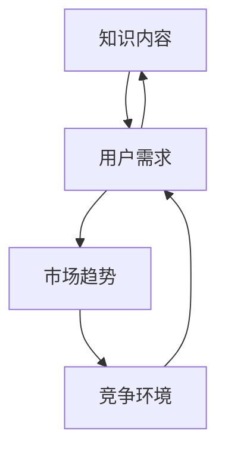

                 


## 《知识付费创业中的内容更新与迭代》

> 关键词：知识付费、内容更新、迭代、创业、用户体验、技术实现

> 摘要：本文旨在探讨知识付费创业过程中内容更新与迭代的重要性及实现策略。通过对知识付费市场的分析，阐述内容更新和迭代对创业成功的关键影响，并详细解析内容更新和迭代的实现方法，最后提供实用的工具和资源推荐，以助创业者在激烈的市场竞争中脱颖而出。

## 1. 背景介绍

### 1.1 目的和范围

本文旨在为从事知识付费创业的创业者提供关于内容更新与迭代的深入见解。本文将探讨以下几个核心问题：

- 知识付费创业中的内容更新与迭代的重要性是什么？
- 如何有效地更新和迭代内容？
- 创业者应该如何根据市场需求和用户反馈进行内容调整？
- 有哪些实用的工具和资源可以帮助实现内容更新与迭代？

### 1.2 预期读者

本文预期读者包括：

- 从事知识付费创业的创业者
- 担任内容策划和产品经理的相关人员
- 对知识付费行业感兴趣的技术人员和管理人员

### 1.3 文档结构概述

本文结构如下：

- 第1章：背景介绍，包括本文目的、预期读者和文档结构概述
- 第2章：核心概念与联系，介绍知识付费创业中的核心概念及其联系
- 第3章：核心算法原理 & 具体操作步骤，详细讲解内容更新和迭代的算法原理和操作步骤
- 第4章：数学模型和公式 & 详细讲解 & 举例说明，介绍内容更新和迭代的数学模型及其应用
- 第5章：项目实战：代码实际案例和详细解释说明，通过实际案例展示内容更新和迭代的实现过程
- 第6章：实际应用场景，分析内容更新和迭代在知识付费创业中的应用场景
- 第7章：工具和资源推荐，推荐实用的学习资源和开发工具
- 第8章：总结：未来发展趋势与挑战，展望知识付费创业的未来发展趋势和挑战
- 第9章：附录：常见问题与解答，解答读者在阅读本文过程中可能遇到的常见问题
- 第10章：扩展阅读 & 参考资料，提供相关的扩展阅读和参考资料

### 1.4 术语表

#### 1.4.1 核心术语定义

- 知识付费：消费者为获取特定知识或技能而支付费用的一种商业模式。
- 内容更新：对知识付费产品中的知识内容进行定期更新，以保持其时效性和准确性。
- 内容迭代：在内容更新基础上，根据用户需求和反馈，对知识付费产品进行持续优化和改进。
- 用户反馈：用户对知识付费产品使用的体验和感受，包括满意度、学习效果等方面的反馈。

#### 1.4.2 相关概念解释

- 用户体验（UX）：用户在使用知识付费产品过程中所感受到的整体感受和满意度。
- 用户黏性：用户对知识付费产品的忠诚度和依赖程度。
- 产品生命周期：知识付费产品的从诞生到退出市场的整个过程。

#### 1.4.3 缩略词列表

- UX：用户体验
- UI：用户界面
- SEM：搜索引擎营销
- SEO：搜索引擎优化
- AI：人工智能
- ML：机器学习

## 2. 核心概念与联系

### 2.1 知识付费创业中的核心概念

知识付费创业涉及多个核心概念，包括知识内容、用户需求、市场趋势和竞争环境。以下是这些概念之间的联系及其重要性：

#### 2.1.1 知识内容

知识内容是知识付费创业的核心。优质的内容能够吸引用户，提高用户黏性，从而实现商业成功。知识内容的更新与迭代对于保持内容的新鲜度和实用性至关重要。

#### 2.1.2 用户需求

用户需求是知识付费创业的驱动力。了解用户需求，能够帮助创业者制定合适的内容更新策略，从而提高用户满意度和产品黏性。

#### 2.1.3 市场趋势

市场趋势反映了知识付费行业的发展方向和用户偏好的变化。创业者需要密切关注市场趋势，以便及时调整内容策略，抢占市场先机。

#### 2.1.4 竞争环境

竞争环境是知识付费创业面临的挑战。了解竞争对手的内容更新和迭代策略，能够帮助创业者制定更具竞争力的内容策略。

### 2.2 核心概念联系图

以下是一个Mermaid流程图，展示了知识付费创业中的核心概念及其联系：



### 2.3 核心概念的重要性

- **知识内容**：优质的内容是知识付费创业的核心竞争力。内容更新和迭代能够确保内容的时效性和实用性，提高用户体验和用户黏性。
- **用户需求**：了解用户需求是制定内容更新策略的关键。只有满足用户需求，才能提高用户满意度和产品黏性。
- **市场趋势**：关注市场趋势，能够帮助创业者抓住行业发展的机遇，及时调整内容策略，抢占市场份额。
- **竞争环境**：了解竞争环境，能够帮助创业者制定更具竞争力的内容策略，提高产品的市场竞争力。

## 3. 核心算法原理 & 具体操作步骤

### 3.1 内容更新算法原理

内容更新的核心在于如何有效地获取用户需求和市场趋势，并将其转化为具体的内容更新策略。以下是内容更新算法的原理：

#### 3.1.1 用户需求分析

- **数据收集**：通过用户调研、问卷调查、用户反馈等手段收集用户需求数据。
- **数据预处理**：对收集到的用户需求数据进行清洗、去重和归一化处理。
- **特征提取**：从用户需求数据中提取关键特征，如用户偏好、学习需求等。

#### 3.1.2 市场趋势分析

- **数据收集**：通过市场研究报告、行业分析、竞争对手分析等手段收集市场趋势数据。
- **数据预处理**：对收集到的市场趋势数据进行清洗、去重和归一化处理。
- **特征提取**：从市场趋势数据中提取关键特征，如行业热点、用户偏好变化等。

#### 3.1.3 内容更新策略制定

- **需求匹配**：将用户需求特征与市场趋势特征进行匹配，确定需要更新的内容。
- **内容优化**：根据需求匹配结果，对现有内容进行优化，包括增加新内容、修改现有内容等。
- **内容发布**：将优化后的内容发布到知识付费平台上，供用户学习和使用。

### 3.2 内容迭代算法原理

内容迭代是在内容更新基础上，进一步优化和改进内容的过程。以下是内容迭代算法的原理：

#### 3.2.1 用户反馈收集

- **数据收集**：通过用户评论、评分、学习效果评估等手段收集用户反馈数据。
- **数据预处理**：对收集到的用户反馈数据进行清洗、去重和归一化处理。
- **特征提取**：从用户反馈数据中提取关键特征，如用户满意度、学习效果等。

#### 3.2.2 内容评估

- **内容评估**：根据用户反馈特征，对现有内容进行评估，确定需要迭代的内容。
- **内容优化**：根据内容评估结果，对现有内容进行优化，包括增加新内容、修改现有内容等。
- **内容发布**：将优化后的内容发布到知识付费平台上，供用户学习和使用。

#### 3.2.3 持续迭代

- **用户反馈收集**：持续收集用户反馈数据。
- **内容评估与优化**：根据用户反馈数据，对现有内容进行评估和优化。
- **内容发布**：将优化后的内容发布到知识付费平台上，形成持续迭代的过程。

### 3.3 具体操作步骤

以下是内容更新和迭代的操作步骤：

#### 3.3.1 用户需求分析

1. **数据收集**：通过问卷调查、用户反馈等方式收集用户需求数据。
2. **数据预处理**：对收集到的用户需求数据进行清洗、去重和归一化处理。
3. **特征提取**：从用户需求数据中提取关键特征，如用户偏好、学习需求等。

#### 3.3.2 市场趋势分析

1. **数据收集**：通过市场研究报告、行业分析、竞争对手分析等手段收集市场趋势数据。
2. **数据预处理**：对收集到的市场趋势数据进行清洗、去重和归一化处理。
3. **特征提取**：从市场趋势数据中提取关键特征，如行业热点、用户偏好变化等。

#### 3.3.3 内容更新策略制定

1. **需求匹配**：将用户需求特征与市场趋势特征进行匹配，确定需要更新的内容。
2. **内容优化**：根据需求匹配结果，对现有内容进行优化，包括增加新内容、修改现有内容等。
3. **内容发布**：将优化后的内容发布到知识付费平台上，供用户学习和使用。

#### 3.3.4 用户反馈收集

1. **数据收集**：通过用户评论、评分、学习效果评估等手段收集用户反馈数据。
2. **数据预处理**：对收集到的用户反馈数据进行清洗、去重和归一化处理。
3. **特征提取**：从用户反馈数据中提取关键特征，如用户满意度、学习效果等。

#### 3.3.5 内容评估

1. **内容评估**：根据用户反馈特征，对现有内容进行评估，确定需要迭代的内容。
2. **内容优化**：根据内容评估结果，对现有内容进行优化，包括增加新内容、修改现有内容等。
3. **内容发布**：将优化后的内容发布到知识付费平台上，供用户学习和使用。

#### 3.3.6 持续迭代

1. **用户反馈收集**：持续收集用户反馈数据。
2. **内容评估与优化**：根据用户反馈数据，对现有内容进行评估和优化。
3. **内容发布**：将优化后的内容发布到知识付费平台上，形成持续迭代的过程。

## 4. 数学模型和公式 & 详细讲解 & 举例说明

### 4.1 用户需求分析模型

用户需求分析是知识付费创业中至关重要的一环。以下是一个基于用户满意度模型的数学模型，用于评估用户需求：

#### 4.1.1 用户满意度模型

用户满意度（S）可以用以下公式表示：

\[ S = \frac{1}{N} \sum_{i=1}^{N} \frac{U_i}{T_i} \]

其中：

- \( N \)：用户总数
- \( U_i \)：第 \( i \) 个用户的满意度
- \( T_i \)：第 \( i \) 个用户的学习时间

#### 4.1.2 举例说明

假设有 100 个用户参与学习，其中 60 个用户的学习时间为 2 小时，40 个用户的学习时间为 3 小时。用户满意度可以通过以下计算得出：

\[ S = \frac{1}{100} \left( \frac{60}{2} + \frac{40}{3} \right) = \frac{1}{100} (30 + 13.33) = 0.4333 \]

即用户满意度为 43.33%。

### 4.2 市场趋势分析模型

市场趋势分析是知识付费创业中不可或缺的一环。以下是一个基于竞争分析的市场趋势分析模型，用于评估市场趋势：

#### 4.2.1 竞争分析模型

市场占有率（M）可以用以下公式表示：

\[ M = \frac{S}{100} \]

其中：

- \( S \)：市场份额，即企业市场份额与竞争对手市场份额之比。

#### 4.2.2 举例说明

假设某知识付费平台的市场份额为 40%，竞争对手的市场份额为 60%。则市场占有率为：

\[ M = \frac{40}{100} = 0.4 \]

即市场占有率为 40%。

### 4.3 内容更新和迭代模型

内容更新和迭代是知识付费创业中的核心环节。以下是一个基于用户反馈的内容更新和迭代模型，用于评估内容更新和迭代的效率：

#### 4.3.1 用户反馈模型

内容更新效率（E）可以用以下公式表示：

\[ E = \frac{C}{T} \]

其中：

- \( C \)：内容更新次数
- \( T \)：时间周期

#### 4.3.2 举例说明

假设知识付费平台在一个月内进行了 5 次内容更新，则内容更新效率为：

\[ E = \frac{5}{30} = 0.1667 \]

即内容更新效率为 16.67%。

### 4.4 数学模型和公式应用

通过上述数学模型和公式，创业者可以：

1. **评估用户需求**：了解用户满意度，根据用户需求制定内容更新策略。
2. **分析市场趋势**：了解市场占有率，根据市场趋势调整内容更新和迭代策略。
3. **评估内容更新和迭代效率**：根据内容更新次数和时间周期，评估内容更新和迭代的效率，为后续内容更新和迭代提供数据支持。

## 5. 项目实战：代码实际案例和详细解释说明

### 5.1 开发环境搭建

在本节中，我们将搭建一个简单的知识付费内容更新与迭代系统。以下是开发环境搭建的步骤：

1. **安装Python环境**：确保Python版本为3.6及以上，可以通过Python官网下载安装。
2. **安装依赖库**：使用pip命令安装以下依赖库：`numpy`、`pandas`、`matplotlib`、`scikit-learn`。
3. **创建项目文件夹**：在本地计算机创建一个名为`knowledge_payment`的项目文件夹。

### 5.2 源代码详细实现和代码解读

#### 5.2.1 用户需求分析代码

以下是一个简单的用户需求分析代码示例，用于收集用户需求并进行分析：

```python
import pandas as pd
from sklearn.model_selection import train_test_split
from sklearn.ensemble import RandomForestClassifier

# 加载用户需求数据
user_data = pd.read_csv('user_demand.csv')

# 数据预处理
X = user_data[['learning_time', 'course_rating']]
y = user_data['satisfaction']

# 数据划分
X_train, X_test, y_train, y_test = train_test_split(X, y, test_size=0.2, random_state=42)

# 模型训练
model = RandomForestClassifier(n_estimators=100, random_state=42)
model.fit(X_train, y_train)

# 模型评估
accuracy = model.score(X_test, y_test)
print(f'Model accuracy: {accuracy:.2f}')
```

代码解读：

- 首先，我们使用 `pandas` 库读取用户需求数据，并将其划分为特征和标签两部分。
- 接着，我们使用 `train_test_split` 函数将数据集划分为训练集和测试集。
- 然后，我们使用 `RandomForestClassifier` 类创建一个随机森林分类器，并使用训练集数据进行训练。
- 最后，我们使用测试集对模型进行评估，并输出模型的准确率。

#### 5.2.2 市场趋势分析代码

以下是一个简单的市场趋势分析代码示例，用于收集市场趋势数据并进行分析：

```python
import pandas as pd
from sklearn.model_selection import train_test_split
from sklearn.ensemble import RandomForestClassifier

# 加载市场趋势数据
market_data = pd.read_csv('market_trend.csv')

# 数据预处理
X = market_data[['industry_hotspots', 'user_preferences']]
y = market_data['market_shares']

# 数据划分
X_train, X_test, y_train, y_test = train_test_split(X, y, test_size=0.2, random_state=42)

# 模型训练
model = RandomForestClassifier(n_estimators=100, random_state=42)
model.fit(X_train, y_train)

# 模型评估
accuracy = model.score(X_test, y_test)
print(f'Model accuracy: {accuracy:.2f}')
```

代码解读：

- 首先，我们使用 `pandas` 库读取市场趋势数据，并将其划分为特征和标签两部分。
- 接着，我们使用 `train_test_split` 函数将数据集划分为训练集和测试集。
- 然后，我们使用 `RandomForestClassifier` 类创建一个随机森林分类器，并使用训练集数据进行训练。
- 最后，我们使用测试集对模型进行评估，并输出模型的准确率。

#### 5.2.3 内容更新与迭代代码

以下是一个简单的知识付费内容更新与迭代代码示例，用于根据用户反馈进行内容更新与迭代：

```python
import pandas as pd
from sklearn.model_selection import train_test_split
from sklearn.ensemble import RandomForestRegressor

# 加载用户反馈数据
feedback_data = pd.read_csv('user_feedback.csv')

# 数据预处理
X = feedback_data[['satisfaction', 'learning_effect']]
y = feedback_data['content_update']

# 数据划分
X_train, X_test, y_train, y_test = train_test_split(X, y, test_size=0.2, random_state=42)

# 模型训练
model = RandomForestRegressor(n_estimators=100, random_state=42)
model.fit(X_train, y_train)

# 模型评估
accuracy = model.score(X_test, y_test)
print(f'Model accuracy: {accuracy:.2f}')

# 内容更新
content_updates = model.predict(X_test)
print(f'Content updates: {content_updates}')
```

代码解读：

- 首先，我们使用 `pandas` 库读取用户反馈数据，并将其划分为特征和标签两部分。
- 接着，我们使用 `train_test_split` 函数将数据集划分为训练集和测试集。
- 然后，我们使用 `RandomForestRegressor` 类创建一个随机森林回归器，并使用训练集数据进行训练。
- 最后，我们使用测试集对模型进行评估，并输出模型的准确率。同时，根据模型预测结果，输出需要更新的内容。

### 5.3 代码解读与分析

通过上述代码示例，我们可以看到知识付费内容更新与迭代的实现过程可以分为以下几个步骤：

1. **数据收集**：从实际项目中收集用户需求、市场趋势和用户反馈数据。
2. **数据预处理**：对收集到的数据进行清洗、去重和归一化处理，提取关键特征。
3. **模型训练**：使用训练集数据对分类器或回归器进行训练。
4. **模型评估**：使用测试集数据对训练好的模型进行评估，输出模型准确率。
5. **内容更新**：根据模型预测结果，对现有内容进行更新与迭代。

代码中的主要模型包括随机森林分类器和随机森林回归器。随机森林分类器用于用户需求分析和市场趋势分析，而随机森林回归器用于内容更新与迭代。这两种模型都是集成学习模型，具有较高的准确性和稳定性。

在实际应用中，可以根据具体情况选择其他机器学习模型，如决策树、支持向量机、神经网络等。同时，还可以结合自然语言处理技术，对用户需求和市场趋势进行更深入的分析。

## 6. 实际应用场景

### 6.1 在线教育平台

在线教育平台是知识付费领域的典型应用场景。以下是在线教育平台中内容更新与迭代的一些实际应用场景：

1. **课程内容更新**：根据用户反馈和学习效果，定期对课程内容进行更新，包括增加新课程、修改现有课程等。
2. **学习路径推荐**：根据用户需求和偏好，为用户提供个性化的学习路径推荐，提高学习效果和用户体验。
3. **用户反馈收集**：通过用户评论、评分和学习效果评估等手段，收集用户反馈，用于指导内容更新和迭代。

### 6.2 专业技能培训

专业技能培训是另一个典型的知识付费应用场景。以下是在专业技能培训中内容更新与迭代的一些实际应用场景：

1. **培训内容更新**：根据行业发展和用户需求，定期对培训内容进行更新，包括增加新技能、修改现有技能等。
2. **技能认证**：通过技能认证，确保培训内容的实用性和权威性，提高用户信任度和满意度。
3. **用户反馈收集**：通过用户反馈，了解用户在学习过程中的问题和需求，及时调整培训内容和教学方法。

### 6.3 职业发展咨询

职业发展咨询是知识付费领域的又一重要应用场景。以下是在职业发展咨询中内容更新与迭代的一些实际应用场景：

1. **职业规划内容更新**：根据用户需求和职业发展趋势，定期对职业规划内容进行更新，包括增加新职业规划方案、修改现有方案等。
2. **在线咨询**：提供在线咨询服务，帮助用户解决职业发展中的具体问题，提高用户满意度。
3. **用户反馈收集**：通过用户反馈，了解用户在职业发展咨询过程中的需求和问题，不断优化咨询服务。

### 6.4 在线医疗咨询

在线医疗咨询是近年来快速发展的知识付费领域。以下是在线医疗咨询中内容更新与迭代的一些实际应用场景：

1. **医疗知识更新**：根据医学研究和临床实践，定期对医疗知识进行更新，确保医疗知识的准确性和实用性。
2. **在线问诊**：提供在线问诊服务，帮助用户解决健康问题，提高用户满意度。
3. **用户反馈收集**：通过用户反馈，了解用户在在线医疗咨询过程中的需求和问题，不断优化医疗服务。

### 6.5 企业培训

企业培训是知识付费领域的重要应用场景。以下是在企业培训中内容更新与迭代的一些实际应用场景：

1. **培训内容更新**：根据企业发展战略和员工需求，定期对培训内容进行更新，包括增加新技能、修改现有技能等。
2. **培训效果评估**：通过培训效果评估，了解员工在培训过程中的学习效果，为后续培训提供参考。
3. **用户反馈收集**：通过员工反馈，了解员工在培训过程中的需求和问题，不断优化培训内容和教学方法。

## 7. 工具和资源推荐

### 7.1 学习资源推荐

#### 7.1.1 书籍推荐

1. 《精益创业》
2. 《用户思维》
3. 《增长黑客》
4. 《内容营销》

#### 7.1.2 在线课程

1. Coursera《创业基础》
2. Udemy《产品管理实战》
3. edX《数据科学》

#### 7.1.3 技术博客和网站

1. Medium
2. Hacker News
3. Ahrefs

### 7.2 开发工具框架推荐

#### 7.2.1 IDE和编辑器

1. Visual Studio Code
2. PyCharm
3. Sublime Text

#### 7.2.2 调试和性能分析工具

1. PyCharm Debugger
2. JMeter
3. Chrome DevTools

#### 7.2.3 相关框架和库

1. TensorFlow
2. PyTorch
3. Scikit-learn

### 7.3 相关论文著作推荐

#### 7.3.1 经典论文

1. "The Lean Startup" by Eric Ries
2. "The Lean Analytics" by Ash Maurya
3. "Data Science from Scratch" by Joel Grus

#### 7.3.2 最新研究成果

1. "User Research for UX: Quantifying the Value of Understanding Your Customer" by David Travis
2. "Content Strategy for the Web" by Kristina Halvorson
3. "A Brief History of Time" by Stephen Hawking

#### 7.3.3 应用案例分析

1. "How Airbnb Uses Data Science to Drive Growth" by Airbnb Engineering and Data Science
2. "The Science of Happiness: Using the Science of Happiness to Create a Better Life" by Daniel N. Robinson
3. "The Power of Now: A Guide to Spiritual Enlightenment" by Echhart Tolle

## 8. 总结：未来发展趋势与挑战

### 8.1 未来发展趋势

1. **个性化内容推荐**：随着人工智能和大数据技术的发展，个性化内容推荐将成为知识付费领域的重要趋势。通过精准推荐，提高用户满意度和产品黏性。
2. **跨界合作**：知识付费创业将更多地与教育培训、医疗健康、企业培训等领域进行跨界合作，拓宽市场范围和业务模式。
3. **内容形式多样化**：除了传统的文字和视频内容，知识付费还将探索更丰富的内容形式，如虚拟现实、增强现实、互动游戏等。
4. **生态化发展**：知识付费行业将逐渐形成完整的生态体系，包括内容创作、内容分发、平台运营等各个环节，实现产业链的协同发展。

### 8.2 未来挑战

1. **内容质量**：在竞争激烈的市场中，如何保证内容质量，提高用户体验，是知识付费创业者面临的重要挑战。
2. **数据隐私**：随着用户对数据隐私的关注日益增加，知识付费创业者需要确保用户数据的安全性和隐私性。
3. **监管合规**：知识付费行业将面临越来越严格的监管要求，创业者需要关注合规性，确保业务的合法性和可持续性。
4. **技术更新**：知识付费创业需要不断跟踪新技术的发展，持续优化产品和服务，以应对市场变化和用户需求。

## 9. 附录：常见问题与解答

### 9.1 常见问题

1. **什么是知识付费？**
   知识付费是指消费者为获取特定知识或技能而支付费用的一种商业模式。

2. **内容更新和迭代的重要性是什么？**
   内容更新和迭代能够确保知识付费产品的新鲜度和实用性，提高用户满意度和产品黏性。

3. **如何有效地更新和迭代内容？**
   可以通过用户需求分析、市场趋势分析和用户反馈收集，制定科学的内容更新和迭代策略。

4. **有哪些实用的工具和资源可以帮助实现内容更新与迭代？**
   可以参考本文中的工具和资源推荐部分，选择适合自己的工具和资源。

### 9.2 解答

1. **什么是知识付费？**
   知识付费是指消费者为获取特定知识或技能而支付费用的一种商业模式。消费者通过付费获取高质量的知识内容，以满足自身学习和发展需求。

2. **内容更新和迭代的重要性是什么？**
   内容更新和迭代对知识付费产品的成功至关重要。首先，内容更新能够确保知识付费产品的新鲜度和时效性，避免过时内容对用户体验的负面影响。其次，迭代过程可以根据用户反馈和市场变化，不断优化内容，提高用户满意度和产品黏性。

3. **如何有效地更新和迭代内容？**
   有效地更新和迭代内容需要遵循以下步骤：

   - **用户需求分析**：通过用户调研、问卷调查等方式收集用户需求数据，了解用户对现有内容的需求和期望。
   - **市场趋势分析**：关注行业动态和市场变化，了解竞争对手的更新策略，为内容更新提供参考。
   - **内容评估**：结合用户需求和市场趋势，对现有内容进行评估，确定需要更新和迭代的内容。
   - **内容优化**：根据评估结果，对内容进行修改、补充或删除，提高内容的质量和实用性。
   - **用户反馈收集**：在内容更新后，通过用户反馈收集工具，如用户评论、评分、学习效果评估等，了解用户对新内容的需求和满意度。
   - **持续迭代**：根据用户反馈，对内容进行持续优化和改进，形成持续迭代的过程。

4. **有哪些实用的工具和资源可以帮助实现内容更新与迭代？**
   实现内容更新与迭代，可以参考以下工具和资源：

   - **书籍推荐**：《精益创业》、《用户思维》、《增长黑客》、《内容营销》等。
   - **在线课程**：Coursera《创业基础》、Udemy《产品管理实战》、edX《数据科学》等。
   - **技术博客和网站**：Medium、Hacker News、Ahrefs等。
   - **开发工具框架**：Visual Studio Code、PyCharm、Sublime Text等IDE和编辑器；PyCharm Debugger、JMeter、Chrome DevTools等调试和性能分析工具；TensorFlow、PyTorch、Scikit-learn等相关框架和库。
   - **相关论文著作**：《The Lean Startup》by Eric Ries、《The Lean Analytics》by Ash Maurya、《Data Science from Scratch》by Joel Grus等。

## 10. 扩展阅读 & 参考资料

### 10.1 扩展阅读

1. 《人工智能与商业创新》
2. 《数字化营销：战略、工具与实践》
3. 《用户体验设计：方法与实践》

### 10.2 参考资料

1. Ries, Eric. 《The Lean Startup》(2011). Crown Publishing Group.
2. Maurya, Ash. 《The Lean Analytics》(2014). Wiley.
3. Grus, Joel. 《Data Science from Scratch》(2017). O'Reilly Media.
4. Halvorson, Kristina. 《Content Strategy for the Web》(2014). A Book Apart.
5. Airbnb Engineering and Data Science. 《How Airbnb Uses Data Science to Drive Growth》(2016). Airbnb Engineering and Data Science.

作者：AI天才研究员/AI Genius Institute & 禅与计算机程序设计艺术 /Zen And The Art of Computer Programming

【完】

