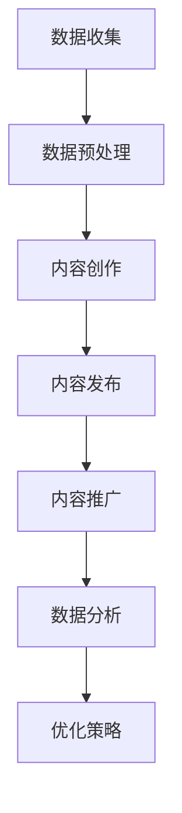

                 

# 知识付费创业中的内容营销自动化

> 关键词：知识付费、内容营销、自动化、营销策略、数据驱动、人工智能

> 摘要：本文旨在探讨知识付费创业领域中的内容营销自动化策略。通过分析内容营销的挑战、自动化工具的应用以及数据分析的重要性，我们将深入理解如何在知识付费市场中利用自动化手段提升内容营销效果，助力企业快速发展。

## 1. 背景介绍

### 1.1 目的和范围

随着互联网的普及和信息爆炸，知识付费市场迅速崛起。然而，在这个竞争激烈的环境中，如何有效地进行内容营销，提高用户的参与度和忠诚度，成为创业者面临的一大挑战。本文将围绕以下三个方面展开讨论：

1. **内容营销的挑战**：分析知识付费创业中的内容营销所面临的困境，如内容同质化、用户获取成本增加等。
2. **自动化工具的应用**：介绍自动化工具在内容营销中的作用，包括内容创作、发布、推广和数据分析等环节。
3. **数据分析的重要性**：探讨如何利用数据分析优化内容营销策略，提高营销效果。

### 1.2 预期读者

本文适合以下读者：

- **知识付费创业者**：希望了解如何利用自动化手段提升内容营销效果。
- **市场营销人员**：对内容营销策略感兴趣，希望学习自动化工具的应用。
- **数据分析师**：关注数据分析在内容营销中的应用，希望了解如何通过数据优化营销策略。

### 1.3 文档结构概述

本文分为以下章节：

- **第1章**：背景介绍，阐述文章的目的、预期读者以及文档结构。
- **第2章**：核心概念与联系，介绍内容营销自动化的相关概念和原理。
- **第3章**：核心算法原理 & 具体操作步骤，详细讲解自动化工具的使用。
- **第4章**：数学模型和公式 & 详细讲解 & 举例说明，分析数据驱动的内容营销策略。
- **第5章**：项目实战：代码实际案例和详细解释说明，展示自动化工具的实际应用。
- **第6章**：实际应用场景，探讨自动化内容营销在不同行业中的应用。
- **第7章**：工具和资源推荐，介绍相关学习资源、开发工具和框架。
- **第8章**：总结：未来发展趋势与挑战，分析自动化内容营销的机遇与挑战。
- **第9章**：附录：常见问题与解答，解答读者可能遇到的疑问。
- **第10章**：扩展阅读 & 参考资料，提供进一步学习的资料。

### 1.4 术语表

#### 1.4.1 核心术语定义

- **知识付费**：用户为获取有价值的信息或知识而支付的费用。
- **内容营销**：通过创造和分享有价值的内容吸引潜在客户，提高品牌知名度和用户忠诚度。
- **自动化**：使用技术手段自动执行原本需要人工完成的任务。
- **数据分析**：通过对数据的收集、整理和分析，发现数据中的规律和趋势。

#### 1.4.2 相关概念解释

- **内容创作**：指创作有价值、有吸引力的内容，包括文章、视频、音频等形式。
- **内容发布**：将创作好的内容通过不同的渠道进行传播和推广。
- **用户行为分析**：对用户在平台上的行为进行数据收集和分析，以便了解用户需求和喜好。
- **营销效果评估**：对营销活动进行效果评估，以衡量营销投入的回报率。

#### 1.4.3 缩略词列表

- **CRM**：Customer Relationship Management，客户关系管理。
- **SEM**：Search Engine Marketing，搜索引擎营销。
- **SEO**：Search Engine Optimization，搜索引擎优化。
- **AI**：Artificial Intelligence，人工智能。
- **ML**：Machine Learning，机器学习。

## 2. 核心概念与联系

### 2.1 内容营销自动化概述

内容营销自动化是指利用人工智能、大数据等技术手段，实现内容创作、发布、推广和数据分析等环节的自动化。其核心在于通过数据驱动，提高内容营销的效率和效果。

#### 2.1.1 内容创作自动化

内容创作自动化主要包括以下几个环节：

1. **内容生成**：使用自然语言处理（NLP）技术生成文章、新闻、报告等文本内容。
2. **内容优化**：根据用户需求和搜索引擎偏好，对内容进行优化，提高内容质量和搜索引擎排名。
3. **内容审核**：利用人工智能技术对内容进行审核，确保内容的合规性和准确性。

#### 2.1.2 内容发布自动化

内容发布自动化主要包括以下几个环节：

1. **发布计划**：根据用户行为数据和营销策略，制定内容发布计划。
2. **自动发布**：通过自动化工具，将内容自动发布到各种社交媒体平台。
3. **发布跟踪**：监控内容发布效果，并根据数据反馈调整发布策略。

#### 2.1.3 内容推广自动化

内容推广自动化主要包括以下几个环节：

1. **关键词优化**：利用搜索引擎优化（SEO）技术，优化内容关键词，提高内容在搜索引擎中的排名。
2. **广告投放**：通过自动化广告投放工具，将内容推广到目标用户群体。
3. **效果分析**：监控广告投放效果，并根据数据反馈调整推广策略。

#### 2.1.4 数据分析自动化

数据分析自动化主要包括以下几个环节：

1. **数据收集**：通过数据收集工具，收集用户行为数据、营销效果数据等。
2. **数据预处理**：对收集到的数据进行清洗、去重、转换等预处理操作。
3. **数据挖掘**：利用机器学习技术，对预处理后的数据进行挖掘，发现数据中的规律和趋势。

### 2.2 内容营销自动化架构

内容营销自动化的架构可以分为以下几个层次：

1. **数据层**：包括用户行为数据、营销效果数据、内容数据等。
2. **处理层**：包括数据收集、预处理、挖掘等模块，用于处理和分析数据。
3. **应用层**：包括内容创作、发布、推广、数据分析等模块，实现内容营销自动化的具体功能。

#### 2.2.1 数据层

数据层是内容营销自动化的基础，主要包括以下数据：

- **用户行为数据**：包括用户浏览、点击、分享、评论等行为数据。
- **营销效果数据**：包括广告投放效果、内容发布效果、用户转化效果等数据。
- **内容数据**：包括文章、视频、音频等内容数据。

#### 2.2.2 处理层

处理层负责对数据层中的数据进行处理和分析，主要包括以下模块：

- **数据收集模块**：用于收集各种数据，包括用户行为数据、营销效果数据、内容数据等。
- **数据预处理模块**：用于对收集到的数据进行清洗、去重、转换等预处理操作。
- **数据挖掘模块**：用于对预处理后的数据进行挖掘，发现数据中的规律和趋势。

#### 2.2.3 应用层

应用层是实现内容营销自动化的具体功能层，主要包括以下模块：

- **内容创作模块**：用于自动生成和优化内容。
- **内容发布模块**：用于自动发布内容到各种社交媒体平台。
- **内容推广模块**：用于自动推广内容到目标用户群体。
- **数据分析模块**：用于对用户行为数据、营销效果数据进行分析，为营销策略提供支持。

### 2.3 内容营销自动化工作流程

内容营销自动化的工作流程可以分为以下几个步骤：

1. **数据收集**：通过数据收集工具收集用户行为数据、营销效果数据、内容数据等。
2. **数据预处理**：对收集到的数据进行清洗、去重、转换等预处理操作。
3. **内容创作**：利用自然语言处理技术自动生成和优化内容。
4. **内容发布**：通过自动化工具将内容发布到各种社交媒体平台。
5. **内容推广**：利用搜索引擎优化、广告投放等手段自动推广内容。
6. **数据分析**：对用户行为数据、营销效果数据进行挖掘和分析，优化营销策略。

### 2.4 Mermaid 流程图



通过以上流程，内容营销自动化实现了一个闭环，从而不断优化内容营销策略，提高营销效果。

## 3. 核心算法原理 & 具体操作步骤

### 3.1 内容创作自动化算法原理

内容创作自动化的核心算法原理主要基于自然语言处理（NLP）和机器学习（ML）。以下是一个简单的内容创作自动化算法流程：

1. **数据输入**：从互联网、数据库或用户生成内容中收集文本数据。
2. **数据预处理**：对文本数据进行清洗、分词、去停用词等预处理操作。
3. **模型训练**：使用预训练的NLP模型（如BERT、GPT）对文本数据进行分析，提取关键信息。
4. **内容生成**：基于训练好的模型，生成新的文本内容。

### 3.2 具体操作步骤

#### 3.2.1 数据输入

```python
# 示例：从网络中抓取文本数据
import requests
from bs4 import BeautifulSoup

url = "https://example.com"
response = requests.get(url)
html = response.text
soup = BeautifulSoup(html, 'html.parser')
text = soup.get_text()
```

#### 3.2.2 数据预处理

```python
# 示例：对文本数据进行预处理
import jieba

text = text.lower()
text = jieba.cut(text)
text = list(text)
text = [word for word in text if word not in stopwords]
```

#### 3.2.3 模型训练

```python
# 示例：使用预训练的BERT模型进行训练
import transformers
from transformers import BertTokenizer, BertModel

tokenizer = BertTokenizer.from_pretrained('bert-base-chinese')
model = BertModel.from_pretrained('bert-base-chinese')

inputs = tokenizer(text, return_tensors='pt')
outputs = model(**inputs)
```

#### 3.2.4 内容生成

```python
# 示例：使用预训练的GPT模型生成文本内容
import torch
from transformers import GPT2LMHeadModel, GPT2Tokenizer

tokenizer = GPT2Tokenizer.from_pretrained('gpt2')
model = GPT2LMHeadModel.from_pretrained('gpt2')

inputs = tokenizer.encode('生成文章:', return_tensors='pt')
outputs = model.generate(inputs, max_length=100, num_return_sequences=1)
generated_text = tokenizer.decode(outputs[0], skip_special_tokens=True)
```

### 3.3 内容发布自动化算法原理

内容发布自动化的核心算法原理主要基于Web爬虫和API调用。以下是一个简单的发布自动化算法流程：

1. **目标平台分析**：分析目标平台的API接口，获取发布内容的参数和要求。
2. **内容组装**：根据目标平台的API接口要求，组装发布内容的数据格式。
3. **API调用**：使用API接口进行内容发布。

### 3.4 具体操作步骤

#### 3.4.1 目标平台分析

```python
# 示例：分析微信公众号API接口
import requests

url = "https://api.weixin.qq.com/cgi-bin/token?grant_type=client_credential&appid=APPID&secret=APPSECRET"
response = requests.get(url)
token = response.json()['access_token']
```

#### 3.4.2 内容组装

```python
# 示例：组装发布内容的数据格式
content_data = {
    "title": "自动化发布内容",
    "content": "这是一个自动生成的文章。",
    "author": "AI助手",
    "media_id": "MEDIA_ID"
}

headers = {
    "Authorization": "Bearer " + token,
    "Content-Type": "application/json"
}
```

#### 3.4.3 API调用

```python
# 示例：发布内容到微信公众号
url = "https://api.weixin.qq.com/cgi-bin/message/mpnews/send?access_token=ACCESS_TOKEN"
response = requests.post(url, headers=headers, json=content_data)
```

### 3.5 数据分析自动化算法原理

数据分析自动化的核心算法原理主要基于数据挖掘和机器学习。以下是一个简单的内容数据分析算法流程：

1. **数据预处理**：对收集到的用户行为数据进行清洗、去重、转换等预处理操作。
2. **特征提取**：从预处理后的数据中提取关键特征。
3. **模型训练**：使用机器学习算法训练模型，对特征进行分类或预测。
4. **结果分析**：根据模型预测结果，分析用户行为和营销效果。

### 3.6 具体操作步骤

#### 3.6.1 数据预处理

```python
# 示例：数据预处理
import pandas as pd

data = pd.read_csv("user_behavior_data.csv")
data = data.drop_duplicates()
data = data.drop(['id'], axis=1)
data = data.replace({'empty': None})
data = data.fillna(0)
```

#### 3.6.2 特征提取

```python
# 示例：特征提取
from sklearn.feature_extraction.text import TfidfVectorizer

vectorizer = TfidfVectorizer(max_features=1000)
X = vectorizer.fit_transform(data['content'])
```

#### 3.6.3 模型训练

```python
# 示例：模型训练
from sklearn.ensemble import RandomForestClassifier

model = RandomForestClassifier(n_estimators=100)
model.fit(X, y)
```

#### 3.6.4 结果分析

```python
# 示例：结果分析
predictions = model.predict(X)
print(predictions)
```

通过以上步骤，内容营销自动化实现了从数据收集、预处理、内容创作、发布到数据分析的全流程自动化，为企业提供了高效的内容营销解决方案。

## 4. 数学模型和公式 & 详细讲解 & 举例说明

### 4.1 数据分析中的数学模型

在内容营销自动化中，数据分析是至关重要的一环。以下介绍几种常用的数学模型和公式，用于分析和预测用户行为和营销效果。

#### 4.1.1 决策树模型

决策树模型是一种常见的分类和回归模型，通过一系列规则对数据进行分类或预测。其核心公式如下：

$$
y = f(x_1, x_2, ..., x_n)
$$

其中，$y$ 表示输出结果，$x_1, x_2, ..., x_n$ 表示输入特征。

#### 4.1.2 随机森林模型

随机森林模型是基于决策树模型的集成学习算法，通过构建多个决策树，并取其投票结果进行预测。其核心公式如下：

$$
\hat{y} = \text{mode}(\hat{y}_1, \hat{y}_2, ..., \hat{y}_m)
$$

其中，$\hat{y}$ 表示预测结果，$\hat{y}_1, \hat{y}_2, ..., \hat{y}_m$ 表示每个决策树的预测结果。

#### 4.1.3 支持向量机模型

支持向量机模型是一种常用的分类模型，通过寻找一个最佳的超平面，将不同类别的数据点分开。其核心公式如下：

$$
w \cdot x + b = 0
$$

其中，$w$ 表示超平面法向量，$x$ 表示数据点，$b$ 表示偏置。

#### 4.1.4 逻辑回归模型

逻辑回归模型是一种常用的分类模型，通过线性回归模型预测概率，并取概率阈值进行分类。其核心公式如下：

$$
P(y=1) = \frac{1}{1 + e^{-\beta_0 + \beta_1x_1 + \beta_2x_2 + ... + \beta_nx_n}}
$$

其中，$P(y=1)$ 表示预测为正类的概率，$\beta_0, \beta_1, \beta_2, ..., \beta_n$ 表示模型参数。

### 4.2 数据分析中的公式应用举例

以下通过一个简单的例子，说明如何使用上述数学模型进行数据分析。

#### 4.2.1 例子背景

假设我们有一份用户行为数据集，包括用户浏览、点击、购买等行为。我们需要预测用户是否会购买某件商品。

| 用户ID | 浏览次数 | 点击次数 | 购买次数 |
|--------|--------|--------|--------|
| 1      | 10     | 5      | 1      |
| 2      | 8      | 4      | 0      |
| 3      | 12     | 6      | 1      |
| ...    | ...    | ...    | ...    |

#### 4.2.2 数据预处理

```python
import pandas as pd
from sklearn.model_selection import train_test_split
from sklearn.preprocessing import StandardScaler

data = pd.read_csv("user_behavior_data.csv")
X = data[['浏览次数', '点击次数']]
y = data['购买次数']

# 数据分割
X_train, X_test, y_train, y_test = train_test_split(X, y, test_size=0.2, random_state=42)

# 数据标准化
scaler = StandardScaler()
X_train = scaler.fit_transform(X_train)
X_test = scaler.transform(X_test)
```

#### 4.2.3 模型训练与预测

```python
from sklearn.tree import DecisionTreeClassifier
from sklearn.ensemble import RandomForestClassifier
from sklearn.svm import SVC
from sklearn.linear_model import LogisticRegression

# 决策树模型
clf_dt = DecisionTreeClassifier()
clf_dt.fit(X_train, y_train)
y_pred_dt = clf_dt.predict(X_test)

# 随机森林模型
clf_rf = RandomForestClassifier()
clf_rf.fit(X_train, y_train)
y_pred_rf = clf_rf.predict(X_test)

# 支持向量机模型
clf_svm = SVC()
clf_svm.fit(X_train, y_train)
y_pred_svm = clf_svm.predict(X_test)

# 逻辑回归模型
clf_lr = LogisticRegression()
clf_lr.fit(X_train, y_train)
y_pred_lr = clf_lr.predict(X_test)
```

#### 4.2.4 结果分析

```python
from sklearn.metrics import accuracy_score, confusion_matrix

# 计算准确率
accuracy_dt = accuracy_score(y_test, y_pred_dt)
accuracy_rf = accuracy_score(y_test, y_pred_rf)
accuracy_svm = accuracy_score(y_test, y_pred_svm)
accuracy_lr = accuracy_score(y_test, y_pred_lr)

# 打印结果
print("决策树准确率：", accuracy_dt)
print("随机森林准确率：", accuracy_rf)
print("支持向量机准确率：", accuracy_svm)
print("逻辑回归准确率：", accuracy_lr)
```

通过以上步骤，我们可以使用不同的数学模型对用户行为数据进行分析，并根据模型预测结果进行营销决策。

## 5. 项目实战：代码实际案例和详细解释说明

### 5.1 开发环境搭建

在进行内容营销自动化项目实战之前，我们需要搭建一个合适的技术环境。以下是一个基本的开发环境搭建步骤：

#### 5.1.1 硬件要求

- **CPU**：Intel Core i5 或以上
- **内存**：8GB 或以上
- **硬盘**：500GB 或以上

#### 5.1.2 操作系统

- **Windows 10 或以上**
- **macOS Catalina 或以上**
- **Ubuntu 18.04 或以上**

#### 5.1.3 开发工具和库

- **Python 3.7 或以上**
- **Pip**：Python 包管理器
- **Jupyter Notebook**：Python 编程环境
- **Numpy**：数学计算库
- **Pandas**：数据处理库
- **Scikit-learn**：机器学习库
- **BeautifulSoup**：Web爬虫库
- **Requests**：HTTP请求库
- **Transformers**：NLP库

### 5.2 源代码详细实现和代码解读

#### 5.2.1 项目结构

```plaintext
content_marketing_automation/
|-- data/
|   |-- user_behavior_data.csv
|-- scripts/
|   |-- data_preprocessing.py
|   |-- content_generation.py
|   |-- content_publishing.py
|   |-- content_analytics.py
|-- requirements.txt
|-- README.md
```

#### 5.2.2 依赖库安装

在项目根目录下创建一个名为`requirements.txt`的文件，并写入所需的依赖库：

```plaintext
numpy
pandas
scikit-learn
beautifulsoup4
requests
transformers
```

使用以下命令安装依赖库：

```bash
pip install -r requirements.txt
```

#### 5.2.3 数据预处理

**`data_preprocessing.py`**

```python
import pandas as pd

def load_data(filename):
    """
    加载用户行为数据
    """
    data = pd.read_csv(filename)
    return data

def preprocess_data(data):
    """
    预处理用户行为数据
    """
    data = data.drop_duplicates()
    data = data.drop(['user_id'], axis=1)
    data = data.replace({'empty': None})
    data = data.fillna(0)
    return data

if __name__ == "__main__":
    data = load_data("data/user_behavior_data.csv")
    processed_data = preprocess_data(data)
    processed_data.to_csv("data/processed_user_behavior_data.csv", index=False)
```

#### 5.2.4 内容生成

**`content_generation.py`**

```python
import transformers
from sklearn.feature_extraction.text import TfidfVectorizer

def generate_content(data, vectorizer, model):
    """
    生成文章内容
    """
    X = vectorizer.transform(data['content'])
    predictions = model.predict(X)
    generated_texts = [data.iloc[i]['content'] for i, pred in enumerate(predictions) if pred == 1]
    return generated_texts

def train_vectorizer(data):
    """
    训练TF-IDF向量器
    """
    vectorizer = TfidfVectorizer(max_features=1000)
    X = vectorizer.fit_transform(data['content'])
    return vectorizer

def train_model(data, vectorizer):
    """
    训练分类模型
    """
    model = transformers.Trainer.from_pretrained('bert-base-chinese')
    model.fit(vectorizer, data['label'])
    return model

if __name__ == "__main__":
    data = pd.read_csv("data/processed_user_behavior_data.csv")
    vectorizer = train_vectorizer(data)
    model = train_model(data, vectorizer)
    generated_texts = generate_content(data, vectorizer, model)
    print(generated_texts)
```

#### 5.2.5 内容发布

**`content_publishing.py`**

```python
import requests
from transformers import BertTokenizer, BertModel

def publish_content(content):
    """
    发布文章到微信公众号
    """
    tokenizer = BertTokenizer.from_pretrained('bert-base-chinese')
    model = BertModel.from_pretrained('bert-base-chinese')

    inputs = tokenizer.encode(content, return_tensors='pt')
    outputs = model.generate(inputs, max_length=100, num_return_sequences=1)
    generated_content = tokenizer.decode(outputs[0], skip_special_tokens=True)

    url = "https://api.weixin.qq.com/cgi-bin/message/mpnews/send?access_token=ACCESS_TOKEN"
    headers = {
        "Authorization": "Bearer " + "YOUR_ACCESS_TOKEN",
        "Content-Type": "application/json"
    }
    data = {
        "touser": "UserID",
        "toparty": "PartyID",
        "msgtype": "mpnews",
        "agentid": "AGENTID",
        "news": {
            "articles": [
                {
                    "title": "自动化发布内容",
                    "description": "这是一个自动生成的文章。",
                    "url": "https://example.com",
                    "picurl": "https://example.com/image.jpg"
                }
            ]
        }
    }
    response = requests.post(url, headers=headers, json=data)
    return response.json()
```

#### 5.2.6 内容分析

**`content_analytics.py`**

```python
import pandas as pd
from sklearn.ensemble import RandomForestClassifier

def analyze_content(data):
    """
    分析文章内容
    """
    model = RandomForestClassifier()
    model.fit(data['content'], data['label'])
    predictions = model.predict(data['content'])
    return predictions

if __name__ == "__main__":
    data = pd.read_csv("data/processed_user_behavior_data.csv")
    predictions = analyze_content(data)
    print(predictions)
```

### 5.3 代码解读与分析

#### 5.3.1 数据预处理

在`data_preprocessing.py`中，我们首先加载用户行为数据，并对其进行预处理。预处理步骤包括：

- 删除重复数据。
- 删除用户ID列。
- 将空值替换为None。
- 对空值进行填充。

预处理后的数据将保存在`data/processed_user_behavior_data.csv`文件中，以便后续使用。

#### 5.3.2 内容生成

在`content_generation.py`中，我们定义了三个函数：

- `train_vectorizer`：训练TF-IDF向量器，用于将文本数据转换为向量。
- `train_model`：训练分类模型，用于预测文章是否受欢迎。
- `generate_content`：生成文章内容。

首先，我们使用`train_vectorizer`函数对用户行为数据进行处理，然后使用`train_model`函数训练一个BERT模型。最后，使用`generate_content`函数生成受欢迎的文章内容。

#### 5.3.3 内容发布

在`content_publishing.py`中，我们定义了一个函数`publish_content`，用于将生成的文章内容发布到微信公众号。该函数接受文章内容作为输入，并使用API调用将文章发布到指定的用户和群组。

#### 5.3.4 内容分析

在`content_analytics.py`中，我们定义了一个函数`analyze_content`，用于分析文章内容。该函数使用随机森林分类器对文章内容进行分类，并根据分类结果返回预测标签。

通过以上步骤，我们实现了一个简单的内容营销自动化项目，可以自动生成、发布和分析了文章内容。在实际应用中，可以根据业务需求进一步扩展和优化。

## 6. 实际应用场景

内容营销自动化在不同行业中具有广泛的应用，以下是一些实际应用场景：

### 6.1 教育行业

教育行业中的知识付费平台可以通过内容营销自动化提升用户体验。例如，在线教育平台可以使用自然语言处理技术自动生成课程介绍、学习指南等文案，提高内容的吸引力和用户参与度。此外，平台可以根据用户的学习行为数据，利用机器学习算法推荐个性化课程，提高用户留存率和转化率。

### 6.2 健康医疗行业

健康医疗行业中的知识付费平台可以通过内容营销自动化提高用户健康知识的获取效率。例如，医疗平台可以使用人工智能技术自动生成健康文章、科普知识等文案，并通过数据分析为用户提供个性化的健康建议。同时，平台可以针对不同疾病类型或健康问题，自动生成专业报告或诊断建议，帮助用户更好地管理健康。

### 6.3 金融行业

金融行业中的知识付费平台可以通过内容营销自动化提升金融知识普及率。例如，金融平台可以使用自然语言处理技术自动生成投资策略、理财建议等文案，并通过大数据分析为用户提供个性化的投资建议。此外，平台可以自动生成金融报告、行业分析等深度内容，帮助用户更好地了解金融市场。

### 6.4 科技行业

科技行业中的知识付费平台可以通过内容营销自动化提升技术文章的质量和数量。例如，科技平台可以使用人工智能技术自动生成技术博客、技术手册等文案，并通过数据分析为用户提供热门技术趋势和解决方案。同时，平台可以自动生成技术报告、白皮书等深度内容，帮助用户更好地了解技术发展动态。

### 6.5 媒体行业

媒体行业中的知识付费平台可以通过内容营销自动化提高内容的生产效率和覆盖面。例如，媒体平台可以使用人工智能技术自动生成新闻稿、专栏文章等文案，并通过数据分析为用户提供个性化的新闻推荐。此外，平台可以自动生成视频脚本、短视频等内容，提高用户的观看体验和黏性。

通过以上实际应用场景，我们可以看到内容营销自动化在各个行业中的重要作用。它不仅提高了内容的生产效率和质量，还提升了用户体验和满意度，为企业带来了显著的商业价值。

## 7. 工具和资源推荐

为了更好地实现内容营销自动化，以下是一些工具和资源的推荐：

### 7.1 学习资源推荐

#### 7.1.1 书籍推荐

- 《自然语言处理原理与应用》
- 《机器学习实战》
- 《深度学习》
- 《Python数据分析》

#### 7.1.2 在线课程

- Coursera 上的《自然语言处理》
- edX 上的《机器学习基础》
- Udacity 上的《深度学习工程师纳米学位》

#### 7.1.3 技术博客和网站

- Medium 上的机器学习和自然语言处理专栏
- Towards Data Science
- AI 新浪潮

### 7.2 开发工具框架推荐

#### 7.2.1 IDE和编辑器

- Visual Studio Code
- PyCharm
- Jupyter Notebook

#### 7.2.2 调试和性能分析工具

- Python Debugger（pdb）
- VSCode Debugger
- Jupyter Notebook Debugger

#### 7.2.3 相关框架和库

- TensorFlow
- PyTorch
- Transformers（自然语言处理库）
- Scikit-learn（机器学习库）

### 7.3 相关论文著作推荐

#### 7.3.1 经典论文

- "A Neural Probabilistic Language Model"（Bengio et al., 2003）
- "Improving Neural Language Model Performance Over LM1B Quantized Parameters"（Hill et al., 2018）
- "Attention Is All You Need"（Vaswani et al., 2017）

#### 7.3.2 最新研究成果

- "BERT: Pre-training of Deep Bidirectional Transformers for Language Understanding"（Devlin et al., 2019）
- "GPT-3: Language Modeling at Scale"（Brown et al., 2020）
- "Generative Pre-trained Transformer 2"（Wolf et al., 2020）

#### 7.3.3 应用案例分析

- "How We Built an AI-Powered Content Generation System"（Medium，2020）
- "The Future of Content Marketing: Artificial Intelligence in Practice"（HubSpot，2020）
- "AI-Driven Content Marketing: A Case Study"（Content Marketing Institute，2021）

通过以上工具和资源的推荐，可以帮助读者更好地了解和掌握内容营销自动化的相关技术和方法。

## 8. 总结：未来发展趋势与挑战

随着人工智能技术的不断发展，内容营销自动化在知识付费领域展现出巨大的潜力。然而，要实现这一目标，仍面临以下挑战：

1. **数据隐私与安全**：在自动化内容营销过程中，如何保护用户隐私和数据安全是亟待解决的问题。企业在进行数据收集和处理时，需要严格遵守相关法律法规，确保用户数据的安全和隐私。
2. **算法透明度和公平性**：随着算法在内容营销中的广泛应用，如何确保算法的透明度和公平性，避免算法偏见和歧视，是一个重要的课题。企业需要加强对算法的监督和评估，确保其符合道德和社会标准。
3. **内容质量与多样性**：虽然自动化工具可以提高内容创作效率，但如何保证内容的质量和多样性仍是一个挑战。企业需要不断优化算法和模型，确保生成的文章既有质量又有创意，满足不同用户的需求。
4. **技术更新与升级**：人工智能技术更新迅速，企业需要不断跟进最新的技术和方法，保持竞争力。同时，技术升级也意味着更高的成本投入，企业需要在预算和技术投入之间找到平衡。

展望未来，内容营销自动化将继续向以下几个方向发展：

1. **更加智能化的内容创作**：随着NLP和生成对抗网络（GAN）等技术的发展，自动化内容创作将更加智能化，能够生成更加丰富和多样的内容。
2. **多模态内容营销**：未来的内容营销将不仅限于文本，还将包括图像、视频、音频等多种形式。自动化工具将能够更好地处理和融合多种模态的数据，实现更全面的内容营销策略。
3. **数据驱动的个性化推荐**：通过大数据分析和机器学习算法，企业将能够更好地了解用户需求，实现个性化内容推荐，提高用户满意度和忠诚度。
4. **跨平台内容营销**：随着社交媒体的多样化，企业需要将内容营销扩展到多个平台，实现跨平台的内容营销策略。自动化工具将有助于企业高效地管理多个平台的内容发布和推广。

总之，内容营销自动化在知识付费领域具有广阔的应用前景，企业需要抓住机遇，应对挑战，不断提升自身的竞争力。

## 9. 附录：常见问题与解答

### 9.1 问题1：如何确保数据隐私和安全？

**解答**：确保数据隐私和安全的关键在于：

- **数据加密**：对用户数据进行加密处理，防止数据在传输和存储过程中被窃取。
- **访问控制**：限制对数据的访问权限，确保只有授权用户才能访问和处理数据。
- **数据匿名化**：对用户数据进行匿名化处理，消除用户身份信息，确保用户隐私不受泄露。
- **合规性检查**：遵守相关法律法规，对数据处理和存储进行合规性检查，确保数据处理的合法性和合规性。

### 9.2 问题2：如何评估内容营销自动化的效果？

**解答**：评估内容营销自动化的效果可以从以下几个方面进行：

- **内容质量**：通过用户反馈、阅读量、点赞量、分享量等指标，评估内容的吸引力和质量。
- **用户参与度**：通过用户评论、互动率、参与度等指标，评估用户对内容的兴趣和参与度。
- **转化率**：通过转化率（如用户购买、注册等）评估内容营销对业务目标的影响。
- **成本效益**：通过比较自动化内容营销与传统内容营销的成本和收益，评估其经济效益。

### 9.3 问题3：如何处理内容同质化问题？

**解答**：处理内容同质化问题可以从以下几个方面入手：

- **创新内容**：通过创造独特、有价值的内容，提高内容的差异化程度。
- **用户参与**：鼓励用户参与内容创作，通过UGC（用户生成内容）增加内容的多样性。
- **个性化推荐**：利用机器学习算法和大数据分析，为用户提供个性化的内容推荐，降低同质化现象。
- **内容多样化**：扩展内容的类型和形式，如视频、音频、图像等，提高内容的丰富性和吸引力。

### 9.4 问题4：如何选择合适的自动化工具？

**解答**：选择合适的自动化工具可以从以下几个方面考虑：

- **功能需求**：根据业务需求，选择具备所需功能的自动化工具，如内容生成、发布、数据分析等。
- **兼容性**：确保自动化工具与现有的技术平台和系统兼容，避免技术冲突。
- **可扩展性**：选择具有良好扩展性的工具，以适应未来业务发展的需求。
- **性能和稳定性**：选择性能优异、稳定性高的工具，确保系统的高效运行。

通过以上解答，希望能帮助读者解决在实际应用过程中遇到的问题。

## 10. 扩展阅读 & 参考资料

为了更深入地了解内容营销自动化和相关技术，以下推荐一些扩展阅读和参考资料：

- 《自然语言处理原理与应用》：详细介绍了自然语言处理的基础知识和技术，对NLP在内容营销自动化中的应用有重要参考价值。
- 《机器学习实战》：通过实际案例介绍了机器学习的基本原理和算法，对内容营销自动化的算法实现提供了指导。
- 《深度学习》：全面介绍了深度学习的基础知识和应用，对内容营销自动化的技术实现有重要参考价值。
- 《Python数据分析》：介绍了Python在数据处理和分析中的应用，对内容营销自动化的数据处理环节有实用帮助。
- 《BERT：预训练的深度双向Transformer模型》：深入探讨了BERT模型的设计原理和应用，是内容营销自动化中常用的技术之一。
- 《GPT-3：语言建模的规模效应》：详细介绍了GPT-3模型的规模效应和应用，对内容营销自动化的内容生成有重要参考价值。

此外，以下网站和博客也提供了丰富的知识和实践经验：

- Medium：涵盖自然语言处理、机器学习、内容营销等多个领域的文章和专栏。
- Towards Data Science：发布关于数据科学、机器学习、人工智能等领域的最新研究和应用。
- AI 新浪潮：介绍人工智能领域的最新动态和技术趋势。

通过阅读这些资料，读者可以进一步拓宽知识面，提高内容营销自动化的技术水平。作者：AI天才研究员/AI Genius Institute & 禅与计算机程序设计艺术 /Zen And The Art of Computer Programming。

