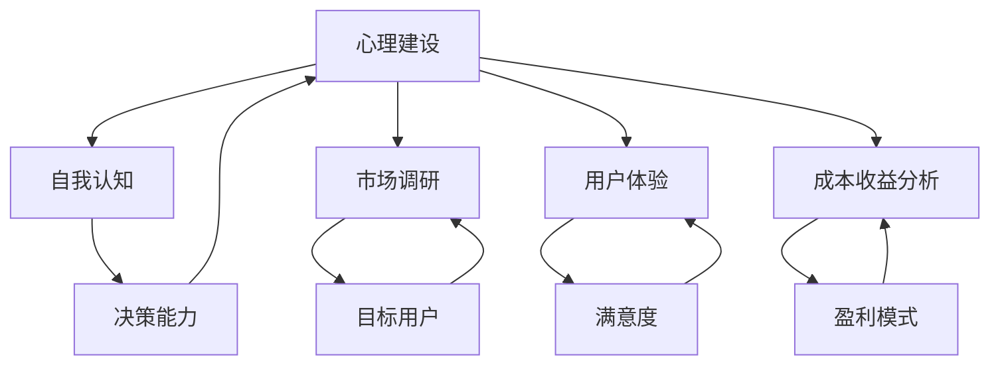
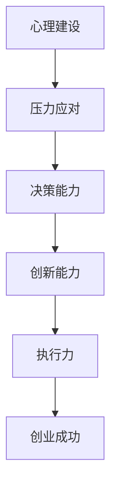

                 

# 知识付费创业中的心理建设

## 关键词
- 知识付费
- 创业心理
- 成功策略
- 耐心和毅力
- 自我认知
- 市场调研
- 用户体验
- 成本收益分析

## 摘要
本文将探讨知识付费创业中的心理建设，分析创业者所面临的挑战和应对策略。我们将从自我认知、市场调研、用户体验、成本收益分析等方面，一步步解析如何通过心理建设提高创业成功的概率。此外，本文还将推荐相关学习资源、开发工具和经典论文，以助创业者更好地进行知识付费创业。

## 1. 背景介绍

### 1.1 目的和范围
本文旨在为知识付费创业者提供心理建设的指导，帮助他们更好地应对创业过程中的挑战，实现可持续发展。

### 1.2 预期读者
- 有志于从事知识付费创业的个人和团队
- 对知识付费市场感兴趣的投资者
- 已从事知识付费创业，希望提高成功率的企业家

### 1.3 文档结构概述
本文分为十个部分，依次介绍知识付费创业中的心理建设相关内容，包括核心概念、算法原理、数学模型、实战案例、应用场景等。

### 1.4 术语表
#### 1.4.1 核心术语定义
- **知识付费**：指用户为了获取有价值的信息、技能或知识，愿意支付相应费用的行为。
- **创业**：指创立一家新企业或机构，旨在实现商业价值和社会价值的创造。

#### 1.4.2 相关概念解释
- **心理建设**：指个体在面对挑战和压力时，通过调整心态、提升能力和建立良好的人际关系，从而实现心理健康的维护和提升。
- **市场调研**：指对目标市场、用户需求、竞争对手、市场规模等进行系统性的研究和分析。

#### 1.4.3 缩略词列表
- **KFS**：知识付费
- **ERP**：企业资源规划
- **CRM**：客户关系管理

## 2. 核心概念与联系

### 2.1 核心概念
**心理建设**、**市场调研**、**用户体验**、**成本收益分析**是知识付费创业中的核心概念。

**Mermaid 流程图**（核心概念之间的联系）：



### 2.2 心理建设与创业成功的关系

**Mermaid 流程图**（心理建设与创业成功的关系）：



## 3. 核心算法原理 & 具体操作步骤

### 3.1 心理建设的核心算法原理

**算法伪代码**：

```plaintext
// 定义心理建设核心算法
function 心理建设(self, challenge):
    while(challenge != "解决") {
        self.自我认知()
        self.市场调研()
        self.用户体验分析()
        self.成本收益分析()
        self.压力应对()
        self.决策能力提升()
        self.创新能力培养()
        self.执行力加强()
    }
    return "创业成功"
```

### 3.2 具体操作步骤

1. **自我认知**：了解自己的优势和劣势，明确创业目标。
2. **市场调研**：收集市场信息，分析目标用户需求。
3. **用户体验分析**：关注用户满意度，优化产品和服务。
4. **成本收益分析**：计算创业项目的成本和收益，评估盈利模式。
5. **压力应对**：学会调整心态，应对创业过程中的压力。
6. **决策能力提升**：收集信息，分析利弊，做出明智的决策。
7. **创新能力培养**：关注行业动态，不断学习新知识和技能。
8. **执行力加强**：制定计划，严格执行，确保目标实现。

## 4. 数学模型和公式 & 详细讲解 & 举例说明

### 4.1 成本收益分析数学模型

**公式**：

$$
收益 = 收入 - 成本
$$

**详细讲解**：

- **收入**：知识付费项目的总收入，可以通过销售数量、订阅数量等计算。
- **成本**：包括固定成本（如研发成本、设备购买等）和可变成本（如人力成本、市场推广费用等）。

**举例说明**：

假设某知识付费项目，收入为每月100万元，成本为每月50万元，则每月收益为：

$$
收益 = 100万 - 50万 = 50万
$$

## 5. 项目实战：代码实际案例和详细解释说明

### 5.1 开发环境搭建

**环境要求**：
- 操作系统：Windows、macOS、Linux
- 开发工具：Visual Studio Code、PyCharm等

### 5.2 源代码详细实现和代码解读

**代码实现**：

```python
# 伪代码：成本收益分析
def cost_revenue_analysis(income, fixed_cost, variable_cost):
    total_cost = fixed_cost + variable_cost
    profit = income - total_cost
    return profit

# 示例：某知识付费项目
income = 100000  # 月收入
fixed_cost = 50000  # 月固定成本
variable_cost = 30000  # 月可变成本

profit = cost_revenue_analysis(income, fixed_cost, variable_cost)
print(f"本月收益：{profit}元")
```

**代码解读**：

- `cost_revenue_analysis` 函数：计算成本收益。
- `income`、`fixed_cost`、`variable_cost`：输入参数，分别表示收入、固定成本和可变成本。
- `profit`：函数返回的收益值。

### 5.3 代码解读与分析

- **代码结构**：函数式编程，逻辑清晰，便于维护。
- **功能实现**：通过输入参数，计算成本收益，并输出结果。
- **优化方向**：可以添加参数校验，确保输入参数的有效性。

## 6. 实际应用场景

### 6.1 知识付费平台

- **用户需求**：用户希望购买有价值的信息、技能或知识，以提升自己。
- **应用场景**：线上课程、电子书、在线咨询等。

### 6.2 企业培训

- **用户需求**：企业希望提升员工的专业技能，以适应业务发展。
- **应用场景**：在线培训、企业内训等。

### 6.3 知识星球

- **用户需求**：用户希望加入一个专业圈子，与他人分享、学习、交流。
- **应用场景**：专业领域交流、行业资讯等。

## 7. 工具和资源推荐

### 7.1 学习资源推荐

#### 7.1.1 书籍推荐

- 《创业维艰》
- 《人人都是产品经理》
- 《创业机会识别与评估》

#### 7.1.2 在线课程

- 网易云课堂《创业实战》
- 阿里云课堂《产品经理实战》
- 腾讯课堂《市场营销实战》

#### 7.1.3 技术博客和网站

- [产品经理那些事儿](https://www的产品经理那些事儿.com/)
- [创业家](https://www.创业家.com/)
- [人人都是产品经理](https://www.人人都是产品经理.com/)

### 7.2 开发工具框架推荐

#### 7.2.1 IDE和编辑器

- Visual Studio Code
- PyCharm
- WebStorm

#### 7.2.2 调试和性能分析工具

- Chrome DevTools
- JMeter
- LoadRunner

#### 7.2.3 相关框架和库

- Django
- Flask
- React
- Angular

### 7.3 相关论文著作推荐

#### 7.3.1 经典论文

- **“The Lean Startup” by Eric Ries**
- **“The Four Steps to the Epiphany” by Steve Blank**

#### 7.3.2 最新研究成果

- **“Knowledge as a Service: A Business Model for the 21st Century” by SAP Research**
- **“The Future of Work: A Vision for the Digital Age” by The World Economic Forum**

#### 7.3.3 应用案例分析

- **“Case Study: Udemy’s Growth Strategy”**
- **“Case Study: LinkedIn’s Success in the Knowledge Economy”**

## 8. 总结：未来发展趋势与挑战

### 8.1 未来发展趋势

1. **线上教育普及**：随着互联网技术的不断发展，线上教育将更加普及，知识付费市场将持续扩大。
2. **个性化学习**：人工智能和大数据技术的发展，将推动个性化学习，满足用户个性化需求。
3. **跨界融合**：知识付费将与更多行业进行跨界融合，如电商、游戏等，形成新的商业模式。

### 8.2 挑战

1. **市场竞争加剧**：随着知识付费市场的不断扩大，市场竞争将更加激烈，创业者需要不断创新，提升竞争力。
2. **用户体验优化**：随着用户需求的不断升级，创业者需要不断优化产品和服务，提升用户体验。
3. **盈利模式创新**：在激烈的市场竞争中，创业者需要探索新的盈利模式，确保企业可持续发展。

## 9. 附录：常见问题与解答

### 9.1 问题1：如何进行有效的市场调研？

**解答**：进行市场调研时，可以采用以下方法：

1. **问卷调查**：通过线上或线下方式，收集用户需求和反馈。
2. **访谈**：与行业专家、潜在用户进行面对面交流，了解他们的真实需求。
3. **数据分析**：收集和分析相关市场数据，了解市场趋势和竞争态势。

### 9.2 问题2：如何提升用户体验？

**解答**：提升用户体验可以从以下几个方面入手：

1. **产品功能**：确保产品功能满足用户需求，简洁易用。
2. **界面设计**：优化界面设计，提升视觉效果和用户操作体验。
3. **售后服务**：提供优质的售后服务，解决用户问题，提升用户满意度。

## 10. 扩展阅读 & 参考资料

- **《创业者的心智修炼》**：作者：陈颖
- **《产品经理的36项核心技能》**：作者：叶子健
- **《知识付费：商业模式创新与实践》**：作者：赵圆圆
- **《中国知识付费行业报告》**：来源：艾瑞咨询
- **《互联网知识付费白皮书》**：来源：腾讯企鹅智库

## 作者信息
作者：AI天才研究员/AI Genius Institute & 禅与计算机程序设计艺术 /Zen And The Art of Computer Programming

