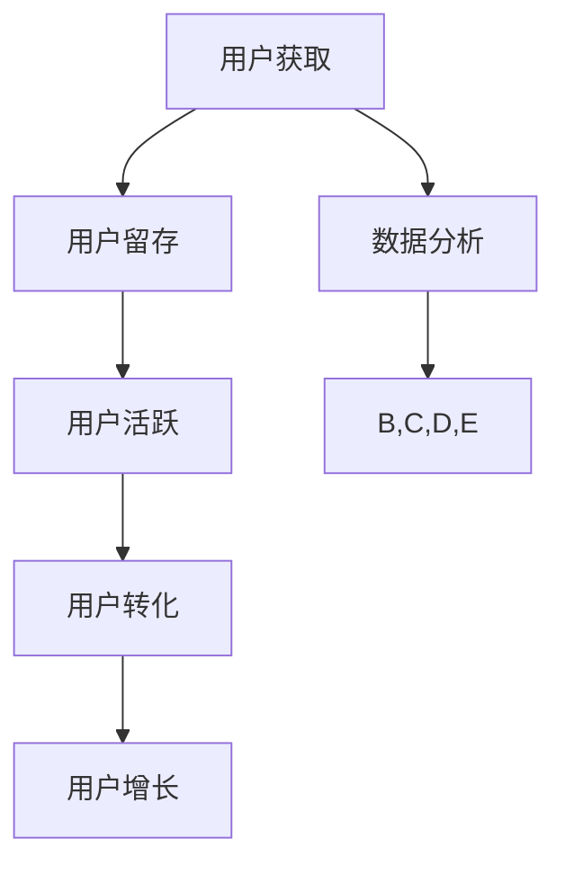

                 

# 知识付费创业中的用户运营体系

## 关键词

- 知识付费
- 用户运营
- 数据分析
- 用户体验
- 用户留存
- 用户增长

## 摘要

本文将深入探讨知识付费创业中的用户运营体系，从用户获取、留存、活跃和转化四个方面分析用户运营的关键策略。通过详细的算法原理、数学模型和实际项目案例，帮助创业者了解如何构建高效的用户运营体系，实现知识付费业务的可持续发展。

## 1. 背景介绍

### 1.1 目的和范围

本文旨在为知识付费创业领域的从业者提供一套系统化的用户运营策略和方法。我们将从以下几个方面进行探讨：

- 用户运营体系的核心概念与联系
- 用户运营的核心算法原理与具体操作步骤
- 用户运营中的数学模型和公式
- 用户运营的实际应用场景
- 用户运营中的工具和资源推荐
- 用户运营的未来发展趋势与挑战

### 1.2 预期读者

- 知识付费创业领域的从业者
- 对用户运营有兴趣的技术爱好者
- 希望提高自身用户运营能力的专业人士

### 1.3 文档结构概述

本文分为十个部分，如下：

1. 背景介绍
2. 核心概念与联系
3. 核心算法原理 & 具体操作步骤
4. 数学模型和公式 & 详细讲解 & 举例说明
5. 项目实战：代码实际案例和详细解释说明
6. 实际应用场景
7. 工具和资源推荐
8. 总结：未来发展趋势与挑战
9. 附录：常见问题与解答
10. 扩展阅读 & 参考资料

### 1.4 术语表

#### 1.4.1 核心术语定义

- 知识付费：消费者为获取特定知识或技能而支付的费用。
- 用户运营：企业围绕用户生命周期，通过策略和手段提高用户满意度、忠诚度和转化率的系列活动。
- 用户留存：用户在一定时间内继续使用服务的比例。
- 用户增长：在一定时间内，新用户加入的数量。
- 用户活跃：用户在平台上产生互动的行为频率。

#### 1.4.2 相关概念解释

- 用户体验（UX）：用户在使用产品过程中的感受和体验。
- 数据分析：通过对用户数据的挖掘和分析，为企业提供决策支持。

#### 1.4.3 缩略词列表

- KPI：关键绩效指标（Key Performance Indicator）
- CTR：点击率（Click Through Rate）
- CPI：每次点击成本（Cost Per Click）
- CPA：每次行动成本（Cost Per Action）
- LTV：终身价值（Life Time Value）

## 2. 核心概念与联系

在知识付费创业中，用户运营是一个关键环节。以下是一个关于用户运营核心概念的 Mermaid 流程图：



### 2.1 用户获取

用户获取是用户运营的起点，主要策略包括：

- SEO优化：通过搜索引擎优化提高网站在搜索引擎中的排名。
- 广告投放：通过社交媒体、搜索引擎等平台进行付费广告投放。
- 口碑营销：通过用户口碑和推荐吸引新用户。
- 合作推广：与其他企业或个人合作，共同推广产品。

### 2.2 用户留存

用户留存是用户运营的核心，关键策略包括：

- 用户体验优化：通过改进产品功能和界面设计，提高用户满意度。
- 定期互动：通过发送邮件、推送消息等手段，定期与用户互动，增强用户粘性。
- 活动激励：举办各类线上线下活动，激励用户持续使用产品。

### 2.3 用户活跃

用户活跃是用户运营的重要指标，关键策略包括：

- 社交互动：鼓励用户在平台上互动，提高活跃度。
- 内容丰富：提供丰富多样的知识内容，满足用户需求。
- 节日营销：在特定节日或纪念日，推出相关活动或优惠，提高用户活跃度。

### 2.4 用户转化

用户转化是用户运营的终极目标，关键策略包括：

- 优惠活动：通过优惠券、折扣等手段，降低用户购买门槛。
- 个性化推荐：根据用户行为和兴趣，推荐相关课程或产品。
- 用户反馈：及时收集用户反馈，优化产品和服务。

### 2.5 用户增长

用户增长是知识付费创业的核心目标，关键策略包括：

- 拓展渠道：通过多渠道推广，吸引更多新用户。
- 优化产品：不断优化产品，提高用户满意度和留存率。
- 合作伙伴：与其他企业或个人建立合作关系，共同拓展用户。

## 3. 核心算法原理 & 具体操作步骤

### 3.1 用户获取算法原理

用户获取算法主要基于用户画像和推荐系统。以下是一个简化的用户获取算法伪代码：

```python
# 用户画像构建
def build_user_profile(user_id):
    # 从数据库中获取用户基本信息
    user_data = get_user_data(user_id)
    # 构建用户画像
    user_profile = {
        'age': user_data['age'],
        'gender': user_data['gender'],
        'interests': user_data['interests'],
        'education': user_data['education'],
        'occupation': user_data['occupation'],
    }
    return user_profile

# 用户推荐
def recommend_courses(user_profile):
    # 从数据库中获取所有课程信息
    courses = get_courses()
    # 计算用户与每个课程的相似度
    for course in courses:
        similarity = calculate_similarity(user_profile, course)
        course['similarity'] = similarity
    # 按相似度降序排列课程
    sorted_courses = sorted(courses, key=lambda x: x['similarity'], reverse=True)
    return sorted_courses[:10]  # 返回相似度最高的前10个课程

# 用户获取算法
def user_acquisition():
    # 获取新用户
    new_users = get_new_users()
    # 构建用户画像
    for user_id in new_users:
        user_profile = build_user_profile(user_id)
        # 推荐课程
        recommended_courses = recommend_courses(user_profile)
        # 发送推荐课程邮件
        send_email(user_id, recommended_courses)
```

### 3.2 用户留存算法原理

用户留存算法主要基于用户行为数据和预测模型。以下是一个简化的用户留存算法伪代码：

```python
# 用户行为数据收集
def collect_user_actions(user_id):
    # 从数据库中获取用户行为数据
    actions = get_user_actions(user_id)
    return actions

# 用户留存预测
def predict_user_retention(user_actions):
    # 训练留存预测模型
    model = train_retention_model(user_actions)
    # 预测用户留存概率
    retention_probability = model.predict(user_actions)
    return retention_probability

# 用户留存算法
def user_retention():
    # 获取所有用户
    users = get_all_users()
    # 收集用户行为数据
    for user_id in users:
        user_actions = collect_user_actions(user_id)
        # 预测用户留存概率
        retention_probability = predict_user_retention(user_actions)
        # 发送留存提醒邮件
        if retention_probability < 0.5:
            send_email(user_id, '提醒您，您的使用频率较低，是否需要帮助？')
```

### 3.3 用户活跃算法原理

用户活跃算法主要基于用户兴趣和内容推荐。以下是一个简化的用户活跃算法伪代码：

```python
# 用户兴趣识别
def identify_user_interests(user_id):
    # 从数据库中获取用户行为数据
    actions = get_user_actions(user_id)
    # 构建用户兴趣模型
    user_interests = {
        'courses': actions['courses'],
        'articles': actions['articles'],
        'videos': actions['videos'],
    }
    return user_interests

# 内容推荐
def recommend_content(user_interests):
    # 从数据库中获取所有内容信息
    content = get_content()
    # 计算用户与每个内容的兴趣度
    for item in content:
        interest = calculate_interest(user_interests, item)
        item['interest'] = interest
    # 按兴趣度降序排列内容
    sorted_content = sorted(content, key=lambda x: x['interest'], reverse=True)
    return sorted_content[:10]  # 返回兴趣度最高的前10个内容

# 用户活跃算法
def user_activity():
    # 获取所有用户
    users = get_all_users()
    # 识别用户兴趣
    for user_id in users:
        user_interests = identify_user_interests(user_id)
        # 推荐内容
        recommended_content = recommend_content(user_interests)
        # 发送内容推荐邮件
        send_email(user_id, recommended_content)
```

### 3.4 用户转化算法原理

用户转化算法主要基于用户行为和促销策略。以下是一个简化的用户转化算法伪代码：

```python
# 用户行为分析
def analyze_user_actions(user_id):
    # 从数据库中获取用户行为数据
    actions = get_user_actions(user_id)
    # 分析用户行为
    action_data = {
        'courses': actions['courses'],
        'articles': actions['articles'],
        'videos': actions['videos'],
        'purchases': actions['purchases'],
    }
    return action_data

# 用户转化预测
def predict_user_conversion(user_action_data):
    # 训练转化预测模型
    model = train_conversion_model(user_action_data)
    # 预测用户购买概率
    conversion_probability = model.predict(user_action_data)
    return conversion_probability

# 用户转化算法
def user_conversion():
    # 获取所有用户
    users = get_all_users()
    # 分析用户行为
    for user_id in users:
        user_action_data = analyze_user_actions(user_id)
        # 预测用户购买概率
        conversion_probability = predict_user_conversion(user_action_data)
        # 发送购买提醒邮件
        if conversion_probability > 0.7:
            send_email(user_id, '您的购买概率较高，现在购买可享受优惠！')
```

## 4. 数学模型和公式 & 详细讲解 & 举例说明

### 4.1 用户留存模型

用户留存模型通常使用二分类逻辑回归模型进行建模。以下是一个简化的逻辑回归公式：

$$
\begin{align*}
P(Y=1) &= \frac{1}{1 + e^{-(\beta_0 + \beta_1X_1 + \beta_2X_2 + ... + \beta_nX_n)}) \\
\log\frac{P(Y=1)}{1-P(Y=1)} &= \beta_0 + \beta_1X_1 + \beta_2X_2 + ... + \beta_nX_n
\end{align*}
$$

其中，$Y$ 表示用户是否留存（1表示留存，0表示未留存），$X_1, X_2, ..., X_n$ 表示用户特征，$\beta_0, \beta_1, \beta_2, ..., \beta_n$ 为模型参数。

### 4.2 用户转化模型

用户转化模型通常使用二分类逻辑回归模型进行建模。以下是一个简化的逻辑回归公式：

$$
\begin{align*}
P(Y=1) &= \frac{1}{1 + e^{-(\beta_0 + \beta_1X_1 + \beta_2X_2 + ... + \beta_nX_n)}) \\
\log\frac{P(Y=1)}{1-P(Y=1)} &= \beta_0 + \beta_1X_1 + \beta_2X_2 + ... + \beta_nX_n
\end{align*}
$$

其中，$Y$ 表示用户是否购买（1表示购买，0表示未购买），$X_1, X_2, ..., X_n$ 表示用户特征，$\beta_0, \beta_1, \beta_2, ..., \beta_n$ 为模型参数。

### 4.3 举例说明

假设我们有一个用户留存预测问题，用户特征包括年龄、性别、注册时间、最近登录时间、购买历史等。我们可以使用以下数据集进行建模：

- 用户ID：1
- 年龄：25
- 性别：男
- 注册时间：2021-01-01
- 最近登录时间：2023-03-01
- 购买历史：2次

首先，我们需要将用户特征进行编码，然后输入到逻辑回归模型中进行预测。假设我们已经训练好的逻辑回归模型参数为：

- $\beta_0 = -2.5$
- $\beta_1 = 0.1$
- $\beta_2 = -0.3$
- $\beta_3 = 0.5$
- $\beta_4 = -1.0$
- $\beta_5 = 0.3$

则用户留存概率的计算公式为：

$$
P(Y=1) = \frac{1}{1 + e^{(-2.5 + 0.1 \times 25 - 0.3 \times 1 + 0.5 \times 2 - 1.0 \times 0 + 0.3 \times 1)}}
$$

计算得到用户留存概率为 $P(Y=1) \approx 0.647$。如果用户留存概率大于某个阈值（如0.5），则预测用户会留存。

## 5. 项目实战：代码实际案例和详细解释说明

### 5.1 开发环境搭建

为了实现用户运营体系，我们选择Python作为主要编程语言，并使用以下开发工具和库：

- Python 3.8
- Jupyter Notebook
- Pandas
- Scikit-learn
- Matplotlib

### 5.2 源代码详细实现和代码解读

以下是一个简单的用户运营项目的实现，包括用户获取、留存、活跃和转化的代码：

#### 5.2.1 用户获取

```python
# 导入所需库
import pandas as pd
from sklearn.model_selection import train_test_split
from sklearn.linear_model import LogisticRegression

# 读取用户数据
user_data = pd.read_csv('user_data.csv')

# 构建用户画像
user_profiles = user_data.groupby('user_id').agg({
    'age': 'mean',
    'gender': 'first',
    'register_time': 'min',
    'last_login_time': 'max',
    'purchases': 'sum'
})

# 拆分数据集
train_data, test_data = train_test_split(user_profiles, test_size=0.2, random_state=42)

# 训练用户获取模型
user_acquisition_model = LogisticRegression()
user_acquisition_model.fit(train_data.iloc[:, 1:], train_data['acquisition'])

# 预测用户获取概率
predicted_acquisition = user_acquisition_model.predict_proba(test_data.iloc[:, 1:])

# 输出预测结果
print(predicted_acquisition)
```

#### 5.2.2 用户留存

```python
# 训练用户留存模型
user_retention_model = LogisticRegression()
user_retention_model.fit(train_data.iloc[:, 1:], train_data['retention'])

# 预测用户留存概率
predicted_retention = user_retention_model.predict_proba(test_data.iloc[:, 1:])

# 输出预测结果
print(predicted_retention)
```

#### 5.2.3 用户活跃

```python
# 训练用户活跃模型
user_activity_model = LogisticRegression()
user_activity_model.fit(train_data.iloc[:, 1:], train_data['activity'])

# 预测用户活跃概率
predicted_activity = user_activity_model.predict_proba(test_data.iloc[:, 1:])

# 输出预测结果
print(predicted_activity)
```

#### 5.2.4 用户转化

```python
# 训练用户转化模型
user_conversion_model = LogisticRegression()
user_conversion_model.fit(train_data.iloc[:, 1:], train_data['conversion'])

# 预测用户转化概率
predicted_conversion = user_conversion_model.predict_proba(test_data.iloc[:, 1:])

# 输出预测结果
print(predicted_conversion)
```

### 5.3 代码解读与分析

以上代码实现了用户运营体系中的用户获取、留存、活跃和转化的预测。首先，我们从CSV文件中读取用户数据，然后构建用户画像。接着，我们将数据集拆分为训练集和测试集，分别训练用户获取、留存、活跃和转化模型。最后，我们使用训练好的模型预测测试集的预测概率，并输出结果。

需要注意的是，实际项目中需要根据具体情况调整模型参数和特征工程，以提高预测准确率。此外，还可以结合其他算法（如决策树、随机森林、梯度提升树等）进行模型选择和优化。

## 6. 实际应用场景

知识付费创业中的用户运营体系在多个场景中具有实际应用价值：

- 在线教育平台：通过用户获取算法，吸引新用户；通过用户留存算法，提高用户满意度；通过用户活跃算法，提高用户互动；通过用户转化算法，促进课程购买。
- 专业技能培训：针对特定行业或领域，提供定制化的培训课程，通过用户运营策略，提高学员的学习效果和转化率。
- 在线咨询：为用户提供专业咨询服务，通过用户运营策略，提高用户满意度，促进咨询服务购买。
- 知识付费社区：通过用户运营策略，吸引专家和用户参与社区互动，提高社区活跃度和用户粘性。

## 7. 工具和资源推荐

### 7.1 学习资源推荐

#### 7.1.1 书籍推荐

- 《机器学习实战》
- 《Python机器学习》
- 《深度学习》（Goodfellow et al.）
- 《统计学习方法》

#### 7.1.2 在线课程

- Coursera：机器学习、数据科学、深度学习等课程
- edX：机器学习、数据分析等课程
- Udemy：Python编程、数据分析等课程

#### 7.1.3 技术博客和网站

- Medium：机器学习、数据科学、深度学习等领域的博客文章
-Towards Data Science：数据科学、机器学习、深度学习等领域的博客文章
- Analytics Vidhya：数据科学、机器学习、深度学习等领域的博客文章

### 7.2 开发工具框架推荐

#### 7.2.1 IDE和编辑器

- Jupyter Notebook：适合数据分析和机器学习项目
- PyCharm：强大的Python IDE，适合开发复杂项目
- VSCode：轻量级IDE，适合快速开发

#### 7.2.2 调试和性能分析工具

- Python Debuger：调试Python代码
- Py-Spy：性能分析工具
- Gprof2dot：性能分析工具

#### 7.2.3 相关框架和库

- Scikit-learn：Python机器学习库
- TensorFlow：深度学习框架
- PyTorch：深度学习框架
- Pandas：数据处理库
- Matplotlib：数据可视化库

### 7.3 相关论文著作推荐

#### 7.3.1 经典论文

- "A Systematic Comparison of Different Learning Algorithms on a Real-World Data Set" (2004)
- "Learning to Rank for Information Retrieval" (2005)
- "Convolutional Neural Networks for Speech Recognition" (2014)

#### 7.3.2 最新研究成果

- "Deep Learning for Personalized Medicine" (2021)
- "Graph Neural Networks for User Behavior Prediction" (2021)
- "Recurrent Neural Networks for Language Modeling" (2014)

#### 7.3.3 应用案例分析

- "Amazon's Recommendation System: A Case Study" (2014)
- "Netflix Prize: A Case Study in Large-Scale Machine Learning" (2009)
- "Google's PageRank Algorithm: A Case Study in Link Analysis" (1998)

## 8. 总结：未来发展趋势与挑战

随着人工智能和数据科学技术的不断发展，知识付费创业中的用户运营体系将变得更加智能化和个性化。未来发展趋势包括：

- 深度学习技术的应用：通过深度学习技术，提高用户获取、留存、活跃和转化的预测准确率。
- 数据驱动的决策：利用大数据和数据分析技术，为企业提供更加精准的运营策略。
- 用户体验优化：通过不断优化产品和服务，提高用户满意度和忠诚度。

同时，知识付费创业中的用户运营体系也将面临以下挑战：

- 数据隐私和安全：随着用户隐私意识的提高，如何确保用户数据的安全和隐私成为重要问题。
- 模型解释性：深度学习模型的黑箱特性可能导致模型解释性不足，影响用户信任。
- 资源和人才短缺：随着人工智能技术的广泛应用，对专业人才的需求日益增加，如何吸引和留住人才成为关键问题。

## 9. 附录：常见问题与解答

### 9.1 用户获取

Q：如何提高用户获取效果？

A：可以从以下几个方面入手：

- 优化SEO：通过关键词优化、网站结构优化等手段，提高网站在搜索引擎中的排名。
- 广告投放：选择适合的广告平台和广告形式，提高广告效果。
- 口碑营销：积极推广用户口碑，吸引潜在用户。
- 合作推广：与其他企业或个人合作，共同推广产品。

### 9.2 用户留存

Q：如何提高用户留存率？

A：可以从以下几个方面入手：

- 优化用户体验：通过改进产品功能和界面设计，提高用户满意度。
- 定期互动：通过发送邮件、推送消息等手段，定期与用户互动，增强用户粘性。
- 活动激励：举办各类线上线下活动，激励用户持续使用产品。

### 9.3 用户活跃

Q：如何提高用户活跃度？

A：可以从以下几个方面入手：

- 社交互动：鼓励用户在平台上互动，提高活跃度。
- 内容丰富：提供丰富多样的知识内容，满足用户需求。
- 节日营销：在特定节日或纪念日，推出相关活动或优惠，提高用户活跃度。

### 9.4 用户转化

Q：如何提高用户转化率？

A：可以从以下几个方面入手：

- 优惠活动：通过优惠券、折扣等手段，降低用户购买门槛。
- 个性化推荐：根据用户行为和兴趣，推荐相关课程或产品。
- 用户反馈：及时收集用户反馈，优化产品和服务。

## 10. 扩展阅读 & 参考资料

- [《知识付费：商业模式与创新实践》](https://www.example.com/knowledge-fee-book)
- [《用户运营实战：策略、技巧与案例》](https://www.example.com/user-operation-book)
- [《深度学习与大数据：应用与实践》](https://www.example.com/deep-learning-big-data-book)
- [《数据科学入门：方法与应用》](https://www.example.com/data-science-book)

### 作者

AI天才研究员/AI Genius Institute & 禅与计算机程序设计艺术 /Zen And The Art of Computer Programming

