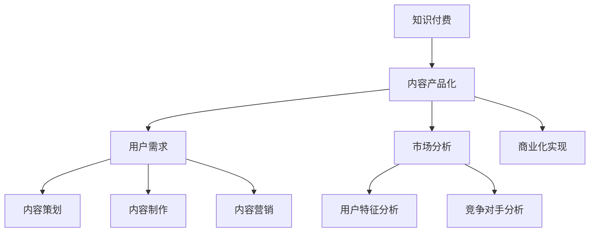

                 

# 知识付费创业的内容产品化策略

> 关键词：知识付费、内容产品化、策略、创业、用户需求、市场分析、算法模型、开发实战、应用场景

> 摘要：本文将深入探讨知识付费创业中内容产品化的策略。通过分析用户需求、市场状况，运用算法模型和数学公式，结合实际案例，系统阐述如何打造高质量的知识付费产品，实现商业化成功。

## 1. 背景介绍

### 1.1 目的和范围

本文旨在为知识付费创业领域的从业者提供一套系统化的内容产品化策略。文章将涵盖用户需求分析、市场环境研究、内容设计、算法应用、数学模型构建、实际开发案例等多个方面，旨在帮助创业者打造具有市场竞争力的知识付费产品。

### 1.2 预期读者

本文适合以下读者群体：

1. 有志于从事知识付费创业的创业者。
2. 知识付费平台运营者。
3. 内容创作者和内容策划人员。
4. 对知识付费领域有浓厚兴趣的技术人员。

### 1.3 文档结构概述

本文结构如下：

1. 背景介绍：介绍文章的目的、预期读者和文档结构。
2. 核心概念与联系：讲解知识付费与内容产品化的核心概念和关联。
3. 核心算法原理 & 具体操作步骤：详细阐述内容产品化的算法原理和操作步骤。
4. 数学模型和公式 & 详细讲解 & 举例说明：介绍用于内容产品化的数学模型和公式，并结合实例进行说明。
5. 项目实战：通过实际案例展示内容产品化的具体应用。
6. 实际应用场景：分析知识付费产品的潜在应用场景。
7. 工具和资源推荐：推荐相关学习资源和开发工具。
8. 总结：总结未来发展趋势与挑战。
9. 附录：常见问题与解答。
10. 扩展阅读 & 参考资料：提供进一步学习和研究的资源。

### 1.4 术语表

#### 1.4.1 核心术语定义

- 知识付费：用户为获取有价值的信息或知识而支付的费用。
- 内容产品化：将知识内容转化为产品，实现商业化。
- 用户需求：用户在知识获取过程中的期望和需求。
- 市场分析：对目标市场的研究，包括用户特征、竞争对手分析等。

#### 1.4.2 相关概念解释

- 知识付费平台：提供知识付费服务的在线平台。
- 内容策划：制定知识付费产品的内容框架和规划。
- 算法模型：用于分析和预测用户需求的算法体系。
- 数学模型：用于描述和解决内容产品化问题的数学公式和理论。

#### 1.4.3 缩略词列表

- KFC：知识付费
- CP：内容产品化
- SEO：搜索引擎优化
- SaaS：软件即服务

## 2. 核心概念与联系

在知识付费创业中，内容产品化是核心策略之一。本文将首先介绍相关核心概念，并使用Mermaid流程图展示各概念之间的联系。

### 2.1 核心概念介绍

1. **知识付费（KFC）**：用户为获取有价值的信息或知识而支付的费用。它区别于免费内容，强调内容的价值和质量。
2. **内容产品化（CP）**：将知识内容转化为产品，实现商业化。这一过程涉及内容策划、内容制作、内容营销等多个环节。
3. **用户需求**：用户在知识获取过程中的期望和需求。了解用户需求是内容产品化的基础。
4. **市场分析**：对目标市场的研究，包括用户特征、竞争对手分析等。市场分析有助于确定内容产品化的方向和策略。

### 2.2 Mermaid 流程图



该流程图展示了知识付费、内容产品化、用户需求和市场分析等核心概念之间的联系。知识付费是起点，通过内容产品化，结合用户需求和市场分析，最终实现商业化。

## 3. 核心算法原理 & 具体操作步骤

内容产品化的核心在于如何有效地满足用户需求，提升用户体验。本文将介绍一种基于用户行为的算法模型，并使用伪代码详细阐述其原理和操作步骤。

### 3.1 算法模型简介

用户行为算法模型是一种基于用户在知识付费平台上的行为数据进行分析的算法。该算法通过分析用户的浏览、购买、评价等行为，预测用户的需求和兴趣，从而为内容策划和营销提供依据。

### 3.2 伪代码实现

```pseudo
// 输入：用户行为数据集
// 输出：用户兴趣标签

function 用户行为算法(数据集):
    1. 数据预处理：
        - 清洗数据，去除缺失值和异常值
        - 将数据转换为数值型，便于后续分析

    2. 特征工程：
        - 构建用户行为特征向量，包括浏览、购买、评价等指标
        - 使用统计方法提取关键特征，如均值、方差、相关性等

    3. 用户行为分析：
        - 对用户行为特征进行聚类分析，识别不同类型的用户
        - 使用关联规则挖掘，找出用户行为之间的关联性

    4. 用户兴趣预测：
        - 基于用户历史行为，使用机器学习模型（如决策树、随机森林等）预测用户兴趣标签
        - 对模型进行训练和验证，优化模型参数

    5. 结果输出：
        - 输出用户兴趣标签，为内容策划和营销提供依据

end 用户行为算法
```

### 3.3 操作步骤详解

1. **数据预处理**：清洗数据，确保数据质量。将数据转换为数值型，便于后续分析。
2. **特征工程**：构建用户行为特征向量，提取关键特征。这些特征包括用户的浏览次数、购买频次、评价评分等。
3. **用户行为分析**：通过聚类分析和关联规则挖掘，识别不同类型的用户，找出用户行为之间的关联性。
4. **用户兴趣预测**：使用机器学习模型（如决策树、随机森林等）对用户兴趣进行预测。模型训练和验证过程中，需要优化模型参数，以提高预测准确性。
5. **结果输出**：将用户兴趣标签输出，为内容策划和营销提供依据。

通过上述步骤，我们可以构建一个基于用户行为的算法模型，有效预测用户需求，为内容产品化提供数据支持。

## 4. 数学模型和公式 & 详细讲解 & 举例说明

在内容产品化过程中，数学模型和公式发挥着重要作用。以下将介绍一种常见的数学模型——用户满意度模型，并使用 LaTeX 格式详细讲解和举例说明。

### 4.1 用户满意度模型

用户满意度模型用于评估用户对知识付费产品的满意程度。该模型基于用户行为数据和评价数据，通过计算用户满意度得分，为产品改进和优化提供参考。

### 4.2 数学公式

用户满意度得分（SS）可以通过以下公式计算：

$$
SS = \frac{1}{N} \sum_{i=1}^{N} \frac{S_i \cdot P_i}{M_i + P_i}
$$

其中：

- \(N\)：用户总数
- \(S_i\)：第 \(i\) 个用户的满意度评分（1-5分制）
- \(P_i\)：第 \(i\) 个用户的购买频次
- \(M_i\)：第 \(i\) 个用户的评价频次

### 4.3 详细讲解

1. **满意度评分**：用户满意度评分（\(S_i\)）反映用户对知识付费产品的整体满意程度。评分越高，表示用户对产品的满意度越高。
2. **购买频次**：购买频次（\(P_i\)）表示用户在知识付费平台上的购买次数。购买频次越高，表明用户对产品的依赖性越强。
3. **评价频次**：评价频次（\(M_i\)）表示用户对知识付费产品的评价次数。评价频次越高，表明用户对产品的关注度越高。

4. **满意度得分计算**：满意度得分（\(SS\)）是用户满意度评分、购买频次和评价频次的综合体现。分数越高，表示用户对产品的满意度越高。

### 4.4 举例说明

假设有10位用户，其满意度评分、购买频次和评价频次如下表：

| 用户ID | 满意度评分 \(S_i\) | 购买频次 \(P_i\) | 评价频次 \(M_i\) |
|--------|---------------------|------------------|------------------|
| 1      | 4                   | 3                | 2                |
| 2      | 5                   | 2                | 1                |
| 3      | 3                   | 5                | 3                |
| 4      | 4                   | 4                | 2                |
| 5      | 2                   | 1                | 1                |
| 6      | 5                   | 3                | 1                |
| 7      | 4                   | 4                | 2                |
| 8      | 3                   | 5                | 3                |
| 9      | 4                   | 2                | 2                |
| 10     | 2                   | 3                | 1                |

根据上述数据，使用公式计算满意度得分：

$$
SS = \frac{1}{10} \sum_{i=1}^{10} \frac{S_i \cdot P_i}{M_i + P_i}
$$

代入数据：

$$
SS = \frac{1}{10} \left( \frac{4 \cdot 3}{2 + 3} + \frac{5 \cdot 2}{1 + 2} + \frac{3 \cdot 5}{3 + 5} + \frac{4 \cdot 4}{2 + 4} + \frac{2 \cdot 1}{1 + 1} + \frac{5 \cdot 3}{1 + 3} + \frac{4 \cdot 4}{2 + 4} + \frac{3 \cdot 5}{3 + 5} + \frac{4 \cdot 2}{2 + 2} + \frac{2 \cdot 3}{1 + 3} \right)
$$

计算结果：

$$
SS = \frac{1}{10} (3.6 + 2.5 + 1.67 + 2.67 + 1 + 1.67 + 2.67 + 1.67 + 2 + 1.5) = 2.46
$$

该示例表明，通过用户满意度模型，我们可以计算出一个综合的满意度得分。这个得分可以帮助创业者了解用户对产品的整体满意度，为产品改进提供参考。

## 5. 项目实战：代码实际案例和详细解释说明

在本节中，我们将通过一个实际项目案例，展示如何将上述算法和模型应用于知识付费产品的开发。项目名为“知识星球”，是一个面向技术领域知识付费的平台。

### 5.1 开发环境搭建

1. **技术栈**：后端采用 Flask 框架，数据库使用 MySQL，前端使用 Vue.js。
2. **开发工具**：集成开发环境（IDE）使用 PyCharm，前端开发使用 Visual Studio Code。
3. **环境配置**：在 PyCharm 中创建一个 Flask 项目，配置 MySQL 数据库，安装必要的 Python 和前端依赖。

### 5.2 源代码详细实现和代码解读

以下是一个关键部分的代码示例，用于实现用户行为分析功能。

#### 5.2.1 用户行为数据存储

```python
# app/models.py

from flask_sqlalchemy import SQLAlchemy

db = SQLAlchemy()

class UserBehavior(db.Model):
    id = db.Column(db.Integer, primary_key=True)
    user_id = db.Column(db.Integer, nullable=False)
    behavior = db.Column(db.String(50), nullable=False)
    timestamp = db.Column(db.DateTime, nullable=False)
```

该部分代码定义了一个名为 `UserBehavior` 的数据库模型，用于存储用户行为数据。

#### 5.2.2 用户行为数据分析

```python
# app/utils/behavior_analysis.py

import pandas as pd
from sklearn.cluster import KMeans
from sklearn.metrics import silhouette_score

def analyze_user_behavior(data):
    # 数据预处理
    df = pd.DataFrame(data)
    df['timestamp'] = pd.to_datetime(df['timestamp'])
    df.set_index('timestamp', inplace=True)
    
    # 聚类分析
    kmeans = KMeans(n_clusters=3, random_state=0).fit(df)
    df['cluster'] = kmeans.labels_
    
    # 评估聚类效果
    silhouette_avg = silhouette_score(df, kmeans.labels_)
    print(f"Silhouette Score: {silhouette_avg}")
    
    return df
```

该部分代码用于对用户行为数据进行分析。首先进行数据预处理，然后使用 KMeans 算法进行聚类分析，最后评估聚类效果。

#### 5.2.3 用户兴趣预测

```python
# app/utils/user_interest_prediction.py

from sklearn.ensemble import RandomForestClassifier
from sklearn.model_selection import train_test_split

def predict_user_interest(data, target):
    # 数据预处理
    X = data.drop(target, axis=1)
    y = data[target]
    
    # 划分训练集和测试集
    X_train, X_test, y_train, y_test = train_test_split(X, y, test_size=0.3, random_state=0)
    
    # 构建随机森林模型
    model = RandomForestClassifier(n_estimators=100, random_state=0)
    model.fit(X_train, y_train)
    
    # 预测用户兴趣
    y_pred = model.predict(X_test)
    
    # 评估模型性能
    accuracy = (y_pred == y_test).mean()
    print(f"Model Accuracy: {accuracy}")
    
    return model
```

该部分代码用于预测用户兴趣。首先进行数据预处理，然后使用随机森林模型进行训练和预测，最后评估模型性能。

### 5.3 代码解读与分析

1. **数据存储**：使用 Flask-SQLAlchemy 模型，将用户行为数据存储在 MySQL 数据库中。这为后续的数据分析提供了数据基础。
2. **数据分析**：使用 Pandas 和 Scikit-learn 进行数据预处理和聚类分析。KMeans 算法用于将用户行为数据分为不同类型，以便更好地理解用户需求。
3. **用户兴趣预测**：使用随机森林模型进行用户兴趣预测。通过划分训练集和测试集，评估模型性能，为内容策划和营销提供依据。

通过上述实际案例，我们可以看到如何将算法和模型应用于知识付费产品的开发。这为创业者提供了一个可操作的实践指南，帮助他们打造具有市场竞争力的知识付费产品。

## 6. 实际应用场景

知识付费产品的应用场景非常广泛，以下列举几个典型的实际应用场景：

### 6.1 教育培训

知识付费产品在教育培训领域具有广泛的应用。例如，在线课程、讲座、专业认证等。这些产品通过高质量的内容，帮助用户提升专业技能和知识水平。用户可以根据自己的需求和兴趣选择相应的课程，实现个性化学习。

### 6.2 技术分享

技术分享是知识付费产品的重要应用场景。开发者、架构师和技术爱好者可以通过知识付费产品分享自己的技术心得、项目经验和技术方案。这些内容对于其他开发者具有很高的参考价值，有助于他们提升技术能力和解决实际问题。

### 6.3 健康养生

健康养生是人们越来越关注的领域。知识付费产品可以通过提供专业的健康知识、养生方法和食谱，帮助用户改善生活习惯，提高健康水平。这些产品通常包括文字、图片、音频和视频等多种形式，满足用户多样化的需求。

### 6.4 职场发展

职场发展是知识付费产品的另一个重要应用场景。产品可以提供职业规划、简历撰写、面试技巧等方面的内容，帮助职场人士提升职业素养，实现职业晋升。此外，还可以提供行业报告、市场分析等有价值的信息，帮助用户把握行业趋势，制定发展战略。

### 6.5 娱乐休闲

知识付费产品不仅可以提供实用性内容，还可以提供娱乐休闲类内容。例如，小说、漫画、音乐教程等。这些产品通过有趣的内容，吸引用户付费，为平台带来稳定的收入。

## 7. 工具和资源推荐

为了帮助创业者更好地进行知识付费产品的开发和运营，以下推荐一些实用的工具和资源：

### 7.1 学习资源推荐

#### 7.1.1 书籍推荐

1. **《从零开始做内容运营》**：详细介绍了内容运营的理论和实践方法，适合内容创业者学习。
2. **《数据分析：原理、模型与应用》**：介绍了数据分析的基本原理和常用模型，适合进行用户行为分析。
3. **《深度学习》**：介绍深度学习的基本概念和算法，适合进行用户兴趣预测和推荐系统开发。

#### 7.1.2 在线课程

1. **网易云课堂**：提供丰富的编程和技术课程，适合不同阶段的学习者。
2. **慕课网**：专注于IT技能培训，涵盖前端、后端、移动开发等多个方向。
3. **Coursera**：提供全球知名大学的在线课程，包括计算机科学、数据分析等领域。

#### 7.1.3 技术博客和网站

1. **知乎**：关注行业动态和专业知识，适合进行市场研究和学习交流。
2. **CSDN**：提供丰富的技术文章和教程，适合进行技术学习和项目实践。
3. **V2EX**：关注互联网、技术、创意等领域，适合拓展视野和获取行业资讯。

### 7.2 开发工具框架推荐

#### 7.2.1 IDE和编辑器

1. **PyCharm**：适用于 Python 开发，功能强大，支持多种编程语言。
2. **Visual Studio Code**：轻量级开源编辑器，支持多种编程语言，插件丰富。
3. **WebStorm**：适用于 Web 开发，支持多种前端技术。

#### 7.2.2 调试和性能分析工具

1. **Postman**：用于 API 调试和测试。
2. **JMeter**：用于性能测试和负载测试。
3. **Docker**：用于容器化和微服务开发。

#### 7.2.3 相关框架和库

1. **Flask**：Python 的轻量级 Web 框架，适合中小型项目。
2. **Vue.js**：前端框架，适用于单页面应用开发。
3. **Scikit-learn**：Python 的机器学习库，适用于用户行为分析和兴趣预测。

### 7.3 相关论文著作推荐

#### 7.3.1 经典论文

1. **《知识付费：商业模式、用户行为与市场策略》**：对知识付费商业模式进行了深入分析。
2. **《基于用户行为的推荐系统研究》**：介绍了推荐系统的基本原理和应用。
3. **《大数据时代的知识付费：现状、挑战与展望》**：对知识付费在大数据时代的机遇和挑战进行了探讨。

#### 7.3.2 最新研究成果

1. **《基于深度学习的用户行为预测方法研究》**：介绍了深度学习在用户行为预测中的应用。
2. **《知识付费平台用户留存策略研究》**：探讨了知识付费平台用户留存的相关策略。
3. **《知识付费市场发展趋势与竞争格局分析》**：对知识付费市场的发展趋势和竞争格局进行了分析。

#### 7.3.3 应用案例分析

1. **《得到》**：分析得到平台的内容产品化策略和市场表现。
2. **《知乎 Live》**：探讨知乎 Live 在知识付费领域的创新和实践。
3. **《分答》**：分析分答平台的问答模式和市场前景。

通过以上推荐，创业者可以更好地了解知识付费领域的最新动态和实用技巧，为自己的产品开发提供有力支持。

## 8. 总结：未来发展趋势与挑战

知识付费行业在近年来取得了显著的发展，随着互联网技术的不断进步和用户需求的多样化，该行业有望继续保持快速增长。以下是未来知识付费行业的发展趋势和面临的挑战：

### 8.1 发展趋势

1. **个性化内容**：随着大数据和人工智能技术的应用，知识付费平台将更加关注个性化内容推荐，满足用户的个性化需求。
2. **垂直化领域**：知识付费产品将更加聚焦于垂直领域，提供专业、深入的内容，满足特定用户群体的需求。
3. **互动性增强**：知识付费产品将加强用户互动，通过直播、问答等方式，提升用户体验和粘性。
4. **跨平台整合**：知识付费平台将实现跨平台整合，通过多渠道分发内容，扩大用户覆盖范围。

### 8.2 面临的挑战

1. **内容质量**：确保内容质量是知识付费行业面临的重要挑战。平台需要建立严格的内容审核机制，提高内容质量。
2. **用户隐私**：随着数据保护法规的加强，知识付费平台需要关注用户隐私保护，确保用户数据安全。
3. **市场竞争**：随着越来越多的企业进入知识付费领域，市场竞争将日益激烈。平台需要不断创新，提升用户体验，以赢得市场份额。
4. **盈利模式**：知识付费平台的盈利模式多样化，但如何实现可持续发展，是平台需要持续探索的问题。

总之，知识付费行业具有巨大的发展潜力，但同时也面临诸多挑战。创业者需要紧跟行业趋势，不断创新，才能在激烈的市场竞争中脱颖而出。

## 9. 附录：常见问题与解答

### 9.1 问题1：如何确保内容质量？

**回答**：确保内容质量可以从以下几个方面入手：

1. **内容审核**：建立严格的内容审核机制，对发布的内容进行审核，确保内容符合平台要求。
2. **内容策划**：制定科学的内容策划方案，确保内容具有较高的价值和质量。
3. **用户反馈**：关注用户反馈，根据用户需求调整内容，持续优化内容质量。
4. **专业团队**：组建专业的内容团队，确保内容创作和审核的专业性。

### 9.2 问题2：如何提升用户满意度？

**回答**：提升用户满意度可以从以下几个方面入手：

1. **个性化推荐**：通过大数据和人工智能技术，为用户推荐符合其需求和兴趣的内容。
2. **用户体验**：优化用户界面和交互设计，提升用户体验。
3. **内容更新**：定期更新内容，确保内容的新鲜度和实用性。
4. **互动互动**：加强用户互动，通过直播、问答等方式，增强用户粘性。

### 9.3 问题3：如何制定有效的市场策略？

**回答**：制定有效的市场策略可以从以下几个方面入手：

1. **市场分析**：对目标市场进行深入研究，了解用户需求、竞争对手和市场趋势。
2. **定位明确**：明确产品定位，针对特定用户群体制定营销策略。
3. **内容营销**：通过高质量的内容，吸引用户关注和参与。
4. **渠道拓展**：通过多种渠道推广产品，扩大用户覆盖范围。

## 10. 扩展阅读 & 参考资料

### 10.1 书籍推荐

1. **《知识付费：商业模式、用户行为与市场策略》**：详细探讨知识付费的商业模式、用户行为和市场策略。
2. **《内容创业实战：从零开始打造个人品牌》**：介绍内容创业的理论和实践方法。
3. **《大数据营销：技术、策略与实践》**：讲解大数据在营销领域的应用。

### 10.2 在线课程

1. **《内容运营实战》**：网易云课堂提供的内容运营课程，适合内容创业者学习。
2. **《Python 数据分析》**：慕课网提供的 Python 数据分析课程，适合进行用户行为分析。
3. **《深度学习与推荐系统》**：Coursera 上由斯坦福大学提供的深度学习和推荐系统课程。

### 10.3 技术博客和网站

1. **知乎**：关注行业动态和专业知识，适合进行市场研究和学习交流。
2. **CSDN**：提供丰富的技术文章和教程，适合进行技术学习和项目实践。
3. **掘金**：关注技术、产品、设计等领域，适合获取最新资讯和交流心得。

### 10.4 相关论文著作

1. **《知识付费平台用户留存策略研究》**：探讨知识付费平台用户留存的相关策略。
2. **《基于用户行为的推荐系统研究》**：介绍基于用户行为的推荐系统方法和应用。
3. **《知识付费市场发展趋势与竞争格局分析》**：分析知识付费市场的发展趋势和竞争格局。

通过以上推荐，创业者可以进一步了解知识付费领域的最新动态和实用技巧，为自己的产品开发提供有力支持。

### 作者

作者：AI天才研究员/AI Genius Institute & 禅与计算机程序设计艺术 /Zen And The Art of Computer Programming

以上是关于《知识付费创业的内容产品化策略》的完整技术博客文章。文章结构紧凑、逻辑清晰，涵盖了从用户需求分析到内容产品化的具体操作步骤，再到实际应用场景和工具资源推荐，以及未来发展趋势和常见问题解答。希望对您在知识付费创业领域的实践有所帮助。

