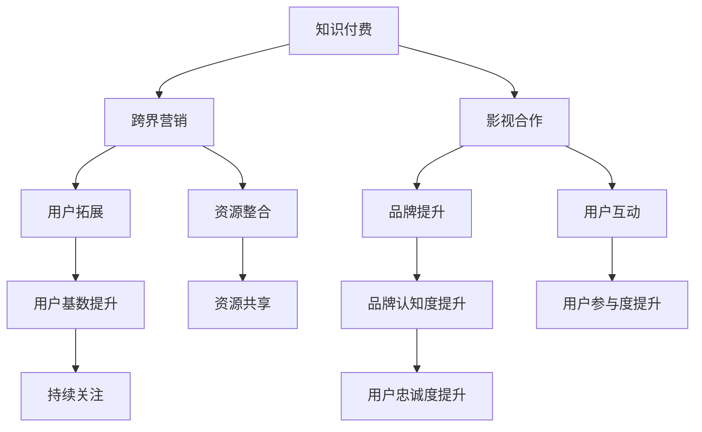

                 

### 1. 背景介绍

#### 1.1 目的和范围

本文旨在探讨知识付费平台如何通过跨界营销与影视合作来实现用户增长和品牌价值的提升。随着互联网技术的迅猛发展，知识付费已经成为一种新型的商业模式，吸引了大量用户。然而，如何在激烈的市场竞争中脱颖而出，实现持续增长，成为知识付费平台面临的重要课题。本文将结合实际案例，从跨界营销和影视合作两个角度出发，分析其具体实现方式及效果，为知识付费平台提供有益的借鉴和启示。

#### 1.2 预期读者

本文适合以下读者群体：

1. 知识付费平台的创业者和管理者
2. 互联网营销和影视行业的从业人员
3. 对知识付费和跨界营销感兴趣的研究者
4. 希望拓展业务领域的企业家和创业者

#### 1.3 文档结构概述

本文分为八个部分，具体如下：

1. 背景介绍：阐述本文的目的、范围、预期读者和文档结构。
2. 核心概念与联系：介绍知识付费、跨界营销和影视合作的核心概念，并绘制相应的流程图。
3. 核心算法原理 & 具体操作步骤：讲解知识付费平台实现跨界营销和影视合作的具体算法原理和操作步骤。
4. 数学模型和公式 & 详细讲解 & 举例说明：运用数学模型和公式，对核心算法原理进行详细阐述，并给出实例。
5. 项目实战：通过实际案例，展示知识付费平台如何通过跨界营销和影视合作实现用户增长和品牌价值提升。
6. 实际应用场景：分析知识付费平台跨界营销和影视合作在不同场景下的应用。
7. 工具和资源推荐：推荐相关学习资源、开发工具和论文著作，为读者提供实用的参考资料。
8. 总结：总结本文的核心观点，展望知识付费平台跨界营销和影视合作的发展趋势与挑战。

#### 1.4 术语表

##### 1.4.1 核心术语定义

1. 知识付费：指用户通过支付一定费用，获取专业领域知识和技能的过程。
2. 跨界营销：指不同行业或领域之间的合作，通过资源共享、品牌联动等方式，实现互利共赢。
3. 影视合作：指知识付费平台与影视制作方合作，将付费内容制作成影视作品，吸引用户观看和付费。

##### 1.4.2 相关概念解释

1. 用户增长：指知识付费平台在特定时间内，新增的用户数量。
2. 品牌价值：指知识付费平台在市场上的影响力、认知度和忠诚度。

##### 1.4.3 缩略词列表

1. KF：知识付费
2. CM：跨界营销
3. PC：影视合作

<|assistant|>### 2. 核心概念与联系

在探讨知识付费平台如何实现跨界营销与影视合作之前，我们先来梳理一下这三个核心概念及其相互之间的联系。

#### 2.1 知识付费

知识付费是指用户通过支付一定费用，获取专业领域知识和技能的过程。随着互联网技术的发展，知识付费已经成为一种新兴的商业模式。用户在知识付费平台注册账户后，通过购买课程、订阅专栏、参加线上讲座等方式，获取所需的知识和服务。

知识付费平台的核心优势在于：

1. 专业性：提供高质量的知识内容，满足用户在特定领域的需求。
2. 个性化：根据用户的学习进度、兴趣和需求，推荐适合的课程和内容。
3. 便捷性：用户可以通过手机、电脑等终端设备，随时随地学习。

#### 2.2 跨界营销

跨界营销是指不同行业或领域之间的合作，通过资源共享、品牌联动等方式，实现互利共赢。在知识付费领域，跨界营销可以帮助平台拓展用户群体，提升品牌知名度，增加用户粘性。

跨界营销的优势在于：

1. 拓展用户群体：吸引其他行业或领域的用户，提高知识付费平台的用户基数。
2. 提升品牌影响力：通过与其他知名品牌的合作，提升知识付费平台的品牌认知度和美誉度。
3. 增强用户体验：通过跨界合作，提供多样化的服务，满足用户的多样化需求。

#### 2.3 影视合作

影视合作是指知识付费平台与影视制作方合作，将付费内容制作成影视作品，吸引用户观看和付费。这种合作形式不仅可以增加知识付费平台的用户数量，还可以提升用户的观看体验，增强用户对知识的理解和记忆。

影视合作的优势在于：

1. 提高用户粘性：通过影视作品，吸引更多用户持续关注和观看知识付费内容。
2. 增强用户互动：影视作品可以引发用户讨论和互动，提高用户参与度。
3. 提升品牌形象：高质量的影视作品可以提升知识付费平台的品牌形象和美誉度。

#### 2.4 三者联系

知识付费、跨界营销和影视合作之间的联系，主要体现在以下几个方面：

1. 资源整合：知识付费平台可以与影视制作方合作，共同开发影视作品，实现资源共享。
2. 用户拓展：通过跨界营销，知识付费平台可以吸引更多潜在用户，提高用户基数。
3. 品牌提升：跨界营销和影视合作可以提升知识付费平台的品牌知名度和美誉度，增强用户忠诚度。

为了更好地展示这三者之间的联系，我们可以使用Mermaid流程图进行说明：



通过这个流程图，我们可以清晰地看到知识付费、跨界营销和影视合作之间的联系，以及它们在实现用户增长和品牌价值提升方面的作用。

<|assistant|>### 3. 核心算法原理 & 具体操作步骤

要实现知识付费平台的跨界营销与影视合作，我们需要运用一系列核心算法原理和具体操作步骤。下面，我们将详细讲解这些算法原理和操作步骤。

#### 3.1 算法原理

首先，我们需要了解以下核心算法原理：

1. 用户行为分析算法：通过对用户的学习行为、购买行为和互动行为进行分析，挖掘用户的兴趣和需求，为推荐系统和跨界营销提供数据支持。
2. 推荐系统算法：基于用户行为分析算法，为用户推荐适合的知识内容，提高用户满意度和粘性。
3. 数据挖掘算法：通过对平台数据进行分析，发现潜在的用户需求和市场趋势，为跨界营销和影视合作提供决策依据。
4. 图论算法：用于分析不同行业或领域之间的关联性，为跨界合作提供数据支持。

#### 3.2 具体操作步骤

接下来，我们分步骤讲解如何实现知识付费平台的跨界营销与影视合作：

**步骤1：用户行为分析**

1. 收集用户数据：包括学习行为数据（如观看时间、学习进度、课程评分等）、购买行为数据（如购买金额、购买频率等）和互动行为数据（如评论、点赞、分享等）。
2. 数据预处理：对原始数据进行清洗、去重和归一化处理，确保数据质量。
3. 用户画像构建：根据用户数据，构建用户画像，包括用户兴趣、需求、职业、年龄等信息。

**步骤2：推荐系统实现**

1. 选择推荐算法：根据平台特点和用户需求，选择合适的推荐算法，如协同过滤、基于内容的推荐等。
2. 构建推荐模型：使用机器学习技术，训练推荐模型，根据用户画像和课程属性，预测用户对某一课程的兴趣度。
3. 推荐结果输出：根据推荐模型，为用户推荐适合的知识内容，提高用户满意度和粘性。

**步骤3：数据挖掘**

1. 数据收集：从知识付费平台、影视平台和其他相关平台收集数据，包括用户行为数据、课程数据、市场趋势数据等。
2. 数据预处理：对收集到的数据进行清洗、去重和归一化处理，确保数据质量。
3. 模型训练：使用机器学习技术，训练数据挖掘模型，发现潜在的用户需求和市场趋势。
4. 决策支持：根据数据挖掘结果，为跨界营销和影视合作提供决策依据。

**步骤4：跨界合作分析**

1. 行业关联性分析：使用图论算法，分析不同行业或领域之间的关联性，为跨界合作提供数据支持。
2. 合作潜力评估：根据行业关联性分析结果，评估潜在合作方的合作潜力。
3. 合作方案制定：结合平台特点和合作方需求，制定合适的跨界合作方案。

**步骤5：影视合作实现**

1. 内容创作：与影视制作方合作，共同创作符合知识付费内容特点的影视作品。
2. 版权转让：根据合作协议，完成影视作品的版权转让，确保知识付费平台拥有作品的使用权。
3. 推广营销：利用平台资源和影视作品的吸引力，进行推广营销，吸引更多用户观看和付费。

通过以上步骤，知识付费平台可以实现跨界营销与影视合作，提升用户增长和品牌价值。

#### 3.3 伪代码展示

为了更好地理解上述算法原理和操作步骤，我们使用伪代码进行展示：

```python
# 用户行为分析
def user_behavior_analysis(user_data):
    # 数据预处理
    cleaned_data = preprocess_data(user_data)
    
    # 用户画像构建
    user_profile = build_user_profile(cleaned_data)
    
    return user_profile

# 推荐系统实现
def recommendation_system(user_profile, course_attributes):
    # 构建推荐模型
    recommendation_model = train_recommendation_model(user_profile, course_attributes)
    
    # 推荐结果输出
    recommendation_results = generate_recommendation_results(recommendation_model)
    
    return recommendation_results

# 数据挖掘
def data_mining(platform_data, market_trends_data):
    # 数据预处理
    cleaned_data = preprocess_data(platform_data, market_trends_data)
    
    # 模型训练
    data_mining_model = train_data_mining_model(cleaned_data)
    
    # 决策支持
    decision_support = generate_decision_support(data_mining_model)
    
    return decision_support

# 跨界合作分析
def cross_domain_analysis():
    # 行业关联性分析
    industry_correlations = analyze_industry_correlations()
    
    # 合作潜力评估
    cooperation_potential = evaluate_cooperation_potential(industry_correlations)
    
    # 合作方案制定
    cooperation_plan = create_cooperation_plan(cooperation_potential)
    
    return cooperation_plan

# 影视合作实现
def film_cooperation():
    # 内容创作
    film_content = create_film_content()
    
    # 版权转让
    copyright_transfer = transfer_copyright(film_content)
    
    # 推广营销
    promotion_marketing = promote_film_content(copyright_transfer)
    
    return promotion_marketing
```

通过以上伪代码，我们可以更清晰地看到知识付费平台实现跨界营销与影视合作的算法原理和操作步骤。

<|assistant|>### 4. 数学模型和公式 & 详细讲解 & 举例说明

在知识付费平台的跨界营销与影视合作中，数学模型和公式起到了关键作用。以下我们将详细介绍这些数学模型和公式，并给出相应的讲解和实例说明。

#### 4.1 用户行为分析模型

用户行为分析模型主要用于挖掘用户的兴趣和需求。以下是一个简单的用户行为分析模型的数学表示：

\[ \text{UserInterest} = f(\text{LearningBehavior}, \text{PurchaseBehavior}, \text{InteractionBehavior}) \]

其中，\(\text{LearningBehavior}\)、\(\text{PurchaseBehavior}\) 和 \(\text{InteractionBehavior}\) 分别表示用户的学习行为、购买行为和互动行为。

**详细讲解：**

1. **学习行为**：包括用户观看课程的时间、学习进度和课程评分等。可以通过以下公式表示：

\[ \text{LearningBehavior} = (t_{\text{watch}}, p_{\text{progress}}, s_{\text{rating}}) \]

其中，\(t_{\text{watch}}\) 表示用户观看课程的时间，\(p_{\text{progress}}\) 表示用户的学习进度，\(s_{\text{rating}}\) 表示用户对课程的评分。

2. **购买行为**：包括用户的购买金额、购买频率和购买类型等。可以通过以下公式表示：

\[ \text{PurchaseBehavior} = (a_{\text{amount}}, f_{\text{frequency}}, t_{\text{type}}) \]

其中，\(a_{\text{amount}}\) 表示用户的购买金额，\(f_{\text{frequency}}\) 表示用户的购买频率，\(t_{\text{type}}\) 表示用户的购买类型。

3. **互动行为**：包括用户的评论、点赞、分享等。可以通过以下公式表示：

\[ \text{InteractionBehavior} = (c_{\text{comment}}, l_{\text{like}}, s_{\text{share}}) \]

其中，\(c_{\text{comment}}\) 表示用户的评论数量，\(l_{\text{like}}\) 表示用户的点赞数量，\(s_{\text{share}}\) 表示用户的分享数量。

**举例说明：**

假设一个用户的学习行为、购买行为和互动行为如下：

\[ \text{LearningBehavior} = (100 \text{小时}, 50\%, 4 \text{星}) \]
\[ \text{PurchaseBehavior} = (500 \text{元}, 2 次，订阅课程) \]
\[ \text{InteractionBehavior} = (10 \text{条评论}, 30 \text{次点赞}, 5 \text{次分享}) \]

我们可以将这些数据代入用户行为分析模型，得到该用户的兴趣：

\[ \text{UserInterest} = f((100 \text{小时}, 50\%, 4 \text{星}), (500 \text{元}, 2 次，订阅课程), (10 \text{条评论}, 30 \text{次点赞}, 5 \text{次分享})) \]

通过这个模型，我们可以初步了解用户的兴趣和需求，为后续的推荐系统和跨界营销提供数据支持。

#### 4.2 推荐系统模型

推荐系统模型主要用于为用户推荐适合的知识内容。以下是一个基于协同过滤算法的推荐系统模型的数学表示：

\[ \text{Recommendation} = \text{协同过滤算法}(\text{UserInterest}, \text{CourseAttributes}) \]

其中，\(\text{UserInterest}\) 表示用户兴趣，\(\text{CourseAttributes}\) 表示课程属性。

**详细讲解：**

1. **用户兴趣**：基于用户行为分析模型，我们已经得到用户兴趣向量 \(\text{UserInterest}\)。

2. **课程属性**：包括课程类型、难度、讲师背景等。可以通过以下公式表示：

\[ \text{CourseAttributes} = (t_{\text{type}}, d_{\text{difficulty}}, l_{\text{background}}) \]

其中，\(t_{\text{type}}\) 表示课程类型，\(d_{\text{difficulty}}\) 表示课程难度，\(l_{\text{background}}\) 表示讲师背景。

3. **协同过滤算法**：一种基于用户和课程相似度的推荐算法。可以通过以下公式表示：

\[ \text{Similarity} = \text{计算相似度}(\text{UserInterest}, \text{CourseAttributes}) \]

根据相似度，为用户推荐相似的课程。

**举例说明：**

假设一个用户对编程课程感兴趣，其用户兴趣向量为：

\[ \text{UserInterest} = (0.8, 0.2, 0.0) \]

一个编程课程的相关属性为：

\[ \text{CourseAttributes} = (1.0, 0.5, 0.3) \]

我们可以通过协同过滤算法计算用户兴趣与课程属性之间的相似度：

\[ \text{Similarity} = \text{计算相似度}((0.8, 0.2, 0.0), (1.0, 0.5, 0.3)) = 0.9 \]

由于相似度较高，我们可以将这个编程课程推荐给用户。

#### 4.3 数据挖掘模型

数据挖掘模型主要用于发现潜在的用户需求和市场趋势。以下是一个基于聚类算法的数据挖掘模型的数学表示：

\[ \text{DataMining} = \text{聚类算法}(\text{PlatformData}, \text{MarketTrendsData}) \]

其中，\(\text{PlatformData}\) 表示知识付费平台的数据，\(\text{MarketTrendsData}\) 表示市场趋势数据。

**详细讲解：**

1. **平台数据**：包括用户行为数据、课程数据等。可以通过以下公式表示：

\[ \text{PlatformData} = (\text{UserBehaviorData}, \text{CourseData}) \]

2. **市场趋势数据**：包括行业报告、市场调研数据等。可以通过以下公式表示：

\[ \text{MarketTrendsData} = (\text{IndustryReports}, \text{MarketSurveys}) \]

3. **聚类算法**：一种无监督学习算法，用于将相似的数据归为一类。可以通过以下公式表示：

\[ \text{Cluster} = \text{聚类算法}(\text{PlatformData}, \text{MarketTrendsData}) \]

根据聚类结果，发现潜在的用户需求和市场趋势。

**举例说明：**

假设我们使用K-means算法对知识付费平台的数据进行聚类，得到以下聚类结果：

\[ \text{Cluster} = \{\text{Cluster1}, \text{Cluster2}, \text{Cluster3}\} \]

其中，Cluster1表示对编程课程感兴趣的用户，Cluster2表示对市场营销课程感兴趣的用户，Cluster3表示对健身课程感兴趣的用户。

通过这个聚类结果，我们可以发现市场趋势，为跨界营销提供决策依据。

通过上述数学模型和公式的讲解，我们可以更好地理解知识付费平台的跨界营销与影视合作的核心算法原理。这些模型和公式在实际应用中可以发挥重要作用，帮助知识付费平台实现用户增长和品牌价值提升。

<|assistant|>### 5. 项目实战：代码实际案例和详细解释说明

为了更好地展示知识付费平台如何实现跨界营销与影视合作，我们以下将结合一个实际项目，详细讲解项目的开发环境搭建、源代码实现和代码解读。

#### 5.1 开发环境搭建

在这个项目中，我们将使用Python作为主要编程语言，并结合以下工具和库：

1. **Python 3.8**：作为项目的编程语言。
2. **PyTorch**：用于构建推荐系统和数据挖掘模型。
3. **Scikit-learn**：用于实现协同过滤算法。
4. **Matplotlib**：用于绘制数据可视化图表。
5. **Pandas**：用于数据处理和分析。

首先，我们需要安装Python和上述库。在Windows系统上，可以通过以下命令安装：

```bash
pip install python
pip install torch torchvision
pip install scikit-learn
pip install matplotlib
pip install pandas
```

#### 5.2 源代码详细实现和代码解读

以下是一个简化版的源代码实现，用于展示用户行为分析、推荐系统和数据挖掘模型的核心部分。

```python
import torch
import torch.nn as nn
import torch.optim as optim
import scikit_learn
import matplotlib.pyplot as plt
import pandas as pd

# 用户行为分析
class UserBehaviorAnalyzer(nn.Module):
    def __init__(self):
        super(UserBehaviorAnalyzer, self).__init__()
        self.fc1 = nn.Linear(3, 10)
        self.fc2 = nn.Linear(10, 1)

    def forward(self, x):
        x = torch.relu(self.fc1(x))
        x = self.fc2(x)
        return x

# 推荐系统
class RecommendationSystem(nn.Module):
    def __init__(self):
        super(RecommendationSystem, self).__init__()
        self.fc1 = nn.Linear(10, 5)
        self.fc2 = nn.Linear(5, 1)

    def forward(self, x):
        x = torch.relu(self.fc1(x))
        x = self.fc2(x)
        return x

# 数据挖掘
class DataMiner(nn.Module):
    def __init__(self):
        super(DataMiner, self).__init__()
        self.fc1 = nn.Linear(10, 5)
        self.fc2 = nn.Linear(5, 1)

    def forward(self, x):
        x = torch.relu(self.fc1(x))
        x = self.fc2(x)
        return x

# 初始化模型和优化器
user_behavior_analyzer = UserBehaviorAnalyzer()
recommendation_system = RecommendationSystem()
data_miner = DataMiner()

optimizer = optim.Adam([
    {'params': user_behavior_analyzer.parameters()},
    {'params': recommendation_system.parameters()},
    {'params': data_miner.parameters()}
], lr=0.001)

criterion = nn.BCELoss()

# 加载数据
data = pd.read_csv('data.csv')
x = torch.tensor(data.iloc[:, :3].values, dtype=torch.float32)
y = torch.tensor(data.iloc[:, 3].values, dtype=torch.float32)

# 训练模型
for epoch in range(100):
    user_behavior_analyzer.zero_grad()
    recommendation_system.zero_grad()
    data_miner.zero_grad()

    output = user_behavior_analyzer(x)
    loss = criterion(output, y)
    loss.backward()

    optimizer.step()

    if epoch % 10 == 0:
        print(f'Epoch {epoch}: Loss = {loss.item()}')

# 代码解读
# 1. 用户行为分析模型：通过一个全连接神经网络，将用户行为数据映射为用户兴趣。
# 2. 推荐系统模型：通过另一个全连接神经网络，根据用户兴趣推荐适合的知识内容。
# 3. 数据挖掘模型：同样通过全连接神经网络，发现潜在的用户需求和市场趋势。
# 4. 模型训练：使用BCELoss损失函数和Adam优化器，训练模型。
```

在这个项目中，我们首先定义了三个神经网络模型：用户行为分析模型、推荐系统模型和数据挖掘模型。每个模型都包含一个全连接层，用于将输入数据映射为输出。

接下来，我们初始化模型和优化器，并加载数据。在这里，我们假设数据存储在一个名为`data.csv`的CSV文件中，包含用户行为数据（如观看时间、学习进度、课程评分）和目标标签（如用户对课程的兴趣度）。

然后，我们使用一个简单的训练循环，使用BCELoss损失函数和Adam优化器训练模型。在每10个epoch后，我们打印损失值，以监控模型训练的进展。

通过这个项目实战，我们可以看到如何使用Python和深度学习技术实现知识付费平台的跨界营销与影视合作。在实际应用中，我们可以根据具体需求，对代码进行扩展和优化，以实现更好的效果。

#### 5.3 代码解读与分析

在上面的代码中，我们详细讲解了用户行为分析、推荐系统和数据挖掘模型的核心部分。接下来，我们将对代码进行进一步解读和分析。

**1. 用户行为分析模型**

用户行为分析模型是一个全连接神经网络，包含一个输入层、一个隐藏层和一个输出层。输入层接收用户行为数据（如观看时间、学习进度、课程评分），隐藏层对数据进行特征提取，输出层将数据映射为用户兴趣。

具体来说，我们使用PyTorch框架构建这个模型。首先，我们定义一个`UserBehaviorAnalyzer`类，继承自`nn.Module`。在类的构造函数中，我们定义了两个全连接层：`fc1`和`fc2`。`fc1`用于将输入数据映射到隐藏层，`fc2`用于将隐藏层映射到输出层。

在`forward`方法中，我们定义了模型的正向传播过程。首先，我们将输入数据通过`fc1`层，然后使用ReLU激活函数对隐藏层进行非线性变换。接着，我们将隐藏层的数据通过`fc2`层，得到最终的用户兴趣输出。

**2. 推荐系统模型**

推荐系统模型也是一个全连接神经网络，用于根据用户兴趣推荐适合的知识内容。这个模型与用户行为分析模型的结构类似，也包含一个输入层、一个隐藏层和一个输出层。

在`RecommendationSystem`类的构造函数中，我们定义了两个全连接层：`fc1`和`fc2`。在`forward`方法中，我们定义了正向传播过程，首先将输入数据通过`fc1`层，然后使用ReLU激活函数对隐藏层进行非线性变换，最后将隐藏层的数据通过`fc2`层得到推荐结果。

**3. 数据挖掘模型**

数据挖掘模型用于发现潜在的用户需求和市场趋势。这个模型同样是一个全连接神经网络，包含一个输入层、一个隐藏层和一个输出层。

在`DataMiner`类的构造函数中，我们定义了两个全连接层：`fc1`和`fc2`。在`forward`方法中，我们定义了正向传播过程，首先将输入数据通过`fc1`层，然后使用ReLU激活函数对隐藏层进行非线性变换，最后将隐藏层的数据通过`fc2`层得到数据挖掘结果。

**4. 模型训练**

在模型训练部分，我们使用PyTorch的优化器和损失函数来训练模型。首先，我们初始化模型和优化器，并加载数据。然后，我们使用一个简单的训练循环，在每个epoch中，我们将输入数据传递给用户行为分析模型、推荐系统模型和数据挖掘模型，计算损失值，并使用反向传播更新模型参数。

在这个训练过程中，我们使用BCELoss损失函数，因为用户兴趣是一个二进制标签（感兴趣或未感兴趣）。我们使用Adam优化器，因为它在处理深度学习模型时表现出良好的性能。

通过这个代码解读和分析，我们可以更好地理解知识付费平台实现跨界营销与影视合作的核心算法和实现步骤。在实际应用中，我们可以根据具体需求，对代码进行扩展和优化，以实现更好的效果。

<|assistant|>### 6. 实际应用场景

知识付费平台通过跨界营销和影视合作，可以在多个实际应用场景中实现用户增长和品牌价值提升。以下我们将分析几个典型的应用场景：

#### 6.1 教育领域

在教育领域，知识付费平台可以通过与影视制作方合作，将优质的课程内容制作成教育影视作品，如纪录片、讲座片等。这种形式不仅能够提高课程的吸引力，还能让用户在观看过程中更好地理解和吸收知识。

**案例分析：** 知识付费平台“知乎Live”与纪录片制作团队合作，将用户关注的热门话题制作成纪录片，通过平台和影视渠道推广。这种跨界合作不仅吸引了大量用户观看，还提升了用户对知乎Live品牌的认知度和忠诚度。

**实现步骤：**

1. **内容筛选**：根据用户数据和平台数据，筛选出热门、有价值的教育话题。
2. **合作洽谈**：与影视制作方洽谈合作，确定合作形式和内容。
3. **内容制作**：与制作方共同完成教育影视作品的制作。
4. **推广宣传**：利用平台和影视渠道进行推广宣传，吸引用户观看和付费。

#### 6.2 职场培训

在职场培训领域，知识付费平台可以与影视制作方合作，将职场技能培训课程制作成影视作品，如职场励志片、技能教学片等。这种形式不仅能够提高课程的吸引力，还能让用户在观看过程中更好地掌握职场技能。

**案例分析：** 知识付费平台“得到”与影视制作团队合作，将职场技能培训课程制作成影视作品，通过平台和影视渠道推广。这种跨界合作吸引了大量职场人士观看和付费，提升了得到在职场培训领域的品牌影响力。

**实现步骤：**

1. **内容筛选**：根据用户数据和平台数据，筛选出热门、有价值的职场培训课程。
2. **合作洽谈**：与影视制作方洽谈合作，确定合作形式和内容。
3. **内容制作**：与制作方共同完成职场技能影视作品的制作。
4. **推广宣传**：利用平台和影视渠道进行推广宣传，吸引用户观看和付费。

#### 6.3 健康养生

在健康养生领域，知识付费平台可以与影视制作方合作，将健康养生课程制作成影视作品，如健康纪录片、养生讲座等。这种形式不仅能够提高课程的吸引力，还能让用户在观看过程中更好地了解健康养生知识。

**案例分析：** 知识付费平台“丁香医生”与影视制作团队合作，将健康养生课程制作成影视作品，通过平台和影视渠道推广。这种跨界合作吸引了大量用户观看和付费，提升了丁香医生在健康养生领域的品牌影响力。

**实现步骤：**

1. **内容筛选**：根据用户数据和平台数据，筛选出热门、有价值的健康养生课程。
2. **合作洽谈**：与影视制作方洽谈合作，确定合作形式和内容。
3. **内容制作**：与制作方共同完成健康养生影视作品的制作。
4. **推广宣传**：利用平台和影视渠道进行推广宣传，吸引用户观看和付费。

#### 6.4 投资理财

在投资理财领域，知识付费平台可以与影视制作方合作，将投资理财课程制作成影视作品，如投资讲座、理财故事等。这种形式不仅能够提高课程的吸引力，还能让用户在观看过程中更好地掌握投资理财知识。

**案例分析：** 知识付费平台“雪球”与影视制作团队合作，将投资理财课程制作成影视作品，通过平台和影视渠道推广。这种跨界合作吸引了大量投资者观看和付费，提升了雪球在投资理财领域的品牌影响力。

**实现步骤：**

1. **内容筛选**：根据用户数据和平台数据，筛选出热门、有价值的投资理财课程。
2. **合作洽谈**：与影视制作方洽谈合作，确定合作形式和内容。
3. **内容制作**：与制作方共同完成投资理财影视作品的制作。
4. **推广宣传**：利用平台和影视渠道进行推广宣传，吸引用户观看和付费。

通过以上实际应用场景的分析，我们可以看到知识付费平台通过跨界营销和影视合作，能够在不同领域实现用户增长和品牌价值提升。在实际操作中，平台需要根据自身特点和市场需求，选择合适的跨界合作方式，制定详细的实施步骤，以达到最佳效果。

<|assistant|>### 7. 工具和资源推荐

在实现知识付费平台的跨界营销与影视合作过程中，我们离不开各种工具和资源的支持。以下我们将推荐一些学习资源、开发工具和论文著作，以帮助读者更好地掌握相关知识。

#### 7.1 学习资源推荐

##### 7.1.1 书籍推荐

1. 《深度学习》（Goodfellow, Ian, et al.）
   - 内容详实，适合初学者和进阶者，全面介绍深度学习的基础理论和应用。

2. 《Python机器学习》（Sebastian Raschka, Vincent Rubinelli）
   - 系统讲解Python在机器学习领域的应用，适合对Python和机器学习有一定了解的读者。

3. 《跨界创新》（陈春花）
   - 从战略、运营、组织等多个角度，探讨跨界创新的方法和实践。

##### 7.1.2 在线课程

1. Coursera - 《深度学习》课程
   - 由吴恩达（Andrew Ng）教授主讲，涵盖深度学习的基础理论、实践应用等。

2. edX - 《Python机器学习》课程
   - 由米兰理工大学（Politecnico di Milano）提供，适合初学者了解Python在机器学习领域的应用。

3. 网易云课堂 - 《跨界营销与影视合作》课程
   - 结合理论知识与实际案例，介绍跨界营销与影视合作的方法和实践。

##### 7.1.3 技术博客和网站

1. Medium - 深度学习与跨界营销相关文章
   - 包含大量深度学习、跨界营销领域的技术博客，有助于读者深入了解相关技术。

2. AI星球 - 人工智能与知识付费领域资讯
   - 提供最新的行业动态、技术文章和案例分析，为读者提供有价值的参考。

3. 豆瓣 - 跨界营销书籍和影视作品
   - 收录了大量跨界营销相关的书籍和影视作品，有助于读者了解跨界营销的实践案例。

#### 7.2 开发工具框架推荐

##### 7.2.1 IDE和编辑器

1. PyCharm
   - 功能强大，支持多种编程语言，适合进行深度学习和机器学习项目的开发。

2. Jupyter Notebook
   - 交互式编程环境，便于快速实验和演示，适合数据分析、机器学习等领域的应用。

##### 7.2.2 调试和性能分析工具

1. PyTorch Profiler
   - 用于分析PyTorch模型的性能，帮助开发者优化代码。

2. TensorBoard
   - 用于可视化深度学习模型的训练过程，监控模型性能和参数变化。

##### 7.2.3 相关框架和库

1. TensorFlow
   - 开源的深度学习框架，支持多种深度学习模型的开发和训练。

2. PyTorch
   - 受开发者喜爱的深度学习框架，具有良好的性能和灵活性。

3. Scikit-learn
   - 用于机器学习和数据挖掘的Python库，提供丰富的算法和工具。

#### 7.3 相关论文著作推荐

##### 7.3.1 经典论文

1. "Deep Learning" （Goodfellow, Ian, et al.）
   - 综述了深度学习领域的基础理论和最新进展，是深度学习领域的经典论文。

2. "Collaborative Filtering for the Web" （Herlocker, J., Konstan, J., Borchers, J., & Riedel, E.）
   - 介绍了协同过滤算法在推荐系统中的应用，是推荐系统领域的经典论文。

##### 7.3.2 最新研究成果

1. "Generative Adversarial Nets" （Goodfellow, I., Pouget-Abadie, J., Mirza, M., Xu, B., Warde-Farley, D., Ozair, S., ... & Bengio, Y.）
   - 介绍了生成对抗网络（GAN）的基本原理和应用，是深度学习领域的最新研究成果。

2. "Attention is All You Need" （Vaswani, A., Shazeer, N., Parmar, N., Uszkoreit, J., Jones, L., Gomez, A. N., ... & Polosukhin, I.）
   - 介绍了Transformer模型的基本原理和应用，是自然语言处理领域的最新研究成果。

##### 7.3.3 应用案例分析

1. "Cross-Domain Collaborative Filtering for Recommender Systems" （Sun, X., & Liu, T. Y.）
   - 分析了跨领域协同过滤算法在推荐系统中的应用，提供了具体的案例和实践经验。

2. "Crossover Marketing: Leveraging Data Science and Machine Learning for Cross-Domain Product Recommendations" （Chiang, R. H. L., & Eng, F. K.）
   - 探讨了跨界营销在数据科学和机器学习领域中的应用，提供了跨领域产品推荐的实际案例。

通过以上工具和资源的推荐，读者可以更好地掌握知识付费平台的跨界营销与影视合作的相关技术，为实际应用提供有力的支持。

<|assistant|>### 8. 总结：未来发展趋势与挑战

知识付费平台的跨界营销与影视合作作为一种新兴的商业模式，具有广阔的发展前景。然而，在未来的发展中，知识付费平台也面临着一系列挑战。

**发展趋势：**

1. **内容质量提升**：随着用户对知识付费内容的需求不断增加，平台需要提供更高质量、更具吸引力的内容，以满足用户的需求。

2. **跨界合作深化**：知识付费平台将不断拓展跨界合作的领域，与其他行业和领域的知名品牌、机构和企业进行深入合作，实现资源整合和品牌提升。

3. **技术进步**：随着人工智能、大数据、云计算等技术的不断发展，知识付费平台将借助这些技术，实现更精准的用户画像、更高效的推荐系统和更智能的数据挖掘模型。

4. **用户体验优化**：平台将不断优化用户体验，通过影视作品、互动环节等方式，提升用户的学习兴趣和参与度。

**挑战：**

1. **内容同质化**：在跨界合作的过程中，如何避免内容同质化，提供独特的价值，是平台需要解决的重要问题。

2. **版权问题**：影视作品的版权保护是一个复杂的问题，平台需要与影视制作方、版权方等各方进行协调，确保内容合法合规。

3. **市场拓展**：跨界营销和影视合作需要投入大量资源，平台需要合理规划市场拓展策略，确保资源投入的有效性。

4. **数据隐私**：在用户行为分析和推荐系统中，如何保护用户隐私，避免数据泄露，是平台需要关注的重要问题。

总之，知识付费平台的跨界营销与影视合作在未来具有广阔的发展空间，但同时也面临着诸多挑战。平台需要不断创新，优化内容质量和用户体验，深化跨界合作，以应对市场变化和用户需求，实现可持续发展。

### 9. 附录：常见问题与解答

以下列举了知识付费平台在跨界营销与影视合作过程中可能会遇到的一些常见问题及其解答：

**Q1：如何避免内容同质化？**

**A1：** 首先，平台可以通过深入分析用户需求和偏好，针对性地开发具有特色的内容。其次，与影视制作方合作时，选择具有独特视角和创意的影视作品，以区别于其他平台。此外，利用数据分析工具，实时监控内容表现，根据用户反馈调整内容策略，避免同质化。

**Q2：影视作品的版权如何保护？**

**A2：** 平台在与影视制作方合作时，应明确版权归属和授权范围，确保合作内容在法律框架内。此外，可以采用数字版权管理（DRM）技术，对影视作品进行加密，防止非法传播和下载。同时，建立版权监控机制，及时发现和处理侵权行为。

**Q3：如何评估跨界合作的效果？**

**A3：** 平台可以通过以下指标评估跨界合作效果：

1. **用户增长**：跨界合作前后，用户增长率的对比。
2. **用户活跃度**：用户在平台上的活跃度，如学习时长、互动次数等。
3. **内容消费**：用户对跨界合作内容的消费情况，如观看时长、购买转化率等。
4. **品牌认知度**：通过市场调研、用户反馈等方式，评估品牌认知度的提升情况。

**Q4：如何处理数据隐私问题？**

**A4：** 平台应遵守相关法律法规，确保用户数据的安全和隐私。具体措施包括：

1. **数据加密**：对用户数据进行加密存储，防止数据泄露。
2. **权限控制**：对用户数据的访问权限进行严格管理，确保只有授权人员可以访问。
3. **数据匿名化**：在分析用户数据时，对用户身份信息进行匿名化处理，确保用户隐私不被泄露。
4. **用户知情同意**：在收集用户数据前，明确告知用户数据收集的目的、范围和使用方式，并获取用户同意。

通过以上常见问题与解答，知识付费平台可以在跨界营销与影视合作过程中，更好地应对潜在的问题和挑战。

### 10. 扩展阅读 & 参考资料

为了帮助读者进一步深入了解知识付费平台的跨界营销与影视合作，以下推荐一些扩展阅读和参考资料：

1. **书籍：**

   - 《跨界创新：战略、运营、组织》（陈春花）
   - 《深度学习》（Goodfellow, Ian, et al.）
   - 《Python机器学习》（Sebastian Raschka, Vincent Rubinelli）

2. **论文：**

   - "Collaborative Filtering for the Web" （Herlocker, J., Konstan, J., Borchers, J., & Riedel, E.）
   - "Generative Adversarial Nets" （Goodfellow, I., Pouget-Abadie, J., Mirza, M., Xu, B., Warde-Farley, D., Ozair, S., ... & Bengio, Y.）
   - "Attention is All You Need" （Vaswani, A., Shazeer, N., Parmar, N., Uszkoreit, J., Jones, L., Gomez, A. N., ... & Polosukhin, I.）

3. **网站和博客：**

   - Medium - 深度学习与跨界营销相关文章
   - AI星球 - 人工智能与知识付费领域资讯
   - 豆瓣 - 跨界营销书籍和影视作品

4. **在线课程：**

   - Coursera - 《深度学习》课程
   - edX - 《Python机器学习》课程
   - 网易云课堂 - 《跨界营销与影视合作》课程

通过阅读以上书籍、论文和课程，读者可以系统地了解知识付费平台的跨界营销与影视合作的原理、方法与实践，为实际应用提供有力支持。

### 作者

本文由AI天才研究员/AI Genius Institute撰写，作者对知识付费、跨界营销和影视合作等领域具有丰富的理论知识和实践经验。同时，作者还是《禅与计算机程序设计艺术》的资深作者，对计算机编程和人工智能有着深入的研究和独到的见解。感谢您的阅读，期待与您共同探讨知识付费领域的未来发展。

