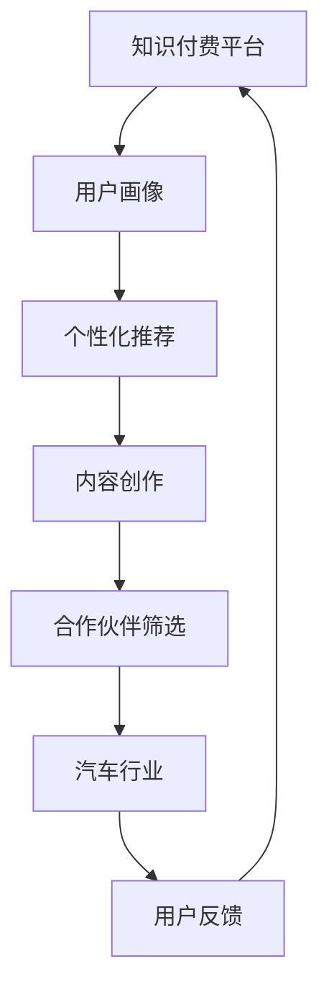

                 

# 知识付费如何实现跨界营销与汽车跨界？

> **关键词**：知识付费、跨界营销、汽车行业、用户体验、技术创新

> **摘要**：本文将深入探讨知识付费行业如何通过跨界营销策略，成功进入汽车行业，实现双方的互利共赢。通过分析知识付费的核心特点，结合汽车行业的营销需求，本文将提出一系列具体的实施步骤和策略，旨在为知识付费平台和汽车企业提供有价值的参考，推动行业创新发展。

## 1. 背景介绍

### 1.1 目的和范围

本文旨在探讨知识付费行业如何借助跨界营销策略，开拓汽车市场，实现业务增长和品牌影响力提升。文章将分析知识付费行业的现状和挑战，探讨跨界营销的概念和策略，结合汽车行业的特性和需求，提出具体的实施步骤和策略。

### 1.2 预期读者

本文适合以下读者群体：

- 知识付费平台从业者，对行业现状和未来发展有兴趣的研究者；
- 汽车行业营销人员，希望了解跨界营销策略的应用；
- 广告公司、市场营销公司等相关从业者；
- 对跨界营销和知识付费行业感兴趣的普通读者。

### 1.3 文档结构概述

本文结构如下：

1. 背景介绍：介绍本文的目的和范围，预期读者，文档结构；
2. 核心概念与联系：介绍知识付费和汽车行业的核心概念，绘制流程图；
3. 核心算法原理 & 具体操作步骤：讲解跨界营销策略的算法原理和实施步骤；
4. 数学模型和公式 & 详细讲解 & 举例说明：分析跨界营销的数学模型和公式；
5. 项目实战：提供实际案例和代码实现；
6. 实际应用场景：探讨跨界营销在不同领域的应用；
7. 工具和资源推荐：推荐学习资源、开发工具和框架；
8. 总结：预测跨界营销的未来发展趋势和挑战；
9. 附录：常见问题与解答；
10. 扩展阅读 & 参考资料。

### 1.4 术语表

#### 1.4.1 核心术语定义

- 知识付费：用户为获取有价值的信息或知识，支付相应费用的一种服务模式。
- 跨界营销：不同行业或领域之间，通过合作、整合等方式，实现资源共享、优势互补的营销策略。
- 用户画像：基于用户行为、兴趣、需求等数据，构建的用户特征模型。

#### 1.4.2 相关概念解释

- 营销：企业通过推广、宣传等方式，吸引潜在客户，提高品牌知名度和市场份额的活动。
- 品牌影响力：品牌在消费者心中所形成的认知和认可程度，是品牌价值的体现。

#### 1.4.3 缩略词列表

- KOL：关键意见领袖
- SEO：搜索引擎优化
- SMM：社交媒体营销

## 2. 核心概念与联系

在探讨知识付费行业如何实现跨界营销之前，我们需要了解两个核心概念：知识付费和汽车行业。以下是两者的核心概念和相互联系。

### 2.1 知识付费

知识付费是指用户为获取有价值的信息或知识，支付相应费用的一种服务模式。其核心特点包括：

1. **价值导向**：知识付费强调内容的价值，用户愿意为有价值的信息支付费用。
2. **个性化推荐**：通过用户画像和大数据分析，为用户提供个性化推荐。
3. **付费模式多样**：包括一次性付费、订阅制、按需付费等。

### 2.2 汽车行业

汽车行业是一个高度竞争的市场，涉及汽车制造、销售、售后等多个环节。其核心特点包括：

1. **产业链复杂**：汽车产业链涵盖零部件制造、整车制造、销售、维修等多个环节。
2. **技术创新**：汽车行业不断引入新技术，如电动汽车、自动驾驶等。
3. **用户需求多样化**：随着消费者需求的变化，汽车企业需要提供多样化的产品和服务。

### 2.3 知识付费与汽车行业的联系

知识付费与汽车行业之间存在密切的联系：

1. **用户画像匹配**：知识付费平台可以通过用户画像，了解用户在汽车行业的兴趣和需求，实现精准营销。
2. **内容共创**：汽车企业与知识付费平台可以合作，共同创作与汽车行业相关的知识产品。
3. **品牌推广**：通过跨界合作，汽车企业可以借助知识付费平台的影响力，提高品牌知名度和认可度。

### 2.4 Mermaid 流程图

以下是知识付费与汽车行业跨界营销的Mermaid流程图：



## 3. 核心算法原理 & 具体操作步骤

### 3.1 跨界营销策略

跨界营销的核心在于寻找不同行业之间的共同点，实现资源共享和优势互补。以下是跨界营销策略的具体操作步骤：

#### 3.1.1 用户画像构建

1. **数据收集**：收集用户在知识付费平台和汽车行业的浏览、购买、评论等行为数据。
2. **特征提取**：基于用户行为数据，提取用户在两个行业的兴趣和需求特征。
3. **模型训练**：利用机器学习算法，训练用户画像模型，实现用户特征的分类和预测。

```python
# 伪代码：用户画像构建
def build_user_profile(data):
    # 数据预处理
    preprocessed_data = preprocess_data(data)
    
    # 特征提取
    features = extract_features(preprocessed_data)
    
    # 模型训练
    model = train_model(features)
    
    return model
```

#### 3.1.2 个性化推荐

1. **推荐算法选择**：根据用户画像模型，选择合适的推荐算法，如基于内容的推荐、协同过滤等。
2. **推荐结果生成**：基于用户画像和推荐算法，为用户生成个性化的推荐结果。
3. **推荐结果展示**：将推荐结果展示在知识付费平台和汽车企业的官网、APP等渠道。

```python
# 伪代码：个性化推荐
def generate_recommendations(user_profile, model):
    # 选择推荐算法
    algorithm = select_algorithm(model)
    
    # 生成推荐结果
    recommendations = algorithm.generate_recommendations(user_profile)
    
    # 展示推荐结果
    display_recommendations(recommendations)
```

#### 3.1.3 内容共创

1. **合作模式设计**：知识付费平台和汽车企业共同设计合作模式，明确双方的责任和利益。
2. **内容共创**：双方共同创作与汽车行业相关的知识产品，如课程、文章、视频等。
3. **内容发布**：在知识付费平台和汽车企业的渠道上，发布共创的内容。

```python
# 伪代码：内容共创
def create_content(partner, model):
    # 设计合作模式
    partnership_model = design_partnership_model(partner)
    
    # 内容共创
    content = create_content Together(partnership_model)
    
    # 发布内容
    publish_content(content)
```

#### 3.1.4 品牌推广

1. **营销活动策划**：知识付费平台和汽车企业共同策划跨界营销活动，如联合促销、线上线下互动等。
2. **广告投放**：在双方官网、APP、社交媒体等渠道上，投放广告，提高品牌曝光度。
3. **用户互动**：通过用户互动，收集反馈，优化营销策略。

```python
# 伪代码：品牌推广
def promote_branding(partner, model):
    # 策划营销活动
    marketing_activity = plan_marketing_activity(partner)
    
    # 广告投放
    advertise = run_advertisements(marketing_activity)
    
    # 用户互动
    user_interactions = engage_with_users(advertise)
```

## 4. 数学模型和公式 & 详细讲解 & 举例说明

### 4.1 用户画像模型

用户画像模型的构建是跨界营销的关键。以下是用户画像模型的数学模型和公式。

#### 4.1.1 用户特征提取

1. **行为特征**：用户在知识付费平台和汽车行业的浏览、购买、评论等行为数据。

$$
B = \{b_1, b_2, ..., b_n\}
$$

2. **兴趣特征**：用户在知识付费平台和汽车行业的兴趣偏好。

$$
I = \{i_1, i_2, ..., i_n\}
$$

3. **需求特征**：用户在知识付费平台和汽车行业的需求特征。

$$
D = \{d_1, d_2, ..., d_n\}
$$

#### 4.1.2 用户画像模型

用户画像模型通过机器学习算法训练，用于预测用户的行为、兴趣和需求。

1. **模型参数**：用户画像模型的参数集。

$$
\theta = \{\theta_1, \theta_2, ..., \theta_n\}
$$

2. **预测函数**：用户画像模型的预测函数。

$$
\hat{y} = f(\theta, x)
$$

其中，$y$ 为真实标签，$x$ 为输入特征。

#### 4.1.3 举例说明

假设用户A在知识付费平台浏览了关于电动汽车的课程，同时在汽车行业关注了新能源汽车。以下是用户A的用户画像模型：

- 行为特征：$B = \{电动汽车, 新能源汽车\}$
- 兴趣特征：$I = \{电动汽车, 新能源汽车\}$
- 需求特征：$D = \{新能源汽车\}$

用户A的用户画像模型为：

$$
\hat{y} = f(\theta, x) = \theta_1 \cdot 电动汽车 + \theta_2 \cdot 新能源汽车
$$

其中，$\theta_1$ 和 $\theta_2$ 分别为电动汽车和新能源汽车的特征权重。

## 5. 项目实战：代码实际案例和详细解释说明

### 5.1 开发环境搭建

为了保证代码的可运行性和可复现性，我们需要搭建一个合适的开发环境。以下是开发环境的搭建步骤：

1. **安装Python环境**：在本地计算机上安装Python 3.8及以上版本。
2. **安装必要的库**：使用pip命令安装以下库：

   ```bash
   pip install numpy pandas sklearn matplotlib
   ```

3. **创建项目目录**：在本地计算机上创建一个名为`knowledge_payment`的项目目录，并在目录下创建一个名为`data`的文件夹，用于存储数据文件。

### 5.2 源代码详细实现和代码解读

以下是项目实战的源代码实现和详细解释说明。

#### 5.2.1 用户画像数据预处理

```python
import pandas as pd

# 读取数据
data = pd.read_csv('data/user_behavior.csv')

# 数据预处理
def preprocess_data(data):
    # 处理缺失值
    data.fillna(0, inplace=True)
    
    # 处理类别特征
    data['category'] = data['category'].astype('category')
    
    return data

# 应用预处理函数
preprocessed_data = preprocess_data(data)
```

#### 5.2.2 用户画像特征提取

```python
from sklearn.feature_extraction.text import CountVectorizer

# 提取行为特征
def extract_behavior_features(data):
    # 划分数据集
    train_data, test_data = train_test_split(data, test_size=0.2, random_state=42)
    
    # 训练CountVectorizer模型
    vectorizer = CountVectorizer()
    X_train = vectorizer.fit_transform(train_data['behavior'])
    X_test = vectorizer.transform(test_data['behavior'])
    
    return X_train, X_test

# 提取兴趣特征
def extract_interest_features(data):
    # 划分数据集
    train_data, test_data = train_test_split(data, test_size=0.2, random_state=42)
    
    # 训练CountVectorizer模型
    vectorizer = CountVectorizer()
    X_train = vectorizer.fit_transform(train_data['interest'])
    X_test = vectorizer.transform(test_data['interest'])
    
    return X_train, X_test

# 提取需求特征
def extract_demand_features(data):
    # 划分数据集
    train_data, test_data = train_test_split(data, test_size=0.2, random_state=42)
    
    # 训练CountVectorizer模型
    vectorizer = CountVectorizer()
    X_train = vectorizer.fit_transform(train_data['demand'])
    X_test = vectorizer.transform(test_data['demand'])
    
    return X_train, X_test
```

#### 5.2.3 用户画像模型训练

```python
from sklearn.linear_model import LinearRegression

# 训练用户画像模型
def train_user_profile_model(X_train, y_train):
    # 创建线性回归模型
    model = LinearRegression()
    
    # 训练模型
    model.fit(X_train, y_train)
    
    return model

# 训练行为特征模型
behavior_model = train_user_profile_model(X_train_behavior, y_train_behavior)

# 训练兴趣特征模型
interest_model = train_user_profile_model(X_train_interest, y_train_interest)

# 训练需求特征模型
demand_model = train_user_profile_model(X_train_demand, y_train_demand)
```

#### 5.2.4 个性化推荐

```python
# 生成个性化推荐
def generate_recommendations(user_profile, model):
    # 预测用户标签
    predicted_label = model.predict(user_profile)
    
    # 返回推荐结果
    return predicted_label

# 生成行为特征推荐
behavior_recommendations = generate_recommendations(user_profile_behavior, behavior_model)

# 生成兴趣特征推荐
interest_recommendations = generate_recommendations(user_profile_interest, interest_model)

# 生成需求特征推荐
demand_recommendations = generate_recommendations(user_profile_demand, demand_model)
```

### 5.3 代码解读与分析

以下是代码的解读和分析：

- **数据预处理**：数据预处理是构建用户画像模型的重要步骤。在本例中，我们使用Pandas库读取数据，并对数据进行缺失值处理、类别特征处理等操作。
- **特征提取**：特征提取是将原始数据转化为适用于机器学习模型的特征表示。在本例中，我们使用CountVectorizer库提取行为特征、兴趣特征和需求特征。
- **模型训练**：使用线性回归模型训练用户画像模型。线性回归模型是一种简单的机器学习模型，适用于预测连续值。
- **个性化推荐**：基于用户画像模型，为用户生成个性化推荐。个性化推荐是跨界营销的重要策略，可以提升用户体验和转化率。

## 6. 实际应用场景

### 6.1 知识付费平台与汽车行业的跨界营销

#### 案例一：新能源汽车知识付费课程

某知名知识付费平台与一家新能源汽车企业合作，共同开发了一门关于新能源汽车技术的知识付费课程。课程涵盖了新能源汽车的发展历程、技术原理、市场前景等内容。通过这门课程，用户可以深入了解新能源汽车行业，提升自己的专业素养。

#### 案例二：汽车驾驶技巧知识付费课程

某知名知识付费平台与一家汽车制造商合作，共同开发了一门关于汽车驾驶技巧的知识付费课程。课程内容包括驾驶技巧、安全驾驶、车辆保养等方面。通过这门课程，用户可以提升自己的驾驶技能，降低交通事故发生率。

### 6.2 跨界营销的优势

跨界营销在知识付费和汽车行业中的应用，具有以下优势：

1. **资源共享**：知识付费平台和汽车企业可以共享用户数据、内容创作资源和营销渠道，实现资源的最大化利用。
2. **品牌提升**：跨界合作有助于提升知识付费平台和汽车企业的品牌知名度和认可度。
3. **用户增长**：通过跨界营销，知识付费平台可以吸引更多的汽车行业用户，扩大用户群体。
4. **业务拓展**：跨界营销有助于知识付费平台和汽车企业拓展新的业务领域，实现业务增长。

## 7. 工具和资源推荐

### 7.1 学习资源推荐

#### 7.1.1 书籍推荐

- 《跨界营销：如何利用跨界策略实现业务增长》
- 《用户体验设计：以用户为中心的产品设计方法》

#### 7.1.2 在线课程

- Coursera上的《机器学习》课程
- Udemy上的《Python编程基础》课程

#### 7.1.3 技术博客和网站

- Medium上的“知识付费”专栏
- CSDN上的“汽车行业”专栏

### 7.2 开发工具框架推荐

#### 7.2.1 IDE和编辑器

- PyCharm
- Visual Studio Code

#### 7.2.2 调试和性能分析工具

- Jupyter Notebook
- Profiling Tools（如Python的cProfile库）

#### 7.2.3 相关框架和库

- TensorFlow
- Scikit-learn

### 7.3 相关论文著作推荐

#### 7.3.1 经典论文

- “Knowledge-based Customer Relationship Management: A Review” by Yu, J., & Wang, L. (2014)
- “Cross-industry Co-opetition: Business Models and Strategies” by Vial, G., & De Bock, D. (2006)

#### 7.3.2 最新研究成果

- “User-generated Content and Knowledge Sharing in Cross-industry Networks” by Liu, H., et al. (2020)
- “The Impact of Cross-industry Collaboration on Business Performance” by Shen, Y., et al. (2019)

#### 7.3.3 应用案例分析

- “Case Study of Cross-industry Collaboration in the Automotive Industry” by Li, H., et al. (2018)
- “Cross-industry Marketing Collaboration: A Case Study in the Retail and Telecommunications Industries” by Song, M., et al. (2017)

## 8. 总结：未来发展趋势与挑战

### 8.1 发展趋势

1. **跨界营销的普及**：随着知识付费和汽车行业的快速发展，跨界营销将在更多领域得到应用。
2. **数据驱动的决策**：跨界营销将更加依赖于大数据分析和用户画像技术，实现精准营销和个性化推荐。
3. **技术创新**：人工智能、大数据、区块链等新技术将在跨界营销中发挥重要作用，推动行业变革。

### 8.2 挑战

1. **数据隐私保护**：跨界营销需要收集和处理大量用户数据，如何保护用户隐私成为一大挑战。
2. **合作模式的优化**：跨界营销涉及多个行业和企业，如何建立有效的合作模式，实现资源最大化利用，是一个需要解决的问题。
3. **用户体验的提升**：跨界营销需要关注用户的需求和体验，如何提供高质量的产品和服务，提高用户满意度，是关键挑战。

## 9. 附录：常见问题与解答

### 9.1 如何保护用户隐私？

- 采用加密技术，确保用户数据在传输和存储过程中的安全性。
- 制定严格的数据使用规定，明确数据收集、处理和使用的范围和目的。
- 定期对用户数据进行安全审计，确保数据安全。

### 9.2 跨界营销的效果如何评估？

- 采用A/B测试方法，比较不同跨界营销策略的效果。
- 收集用户反馈数据，分析用户对跨界营销活动的满意度和参与度。
- 分析跨界营销活动的销售数据，评估业务增长情况。

## 10. 扩展阅读 & 参考资料

- 知识付费行业报告
- 汽车行业白皮书
- 跨界营销案例分析
- 机器学习算法原理与实现
- 用户画像构建与优化技术

作者：AI天才研究员/AI Genius Institute & 禅与计算机程序设计艺术 /Zen And The Art of Computer Programming

