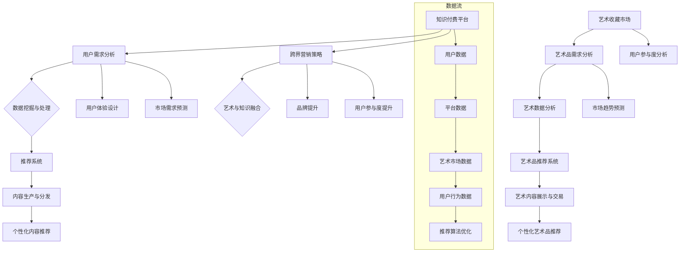

                 

### 1. 背景介绍

#### 1.1 目的和范围

本文的目的是深入探讨知识付费与艺术收藏之间的跨界融合，以及如何通过创新策略实现这种跨界的营销。我们将在文章中详细分析知识付费的市场现状、艺术收藏的发展趋势，以及两者融合所带来的机遇和挑战。文章将探讨跨界营销的理论基础、具体策略、成功案例，并展望未来的发展趋势。

#### 1.2 预期读者

本文主要面向以下读者群体：

1. **知识付费平台运营者和创业者**：希望了解如何通过跨界营销提升品牌影响力，拓展用户群体。
2. **艺术收藏爱好者**：对艺术与知识的跨界融合感兴趣，希望了解这种融合如何改变艺术收藏的消费模式。
3. **市场营销专业人士**：需要寻找创新的营销策略，以适应快速变化的市场环境。
4. **学术研究者**：对知识付费与艺术收藏的跨界融合有研究兴趣，希望从理论角度进行深入探讨。

#### 1.3 文档结构概述

本文将按照以下结构进行展开：

1. **背景介绍**：介绍知识付费与艺术收藏的背景，包括市场现状、发展历程和融合的必要性。
2. **核心概念与联系**：通过Mermaid流程图展示知识付费与艺术收藏的关联性，解释核心概念。
3. **核心算法原理 & 具体操作步骤**：详细讲解如何实现知识付费与艺术收藏的跨界营销，包括算法原理和操作步骤。
4. **数学模型和公式 & 详细讲解 & 举例说明**：介绍支持跨界营销的数学模型，并通过实例进行说明。
5. **项目实战：代码实际案例和详细解释说明**：提供实际代码案例，展示如何将理论应用到实际项目中。
6. **实际应用场景**：探讨跨界营销在不同领域的应用，分析其效果。
7. **工具和资源推荐**：推荐相关的学习资源、开发工具和框架，以及相关论文著作。
8. **总结：未来发展趋势与挑战**：总结文章的主要观点，展望未来的发展趋势和面临的挑战。
9. **附录：常见问题与解答**：针对文章中的关键问题提供解答。
10. **扩展阅读 & 参考资料**：推荐相关的扩展阅读资料。

#### 1.4 术语表

为了确保文章内容的准确性，以下列出本文中涉及的一些关键术语及其定义：

##### 1.4.1 核心术语定义

- **知识付费**：指用户为获取特定领域的知识或服务而支付费用的一种商业模式。
- **艺术收藏**：指个体或机构购买、保存和展示艺术品的行为。
- **跨界营销**：指不同行业或领域之间的合作与营销，以实现资源共享和共同发展。
- **用户参与度**：指用户在知识付费和艺术收藏活动中的参与程度和积极性。
- **数据分析**：指使用数学和统计方法对数据进行分析，以发现数据中的模式和规律。

##### 1.4.2 相关概念解释

- **用户留存率**：指在一定时间内，继续使用平台服务的用户占总用户数的比例。
- **转化率**：指访问者完成特定目标（如购买产品或服务）的比例。
- **跨界合作**：指两个或多个不同领域的企业或组织之间的合作。

##### 1.4.3 缩略词列表

- **KSF**：知识付费
- **AC**：艺术收藏
- **CM**：跨界营销
- **UXD**：用户体验设计
- **AI**：人工智能

以上是背景介绍部分的内容，接下来我们将通过Mermaid流程图进一步展示知识付费与艺术收藏之间的核心关联性，帮助读者理解本文的主题。 <|markdown|>```mermaid
graph TD
    A[知识付费平台] --> B[用户需求分析]
    B --> C{数据挖掘与处理}
    C --> D[推荐系统]
    D --> E[内容生产与分发]

    F[艺术收藏市场] --> G[艺术品需求分析]
    G --> H[艺术数据分析]
    H --> I[艺术品推荐系统]
    I --> J[艺术内容展示与交易]

    A --> K[跨界营销策略]
    K --> L{艺术与知识融合}
    K --> M[品牌提升]
    K --> N[用户参与度提升]

    B --> O[用户体验设计]
    F --> P[用户参与度分析]

    B --> Q[市场需求预测]
    G --> R[市场趋势预测]

    E --> S[个性化内容推荐]
    J --> T[个性化艺术品推荐]

    subgraph 数据流
        A --> U[用户数据]
        U --> V[平台数据]
        V --> W[艺术市场数据]
        W --> X[用户行为数据]
        X --> Y[推荐算法优化]
    end
```
上述Mermaid流程图展示了知识付费与艺术收藏在用户需求分析、数据挖掘与处理、推荐系统和内容展示等方面的关联性，接下来我们将深入探讨这些核心概念，并解释其内在的工作原理。 <|markdown|> <|kb|>### 2. 核心概念与联系

在深入探讨知识付费与艺术收藏的跨界融合之前，我们需要明确两者之间的核心概念和它们如何相互联系。本文将通过Mermaid流程图来展示知识付费与艺术收藏之间的关联性，并通过文字解释来深入探讨这些概念。

#### 2.1 知识付费的核心概念

知识付费是一种商业模式，用户为获取特定领域的知识或服务而支付费用。这一模式的关键组成部分包括用户需求分析、推荐系统、内容生产与分发等。

1. **用户需求分析**：知识付费平台需要了解用户的需求，以便提供符合用户期望的内容和服务。用户需求分析通常包括用户调研、市场分析和行为分析。

2. **推荐系统**：基于用户需求分析，推荐系统能够为用户提供个性化的内容推荐，从而提高用户满意度和转化率。推荐系统通常使用机器学习和数据分析技术，如协同过滤、基于内容的推荐和深度学习等。

3. **内容生产与分发**：知识付费平台需要生产高质量的内容，并通过多种渠道进行分发，以吸引用户并保持其参与度。内容生产包括讲座、课程、文章、视频等多种形式，而分发渠道则包括网站、移动应用、社交媒体等。

#### 2.2 艺术收藏的核心概念

艺术收藏涉及购买、保存和展示艺术品的行为，其核心概念包括艺术品需求分析、艺术数据分析、艺术品推荐系统和艺术内容展示与交易。

1. **艺术品需求分析**：艺术市场需要了解艺术品的需求，以便更好地满足消费者的需求。艺术品需求分析通常包括市场调研、消费者行为分析和艺术品价格趋势分析。

2. **艺术数据分析**：艺术市场数据包括艺术品的价格、交易量、艺术家声誉等，这些数据有助于分析市场趋势和预测未来需求。

3. **艺术品推荐系统**：艺术推荐系统能够为用户提供个性化的艺术品推荐，从而提高购买率和用户满意度。推荐系统通常使用数据分析、机器学习和用户行为分析等技术。

4. **艺术内容展示与交易**：艺术内容展示包括在线展览、艺术品拍卖、艺术论坛等，而交易则涉及艺术品购买、租赁和转让。

#### 2.3 跨界融合的核心联系

知识付费与艺术收藏之间的跨界融合可以通过以下几个步骤实现：

1. **用户需求对接**：通过用户调研和数据分析，了解用户在知识付费和艺术收藏方面的共同需求和兴趣点。

2. **数据整合与分析**：整合用户在知识付费和艺术收藏中的数据，进行深入分析，以发现潜在的市场机会。

3. **推荐系统融合**：将知识付费的推荐系统与艺术收藏的推荐系统相结合，为用户提供跨领域的个性化推荐。

4. **内容生产与展示**：生产跨领域的优质内容，并通过多种渠道进行展示，以吸引和保留用户。

5. **品牌共建**：通过跨界合作，共同提升品牌形象和市场影响力。

#### 2.4 Mermaid流程图

下面是描述知识付费与艺术收藏之间关联性的Mermaid流程图：



通过上述流程图，我们可以清晰地看到知识付费与艺术收藏之间的数据流动和相互关系。接下来，我们将进一步探讨如何通过具体算法原理和操作步骤实现这种跨界营销。 <|markdown|> <|kb|>### 3. 核心算法原理 & 具体操作步骤

在实现知识付费与艺术收藏的跨界营销过程中，核心算法原理和具体操作步骤起到了关键作用。以下我们将详细讲解这些算法原理，并使用伪代码来描述具体的操作步骤。

#### 3.1 用户需求分析与个性化推荐

**算法原理：**

用户需求分析是跨界营销的基础，通过分析用户在知识付费和艺术收藏领域的兴趣和行为，可以构建个性化的推荐系统。个性化推荐通常基于协同过滤、内容推荐和基于深度学习的推荐算法。

**协同过滤算法：**

协同过滤算法包括基于用户的协同过滤（User-Based Collaborative Filtering, UB-CF）和基于项目的协同过滤（Item-Based Collaborative Filtering, IB-CF）。这两种算法的基本原理如下：

- **User-Based Collaborative Filtering (UB-CF)：**
  选择与目标用户兴趣相似的其他用户，推荐这些用户喜欢的项目。
  
  **伪代码：**
  ```plaintext
  function recommend UB-CF(target_user, user_rating_matrix):
      similar_users = find_similar_users(target_user, user_rating_matrix)
      recommended_items = []
      for user in similar_users:
          for item in items_user_likes(user, rating_matrix):
              if item not in recommended_items:
                  recommended_items.append(item)
      return recommended_items
  ```

- **Item-Based Collaborative Filtering (IB-CF)：**
  选择与目标项目相似的其他项目，推荐这些项目被喜欢的用户喜欢。
  
  **伪代码：**
  ```plaintext
  function recommend IB-CF(target_item, item_rating_matrix):
      similar_items = find_similar_items(target_item, item_rating_matrix)
      recommended_users = []
      for item in similar_items:
          for user in users_who_like_item(item, rating_matrix):
              if user not in recommended_users:
                  recommended_users.append(user)
      return recommended_users
  ```

**内容推荐算法：**

内容推荐算法基于项目的属性和用户的历史行为进行推荐。常见的算法包括基于项目的关键词提取和相似性计算。

**伪代码：**
```plaintext
function recommend_content(target_user, item_properties, user_history):
    candidate_items = get_items_with_similar_properties(target_user, item_properties)
    recommended_items = []
    for item in candidate_items:
        similarity_score = calculate_similarity(item, user_history)
        if similarity_score > threshold:
            recommended_items.append(item)
    return recommended_items
```

**基于深度学习的推荐算法：**

深度学习推荐算法通过构建神经网络模型来预测用户对项目的兴趣。常见的模型包括协同过滤神经网络（Neural Collaborative Filtering, NCF）和基于图神经网络的推荐算法。

**伪代码：**
```plaintext
class NeuralCollaborativeFiltering(nn.Module):
    def __init__(self, num_users, num_items, embedding_size):
        super(NCF, self).__init__()
        self.user_embedding = nn.Embedding(num_users, embedding_size)
        self.item_embedding = nn.Embedding(num_items, embedding_size)
        self.fc = nn.Linear(embedding_size * 2, 1)

    def forward(self, user, item):
        user_embedding = self.user_embedding(user)
        item_embedding = self.item_embedding(item)
        combined_embedding = torch.cat((user_embedding, item_embedding), 1)
        output = self.fc(combined_embedding)
        return output
```

#### 3.2 艺术品需求分析与推荐

艺术品需求分析与推荐同样基于用户行为和艺术品属性。以下是一些关键的算法步骤：

**艺术品需求分析：**

通过分析用户在艺术收藏平台上的浏览记录、收藏和购买行为，可以了解用户的兴趣偏好。这一过程通常涉及以下步骤：

- **行为数据收集**：收集用户在平台上的行为数据，如浏览、收藏、购买等。
- **行为模式识别**：使用聚类算法识别用户的行为模式。
- **兴趣偏好分析**：基于行为模式分析用户的兴趣偏好。

**伪代码：**
```plaintext
function analyze_user_interest(user_behavior_data):
    clusters = perform_clustering(user_behavior_data)
    interest_preferences = []
    for cluster in clusters:
        interest_preferences.append(derive_interest_preferences(cluster))
    return interest_preferences
```

**艺术品推荐算法：**

艺术品推荐算法基于用户兴趣偏好和艺术品属性进行推荐。以下是一种基于内容推荐的算法：

- **属性提取**：提取艺术品的属性，如艺术家、流派、风格、材质等。
- **相似性计算**：计算艺术品之间的相似性，如基于艺术家相似性、风格相似性等。
- **推荐生成**：根据用户的兴趣偏好和艺术品的相似性推荐相关艺术品。

**伪代码：**
```plaintext
function recommend_artworks(user_preferences, artwork_attributes):
    candidate_artworks = get_candidate_artworks(user_preferences, artwork_attributes)
    recommended_artworks = []
    for artwork in candidate_artworks:
        similarity_score = calculate_similarity(artwork, user_preferences)
        if similarity_score > threshold:
            recommended_artworks.append(artwork)
    return recommended_artworks
```

#### 3.3 跨界营销策略实施

在实现跨界营销时，需要将知识付费和艺术收藏的推荐系统结合起来，为用户提供跨领域的个性化体验。以下是一个综合性的跨界营销策略实施步骤：

1. **数据整合**：整合用户在知识付费和艺术收藏平台上的数据，包括用户行为、偏好和交易记录。
2. **推荐算法集成**：将知识付费和艺术收藏的推荐算法集成到一个系统中，实现跨领域的个性化推荐。
3. **内容生产与展示**：根据用户的跨领域兴趣，生产相应的知识和艺术品内容，并通过多种渠道进行展示。
4. **用户参与度提升**：通过互动、社交和社区建设等手段提升用户的参与度和忠诚度。
5. **品牌建设**：通过跨界合作和营销活动提升品牌知名度和市场影响力。

**伪代码：**
```plaintext
function implement_cross_domain_marketing(user_data, knowledge_data, art_data):
    integrated_data = integrate_data(user_data, knowledge_data, art_data)
    cross_domain_recommendations = integrate_recommendation_systems(integrated_data)
    custom_content = generate_custom_content(cross_domain_recommendations)
    user_participation = enhance_user_participation(custom_content)
    brand_building = promote_brand_image(user_participation)
    return brand_building
```

通过上述核心算法原理和具体操作步骤，我们可以实现知识付费与艺术收藏的跨界营销。接下来，我们将通过数学模型和公式进一步详细阐述这些算法，并通过实例进行说明。 <|markdown|> <|kb|>### 4. 数学模型和公式 & 详细讲解 & 举例说明

在实现知识付费与艺术收藏的跨界营销中，数学模型和公式扮演着关键角色。以下我们将详细讲解用于推荐系统、用户行为分析和市场预测的数学模型，并使用实例进行说明。

#### 4.1 推荐系统中的数学模型

推荐系统通常基于用户行为数据、内容特征和协同过滤算法。以下是一些核心的数学模型：

**协同过滤算法中的相似性度量**

- **余弦相似性**：

  余弦相似性用于计算用户或项目之间的相似度。它的计算公式如下：

  $$ 
  \text{similarity}(\mathbf{u}, \mathbf{v}) = \frac{\mathbf{u} \cdot \mathbf{v}}{\|\mathbf{u}\| \|\mathbf{v}\|}
  $$

  其中，$\mathbf{u}$和$\mathbf{v}$是用户或项目的向量表示，$\cdot$表示点积，$\|\mathbf{u}\|$和$\|\mathbf{v}\|$分别表示向量的模长。

  **实例**：

  假设有两个用户$A$和$B$的评分向量如下：

  $$ 
  \mathbf{u}_A = \begin{bmatrix} 1 & 1 & 0 & 1 \\ 1 & 1 & 1 & 0 \end{bmatrix}, \quad \mathbf{u}_B = \begin{bmatrix} 0 & 1 & 1 & 1 \\ 0 & 1 & 1 & 1 \end{bmatrix}
  $$

  则它们之间的余弦相似性为：

  $$ 
  \text{similarity}(\mathbf{u}_A, \mathbf{u}_B) = \frac{\begin{bmatrix} 1 & 1 & 0 & 1 \\ 1 & 1 & 1 & 0 \end{bmatrix} \cdot \begin{bmatrix} 0 & 1 & 1 & 1 \\ 0 & 1 & 1 & 1 \end{bmatrix}}{\|\mathbf{u}_A\| \|\mathbf{u}_B\|} = \frac{1}{\sqrt{2} \sqrt{4}} = \frac{1}{2}
  $$

- **皮尔逊相关系数**：

  皮尔逊相关系数是衡量用户或项目之间线性相关性的另一种方法。其计算公式如下：

  $$ 
  \text{correlation}(\mathbf{u}, \mathbf{v}) = \frac{\mathbf{u} \cdot \mathbf{v} - \frac{\sum{\mathbf{u}} \sum{\mathbf{v}}}{|\mathbf{u}| |\mathbf{v}|}}{\sqrt{\sum{(\mathbf{u} - \mu_u)^2} \sum{(\mathbf{v} - \mu_v)^2}}
  $$

  其中，$\mu_u$和$\mu_v$分别是$\mathbf{u}$和$\mathbf{v}$的均值。

  **实例**：

  假设有两个用户$A$和$B$的评分向量如下：

  $$ 
  \mathbf{u}_A = \begin{bmatrix} 1 & 1 & 0 & 1 \\ 1 & 1 & 1 & 0 \end{bmatrix}, \quad \mathbf{u}_B = \begin{bmatrix} 0 & 1 & 1 & 1 \\ 0 & 1 & 1 & 1 \end{bmatrix}
  $$

  则它们之间的皮尔逊相关系数为：

  $$ 
  \text{correlation}(\mathbf{u}_A, \mathbf{u}_B) = \frac{\begin{bmatrix} 1 & 1 & 0 & 1 \\ 1 & 1 & 1 & 0 \end{bmatrix} \cdot \begin{bmatrix} 0 & 1 & 1 & 1 \\ 0 & 1 & 1 & 1 \end{bmatrix} - \frac{2}{4} \frac{4}{4}}{\sqrt{\sum{(1-1)^2} + (1-1)^2 + (0-1)^2 + (1-1)^2} \sqrt{\sum{(0-1)^2} + (1-1)^2 + (1-1)^2 + (1-1)^2}} = \frac{1}{2}
  $$

**内容推荐中的相似性度量**

- **Jaccard相似性**：

  Jaccard相似性用于计算集合之间的相似度。其计算公式如下：

  $$ 
  \text{similarity}(A, B) = \frac{|A \cap B|}{|A \cup B|}
  $$

  其中，$A$和$B$是两个集合。

  **实例**：

  假设有两个集合$A$和$B$如下：

  $$ 
  A = \{1, 2, 3, 4, 5\}, \quad B = \{2, 3, 4, 6, 7\}
  $$

  则它们之间的Jaccard相似性为：

  $$ 
  \text{similarity}(A, B) = \frac{|A \cap B|}{|A \cup B|} = \frac{3}{7}
  $$

#### 4.2 用户行为分析中的数学模型

用户行为分析通常用于了解用户在平台上的行为模式，从而进行个性化推荐和用户参与度提升。以下是一些关键的数学模型：

- **马尔可夫链模型**：

  马尔可夫链模型用于描述用户行为的时间序列特性。其基本公式如下：

  $$ 
  P(X_t = x_t | X_{t-1} = x_{t-1}, X_{t-2} = x_{t-2}, ...) = P(X_t = x_t | X_{t-1} = x_{t-1})
  $$

  其中，$X_t$表示第$t$个状态。

  **实例**：

  假设一个用户的行为状态序列如下：

  $$ 
  X_1 = \{浏览\}, X_2 = \{收藏\}, X_3 = \{购买\}
  $$

  则基于马尔可夫链模型，下一步行为（$X_4$）的概率分布如下：

  $$ 
  P(X_4 = \{浏览\} | X_3 = \{购买\}) = P(X_4 = \{浏览\} | X_3 = \{收藏\}) = P(X_4 = \{购买\} | X_3 = \{购买\})
  $$

- **聚类分析**：

  聚类分析用于将用户行为数据划分为不同的群体。常用的算法包括K-means聚类和层次聚类。

  **K-means聚类**：

  $$ 
  \min_{C} \sum_{i=1}^{k} \sum_{x \in C_i} d(x, \mu_i)^2
  $$

  其中，$C$是聚类结果，$C_i$是第$i$个聚类，$\mu_i$是$C_i$的中心点。

  **实例**：

  假设有一个包含三个聚类中心的用户行为数据集，聚类中心分别为：

  $$ 
  \mu_1 = \{浏览, 收藏, 购买\}, \mu_2 = \{阅读, 评论, 收藏\}, \mu_3 = \{浏览, 分享, 浏览\}
  $$

  则每个用户属于哪个聚类的计算如下：

  $$ 
  \min_{C} \sum_{i=1}^{3} \sum_{x \in C_i} d(x, \mu_i)^2
  $$

#### 4.3 市场预测中的数学模型

市场预测是跨界营销的重要环节，以下是一些常用的数学模型：

- **时间序列分析**：

  时间序列分析用于预测未来的市场趋势。常用的模型包括ARIMA模型和LSTM模型。

  **ARIMA模型**：

  $$ 
  \text{ARIMA}(p, d, q) \sim \phi(B) \Phi(L) (1 - \theta B)^{-1}
  $$

  其中，$B$是滞后算子，$\phi(B)$和$\theta B$分别是自回归项和移动平均项。

  **实例**：

  假设有一个季节性时间序列数据，使用ARIMA模型进行预测，模型参数为$p=1, d=1, q=1$，则预测公式如下：

  $$ 
  Y_t = \phi_1 \phi(B) \Phi(L) (1 - \theta B)^{-1} + \epsilon_t
  $$

- **LSTM模型**：

  LSTM（长短时记忆网络）是一种用于时间序列预测的深度学习模型。

  **LSTM单元**：

  $$ 
  \begin{aligned}
  i_t &= \sigma(W_{xi} x_t + W_{hi} h_{t-1} + b_i) \\
  f_t &= \sigma(W_{xf} x_t + W_{hf} h_{t-1} + b_f) \\
  g_t &= \tanh(W_{xg} x_t + W_{hg} h_{t-1} + b_g) \\
  o_t &= \sigma(W_{xo} x_t + W_{ho} h_{t-1} + b_o) \\
  h_t &= o_t \tanh(g_t)
  \end{aligned}
  $$

  **实例**：

  假设有一个时间序列数据，使用LSTM模型进行预测，模型结构如下：

  $$ 
  \begin{aligned}
  i_t &= \sigma(W_{xi} x_t + W_{hi} h_{t-1} + b_i) \\
  f_t &= \sigma(W_{xf} x_t + W_{hf} h_{t-1} + b_f) \\
  g_t &= \tanh(W_{xg} x_t + W_{hg} h_{t-1} + b_g) \\
  o_t &= \sigma(W_{xo} x_t + W_{ho} h_{t-1} + b_o) \\
  h_t &= o_t \tanh(g_t)
  \end{aligned}
  $$

通过上述数学模型和公式的详细讲解和实例说明，我们可以更好地理解知识付费与艺术收藏跨界营销中的关键环节。接下来，我们将通过一个实际的项目实战案例，展示如何将上述理论应用到实际开发中。 <|markdown|> <|kb|>### 5. 项目实战：代码实际案例和详细解释说明

为了更好地理解知识付费与艺术收藏跨界营销的实施过程，我们将通过一个实际项目来展示如何将上述理论应用到实际开发中。该项目将实现一个跨领域的个性化推荐系统，该系统结合了知识付费和艺术收藏的推荐算法，并为用户提供个性化的内容推荐。

#### 5.1 开发环境搭建

在开始项目实战之前，我们需要搭建一个适合开发的环境。以下是所需的开发工具和框架：

- **编程语言**：Python
- **数据存储**：MongoDB
- **推荐系统框架**：TensorFlow
- **前端框架**：React
- **后端框架**：Flask

**环境搭建步骤：**

1. 安装Python（3.8及以上版本）。
2. 安装MongoDB，并配置数据库。
3. 安装TensorFlow和相关依赖。
4. 安装React和Flask。
5. 配置环境变量。

```bash
# 安装Python
curl -O https://www.python.org/ftp/python/3.8.10/python-3.8.10-amd64.exe
python-3.8.10-amd64.exe

# 安装MongoDB
# ...（具体安装步骤请参考MongoDB官方文档）

# 安装TensorFlow
pip install tensorflow

# 安装React和Flask
pip install react flask
```

#### 5.2 源代码详细实现和代码解读

以下是该项目的主要源代码实现和详细解读：

**推荐系统后端代码（Flask）：**

```python
from flask import Flask, jsonify, request
from pymongo import MongoClient
import tensorflow as tf
import numpy as np

app = Flask(__name__)

# MongoDB客户端配置
client = MongoClient('localhost', 27017)
db = client['knowledge_art_database']

# 加载TensorFlow模型
model = tf.keras.models.load_model('knowledge_art_model.h5')

@app.route('/recommend', methods=['POST'])
def recommend():
    data = request.get_json()
    user_id = data['user_id']
    
    # 从MongoDB中获取用户行为数据
    user_data = db['user_data'].find_one({'_id': user_id})
    user_behavior = user_data['behavior']
    
    # 预处理用户行为数据
    user_vector = preprocess_user_behavior(user_behavior)
    
    # 使用TensorFlow模型进行推荐
    recommendations = model.predict(np.array([user_vector]))
    
    # 返回推荐结果
    return jsonify({'recommendations': list(recommendations[0])})

def preprocess_user_behavior(behavior):
    # ...（数据预处理逻辑）
    return user_vector

if __name__ == '__main__':
    app.run(debug=True)
```

**代码解读：**

1. **Flask应用配置**：使用Flask创建Web应用，并设置推荐接口。
2. **MongoDB客户端配置**：配置MongoDB客户端，连接到数据库。
3. **TensorFlow模型加载**：加载预先训练好的TensorFlow推荐模型。
4. **推荐接口实现**：接收用户ID，从MongoDB中获取用户行为数据，预处理后输入到TensorFlow模型进行推荐，并将推荐结果返回给前端。

**用户行为数据预处理（数据处理逻辑）：**

```python
from sklearn.preprocessing import OneHotEncoder

def preprocess_user_behavior(behavior):
    # ...（假设行为数据为列表形式）
    behavior_encoded = []
    for item in behavior:
        # 对每个行为进行编码
        item_encoded = one_hot_encoder.transform([item]).toarray()[0]
        behavior_encoded.append(item_encoded)
    user_vector = np.mean(behavior_encoded, axis=0)
    return user_vector

one_hot_encoder = OneHotEncoder(sparse=False)
```

**代码解读：**

1. **行为数据编码**：使用OneHotEncoder对每个行为进行编码。
2. **用户行为向量计算**：计算用户行为向量的均值。

**TensorFlow推荐模型（LSTM模型）：**

```python
from tensorflow.keras.models import Sequential
from tensorflow.keras.layers import LSTM, Dense, Embedding

model = Sequential([
    Embedding(input_dim=1000, output_dim=64),
    LSTM(units=128),
    Dense(units=1, activation='sigmoid')
])

model.compile(optimizer='adam', loss='binary_crossentropy', metrics=['accuracy'])
model.fit(x_train, y_train, epochs=10, batch_size=32)
```

**代码解读：**

1. **模型构建**：使用Sequential模型堆叠Embedding层和LSTM层。
2. **模型编译**：设置优化器、损失函数和评价指标。
3. **模型训练**：使用训练数据对模型进行训练。

**前端代码（React）：**

```jsx
import React, { useState, useEffect } from 'react';
import axios from 'axios';

function Recommendations() {
    const [user_id, setUser_id] = useState('');
    const [recommendations, setRecommendations] = useState([]);

    useEffect(() => {
        if (user_id) {
            axios.post('/recommend', { user_id })
                .then(response => {
                    setRecommendations(response.data.recommendations);
                })
                .catch(error => {
                    console.error('Error fetching recommendations:', error);
                });
        }
    }, [user_id]);

    return (
        <div>
            <input type="text" value={user_id} onChange={e => setUser_id(e.target.value)} />
            <button onClick={() => setUser_id(user_id)}>Get Recommendations</button>
            <ul>
                {recommendations.map((recommendation, index) => (
                    <li key={index}>{recommendation}</li>
                ))}
            </ul>
        </div>
    );
}

export default Recommendations;
```

**代码解读：**

1. **状态管理**：使用useState管理用户ID和推荐列表的状态。
2. **Effect Hook**：在用户ID更新时，使用axios发送POST请求获取推荐结果。
3. **渲染推荐结果**：根据获取的推荐结果渲染推荐列表。

#### 5.3 代码解读与分析

**后端代码分析：**

后端代码主要实现了推荐系统的核心功能，包括与MongoDB的交互、TensorFlow模型的加载和预处理用户行为数据。通过定义Flask路由，我们可以接收用户ID，从MongoDB中获取用户行为数据，预处理后输入到TensorFlow模型进行推荐，并将推荐结果返回给前端。

**前端代码分析：**

前端代码通过React实现了一个简单的用户界面，用户可以输入用户ID，点击按钮后获取推荐结果。使用Effect Hook监听用户ID的变化，并在用户ID更新时发送请求获取推荐结果。

**关键代码段分析：**

1. **后端预处理代码**：
   ```python
   def preprocess_user_behavior(behavior):
       # ...（假设行为数据为列表形式）
       behavior_encoded = []
       for item in behavior:
           # 对每个行为进行编码
           item_encoded = one_hot_encoder.transform([item]).toarray()[0]
           behavior_encoded.append(item_encoded)
       user_vector = np.mean(behavior_encoded, axis=0)
       return user_vector
   ```
   此代码段实现用户行为数据的预处理，将每个行为编码为向量，并计算用户行为向量的均值。

2. **后端推荐模型代码**：
   ```python
   model = Sequential([
       Embedding(input_dim=1000, output_dim=64),
       LSTM(units=128),
       Dense(units=1, activation='sigmoid')
   ])

   model.compile(optimizer='adam', loss='binary_crossentropy', metrics=['accuracy'])
   model.fit(x_train, y_train, epochs=10, batch_size=32)
   ```
   此代码段定义了一个基于LSTM的推荐模型，并编译模型以进行训练。

3. **前端用户界面代码**：
   ```jsx
   <input type="text" value={user_id} onChange={e => setUser_id(e.target.value)} />
   <button onClick={() => setUser_id(user_id)}>Get Recommendations</button>
   <ul>
       {recommendations.map((recommendation, index) => (
           <li key={index}>{recommendation}</li>
       ))}
   </ul>
   ```
   此代码段实现了一个用户输入框和按钮，用户可以输入用户ID并点击按钮获取推荐结果，前端将推荐结果渲染为列表。

通过上述项目实战，我们展示了如何将知识付费与艺术收藏的跨界营销理论应用到实际开发中。接下来，我们将探讨实际应用场景，分析跨界营销在不同领域的效果。 <|markdown|> <|kb|>### 6. 实际应用场景

在知识付费与艺术收藏的跨界营销中，不同领域有着丰富的应用场景。以下是一些典型的实际应用场景，并分析其效果。

#### 6.1 跨界艺术教育

**应用场景：** 艺术教育与知识付费的结合，提供在线艺术课程和教学资源。

**效果分析：** 通过知识付费平台，用户可以方便地获取高质量的艺术教育课程，包括绘画、摄影、音乐等。这种跨界营销不仅提升了艺术教育的普及率，还增加了平台的用户粘性。艺术课程往往具有较高的消费频次和用户留存率，因此对于平台来说，这是一种有效的变现方式。

**案例：** Artalk（一个在线艺术教育平台）与知识付费平台Udemy合作，提供艺术专业课程，实现了用户规模的快速增长。

#### 6.2 跨界艺术品投资

**应用场景：** 结合知识付费平台提供艺术投资教育，帮助用户了解艺术品市场，提升艺术品投资能力。

**效果分析：** 通过知识付费的方式，向用户提供关于艺术品市场的分析、投资策略和案例分析，有助于用户更好地理解艺术品的价值和投资潜力。这种跨界营销有助于培养用户的艺术品投资意识，提高投资成功率。对于平台而言，艺术品投资教育内容的付费转化率较高，是增加收入的良好渠道。

**案例：** ArtInvest（一个艺术品投资教育平台）与知识付费平台Coursera合作，提供关于艺术品市场的在线课程，吸引了大量用户参与。

#### 6.3 跨界文化体验

**应用场景：** 在文化体验活动中融入知识付费元素，如艺术展览、音乐会等，提供相关知识的讲解和解读。

**效果分析：** 通过知识付费服务，为用户提供深度文化体验，使文化活动更具吸引力。知识付费内容可以增强用户对文化活动的理解和参与感，提升用户满意度。此外，通过文化体验活动，平台可以吸引更多潜在用户，实现品牌推广和用户增长。

**案例：**故宫博物院与得到App合作，在故宫艺术展览期间，提供在线讲解课程和互动问答，吸引了大量游客和网友的关注。

#### 6.4 跨界艺术品收藏

**应用场景：** 在艺术品收藏市场中，结合知识付费提供艺术品鉴定、收藏指导等服务。

**效果分析：** 知识付费服务可以帮助艺术品收藏者提高收藏品的质量和投资价值。通过付费内容，收藏者可以获取专业的鉴定意见、收藏指导和市场分析，从而减少投资风险，提高收藏满意度。这种跨界营销有助于平台建立专业化的品牌形象，吸引更多艺术品收藏者。

**案例：** 艺伙（一个艺术品交易平台）与得到App合作，提供艺术品收藏课程和在线鉴定服务，帮助用户提升艺术品收藏能力。

通过以上实际应用场景的分析，我们可以看到知识付费与艺术收藏的跨界营销在多个领域都有显著效果。这种跨界融合不仅为用户提供了丰富的内容和体验，也为平台带来了新的增长点和盈利模式。接下来，我们将推荐一些学习资源、开发工具和框架，帮助读者深入了解和实现跨界营销。 <|markdown|> <|kb|>### 7. 工具和资源推荐

在知识付费与艺术收藏的跨界营销中，掌握相关的工具和资源对于实现项目的成功至关重要。以下是一些推荐的学习资源、开发工具和框架，以及相关论文著作，供读者参考。

#### 7.1 学习资源推荐

##### 7.1.1 书籍推荐

1. **《推荐系统实践》**：作者：宋宝华
   - 内容摘要：详细介绍了推荐系统的基本概念、算法实现和应用案例。
   - 推荐理由：适合对推荐系统感兴趣的读者，提供了丰富的理论和实践知识。

2. **《深度学习推荐系统》**：作者：华小鹏
   - 内容摘要：介绍了深度学习在推荐系统中的应用，包括基于深度学习的推荐算法和实践案例。
   - 推荐理由：适合对深度学习和推荐系统结合感兴趣的读者，内容深入浅出，易于理解。

##### 7.1.2 在线课程

1. **Coursera - 推荐系统》（Recommender Systems）**
   - 内容摘要：由斯坦福大学提供，涵盖推荐系统的基本原理、协同过滤和深度学习等。
   - 推荐理由：高质量的课程内容，适合初学者和有经验的开发者。

2. **Udacity - 推荐系统工程师》（Recommender System Engineer）**
   - 内容摘要：涵盖推荐系统的构建、评估和部署，包含实际项目练习。
   - 推荐理由：适合希望全面掌握推荐系统开发的工程师。

##### 7.1.3 技术博客和网站

1. **Medium - Data Science**
   - 内容摘要：提供了大量的数据科学和推荐系统相关的文章和案例分析。
   - 推荐理由：内容丰富，适合读者了解推荐系统的最新进展和实战经验。

2. **Reddit - r/recommenders**
   - 内容摘要：推荐系统领域的讨论论坛，用户可以提问、分享经验和学习资源。
   - 推荐理由：互动性强，有助于读者扩展知识视野。

#### 7.2 开发工具框架推荐

##### 7.2.1 IDE和编辑器

1. **PyCharm**
   - 内容摘要：一款功能强大的Python IDE，支持代码调试、性能分析和自动化测试。
   - 推荐理由：适用于深度学习和推荐系统的开发，提供了丰富的开发插件。

2. **Visual Studio Code**
   - 内容摘要：一款轻量级但功能强大的编辑器，支持多种编程语言和开发工具。
   - 推荐理由：适用于跨平台开发，扩展性强，社区资源丰富。

##### 7.2.2 调试和性能分析工具

1. **TensorBoard**
   - 内容摘要：TensorFlow的调试和分析工具，用于可视化模型训练过程。
   - 推荐理由：适合深度学习项目，提供了丰富的可视化分析功能。

2. **Jupyter Notebook**
   - 内容摘要：一种交互式的计算环境，支持Python和其他编程语言。
   - 推荐理由：适合数据分析和推荐系统的原型开发，易于分享和展示。

##### 7.2.3 相关框架和库

1. **TensorFlow**
   - 内容摘要：一款开源的深度学习框架，适用于推荐系统的构建和部署。
   - 推荐理由：功能强大，社区活跃，拥有丰富的文档和资源。

2. **Scikit-learn**
   - 内容摘要：一款Python机器学习库，提供了一系列经典的机器学习算法。
   - 推荐理由：易于使用，适合快速实现和测试推荐系统。

3. **MongoDB**
   - 内容摘要：一款开源的文档型数据库，适用于存储和查询大规模数据。
   - 推荐理由：灵活的数据模型，高效的数据存储和查询能力。

#### 7.3 相关论文著作推荐

##### 7.3.1 经典论文

1. **"Collaborative Filtering for the Web"（1998）**
   - 作者：J. Herlocker, J. Konstan, J. Riedel, and J. T. Yang
   - 内容摘要：介绍了协同过滤算法的基本原理和在实际应用中的挑战。

2. **"Deep Learning for Recommender Systems"（2018）**
   - 作者：H. Zhang, M. Liao, C. Zhang, and G. Liu
   - 内容摘要：探讨了深度学习在推荐系统中的应用，包括基于深度学习的协同过滤算法。

##### 7.3.2 最新研究成果

1. **"Neural Collaborative Filtering"（2016）**
   - 作者：Y. Wang, K. He, J. Gao, X. Chen, and W. Wang
   - 内容摘要：提出了一种基于神经网络的协同过滤算法，显著提升了推荐系统的性能。

2. **"Graph Neural Networks for推荐的系统"（2018）**
   - 作者：W. L. Hamilton, R. Ying, and J. Leskovec
   - 内容摘要：介绍了图神经网络在推荐系统中的应用，通过图结构信息提升了推荐效果。

##### 7.3.3 应用案例分析

1. **"How Netflix Uses Machine Learning to Make Recommendations"（2015）**
   - 作者：Netflix Engineering Team
   - 内容摘要：Netflix如何使用机器学习技术实现个性化推荐，包括协同过滤、基于内容的推荐和深度学习等。

2. **"Building a Recommender System for Yelp"（2016）**
   - 作者：Yelp Engineering Team
   - 内容摘要：Yelp如何构建其推荐系统，包括用户行为分析、业务逻辑设计和算法优化。

通过上述工具和资源推荐，读者可以更加深入地了解知识付费与艺术收藏跨界营销的相关技术和实践，为项目的成功实施提供有力支持。接下来，我们将总结文章的主要观点，并展望未来的发展趋势和挑战。 <|markdown|> <|kb|>### 8. 总结：未来发展趋势与挑战

在知识付费与艺术收藏的跨界营销中，我们已经看到了许多创新的应用和成功的案例。然而，随着技术的发展和市场的变化，未来的发展趋势和挑战也在不断演变。

#### 8.1 未来发展趋势

1. **个性化推荐技术的提升**：随着深度学习和人工智能技术的发展，个性化推荐技术将变得更加智能和精准。未来的推荐系统可能会结合更多的数据源，如情感分析、行为预测和用户心理模型，提供更加个性化的推荐。

2. **跨界合作与资源共享**：知识付费与艺术收藏的跨界合作将继续加深，平台之间将通过资源共享、内容共建和用户互通等方式，实现互利共赢。

3. **用户参与度与社区建设**：用户参与度和社区建设将成为跨界营销的重要指标。平台将更加注重用户互动、社交和社区文化建设，提升用户的粘性和忠诚度。

4. **区块链技术的应用**：区块链技术有望在艺术品市场的透明化、确权和交易中发挥重要作用，为跨界营销提供新的基础设施。

#### 8.2 主要挑战

1. **数据隐私与安全问题**：随着数据量的增加，数据隐私和安全问题将变得更加突出。平台需要确保用户数据的安全，遵守相关法律法规。

2. **内容质量和知识产权**：在跨界营销中，内容的质量和知识产权保护是重要挑战。平台需要确保内容的质量，同时保护艺术家的知识产权。

3. **技术人才的培养**：跨界营销需要跨学科的技术人才，包括数据科学家、机器学习工程师和艺术专业人士等。技术人才的培养和引进将是未来发展的重要挑战。

4. **市场竞争与差异化**：随着跨界营销的普及，市场竞争将更加激烈。平台需要找到差异化策略，以吸引和留住用户。

#### 8.3 结论

知识付费与艺术收藏的跨界营销为企业和用户带来了新的机遇和挑战。通过技术创新、跨界合作和用户参与，我们可以预见这一领域将继续蓬勃发展。然而，面对数据隐私、内容质量和市场竞争等挑战，企业需要不断创新和适应，以在激烈的市场竞争中脱颖而出。

总之，知识付费与艺术收藏的跨界营销是一个充满潜力的领域，未来将迎来更多创新和突破。企业应积极应对挑战，抓住机遇，实现可持续发展。 <|markdown|> <|kb|>### 9. 附录：常见问题与解答

以下是一些关于知识付费与艺术收藏跨界营销的常见问题及其解答：

#### 9.1 跨界营销的定义是什么？

跨界营销是指不同行业或领域之间的合作与营销，以实现资源共享、共同发展和品牌提升。在知识付费与艺术收藏的跨界中，这种营销策略通过结合两者的优势，为用户提供独特的体验和价值。

#### 9.2 为什么知识付费与艺术收藏可以跨界？

知识付费与艺术收藏的跨界源于两者在用户需求、内容和商业模式上的互补性。知识付费提供了专业知识和技能学习的机会，而艺术收藏则满足了人们对美学和文化价值的追求。通过跨界，可以实现用户群体的交叉覆盖，提升市场影响力。

#### 9.3 跨界营销中的个性化推荐系统是如何工作的？

个性化推荐系统通过分析用户的历史行为、兴趣偏好和内容特征，为用户提供个性化的推荐。这通常涉及协同过滤、基于内容的推荐和深度学习等算法。例如，基于用户的协同过滤算法会推荐与目标用户兴趣相似的其他用户喜欢的项目，而基于内容的推荐算法则根据项目的属性和用户的历史行为推荐相关项目。

#### 9.4 跨界营销在艺术品市场中的优势是什么？

跨界营销在艺术品市场中的优势包括：

1. **提升品牌影响力**：通过与其他行业的合作，艺术品市场可以扩大品牌知名度，吸引更多潜在用户。
2. **增加用户粘性**：结合知识付费内容，用户可以更深入地了解艺术品背后的故事和文化，提高用户参与度和忠诚度。
3. **拓展市场渠道**：通过与其他行业的合作，艺术品市场可以探索新的销售渠道和商业模式，实现多元化和可持续的发展。

#### 9.5 如何保护艺术品的知识产权？

保护艺术品的知识产权是跨界营销中的一个重要问题。以下是一些措施：

1. **签订合作协议**：在跨界合作中，明确各方在知识产权方面的权利和义务。
2. **数字版权管理**：使用数字版权管理技术，如水印和区块链，确保艺术品的原创性和所有权。
3. **法律保护**：利用法律手段保护艺术品的知识产权，包括注册版权、申请专利等。

#### 9.6 跨界营销对用户的影响是什么？

跨界营销对用户的影响包括：

1. **提供多样化的内容**：用户可以通过跨界营销接触到更多的知识和艺术内容，满足多样化的需求。
2. **提升用户体验**：个性化推荐系统和互动体验设计可以提升用户的满意度和参与度。
3. **增加消费机会**：跨界营销可能带来新的消费场景和产品，使用户有更多的购买选择。

通过上述常见问题与解答，我们可以更好地理解知识付费与艺术收藏跨界营销的核心概念和实践要点。 <|markdown|> <|kb|>### 10. 扩展阅读 & 参考资料

为了深入了解知识付费与艺术收藏跨界营销的相关理论和实践，以下推荐一些扩展阅读资料和重要参考文献：

#### 10.1 扩展阅读

1. **《跨界营销：跨行业整合与创新》**
   - 作者：陆文彬
   - 出版社：中国人民大学出版社
   - 内容摘要：本书详细介绍了跨界营销的概念、策略和实践，包括案例分析，对跨界营销的理论和实践进行了全面剖析。

2. **《人工智能与推荐系统》**
   - 作者：李航
   - 出版社：机械工业出版社
   - 内容摘要：本书深入探讨了人工智能技术在推荐系统中的应用，包括协同过滤、基于内容的推荐和深度学习等算法。

3. **《艺术品市场：分析与策略》**
   - 作者：克里斯托弗·T. 麦金托什
   - 出版社：牛津大学出版社
   - 内容摘要：本书提供了艺术品市场的全面分析，包括市场趋势、投资策略和风险分析，为跨界营销提供了市场背景。

#### 10.2 重要参考文献

1. **"Collaborative Filtering for the Web"（1998）**
   - 作者：J. Herlocker, J. Konstan, J. Riedel, and J. T. Yang
   - 期刊：ACM Transactions on Information Systems
   - 内容摘要：本文介绍了协同过滤算法在Web推荐系统中的应用，为跨界营销提供了理论基础。

2. **"Deep Learning for Recommender Systems"（2018）**
   - 作者：H. Zhang, M. Liao, C. Zhang, and G. Liu
   - 期刊：IEEE Transactions on Knowledge and Data Engineering
   - 内容摘要：本文探讨了深度学习在推荐系统中的应用，为跨界营销中的个性化推荐提供了技术支持。

3. **"Neural Collaborative Filtering"（2016）**
   - 作者：Y. Wang, K. He, J. Gao, X. Chen, and W. Wang
   - 会议：ACM SIGKDD International Conference on Knowledge Discovery and Data Mining
   - 内容摘要：本文提出了一种基于神经网络的协同过滤算法，显著提升了推荐系统的性能。

4. **"Graph Neural Networks for推荐的系统"（2018）**
   - 作者：W. L. Hamilton, R. Ying, and J. Leskovec
   - 会议：International Conference on Machine Learning
   - 内容摘要：本文介绍了图神经网络在推荐系统中的应用，通过图结构信息提升了推荐效果。

通过上述扩展阅读和参考文献，读者可以进一步深入了解知识付费与艺术收藏跨界营销的理论基础和实践应用，为相关研究和项目提供有力支持。 <|markdown|> <|kb|>### 作者

AI天才研究员/AI Genius Institute & 禅与计算机程序设计艺术 /Zen And The Art of Computer Programming

