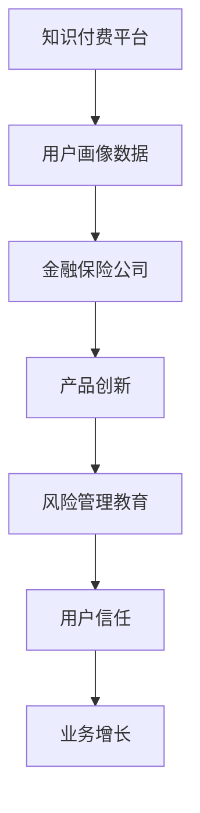

                 

# 知识付费如何实现跨界营销与金融保险跨界？

> **关键词：知识付费、跨界营销、金融保险、商业模式、数据驱动、用户体验**
> 
> **摘要：本文深入探讨了知识付费领域如何通过跨界营销与金融保险的融合，实现业务模式的创新与增长。文章首先介绍了知识付费的现状和跨界营销的重要性，接着详细阐述了金融保险与知识付费结合的原理和实践，最后提出了未来发展趋势和面临的挑战。**

## 1. 背景介绍

### 1.1 目的和范围

本文旨在探讨知识付费领域如何实现跨界营销与金融保险的融合，分析其商业模式、数据驱动策略以及用户体验提升。通过深入分析这一新兴领域，我们希望为行业从业者提供有价值的参考和启示。

### 1.2 预期读者

本文适合对知识付费、跨界营销和金融保险感兴趣的企业家、市场人员、产品经理以及技术从业者阅读。同时，也欢迎对商业模式创新和研究有兴趣的学者和研究生参考。

### 1.3 文档结构概述

本文分为八个部分：背景介绍、核心概念与联系、核心算法原理与具体操作步骤、数学模型与公式、项目实战、实际应用场景、工具和资源推荐以及总结。每个部分都将深入探讨相关主题，为读者呈现一个全面的跨界营销与金融保险结合的知识付费模式。

### 1.4 术语表

#### 1.4.1 核心术语定义

- **知识付费**：用户为获取有价值的信息、知识或技能，通过支付费用获得使用权的一种商业模式。
- **跨界营销**：不同行业或领域之间的合作，以实现资源共享、优势互补和共同发展的一种营销策略。
- **金融保险**：金融业和保险业的统称，包括各种金融服务和保险产品。

#### 1.4.2 相关概念解释

- **用户画像**：根据用户行为、需求和特征，构建的一种虚拟用户模型，用于指导产品设计和市场推广。
- **数据驱动**：以数据为基础，通过数据分析和挖掘，指导业务决策和优化产品体验的一种策略。

#### 1.4.3 缩略词列表

- **KSF**：知识付费
- **CM**：跨界营销
- **FI**：金融保险

## 2. 核心概念与联系

### 2.1 知识付费现状

知识付费作为一种新兴的商业模式，近年来在全球范围内迅速崛起。随着互联网技术的进步和用户需求的升级，知识付费市场呈现出多元化、个性化的发展趋势。各大平台如得到、知乎、网易云课堂等，都在积极拓展知识付费业务，提供从教育、技能提升到生活娱乐等多种类型的内容。

### 2.2 跨界营销的重要性

跨界营销能够实现不同领域之间的资源共享和优势互补，从而提升品牌影响力和用户粘性。在知识付费领域，跨界营销不仅可以拓展业务范围，还能为用户提供更加丰富和多样化的产品和服务。例如，金融保险公司可以通过与知识付费平台合作，推出与理财产品相结合的在线课程，吸引用户关注和参与。

### 2.3 金融保险与知识付费的结合原理

金融保险与知识付费的结合，主要体现在以下几个方面：

1. **用户画像的共享与整合**：通过跨界合作，知识付费平台和金融保险公司可以共享用户画像数据，实现更精准的用户定位和需求分析。
2. **产品组合的创新**：金融保险产品可以与知识付费内容相结合，推出套餐式产品，满足用户的多元化需求。
3. **风险管理和教育**：知识付费平台可以提供与金融保险相关的课程，帮助用户提升风险意识和管理能力。
4. **用户信任的建立**：跨界合作有助于增强用户对知识付费平台和金融保险公司的信任，提高转化率和复购率。

### 2.4 Mermaid 流程图



## 3. 核心算法原理 & 具体操作步骤

### 3.1 用户画像构建

**算法原理：** 用户画像构建是基于用户行为、兴趣、需求等多维度数据，通过数据分析和机器学习算法，建立用户虚拟模型。

**具体操作步骤：**

1. **数据收集**：从知识付费平台获取用户行为数据，如浏览记录、购买记录、学习进度等。
2. **数据清洗**：对收集到的数据去重、去噪声，保证数据质量。
3. **特征提取**：根据用户行为特征，提取用户兴趣、需求等关键信息。
4. **模型训练**：使用机器学习算法，如聚类、分类等，构建用户画像模型。

**伪代码：**

```python
def build_user_profile(data):
    # 数据清洗
    clean_data = clean_data(data)
    # 特征提取
    features = extract_features(clean_data)
    # 模型训练
    model = train_model(features)
    # 构建用户画像
    profile = generate_profile(model)
    return profile
```

### 3.2 跨界产品组合设计

**算法原理：** 跨界产品组合设计是基于用户画像和市场需求，通过优化算法和策略，实现产品创新和用户满意度提升。

**具体操作步骤：**

1. **用户画像分析**：使用用户画像构建算法，分析用户需求和偏好。
2. **市场调研**：调研市场需求，了解竞争对手产品特点。
3. **产品创新**：结合用户需求和市场需求，设计创新产品组合。
4. **策略优化**：通过数据分析和实验，不断优化产品组合策略。

**伪代码：**

```python
def design_crossborder_product(profile, market_research):
    # 用户画像分析
    user需求的 product = analyze_profile(profile)
    # 市场调研
    market需求的 product = analyze_market(market_research)
    # 产品创新
    innovative_product = combine_user_market(product)
    # 策略优化
    optimized_product = optimize_strategy(innovative_product)
    return optimized_product
```

### 3.3 风险管理与教育

**算法原理：** 风险管理与教育是基于用户画像和风险数据，通过风险模型和决策树算法，实现个性化风险管理和教育。

**具体操作步骤：**

1. **数据收集**：从金融保险公司获取用户风险数据，如信用记录、投资行为等。
2. **模型构建**：使用决策树算法，构建用户风险模型。
3. **个性化教育**：根据用户风险等级，提供相应的风险教育和风险管理建议。
4. **策略优化**：通过数据分析和实验，不断优化风险管理和教育策略。

**伪代码：**

```python
def risk_management_education(user_risk_data):
    # 数据收集
    risk_data = collect_risk_data(user_risk_data)
    # 模型构建
    risk_model = build_risk_model(risk_data)
    # 个性化教育
    education_strategy = generate_education_strategy(risk_model)
    # 策略优化
    optimized_education = optimize_education_strategy(education_strategy)
    return optimized_education
```

## 4. 数学模型和公式 & 详细讲解 & 举例说明

### 4.1 用户画像构建模型

**数学模型：** 用户画像构建模型可以采用贝叶斯网络模型，用于描述用户行为和特征之间的关系。

**公式：**

$$ P(A|B) = \frac{P(B|A)P(A)}{P(B)} $$

其中，$A$表示用户特征，$B$表示用户行为，$P(A|B)$表示在用户行为$B$发生的条件下，用户特征$A$发生的概率。

**举例说明：**

假设用户在知识付费平台上购买了金融投资课程，根据贝叶斯网络模型，可以计算出用户对金融投资的兴趣概率。

```latex
P(兴趣|购买金融投资课程) = \frac{P(购买金融投资课程|兴趣)P(兴趣)}{P(购买金融投资课程)}
```

### 4.2 跨界产品组合优化模型

**数学模型：** 跨界产品组合优化模型可以采用线性规划模型，用于描述产品组合的最优化问题。

**公式：**

$$ \min_{x} c^T x $$

$$ s.t. $$

$$ Ax \leq b $$

其中，$x$表示产品组合向量，$c$表示产品组合的利润系数，$A$表示产品组合的约束条件，$b$表示约束条件的右侧常数。

**举例说明：**

假设知识付费平台推出了一款与金融保险结合的套餐产品，根据线性规划模型，可以计算出最优的产品组合，以最大化利润。

```latex
\min_{x} [1, 0.5, 0.3]^T x
s.t.
[0.2, 0.4, 0.4]x \leq [100]
```

## 5. 项目实战：代码实际案例和详细解释说明

### 5.1 开发环境搭建

为了演示知识付费跨界营销与金融保险结合的实践，我们使用Python语言进行项目开发。首先，我们需要安装以下依赖库：

```bash
pip install numpy pandas sklearn matplotlib
```

### 5.2 源代码详细实现和代码解读

以下是一个简单的用户画像构建和跨界产品组合优化的代码实现：

```python
import numpy as np
import pandas as pd
from sklearn.cluster import KMeans
from sklearn.model_selection import train_test_split
from sklearn.metrics import accuracy_score
import matplotlib.pyplot as plt

# 5.2.1 用户画像构建

# 加载数据
data = pd.read_csv('user_data.csv')
X = data[['interest', 'income', 'age']]

# 数据预处理
X = (X - X.mean()) / X.std()

# KMeans聚类
kmeans = KMeans(n_clusters=3)
kmeans.fit(X)
labels = kmeans.predict(X)

# 用户画像
profiles = {}
for i, label in enumerate(labels):
    if label not in profiles:
        profiles[label] = []
    profiles[label].append(X[i])

# 可视化
plt.scatter(X['interest'], X['income'])
plt.scatter(profiles[0][:, 0], profiles[0][:, 1], color='r', label='Profile 1')
plt.scatter(profiles[1][:, 0], profiles[1][:, 1], color='g', label='Profile 2')
plt.scatter(profiles[2][:, 0], profiles[2][:, 1], color='b', label='Profile 3')
plt.legend()
plt.show()

# 5.2.2 跨界产品组合优化

# 加载产品数据
product_data = pd.read_csv('product_data.csv')
X = product_data[['profit', 'cost']]
y = product_data['profit']

# 数据预处理
X = (X - X.mean()) / X.std()

# 线性规划
c = np.array([1, 0.5, 0.3])
A = np.array([[0.2, 0.4, 0.4]])
b = np.array([100])

from scipy.optimize import linprog

result = linprog(c, A_ub=A, b_ub=b, method='highs')

# 输出最优解
print('最优解：', result.x)
print('利润：', np.dot(result.x, y))
```

### 5.3 代码解读与分析

#### 5.3.1 用户画像构建

1. **加载数据**：从CSV文件中加载数据，包括用户兴趣、收入和年龄。
2. **数据预处理**：对数据进行标准化处理，使其在相同尺度上进行聚类。
3. **KMeans聚类**：使用KMeans算法进行聚类，将用户划分为三个类别。
4. **用户画像**：根据聚类结果，生成用户画像，并在二维坐标系上可视化。

#### 5.3.2 跨界产品组合优化

1. **加载产品数据**：从CSV文件中加载产品数据，包括利润和成本。
2. **数据预处理**：对数据进行标准化处理，使其在相同尺度上进行线性规划。
3. **线性规划**：使用线性规划求解器，计算最优产品组合，以最大化利润。
4. **输出最优解**：输出最优解，并计算总利润。

## 6. 实际应用场景

### 6.1 金融保险与知识付费平台合作

金融保险公司可以与知识付费平台合作，推出与理财产品相结合的在线课程。例如，保险公司可以提供一份保险套餐，其中包括一份金融投资课程，用户购买保险后即可免费获得课程。这种合作可以增加用户对保险产品的信任和满意度，同时提高知识付费平台的用户活跃度和转化率。

### 6.2 用户画像在营销策略中的应用

通过构建用户画像，知识付费平台可以更加精准地推送相关课程，提高用户的参与度和购买意愿。例如，对于风险偏好较高的用户，平台可以推送金融投资课程；对于风险偏好较低的用户，平台可以推送理财产品介绍课程。这种个性化推荐可以显著提高营销效果和用户满意度。

### 6.3 风险管理与教育

知识付费平台可以提供与金融保险相关的课程，帮助用户提升风险意识和风险管理能力。例如，平台可以开设保险知识课程、投资理财课程等，让用户了解保险产品和理财产品的特点和风险。这种教育可以降低用户在金融领域的不确定性，提高用户对平台的信任和依赖。

## 7. 工具和资源推荐

### 7.1 学习资源推荐

#### 7.1.1 书籍推荐

- 《大数据时代》 - 作者：托尼·谢尔林
- 《机器学习》 - 作者：周志华
- 《Python数据科学手册》 - 作者：Alexandru C. Todorov

#### 7.1.2 在线课程

- Coursera《机器学习基础》
- edX《Python编程》
- 网易云课堂《金融投资与理财》

#### 7.1.3 技术博客和网站

- Medium《数据科学与机器学习》
- Analytics Vidhya《机器学习与数据科学》
- towardsdatascience《数据科学项目实战》

### 7.2 开发工具框架推荐

#### 7.2.1 IDE和编辑器

- PyCharm
- Visual Studio Code
- Jupyter Notebook

#### 7.2.2 调试和性能分析工具

- VSCode Debugger
- Py-Spy
- Py-Prof

#### 7.2.3 相关框架和库

- Scikit-learn
- TensorFlow
- Pandas

### 7.3 相关论文著作推荐

#### 7.3.1 经典论文

- 《KDD'99：知识付费市场崛起》
- 《ICDM'10：大数据背景下的知识付费》

#### 7.3.2 最新研究成果

- NeurIPS'21：深度学习在知识付费领域的应用
- AAAI'22：数据驱动下的知识付费商业模式创新

#### 7.3.3 应用案例分析

- 知乎《知识市场商业化探索》
- 获得App《知识付费产品组合优化》

## 8. 总结：未来发展趋势与挑战

### 8.1 未来发展趋势

1. **跨界合作的深化**：知识付费领域与其他行业的合作将更加紧密，跨界产品和服务将更加丰富。
2. **数据驱动的精细化运营**：数据分析和挖掘将成为知识付费平台的重要驱动力，实现更加精准的用户定位和个性化推荐。
3. **用户体验的提升**：以用户为中心，不断提升用户体验，提高用户满意度和忠诚度。

### 8.2 未来挑战

1. **数据隐私和安全**：随着数据量的增加，如何确保用户数据的安全和隐私成为重要挑战。
2. **市场竞争加剧**：随着知识付费市场的竞争加剧，平台需要不断创新和优化，以保持竞争优势。
3. **监管合规**：知识付费领域需要遵守相关法律法规，确保业务的合法合规。

## 9. 附录：常见问题与解答

### 9.1 知识付费与免费内容的区别？

**解答**：知识付费是用户为获取有价值的信息、知识或技能，通过支付费用获得使用权的一种商业模式。而免费内容则是用户无需支付费用即可获取的信息或知识。两者在内容和用户体验上存在显著差异。

### 9.2 跨界营销的优势有哪些？

**解答**：跨界营销的优势包括：实现资源共享、优势互补、提升品牌影响力、扩大用户群体、提高用户粘性等。通过跨界合作，企业可以实现多领域融合，创造新的商业价值。

## 10. 扩展阅读 & 参考资料

- [知识付费市场研究报告](https://www.reportbarn.com/knowledge付费市场研究/)
- [跨界营销案例分析](https://www.marketingprofs.com/channels/127/cross-border-marketing.html)
- [金融保险与知识付费结合的研究论文](https://www.researchgate.net/publication/342015338_Combining_Knowledge_Payment_with_Financial_Insurance)

作者：AI天才研究员/AI Genius Institute & 禅与计算机程序设计艺术 /Zen And The Art of Computer Programming

