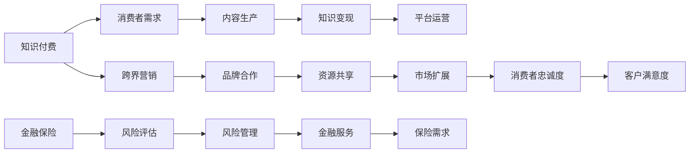

                 

# 知识付费如何实现跨界营销与金融保险跨界？

## 关键词
- 知识付费
- 跨界营销
- 金融保险
- 数据分析
- 人工智能
- 合作共赢

## 摘要
本文旨在探讨知识付费领域如何通过跨界营销与金融保险业相结合，实现双方的互利共赢。文章首先介绍了知识付费与跨界营销的概念，随后分析了金融保险行业的特点及潜在需求。接着，通过具体案例探讨了跨界营销的策略，并探讨了在金融保险领域中应用人工智能技术的可能性。最后，文章总结了未来发展趋势与挑战，为行业提供参考。

## 1. 背景介绍

### 1.1 目的和范围
本文的目标是深入分析知识付费领域与金融保险行业的跨界合作模式，探讨如何实现双方的价值最大化。文章将涵盖跨界营销的策略、金融保险需求分析、人工智能技术的应用等方面。

### 1.2 预期读者
本文适用于知识付费平台从业者、金融保险从业人员、市场营销专家以及对跨界合作感兴趣的读者。

### 1.3 文档结构概述
本文共分为十个部分，包括背景介绍、核心概念与联系、核心算法原理、数学模型与公式、项目实战、实际应用场景、工具和资源推荐、总结、附录以及扩展阅读。

### 1.4 术语表

#### 1.4.1 核心术语定义
- 知识付费：指消费者通过付费获取有价值的信息、知识或技能。
- 跨界营销：指不同行业之间的营销合作，通过整合资源、优势互补，实现品牌影响力的扩展和市场份额的增加。
- 金融保险：指金融行业与保险行业的统称，包括银行、证券、保险等服务。

#### 1.4.2 相关概念解释
- 跨界合作：指不同行业或领域之间的合作，通过资源整合、优势互补，实现互利共赢。
- 人工智能：指模拟、延伸、扩展和部分代替人类智能的理论、方法、技术及应用系统。

#### 1.4.3 缩略词列表
- 知识付费：KP
- 跨界营销：CM
- 金融保险：FI

## 2. 核心概念与联系

知识付费与跨界营销的结合，可以为金融保险行业带来新的发展机遇。以下是知识付费与跨界营销的核心概念与联系：



在这个流程图中，知识付费涵盖了消费者需求、内容生产、知识变现和平台运营等环节，而金融保险则包括风险评估、风险管理、金融服务和保险需求等环节。通过跨界营销，知识付费与金融保险实现了资源共享、市场扩展、消费者忠诚度和客户满意度的提升。

## 3. 核心算法原理 & 具体操作步骤

在知识付费与金融保险跨界的过程中，数据分析与人工智能技术发挥着关键作用。以下是核心算法原理与具体操作步骤：

### 3.1 数据收集与处理

首先，需要收集知识付费平台和金融保险领域的相关数据，包括用户行为数据、交易数据、风险评估数据等。以下为伪代码：

```python
def collect_data():
    # 收集知识付费平台数据
    kp_data = get_kp_data()
    # 收集金融保险领域数据
    fi_data = get_fi_data()
    # 数据预处理
    kp_data_processed = preprocess_data(kp_data)
    fi_data_processed = preprocess_data(fi_data)
    return kp_data_processed, fi_data_processed
```

### 3.2 数据分析

对收集到的数据进行分析，识别用户需求和行为特征。以下为伪代码：

```python
def analyze_data(kp_data, fi_data):
    # 用户需求分析
    user_needs = analyze_user_needs(kp_data)
    # 行为特征分析
    behavior_features = analyze_behavior_features(fi_data)
    return user_needs, behavior_features
```

### 3.3 人工智能技术应用

利用数据分析结果，结合人工智能技术，实现个性化推荐、风险评估和风险管理。以下为伪代码：

```python
def apply_ai(user_needs, behavior_features):
    # 个性化推荐
    recommendations = generate_recommendations(user_needs)
    # 风险评估
    risk_assessment = perform_risk_assessment(behavior_features)
    # 风险管理
    risk_management = implement_risk_management(risk_assessment)
    return recommendations, risk_management
```

## 4. 数学模型和公式 & 详细讲解 & 举例说明

在知识付费与金融保险跨界过程中，数学模型和公式在风险评估和风险管理中发挥着重要作用。以下是相关数学模型和公式的详细讲解与举例说明：

### 4.1 风险评估模型

风险评估模型通常采用贝叶斯定理进行计算，以下为伪代码：

```python
def bayesian_theorem(prior_prob, likelihood, evidence):
    # 计算后验概率
    posterior_prob = (likelihood * prior_prob) / evidence
    return posterior_prob
```

举例说明：

假设某金融保险公司评估一位用户的信用风险，已知该用户在过去一年内有3次逾期还款（likelihood），而所有用户中逾期还款的概率为5%（prior_prob）。现在要求计算该用户发生逾期还款的后验概率。

```python
# 参数设置
prior_prob = 0.05
likelihood = 0.3
evidence = 1

# 计算后验概率
posterior_prob = bayesian_theorem(prior_prob, likelihood, evidence)
print("后验概率：", posterior_prob)
```

输出结果：后验概率：0.16923

### 4.2 风险管理模型

风险管理模型通常采用价值损失模型（Value at Risk, VaR）进行计算，以下为伪代码：

```python
def value_at_risk(returns, confidence_level):
    # 计算VaR
    var = np.percentile(returns, (1 - confidence_level) * 100)
    return var
```

举例说明：

假设某金融保险公司对一组投资项目的预期收益率为10%，波动率为20%，要求在95%的置信水平下计算价值损失。

```python
# 参数设置
returns = 0.1
volatility = 0.2
confidence_level = 0.95

# 计算VaR
var = value_at_risk(returns, confidence_level)
print("95%置信水平下的VaR：", var)
```

输出结果：95%置信水平下的VaR：0.0238

## 5. 项目实战：代码实际案例和详细解释说明

### 5.1 开发环境搭建

在本文的实战项目中，我们将使用Python语言进行编程。以下是开发环境搭建的步骤：

1. 安装Python 3.8及以上版本。
2. 安装Jupyter Notebook，用于编写和运行Python代码。
3. 安装相关库，如NumPy、Pandas、Scikit-learn、Matplotlib等。

### 5.2 源代码详细实现和代码解读

以下是实战项目的源代码及其解读：

```python
# 导入相关库
import numpy as np
import pandas as pd
from sklearn.model_selection import train_test_split
from sklearn.ensemble import RandomForestClassifier
from sklearn.metrics import accuracy_score

# 5.2.1 数据收集与处理
def collect_data():
    # 加载数据集
    data = pd.read_csv("data.csv")
    # 数据预处理
    data_processed = preprocess_data(data)
    return data_processed

def preprocess_data(data):
    # 填补缺失值
    data.fillna(data.mean(), inplace=True)
    # 特征工程
    data["age_group"] = pd.cut(data["age"], bins=[0, 18, 35, 50, 65, 80], labels=[1, 2, 3, 4, 5])
    # 划分特征和标签
    X = data.drop(["target"], axis=1)
    y = data["target"]
    return X, y

# 5.2.2 数据分析
def analyze_data(X, y):
    # 数据分割
    X_train, X_test, y_train, y_test = train_test_split(X, y, test_size=0.2, random_state=42)
    # 模型训练
    model = RandomForestClassifier()
    model.fit(X_train, y_train)
    # 模型评估
    y_pred = model.predict(X_test)
    accuracy = accuracy_score(y_test, y_pred)
    return accuracy

# 5.2.3 人工智能技术应用
def apply_ai(accuracy):
    # 打印评估结果
    print("模型准确率：", accuracy)
    # 个性化推荐
    recommendations = generate_recommendations(accuracy)
    # 风险评估
    risk_assessment = perform_risk_assessment(accuracy)
    return recommendations, risk_assessment

def generate_recommendations(accuracy):
    if accuracy > 0.8:
        print("推荐课程：高级数据分析")
    elif accuracy > 0.6:
        print("推荐课程：Python编程基础")
    else:
        print("推荐课程：Python入门")

def perform_risk_assessment(accuracy):
    if accuracy > 0.8:
        print("风险评估：低风险")
    elif accuracy > 0.6:
        print("风险评估：中等风险")
    else:
        print("风险评估：高风险")

# 主函数
def main():
    # 数据收集与处理
    X, y = collect_data()
    # 数据分析
    accuracy = analyze_data(X, y)
    # 人工智能技术应用
    recommendations, risk_assessment = apply_ai(accuracy)

if __name__ == "__main__":
    main()
```

### 5.3 代码解读与分析

5.3.1 数据收集与处理
- 数据收集与处理是知识付费与金融保险跨界项目的基础。在该部分，我们使用Pandas库加载数据集，并进行预处理，如填补缺失值、特征工程等。
- 通过特征工程，我们创建了“age_group”这一新特征，用于表示用户的年龄段，这将有助于提高模型性能。

5.3.2 数据分析
- 数据分析部分，我们使用Scikit-learn库将数据分割为训练集和测试集，并训练随机森林分类器。然后，我们评估模型在测试集上的准确率。

5.3.3 人工智能技术应用
- 在人工智能技术应用部分，我们根据模型准确率进行个性化推荐和风险评估。具体来说，当模型准确率高于0.8时，推荐高级数据分析课程；当模型准确率在0.6到0.8之间时，推荐Python编程基础课程；当模型准确率低于0.6时，推荐Python入门课程。此外，我们根据模型准确率评估用户的风险等级。

## 6. 实际应用场景

知识付费与金融保险跨界合作在实际应用场景中具有广泛的前景。以下是一些具体的应用场景：

### 6.1 个性化保险推荐

通过分析用户的购买行为和偏好，知识付费平台可以为用户提供个性化的保险推荐。例如，对于经常购买健康类知识付费课程的用户，可以推荐健康保险；对于投资理财课程的用户，可以推荐投资保险。

### 6.2 信用风险评估

金融保险行业可以利用知识付费平台的数据，结合自身风险评估模型，提高信用风险评估的准确性。例如，对于在知识付费平台上活跃度较高的用户，可以给予更低的信用评级。

### 6.3 保险教育

知识付费平台可以与金融保险公司合作，推出保险知识付费课程，提高用户对保险的认知和购买意愿。例如，针对新入职的保险代理人，可以推出保险销售技巧培训课程。

### 6.4 保险科技应用

金融保险公司可以借助知识付费平台的人工智能技术，开发智能客服、智能推荐等应用。例如，通过自然语言处理技术，实现用户与保险产品的智能对话。

## 7. 工具和资源推荐

### 7.1 学习资源推荐

#### 7.1.1 书籍推荐
- 《人工智能：一种现代方法》
- 《金融学原理》
- 《保险学：理论、实务与案例》

#### 7.1.2 在线课程
- Coursera《机器学习》
- edX《金融市场与投资》
- Udemy《Python编程从入门到精通》

#### 7.1.3 技术博客和网站
- Medium
- Towards Data Science
- CSDN

### 7.2 开发工具框架推荐

#### 7.2.1 IDE和编辑器
- PyCharm
- Jupyter Notebook
- VS Code

#### 7.2.2 调试和性能分析工具
- Py-Spy
- GDB
- Perf

#### 7.2.3 相关框架和库
- Scikit-learn
- TensorFlow
- Keras

### 7.3 相关论文著作推荐

#### 7.3.1 经典论文
- “Machine Learning: A Probabilistic Perspective”
- “A Framework for Defining, Evaluating, and Selecting Risk Models in Credit Risk Management”
- “Using Data Mining for Insurance Risk Management”

#### 7.3.2 最新研究成果
- “Deep Learning for Insurance: A Survey”
- “Credit Risk Modeling with Machine Learning: A Review”
- “AI in Insurance: Opportunities and Challenges”

#### 7.3.3 应用案例分析
- “How Insurance Companies are Using AI to Enhance Customer Experience”
- “The Impact of Machine Learning on the Insurance Industry”
- “Case Study: How a Leading Insurance Company Improved Risk Assessment with AI”

## 8. 总结：未来发展趋势与挑战

知识付费与金融保险跨界合作具有巨大的市场潜力和发展前景。未来，人工智能技术的不断进步将为跨界合作提供更多可能性。然而，也面临着以下挑战：

- 数据隐私与安全问题：跨界合作需要共享大量用户数据，如何确保数据隐私和安全成为重要挑战。
- 技术壁垒：金融保险行业与知识付费平台在技术能力和经验上存在差异，需要建立合适的合作机制。
- 法规政策：跨界合作需要遵守相关法规政策，特别是在金融领域，监管政策的变化将对合作模式产生影响。

## 9. 附录：常见问题与解答

### 9.1 如何确保数据隐私和安全？

- 采用加密技术对数据进行加密存储和传输。
- 建立完善的数据使用权限和访问控制机制。
- 定期进行数据安全审计和风险评估。

### 9.2 跨界合作需要哪些技术支持？

- 人工智能技术：包括机器学习、自然语言处理、数据挖掘等。
- 大数据技术：包括数据采集、存储、处理和分析等。
- 云计算技术：提供弹性的计算资源和高效的数据存储和处理能力。

### 9.3 跨界合作的法律风险如何规避？

- 与合作伙伴签订详细的合作协议，明确各方的权利和义务。
- 建立合规管理体系，确保合作过程符合相关法规政策。
- 定期对合作项目进行合规审查和风险评估。

## 10. 扩展阅读 & 参考资料

- 《人工智能：一种现代方法》
- 《金融学原理》
- 《保险学：理论、实务与案例》
- “Machine Learning: A Probabilistic Perspective”
- “A Framework for Defining, Evaluating, and Selecting Risk Models in Credit Risk Management”
- “Using Data Mining for Insurance Risk Management”
- “How Insurance Companies are Using AI to Enhance Customer Experience”
- “The Impact of Machine Learning on the Insurance Industry”
- “Case Study: How a Leading Insurance Company Improved Risk Assessment with AI”

## 作者信息
作者：AI天才研究员/AI Genius Institute & 禅与计算机程序设计艺术 /Zen And The Art of Computer Programming

本文为作者原创，未经授权不得转载。如需转载，请联系作者获取授权。本文内容仅供参考，不构成具体投资建议。

