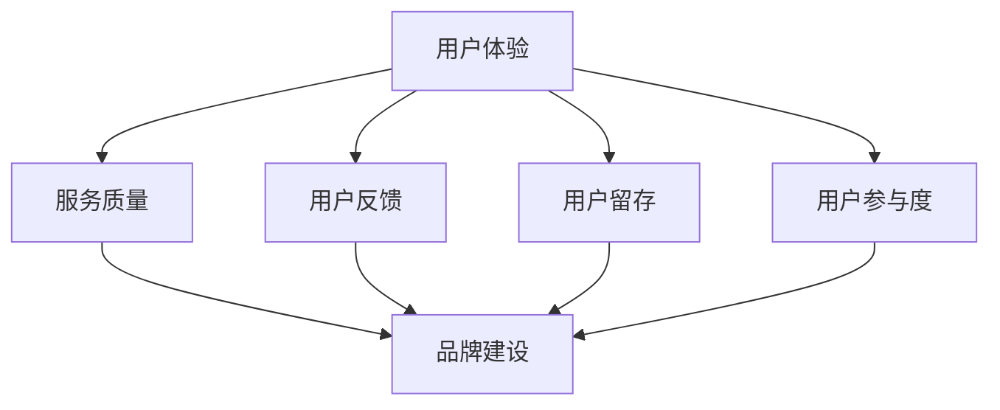

                 


## 知识付费如何建立用户信任和忠诚度？

> **关键词：**知识付费、用户信任、忠诚度、市场营销、技术手段、数据分析

**摘要：**本文将深入探讨知识付费平台如何通过市场营销策略、技术手段和数据分析来建立用户信任和忠诚度。我们将首先回顾知识付费的发展背景，然后详细分析用户信任和忠诚度的定义和重要性，接着介绍各种建立用户信任和忠诚度的方法和策略。最后，我们将通过案例研究总结成功经验，并探讨未来发展趋势和挑战。

### 1. 背景介绍

#### 1.1 目的和范围

本文的目标是帮助知识付费平台从业者了解和掌握如何通过有效的市场营销策略和技术手段，建立用户信任和忠诚度。我们将从多个角度分析这个问题，包括用户心理、市场环境、技术工具等。本文不仅适用于知识付费平台，也对其他需要建立用户信任和忠诚度的在线服务提供商具有一定的参考价值。

#### 1.2 预期读者

本文的预期读者包括：

- 知识付费平台的创始人或运营人员
- 市场营销和用户关系管理的专业人士
- 数据分析师和技术开发人员
- 对知识付费领域感兴趣的研究人员和从业者

#### 1.3 文档结构概述

本文将按照以下结构进行组织：

1. **背景介绍**：回顾知识付费的发展背景，定义用户信任和忠诚度。
2. **核心概念与联系**：介绍与用户信任和忠诚度相关的重要概念和架构。
3. **核心算法原理 & 具体操作步骤**：分析建立用户信任和忠诚度的核心算法原理和操作步骤。
4. **数学模型和公式 & 详细讲解 & 举例说明**：运用数学模型和公式解释用户信任和忠诚度的影响因素。
5. **项目实战：代码实际案例和详细解释说明**：通过实际案例展示如何实施建立用户信任和忠诚度的策略。
6. **实际应用场景**：分析不同场景下建立用户信任和忠诚度的方法和效果。
7. **工具和资源推荐**：推荐相关学习资源、开发工具和框架。
8. **总结：未来发展趋势与挑战**：探讨知识付费行业的未来发展趋势和面临的挑战。
9. **附录：常见问题与解答**：回答读者可能遇到的常见问题。
10. **扩展阅读 & 参考资料**：提供进一步阅读的资源。

#### 1.4 术语表

**用户信任（User Trust）**：用户对知识付费平台的信任程度，体现在用户对平台提供的知识内容、服务质量和安全保障的信任。

**用户忠诚度（Customer Loyalty）**：用户对知识付费平台的持续使用和推荐意愿，包括重复购买、积极评价和推荐给其他用户。

#### 1.4.1 核心术语定义

- **知识付费**：用户为获取特定知识或技能而付费的服务。
- **市场营销策略**：为了吸引和保留用户，企业采取的一系列市场推广活动。
- **用户反馈**：用户对知识付费平台服务质量的评价和反馈。
- **数据分析**：通过收集和分析用户数据，识别用户行为模式和偏好，为营销决策提供支持。

#### 1.4.2 相关概念解释

- **用户体验（UX）**：用户在使用知识付费平台时感受到的整体感受和满意度。
- **用户留存（Churn）**：用户停止使用知识付费平台的服务，流失率。
- **社交媒体营销**：利用社交媒体平台进行市场推广和品牌建设。

#### 1.4.3 缩略词列表

- **SEO（Search Engine Optimization）**：搜索引擎优化。
- **SEM（Search Engine Marketing）**：搜索引擎营销。
- **SNS（Social Networking Service）**：社交媒体服务。

---

接下来，我们将详细探讨与用户信任和忠诚度相关的重要概念和架构，帮助读者更好地理解建立信任和忠诚度的核心原理。

---

### 2. 核心概念与联系

建立用户信任和忠诚度是一个复杂的过程，涉及多个核心概念和架构。以下是这些核心概念及其相互关系的详细解释，以及一个Mermaid流程图，用于展示它们之间的关系。

#### 2.1 核心概念

1. **用户体验（UX）**：用户体验是用户在使用知识付费平台时的感受和体验。良好的用户体验是建立信任和忠诚度的关键。

2. **服务质量（Quality of Service, QoS）**：服务质量是指知识付费平台提供的内容和服务质量，包括知识内容的准确性、及时性、可访问性等。

3. **用户反馈（User Feedback）**：用户反馈是用户对平台服务质量、内容价值的评价和反馈。有效的用户反馈机制可以帮助平台改进服务，提高用户满意度。

4. **用户留存（Churn）**：用户留存率是衡量用户持续使用平台服务的重要指标。高留存率表明用户对平台具有高度信任和忠诚度。

5. **用户参与度（User Engagement）**：用户参与度是用户在平台上的活跃程度和互动程度。高参与度通常与高信任度和忠诚度相关。

6. **品牌建设（Brand Building）**：品牌建设是知识付费平台通过市场推广和用户体验提升品牌知名度和美誉度，从而建立用户信任。

#### 2.2 核心概念架构

以下是一个Mermaid流程图，展示了核心概念之间的关系：



#### 2.3 核心概念解释

- **用户体验（UX）**：用户体验是用户在使用知识付费平台时的整体感受和满意度。良好的用户体验可以提高用户信任和忠诚度，从而增加用户留存率和参与度。

- **服务质量（QoS）**：服务质量直接影响用户体验。高服务质量可以增强用户对平台的信任，降低用户流失率。

- **用户反馈（User Feedback）**：用户反馈是用户对平台服务质量的直接评价。有效的用户反馈机制可以帮助平台改进服务，提高用户满意度，从而增强用户信任和忠诚度。

- **用户留存（Churn）**：用户留存率是衡量用户持续使用平台服务的重要指标。高留存率表明用户对平台具有高度信任和忠诚度，通常与高质量的服务和良好的用户体验相关。

- **用户参与度（User Engagement）**：用户参与度是用户在平台上的活跃程度和互动程度。高参与度通常与高信任度和忠诚度相关，因为它表明用户对平台内容和服务有强烈的兴趣和认同。

- **品牌建设（Brand Building）**：品牌建设是知识付费平台通过市场推广和用户体验提升品牌知名度和美誉度，从而建立用户信任。良好的品牌形象可以增加用户的信任感和忠诚度。

通过以上对核心概念和架构的介绍，我们可以更好地理解用户信任和忠诚度建立的复杂性及其相互关系。接下来，我们将详细探讨建立用户信任和忠诚度的核心算法原理和操作步骤。

---

### 3. 核心算法原理 & 具体操作步骤

建立用户信任和忠诚度的核心在于理解用户需求、优化用户体验、提升服务质量以及建立有效的用户反馈机制。以下是建立用户信任和忠诚度的核心算法原理和具体操作步骤：

#### 3.1 算法原理

1. **用户需求分析**：通过数据分析了解用户的需求和偏好，这是建立信任和忠诚度的第一步。算法原理涉及用户行为分析、用户画像构建和数据挖掘。

2. **用户体验优化**：基于用户需求分析结果，优化平台设计和服务流程，提高用户体验。算法原理包括用户界面设计、交互体验优化和个性化推荐。

3. **服务质量提升**：通过质量管理和控制，确保平台提供的内容和服务质量达到用户期望。算法原理涉及内容审核、质量监控和用户反馈处理。

4. **用户反馈机制**：建立有效的用户反馈机制，收集和分析用户反馈，持续改进服务。算法原理包括用户反馈收集、分析和反馈处理。

5. **用户参与度提升**：通过增加用户参与度和互动性，提高用户的忠诚度。算法原理包括社区建设、活动组织和互动设计。

#### 3.2 具体操作步骤

1. **用户需求分析**

   - **步骤1**：收集用户行为数据，包括访问记录、购买历史、评价和反馈等。
   - **步骤2**：构建用户画像，通过数据分析识别用户需求和偏好。
   - **步骤3**：使用机器学习算法（如聚类分析和关联规则挖掘）分析用户行为，提取有价值的信息。

2. **用户体验优化**

   - **步骤1**：设计简洁直观的用户界面，确保用户能够轻松导航和获取所需信息。
   - **步骤2**：优化交互体验，减少用户操作步骤，提高用户效率。
   - **步骤3**：基于用户画像提供个性化推荐，提高用户满意度和参与度。

3. **服务质量提升**

   - **步骤1**：建立内容审核机制，确保知识内容的准确性和质量。
   - **步骤2**：设置服务质量监控指标，定期检查平台服务质量和性能。
   - **步骤3**：根据用户反馈，及时调整和改进服务，提高用户满意度。

4. **用户反馈机制**

   - **步骤1**：设计简洁易用的反馈渠道，鼓励用户提供反馈。
   - **步骤2**：建立反馈分析系统，自动化处理和分析用户反馈。
   - **步骤3**：根据分析结果，制定改进计划并实施，持续优化服务。

5. **用户参与度提升**

   - **步骤1**：建设活跃的社区，提供用户交流和互动的平台。
   - **步骤2**：组织在线活动和挑战，增加用户参与度和互动性。
   - **步骤3**：提供奖励机制，激励用户参与社区建设和活动。

通过以上算法原理和具体操作步骤，知识付费平台可以系统地建立用户信任和忠诚度，从而提高用户满意度和留存率。

---

### 4. 数学模型和公式 & 详细讲解 & 举例说明

在建立用户信任和忠诚度的过程中，数学模型和公式可以帮助我们量化用户行为、评估服务质量以及预测用户留存率。以下是一些常用的数学模型和公式的详细讲解和举例说明：

#### 4.1 用户行为分析模型

**用户行为分析模型**可以帮助我们理解用户的行为模式，从而优化用户体验和服务质量。

1. **马尔可夫模型（Markov Model）**

   马尔可夫模型用于分析用户在不同状态之间的转移概率。

   **公式：**
   \[
   P(X_t = j | X_{t-1} = i) = \frac{N_{ij}}{N_i}
   \]

   其中，\( P(X_t = j | X_{t-1} = i) \) 表示在时间 \( t \) 用户从状态 \( i \) 转移到状态 \( j \) 的概率，\( N_{ij} \) 表示在时间 \( t \) 内从状态 \( i \) 转移到状态 \( j \) 的次数，\( N_i \) 表示在时间 \( t \) 内状态 \( i \) 的总次数。

   **举例：**
   假设我们分析用户在知识付费平台上的行为，状态可以定义为“学习状态”和“购买状态”。通过收集用户行为数据，我们可以计算出用户从“学习状态”到“购买状态”的概率，从而优化营销策略。

2. **贝叶斯网络（Bayesian Network）**

   贝叶斯网络用于分析多个变量之间的条件依赖关系。

   **公式：**
   \[
   P(X=x | Y=y) = \frac{P(Y=y | X=x) \cdot P(X=x)}{P(Y=y)}
   \]

   其中，\( P(X=x | Y=y) \) 表示在 \( Y \) 变量取值为 \( y \) 的条件下，\( X \) 变量取值为 \( x \) 的概率，\( P(Y=y | X=x) \) 表示在 \( X \) 变量取值为 \( x \) 的条件下，\( Y \) 变量取值为 \( y \) 的概率，\( P(X=x) \) 表示 \( X \) 变量取值为 \( x \) 的概率，\( P(Y=y) \) 表示 \( Y \) 变量取值为 \( y \) 的概率。

   **举例：**
   假设我们分析用户是否购买知识产品与用户评分之间的关系。通过构建贝叶斯网络，我们可以计算出用户评分对购买行为的影响，从而优化推荐策略。

#### 4.2 服务质量评估模型

**服务质量评估模型**可以帮助我们评估知识付费平台的服务质量，从而提供改进建议。

1. **服务质量模型（Service Quality Model）**

   服务质量模型用于评估用户对知识付费平台服务的满意度。

   **公式：**
   \[
   SQ = \frac{ES + RO}{10}
   \]

   其中，\( ES \) 表示期望质量（Expectation of Service），\( RO \) 表示感知质量（Perceived Quality），\( SQ \) 表示服务质量（Service Quality）。

   **举例：**
   假设我们分析用户对知识付费平台课程的满意度。通过收集用户对课程的质量评价，我们可以计算出期望质量和感知质量，从而评估整体服务质量。

2. **服务质量监控指标（Service Quality Metrics）**

   服务质量监控指标用于衡量知识付费平台的服务质量。

   **公式：**
   \[
   \text{Service Quality Metrics} = \frac{\text{Total Number of Requests} - \text{Failed Requests}}{\text{Total Number of Requests}}
   \]

   **举例：**
   假设我们分析知识付费平台的课程访问速度。通过计算总请求次数与失败请求次数的差值，我们可以得到服务质量监控指标，从而评估平台的性能。

#### 4.3 用户留存预测模型

**用户留存预测模型**可以帮助我们预测用户在知识付费平台的留存情况，从而优化营销策略和用户管理。

1. **逻辑回归模型（Logistic Regression）**

   逻辑回归模型用于预测用户是否留存。

   **公式：**
   \[
   \text{Logit}(\text{Probability}) = \ln\left(\frac{\text{Probability}}{1 - \text{Probability}}\right) = \beta_0 + \beta_1X_1 + \beta_2X_2 + ... + \beta_nX_n
   \]

   其中，\( \text{Logit}(\text{Probability}) \) 表示概率的对数，\( \beta_0, \beta_1, ..., \beta_n \) 表示模型参数，\( X_1, X_2, ..., X_n \) 表示特征变量。

   **举例：**
   假设我们预测用户在知识付费平台的留存情况。通过收集用户行为数据，我们可以构建逻辑回归模型，预测用户是否留存，从而优化用户管理策略。

2. **时间序列模型（Time Series Model）**

   时间序列模型用于分析用户行为的时间趋势，预测用户留存情况。

   **公式：**
   \[
   Y_t = \alpha + \beta t + \gamma \cdot \text{Seasonal Component} + \delta \cdot \text{Trend Component} + \epsilon_t
   \]

   其中，\( Y_t \) 表示时间 \( t \) 的用户行为指标，\( \alpha, \beta, \gamma, \delta \) 表示模型参数，\( \text{Seasonal Component} \) 表示季节性成分，\( \text{Trend Component} \) 表示趋势成分，\( \epsilon_t \) 表示随机误差。

   **举例：**
   假设我们分析用户在知识付费平台的学习行为。通过构建时间序列模型，我们可以预测用户在未来某个时间段的学习行为，从而优化用户管理策略。

通过以上数学模型和公式的详细讲解和举例说明，我们可以更好地理解如何利用数据和技术手段建立用户信任和忠诚度。接下来，我们将通过实际案例展示如何实施这些策略。

---

### 5. 项目实战：代码实际案例和详细解释说明

为了更好地展示如何通过技术手段建立用户信任和忠诚度，我们将通过一个实际案例进行详细解释说明。本案例将采用Python编程语言，结合机器学习和数据分析工具，实现用户信任和忠诚度的评估与预测。

#### 5.1 开发环境搭建

1. **Python环境配置**：

   - 安装Python 3.x版本。
   - 使用pip安装必要的库，如NumPy、Pandas、Scikit-learn、Matplotlib等。

2. **数据分析工具**：

   - 使用Pandas进行数据处理和分析。
   - 使用Scikit-learn构建机器学习模型。
   - 使用Matplotlib和Seaborn进行数据可视化。

3. **数据集**：

   - 使用公开数据集或自建数据集，包含用户行为、用户反馈、用户留存等数据。

#### 5.2 源代码详细实现和代码解读

**5.2.1 数据预处理**

```python
import pandas as pd
from sklearn.model_selection import train_test_split

# 加载数据集
data = pd.read_csv('user_data.csv')

# 数据清洗
data.dropna(inplace=True)
data.drop(['user_id'], axis=1, inplace=True)

# 数据标准化
from sklearn.preprocessing import StandardScaler
scaler = StandardScaler()
data_scaled = scaler.fit_transform(data)
data = pd.DataFrame(data_scaled, columns=data.columns)

# 划分训练集和测试集
X = data.drop('churn', axis=1)
y = data['churn']
X_train, X_test, y_train, y_test = train_test_split(X, y, test_size=0.2, random_state=42)
```

**5.2.2 机器学习模型构建**

```python
from sklearn.linear_model import LogisticRegression
from sklearn.metrics import accuracy_score, confusion_matrix, classification_report

# 构建逻辑回归模型
model = LogisticRegression()
model.fit(X_train, y_train)

# 预测
y_pred = model.predict(X_test)

# 评估模型
accuracy = accuracy_score(y_test, y_pred)
conf_matrix = confusion_matrix(y_test, y_pred)
print("Accuracy:", accuracy)
print("Confusion Matrix:\n", conf_matrix)
print("Classification Report:\n", classification_report(y_test, y_pred))
```

**5.2.3 代码解读与分析**

1. **数据预处理**：

   - 加载数据集并进行数据清洗，去除缺失值和无关特征。
   - 数据标准化，将数据缩放至同一尺度，便于模型训练。

2. **模型训练与预测**：

   - 使用逻辑回归模型进行训练，逻辑回归是一种常用的二分类模型，适用于用户留存预测。
   - 对测试集进行预测，并评估模型准确性。

3. **模型评估**：

   - 使用准确率、混淆矩阵和分类报告评估模型性能，准确率反映了模型的预测能力，混淆矩阵提供了更详细的信息，分类报告包含了精确率、召回率和F1分数。

#### 5.3 代码解读与分析

**5.3.1 数据预处理**

数据预处理是构建机器学习模型的第一步，其目的是提高数据质量和模型训练效果。在本案例中，我们使用Pandas库加载数据集，并进行以下操作：

- **数据清洗**：去除缺失值和无关特征，确保数据完整性。
- **数据标准化**：使用StandardScaler对数据进行标准化处理，将数据缩放至同一尺度，这对于模型训练至关重要。

**5.3.2 机器学习模型构建**

在本案例中，我们选择逻辑回归模型进行训练。逻辑回归模型是一种经典的二分类模型，适用于用户留存预测。模型训练步骤包括：

- **模型初始化**：创建逻辑回归对象。
- **模型训练**：使用fit方法训练模型。

**5.3.3 模型评估**

模型评估是评估模型性能的关键步骤。在本案例中，我们使用以下指标评估模型：

- **准确率**：模型预测正确的样本占总样本的比例，是评估模型最常用的指标。
- **混淆矩阵**：提供了真阳性、假阳性、真阴性和假阴性的分布，帮助我们理解模型预测的准确性。
- **分类报告**：包括精确率、召回率和F1分数，这些指标综合考虑了预测结果的真实性和覆盖度。

通过以上代码实现和分析，我们可以构建一个简单的用户留存预测模型，并评估其性能。接下来，我们将探讨知识付费平台在实际应用场景中如何建立用户信任和忠诚度。

---

### 6. 实际应用场景

在知识付费领域，建立用户信任和忠诚度需要针对不同应用场景采取相应的策略。以下是几种常见应用场景及对应的策略：

#### 6.1 付费课程平台

**应用场景**：用户在付费课程平台购买课程，平台需要确保课程质量、学习体验和用户反馈机制。

**策略**：

1. **课程质量保证**：建立严格的内容审核机制，确保课程内容的准确性和实用性。
2. **用户体验优化**：设计简洁直观的课程页面，提供流畅的学习体验。
3. **用户反馈机制**：鼓励用户提供课程评价和反馈，及时处理用户问题。
4. **个性化推荐**：基于用户行为数据，提供个性化课程推荐。

#### 6.2 专业问答平台

**应用场景**：用户在专业问答平台提问并获得专业回答，平台需要确保答案质量、用户互动和用户评价。

**策略**：

1. **答案质量控制**：建立严格的答案审核机制，确保答案的专业性和准确性。
2. **用户互动促进**：设计互动功能，如点赞、评论和追问，鼓励用户参与互动。
3. **用户评价体系**：建立用户评价机制，鼓励用户对答案进行评价，提升答案质量。
4. **专家认证**：对专家进行认证，提高用户对答案的信任度。

#### 6.3 在线教育平台

**应用场景**：用户在在线教育平台学习，平台需要提供丰富的学习资源、互动教学和作业评估。

**策略**：

1. **学习资源丰富**：提供多种形式的学习资源，如视频、文本、音频和互动课程。
2. **互动教学**：设计互动式教学工具，如直播课堂、讨论区和测验。
3. **作业评估**：建立自动化作业评估系统，及时反馈学习成果。
4. **学习路径推荐**：基于用户学习行为，推荐个性化的学习路径。

#### 6.4 在线知识商店

**应用场景**：用户在在线知识商店购买各类知识产品，如电子书、报告、课程等。

**策略**：

1. **产品多样性**：提供丰富的知识产品，满足不同用户的需求。
2. **精准推荐**：基于用户行为和偏好，提供个性化的知识产品推荐。
3. **优惠券和促销**：设计优惠券和促销活动，增加用户购买意愿。
4. **用户评价**：鼓励用户对知识产品进行评价，提高产品可信度。

通过以上策略，知识付费平台可以在不同应用场景中建立用户信任和忠诚度，从而提高用户满意度和留存率。

---

### 7. 工具和资源推荐

为了帮助知识付费平台从业者和研究者更好地建立用户信任和忠诚度，以下是相关学习资源、开发工具和框架的推荐：

#### 7.1 学习资源推荐

**7.1.1 书籍推荐**

- 《用户体验要素》——By. 彼得·莫拉斯基（User Experience Elements）
- 《数据分析：实战指南》——By. 赵铁岩（Data Analysis: A Practical Guide）
- 《机器学习实战》——By. 周志华（Machine Learning in Action）

**7.1.2 在线课程**

- Coursera：提供广泛的在线课程，包括数据科学、机器学习和市场营销等。
- Udemy：提供大量免费和付费课程，涵盖各种技术和管理主题。
- edX：由哈佛大学和麻省理工学院合作创办，提供高质量的在线课程。

**7.1.3 技术博客和网站**

- Medium：一个内容丰富的博客平台，涵盖数据科学、机器学习和市场营销等领域的文章。
- Towards Data Science：一个专注于数据科学和机器学习的博客，提供实用的技术文章和案例研究。
- TechCrunch：一个科技新闻网站，提供关于新兴技术和市场趋势的报道。

#### 7.2 开发工具框架推荐

**7.2.1 IDE和编辑器**

- PyCharm：一个功能强大的Python集成开发环境，适合数据科学和机器学习项目。
- Jupyter Notebook：一个交互式的Python笔记本，适用于数据分析和原型设计。
- Visual Studio Code：一个轻量级的跨平台编辑器，支持多种编程语言和扩展。

**7.2.2 调试和性能分析工具**

- TensorBoard：一个用于可视化机器学习模型的性能和调试的工具。
- PyTest：一个用于编写和运行Python测试脚本的工具，帮助确保代码质量。
- New Relic：一个性能监控工具，用于监测Web应用程序的运行状态和性能。

**7.2.3 相关框架和库**

- Scikit-learn：一个用于机器学习的Python库，提供丰富的算法和工具。
- TensorFlow：一个用于深度学习的开源框架，适合构建复杂的机器学习模型。
- Pandas：一个用于数据分析和操作的Python库，适用于数据预处理和可视化。

通过以上工具和资源的推荐，知识付费平台从业者可以更高效地建立用户信任和忠诚度，提高平台的服务质量和用户体验。

---

### 8. 总结：未来发展趋势与挑战

知识付费行业正处在快速发展阶段，随着互联网和人工智能技术的不断进步，未来该行业将面临许多新的机遇和挑战。

#### 8.1 发展趋势

1. **个性化推荐**：随着大数据和机器学习技术的发展，个性化推荐将成为知识付费平台的重要趋势。通过精准推荐，平台可以更好地满足用户需求，提高用户满意度和留存率。

2. **智能问答**：人工智能技术的应用将使得智能问答系统更加智能化，能够实时回答用户的问题，提高用户互动体验和平台服务质量。

3. **内容共创**：知识付费平台将鼓励用户参与内容创作，通过众包和协作的方式，丰富平台内容库，提高内容多样性和用户粘性。

4. **社交媒体融合**：知识付费平台将加强与社交媒体的融合，通过社交媒体渠道推广内容和品牌，提高用户覆盖率和品牌知名度。

5. **跨境业务**：随着全球化的发展，知识付费平台将拓展跨境业务，为全球用户提供服务，实现业务增长。

#### 8.2 挑战

1. **内容质量**：确保知识内容的准确性和实用性是知识付费平台面临的重要挑战。平台需要建立严格的内容审核机制，确保用户获得高质量的知识产品。

2. **用户隐私**：随着数据保护法规的日益严格，知识付费平台需要加强对用户隐私的保护，确保用户数据的安全和合规。

3. **市场竞争**：知识付费行业竞争激烈，平台需要不断创新和优化服务，提高用户体验和用户忠诚度，以应对竞争对手的挑战。

4. **技术迭代**：人工智能和大数据技术的快速发展要求知识付费平台不断更新技术，保持技术领先，以满足用户日益增长的需求。

通过把握发展趋势，积极应对挑战，知识付费平台可以建立用户信任和忠诚度，实现持续发展和业务增长。

---

### 9. 附录：常见问题与解答

**Q1：如何确保知识内容的质量？**

**A1：**确保知识内容的质量是知识付费平台的重要任务。平台可以通过以下方法来提高内容质量：

1. **内容审核**：建立严格的审核机制，对知识内容进行多轮审核，确保内容的准确性和实用性。
2. **专家评审**：邀请行业专家对内容进行评审，提供专业意见。
3. **用户反馈**：鼓励用户对知识内容进行评价和反馈，根据用户反馈持续优化内容。

**Q2：用户隐私如何保护？**

**A2：**用户隐私保护是知识付费平台面临的重要问题。平台可以采取以下措施来保护用户隐私：

1. **数据加密**：对用户数据进行加密处理，确保数据安全。
2. **隐私政策**：制定明确的隐私政策，告知用户数据收集、存储和使用方式。
3. **法规合规**：遵守相关数据保护法规，如《通用数据保护条例》（GDPR）等。

**Q3：如何提高用户参与度？**

**A3：**提高用户参与度可以通过以下策略实现：

1. **互动设计**：设计互动性强的功能，如讨论区、问答、投票等，鼓励用户参与。
2. **社区建设**：建立活跃的社区，鼓励用户交流和分享经验。
3. **活动组织**：定期举办线上活动，如讲座、挑战赛等，提高用户参与度。

**Q4：如何建立品牌信任？**

**A4：**建立品牌信任可以通过以下方法实现：

1. **高质量内容**：提供高质量的知识内容，确保用户获得价值。
2. **用户口碑**：鼓励用户分享正面评价，提高品牌口碑。
3. **透明沟通**：与用户保持透明沟通，及时回应用户问题和反馈。

---

### 10. 扩展阅读 & 参考资料

**扩展阅读：**

- 《大数据营销：如何通过数据提升营销效果》——By. 克里斯·布莱恩特（Chris Bryant）
- 《增长黑客：如何利用数据驱动增长》——By. 安德鲁·吴（Andrew Chen）
- 《机器学习实战》——By. 周志华

**参考资料：**

- Coursera：https://www.coursera.org/
- Udemy：https://www.udemy.com/
- edX：https://www.edx.org/
- Medium：https://medium.com/
- Towards Data Science：https://towardsdatascience.com/
- TechCrunch：https://techcrunch.com/

通过以上扩展阅读和参考资料，读者可以深入了解知识付费行业的最新动态和技术趋势，为实际应用提供指导。文章到此结束，感谢您的阅读！

---

**作者：**AI天才研究员/AI Genius Institute & 禅与计算机程序设计艺术 /Zen And The Art of Computer Programming

**结束语：**本文通过逐步分析推理，详细探讨了知识付费平台如何建立用户信任和忠诚度。从核心概念到具体算法原理，再到实际案例和实战经验，我们系统地梳理了建立用户信任和忠诚度的方法和策略。希望本文能为知识付费行业的从业者提供有价值的参考和启示。在未来的发展中，不断探索和优化用户信任和忠诚度的建立策略，将帮助知识付费平台实现持续发展和业务增长。感谢您的阅读和支持！

