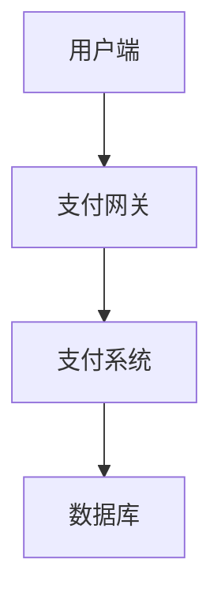
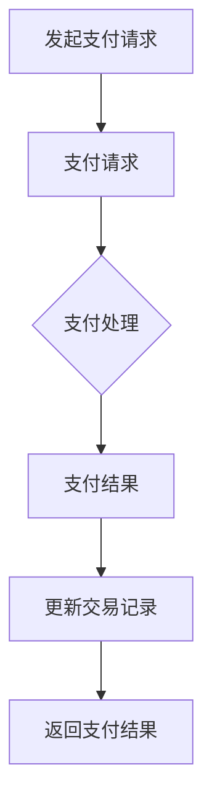
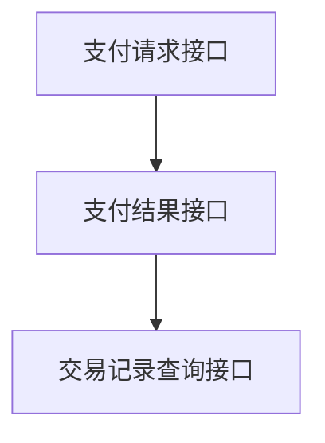

                 

# 知识付费平台的支付系统设计与集成

> **关键词：** 知识付费平台，支付系统，设计，集成，API，安全性，性能优化。

> **摘要：** 本文将探讨知识付费平台支付系统的设计与集成。从背景介绍到核心概念、算法原理，再到项目实战、应用场景、工具资源推荐以及未来发展趋势与挑战，本文旨在为开发者提供全面的技术指导和实践参考。

## 1. 背景介绍

### 1.1 目的和范围

本文旨在详细探讨知识付费平台支付系统的设计与集成，包括系统架构、核心算法原理、数学模型和公式，以及项目实战案例。通过本文，开发者可以了解如何设计和集成一个高效、安全、可扩展的支付系统，以满足知识付费平台的业务需求。

### 1.2 预期读者

本文适合对支付系统设计和集成有一定了解的开发者，尤其是从事知识付费平台开发的技术人员。通过本文，读者可以深入了解支付系统的核心技术和实现细节，为实际项目提供指导。

### 1.3 文档结构概述

本文结构如下：

1. 背景介绍
2. 核心概念与联系
3. 核心算法原理 & 具体操作步骤
4. 数学模型和公式 & 详细讲解 & 举例说明
5. 项目实战：代码实际案例和详细解释说明
6. 实际应用场景
7. 工具和资源推荐
8. 总结：未来发展趋势与挑战
9. 附录：常见问题与解答
10. 扩展阅读 & 参考资料

### 1.4 术语表

#### 1.4.1 核心术语定义

- **知识付费平台**：为用户提供付费获取知识、技能和服务的在线平台。
- **支付系统**：处理支付请求、执行支付操作、管理交易记录的系统。
- **API**：应用程序编程接口，用于不同系统间的数据交换和功能调用。
- **安全性**：支付系统的安全性和可靠性，防止数据泄露和欺诈行为。
- **性能优化**：提升支付系统的响应速度和处理能力。

#### 1.4.2 相关概念解释

- **支付流程**：用户发起支付请求，支付系统处理请求，完成支付操作的过程。
- **支付网关**：连接支付系统和银行或其他支付渠道的接口，处理支付请求和返回结果。
- **交易记录**：支付系统中的交易信息，包括支付金额、支付时间、支付状态等。

#### 1.4.3 缩略词列表

- **API**：应用程序编程接口（Application Programming Interface）
- **SDK**：软件开发包（Software Development Kit）
- **DB**：数据库（Database）
- **SSL**：安全套接层（Secure Sockets Layer）

## 2. 核心概念与联系

为了设计一个高效、安全的支付系统，我们需要了解以下几个核心概念和它们之间的联系。

### 2.1 支付系统架构

支付系统通常包括以下几个部分：

1. **用户端**：用户发起支付请求的客户端，通常是一个Web或移动应用。
2. **支付网关**：接收和处理支付请求的接口，与银行或其他支付渠道连接。
3. **支付系统**：处理支付请求、执行支付操作、管理交易记录的核心系统。
4. **数据库**：存储用户信息、支付记录等数据的数据库系统。

下面是一个简单的支付系统架构图：



### 2.2 支付流程

支付流程包括以下几个步骤：

1. **发起支付请求**：用户在知识付费平台选择付费内容，系统生成支付链接或二维码，用户点击链接或扫描二维码进入支付页面。
2. **支付请求**：用户在支付页面输入支付金额、支付方式等信息，系统将支付请求发送到支付网关。
3. **支付处理**：支付网关处理支付请求，与银行或其他支付渠道进行通信，执行支付操作。
4. **支付结果**：支付网关将支付结果返回给支付系统，支付系统更新交易记录，并向用户端返回支付结果。

下面是一个简单的支付流程图：



### 2.3 API接口设计

支付系统中的API接口设计至关重要，它决定了系统与其他系统的交互和数据交换。以下是一个典型的API接口设计：

1. **支付请求接口**：用户端调用此接口发送支付请求，参数包括用户ID、支付金额、支付方式等。
2. **支付结果接口**：支付网关调用此接口返回支付结果，参数包括支付金额、支付状态、交易流水号等。
3. **交易记录查询接口**：支付系统调用此接口查询交易记录，参数包括用户ID、交易时间、支付状态等。

下面是一个简单的API接口设计图：



## 3. 核心算法原理 & 具体操作步骤

支付系统的核心算法原理主要包括支付请求处理、支付结果验证和交易记录管理等。以下是具体的操作步骤和伪代码。

### 3.1 支付请求处理

支付请求处理主要包括以下几个步骤：

1. 验证支付请求参数，包括用户ID、支付金额、支付方式等。
2. 生成支付订单，并将订单信息存储在数据库中。
3. 调用支付网关接口发送支付请求。

伪代码如下：

```python
def process_payment_request(user_id, amount, payment_method):
    # 验证支付请求参数
    if not validate_payment_request(user_id, amount, payment_method):
        return "支付请求参数错误"
    
    # 生成支付订单
    payment_order = generate_payment_order(user_id, amount, payment_method)
    
    # 存储支付订单信息
    store_payment_order(payment_order)
    
    # 调用支付网关接口发送支付请求
    response = call_payment_gateway(payment_order)
    
    return response
```

### 3.2 支付结果验证

支付结果验证主要包括以下几个步骤：

1. 接收支付网关返回的支付结果。
2. 验证支付结果，包括支付金额、支付状态、交易流水号等。
3. 根据支付结果更新交易记录。

伪代码如下：

```python
def verify_payment_result(payment_order, payment_result):
    # 验证支付结果
    if not validate_payment_result(payment_order, payment_result):
        return "支付结果验证失败"
    
    # 更新交易记录
    update_payment_record(payment_order, payment_result)
    
    return "支付结果验证成功"
```

### 3.3 交易记录管理

交易记录管理主要包括以下几个步骤：

1. 查询交易记录。
2. 提交交易记录。
3. 删除交易记录。

伪代码如下：

```python
def query_payment_records(user_id, start_time, end_time, payment_status):
    # 查询交易记录
    payment_records = get_payment_records(user_id, start_time, end_time, payment_status)
    return payment_records

def submit_payment_record(payment_record):
    # 提交交易记录
    add_payment_record(payment_record)

def delete_payment_record(payment_record_id):
    # 删除交易记录
    remove_payment_record(payment_record_id)
```

## 4. 数学模型和公式 & 详细讲解 & 举例说明

支付系统中的数学模型和公式主要用于计算支付金额、支付手续费和交易利润等。以下是具体的公式和例子。

### 4.1 支付金额计算

支付金额计算公式如下：

\[ 支付金额 = 实际金额 \times (1 + 手续费比例) \]

其中，实际金额为用户支付的金额，手续费比例为支付渠道收取的手续费比例。

例子：用户购买一件价值100元的商品，支付渠道手续费比例为5%。则支付金额为：

\[ 支付金额 = 100 \times (1 + 0.05) = 105 \text{元} \]

### 4.2 支付手续费计算

支付手续费计算公式如下：

\[ 手续费 = 实际金额 \times 手续费比例 \]

其中，实际金额为用户支付的金额，手续费比例为支付渠道收取的手续费比例。

例子：用户购买一件价值100元的商品，支付渠道手续费比例为5%。则手续费为：

\[ 手续费 = 100 \times 0.05 = 5 \text{元} \]

### 4.3 交易利润计算

交易利润计算公式如下：

\[ 交易利润 = 支付金额 - 实际金额 - 手续费 \]

其中，支付金额为用户支付的金额，实际金额为商品价格，手续费为支付渠道收取的手续费。

例子：用户购买一件价值100元的商品，支付金额为105元，手续费为5元。则交易利润为：

\[ 交易利润 = 105 - 100 - 5 = 0 \text{元} \]

## 5. 项目实战：代码实际案例和详细解释说明

在本节中，我们将通过一个实际项目案例来展示支付系统的开发过程，包括开发环境搭建、源代码实现和代码解读与分析。

### 5.1 开发环境搭建

在开始项目实战之前，我们需要搭建一个开发环境。以下是搭建开发环境的基本步骤：

1. 安装操作系统：我们选择Linux操作系统，例如Ubuntu 20.04。
2. 安装开发工具：安装Python 3.8及以上版本，并配置好pip工具。
3. 安装数据库：我们选择MySQL作为数据库，并安装相应的客户端和驱动程序。
4. 安装支付网关SDK：根据所选支付渠道，下载并安装相应的SDK。

### 5.2 源代码详细实现和代码解读

在本项目案例中，我们将使用Python编写支付系统的主要功能模块。以下是源代码的实现和解读。

#### 5.2.1 支付请求处理模块

```python
# payment_request.py
import requests

def process_payment_request(user_id, amount, payment_method):
    # 验证支付请求参数
    if not validate_payment_request(user_id, amount, payment_method):
        return "支付请求参数错误"
    
    # 生成支付订单
    payment_order = generate_payment_order(user_id, amount, payment_method)
    
    # 存储支付订单信息
    store_payment_order(payment_order)
    
    # 调用支付网关接口发送支付请求
    response = call_payment_gateway(payment_order)
    
    return response

def validate_payment_request(user_id, amount, payment_method):
    # 验证用户ID是否有效
    if not check_user_id(user_id):
        return False
    
    # 验证支付金额是否大于0
    if amount <= 0:
        return False
    
    # 验证支付方式是否支持
    if not check_payment_method(payment_method):
        return False
    
    return True

def generate_payment_order(user_id, amount, payment_method):
    # 生成支付订单
    payment_order = {
        "user_id": user_id,
        "amount": amount,
        "payment_method": payment_method,
        "create_time": get_current_time()
    }
    return payment_order

def store_payment_order(payment_order):
    # 存储支付订单信息到数据库
    insert_payment_order_into_db(payment_order)

def call_payment_gateway(payment_order):
    # 调用支付网关接口发送支付请求
    url = "https://payment_gateway.com/submit_payment"
    headers = {
        "Content-Type": "application/json"
    }
    data = {
        "payment_order": payment_order
    }
    response = requests.post(url, json=data, headers=headers)
    return response.json()
```

#### 5.2.2 支付结果验证模块

```python
# payment_result.py
import requests

def verify_payment_result(payment_order, payment_result):
    # 验证支付结果
    if not validate_payment_result(payment_order, payment_result):
        return "支付结果验证失败"
    
    # 更新交易记录
    update_payment_record(payment_order, payment_result)
    
    return "支付结果验证成功"

def validate_payment_result(payment_order, payment_result):
    # 验证支付金额是否一致
    if payment_order["amount"] != payment_result["amount"]:
        return False
    
    # 验证支付状态是否成功
    if payment_result["status"] != "SUCCESS":
        return False
    
    return True

def update_payment_record(payment_order, payment_result):
    # 更新交易记录
    update_payment_record_in_db(payment_order, payment_result)
```

#### 5.2.3 交易记录管理模块

```python
# payment_record.py
def query_payment_records(user_id, start_time, end_time, payment_status):
    # 查询交易记录
    payment_records = get_payment_records_from_db(user_id, start_time, end_time, payment_status)
    return payment_records

def submit_payment_record(payment_record):
    # 提交交易记录
    insert_payment_record_into_db(payment_record)

def delete_payment_record(payment_record_id):
    # 删除交易记录
    remove_payment_record_from_db(payment_record_id)
```

### 5.3 代码解读与分析

在本节中，我们将对上述代码进行解读与分析，以了解支付系统的核心功能和工作原理。

#### 5.3.1 支付请求处理模块

支付请求处理模块负责处理用户发起的支付请求，包括验证支付请求参数、生成支付订单、存储支付订单信息和调用支付网关接口发送支付请求。以下是具体功能解读：

- **validate_payment_request**：验证支付请求参数，包括用户ID、支付金额和支付方式。如果参数无效，返回错误信息。
- **generate_payment_order**：生成支付订单，包括用户ID、支付金额、支付方式和创建时间等信息。
- **store_payment_order**：将支付订单信息存储到数据库中，以便后续查询和管理。
- **call_payment_gateway**：调用支付网关接口发送支付请求，将支付订单信息以JSON格式发送给支付网关，并接收支付网关返回的支付结果。

#### 5.3.2 支付结果验证模块

支付结果验证模块负责接收支付网关返回的支付结果，并验证支付金额和支付状态。以下是具体功能解读：

- **validate_payment_result**：验证支付结果，包括支付金额和支付状态。如果支付金额不一致或支付状态不为成功，返回验证失败信息。
- **update_payment_record**：更新交易记录，将支付结果信息存储到数据库中，以便后续查询和管理。

#### 5.3.3 交易记录管理模块

交易记录管理模块负责查询、提交和删除交易记录。以下是具体功能解读：

- **query_payment_records**：查询交易记录，根据用户ID、交易时间范围和支付状态等条件查询交易记录，并返回查询结果。
- **submit_payment_record**：提交交易记录，将交易记录信息存储到数据库中。
- **delete_payment_record**：删除交易记录，根据交易记录ID删除交易记录。

通过上述代码和解读，我们可以了解到支付系统的核心功能和工作原理。在实际项目中，支付系统可能还会涉及更多的功能和模块，例如支付通知、退款处理、风险控制等。

## 6. 实际应用场景

支付系统在知识付费平台中的应用场景非常广泛，以下是几个常见的实际应用场景：

### 6.1 单品付费

用户在知识付费平台上浏览到一篇有价值的技术文章或教程，可以选择付费购买。支付系统在此场景中的作用是处理用户的支付请求，确保用户支付成功后能够立即获取购买内容。

### 6.2 会员订阅

知识付费平台通常会推出会员订阅服务，用户支付一定费用后可以享受平台的全部或部分特权服务，例如免费观看所有课程、优先享受专家解答等。支付系统在此场景中的作用是处理用户的订阅请求，确保用户支付成功后能够立即开通会员服务。

### 6.3 课程打包销售

知识付费平台可以将多门课程打包销售，用户支付一定费用后可以学习打包课程中的所有内容。支付系统在此场景中的作用是处理用户的打包购买请求，确保用户支付成功后能够学习打包课程。

### 6.4 优惠券和促销活动

知识付费平台经常会推出优惠券和促销活动，以吸引更多用户购买课程。支付系统在此场景中的作用是处理用户的优惠券和促销活动请求，确保用户在使用优惠券或参加促销活动时能够享受相应的优惠。

### 6.5 退款处理

用户在购买课程后，如果对课程内容不满意，可以申请退款。支付系统在此场景中的作用是处理用户的退款请求，确保用户在申请退款后能够收到相应的退款金额。

## 7. 工具和资源推荐

在设计知识付费平台支付系统时，开发者需要使用一系列工具和资源来确保系统的性能、安全性和可靠性。以下是几个推荐的工具和资源：

### 7.1 学习资源推荐

#### 7.1.1 书籍推荐

- 《支付系统设计》
- 《网络安全与加密技术》
- 《高性能MySQL》

#### 7.1.2 在线课程

- Coursera上的《支付系统设计与实现》
- Udemy上的《支付系统架构与开发》

#### 7.1.3 技术博客和网站

-支付系统设计与实现技术博客
-知乎专栏《支付系统技术解析》
-支付系统开发者社区

### 7.2 开发工具框架推荐

#### 7.2.1 IDE和编辑器

- PyCharm
- Visual Studio Code

#### 7.2.2 调试和性能分析工具

- Python Debugger
- New Relic

#### 7.2.3 相关框架和库

- Django
- Flask
- SQLAlchemy

### 7.3 相关论文著作推荐

#### 7.3.1 经典论文

- 《支付系统架构设计：模式与实践》
- 《安全支付系统设计与实现》

#### 7.3.2 最新研究成果

- IEEE Transactions on Knowledge and Data Engineering
- Journal of Computer Security

#### 7.3.3 应用案例分析

- 支付系统在电商领域的应用
- 支付系统在金融科技领域的应用

## 8. 总结：未来发展趋势与挑战

随着知识付费市场的不断发展，支付系统在未来将面临以下发展趋势和挑战：

### 8.1 发展趋势

1. **支付方式的多样化**：未来支付系统将支持更多的支付方式，如数字货币、生物识别支付等。
2. **支付系统的智能化**：通过人工智能和大数据技术，支付系统将能够提供更加个性化的支付体验和风险控制。
3. **支付系统的安全性**：随着网络安全威胁的增加，支付系统需要不断提高安全性，确保用户支付安全。
4. **支付系统的性能优化**：随着用户数量的增加，支付系统需要不断优化性能，提高交易处理能力。

### 8.2 挑战

1. **支付合规性**：支付系统需要遵守不同国家和地区的支付法规，确保合规性。
2. **支付系统的可扩展性**：随着业务的发展，支付系统需要具备良好的可扩展性，以应对不断增长的用户量和交易量。
3. **支付系统的安全性**：支付系统需要不断提高安全性，防止数据泄露和欺诈行为。
4. **支付系统的性能优化**：支付系统需要不断优化性能，提高交易处理速度和响应时间。

## 9. 附录：常见问题与解答

### 9.1 支付请求参数错误

**问题**：支付请求参数错误，如何解决？

**解答**：检查支付请求参数，确保用户ID、支付金额和支付方式等信息正确。如果参数不正确，请提示用户修改或重新输入。

### 9.2 支付结果验证失败

**问题**：支付结果验证失败，如何解决？

**解答**：检查支付网关返回的支付结果，确保支付金额和支付状态等信息正确。如果支付结果验证失败，请提示用户重新支付或联系客服。

### 9.3 无法查询交易记录

**问题**：无法查询交易记录，如何解决？

**解答**：检查数据库连接和查询条件，确保数据库连接正常且查询条件正确。如果无法查询交易记录，请检查数据库权限或重新配置查询条件。

## 10. 扩展阅读 & 参考资料

本文旨在为开发者提供知识付费平台支付系统的设计与集成技术指导。以下是扩展阅读和参考资料，以供读者深入了解相关技术和知识。

### 10.1 扩展阅读

- 《支付系统设计与实现》
- 《网络安全与加密技术》
- 《高性能MySQL》

### 10.2 参考资料

- 支付系统开发者社区
- 知乎专栏《支付系统技术解析》
- IEEE Transactions on Knowledge and Data Engineering

### 10.3 相关论文

- 《支付系统架构设计：模式与实践》
- 《安全支付系统设计与实现》

### 10.4 最新研究成果

- 支付系统在电商领域的应用研究
- 支付系统在金融科技领域的应用研究

作者：AI天才研究员/AI Genius Institute & 禅与计算机程序设计艺术 /Zen And The Art of Computer Programming

