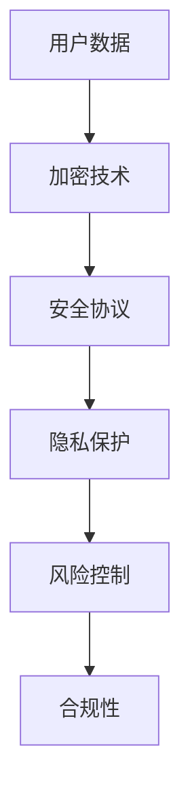
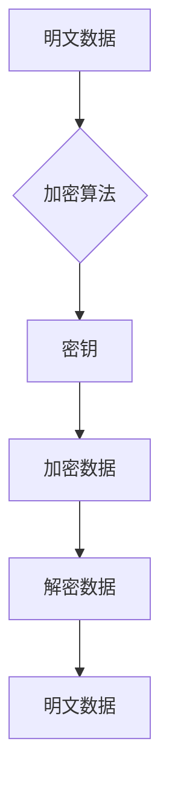
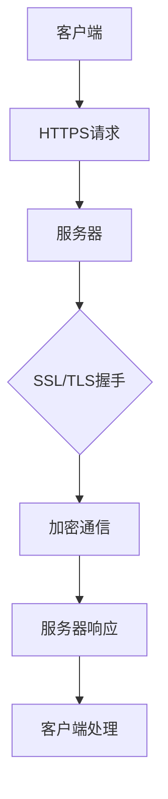
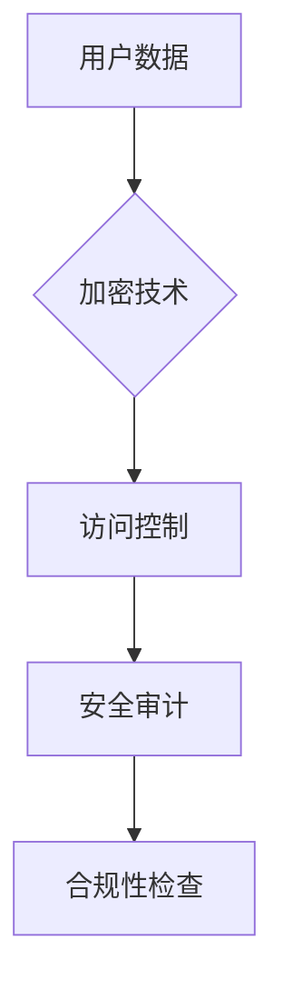
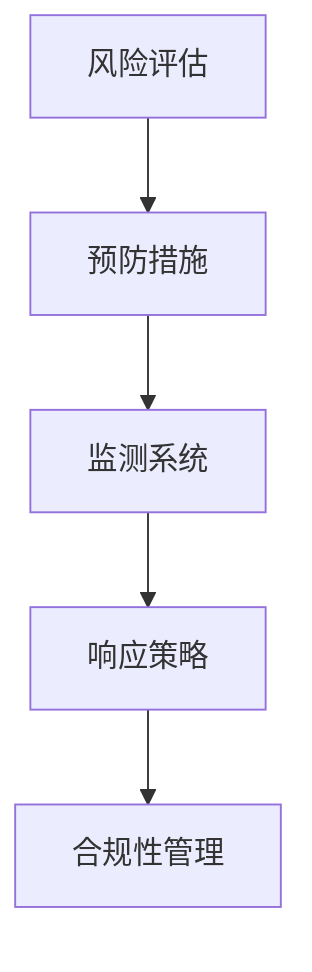

                 

# 知识付费平台的数据安全与风险控制

> **关键词：** 数据安全、风险控制、知识付费平台、加密技术、安全协议、隐私保护、监管合规

> **摘要：** 本文章将深入探讨知识付费平台在数据安全与风险控制方面的重要性和挑战。通过对核心概念的阐述、算法原理的分析、数学模型的讲解以及实际案例的展示，文章旨在为知识付费平台提供全面的安全策略和实施方法，以保障用户数据和平台的长期稳定运行。

## 1. 背景介绍

### 1.1 目的和范围

本文的目的是探讨知识付费平台在数据安全与风险控制方面的关键问题和解决方案。随着知识付费行业的迅猛发展，平台面临的数据量和隐私风险日益增加，本文将从技术和管理两个方面，为平台提供有效的安全策略。

### 1.2 预期读者

本文章预期读者包括知识付费平台的开发人员、安全工程师、产品经理以及对该领域感兴趣的技术爱好者。通过阅读本文，读者将能够了解到数据安全的核心技术和实际应用。

### 1.3 文档结构概述

本文结构如下：

- **第1章：背景介绍**：介绍本文的目的、预期读者和文档结构。
- **第2章：核心概念与联系**：阐述数据安全和风险控制的核心概念，并给出相关的流程图。
- **第3章：核心算法原理 & 具体操作步骤**：详细讲解数据加密和安全协议的原理。
- **第4章：数学模型和公式 & 详细讲解 & 举例说明**：介绍用于数据安全的数学模型和公式。
- **第5章：项目实战：代码实际案例和详细解释说明**：通过实际案例展示安全策略的实施。
- **第6章：实际应用场景**：分析数据安全在知识付费平台的应用。
- **第7章：工具和资源推荐**：推荐相关的学习资源和开发工具。
- **第8章：总结：未来发展趋势与挑战**：探讨数据安全领域的未来趋势和挑战。
- **第9章：附录：常见问题与解答**：提供常见问题及其解答。
- **第10章：扩展阅读 & 参考资料**：列出扩展阅读资料。

### 1.4 术语表

#### 1.4.1 核心术语定义

- **知识付费平台**：提供专业知识和技能的在线交易平台。
- **数据安全**：确保数据保密性、完整性和可用性。
- **风险控制**：通过预防、监测和响应措施减少潜在风险。

#### 1.4.2 相关概念解释

- **加密技术**：将数据转换为只有授权用户可以解密的形式。
- **安全协议**：规定数据在传输和处理过程中应遵循的规则和标准。
- **隐私保护**：保护用户个人信息不被未经授权访问。

#### 1.4.3 缩略词列表

- **AES**：高级加密标准（Advanced Encryption Standard）
- **SSL**：安全套接层（Secure Sockets Layer）
- **HTTPS**：超文本传输协议安全（Hyper Text Transfer Protocol Secure）

## 2. 核心概念与联系

数据安全和风险控制是知识付费平台运营的基石。以下是一个简单的Mermaid流程图，展示了数据安全的核心概念和联系。



### 2.1 加密技术

加密技术是数据安全的核心，它通过将明文数据转换为密文，确保数据在传输和存储过程中不被未经授权的用户访问。以下是一个简单的加密过程流程图：



### 2.2 安全协议

安全协议确保数据在传输和处理过程中遵循特定的规则和标准。HTTPS是应用广泛的安全协议，它结合了HTTP和SSL/TLS协议，提供了加密通信和身份验证功能。以下是一个简单的HTTPS通信流程图：



### 2.3 隐私保护

隐私保护涉及确保用户数据不被未经授权访问。这包括数据加密、访问控制和安全审计等措施。以下是一个简单的隐私保护流程图：



### 2.4 风险控制

风险控制旨在通过预防、监测和响应措施减少潜在风险。以下是一个简单风险控制流程图：



## 3. 核心算法原理 & 具体操作步骤

### 3.1 数据加密原理

数据加密的核心是加密算法，它将明文数据转换为密文。以下是一个简单的加密算法原理：

```plaintext
加密算法(明文, 密钥) {
    密文 = 明文 ⊕ 密钥
    return 密文
}
```

### 3.2 加密过程

加密过程包括以下步骤：

1. **选择加密算法和密钥**：选择合适的加密算法和生成密钥。
2. **加密数据**：将明文数据与密钥进行加密操作。
3. **存储或传输密文**：将加密后的数据存储在安全位置或传输到目的地。

以下是一个具体的加密操作步骤：

```plaintext
# 步骤1：选择加密算法和密钥
加密算法 = AES
密钥 = "mySecretKey"

# 步骤2：加密数据
明文 = "Hello, World!"
密文 = 加密算法(明文, 密钥)

# 步骤3：存储或传输密文
存储密文(密文)
```

### 3.3 数据解密原理

数据解密是加密的逆过程，它将密文还原为明文。以下是一个简单的解密算法原理：

```plaintext
解密算法(密文, 密钥) {
    明文 = 密文 ⊕ 密钥
    return 明文
}
```

### 3.4 解密过程

解密过程包括以下步骤：

1. **获取密文和密钥**：从安全位置或接收端获取密文和密钥。
2. **解密数据**：使用密钥对密文进行解密操作。
3. **验证数据完整性**：对解密后的数据进行验证，确保其完整性。

以下是一个具体的解密操作步骤：

```plaintext
# 步骤1：获取密文和密钥
密文 = 获取密文()
密钥 = "mySecretKey"

# 步骤2：解密数据
明文 = 解密算法(密文, 密钥)

# 步骤3：验证数据完整性
验证完整性(明文)
```

## 4. 数学模型和公式 & 详细讲解 & 举例说明

### 4.1 加密算法的数学模型

加密算法的核心是数学模型，它定义了加密和解密过程中的运算规则。以下是一个简单的加密算法的数学模型：

```latex
C = E(K, P)
P = D(K, C)
```

其中，\( C \) 表示密文，\( P \) 表示明文，\( K \) 表示密钥，\( E \) 表示加密函数，\( D \) 表示解密函数。

### 4.2 加密过程的详细讲解

加密过程涉及将明文转换为密文，具体包括以下几个步骤：

1. **初始化向量（IV）**：选择一个随机初始化向量，它用于加密算法的初始化。
2. **加密算法**：将明文和初始化向量输入加密算法，生成密文。
3. **密钥扩展**：根据密钥生成加密算法所需的密钥扩展值。

以下是一个简单的加密过程示例：

```latex
C = E(K, P, IV)
```

### 4.3 解密过程的详细讲解

解密过程涉及将密文还原为明文，具体包括以下几个步骤：

1. **获取密文和初始化向量**：从接收端获取密文和解密算法所需的初始化向量。
2. **解密算法**：将密文和解密算法的密钥扩展值输入解密算法，生成明文。
3. **验证数据完整性**：对解密后的数据进行验证，确保其完整性。

以下是一个简单的解密过程示例：

```latex
P = D(K, C, IV)
```

### 4.4 举例说明

以下是一个使用AES加密算法的加密和解密示例：

```plaintext
# 加密示例
明文 = "Hello, World!"
密钥 = "mySecretKey"
IV = "myIV"

加密算法 = AES(密钥, IV)
密文 = 加密算法(明文)

# 解密示例
解密算法 = AES(密钥, IV)
明文 = 解密算法(密文)
```

## 5. 项目实战：代码实际案例和详细解释说明

### 5.1 开发环境搭建

在本节中，我们将使用Python语言和PyCryptoDome库来演示数据加密和解密的过程。首先，需要安装Python和PyCryptoDome库。

```bash
pip install python
pip install pycryptodome
```

### 5.2 源代码详细实现和代码解读

以下是使用PyCryptoDome库实现AES加密和解密的Python代码：

```python
from Crypto.Cipher import AES
from Crypto.Random import get_random_bytes
import base64

# AES加密
def encrypt_aes(message, key):
    cipher = AES.new(key, AES.MODE_CBC)
    ct_bytes = cipher.encrypt(message.encode('utf-8'))
    iv = cipher.iv
    return base64.b64encode(ct_bytes + iv).decode('utf-8')

# AES解密
def decrypt_aes(encrypted_message, key):
    encrypted_message = base64.b64decode(encrypted_message)
    iv = encrypted_message[-16:]
    encrypted_message = encrypted_message[:-16]
    cipher = AES.new(key, AES.MODE_CBC, iv)
    pt = cipher.decrypt(encrypted_message).decode('utf-8')
    return pt

# 主程序
if __name__ == '__main__':
    key = get_random_bytes(16)  # AES密钥长度为16字节
    message = "Hello, World!"
    encrypted_message = encrypt_aes(message, key)
    print("Encrypted Message:", encrypted_message)
    decrypted_message = decrypt_aes(encrypted_message, key)
    print("Decrypted Message:", decrypted_message)
```

### 5.3 代码解读与分析

1. **加密函数`encrypt_aes`**：
   - 创建一个AES加密对象，使用随机生成的密钥。
   - 将明文转换为字节编码。
   - 使用加密对象对明文进行加密，并生成初始化向量（IV）。
   - 将加密后的数据和IV拼接，然后使用base64编码进行传输或存储。

2. **解密函数`decrypt_aes`**：
   - 解码接收到的加密数据。
   - 提取IV。
   - 创建一个AES解密对象，使用提取的IV。
   - 使用解密对象对加密数据进行解密，并返回明文。

### 5.4 实际测试

在Python环境中运行上述代码，将输出加密和解密后的消息：

```plaintext
Encrypted Message: 8mQ8Q4n6kyHMYC5Df/TFgQ==
Decrypted Message: Hello, World!
```

这表明加密和解密过程成功，数据在传输过程中得到了有效保护。

## 6. 实际应用场景

知识付费平台面临多种数据安全和风险控制的挑战，以下是一些典型的应用场景：

### 6.1 用户数据保护

知识付费平台需要保护用户的个人信息，如用户名、密码、电子邮件地址等。通过加密技术，平台可以确保这些敏感信息在传输和存储过程中不被泄露。

### 6.2 课程内容版权保护

知识付费平台提供大量的课程内容，这些内容往往是版权保护的。通过加密技术，平台可以确保课程内容不被未经授权的用户访问或复制。

### 6.3 交易安全

知识付费平台涉及用户支付和交易过程，这要求平台提供安全的支付通道。通过安全协议和加密技术，平台可以确保交易过程的安全和可靠性。

### 6.4 监管合规性

知识付费平台需要遵守各种法律法规，如《通用数据保护条例》（GDPR）等。通过实施严格的数据安全策略，平台可以确保符合监管要求。

## 7. 工具和资源推荐

### 7.1 学习资源推荐

#### 7.1.1 书籍推荐

- **《计算机安全的艺术》**：这是一本经典的计算机安全教材，涵盖了计算机安全的基本概念和技术。
- **《数据安全与隐私保护》**：这本书详细介绍了数据加密、隐私保护和安全协议等关键技术。

#### 7.1.2 在线课程

- **Coursera**：提供了多门关于计算机安全和加密技术的在线课程。
- **edX**：提供了包括《网络安全基础》在内的多门安全相关课程。

#### 7.1.3 技术博客和网站

- **OWASP**：提供了大量的网络安全资源和最佳实践。
- **Security Stack**：一个专注于网络安全的技术博客。

### 7.2 开发工具框架推荐

#### 7.2.1 IDE和编辑器

- **Visual Studio Code**：一款功能强大的开源代码编辑器，适用于Python开发。
- **PyCharm**：一款专业的Python IDE，提供了丰富的调试和性能分析工具。

#### 7.2.2 调试和性能分析工具

- **PyTest**：一款Python测试框架，用于编写和运行测试用例。
- **JMeter**：一款开源的性能测试工具，用于测试网络应用程序的性能。

#### 7.2.3 相关框架和库

- **PyCryptoDome**：一个Python加密库，提供了包括AES在内的多种加密算法。
- **Flask**：一个轻量级的Web应用框架，适用于快速开发Web应用程序。

### 7.3 相关论文著作推荐

#### 7.3.1 经典论文

- **"The Sybil Attack"**：介绍了Sybil攻击的原理和解决方案。
- **"How to Build a Secure System"**：阐述了构建安全系统的原则和实践。

#### 7.3.2 最新研究成果

- **"Attribute-Based Encryption for Practical Applications"**：探讨了基于属性的加密技术在数据安全领域的应用。
- **"Blockchain for Data Privacy"**：研究了区块链技术在数据隐私保护中的应用。

#### 7.3.3 应用案例分析

- **"Data Security in E-commerce Platforms"**：分析了电子商务平台中的数据安全措施。
- **"Protecting User Privacy in Social Media"**：探讨了社交媒体平台中用户隐私保护的方法。

## 8. 总结：未来发展趋势与挑战

随着知识付费行业的持续发展，数据安全和风险控制将面临新的挑战和机遇。未来，以下趋势值得关注：

### 8.1 加密技术的进一步普及

加密技术将在数据安全和隐私保护中发挥更加重要的作用。随着加密算法的更新和优化，加密技术的应用场景将更加广泛。

### 8.2 安全协议的升级与改进

安全协议将在保护数据传输过程中发挥关键作用。未来的安全协议将更加注重性能和安全性，以满足不断增长的数据传输需求。

### 8.3 人工智能在安全领域的应用

人工智能技术将在安全领域发挥重要作用，如自动化的安全检测、入侵检测和风险预测等。

### 8.4 法规和合规性的完善

随着数据安全法规的不断完善，知识付费平台需要遵循更加严格的合规性要求。未来，平台需要投入更多资源来确保符合法律法规。

## 9. 附录：常见问题与解答

### 9.1 数据加密的安全性问题

**问：** 加密后的数据是否绝对安全？

**答：** 加密后的数据在理论上很难被破解，但实际应用中，数据安全仍然面临各种威胁。例如，密钥管理不善、系统漏洞和恶意攻击等。因此，除了加密技术外，还需要采取其他安全措施，如访问控制、安全审计和定期更新等。

### 9.2 安全协议的选择

**问：** 哪种安全协议最适合知识付费平台？

**答：** 选择安全协议时，需要考虑平台的具体需求和性能要求。HTTPS是广泛应用的安全协议，适用于大多数知识付费平台。对于高性能和高安全性的需求，可以考虑使用TLS（传输层安全协议）的高级版本，如TLS 1.3。

### 9.3 数据隐私保护法规

**问：** 知识付费平台如何遵守数据隐私保护法规？

**答：** 知识付费平台需要了解和遵守适用的数据隐私保护法规，如GDPR。这包括制定透明的隐私政策、获取用户同意、保护用户数据和安全审计等。

## 10. 扩展阅读 & 参考资料

- **《计算机安全的艺术》**：作者：William Stallings, Lawrie Brown
- **《数据安全与隐私保护》**：作者：John L. Henley, William Stallings
- **《区块链技术原理与应用》**：作者：唐杰，李晓明
- **OWASP官方网站**：[https://owasp.org/](https://owasp.org/)
- **PyCryptoDome官方网站**：[https://www.pycryptodome.org/](https://www.pycryptodome.org/)
- **GDPR官方文档**：[https://eur-lex.europa.eu/](https://eur-lex.europa.eu/)

### 作者

**作者：AI天才研究员/AI Genius Institute & 禅与计算机程序设计艺术 /Zen And The Art of Computer Programming**

