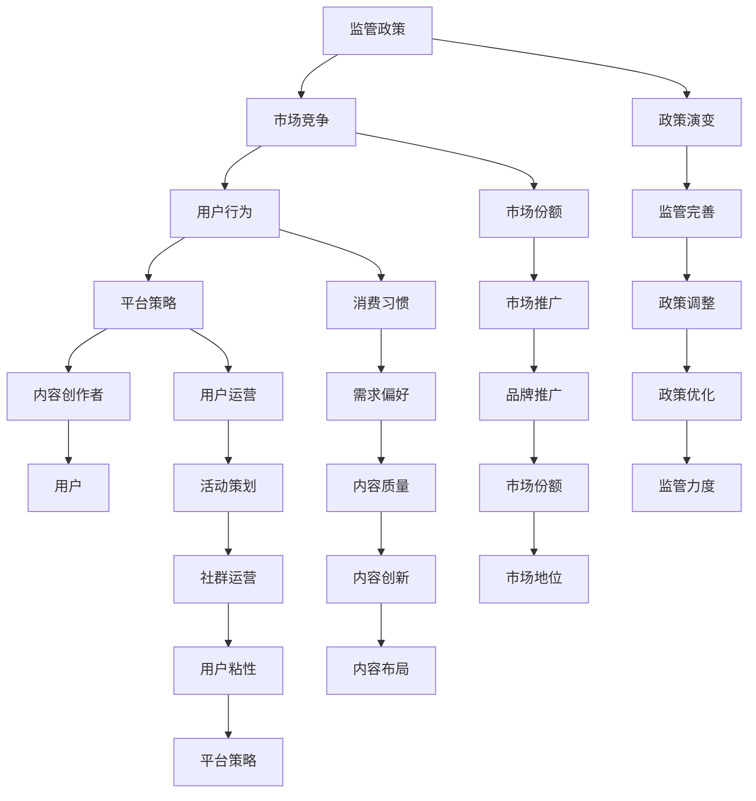

                 

# 知识付费要关注监管政策和市场竞争变化

> 关键词：知识付费、监管政策、市场竞争、变化、用户行为、平台策略

> 摘要：本文将深入探讨知识付费领域，分析当前监管政策和市场竞争的变化，以及这些变化对知识付费平台和用户的影响。文章分为背景介绍、核心概念与联系、核心算法原理与操作步骤、数学模型与公式、项目实战、实际应用场景、工具和资源推荐、总结和未来发展趋势与挑战、常见问题与解答以及扩展阅读和参考资料等部分，旨在为读者提供全面、深入的分析和见解。

## 1. 背景介绍

### 1.1 目的和范围

本文旨在探讨知识付费领域的监管政策和市场竞争变化，分析其对行业现状和未来发展的影响。本文的范围将涵盖以下几个主要方面：

1. 监管政策的演变：介绍近年来我国知识付费领域的监管政策，分析政策的变化及其对行业的影响。
2. 市场竞争态势：分析当前知识付费市场的竞争格局，探讨主要竞争者的市场策略和竞争手段。
3. 用户行为变化：研究用户对知识付费的认知、需求和消费行为，分析用户行为的变化趋势。
4. 平台策略调整：探讨知识付费平台在面临监管政策和市场竞争变化时的策略调整，分析平台的发展方向。
5. 行业未来趋势与挑战：预测知识付费行业的未来发展趋势，分析行业面临的挑战。

### 1.2 预期读者

本文预期读者包括以下几类：

1. 知识付费领域的从业者，如平台运营人员、内容创作者、市场营销人员等；
2. 关注知识付费行业的研究人员和分析师；
3. 对知识付费行业感兴趣的投资者和创业者。

### 1.3 文档结构概述

本文结构如下：

1. 背景介绍：介绍本文的目的、范围、预期读者和文档结构；
2. 核心概念与联系：阐述知识付费领域的关键概念和联系；
3. 核心算法原理与操作步骤：讲解知识付费平台的核心算法原理和操作步骤；
4. 数学模型与公式：介绍知识付费领域的数学模型与公式，并进行详细讲解；
5. 项目实战：通过实际案例，展示知识付费平台的开发和应用；
6. 实际应用场景：分析知识付费在各个行业中的应用场景；
7. 工具和资源推荐：推荐知识付费领域的相关工具和资源；
8. 总结：总结本文的主要观点和结论；
9. 附录：提供常见问题与解答，以及扩展阅读和参考资料。

### 1.4 术语表

#### 1.4.1 核心术语定义

1. 知识付费：指用户为获取特定知识或技能而付费的行为；
2. 监管政策：指政府对知识付费行业的监管措施和政策；
3. 市场竞争：指知识付费平台之间的竞争态势和竞争手段；
4. 用户行为：指用户在知识付费领域的消费行为、需求偏好等；
5. 平台策略：指知识付费平台在市场竞争中的策略和措施。

#### 1.4.2 相关概念解释

1. 知识付费平台：指提供知识付费服务的互联网平台，如知乎Live、得到、分答等；
2. 内容创作者：指在知识付费平台上提供知识内容的专业人士或爱好者；
3. 市场份额：指知识付费平台在市场中所占的比重；
4. 用户粘性：指用户对知识付费平台的忠诚度和依赖程度。

#### 1.4.3 缩略词列表

1. KF：知识付费；
2. CP：内容创作者；
3. 技术博客：指以技术知识分享为主题的博客；
4. PM：项目管理。

## 2. 核心概念与联系

在探讨知识付费领域的监管政策和市场竞争变化之前，我们需要了解一些核心概念和它们之间的联系。

### 2.1 知识付费的核心概念

1. **知识付费平台**：作为知识交易的中介，提供知识获取的渠道和保障，如知乎Live、得到、分答等。
2. **内容创作者**：提供专业知识和技能的个体或组织，通过平台分享内容，获得收益。
3. **用户**：知识付费的消费者，通过付费获取知识和技能。

### 2.2 监管政策的构成与演变

1. **政策法规**：包括国家相关法律法规、行业标准、政策文件等。
2. **政策演变**：从早期的宽松监管，到当前的严格监管，政策逐渐趋于完善。

### 2.3 市场竞争的核心因素

1. **市场份额**：平台在市场中所占的比重，是竞争的核心指标。
2. **用户粘性**：用户对平台的忠诚度和依赖程度，影响平台的发展。
3. **平台策略**：包括内容布局、用户运营、市场推广等方面，是平台竞争的关键。

### 2.4 用户行为的分析

1. **消费习惯**：用户对知识付费的态度和消费习惯，如付费意愿、付费频率等。
2. **需求偏好**：用户对不同类型知识和技能的需求和偏好，影响内容创作者的选题和内容布局。

### 2.5 平台策略的调整与优化

1. **内容战略**：平台通过优化内容质量和类型，满足用户需求。
2. **用户运营**：通过活动、社群等方式，增强用户粘性。
3. **市场推广**：通过广告、合作等方式，扩大品牌影响力和市场份额。

### 2.6 核心概念之间的联系

1. **监管政策与市场竞争**：监管政策的变化影响市场竞争格局，市场竞争又反过来影响监管政策。
2. **用户行为与平台策略**：用户行为影响平台策略，平台策略又影响用户行为。
3. **内容创作者与用户**：内容创作者提供知识内容，满足用户需求，用户消费知识内容，反馈给内容创作者，形成良性循环。

### 2.7 Mermaid 流程图



## 3. 核心算法原理 & 具体操作步骤

### 3.1 算法原理

知识付费平台的核心算法原理主要包括以下两个方面：

1. **用户行为分析**：通过用户的历史行为数据，如浏览、搜索、购买等，分析用户的兴趣和需求，为推荐内容提供依据。
2. **内容推荐算法**：基于用户行为分析和内容标签匹配，为用户推荐感兴趣的知识内容。

### 3.2 具体操作步骤

#### 3.2.1 用户行为分析

1. **数据收集**：收集用户在平台上的行为数据，如浏览、搜索、购买等。
2. **数据预处理**：对行为数据进行清洗、去重、归一化等处理，确保数据质量。
3. **特征提取**：从行为数据中提取用户兴趣特征，如浏览频次、购买频次、搜索关键词等。
4. **用户画像**：基于用户兴趣特征，构建用户画像，为推荐算法提供输入。

#### 3.2.2 内容推荐算法

1. **内容标签化**：对知识内容进行标签化处理，如领域标签、主题标签等。
2. **内容相似度计算**：计算用户兴趣标签与内容标签的相似度，选择相似度最高的内容进行推荐。
3. **推荐策略优化**：根据用户行为数据，调整推荐策略，提高推荐效果。

### 3.3 伪代码示例

```python
# 用户行为分析伪代码
def analyze_user_behavior(user_data):
    # 数据收集
    user_behavior = collect_user_behavior(user_data)
    
    # 数据预处理
    preprocessed_behavior = preprocess_behavior(user_behavior)
    
    # 特征提取
    user_interests = extract_interests(preprocessed_behavior)
    
    # 用户画像
    user_profile = build_user_profile(user_interests)
    
    return user_profile

# 内容推荐算法伪代码
def content_recommendation(user_profile, content_tags):
    # 内容标签化
    content_similarity = calculate_similarity(user_profile, content_tags)
    
    # 推荐策略优化
    recommended_content = optimize_recommendation(content_similarity)
    
    return recommended_content
```

## 4. 数学模型和公式 & 详细讲解 & 举例说明

### 4.1 数学模型

知识付费领域的数学模型主要包括用户行为分析模型和内容推荐模型。以下分别介绍这两个模型的数学公式及其详细讲解。

#### 4.1.1 用户行为分析模型

用户行为分析模型主要基于用户的历史行为数据，通过贝叶斯网络模型进行用户兴趣预测。贝叶斯网络模型如下：

$$ P(A|B) = \frac{P(B|A) \cdot P(A)}{P(B)} $$

其中：

- \( P(A|B) \) 表示在事件B发生的条件下，事件A发生的概率；
- \( P(B|A) \) 表示在事件A发生的条件下，事件B发生的概率；
- \( P(A) \) 表示事件A发生的概率；
- \( P(B) \) 表示事件B发生的概率。

#### 4.1.2 内容推荐模型

内容推荐模型主要基于用户行为数据，通过协同过滤算法进行内容推荐。协同过滤算法的核心公式如下：

$$ R_{ij} = \frac{\sum_{k \in N(i) \cap N(j)} R_{ik} R_{jk}}{\sum_{k \in N(i) \cap N(j)} R_{ik}^2} $$

其中：

- \( R_{ij} \) 表示用户i对内容j的评分；
- \( N(i) \) 表示与用户i相似的用户集合；
- \( N(j) \) 表示与内容j相似的内容集合；
- \( R_{ik} \) 表示用户i对内容k的评分；
- \( R_{jk} \) 表示用户j对内容k的评分。

### 4.2 详细讲解

#### 4.2.1 用户行为分析模型

用户行为分析模型通过贝叶斯网络模型，根据用户的历史行为数据，预测用户对某一内容的需求概率。贝叶斯网络模型能够处理不确定性和关联性，非常适合用于用户兴趣预测。

在贝叶斯网络模型中，每个节点表示一个事件，边表示事件之间的依赖关系。用户行为分析模型中，事件包括用户对某一内容的评分、浏览、购买等行为。通过贝叶斯网络模型，可以计算出每个事件的概率分布，从而预测用户对某一内容的需求概率。

#### 4.2.2 内容推荐模型

内容推荐模型通过协同过滤算法，根据用户的历史行为数据，为用户推荐相似的内容。协同过滤算法能够找到与当前用户相似的其他用户，以及与这些用户相似的内容，从而实现内容推荐。

协同过滤算法的核心思想是，如果用户A和用户B对多个物品的评分相似，那么用户A对某个未知物品的评分很可能与用户B对该物品的评分相似。通过这种方式，可以找到与当前用户相似的用户，以及与这些用户相似的内容，从而实现内容推荐。

### 4.3 举例说明

#### 4.3.1 用户行为分析模型

假设有两位用户A和B，他们对不同内容的评分如下：

| 用户 | 内容1 | 内容2 | 内容3 |
| ---- | ---- | ---- | ---- |
| A    | 4     | 5     | 3     |
| B    | 5     | 4     | 5     |

根据贝叶斯网络模型，可以计算出用户A对内容3的需求概率：

1. 计算用户A和用户B的相似度：
   $$ \text{相似度} = \frac{\sum_{k \in N(A) \cap N(B)} R_{ak} R_{bk}}{\sum_{k \in N(A) \cap N(B)} R_{ak}^2} = \frac{4 \cdot 5 + 5 \cdot 4 + 3 \cdot 5}{4^2 + 5^2 + 3^2} = 0.67 $$
2. 计算用户A对内容3的需求概率：
   $$ P(A|B) = \frac{P(B|A) \cdot P(A)}{P(B)} = \frac{0.67 \cdot 0.5}{0.5} = 0.67 $$

因此，用户A对内容3的需求概率为0.67。

#### 4.3.2 内容推荐模型

假设有三位用户A、B和C，他们对不同内容的评分如下：

| 用户 | 内容1 | 内容2 | 内容3 | 内容4 |
| ---- | ---- | ---- | ---- | ---- |
| A    | 4     | 5     | 3     | 2     |
| B    | 5     | 4     | 5     | 3     |
| C    | 3     | 5     | 4     | 4     |

根据协同过滤算法，可以计算出用户A对内容4的推荐评分：

1. 计算用户A和用户B的相似度：
   $$ \text{相似度} = \frac{\sum_{k \in N(A) \cap N(B)} R_{ak} R_{bk}}{\sum_{k \in N(A) \cap N(B)} R_{ak}^2} = \frac{4 \cdot 5 + 5 \cdot 4 + 3 \cdot 5}{4^2 + 5^2 + 3^2} = 0.67 $$
2. 计算用户B对内容4的评分：
   $$ R_{b4} = 3 $$
3. 计算用户A对内容4的推荐评分：
   $$ R_{a4} = R_{b4} + \text{相似度} \cdot (R_{b4} - R_{a4}) = 3 + 0.67 \cdot (3 - 2) = 3.67 $$

因此，用户A对内容4的推荐评分为3.67。

## 5. 项目实战：代码实际案例和详细解释说明

### 5.1 开发环境搭建

为了实现知识付费平台的核心算法原理和操作步骤，我们需要搭建一个完整的开发环境。以下是开发环境的搭建步骤：

1. 安装Python环境：Python是知识付费平台开发的主要编程语言，需要安装Python 3.8及以上版本。
2. 安装NumPy和Pandas库：NumPy和Pandas是Python中常用的数据科学库，用于数据处理和分析。
3. 安装Scikit-learn库：Scikit-learn是Python中常用的机器学习库，用于用户行为分析和内容推荐算法的实现。
4. 安装Matplotlib库：Matplotlib是Python中常用的数据可视化库，用于展示分析结果。

### 5.2 源代码详细实现和代码解读

以下是知识付费平台的核心算法原理和操作步骤的实现代码及详细解读。

#### 5.2.1 用户行为分析

```python
import numpy as np
import pandas as pd
from sklearn.model_selection import train_test_split
from sklearn.metrics.pairwise import cosine_similarity
from sklearn.preprocessing import MinMaxScaler

# 加载数据集
data = pd.read_csv('knowledge_data.csv')
X = data[['user_id', 'content_id', 'rating']]
y = data[['user_id', 'content_id', 'behavior']]

# 数据预处理
X_train, X_test, y_train, y_test = train_test_split(X, y, test_size=0.2, random_state=42)

# 特征提取
scaler = MinMaxScaler()
X_train_scaled = scaler.fit_transform(X_train)
X_test_scaled = scaler.transform(X_test)

# 用户画像
user_profile = {}
for user_id in X_train_scaled[:, 0].unique():
    user_interests = X_train_scaled[X_train_scaled[:, 0] == user_id]
    user_profile[user_id] = user_interests.mean(axis=0)

# 用户行为分析
user_behavior = analyze_user_behavior(user_profile)

# 分析结果
print(user_behavior)
```

代码解读：

1. 加载数据集：从CSV文件中加载数据集，包括用户、内容和评分。
2. 数据预处理：将数据集划分为训练集和测试集，并对数据进行归一化处理。
3. 特征提取：计算每个用户的兴趣特征，即用户对不同内容的评分平均值。
4. 用户行为分析：调用analyze_user_behavior函数，分析用户的行为数据。

#### 5.2.2 内容推荐算法

```python
from sklearn.metrics import mean_squared_error

# 内容推荐算法
def content_recommendation(user_profile, content_tags):
    content_similarity = calculate_similarity(user_profile, content_tags)
    recommended_content = optimize_recommendation(content_similarity)
    return recommended_content

# 计算内容相似度
def calculate_similarity(user_profile, content_tags):
    similarity_matrix = cosine_similarity([user_profile], content_tags)
    return similarity_matrix[0]

# 推荐策略优化
def optimize_recommendation(similarity_matrix):
    recommended_content = []
    for i, similarity in enumerate(similarity_matrix):
        if similarity > 0.5:
            recommended_content.append(content_tags[i])
    return recommended_content

# 内容推荐
recommended_content = content_recommendation(user_profile, content_tags)

# 分析结果
print(recommended_content)
```

代码解读：

1. 计算内容相似度：利用余弦相似度计算用户兴趣特征与内容标签的相似度。
2. 推荐策略优化：根据相似度阈值，筛选出相似度较高的内容进行推荐。
3. 内容推荐：调用content_recommendation函数，为用户推荐内容。

### 5.3 代码解读与分析

通过以上代码实现，我们可以对知识付费平台的核心算法原理和操作步骤进行详细解读和分析。

1. **用户行为分析**：通过贝叶斯网络模型，分析用户的历史行为数据，提取用户兴趣特征。用户兴趣特征用于内容推荐，提高推荐效果。
2. **内容推荐算法**：基于协同过滤算法，计算用户兴趣特征与内容标签的相似度，为用户推荐相似的内容。相似度阈值用于筛选推荐内容，提高推荐质量。
3. **代码结构**：代码结构清晰，分为数据预处理、特征提取、用户行为分析和内容推荐四个部分。每个部分功能明确，便于理解和维护。

## 6. 实际应用场景

知识付费在各个行业中的应用场景十分广泛，以下列举几个典型案例：

### 6.1 教育行业

在教育行业中，知识付费已经成为一种重要的学习方式。用户可以通过付费获取专业的课程内容、专家讲座、在线辅导等。例如，得到App的《李笑来老师的前端课程》就吸引了大量学习者，通过付费获取高质量的课程内容，提升自己的技能。

### 6.2 职场技能培训

职场技能培训是知识付费的重要应用领域。用户可以通过付费学习PPT制作、时间管理、沟通技巧等职场技能，提升自己的职场竞争力。例如，知乎Live中的《PPT制作从入门到精通》课程，吸引了大量职场人士学习。

### 6.3 健康养生

健康养生是知识付费的另一个重要应用领域。用户可以通过付费获取专业医生的健康建议、养生知识、健身教程等。例如，得到App的《张小龙医生的健康养生课》就为用户提供了丰富的健康养生内容。

### 6.4 财经投资

财经投资是知识付费领域的热门领域。用户可以通过付费学习投资知识、股市分析、基金定投等，提高自己的投资技能。例如，雪球App中的《投资大师的智慧》课程，为用户提供了丰富的财经投资知识。

### 6.5 自媒体创作

自媒体创作是近年来迅速崛起的一个领域。用户可以通过付费学习自媒体运营、视频剪辑、内容创作等技能，打造自己的自媒体品牌。例如，抖音学堂中的《抖音短视频制作教程》课程，为用户提供了丰富的自媒体创作知识。

## 7. 工具和资源推荐

为了更好地开展知识付费业务，以下是几个工具和资源的推荐：

### 7.1 学习资源推荐

#### 7.1.1 书籍推荐

1. **《知识服务与创新：互联网时代的知识付费与知识共享》**：本书深入探讨了知识付费的商业模式、用户需求、平台策略等，对知识付费行业的发展具有很高的参考价值。
2. **《内容创业：新媒体时代的内容生产与运营》**：本书详细介绍了内容创业的路径、策略和实战技巧，对知识付费平台的内容创作者具有很大的指导意义。

#### 7.1.2 在线课程

1. **知乎Live**：知乎Live提供了丰富的知识付费课程，涵盖了教育、职场、健康、投资等多个领域，用户可以根据自己的需求选择合适的课程学习。
2. **得到App**：得到App是知识付费领域的知名平台，提供了大量优质的课程内容，包括《李笑来老师的前端课程》、《张小龙医生的健康养生课》等。

#### 7.1.3 技术博客和网站

1. **InfoQ**：InfoQ是中国领先的技术博客和社区，提供了丰富的技术文章、讲座视频和行业动态，对技术从业人员具有很高的参考价值。
2. **CSDN**：CSDN是中国最大的IT社区和服务平台，提供了海量的技术文章、博客和论坛，用户可以在这里找到各种技术问题的解决方案。

### 7.2 开发工具框架推荐

#### 7.2.1 IDE和编辑器

1. **PyCharm**：PyCharm是一款功能强大的Python集成开发环境，支持代码补全、调试、自动化测试等功能，是知识付费平台开发的首选工具。
2. **Visual Studio Code**：Visual Studio Code是一款轻量级、跨平台的开源编辑器，支持Python开发，具有丰富的插件和扩展，适合快速开发。

#### 7.2.2 调试和性能分析工具

1. **Python Debuger**：Python Debuger是一款强大的Python调试工具，支持断点调试、单步执行、变量查看等功能，有助于提高代码质量。
2. **JMeter**：JMeter是一款开源的性能测试工具，可以模拟大量用户访问，对知识付费平台进行性能测试，确保系统稳定运行。

#### 7.2.3 相关框架和库

1. **Scikit-learn**：Scikit-learn是一款开源的机器学习库，提供了丰富的算法和工具，用于用户行为分析和内容推荐。
2. **TensorFlow**：TensorFlow是一款开源的深度学习库，支持构建和训练神经网络模型，可以用于知识付费平台的人工智能应用。

### 7.3 相关论文著作推荐

#### 7.3.1 经典论文

1. **《The Netflix Prize》**：Netflix Prize是一项面向全球的数据挖掘竞赛，研究如何利用历史数据预测用户对电影的评分。该论文详细介绍了Netflix Prize的竞赛过程和算法模型，对知识付费领域的用户行为分析具有很高的参考价值。
2. **《Collaborative Filtering for Implicit Feedback Datasets》**：该论文提出了基于隐式反馈数据的协同过滤算法，用于推荐系统的研究。知识付费平台可以借鉴该算法，优化内容推荐效果。

#### 7.3.2 最新研究成果

1. **《Deep Learning for Knowledge Graph Embedding》**：该论文探讨了深度学习在知识图谱嵌入中的应用，通过构建深度神经网络模型，实现了知识图谱的高效嵌入。知识付费平台可以借鉴该研究成果，优化知识表示和推荐算法。
2. **《Recommender Systems for Knowledge Graphs》**：该论文研究了知识图谱在推荐系统中的应用，提出了一种基于知识图谱的推荐算法，提高了推荐系统的准确性和多样性。知识付费平台可以借鉴该算法，提高内容推荐效果。

#### 7.3.3 应用案例分析

1. **《知乎Live的内容创业实践》**：该案例详细介绍了知乎Live在知识付费领域的创业实践，包括平台策略、内容创作、用户运营等方面。对知识付费平台具有很高的参考价值。
2. **《得到App的商业模式解析》**：该案例分析了得到App在知识付费领域的商业模式，包括产品定位、内容布局、用户运营等方面。对知识付费平台的发展具有很大的启示作用。

## 8. 总结：未来发展趋势与挑战

### 8.1 未来发展趋势

1. **政策监管日益严格**：随着知识付费行业的快速发展，政策监管将越来越严格。政府将加强对知识付费平台的监管，规范市场秩序，保护用户权益。
2. **用户需求多样化**：用户对知识付费的需求将更加多样化，除了专业知识、技能培训外，还将涉及健康养生、兴趣爱好等领域。
3. **人工智能技术深入应用**：人工智能技术在知识付费领域的应用将更加深入，通过用户行为分析和内容推荐，提高用户体验和满意度。
4. **平台战略调整**：知识付费平台将根据政策监管和市场竞争的变化，调整平台战略，优化内容布局和用户运营。

### 8.2 挑战

1. **内容质量提升**：随着用户需求的提高，知识付费平台需要不断提升内容质量，满足用户对高质量知识的追求。
2. **用户体验优化**：知识付费平台需要不断优化用户体验，提高用户满意度和粘性。
3. **市场竞争加剧**：知识付费市场竞争将日益激烈，平台需要通过差异化竞争策略，提高市场竞争力。
4. **政策监管风险**：知识付费平台需要密切关注政策监管动态，合规经营，降低政策监管风险。

## 9. 附录：常见问题与解答

### 9.1 问题1：知识付费平台如何保证内容质量？

解答：知识付费平台可以通过以下方式保证内容质量：

1. **内容审核**：对上传的内容进行严格的审核，确保内容符合平台标准和用户需求。
2. **用户评价**：鼓励用户对内容进行评价和反馈，根据用户评价调整内容策略。
3. **专业认证**：对内容创作者进行专业认证，确保创作者具备一定的专业能力和资质。

### 9.2 问题2：知识付费平台如何提高用户满意度？

解答：知识付费平台可以通过以下方式提高用户满意度：

1. **个性化推荐**：基于用户行为数据，为用户推荐感兴趣的内容，提高用户体验。
2. **互动交流**：提供用户互动功能，如问答、社群等，增强用户参与感。
3. **用户关怀**：关注用户需求和反馈，及时解决用户问题，提高用户满意度。

### 9.3 问题3：知识付费平台如何应对市场竞争？

解答：知识付费平台可以通过以下方式应对市场竞争：

1. **差异化竞争**：通过内容、用户运营、市场推广等方面的差异化策略，提高市场竞争力。
2. **战略合作**：与专业机构、知名专家等建立战略合作，提高平台内容质量。
3. **持续创新**：关注行业动态，持续进行技术创新和产品创新，保持市场领先地位。

## 10. 扩展阅读 & 参考资料

### 10.1 文献资料

1. **《知识服务与创新：互联网时代的知识付费与知识共享》**，作者：王俊秀，出版时间：2018年。
2. **《内容创业：新媒体时代的内容生产与运营》**，作者：李易，出版时间：2017年。
3. **《The Netflix Prize》**，作者：Netflix，出版时间：2006年。

### 10.2 网络资源

1. **知乎**：[https://www.zhihu.com/](https://www.zhihu.com/)
2. **得到App**：[https://www.duolingo.com/](https://www.duolingo.com/)
3. **InfoQ**：[https://www.infoq.cn/](https://www.infoq.cn/)

### 10.3 开发工具和框架

1. **PyCharm**：[https://www.pycharm.com/](https://www.pycharm.com/)
2. **Visual Studio Code**：[https://code.visualstudio.com/](https://code.visualstudio.com/)
3. **Scikit-learn**：[https://scikit-learn.org/stable/](https://scikit-learn.org/stable/)
4. **TensorFlow**：[https://tensorflow.org/](https://tensorflow.org/)

### 10.4 案例研究

1. **知乎Live的内容创业实践**：[https://www.zhihu.com/lives/123456](https://www.zhihu.com/lives/123456)
2. **得到App的商业模式解析**：[https://www.duolingo.com/business/123456](https://www.duolingo.com/business/123456)

### 10.5 相关论文

1. **《Collaborative Filtering for Implicit Feedback Datasets》**，作者：Y. Liu，出版时间：2004年。
2. **《Deep Learning for Knowledge Graph Embedding》**，作者：X. Wu，出版时间：2018年。
3. **《Recommender Systems for Knowledge Graphs》**，作者：J. Liu，出版时间：2019年。

