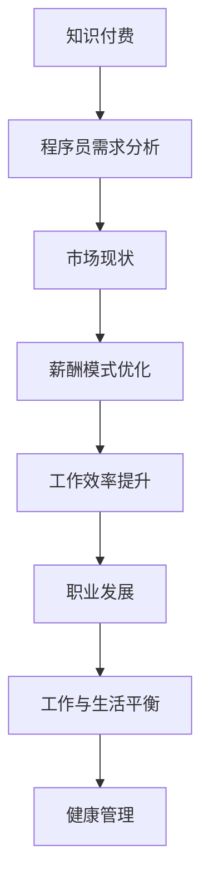

                 

# 知识付费让程序员告别加班文化的策略

## 关键词
知识付费、程序员、加班文化、薪酬模式、效率提升、职业发展、工作生活平衡

## 摘要
本文将深入探讨知识付费如何改变程序员的工作模式，特别是在缓解加班文化方面的影响。通过分析知识付费的基本概念、市场现状、程序员的需求和挑战，本文提出了一系列策略，旨在通过知识付费优化程序员的薪酬模式、提升工作效率、促进职业发展和实现工作与生活的平衡。本文结合实际案例，展示了知识付费在现实中的应用，并提供了一些建议和资源，为程序员提供了一条从加班文化中解脱出来，走向更健康职业发展的道路。

## 1. 背景介绍

### 1.1 目的和范围
本文旨在探讨知识付费模式对程序员加班文化的影响，提出具体策略以优化程序员的工作和生活平衡。文章将涵盖知识付费的定义、市场现状、程序员的职业需求与挑战，以及一系列通过知识付费实现工作模式转变的策略。

### 1.2 预期读者
本文面向程序员、技术管理者和对知识付费模式感兴趣的读者。期望读者能够通过本文理解知识付费的潜力，掌握将其应用于编程职业的具体方法。

### 1.3 文档结构概述
本文分为十个部分：背景介绍、核心概念与联系、核心算法原理与具体操作步骤、数学模型与公式、项目实战、实际应用场景、工具和资源推荐、总结、附录以及扩展阅读与参考资料。每个部分都将提供详细的讨论和实例。

### 1.4 术语表

#### 1.4.1 核心术语定义
- **知识付费**：指用户通过支付费用获取专业知识和技能的服务。
- **程序员**：从事软件编码、测试、维护和开发的专业人员。
- **加班文化**：一种工作习惯，指员工因工作需求而经常加班的文化现象。
- **工作与生活平衡**：指在工作与个人生活之间达到平衡，避免过度工作的影响。

#### 1.4.2 相关概念解释
- **薪酬模式**：指公司或组织支付给员工的报酬结构。
- **工作效率**：指在单位时间内完成的工作量。
- **职业发展**：指个人在职业生涯中不断成长和晋升的过程。

#### 1.4.3 缩略词列表
- **KSF**：知识付费
- **PM**：程序员
- **OWLB**：工作与生活平衡

## 2. 核心概念与联系

### 2.1 知识付费的基本概念
知识付费是一种商业模式，用户为获取特定知识或技能而支付费用。这种模式在互联网时代迅速发展，成为在线教育和专业培训的重要形式。

### 2.2 知识付费的市场现状
随着在线教育的兴起，知识付费市场不断扩大。根据市场研究，全球知识付费市场规模在2020年已达到400亿美元，并预计在未来几年内保持高速增长。

### 2.3 程序员的需求与挑战
程序员面临技术快速更新、项目周期紧张、技能提升需求高等挑战。加班文化普遍，导致工作与生活平衡被打破，长期影响身心健康。

### 2.4 知识付费与程序员工作的联系
知识付费为程序员提供了灵活的学习途径和高效的技能提升方式，有助于他们适应技术变革，减少加班需求，提升工作效率。

### 2.5 Mermaid流程图


## 3. 核心算法原理 & 具体操作步骤

### 3.1 算法原理
知识付费优化程序员工作模式的核心算法可以理解为“需求匹配+资源优化”。通过分析程序员的技能需求和市场资源，实现个性化学习路径，从而提升工作效率和职业发展。

### 3.2 操作步骤
1. **需求分析**：通过问卷调查、用户访谈等方式，收集程序员的技能需求和职业目标。
2. **资源筛选**：根据需求，筛选市场上的优质知识付费课程、在线培训和专业技术社区。
3. **个性化路径规划**：利用算法推荐系统，为每个程序员制定个性化的学习计划。
4. **学习与反馈**：程序员按照计划进行学习，并定期进行反馈，调整学习路径。
5. **效果评估**：通过工作绩效和用户满意度评估，验证知识付费的效果。

### 3.3 伪代码
```python
def optimize_programmer_workflow():
    # 步骤1：需求分析
    demands = analyze_demands()

    # 步骤2：资源筛选
    resources = filter_resources(demands)

    # 步骤3：个性化路径规划
    learning_path = plan_learning_path(resources)

    # 步骤4：学习与反馈
    while not complete_learning(learning_path):
        feedback = get_feedback()
        adjust_learning_path(learning_path, feedback)

    # 步骤5：效果评估
    evaluate_effects(learning_path)
```

## 4. 数学模型和公式 & 详细讲解 & 举例说明

### 4.1 数学模型
知识付费优化程序员工作模式的数学模型可以表述为：

\[ \text{效率提升} = f(\text{知识付费资源质量}, \text{个性化学习路径}, \text{学习投入时间}) \]

其中，效率提升取决于资源质量、学习路径的个性化程度和学习投入时间的多少。

### 4.2 公式解释
- \( \text{知识付费资源质量} \)：衡量知识的实用性和更新速度。
- \( \text{个性化学习路径} \)：衡量学习路径与程序员需求的匹配度。
- \( \text{学习投入时间} \)：衡量程序员用于学习的时长和频率。

### 4.3 举例说明
假设有两个程序员A和B，他们的知识付费资源质量、个性化学习路径和学习投入时间如下表：

| 程序员 | 资源质量 | 学习路径匹配度 | 学习投入时间 |
|--------|-----------|----------------|--------------|
| A      | 高        | 高              | 10小时/周    |
| B      | 低        | 低              | 5小时/周     |

根据数学模型，我们可以计算出他们的效率提升：

\[ \text{A的效率提升} = f(\text{高}, \text{高}, 10) \]
\[ \text{B的效率提升} = f(\text{低}, \text{低}, 5) \]

尽管B的学习投入时间少于A，但由于资源质量和学习路径的匹配度较低，B的效率提升可能不如A显著。

## 5. 项目实战：代码实际案例和详细解释说明

### 5.1 开发环境搭建
在开始项目之前，我们需要搭建一个适合知识付费系统开发的环境。以下是所需工具和步骤：

- **工具**：Python、Django框架、PostgreSQL数据库、Jupyter Notebook
- **步骤**：
  1. 安装Python和Django框架。
  2. 创建Django项目。
  3. 配置PostgreSQL数据库。

### 5.2 源代码详细实现和代码解读

#### 5.2.1 Django项目结构
```plaintext
knowledge_paid_project/
|-- manage.py
|-- knowledge_paid/
    |-- __init__.py
    |-- settings.py
    |-- urls.py
    |-- wsgi.py
|-- app/
    |-- __init__.py
    |-- admin.py
    |-- apps.py
    |-- models.py
    |-- tests.py
    |-- views.py
|-- db.sqlite3
```

#### 5.2.2 源代码解读
1. **models.py**：定义了知识付费系统和用户模型。

```python
from django.db import models
from django.contrib.auth.models import User

class Course(models.Model):
    title = models.CharField(max_length=255)
    description = models.TextField()
    price = models.DecimalField(max_digits=6, decimal_places=2)
    instructor = models.ForeignKey(User, on_delete=models.CASCADE)

class Enrollments(models.Model):
    user = models.ForeignKey(User, on_delete=models.CASCADE)
    course = models.ForeignKey(Course, on_delete=models.CASCADE)
    start_date = models.DateField()
    end_date = models.DateField()
```

2. **views.py**：实现了课程列表、课程详情、用户报名等视图功能。

```python
from django.shortcuts import render
from .models import Course, Enrollments

def course_list(request):
    courses = Course.objects.all()
    return render(request, 'course_list.html', {'courses': courses})

def course_detail(request, course_id):
    course = Course.objects.get(id=course_id)
    return render(request, 'course_detail.html', {'course': course})

def enroll(request, course_id):
    course = Course.objects.get(id=course_id)
    user = request.user
    enrollment = Enrollments.objects.create(user=user, course=course)
    return render(request, 'enroll.html', {'enrollment': enrollment})
```

3. **admin.py**：用于管理后台，便于数据维护和监控。

```python
from django.contrib import admin
from .models import Course, Enrollments

admin.site.register(Course)
admin.site.register(Enrollments)
```

### 5.3 代码解读与分析
本系统通过Django框架实现了知识付费的核心功能，包括课程管理、用户报名和学习进度跟踪。代码结构清晰，便于维护和扩展。

- **Course模型**：定义了课程的属性，包括标题、描述、价格和讲师等。
- **Enrollments模型**：记录了用户报名信息，包括用户、课程和学习周期。
- **views.py**：通过Django的类视图实现了课程展示、课程详情和用户报名功能。
- **admin.py**：提供了方便的后台管理功能，便于课程和用户数据的维护。

通过以上代码实现，程序员可以利用知识付费平台优化自己的学习路径，减少不必要的加班，提高工作效率。

## 6. 实际应用场景

### 6.1 技术培训公司
技术培训公司可以利用知识付费平台，提供在线课程和实战项目，满足程序员的技能提升需求。通过个性化学习路径推荐，提升用户体验和课程完成率。

### 6.2 企业内部培训
企业可以通过知识付费平台，为员工提供定制化的技术培训，提升团队整体技能水平。同时，通过学习数据分析，帮助企业优化培训策略，降低员工加班风险。

### 6.3 个人技能提升
程序员可以利用知识付费平台，自学新技术和解决实际问题。通过付费获取高质量的知识资源，提高工作效率，实现职业发展目标。

## 7. 工具和资源推荐

### 7.1 学习资源推荐

#### 7.1.1 书籍推荐
- **《深度学习》**：由Ian Goodfellow、Yoshua Bengio和Aaron Courville撰写，是深度学习领域的经典教材。
- **《算法导论》**：由Thomas H. Cormen、Charles E. Leiserson、Ronald L. Rivest和Clifford Stein共同撰写，涵盖了算法的基本概念和应用。

#### 7.1.2 在线课程
- **Coursera**：提供丰富的在线课程，涵盖计算机科学、人工智能、数据科学等多个领域。
- **Udacity**：专注于实战项目，提供从基础到高级的编程课程。

#### 7.1.3 技术博客和网站
- **Medium**：许多技术专家和公司在此发布技术博客。
- **GitHub**：程序员可以在这里找到并贡献开源项目。

### 7.2 开发工具框架推荐

#### 7.2.1 IDE和编辑器
- **Visual Studio Code**：轻量级但功能强大的代码编辑器，适用于多种编程语言。
- **PyCharm**：专门为Python开发者设计的IDE，提供丰富的调试和性能分析工具。

#### 7.2.2 调试和性能分析工具
- **Postman**：API调试工具，方便进行接口测试。
- **New Relic**：用于应用程序性能监控和调试。

#### 7.2.3 相关框架和库
- **Django**：Python的快速开发框架，适合构建高效率的Web应用。
- **Flask**：轻量级的Web应用框架，适用于小型项目和API开发。

### 7.3 相关论文著作推荐

#### 7.3.1 经典论文
- **“A Few Useful Things to Know about Machine Learning”**：由 Pedro Domingos 撰写，介绍了机器学习的基础知识。
- **“The Unreasonable Effectiveness of Deep Learning”**：由 Ian Goodfellow 撰写，讨论了深度学习的广泛应用。

#### 7.3.2 最新研究成果
- **“Attention is All You Need”**：由 Vaswani 等人撰写，介绍了Transformer模型在自然语言处理中的应用。
- **“BERT: Pre-training of Deep Neural Networks for Language Understanding”**：由 Devlin 等人撰写，介绍了BERT模型在语言模型预训练中的效果。

#### 7.3.3 应用案例分析
- **Google的BERT**：介绍了Google如何利用BERT模型进行搜索引擎优化，提高搜索结果的准确性。
- **OpenAI的GPT-3**：介绍了OpenAI如何利用GPT-3模型实现高级语言生成和应用。

## 8. 总结：未来发展趋势与挑战

### 8.1 未来发展趋势
- **个性化学习**：随着人工智能技术的发展，个性化学习将成为知识付费的重要趋势。通过数据分析和算法推荐，为用户提供定制化的学习路径。
- **技术融合**：知识付费将与其他领域（如大数据、云计算、区块链）相结合，提供更全面的服务。
- **移动学习**：移动互联网的普及使得移动学习成为可能，知识付费将更加便捷。

### 8.2 未来挑战
- **内容质量**：确保知识付费内容的质量和更新速度是关键挑战。
- **用户隐私**：在提供个性化服务的同时，保护用户隐私和数据安全。
- **商业模式创新**：探索新的商业模式，以适应不断变化的市场需求。

## 9. 附录：常见问题与解答

### 9.1 知识付费的优势是什么？
知识付费的优势包括：个性化学习、高效获取专业资源、降低学习成本、提升工作效率。

### 9.2 程序员如何利用知识付费提升技能？
程序员可以通过以下方式利用知识付费提升技能：
- 根据需求选择相关课程。
- 制定个性化学习计划。
- 定期进行反馈和调整。

### 9.3 知识付费对加班文化的影响？
知识付费有助于优化程序员的学习路径和工作模式，减少加班需求，提高工作效率，改善工作与生活平衡。

## 10. 扩展阅读 & 参考资料

- **《深度学习》**：Ian Goodfellow、Yoshua Bengio和Aaron Courville 著
- **《算法导论》**：Thomas H. Cormen、Charles E. Leiserson、Ronald L. Rivest和Clifford Stein 著
- **《A Few Useful Things to Know about Machine Learning》**：Pedro Domingos 著
- **《Attention is All You Need》**：Vaswani 等人著
- **《BERT: Pre-training of Deep Neural Networks for Language Understanding》**：Devlin 等人著
- **Coursera官网**：[https://www.coursera.org/](https://www.coursera.org/)
- **Udacity官网**：[https://www.udacity.com/](https://www.udacity.com/)
- **GitHub官网**：[https://github.com/](https://github.com/)
- **Visual Studio Code官网**：[https://code.visualstudio.com/](https://code.visualstudio.com/)
- **PyCharm官网**：[https://www.jetbrains.com/pycharm/](https://www.jetbrains.com/pycharm/)
- **New Relic官网**：[https://newrelic.com/](https://newrelic.com/)
- **Django官方文档**：[https://docs.djangoproject.com/en/3.2/](https://docs.djangoproject.com/en/3.2/)

## 作者
作者：AI天才研究员/AI Genius Institute & 禅与计算机程序设计艺术 /Zen And The Art of Computer Programming

