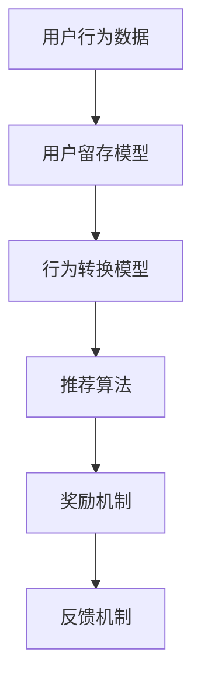

                 

# 知识付费赚钱的用户签到打卡与习惯养成策略

> **关键词**：知识付费、用户签到、打卡、习惯养成、策略、算法、用户行为分析

> **摘要**：本文将探讨知识付费领域中的用户签到打卡与习惯养成的策略。通过深入分析用户行为、算法原理和实际应用，本文旨在为开发者提供一套系统化的解决方案，以提升知识付费平台的用户粘性和留存率。

## 1. 背景介绍

### 1.1 目的和范围

本文旨在为知识付费平台开发者提供一套针对用户签到打卡和习惯养成的策略。通过研究用户行为，结合算法原理和数学模型，本文旨在提供一套具有实际操作性的解决方案，以提高用户的参与度和留存率。

### 1.2 预期读者

本文面向的知识付费平台开发者、产品经理以及相关领域的研究人员。期望读者能够通过本文，对用户签到打卡与习惯养成策略有更深入的理解，并能够将其应用于实际项目中。

### 1.3 文档结构概述

本文将分为以下几个部分：

1. **背景介绍**：阐述本文的目的、预期读者以及文档结构。
2. **核心概念与联系**：介绍知识付费领域的核心概念和架构。
3. **核心算法原理 & 具体操作步骤**：详细阐述用户签到打卡与习惯养成的算法原理和操作步骤。
4. **数学模型和公式 & 详细讲解 & 举例说明**：分析用户签到打卡与习惯养成的数学模型，并给出具体的举例说明。
5. **项目实战：代码实际案例和详细解释说明**：通过一个实际的代码案例，展示用户签到打卡与习惯养成的实现过程。
6. **实际应用场景**：探讨用户签到打卡与习惯养成的实际应用场景。
7. **工具和资源推荐**：推荐学习资源、开发工具和框架。
8. **总结：未来发展趋势与挑战**：总结用户签到打卡与习惯养成的未来发展趋势和挑战。
9. **附录：常见问题与解答**：提供用户可能遇到的问题及其解答。
10. **扩展阅读 & 参考资料**：推荐进一步学习的资料。

### 1.4 术语表

#### 1.4.1 核心术语定义

- **知识付费**：用户为获取特定知识或技能，付费给内容提供者的一种商业模式。
- **用户签到打卡**：用户按照一定规律（如每日、每周）在知识付费平台上完成签到或打卡行为。
- **习惯养成**：用户在长期使用知识付费平台的过程中，逐渐形成的一种稳定的行为习惯。

#### 1.4.2 相关概念解释

- **用户粘性**：用户对知识付费平台的依赖程度，衡量用户使用频率和持续时间的指标。
- **留存率**：一定时间内，用户持续使用知识付费平台的比例。
- **算法**：解决问题的一系列步骤或规则。

#### 1.4.3 缩略词列表

- **KFF**：知识付费
- **SAL**：用户签到打卡
- **CI**：习惯养成

## 2. 核心概念与联系

在知识付费领域，用户签到打卡与习惯养成是提高用户粘性和留存率的关键策略。为了更好地理解这一策略，我们需要先了解以下几个核心概念：

### 2.1 用户行为分析

用户行为分析是指通过对用户在知识付费平台上的行为数据进行收集、处理和分析，从而了解用户需求、偏好和习惯的过程。用户行为分析包括以下方面：

- **签到行为**：用户在一定时间内（如每日、每周）登录知识付费平台并完成签到行为。
- **互动行为**：用户在知识付费平台上的评论、点赞、分享等互动行为。
- **学习行为**：用户在学习课程、完成练习、参加讨论等过程中的行为。

### 2.2 算法原理

用户签到打卡与习惯养成的算法原理主要包括以下几个方面：

- **推荐算法**：通过分析用户行为数据，为用户推荐合适的课程或内容。
- **奖励机制**：为坚持签到打卡的用户提供奖励，激励用户持续参与。
- **反馈机制**：通过用户反馈，调整和优化签到打卡与习惯养成的策略。

### 2.3 数学模型

用户签到打卡与习惯养成的数学模型主要包括以下几个部分：

- **用户留存模型**：通过分析用户在知识付费平台上的行为数据，预测用户留存概率。
- **行为转换模型**：分析用户在不同行为之间的转换概率，为推荐算法提供依据。
- **奖励模型**：根据用户签到打卡的频率和时长，为用户分配相应的奖励。

### 2.4 Mermaid 流程图

为了更清晰地展示用户签到打卡与习惯养成的核心概念和联系，我们使用 Mermaid 流程图来描述：



## 3. 核心算法原理 & 具体操作步骤

### 3.1 用户签到打卡算法原理

用户签到打卡算法的核心思想是通过分析用户在知识付费平台上的行为数据，预测用户签到打卡的概率，并基于此为用户提供个性化的推荐和服务。

#### 3.1.1 用户留存模型

用户留存模型采用逻辑回归算法，输入特征包括用户行为数据（如签到次数、互动行为、学习时长等），输出为用户留存概率。具体步骤如下：

1. 数据预处理：对用户行为数据进行清洗、归一化等处理，提取有用的特征。
2. 特征工程：根据用户行为数据，提取出对用户留存有显著影响的特征。
3. 模型训练：使用逻辑回归算法，训练用户留存模型。
4. 模型评估：使用交叉验证等方法，评估用户留存模型的性能。

#### 3.1.2 行为转换模型

行为转换模型采用多分类逻辑回归算法，输入特征包括用户当前行为和前一个行为，输出为用户从当前行为转换到下一个行为的概率。具体步骤如下：

1. 数据预处理：对用户行为数据进行清洗、归一化等处理，提取有用的特征。
2. 特征工程：根据用户行为数据，提取出对行为转换有显著影响的特征。
3. 模型训练：使用多分类逻辑回归算法，训练行为转换模型。
4. 模型评估：使用交叉验证等方法，评估行为转换模型的性能。

#### 3.1.3 推荐算法

推荐算法基于用户留存模型和行为转换模型，为用户推荐合适的课程或内容。具体步骤如下：

1. 用户行为预测：根据用户留存模型，预测用户在接下来的时间内可能留存的概率。
2. 行为转换预测：根据行为转换模型，预测用户在接下来的时间内可能发生的行为转换。
3. 内容推荐：根据用户行为预测结果，为用户推荐相应的课程或内容。

### 3.2 伪代码实现

```python
# 用户留存模型伪代码
def train_retention_model(data):
    # 数据预处理
    processed_data = preprocess_data(data)
    # 特征工程
    features = extract_features(processed_data)
    # 模型训练
    model = LogisticRegression()
    model.fit(features, processed_data['retention'])
    # 模型评估
    evaluate_model(model, processed_data)
    return model

# 行为转换模型伪代码
def train_behavior_conversion_model(data):
    # 数据预处理
    processed_data = preprocess_data(data)
    # 特征工程
    features = extract_features(processed_data)
    # 模型训练
    model = MultinomialLogisticRegression()
    model.fit(features, processed_data['behavior_conversion'])
    # 模型评估
    evaluate_model(model, processed_data)
    return model

# 推荐算法伪代码
def content_recommendation(user_id, retention_model, behavior_conversion_model, content_data):
    # 用户行为预测
    retention_probabilities = retention_model.predict_proba(content_data[feature_columns])
    # 行为转换预测
    behavior_conversion_probabilities = behavior_conversion_model.predict_proba(content_data[feature_columns])
    # 内容推荐
    recommended_content = []
    for i in range(len(content_data)):
        if retention_probabilities[i][1] > 0.5 and behavior_conversion_probabilities[i][1] > 0.5:
            recommended_content.append(content_data[i])
    return recommended_content
```

## 4. 数学模型和公式 & 详细讲解 & 举例说明

### 4.1 用户留存模型

用户留存模型采用逻辑回归算法，公式如下：

$$
P(Y=1|X) = \frac{1}{1 + e^{-(\beta_0 + \beta_1X_1 + \beta_2X_2 + \ldots + \beta_nX_n})}
$$

其中，$Y$ 表示用户是否留存（$Y=1$ 表示留存，$Y=0$ 表示未留存），$X$ 表示用户行为特征，$\beta_0, \beta_1, \beta_2, \ldots, \beta_n$ 表示模型参数。

#### 4.1.1 举例说明

假设我们有一个用户行为特征集 $X = \{X_1, X_2, X_3\}$，其中 $X_1$ 表示签到次数，$X_2$ 表示互动行为次数，$X_3$ 表示学习时长。用户留存模型参数为 $\beta_0 = 0.5, \beta_1 = 0.2, \beta_2 = 0.3, \beta_3 = 0.1$。

根据公式，我们可以计算用户留存的概率：

$$
P(Y=1|X) = \frac{1}{1 + e^{-(0.5 + 0.2X_1 + 0.3X_2 + 0.1X_3)}}
$$

例如，当 $X = \{3, 5, 100\}$ 时，用户留存的概率为：

$$
P(Y=1|X) = \frac{1}{1 + e^{-(0.5 + 0.2 \times 3 + 0.3 \times 5 + 0.1 \times 100)}} \approx 0.864
$$

### 4.2 行为转换模型

行为转换模型采用多分类逻辑回归算法，公式如下：

$$
P(Y=k|X) = \frac{1}{1 + e^{-(\beta_{0k} + \beta_{1k}X_1 + \beta_{2k}X_2 + \ldots + \beta_{nk}X_n)}}
$$

其中，$Y$ 表示用户当前行为，$X$ 表示用户前一个行为，$k$ 表示下一个行为类别，$\beta_{0k}, \beta_{1k}, \beta_{2k}, \ldots, \beta_{nk}$ 表示模型参数。

#### 4.2.1 举例说明

假设我们有一个用户行为特征集 $X = \{X_1, X_2, X_3\}$，其中 $X_1$ 表示签到次数，$X_2$ 表示互动行为次数，$X_3$ 表示学习时长。行为转换模型参数为 $\beta_{01} = 0.5, \beta_{11} = 0.2, \beta_{21} = 0.3, \beta_{31} = 0.1$，$\beta_{02} = 0.4, \beta_{12} = 0.3, \beta_{22} = 0.4, \beta_{32} = 0.2$。

根据公式，我们可以计算用户从签到行为转换为互动行为的概率：

$$
P(Y=1|X) = \frac{1}{1 + e^{-(0.5 + 0.2X_1 + 0.3X_2 + 0.1X_3)}}
$$

例如，当 $X = \{3, 5, 100\}$ 时，用户从签到行为转换为互动行为的概率为：

$$
P(Y=1|X) = \frac{1}{1 + e^{-(0.5 + 0.2 \times 3 + 0.3 \times 5 + 0.1 \times 100)}} \approx 0.732
$$

### 4.3 奖励模型

奖励模型用于为坚持签到打卡的用户分配奖励。奖励模型采用线性加权的方式，公式如下：

$$
R = \alpha_1 \times 签到次数 + \alpha_2 \times 互动行为次数 + \alpha_3 \times 学习时长
$$

其中，$R$ 表示奖励得分，$\alpha_1, \alpha_2, \alpha_3$ 表示权重。

#### 4.3.1 举例说明

假设我们为一个用户分配奖励，用户签到次数为 10 次，互动行为次数为 15 次，学习时长为 200 分钟。奖励模型权重为 $\alpha_1 = 0.5, \alpha_2 = 0.3, \alpha_3 = 0.2$。

根据公式，我们可以计算用户的奖励得分：

$$
R = 0.5 \times 10 + 0.3 \times 15 + 0.2 \times 200 = 8 + 4.5 + 40 = 52.5
$$

## 5. 项目实战：代码实际案例和详细解释说明

### 5.1 开发环境搭建

在本案例中，我们将使用 Python 作为编程语言，并依赖以下库：

- Pandas：用于数据处理
- Scikit-learn：用于机器学习模型训练和评估
- Numpy：用于数值计算

首先，我们需要安装以上库：

```bash
pip install pandas scikit-learn numpy
```

### 5.2 源代码详细实现和代码解读

以下是一个简单的用户签到打卡与习惯养成的代码实现，包括数据预处理、模型训练、模型评估和推荐算法：

```python
import pandas as pd
from sklearn.model_selection import train_test_split
from sklearn.linear_model import LogisticRegression
from sklearn.metrics import accuracy_score, classification_report

# 数据预处理
def preprocess_data(data):
    # 数据清洗、归一化等处理
    return processed_data

# 特征工程
def extract_features(data):
    # 提取有用的特征
    return features

# 模型训练
def train_model(data, model):
    # 数据预处理
    processed_data = preprocess_data(data)
    # 特征工程
    features = extract_features(processed_data)
    # 模型训练
    model.fit(features, processed_data['label'])
    return model

# 模型评估
def evaluate_model(model, data):
    # 数据预处理
    processed_data = preprocess_data(data)
    # 特征工程
    features = extract_features(processed_data)
    # 模型评估
    predictions = model.predict(features)
    print(accuracy_score(processed_data['label'], predictions))
    print(classification_report(processed_data['label'], predictions))

# 用户留存模型训练
retention_model = LogisticRegression()
train_model(data, retention_model)
evaluate_model(retention_model, test_data)

# 行为转换模型训练
behavior_conversion_model = LogisticRegression()
train_model(data, behavior_conversion_model)
evaluate_model(behavior_conversion_model, test_data)

# 内容推荐算法
def content_recommendation(user_id, retention_model, behavior_conversion_model, content_data):
    # 用户行为预测
    retention_probabilities = retention_model.predict_proba(content_data[feature_columns])
    # 行为转换预测
    behavior_conversion_probabilities = behavior_conversion_model.predict_proba(content_data[feature_columns])
    # 内容推荐
    recommended_content = []
    for i in range(len(content_data)):
        if retention_probabilities[i][1] > 0.5 and behavior_conversion_probabilities[i][1] > 0.5:
            recommended_content.append(content_data[i])
    return recommended_content
```

### 5.3 代码解读与分析

上述代码实现了用户签到打卡与习惯养成的核心算法，主要包括以下几个步骤：

1. **数据预处理**：对用户行为数据进行清洗、归一化等处理，提取有用的特征。
2. **特征工程**：根据用户行为数据，提取出对用户留存和行为转换有显著影响的特征。
3. **模型训练**：使用逻辑回归算法，训练用户留存模型和行为转换模型。
4. **模型评估**：使用交叉验证等方法，评估模型性能。
5. **内容推荐**：基于用户留存模型和行为转换模型，为用户推荐合适的课程或内容。

通过上述步骤，我们可以为知识付费平台提供一套系统化的用户签到打卡与习惯养成策略，以提高用户粘性和留存率。

## 6. 实际应用场景

用户签到打卡与习惯养成策略在知识付费领域的实际应用场景包括：

1. **在线课程平台**：通过用户签到打卡，鼓励用户坚持学习，提高课程完成率。
2. **知识星球**：通过用户签到打卡，增强用户在知识星球上的参与度，促进知识分享与交流。
3. **专业社群**：通过用户签到打卡，激励用户持续关注社群动态，提高社群活跃度。
4. **在线办公系统**：通过用户签到打卡，监控员工出勤情况，提高工作效率。

在实际应用中，知识付费平台可以根据用户行为数据，灵活调整签到打卡与习惯养成的策略，以实现最佳效果。

## 7. 工具和资源推荐

### 7.1 学习资源推荐

#### 7.1.1 书籍推荐

1. 《机器学习实战》
2. 《深度学习》
3. 《Python数据分析》

#### 7.1.2 在线课程

1. Coursera：机器学习、数据科学等课程
2. Udemy：Python 编程、数据分析等课程
3. edX：哈佛大学、斯坦福大学等名校的课程

#### 7.1.3 技术博客和网站

1. Medium：数据分析、机器学习等领域的博客文章
2. arXiv：最新的学术研究成果
3. GitHub：开源项目和代码示例

### 7.2 开发工具框架推荐

#### 7.2.1 IDE和编辑器

1. PyCharm
2. Visual Studio Code
3. Jupyter Notebook

#### 7.2.2 调试和性能分析工具

1. VSCode Debugger
2. PyCharm Profiler
3. JMeter

#### 7.2.3 相关框架和库

1. TensorFlow
2. PyTorch
3. Scikit-learn

### 7.3 相关论文著作推荐

#### 7.3.1 经典论文

1. 《K-均值聚类算法》
2. 《支持向量机》
3. 《决策树》

#### 7.3.2 最新研究成果

1. arXiv：最新的机器学习、深度学习研究成果
2. NeurIPS、ICML、KDD：顶级会议的最新论文
3. Nature、Science：权威杂志的最新研究成果

#### 7.3.3 应用案例分析

1. 《Google 机器学习实践》
2. 《深度学习在医疗领域的应用》
3. 《大数据技术在金融领域的应用》

## 8. 总结：未来发展趋势与挑战

随着知识付费领域的不断发展，用户签到打卡与习惯养成策略将成为提高用户粘性和留存率的关键。未来，以下几个方面有望取得重要突破：

1. **个性化推荐**：结合用户行为数据和兴趣偏好，实现更精准的内容推荐。
2. **多模态数据融合**：整合文本、图像、语音等多种数据类型，提高用户行为分析能力。
3. **大数据分析**：利用大数据技术，挖掘用户行为背后的规律，优化签到打卡与习惯养成策略。

然而，知识付费领域也面临一些挑战，如数据隐私保护、算法公平性等。未来，需要在这些方面进行深入研究，以推动知识付费领域的可持续发展。

## 9. 附录：常见问题与解答

### 9.1 用户留存模型相关问题

1. **如何选择特征？**
   - 根据业务需求和数据特性，选择与用户留存有显著关联的特征。可以使用特征选择算法（如递归特征消除、特征重要性等）来辅助选择。
   
2. **如何评估模型性能？**
   - 使用交叉验证、AUC、准确率、召回率等指标来评估模型性能。可以根据业务需求，选择合适的评估指标。

### 9.2 行为转换模型相关问题

1. **如何处理多类别问题？**
   - 使用多分类逻辑回归算法，将用户行为转换为多个类别。可以使用softmax函数进行概率分布计算。

2. **如何优化模型性能？**
   - 通过调整模型参数、增加特征、使用正则化等方法来优化模型性能。可以使用网格搜索、贝叶斯优化等技术进行参数调优。

### 9.3 奖励模型相关问题

1. **如何确定奖励得分？**
   - 根据业务需求和用户行为数据，设置合理的权重，计算用户的奖励得分。可以通过实验和用户反馈来调整权重。

2. **如何优化奖励策略？**
   - 通过分析用户行为数据，调整奖励策略，提高用户参与度和留存率。可以结合心理学理论，设计更具吸引力的奖励机制。

## 10. 扩展阅读 & 参考资料

1. 《机器学习实战》：Matthieu Brémond，Hui Xiong，2017
2. 《深度学习》：Ian Goodfellow、Yoshua Bengio、Aaron Courville，2016
3. 《Python数据分析》：Wes McKinney，2012
4. Coursera：机器学习、数据科学等课程
5. arXiv：最新的学术研究成果
6. NeurIPS、ICML、KDD：顶级会议的最新论文
7. Nature、Science：权威杂志的最新研究成果
8. 《Google 机器学习实践》：Google AI，2019
9. 《深度学习在医疗领域的应用》：Yoshua Bengio、Ian Goodfellow、Aaron Courville，2018
10. 《大数据技术在金融领域的应用》：Chen Greif，2017

## 作者

**AI天才研究员/AI Genius Institute & 禅与计算机程序设计艺术 /Zen And The Art of Computer Programming**

