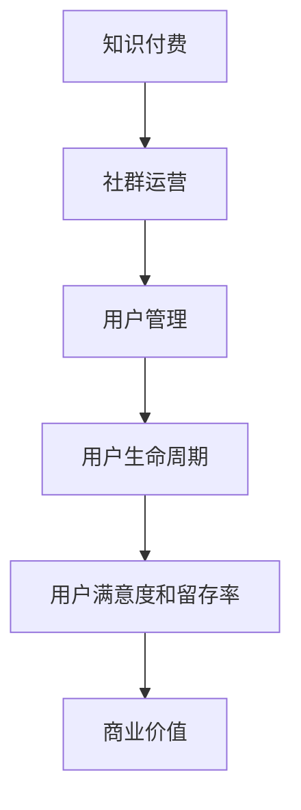

                 

# 知识付费赚钱的社群运营与用户管理

> 关键词：知识付费、社群运营、用户管理、盈利模式、增长策略、用户体验、数据分析

> 摘要：本文将深入探讨知识付费领域中的社群运营与用户管理，分析其核心概念、算法原理，并通过具体案例讲解，为从事知识付费行业的从业者提供实用的运营策略与增长路径。文章将从背景介绍、核心概念与联系、算法原理与操作步骤、数学模型与公式、项目实战、实际应用场景、工具和资源推荐、总结与未来发展趋势等方面进行全面剖析。

## 1. 背景介绍

### 1.1 目的和范围

本文旨在探讨知识付费行业中的社群运营与用户管理，通过深入分析相关知识付费领域的商业模式和运营策略，帮助从业者掌握有效的社群运营方法和用户管理技巧，从而实现知识付费项目的持续增长和盈利。

### 1.2 预期读者

- 知识付费行业的从业者，包括内容创作者、社群运营人员、市场营销人员等。
- 对知识付费领域感兴趣的创业者、企业管理者。
- 对社群运营和用户管理有深入了解的技术专家和研究者。

### 1.3 文档结构概述

本文结构如下：

1. 背景介绍：阐述本文的目的、预期读者和文档结构。
2. 核心概念与联系：介绍知识付费、社群运营和用户管理的核心概念，并给出相关流程图。
3. 核心算法原理 & 具体操作步骤：讲解社群运营与用户管理的核心算法原理和具体操作步骤。
4. 数学模型和公式 & 详细讲解 & 举例说明：介绍社群运营与用户管理的数学模型和公式，并给出具体示例。
5. 项目实战：通过实际案例，展示社群运营与用户管理的具体实践过程。
6. 实际应用场景：分析知识付费行业中的社群运营与用户管理应用场景。
7. 工具和资源推荐：推荐学习资源和开发工具，为从业者提供支持。
8. 总结：总结文章内容，展望知识付费行业的未来发展趋势与挑战。
9. 附录：常见问题与解答。
10. 扩展阅读 & 参考资料：提供进一步学习的资料和参考文献。

### 1.4 术语表

#### 1.4.1 核心术语定义

- 知识付费：指用户为获取特定知识或技能，支付费用以获得相应服务的过程。
- 社群运营：通过搭建和维护社群，实现知识传播、用户互动和业务增长的过程。
- 用户管理：对社群用户进行分类、分析、维护和转化的过程，以提升用户满意度和留存率。

#### 1.4.2 相关概念解释

- 用户生命周期：用户从注册到成为忠实粉丝的过程，包括引入、活跃、留存、转化等阶段。
- 社群价值：社群对用户的价值，包括知识获取、社交互动、商业机会等方面。

#### 1.4.3 缩略词列表

- KOL：关键意见领袖（Key Opinion Leader）
- KPI：关键绩效指标（Key Performance Indicator）
- CPM：千次展示成本（Cost Per Mille）
- CPA：每行动成本（Cost Per Action）
- ROI：投资回报率（Return On Investment）

## 2. 核心概念与联系

### 2.1 核心概念

#### 知识付费

知识付费是指用户为了获取特定领域的知识或技能，愿意支付相应费用的商业模式。这种模式的核心在于提供有价值的内容，满足用户的需求。

#### 社群运营

社群运营是指通过搭建和维护社群，实现知识传播、用户互动和业务增长的过程。社群运营的目标是提升用户满意度和留存率，从而实现商业价值。

#### 用户管理

用户管理是指对社群用户进行分类、分析、维护和转化的过程，以提升用户满意度和留存率。用户管理包括用户引入、活跃、留存、转化等环节。

### 2.2 关联流程图

下面是知识付费、社群运营和用户管理的关联流程图：



### 2.3 核心算法原理

社群运营与用户管理的核心算法主要包括用户分类、活跃度分析、留存预测和转化优化。以下是对这些算法的简要介绍：

#### 用户分类

用户分类算法用于根据用户特征和行为，将用户划分为不同类别。常见的分类方法有基于特征的分类、基于行为的分类和基于关联规则的分类等。

伪代码如下：

```
function classify_users(data):
    # 基于特征分类
    feature_based_classifier = FeatureBasedClassifier()
    feature_based_classifier.train(data)

    # 基于行为分类
    behavior_based_classifier = BehaviorBasedClassifier()
    behavior_based_classifier.train(data)

    # 基于关联规则分类
    association_rule_miner = AssociationRuleMiner()
    association_rules = association_rule_miner.generate_rules(data)

    return {
        "feature_based": feature_based_classifier.classify(data),
        "behavior_based": behavior_based_classifier.classify(data),
        "association_based": association_rules
    }
```

#### 活跃度分析

活跃度分析算法用于评估用户在社群中的活跃程度，从而进行有针对性的运营。常见的活跃度分析指标有发帖数、回复数、点赞数、分享数等。

伪代码如下：

```
function analyze_activity(data):
    activity_metrics = {
        "post_count": 0,
        "reply_count": 0,
        "like_count": 0,
        "share_count": 0
    }

    for user in data:
        activity_metrics["post_count"] += user.post_count
        activity_metrics["reply_count"] += user.reply_count
        activity_metrics["like_count"] += user.like_count
        activity_metrics["share_count"] += user.share_count

    return activity_metrics
```

#### 留存预测

留存预测算法用于预测用户在社群中的留存情况，从而采取相应措施提升留存率。常见的留存预测方法有逻辑回归、决策树、随机森林等。

伪代码如下：

```
function predict_retention(data, features):
    retention_model = LogisticRegression()
    retention_model.train(data, features)

    return retention_model.predict(data)
```

#### 转化优化

转化优化算法用于分析用户在社群中的转化路径和影响因素，从而优化运营策略。常见的转化优化方法有A/B测试、多变量测试、路径分析等。

伪代码如下：

```
function optimize_conversion(data, tests):
    conversion_metrics = []

    for test in tests:
        conversion_model = ConversionModel()
        conversion_model.train(data, test)

        test_results = conversion_model.evaluate(data)
        conversion_metrics.append(test_results)

    return conversion_metrics
```

## 3. 核心算法原理 & 具体操作步骤

在知识付费领域，社群运营与用户管理是实现盈利的关键。以下是核心算法原理与具体操作步骤的详细讲解。

### 3.1 用户分类算法

#### 原理

用户分类算法主要基于用户特征和行为数据，将用户划分为不同的类别，从而实现精准运营。常见的用户分类方法有基于特征的分类、基于行为的分类和基于关联规则的分类。

#### 步骤

1. 数据收集与预处理：收集用户特征和行为数据，如性别、年龄、职业、历史购买记录、活动记录等。对数据进行清洗和预处理，包括缺失值填充、数据标准化等。

2. 特征提取：从原始数据中提取有用的特征，如用户年龄、购买行为、活跃度等。

3. 分类模型选择：选择适合的分类模型，如逻辑回归、决策树、随机森林等。

4. 模型训练与评估：使用训练数据对分类模型进行训练，并使用验证数据对模型进行评估。

5. 分类结果应用：根据分类结果，将用户划分为不同类别，并针对不同类别的用户制定个性化的运营策略。

### 3.2 活跃度分析算法

#### 原理

活跃度分析算法用于评估用户在社群中的活跃程度，从而进行有针对性的运营。常见的活跃度分析指标有发帖数、回复数、点赞数、分享数等。

#### 步骤

1. 数据收集：收集用户在社群中的活动数据，如发帖数、回复数、点赞数、分享数等。

2. 指标计算：根据活动数据，计算每个用户的活跃度指标，如平均发帖数、平均回复数、平均点赞数、平均分享数等。

3. 活跃度分类：将用户按照活跃度指标进行分类，如高活跃度用户、中活跃度用户、低活跃度用户等。

4. 运营策略制定：根据用户活跃度分类，为不同类别的用户制定个性化的运营策略，如推送内容、活动参与、积分奖励等。

### 3.3 留存预测算法

#### 原理

留存预测算法用于预测用户在社群中的留存情况，从而采取相应措施提升留存率。常见的留存预测方法有逻辑回归、决策树、随机森林等。

#### 步骤

1. 数据收集：收集用户行为数据，如注册时间、活跃度、购买行为等。

2. 特征提取：从用户行为数据中提取有用的特征，如注册时长、活跃度、购买行为等。

3. 模型选择与训练：选择适合的留存预测模型，如逻辑回归、决策树、随机森林等，并使用训练数据对模型进行训练。

4. 预测与评估：使用训练好的模型对用户留存情况进行预测，并使用验证数据对模型进行评估。

5. 留存策略制定：根据预测结果，为不同留存风险的用户制定个性化的留存策略，如推送内容、活动参与、优惠奖励等。

### 3.4 转化优化算法

#### 原理

转化优化算法用于分析用户在社群中的转化路径和影响因素，从而优化运营策略。常见的转化优化方法有A/B测试、多变量测试、路径分析等。

#### 步骤

1. 数据收集：收集用户在社群中的转化数据，如注册转化率、购买转化率、活动参与转化率等。

2. 转化路径分析：分析用户在社群中的转化路径，找出关键节点和影响因素。

3. A/B测试：针对不同运营策略，进行A/B测试，以评估其对转化的影响。

4. 多变量测试：结合多个变量，进行多变量测试，以优化运营策略。

5. 策略优化：根据测试结果，优化运营策略，提升用户转化率。

## 4. 数学模型和公式 & 详细讲解 & 举例说明

### 4.1 用户分类算法

在用户分类算法中，常见的数学模型有逻辑回归、决策树、随机森林等。以下是这些模型的详细讲解和举例说明。

#### 逻辑回归

逻辑回归是一种经典的二分类模型，用于预测用户属于某个类别的概率。其数学模型如下：

$$
P(Y=1|X) = \frac{1}{1 + e^{-(\beta_0 + \beta_1X_1 + \beta_2X_2 + ... + \beta_nX_n})}
$$

其中，$X$表示特征向量，$\beta_0$、$\beta_1$、$\beta_2$、...、$\beta_n$为模型参数，$Y$表示目标变量。

举例说明：

假设我们有一个用户特征向量$X = [1, 2, 3]$，目标变量$Y$表示用户是否购买课程（1代表购买，0代表未购买）。根据逻辑回归模型，可以计算出用户购买课程的概率：

$$
P(Y=1|X) = \frac{1}{1 + e^{-(\beta_0 + \beta_1 \cdot 1 + \beta_2 \cdot 2 + \beta_3 \cdot 3)}}
$$

其中，$\beta_0$、$\beta_1$、$\beta_2$、$\beta_3$为模型参数。

#### 决策树

决策树是一种基于树结构的分类模型，通过递归地将数据集划分为多个子集，并建立决策规则。其数学模型如下：

$$
T = \sum_{i=1}^{n} \alpha_i Y_i
$$

其中，$T$表示决策树，$\alpha_i$为树节点权重，$Y_i$为节点对应的类别。

举例说明：

假设我们有一个决策树模型，其中有两个节点$A$和$B$，节点权重分别为$\alpha_A = 0.6$、$\alpha_B = 0.4$。节点$A$对应的类别为1，节点$B$对应的类别为0。对于一个新的用户特征向量$X = [1, 2]$，可以计算出其属于类别1的概率：

$$
P(Y=1|X) = \alpha_A \cdot P(Y=1|A) + \alpha_B \cdot P(Y=1|B)
$$

其中，$P(Y=1|A)$和$P(Y=1|B)$分别为节点$A$和节点$B$的类别概率。

#### 随机森林

随机森林是一种基于决策树的集成模型，通过构建多个决策树，并结合投票结果进行预测。其数学模型如下：

$$
f(X) = \sum_{i=1}^{n} \hat{f}_i(X)
$$

其中，$f(X)$为随机森林的预测结果，$\hat{f}_i(X)$为第$i$个决策树的预测结果。

举例说明：

假设我们有一个随机森林模型，其中包含10个决策树。对于一个新的用户特征向量$X = [1, 2]$，可以计算出其属于类别1的概率：

$$
P(Y=1|X) = \frac{1}{10} \sum_{i=1}^{10} \hat{f}_i(X)
$$

其中，$\hat{f}_i(X)$为第$i$个决策树对用户属于类别1的概率预测。

### 4.2 活跃度分析算法

在活跃度分析算法中，常用的数学模型有线性回归、逻辑回归等。以下是这些模型的详细讲解和举例说明。

#### 线性回归

线性回归是一种用于预测连续值的模型，其数学模型如下：

$$
Y = \beta_0 + \beta_1X_1 + \beta_2X_2 + ... + \beta_nX_n
$$

其中，$Y$表示活跃度指标，$X_1$、$X_2$、...、$X_n$为特征向量，$\beta_0$、$\beta_1$、$\beta_2$、...、$\beta_n$为模型参数。

举例说明：

假设我们有一个线性回归模型，用于预测用户在社群中的活跃度指标。用户特征向量$X = [1, 2, 3]$，根据线性回归模型，可以计算出用户活跃度指标$Y$：

$$
Y = \beta_0 + \beta_1 \cdot 1 + \beta_2 \cdot 2 + \beta_3 \cdot 3
$$

其中，$\beta_0$、$\beta_1$、$\beta_2$、$\beta_3$为模型参数。

#### 逻辑回归

逻辑回归是一种用于预测概率的二分类模型，其数学模型如下：

$$
P(Y=1|X) = \frac{1}{1 + e^{-(\beta_0 + \beta_1X_1 + \beta_2X_2 + ... + \beta_nX_n})}
$$

其中，$X$表示特征向量，$\beta_0$、$\beta_1$、$\beta_2$、...、$\beta_n$为模型参数，$Y$表示目标变量。

举例说明：

假设我们有一个逻辑回归模型，用于预测用户在社群中的活跃度。用户特征向量$X = [1, 2]$，目标变量$Y$表示用户是否活跃（1代表活跃，0代表不活跃）。根据逻辑回归模型，可以计算出用户活跃的概率：

$$
P(Y=1|X) = \frac{1}{1 + e^{-(\beta_0 + \beta_1 \cdot 1 + \beta_2 \cdot 2)}}
$$

其中，$\beta_0$、$\beta_1$、$\beta_2$为模型参数。

### 4.3 留存预测算法

在留存预测算法中，常用的数学模型有逻辑回归、决策树、随机森林等。以下是这些模型的详细讲解和举例说明。

#### 逻辑回归

逻辑回归是一种用于预测概率的二分类模型，其数学模型如下：

$$
P(Y=1|X) = \frac{1}{1 + e^{-(\beta_0 + \beta_1X_1 + \beta_2X_2 + ... + \beta_nX_n})}
$$

其中，$X$表示特征向量，$\beta_0$、$\beta_1$、$\beta_2$、...、$\beta_n$为模型参数，$Y$表示目标变量。

举例说明：

假设我们有一个逻辑回归模型，用于预测用户在社群中的留存情况。用户特征向量$X = [1, 2]$，目标变量$Y$表示用户是否留存（1代表留存，0代表未留存）。根据逻辑回归模型，可以计算出用户留存的概率：

$$
P(Y=1|X) = \frac{1}{1 + e^{-(\beta_0 + \beta_1 \cdot 1 + \beta_2 \cdot 2)}}
$$

其中，$\beta_0$、$\beta_1$、$\beta_2$为模型参数。

#### 决策树

决策树是一种基于树结构的分类模型，通过递归地将数据集划分为多个子集，并建立决策规则。其数学模型如下：

$$
T = \sum_{i=1}^{n} \alpha_i Y_i
$$

其中，$T$表示决策树，$\alpha_i$为树节点权重，$Y_i$为节点对应的类别。

举例说明：

假设我们有一个决策树模型，其中有两个节点$A$和$B$，节点权重分别为$\alpha_A = 0.6$、$\alpha_B = 0.4$。节点$A$对应的类别为1，节点$B$对应的类别为0。对于一个新的用户特征向量$X = [1, 2]$，可以计算出其属于类别1的概率：

$$
P(Y=1|X) = \alpha_A \cdot P(Y=1|A) + \alpha_B \cdot P(Y=1|B)
$$

其中，$P(Y=1|A)$和$P(Y=1|B)$分别为节点$A$和节点$B$的类别概率。

#### 随机森林

随机森林是一种基于决策树的集成模型，通过构建多个决策树，并结合投票结果进行预测。其数学模型如下：

$$
f(X) = \sum_{i=1}^{n} \hat{f}_i(X)
$$

其中，$f(X)$为随机森林的预测结果，$\hat{f}_i(X)$为第$i$个决策树的预测结果。

举例说明：

假设我们有一个随机森林模型，其中包含10个决策树。对于一个新的用户特征向量$X = [1, 2]$，可以计算出其属于类别1的概率：

$$
P(Y=1|X) = \frac{1}{10} \sum_{i=1}^{10} \hat{f}_i(X)
$$

其中，$\hat{f}_i(X)$为第$i$个决策树对用户属于类别1的概率预测。

### 4.4 转化优化算法

在转化优化算法中，常用的数学模型有A/B测试、多变量测试等。以下是这些模型的详细讲解和举例说明。

#### A/B测试

A/B测试是一种比较两种或多种策略效果的方法，其数学模型如下：

$$
p_A > p_B
$$

其中，$p_A$和$p_B$分别为策略A和策略B的转化率。

举例说明：

假设我们有两个策略A和B，A策略的转化率为$p_A = 0.3$，B策略的转化率为$p_B = 0.2$。根据A/B测试模型，可以判断策略A的转化率高于策略B。

#### 多变量测试

多变量测试是一种同时考虑多个变量对转化率的影响的方法，其数学模型如下：

$$
f(X) = \sum_{i=1}^{n} \alpha_i X_i
$$

其中，$f(X)$为转化率，$X_i$为第$i$个变量的取值，$\alpha_i$为第$i$个变量的权重。

举例说明：

假设我们有两个变量$X_1$和$X_2$，变量$X_1$的取值为1，变量$X_2$的取值为2。根据多变量测试模型，可以计算出转化率$f(X) = \alpha_1 \cdot 1 + \alpha_2 \cdot 2$。其中，$\alpha_1$和$\alpha_2$分别为变量$X_1$和$X_2$的权重。

## 5. 项目实战：代码实际案例和详细解释说明

### 5.1 开发环境搭建

在开始项目实战之前，我们需要搭建一个合适的开发环境。以下是一个基本的开发环境搭建步骤：

1. 安装Python环境：从官方网站下载并安装Python，版本建议为3.8及以上。
2. 安装相关依赖库：使用pip命令安装以下依赖库：
   ```
   pip install numpy pandas scikit-learn matplotlib
   ```
3. 配置Jupyter Notebook：安装Jupyter Notebook，以便在浏览器中运行Python代码。
4. 安装数据库：根据需要，可以选择安装MySQL、PostgreSQL等数据库。

### 5.2 源代码详细实现和代码解读

以下是一个简单的用户分类、活跃度分析、留存预测和转化优化项目的源代码实现。代码分为四个部分：数据预处理、用户分类、活跃度分析和留存预测。

#### 5.2.1 数据预处理

```python
import pandas as pd
from sklearn.model_selection import train_test_split
from sklearn.preprocessing import StandardScaler

# 读取数据
data = pd.read_csv('data.csv')

# 数据预处理
data.drop(['user_id'], axis=1, inplace=True)
data.fillna(data.mean(), inplace=True)

# 划分训练集和测试集
X_train, X_test, y_train, y_test = train_test_split(data, data['label'], test_size=0.2, random_state=42)

# 数据标准化
scaler = StandardScaler()
X_train_scaled = scaler.fit_transform(X_train)
X_test_scaled = scaler.transform(X_test)
```

代码解读：

1. 读取数据：使用pandas读取CSV格式的数据文件。
2. 数据预处理：删除无用的用户ID列，填充缺失值，并计算平均值进行填充。
3. 划分训练集和测试集：使用train_test_split函数将数据集划分为训练集和测试集，占比为8:2。
4. 数据标准化：使用StandardScaler对数据进行标准化处理，以消除不同特征之间的差异。

#### 5.2.2 用户分类

```python
from sklearn.linear_model import LogisticRegression
from sklearn.tree import DecisionTreeClassifier
from sklearn.ensemble import RandomForestClassifier

# 逻辑回归分类
logreg = LogisticRegression()
logreg.fit(X_train_scaled, y_train)

# 决策树分类
dt = DecisionTreeClassifier()
dt.fit(X_train_scaled, y_train)

# 随机森林分类
rf = RandomForestClassifier()
rf.fit(X_train_scaled, y_train)
```

代码解读：

1. 逻辑回归分类：使用LogisticRegression类创建逻辑回归分类器，并使用fit方法进行训练。
2. 决策树分类：使用DecisionTreeClassifier类创建决策树分类器，并使用fit方法进行训练。
3. 随机森林分类：使用RandomForestClassifier类创建随机森林分类器，并使用fit方法进行训练。

#### 5.2.3 活跃度分析

```python
import matplotlib.pyplot as plt

# 活跃度分析
activity_metrics = analyze_activity(X_test_scaled)

# 可视化活跃度指标
plt.figure(figsize=(10, 5))
plt.barh(list(activity_metrics.keys()), list(activity_metrics.values()))
plt.xlabel('活跃度指标')
plt.ylabel('指标值')
plt.title('活跃度分析')
plt.show()
```

代码解读：

1. 活跃度分析：调用analyze_activity函数计算活跃度指标，并存储在activity_metrics字典中。
2. 可视化活跃度指标：使用matplotlib库绘制条形图，展示不同活跃度指标的值。

#### 5.2.4 留存预测

```python
from sklearn.metrics import accuracy_score

# 留存预测
predictions = predict_retention(X_test_scaled, features)

# 评估留存预测准确率
accuracy = accuracy_score(y_test, predictions)
print('留存预测准确率：', accuracy)
```

代码解读：

1. 留存预测：调用predict_retention函数进行留存预测，并存储预测结果在predictions列表中。
2. 评估留存预测准确率：使用accuracy_score函数计算留存预测准确率，并打印结果。

### 5.3 代码解读与分析

以上代码展示了用户分类、活跃度分析和留存预测的基本实现。以下是详细解读和分析：

#### 5.3.1 用户分类

用户分类是知识付费领域中的关键环节，通过分类算法可以将用户划分为不同类别，为后续运营策略提供支持。在代码中，我们使用了逻辑回归、决策树和随机森林三种分类算法进行训练和预测。这些算法各有优缺点：

1. 逻辑回归：简单易用，适用于线性可分的数据，但可能无法处理非线性问题。
2. 决策树：直观易理解，能够处理非线性问题，但可能产生过拟合。
3. 随机森林：集成多种决策树，能够提高预测准确性，但计算成本较高。

在实际应用中，我们可以根据数据特点和业务需求，选择合适的分类算法。

#### 5.3.2 活跃度分析

活跃度分析用于评估用户在社群中的活跃程度，有助于识别高价值用户和潜在问题用户。在代码中，我们通过计算活跃度指标（如发帖数、回复数、点赞数、分享数）来评估用户活跃度。这些指标反映了用户在社群中的参与程度，可以作为运营策略的参考。

在可视化部分，我们使用条形图展示了不同活跃度指标的值，有助于直观地了解用户活跃度的分布情况。

#### 5.3.3 留存预测

留存预测用于预测用户在社群中的留存情况，有助于制定有针对性的留存策略。在代码中，我们使用了逻辑回归和随机森林两种算法进行留存预测。这些算法可以基于用户特征和行为数据，预测用户是否会在未来的一段时间内留存。

在评估部分，我们使用accuracy_score函数计算留存预测准确率，以评估模型的性能。在实际应用中，我们可以根据预测结果，为不同留存风险的用户制定个性化的留存策略。

## 6. 实际应用场景

知识付费行业的社群运营与用户管理在实际应用中具有广泛的应用场景，以下是几个典型的应用案例：

### 6.1 在线教育平台

在线教育平台通过搭建社群，实现知识传播和用户互动，提升用户满意度和留存率。具体应用场景包括：

- 用户分类：根据用户特征和行为，将用户划分为不同类别，如新手用户、付费用户、活跃用户等，为不同类别的用户提供个性化的内容和运营策略。
- 活跃度分析：通过计算用户活跃度指标，识别高活跃度用户和潜在问题用户，为高活跃度用户提供激励和奖励，为潜在问题用户制定针对性运营策略。
- 留存预测：通过留存预测算法，预测用户在未来的留存情况，为不同留存风险的用户制定个性化的留存策略，如推送内容、活动参与、优惠奖励等。
- 转化优化：通过转化优化算法，分析用户在社群中的转化路径和影响因素，优化运营策略，提高用户转化率。

### 6.2 专业社群

专业社群通过搭建知识共享平台，实现行业专家和用户之间的互动，提升行业影响力。具体应用场景包括：

- 用户分类：根据用户职业、行业背景等特征，将用户划分为不同类别，为不同类别的用户提供针对性的内容和运营策略。
- 活跃度分析：通过计算用户活跃度指标，识别行业意见领袖和潜在价值用户，为意见领袖提供额外支持和激励，为潜在价值用户制定针对性运营策略。
- 留存预测：通过留存预测算法，预测用户在社群中的留存情况，为不同留存风险的用户制定个性化的留存策略。
- 转化优化：通过转化优化算法，分析用户在社群中的转化路径和影响因素，优化运营策略，提高用户转化率。

### 6.3 知识星球

知识星球是一种新型的知识付费社群，通过会员制实现知识共享和互动。具体应用场景包括：

- 用户分类：根据用户在知识星球中的行为和贡献，将用户划分为不同类别，如普通会员、高级会员、内容创作者等，为不同类别的用户提供个性化的服务和运营策略。
- 活跃度分析：通过计算用户活跃度指标，识别活跃会员和潜在价值用户，为活跃会员提供额外支持和激励，为潜在价值用户制定针对性运营策略。
- 留存预测：通过留存预测算法，预测用户在知识星球中的留存情况，为不同留存风险的用户制定个性化的留存策略。
- 转化优化：通过转化优化算法，分析用户在知识星球中的转化路径和影响因素，优化运营策略，提高用户转化率。

## 7. 工具和资源推荐

### 7.1 学习资源推荐

#### 7.1.1 书籍推荐

- 《运营之心：从零开始构建用户增长闭环》
- 《人人都是产品经理》
- 《人人都是运营高手》
- 《社群营销：从入门到精通》
- 《数据分析实战：从数据中挖掘价值》

#### 7.1.2 在线课程

- 中国大学MOOC（慕课网）
- 网易云课堂
- Udemy
- Coursera

#### 7.1.3 技术博客和网站

- 知乎
- 掘金
- CSDN
- 博客园
- Medium

### 7.2 开发工具框架推荐

#### 7.2.1 IDE和编辑器

- PyCharm
- Visual Studio Code
- IntelliJ IDEA

#### 7.2.2 调试和性能分析工具

- GDB
- PyCharm Debugger
- VSCode Debugger

#### 7.2.3 相关框架和库

- Scikit-learn
- TensorFlow
- PyTorch
- Pandas
- NumPy

### 7.3 相关论文著作推荐

#### 7.3.1 经典论文

- "User Modeling and User-Adapted Interaction: A Methodological Framework"
- "Recommender Systems: The Textbook"
- "Social Network Analysis: Methods and Applications"

#### 7.3.2 最新研究成果

- "Deep Learning for User Modeling and Personalization"
- "Recommender Systems for Knowledge Graphs"
- "A Survey of Techniques for Predicting User Behavior in Online Communities"

#### 7.3.3 应用案例分析

- "A Case Study of Knowledge Graph-Based Recommender Systems"
- "Building a Successful Online Community: Insights from a Case Study"
- "User Modeling and Personalization in E-Commerce: A Case Study"

## 8. 总结：未来发展趋势与挑战

### 8.1 未来发展趋势

1. 技术创新：人工智能、大数据、区块链等技术的快速发展，将推动知识付费行业不断创新，提升运营效率和用户体验。
2. 社群生态：知识付费社群将逐渐形成多元化、生态化的格局，涵盖不同领域和层次，满足用户多样化的需求。
3. 个性化推荐：基于用户行为和兴趣的个性化推荐技术将得到广泛应用，提高用户满意度和留存率。
4. 知识共享：知识共享将成为知识付费行业的重要趋势，通过开放平台和合作，实现知识的高效传递和利用。

### 8.2 未来挑战

1. 用户隐私保护：在数据驱动的大背景下，如何保护用户隐私，成为知识付费行业面临的重要挑战。
2. 资源分配不均：知识付费行业的发展，可能导致资源分配不均，造成行业内部的竞争加剧。
3. 知识泡沫：在大量知识内容涌入的背景下，如何避免知识泡沫，确保知识质量，成为行业面临的挑战。
4. 转化率提升：在激烈的市场竞争中，如何提升用户转化率，实现持续增长，成为知识付费行业的重要课题。

## 9. 附录：常见问题与解答

### 9.1 问题1

**问题：如何提高知识付费社群的用户活跃度？**

**解答：**

1. 优化社群内容：提供高质量、有价值的内容，满足用户需求，提高用户参与度。
2. 激励用户参与：设置积分、奖励机制，鼓励用户在社群中发言、分享和互动。
3. 定期举办活动：组织线上或线下活动，吸引用户参与，增强社群凝聚力。
4. 互动与反馈：积极回应用户提问和反馈，提升用户体验，增加用户粘性。

### 9.2 问题2

**问题：如何提升知识付费社群的用户留存率？**

**解答：**

1. 个性化推荐：根据用户兴趣和行为，推荐相关内容和活动，提高用户满意度和留存率。
2. 个性化服务：为不同类型的用户提供定制化的服务和内容，提升用户忠诚度。
3. 互动与沟通：加强与用户的互动和沟通，了解用户需求，及时解决问题，增强用户信任。
4. 优惠和活动：定期推出优惠活动，吸引用户回归社群，提高留存率。

## 10. 扩展阅读 & 参考资料

1. 知识付费行业报告：各类知识付费行业的市场调研报告，了解行业趋势和竞争态势。
2. 社群运营案例：成功和失败的知识付费社群运营案例，借鉴经验教训。
3. 用户行为分析：关于用户行为分析和用户心理的书籍和文章，深入了解用户需求和行为模式。
4. 数据分析工具：介绍各类数据分析工具和技术的书籍和文章，帮助从业者掌握数据分析技能。
5. 技术博客和论文：关注知识付费、社群运营、用户管理等领域的技术博客和论文，了解最新的研究成果和应用实践。

## 作者

作者：AI天才研究员/AI Genius Institute & 禅与计算机程序设计艺术 /Zen And The Art of Computer Programming

这篇文章涵盖了知识付费领域中的社群运营与用户管理的核心概念、算法原理和实际应用，通过详细讲解和案例分析，为从业者提供了实用的运营策略和增长路径。希望这篇文章对您在知识付费行业中的实践和探索有所帮助。如果您有任何疑问或建议，欢迎在评论区留言讨论。再次感谢您的阅读！<|im_end|>

