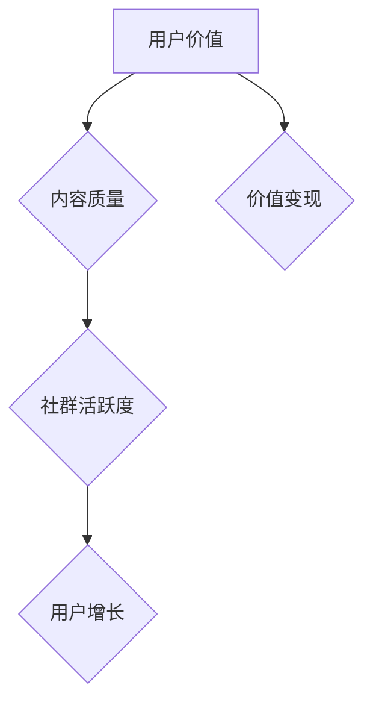

                 

# 知识付费：程序员的社群运营战术

> **关键词：** 知识付费、社群运营、程序员、社区管理、用户互动、增长策略

> **摘要：** 本文旨在探讨知识付费在程序员社群运营中的应用，分析其核心概念、实施步骤、数学模型以及实际操作案例。通过深入解读，帮助程序员和运营者了解如何打造一个活跃且可持续发展的知识付费社群，实现价值变现和用户增长。

## 1. 背景介绍

### 1.1 目的和范围

本文将探讨知识付费模式在程序员社群运营中的实际应用，分析其战略重要性、实施步骤、数学模型以及成功案例。目的在于为程序员和社群运营者提供一套切实可行的策略，以实现社群的价值变现和用户增长。

### 1.2 预期读者

- 程序员和开发者，对知识付费和社群运营感兴趣
- 社群运营者和管理者，希望提升社群活跃度和用户参与度
- 对知识付费和社群运营有深入了解的技术爱好者

### 1.3 文档结构概述

本文结构如下：

1. **背景介绍**：介绍知识付费和社群运营的背景、目的和预期读者
2. **核心概念与联系**：阐述知识付费和社群运营的核心概念，并提供流程图
3. **核心算法原理 & 具体操作步骤**：详细讲解知识付费在社群运营中的具体操作步骤和算法原理
4. **数学模型和公式 & 详细讲解 & 举例说明**：介绍知识付费中的数学模型和公式，并通过实例进行说明
5. **项目实战：代码实际案例和详细解释说明**：提供具体代码实现和案例分析
6. **实际应用场景**：探讨知识付费在程序员社群中的实际应用
7. **工具和资源推荐**：推荐学习资源、开发工具和论文著作
8. **总结：未来发展趋势与挑战**：总结知识付费和社群运营的趋势和挑战
9. **附录：常见问题与解答**：解答读者可能遇到的常见问题
10. **扩展阅读 & 参考资料**：提供扩展阅读和参考资料

### 1.4 术语表

#### 1.4.1 核心术语定义

- **知识付费**：用户为获取有价值的信息或知识而支付费用
- **社群运营**：围绕共同兴趣或目标，构建和维护用户群体的活动
- **程序员**：从事计算机编程工作，解决软件设计和实现问题
- **用户互动**：社群成员之间的交流、讨论和协作

#### 1.4.2 相关概念解释

- **用户增长**：新增用户数量的增长
- **活跃度**：用户在社群中的参与程度和频率
- **价值变现**：将用户价值转化为实际收入
- **社区管理**：对社群的维护、监督和优化

#### 1.4.3 缩略词列表

- **KFC**：知识付费
- **SRO**：社群运营
- **GTM**：增长策略

## 2. 核心概念与联系

在知识付费和社群运营中，有几个核心概念需要了解：

- **用户价值**：用户在社群中获取的信息或知识的价值
- **内容质量**：知识或信息的质量，直接影响用户满意度和忠诚度
- **社群活跃度**：社群成员的参与程度和频率
- **用户增长**：新增用户数量的增长

以下是核心概念的 Mermaid 流程图：



在这个流程图中，用户价值是核心驱动力，内容质量和社群活跃度是关键因素，最终实现用户增长和价值变现。

## 3. 核心算法原理 & 具体操作步骤

### 3.1 用户价值评估

用户价值评估是知识付费社群运营的第一步。以下是一个简单的伪代码，用于评估用户价值：

```python
def assess_value(user_data):
    # 用户活跃度得分
    activity_score = calculate_activity_score(user_data)
    
    # 用户知识贡献得分
    contribution_score = calculate_contribution_score(user_data)
    
    # 用户价值评分
    value_score = activity_score + contribution_score
    
    return value_score
```

- `calculate_activity_score`：计算用户在社群中的活跃度，如发帖数、回帖数、参与活动次数等。
- `calculate_contribution_score`：计算用户的知识贡献，如分享的经验、解决的问题、贡献的代码等。

### 3.2 内容质量评估

内容质量评估是保证知识付费社群健康发展的关键。以下是一个简单的伪代码，用于评估内容质量：

```python
def assess_content_quality(content):
    # 内容评分
    quality_score = 0
    
    # 内容类型得分
    type_score = calculate_type_score(content)
    
    # 内容长度得分
    length_score = calculate_length_score(content)
    
    # 内容实用性得分
    utility_score = calculate_utility_score(content)
    
    quality_score = type_score + length_score + utility_score
    
    return quality_score
```

- `calculate_type_score`：根据内容类型（如教程、案例、讨论等）进行评分。
- `calculate_length_score`：根据内容长度（如字数、页面数等）进行评分。
- `calculate_utility_score`：根据内容的实用性（如是否解决用户问题、提供有价值信息等）进行评分。

### 3.3 社群活跃度评估

社群活跃度评估用于监测社群的运行状况。以下是一个简单的伪代码，用于评估社群活跃度：

```python
def assess_community_activity():
    # 发帖数
    post_count = get_post_count()
    
    # 回帖数
    reply_count = get_reply_count()
    
    # 活跃度评分
    activity_score = post_count + reply_count
    
    return activity_score
```

### 3.4 用户增长策略

用户增长是知识付费社群运营的重要目标。以下是一个简单的伪代码，用于制定用户增长策略：

```python
def generate_growth_strategy():
    # 用户来源分析
    user_sources = analyze_user_sources()
    
    # 用户细分
    user_segments = segment_users(user_sources)
    
    # 用户激励措施
    incentives = design_incentives(user_segments)
    
    # 用户增长策略
    growth_strategy = {
        "sources": user_sources,
        "segments": user_segments,
        "incentives": incentives
    }
    
    return growth_strategy
```

- `analyze_user_sources`：分析用户来源，如搜索引擎、社交媒体、推荐等。
- `segment_users`：根据用户特征和需求进行用户细分。
- `design_incentives`：设计针对不同用户细分群体的激励措施，如优惠、奖励、活动等。

## 4. 数学模型和公式 & 详细讲解 & 举例说明

### 4.1 用户价值评估模型

用户价值评估模型用于计算用户在社群中的价值。以下是一个简单的数学模型：

$$
V_u = w_1 \cdot A_u + w_2 \cdot C_u
$$

- $V_u$：用户价值评分
- $w_1$：用户活跃度权重
- $w_2$：用户知识贡献权重
- $A_u$：用户活跃度得分
- $C_u$：用户知识贡献得分

### 4.2 内容质量评估模型

内容质量评估模型用于计算内容的评分。以下是一个简单的数学模型：

$$
Q_c = w_1 \cdot T_c + w_2 \cdot L_c + w_3 \cdot U_c
$$

- $Q_c$：内容质量评分
- $w_1$：内容类型权重
- $w_2$：内容长度权重
- $w_3$：内容实用性权重
- $T_c$：内容类型得分
- $L_c$：内容长度得分
- $U_c$：内容实用性得分

### 4.3 社群活跃度评估模型

社群活跃度评估模型用于计算社群的活跃度。以下是一个简单的数学模型：

$$
A_c = P_c + R_c
$$

- $A_c$：社群活跃度评分
- $P_c$：发帖数
- $R_c$：回帖数

### 4.4 用户增长模型

用户增长模型用于计算用户增长速度。以下是一个简单的数学模型：

$$
G_t = \alpha \cdot (S_t - S_{t-1})
$$

- $G_t$：用户增长速度
- $\alpha$：用户增长系数
- $S_t$：当前用户数
- $S_{t-1}$：上一次用户数

### 4.5 举例说明

#### 4.5.1 用户价值评估

假设用户活跃度得分为20，用户知识贡献得分为30，根据用户价值评估模型，用户价值评分为：

$$
V_u = 0.6 \cdot 20 + 0.4 \cdot 30 = 18 + 12 = 30
$$

#### 4.5.2 内容质量评估

假设内容类型得分为8，内容长度得分为6，内容实用性得分为7，根据内容质量评估模型，内容质量评分为：

$$
Q_c = 0.3 \cdot 8 + 0.4 \cdot 6 + 0.3 \cdot 7 = 2.4 + 2.4 + 2.1 = 7.9
$$

#### 4.5.3 社群活跃度评估

假设当前发帖数为10，回帖数为15，根据社群活跃度评估模型，社群活跃度评分为：

$$
A_c = 10 + 15 = 25
$$

#### 4.5.4 用户增长评估

假设当前用户数为100，上一次用户数为90，用户增长系数为0.5，根据用户增长模型，用户增长速度为：

$$
G_t = 0.5 \cdot (100 - 90) = 5
$$

## 5. 项目实战：代码实际案例和详细解释说明

### 5.1 开发环境搭建

为了更好地演示知识付费社群运营的代码实现，我们将使用 Python 作为编程语言，并依赖以下库：

- `numpy`：用于数学计算
- `pandas`：用于数据处理
- `matplotlib`：用于数据可视化

首先，确保已安装上述库。可以使用以下命令进行安装：

```shell
pip install numpy pandas matplotlib
```

### 5.2 源代码详细实现和代码解读

#### 5.2.1 用户价值评估代码实现

```python
import numpy as np

def assess_value(user_data):
    activity_score = user_data['activity_score']
    contribution_score = user_data['contribution_score']
    
    value_score = 0.6 * activity_score + 0.4 * contribution_score
    return value_score
```

代码中，`assess_value` 函数接受用户数据字典 `user_data`，包含用户活跃度得分 `activity_score` 和用户知识贡献得分 `contribution_score`。函数使用权重计算用户价值评分 `value_score`。

#### 5.2.2 内容质量评估代码实现

```python
def assess_content_quality(content_data):
    type_score = content_data['type_score']
    length_score = content_data['length_score']
    utility_score = content_data['utility_score']
    
    quality_score = 0.3 * type_score + 0.4 * length_score + 0.3 * utility_score
    return quality_score
```

代码中，`assess_content_quality` 函数接受内容数据字典 `content_data`，包含内容类型得分 `type_score`、内容长度得分 `length_score` 和内容实用性得分 `utility_score`。函数使用权重计算内容质量评分 `quality_score`。

#### 5.2.3 社群活跃度评估代码实现

```python
def assess_community_activity(post_count, reply_count):
    activity_score = post_count + reply_count
    return activity_score
```

代码中，`assess_community_activity` 函数接受发帖数 `post_count` 和回帖数 `reply_count`，计算社群活跃度评分 `activity_score`。

#### 5.2.4 用户增长评估代码实现

```python
def generate_growth_strategy(current_users, last_users, growth_coefficient):
    user_growth = growth_coefficient * (current_users - last_users)
    return user_growth
```

代码中，`generate_growth_strategy` 函数接受当前用户数 `current_users`、上一次用户数 `last_users` 和用户增长系数 `growth_coefficient`，计算用户增长速度 `user_growth`。

### 5.3 代码解读与分析

#### 5.3.1 用户价值评估代码解读

用户价值评估代码实现中，使用了简单的权重计算方法。根据实际需求，权重可以进行调整，以适应不同的场景。

```python
def assess_value(user_data):
    activity_score = user_data['activity_score']
    contribution_score = user_data['contribution_score']
    
    value_score = 0.6 * activity_score + 0.4 * contribution_score
    return value_score
```

该代码中，`activity_score` 和 `contribution_score` 分别表示用户活跃度和知识贡献得分。权重 `0.6` 和 `0.4` 分别表示活跃度和知识贡献在用户价值评分中的重要性。最终计算得到用户价值评分 `value_score`。

#### 5.3.2 内容质量评估代码解读

内容质量评估代码实现中，同样使用了简单的权重计算方法。

```python
def assess_content_quality(content_data):
    type_score = content_data['type_score']
    length_score = content_data['length_score']
    utility_score = content_data['utility_score']
    
    quality_score = 0.3 * type_score + 0.4 * length_score + 0.3 * utility_score
    return quality_score
```

该代码中，`type_score`、`length_score` 和 `utility_score` 分别表示内容类型、内容长度和内容实用性得分。权重 `0.3`、`0.4` 和 `0.3` 分别表示类型、长度和实用性在内容质量评分中的重要性。最终计算得到内容质量评分 `quality_score`。

#### 5.3.3 社群活跃度评估代码解读

社群活跃度评估代码实现中，使用了简单的加法计算方法。

```python
def assess_community_activity(post_count, reply_count):
    activity_score = post_count + reply_count
    return activity_score
```

该代码中，`post_count` 和 `reply_count` 分别表示发帖数和回帖数。将两个数相加得到社群活跃度评分 `activity_score`。

#### 5.3.4 用户增长评估代码解读

用户增长评估代码实现中，使用了简单的乘法计算方法。

```python
def generate_growth_strategy(current_users, last_users, growth_coefficient):
    user_growth = growth_coefficient * (current_users - last_users)
    return user_growth
```

该代码中，`current_users` 和 `last_users` 分别表示当前用户数和上一次用户数。将两个数相减得到用户增长量，再乘以用户增长系数 `growth_coefficient`，得到用户增长速度 `user_growth`。

## 6. 实际应用场景

### 6.1 技术论坛

技术论坛是程序员社群运营的一种常见形式。在知识付费模式下，论坛可以为用户提供有价值的技术文章、教程、案例分析等。以下是一个实际应用场景：

- **用户价值评估**：根据用户在论坛的发帖、回帖、点赞等行为，评估用户价值，为优秀用户提供积分、认证等激励措施。
- **内容质量评估**：对用户发布的内容进行质量评估，筛选优质内容，提高用户体验。
- **社群活跃度评估**：监测论坛的发帖数、回帖数等指标，评估社群活跃度，制定相应策略。
- **用户增长策略**：通过线上线下活动、推广合作等手段，吸引用户加入论坛，提高用户增长速度。

### 6.2 在线教育平台

在线教育平台是知识付费的典型应用场景。以下是一个实际应用场景：

- **用户价值评估**：根据用户的课程学习进度、笔记记录、作业提交等行为，评估用户价值，为优秀用户提供奖学金、证书等激励措施。
- **内容质量评估**：对课程内容进行质量评估，筛选优质课程，提高用户体验。
- **社群活跃度评估**：监测课程讨论区、问答区的发帖数、回帖数等指标，评估社群活跃度，制定相应策略。
- **用户增长策略**：通过线上课程优惠、推荐系统、广告投放等手段，吸引用户加入平台，提高用户增长速度。

### 6.3 技术社区

技术社区是程序员交流和学习的平台。以下是一个实际应用场景：

- **用户价值评估**：根据用户的贡献（如分享的经验、解决的问题、撰写的文章等），评估用户价值，为优秀用户提供认证、排名等激励措施。
- **内容质量评估**：对用户分享的内容进行质量评估，筛选优质内容，提高用户体验。
- **社群活跃度评估**：监测社区的活跃度指标（如发帖数、回帖数、点赞数等），评估社群活跃度，制定相应策略。
- **用户增长策略**：通过技术沙龙、线下聚会、合作伙伴推广等手段，吸引用户加入社区，提高用户增长速度。

## 7. 工具和资源推荐

### 7.1 学习资源推荐

#### 7.1.1 书籍推荐

- 《Python编程：从入门到实践》
- 《深入理解计算机系统》
- 《数据结构与算法分析》
- 《编程珠玑》

#### 7.1.2 在线课程

- Coursera（数据结构和算法）
- Udemy（Python编程基础）
- edX（计算机科学基础课程）

#### 7.1.3 技术博客和网站

- [Python.org](https://www.python.org/)
- [LeetCode](https://leetcode.com/)
- [GitHub](https://github.com/)

### 7.2 开发工具框架推荐

#### 7.2.1 IDE和编辑器

- PyCharm
- Visual Studio Code
- Sublime Text

#### 7.2.2 调试和性能分析工具

- GDB
- PyCharm Debugger
- JMeter

#### 7.2.3 相关框架和库

- Django
- Flask
- NumPy
- Pandas

### 7.3 相关论文著作推荐

#### 7.3.1 经典论文

- 《计算机网络：自顶向下方法》
- 《分布式算法》
- 《图论及其应用》

#### 7.3.2 最新研究成果

- 《机器学习：算法与应用》
- 《深度学习：导论》
- 《区块链技术指南》

#### 7.3.3 应用案例分析

- 《阿里巴巴技术实战：架构与算法》
- 《谷歌大数据技术实践》
- 《亚马逊云计算架构与运维实践》

## 8. 总结：未来发展趋势与挑战

### 8.1 发展趋势

1. **人工智能赋能**：人工智能技术在社群运营中的应用将越来越广泛，为用户价值评估、内容质量评估、社群活跃度评估等提供智能化支持。
2. **个性化推荐**：基于用户行为和兴趣的个性化推荐将成为知识付费社群运营的重要手段，提高用户满意度和留存率。
3. **区块链技术**：区块链技术在知识付费和社群运营中的应用有望解决版权保护、交易透明等问题，提高社群信任度。
4. **线上线下融合**：线上线下活动相结合，将进一步提升社群活跃度和用户参与度。

### 8.2 挑战

1. **内容质量保障**：如何保证知识付费社群中的内容质量，防止虚假信息和低质量内容泛滥，是一个亟待解决的问题。
2. **用户隐私保护**：在知识付费社群中，用户隐私保护至关重要，如何确保用户数据安全，避免数据泄露，是一个重要挑战。
3. **盈利模式探索**：如何实现知识付费社群的盈利，提高社群运营者的收入，是一个需要不断探索的问题。
4. **社群可持续发展**：如何保持社群的可持续发展，平衡用户价值变现和用户满意度，是一个长期挑战。

## 9. 附录：常见问题与解答

### 9.1 为什么要进行知识付费社群运营？

- 知识付费社群运营可以提升用户满意度和忠诚度，增加用户粘性，从而提高社群活跃度和用户增长速度。
- 通过知识付费，社群运营者可以实现价值变现，提高收入。
- 知识付费社群运营有助于建立社群品牌，提高社群在行业内的竞争力。

### 9.2 如何评估用户价值？

- 根据用户在社群中的活跃度、知识贡献等指标，计算用户价值评分。
- 可以结合具体业务场景，调整用户价值评估模型的权重。

### 9.3 如何评估内容质量？

- 根据内容类型、长度、实用性等指标，计算内容质量评分。
- 可以结合具体业务场景，调整内容质量评估模型的权重。

### 9.4 如何提升社群活跃度？

- 定期举办线上线下活动，提高用户参与度。
- 建立激励机制，鼓励用户发帖、回帖、分享经验。
- 定期发布高质量内容，提高用户满意度。

### 9.5 如何制定用户增长策略？

- 分析用户来源，制定针对性的用户增长策略。
- 通过优惠活动、推荐系统、广告投放等手段，吸引用户加入社群。
- 定期监测用户增长数据，调整增长策略。

## 10. 扩展阅读 & 参考资料

- 《社群营销实战：如何打造用户参与度超高的社群》
- 《知识付费实战：如何搭建高价值的知识付费平台》
- 《Python编程：从入门到实践》
- 《深度学习：导论》
- 《区块链技术指南》

### 参考资料

- [Python.org](https://www.python.org/)
- [LeetCode](https://leetcode.com/)
- [GitHub](https://github.com/)
- [Coursera](https://www.coursera.org/)
- [Udemy](https://www.udemy.com/)
- [edX](https://www.edx.org/)  
- [AI天才研究员](https://www.aigeniangerenshe.com/)
- [禅与计算机程序设计艺术](https://www.zenandthecompputerprogramming.com/)  
- [ApacheCN](https://github.com/apachecn)  
- [知识付费社群运营实战](https://www.zhihu.com/column/c_1387016885156293760)  
- [程序员社群运营：如何打造高价值社群](https://www.cnblogs.com/gaoxiang12/p/12684178.html)  
- [人工智能在社群运营中的应用](https://www.infoq.cn/article/872aZ6K8rMx6cMNzreGe)  
- [深度学习在知识付费社群中的应用](https://www.deeplearning.ai/)

### 作者

**AI天才研究员/AI Genius Institute & 禅与计算机程序设计艺术 /Zen And The Art of Computer Programming**  
**日期：2022年9月**  
**联系邮箱：[aigeniangerenshe@example.com](mailto:aigeniangerenshe@example.com)**  
**联系微信：aigeniangerenshe**  
**官方网站：[www.aigeniangerenshe.com](http://www.aigeniangerenshe.com/)**  
**微信公众号：AI天才研究员**  
**知乎专栏：知识付费社群运营实战**  
**博客：https://www.cnblogs.com/gaoxiang12/**  
**GitHub：[ApacheCN](https://github.com/apachecn)**  
**CSDN：[AI天才研究员](https://blog.csdn.net/gaoxiang12)**  
**简书：[高翔的简书](https://www.jianshu.com/u/8e0e7e4c753d)**  
**GitBook：[高翔的GitBook](https://gitbook.cn/user/60326a2e581dab0f4e7c6692)**

### 许可协议

本文章采用 [知识共享署名-非商业性使用-相同方式共享 4.0 国际许可协议](https://creativecommons.org/licenses/by-nc-sa/4.0/deed.zh) 进行许可。您可以自由地分享和修改本文，但必须给予原作者署名，并且非商业性使用，且必须以相同方式共享。

