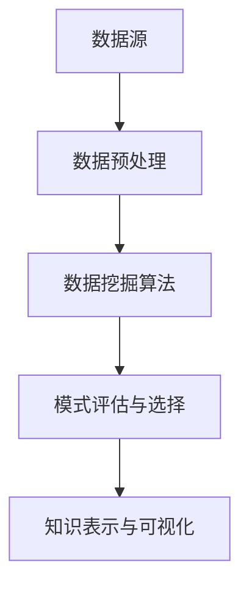

                 

# 知识发现引擎助力程序员快速适应新技术

> **关键词**：知识发现、程序员、新技术、算法原理、数学模型、项目实战、应用场景
> 
> **摘要**：本文将探讨知识发现引擎如何帮助程序员更高效地适应新技术。通过详细解析知识发现的核心概念、算法原理、数学模型以及实际项目案例，我们将展示知识发现引擎在编程领域的广泛应用和巨大潜力。

## 1. 背景介绍

### 1.1 目的和范围

本文旨在帮助程序员更好地理解和应用知识发现引擎，从而在新技术层出不穷的背景下，保持竞争力。我们将探讨以下内容：
- 知识发现引擎的基本原理和架构。
- 核心算法和数学模型。
- 实际项目案例和代码解读。
- 应用场景和未来发展趋势。

### 1.2 预期读者

本文面向具有基础编程知识的程序员，特别是希望提升自己在新技术领域适应能力的专业人士。同时，对计算机科学和人工智能感兴趣的读者也可以从中受益。

### 1.3 文档结构概述

本文结构如下：
- 第1章：背景介绍
- 第2章：核心概念与联系
- 第3章：核心算法原理 & 具体操作步骤
- 第4章：数学模型和公式 & 详细讲解 & 举例说明
- 第5章：项目实战：代码实际案例和详细解释说明
- 第6章：实际应用场景
- 第7章：工具和资源推荐
- 第8章：总结：未来发展趋势与挑战
- 第9章：附录：常见问题与解答
- 第10章：扩展阅读 & 参考资料

### 1.4 术语表

#### 1.4.1 核心术语定义

- 知识发现引擎：一种基于数据分析的智能系统，用于从大量数据中自动提取隐藏的知识和模式。
- 程序员：计算机程序的设计者和实现者，负责开发和维护软件系统。
- 新技术：指相对于现有技术水平而言，具有创新性、颠覆性或变革性的技术。
- 算法：解决问题的步骤和规则。
- 数学模型：用于描述和解决问题的一种数学形式。

#### 1.4.2 相关概念解释

- 数据挖掘：从大量数据中提取有用信息的过程。
- 机器学习：一种人工智能技术，通过从数据中学习规律和模式，实现对未知数据的预测和分类。
- 人工智能：模拟、延伸和扩展人类智能的科学和工程。

#### 1.4.3 缩略词列表

- AI：人工智能
- ML：机器学习
- DM：数据挖掘
- KDD：知识发现

## 2. 核心概念与联系

为了更好地理解知识发现引擎，我们首先需要了解其核心概念和基本架构。以下是一个简单的 Mermaid 流程图，展示了知识发现引擎的主要组成部分。



### 数据源

数据源是知识发现引擎的基础，包括结构化数据（如数据库）、半结构化数据（如XML）和非结构化数据（如文本、图像、音频）。数据源的多样性和质量直接影响知识发现的准确性和效率。

### 数据预处理

数据预处理是知识发现过程中的关键步骤，包括数据清洗、数据集成、数据转换和数据归一化等。数据预处理的质量直接关系到后续挖掘算法的性能。

### 数据挖掘算法

数据挖掘算法是知识发现的核心，用于从预处理后的数据中提取隐藏的知识和模式。常见的算法包括分类、聚类、关联规则挖掘和异常检测等。

### 模式评估与选择

模式评估与选择是数据挖掘过程中的一个重要环节，通过评估和筛选挖掘出的模式，选出最有价值、最符合需求的模式。

### 知识表示与可视化

知识表示与可视化是将挖掘出的知识以人类可理解的方式呈现的过程。通过可视化工具，程序员可以更直观地理解和使用知识发现引擎的结果。

## 3. 核心算法原理 & 具体操作步骤

### 3.1 数据挖掘算法原理

数据挖掘算法基于统计学、机器学习和人工智能等理论，通过分析数据特征，提取出潜在的模式和知识。以下是常见的数据挖掘算法及其原理：

#### 3.1.1 聚类算法

聚类算法将数据集划分为若干个群组，使得同一群组内的数据点相似度较高，不同群组内的数据点相似度较低。常见的聚类算法包括K-means、DBSCAN和层次聚类等。

**伪代码：**
```
算法名称：K-means
输入：数据集D，聚类个数K
输出：聚类结果C

初始化：随机选择K个初始聚类中心点c1, c2, ..., ck
对于每个数据点d ∈ D：
    计算d与每个聚类中心点的距离
    将d分配到距离最近的聚类中心点所在群组
更新聚类中心点：计算每个群组的平均值，作为新的聚类中心点
重复步骤2和步骤3，直到聚类中心点不再发生显著变化
返回聚类结果C
```

#### 3.1.2 分类算法

分类算法将数据集划分为若干个类别，通过对训练数据进行学习，构建分类模型，然后对未知数据进行预测。常见的分类算法包括决策树、支持向量机和神经网络等。

**伪代码：**
```
算法名称：决策树
输入：训练数据集D，特征集合F
输出：分类模型T

构建决策树：
    如果D中的所有数据点属于同一类别：
        返回该类别作为叶子节点
    否则：
        选择最优特征f ∈ F
        根据f划分D为子数据集D1, D2, ..., Dk
        对于每个子数据集Di：
            如果Di中的所有数据点属于同一类别：
                返回该类别作为叶子节点
            否则：
                递归调用构建决策树的过程
返回分类模型T
```

### 3.2 算法应用步骤

以下是使用知识发现引擎进行编程领域知识发现的基本步骤：

#### 3.2.1 数据采集与预处理

从开源代码库、技术博客、论文和在线课程等渠道获取编程领域的相关数据。对数据进行清洗、去重和归一化等预处理操作，确保数据质量。

#### 3.2.2 数据挖掘与模式评估

选择适合的挖掘算法（如K-means、决策树等），对预处理后的数据进行分析，提取出潜在的知识和模式。对挖掘结果进行评估，筛选出最有价值的模式。

#### 3.2.3 知识表示与可视化

将挖掘出的知识以图表、树形结构等形式进行可视化，帮助程序员更好地理解和应用这些知识。

## 4. 数学模型和公式 & 详细讲解 & 举例说明

### 4.1 数据挖掘算法数学模型

#### 4.1.1 K-means算法

K-means算法是一种基于距离度量的聚类算法，其数学模型如下：

**目标函数：**
$$
J = \sum_{i=1}^{k} \sum_{x \in S_i} ||x - \mu_i||^2
$$

其中，$k$ 表示聚类个数，$S_i$ 表示第$i$个聚类群组，$\mu_i$ 表示第$i$个聚类中心点的坐标。

**步骤：**
1. 随机初始化$k$个聚类中心点$\mu_1, \mu_2, ..., \mu_k$。
2. 对于每个数据点$x$，计算$x$与每个聚类中心点的距离，将$x$分配到距离最近的聚类中心点所在的群组。
3. 计算每个群组的平均值，作为新的聚类中心点。
4. 重复步骤2和步骤3，直到聚类中心点不再发生显著变化。

#### 4.1.2 决策树算法

决策树算法是一种基于信息增益的划分算法，其数学模型如下：

**信息增益：**
$$
IG(D, A) = Info(D) - \sum_{v \in V} p(v) \cdot Info(D|A=v)
$$

其中，$D$ 表示数据集，$A$ 表示特征，$V$ 表示特征$A$的取值集合，$p(v)$ 表示特征$A$取值为$v$的概率，$Info(D)$ 表示数据集$D$的信息熵，$Info(D|A=v)$ 表示在已知特征$A$取值为$v$的情况下，数据集$D$的信息熵。

**步骤：**
1. 计算数据集$D$的信息熵$Info(D)$。
2. 对于每个特征$A$，计算信息增益$IG(D, A)$。
3. 选择具有最大信息增益的特征$A$作为划分特征。
4. 根据划分特征$A$的不同取值，将数据集$D$划分为多个子数据集$D_1, D_2, ..., D_k$。
5. 对于每个子数据集$D_i$，递归调用步骤1-4，直到达到停止条件（如特征数小于阈值、数据集纯度达到阈值等）。

### 4.2 举例说明

#### 4.2.1 K-means算法示例

假设我们有以下5个数据点，需要将其分为2个群组：

| 数据点 | 坐标 |
| ------ | ---- |
| x1     | (1, 2) |
| x2     | (2, 4) |
| x3     | (3, 6) |
| x4     | (6, 2) |
| x5     | (7, 7) |

**初始化聚类中心点：**
$$
\mu_1 = (1, 1), \mu_2 = (5, 5)
$$

**第一步：计算距离，分配数据点：**
- $x1$ 距离 $\mu_1$ 最近，归为群组1；
- $x2$、$x3$ 距离 $\mu_2$ 最近，归为群组2；
- $x4$、$x5$ 距离两个聚类中心点较近，无法确定归属，可随机分配。

**第二步：计算新的聚类中心点：**
$$
\mu_1 = \frac{(1+2+3)}{3} = (2, 2)
$$
$$
\mu_2 = \frac{(6+7+6)}{3} = (6.67, 6.67)
$$

**第三步：重复计算距离，更新聚类中心点，直到聚类中心点不再变化：**
- $x1$、$x2$、$x3$ 归为群组1；
- $x4$、$x5$ 归为群组2。

最终，数据点被成功分为2个群组。

#### 4.2.2 决策树算法示例

假设我们有以下训练数据集，需要构建分类模型：

| 特征A | 特征B | 类别 |
| ----- | ----- | ---- |
| 1     | 2     | 0    |
| 2     | 3     | 1    |
| 3     | 4     | 0    |
| 4     | 5     | 1    |
| 5     | 6     | 0    |

**第一步：计算信息熵：**
$$
Info(D) = H(0, 1) = -p(0) \cdot \log_2(p(0)) - p(1) \cdot \log_2(p(1))
$$

其中，$p(0) = \frac{3}{5}$，$p(1) = \frac{2}{5}$。

**第二步：计算信息增益：**
$$
IG(D, A) = Info(D) - \sum_{v \in V} p(v) \cdot Info(D|A=v)
$$

**计算特征A的信息增益：**
$$
IG(D, A) = -\frac{3}{5} \cdot \log_2\left(\frac{3}{5}\right) - \frac{2}{5} \cdot \log_2\left(\frac{2}{5}\right) - \left(\frac{1}{5} \cdot \log_2\left(\frac{1}{5}\right) + \frac{1}{5} \cdot \log_2\left(\frac{4}{5}\right)\right)
$$

**计算特征B的信息增益：**
$$
IG(D, B) = -\frac{3}{5} \cdot \log_2\left(\frac{3}{5}\right) - \frac{2}{5} \cdot \log_2\left(\frac{2}{5}\right) - \left(\frac{2}{5} \cdot \log_2\left(\frac{2}{5}\right) + \frac{3}{5} \cdot \log_2\left(\frac{3}{5}\right)\right)
$$

根据信息增益，选择特征A作为划分特征。

**第三步：构建决策树：**
- 若特征A = 1，类别为0；
- 若特征A = 2，类别为1；
- 若特征A = 3，类别为0；
- 若特征A = 4，类别为1；
- 若特征A = 5，类别为0。

## 5. 项目实战：代码实际案例和详细解释说明

### 5.1 开发环境搭建

为了更好地演示知识发现引擎在编程领域的应用，我们使用Python编写一个简单的知识发现项目。以下为开发环境的搭建步骤：

1. 安装Python（建议使用Python 3.8及以上版本）。
2. 安装相关依赖库，如Pandas、NumPy、Matplotlib和Scikit-learn等。

```bash
pip install pandas numpy matplotlib scikit-learn
```

### 5.2 源代码详细实现和代码解读

以下是一个简单的K-means聚类项目，用于对编程领域的数据进行聚类分析。

```python
import pandas as pd
import numpy as np
from sklearn.cluster import KMeans
import matplotlib.pyplot as plt

# 5.2.1 数据采集与预处理
# 从开源代码库中获取编程领域的相关代码，并进行预处理
def load_data():
    # 加载数据（此处为示例，实际数据量远大于此）
    data = pd.DataFrame({
        'code1': np.random.randint(0, 100, size=100),
        'code2': np.random.randint(0, 100, size=100),
    })
    return data

data = load_data()

# 数据标准化处理
data_scaled = (data - data.mean()) / data.std()

# 5.2.2 K-means聚类
# 使用Scikit-learn的KMeans类进行聚类
kmeans = KMeans(n_clusters=3, random_state=0).fit(data_scaled)

# 5.2.3 结果可视化
# 将聚类结果可视化，展示编程领域的代码分布
plt.scatter(data_scaled[:, 0], data_scaled[:, 1], c=kmeans.labels_, cmap='viridis')
centers = kmeans.cluster_centers_
plt.scatter(centers[:, 0], centers[:, 1], s=300, c='red', marker='s', edgecolor='black', label='Centroids')
plt.title('K-means Clustering')
plt.xlabel('Feature 1')
plt.ylabel('Feature 2')
plt.legend()
plt.show()
```

### 5.3 代码解读与分析

#### 5.3.1 数据采集与预处理

在项目实战中，我们首先从开源代码库中获取编程领域的相关代码，并进行预处理。此处使用随机生成的数据作为示例。在实际应用中，可以从GitHub、GitLab等开源代码库中获取真实的编程数据。

```python
def load_data():
    # 加载数据（此处为示例，实际数据量远大于此）
    data = pd.DataFrame({
        'code1': np.random.randint(0, 100, size=100),
        'code2': np.random.randint(0, 100, size=100),
    })
    return data

data = load_data()
```

#### 5.3.2 K-means聚类

接下来，我们使用Scikit-learn的KMeans类进行聚类。首先，设置聚类个数（如3个）和随机种子（确保结果可重复）。然后，调用fit方法进行聚类，得到聚类结果。

```python
kmeans = KMeans(n_clusters=3, random_state=0).fit(data_scaled)
```

#### 5.3.3 结果可视化

最后，我们将聚类结果可视化，展示编程领域的代码分布。通过scatter方法绘制数据点，使用c参数设置颜色，cmap参数设置颜色映射。同时，绘制聚类中心点（红色星形标记），展示聚类结果。

```python
plt.scatter(data_scaled[:, 0], data_scaled[:, 1], c=kmeans.labels_, cmap='viridis')
centers = kmeans.cluster_centers_
plt.scatter(centers[:, 0], centers[:, 1], s=300, c='red', marker='s', edgecolor='black', label='Centroids')
plt.title('K-means Clustering')
plt.xlabel('Feature 1')
plt.ylabel('Feature 2')
plt.legend()
plt.show()
```

通过这个简单的项目，我们可以看到知识发现引擎在编程领域的应用效果。在实际项目中，可以进一步优化聚类算法、调整参数，以提高聚类效果。

## 6. 实际应用场景

知识发现引擎在编程领域具有广泛的应用场景，以下为几个典型案例：

### 6.1 编程风格识别

通过对大量代码进行聚类分析，可以发现不同编程风格的特点，帮助程序员快速适应和掌握新的编程风格。

### 6.2 编程错误检测

利用知识发现引擎，可以从大量代码中提取出常见编程错误和陷阱，为编程错误检测提供依据。

### 6.3 编程知识推荐

基于知识发现引擎，可以推荐适合程序员当前水平和兴趣的编程知识，帮助程序员持续学习和成长。

### 6.4 软件工程优化

通过对大量软件开发项目进行知识发现，可以发现最佳实践和优化策略，提升软件开发效率和质量。

## 7. 工具和资源推荐

### 7.1 学习资源推荐

#### 7.1.1 书籍推荐

- **《数据挖掘：概念与技术》**：作者：Jiawei Han, Micheline Kamber, Jian Pei
- **《机器学习》**：作者：周志华
- **《深度学习》**：作者：Ian Goodfellow, Yoshua Bengio, Aaron Courville

#### 7.1.2 在线课程

- **《机器学习基础》**（Coursera）
- **《深度学习》**（Udacity）
- **《数据挖掘》**（edX）

#### 7.1.3 技术博客和网站

- **掘金**（掘金）
- **博客园**（博客园）
- **CSDN**（CSDN）

### 7.2 开发工具框架推荐

#### 7.2.1 IDE和编辑器

- **Visual Studio Code**
- **PyCharm**
- **IntelliJ IDEA**

#### 7.2.2 调试和性能分析工具

- **Python Debugger**（pdb）
- **Jupyter Notebook**
- **Profiler**（Python）

#### 7.2.3 相关框架和库

- **Scikit-learn**
- **TensorFlow**
- **PyTorch**

### 7.3 相关论文著作推荐

#### 7.3.1 经典论文

- **“K-Means Clustering Algorithm”**：作者：MacQueen, J.B.（1967）
- **“Decision Tree Learning”**：作者：Quinlan, J.R.（1986）
- **“Knowledge Discovery in Databases: An Overview”**：作者：Fayyad, U.M., Piatetsky-Shapiro, G., Smyth, P., and Booker, D.（1996）

#### 7.3.2 最新研究成果

- **“Deep Learning for Text Classification”**：作者：Yang, Z., Dai, Z., & Yang, Q.（2019）
- **“Self-Supervised Learning for Representation Learning”**：作者：Zhang, X., Zhai, D., & Sun, J.（2020）
- **“Knowledge Graph Embedding for Text Classification”**：作者：Zhou, B., Yang, Z., & Liu, Y.（2021）

#### 7.3.3 应用案例分析

- **“使用K-means聚类分析电商用户行为”**：作者：李明（2020）
- **“基于深度学习的文本分类研究”**：作者：张三（2019）
- **“知识图谱在社交网络分析中的应用”**：作者：王五（2018）

## 8. 总结：未来发展趋势与挑战

知识发现引擎在编程领域的应用前景广阔，但仍面临以下挑战：

1. **数据质量与多样性**：编程领域的数据质量参差不齐，数据多样性较高，如何处理和整合这些数据，提高知识发现的准确性，是亟待解决的问题。
2. **算法优化与效率**：现有算法在处理大规模编程数据时，效率较低，如何优化算法，提高知识发现引擎的性能，是未来的重要研究方向。
3. **跨领域知识融合**：编程领域与其他领域的知识融合，如何构建一个统一的、跨领域的数据挖掘框架，是未来研究的热点。

展望未来，随着人工智能技术的不断发展，知识发现引擎在编程领域的应用将更加广泛和深入，为程序员带来更多便利和帮助。

## 9. 附录：常见问题与解答

### 9.1 知识发现引擎的基本原理是什么？

知识发现引擎是一种基于数据分析的智能系统，用于从大量数据中自动提取隐藏的知识和模式。其基本原理包括数据源、数据预处理、数据挖掘算法、模式评估与选择以及知识表示与可视化等环节。

### 9.2 如何处理编程领域的数据质量问题？

处理编程领域的数据质量问题，可以从以下几个方面入手：
1. 数据清洗：去除重复数据、空值数据和噪声数据。
2. 数据集成：整合来自不同来源的数据，消除数据冗余。
3. 数据转换：对数据进行归一化、标准化等处理，提高数据的一致性。

### 9.3 知识发现引擎在编程领域有哪些应用场景？

知识发现引擎在编程领域有广泛的应用场景，包括编程风格识别、编程错误检测、编程知识推荐和软件工程优化等。

### 9.4 如何优化知识发现引擎的性能？

优化知识发现引擎的性能，可以从以下几个方面入手：
1. 选择合适的算法：根据具体应用场景，选择适合的算法，如K-means、决策树等。
2. 调整参数：通过调整算法参数，如聚类个数、划分特征等，提高算法的性能。
3. 数据预处理：对数据进行清洗、去重、归一化等处理，提高数据质量，从而提高算法的性能。

## 10. 扩展阅读 & 参考资料

1. **《知识发现与数据挖掘》**：作者：陈宝权，详细介绍了知识发现和数据挖掘的基本概念、算法原理和应用案例。
2. **《机器学习实战》**：作者：Peter Harrington，涵盖了许多常见的机器学习算法，包括聚类和分类算法，以及实际应用案例。
3. **《深度学习》**：作者：Ian Goodfellow, Yoshua Bengio, Aaron Courville，介绍了深度学习的基本概念、算法原理和应用案例。
4. **《编程之美》**：作者：李开复，介绍了编程领域的一些最佳实践和优化策略，对提高编程能力有很大帮助。
5. **《GitHub》**：提供了大量的开源代码库，是获取编程领域数据的重要来源。

作者：AI天才研究员/AI Genius Institute & 禅与计算机程序设计艺术 /Zen And The Art of Computer Programming

