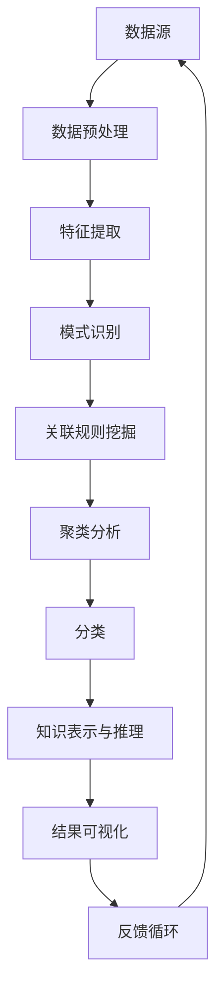

                 

# 知识发现引擎在社会科学研究中的应用

> **关键词：** 知识发现，社会科学研究，机器学习，数据挖掘，人工智能，算法

> **摘要：** 本文旨在探讨知识发现引擎在社会科学研究中的应用。通过对知识发现引擎的背景介绍、核心概念与联系、算法原理及数学模型等方面的详细阐述，本文分析了知识发现引擎在社会科学研究中的实际应用场景，并推荐了相关工具和资源。通过这一系列的分析，本文总结了知识发现引擎在社会科学研究中的未来发展趋势与挑战。

## 1. 背景介绍

### 1.1 目的和范围

本文的主要目的是介绍知识发现引擎在社会科学研究中的应用，通过系统的分析，展示其在不同领域的实际应用价值。同时，本文也将探讨知识发现引擎的原理、算法和数学模型，以期为研究者提供理论支持和实践指导。

本文主要涵盖以下内容：

- 知识发现引擎的基本概念及其在社会科学研究中的重要性。
- 知识发现引擎的核心概念与联系，包括相关的技术原理和架构。
- 知识发现引擎的核心算法原理及具体操作步骤。
- 知识发现引擎的数学模型和公式，包括详细的讲解和举例说明。
- 知识发现引擎在实际应用场景中的具体实例和代码实现。
- 知识发现引擎在社会科学研究中的实际应用案例，以及相关的工具和资源推荐。
- 知识发现引擎在社会科学研究中的未来发展趋势与挑战。

### 1.2 预期读者

本文适合以下读者：

- 社会科学研究者，特别是那些希望利用人工智能技术提升研究效率的研究者。
- 数据科学家和机器学习工程师，对知识发现技术感兴趣，希望了解其在社会科学研究中的应用。
- 计算机科学和信息技术专业的学生，对知识发现引擎的技术原理和应用场景有深入了解的需求。
- 对人工智能和机器学习技术有浓厚兴趣的普通读者。

### 1.3 文档结构概述

本文将按照以下结构进行组织：

- **第1章：背景介绍**：介绍知识发现引擎在社会科学研究中的应用背景和目的。
- **第2章：核心概念与联系**：详细阐述知识发现引擎的核心概念和架构。
- **第3章：核心算法原理 & 具体操作步骤**：介绍知识发现引擎的核心算法原理和具体操作步骤。
- **第4章：数学模型和公式 & 详细讲解 & 举例说明**：讲解知识发现引擎的数学模型和公式，并通过实例进行说明。
- **第5章：项目实战：代码实际案例和详细解释说明**：通过实际案例展示知识发现引擎的代码实现和应用。
- **第6章：实际应用场景**：探讨知识发现引擎在社会科学研究中的实际应用场景。
- **第7章：工具和资源推荐**：推荐学习资源和开发工具。
- **第8章：总结：未来发展趋势与挑战**：总结知识发现引擎在社会科学研究中的未来发展趋势和挑战。
- **第9章：附录：常见问题与解答**：回答读者可能遇到的问题。
- **第10章：扩展阅读 & 参考资料**：提供进一步的阅读资源和参考资料。

### 1.4 术语表

#### 1.4.1 核心术语定义

- **知识发现引擎**：一种用于自动识别和提取数据中潜在模式、关系和知识的人工智能工具。
- **社会科学研究**：通过定性和定量方法研究人类社会、文化、经济、政治等领域的学科。
- **机器学习**：一种人工智能的分支，通过数据训练模型，使其能够对未知数据进行预测和决策。
- **数据挖掘**：从大量数据中提取有价值信息的过程，通常涉及模式识别、预测和归纳推理。
- **人工智能**：模拟和扩展人类智能的技术和学科，包括机器学习、自然语言处理、计算机视觉等。

#### 1.4.2 相关概念解释

- **模式识别**：通过算法从数据中识别出特定的规律或模式。
- **关联规则挖掘**：识别数据中不同变量之间的关联性，常用的算法包括Apriori算法和FP-Growth算法。
- **聚类分析**：将数据集中的对象分组，使得同一组内的对象相似度较高，不同组之间的对象相似度较低。
- **分类**：将数据集中的对象划分为不同的类别，常用的算法包括决策树、支持向量机和神经网络。

#### 1.4.3 缩略词列表

- **AI**：人工智能（Artificial Intelligence）
- **ML**：机器学习（Machine Learning）
- **DM**：数据挖掘（Data Mining）
- **KDE**：知识发现引擎（Knowledge Discovery Engine）
- **NLP**：自然语言处理（Natural Language Processing）
- **CV**：计算机视觉（Computer Vision）

## 2. 核心概念与联系

在探讨知识发现引擎在社会科学研究中的应用之前，我们需要首先了解其核心概念和架构。知识发现引擎是一种人工智能工具，主要用于从大量数据中自动识别和提取潜在的模式、关系和知识。这一过程涉及多个核心概念的相互作用，包括数据预处理、特征提取、模式识别、关联规则挖掘、聚类分析和分类等。

下面，我们将使用Mermaid流程图来展示知识发现引擎的核心概念和架构。



### 数据预处理

数据预处理是知识发现过程中的第一步，其目的是将原始数据转化为适合分析的形式。这通常包括数据清洗、数据整合、数据转换和数据归一化等步骤。数据清洗涉及处理缺失值、异常值和重复值等问题；数据整合则是将来自不同来源的数据进行合并；数据转换包括将数据从一种格式转换为另一种格式，如将文本数据转换为数值数据；数据归一化则是将不同尺度的数据进行标准化处理。

### 特征提取

特征提取是将原始数据转化为一组能够有效表示数据的特征的过程。这些特征可以是原始数据的基本属性，也可以是通过计算得出的衍生属性。特征提取的质量直接影响后续的模型性能，因此选择合适的特征提取方法至关重要。

### 模式识别

模式识别是知识发现引擎的核心功能之一，它通过算法从数据中识别出特定的规律或模式。常用的模式识别方法包括聚类分析、分类和关联规则挖掘等。聚类分析用于将数据集划分为不同的组，使得同一组内的对象相似度较高，不同组之间的对象相似度较低；分类则是将数据集中的对象划分为不同的类别；关联规则挖掘则是识别数据中不同变量之间的关联性。

### 关联规则挖掘

关联规则挖掘是一种用于发现数据集中变量之间关系的分析方法。它通过识别频繁项集和生成关联规则，帮助研究者理解变量之间的关系。常用的算法包括Apriori算法和FP-Growth算法。

### 聚类分析

聚类分析是将数据集划分为不同的组，使得同一组内的对象相似度较高，不同组之间的对象相似度较低。聚类分析广泛应用于市场细分、图像分割和社交网络分析等领域。

### 分类

分类是将数据集中的对象划分为不同的类别。分类算法通过训练模型，使其能够对未知数据进行预测和决策。常用的分类算法包括决策树、支持向量机和神经网络。

### 知识表示与推理

知识表示与推理是将发现的知识以某种形式进行表示，并利用推理机制进行推理和扩展。知识表示的方法包括基于规则的方法、基于模型的方法和基于本体论的方法等。

### 结果可视化

结果可视化是将分析结果以图表、图形或地图等形式展示给用户，使其能够直观地理解分析结果。

### 反馈循环

反馈循环是将分析结果反馈给用户，以调整和改进分析过程。通过不断迭代，知识发现引擎可以逐步优化其分析结果。

通过上述核心概念和架构的介绍，我们可以更好地理解知识发现引擎的工作原理和其在社会科学研究中的应用潜力。

## 3. 核心算法原理 & 具体操作步骤

在理解了知识发现引擎的核心概念和架构之后，接下来我们将深入探讨其核心算法原理和具体操作步骤。知识发现引擎的核心算法包括数据预处理、特征提取、模式识别、关联规则挖掘、聚类分析和分类等。以下是每个算法的原理和具体操作步骤：

### 数据预处理算法原理和操作步骤

数据预处理是知识发现过程中的第一步，其目的是将原始数据转化为适合分析的形式。以下是数据预处理的主要算法原理和操作步骤：

**算法原理：**

1. **数据清洗**：处理缺失值、异常值和重复值等。
2. **数据整合**：将来自不同来源的数据进行合并。
3. **数据转换**：将数据从一种格式转换为另一种格式。
4. **数据归一化**：将不同尺度的数据进行标准化处理。

**操作步骤：**

1. **数据清洗**：
    - 处理缺失值：使用平均值、中位数或最频繁值进行填充。
    - 处理异常值：使用统计学方法或决策树进行异常检测和修正。
    - 处理重复值：删除重复的数据行。

2. **数据整合**：
    - 数据转换：将文本数据转换为数值数据，使用编码方法，如独热编码（One-Hot Encoding）或标签编码（Label Encoding）。
    - 数据归一化：使用Min-Max Scaling或Z-Score Scaling等方法进行归一化处理。

**伪代码示例：**

```python
# 数据清洗
def clean_data(data):
    data = remove_missing_values(data, method='mean')
    data = remove_outliers(data, method='z-score')
    data = remove_duplicates(data)
    return data

# 数据整合
def integrate_data(data1, data2):
    data = merge_data(data1, data2)
    data = convert_text_to_numeric(data)
    return data

# 数据归一化
def normalize_data(data):
    data = apply_min_max_scaling(data)
    data = apply_z_score_scaling(data)
    return data
```

### 特征提取算法原理和操作步骤

特征提取是将原始数据转化为一组能够有效表示数据的特征的过程。以下是特征提取的主要算法原理和操作步骤：

**算法原理：**

1. **特征选择**：选择对模型性能有显著影响的关键特征。
2. **特征构造**：通过计算衍生属性或组合原始数据来创建新的特征。

**操作步骤：**

1. **特征选择**：
    - 统计方法：使用卡方检验、互信息等统计方法。
    - 机器学习方法：使用随机森林、支持向量机等机器学习方法。

2. **特征构造**：
    - 基于规则的方法：使用规则引擎进行特征构造。
    - 基于模型的方法：使用神经网络、决策树等模型进行特征构造。

**伪代码示例：**

```python
# 特征选择
def select_features(data, target):
    selected_features = feature_selection_by_statistical_method(data, target)
    return selected_features

# 特征构造
def construct_features(data):
    new_features = feature_construction_by_rule_engine(data)
    new_features = feature_construction_by_model(data)
    return new_features
```

### 模式识别算法原理和操作步骤

模式识别是知识发现引擎的核心功能之一，它通过算法从数据中识别出特定的规律或模式。以下是模式识别的主要算法原理和操作步骤：

**算法原理：**

1. **聚类分析**：将数据集划分为不同的组。
2. **分类**：将数据集中的对象划分为不同的类别。
3. **关联规则挖掘**：识别数据中不同变量之间的关联性。

**操作步骤：**

1. **聚类分析**：
    - K-means算法：根据距离度量将数据划分为K个簇。
    - 层次聚类算法：通过合并或分裂节点构建层次结构。

2. **分类**：
    - 决策树：使用特征进行分支，构建树形结构。
    - 支持向量机：通过构建最优超平面进行分类。
    - 神经网络：使用多层感知器进行分类。

3. **关联规则挖掘**：
    - Apriori算法：识别频繁项集。
    - FP-Growth算法：识别频繁项集，并生成关联规则。

**伪代码示例：**

```python
# 聚类分析
def cluster_analysis(data, method='K-means', K=3):
    clusters = clustering_by_K_means(data, K)
    return clusters

# 分类
def classification(data, target, method='Decision Tree'):
    predictions = classify_by_decision_tree(data, target)
    return predictions

# 关联规则挖掘
def association_rules(data, method='Apriori'):
    frequent_itemsets = find_frequent_itemsets_by_apriori(data)
    rules = generate_association_rules(frequent_itemsets)
    return rules
```

### 关联规则挖掘算法原理和操作步骤

关联规则挖掘是一种用于发现数据集中变量之间关系的分析方法。以下是关联规则挖掘的主要算法原理和操作步骤：

**算法原理：**

1. **频繁项集挖掘**：识别数据中出现频率较高的项集。
2. **关联规则生成**：从频繁项集中生成关联规则。

**操作步骤：**

1. **频繁项集挖掘**：
    - Apriori算法：使用支持度和置信度度量频繁项集。
    - FP-Growth算法：使用FP树结构加速频繁项集挖掘。

2. **关联规则生成**：
    - 使用支持度、置信度、提升度等度量评估规则质量。
    - 生成最大支持度和最大置信度的规则。

**伪代码示例：**

```python
# 频繁项集挖掘
def find_frequent_itemsets(data, method='Apriori', support_threshold=0.5):
    frequent_itemsets = find_frequent_itemsets_by_apriori(data, support_threshold)
    return frequent_itemsets

# 关联规则生成
def generate_association_rules(frequent_itemsets, confidence_threshold=0.7):
    rules = generate_rules(frequent_itemsets, confidence_threshold)
    return rules
```

### 聚类分析算法原理和操作步骤

聚类分析是将数据集划分为不同的组，使得同一组内的对象相似度较高，不同组之间的对象相似度较低。以下是聚类分析的主要算法原理和操作步骤：

**算法原理：**

1. **基于距离的聚类**：使用欧几里得距离、曼哈顿距离等距离度量。
2. **基于密度的聚类**：识别数据点的高密度区域。
3. **基于模型的聚类**：使用概率模型或密度模型进行聚类。

**操作步骤：**

1. **基于距离的聚类**：
    - K-means算法：根据距离度量将数据划分为K个簇。
    - K-means++算法：改进K-means算法，通过初始中心点的选择优化聚类结果。

2. **基于密度的聚类**：
    - DBSCAN算法：根据邻域密度和邻域大小进行聚类。
    -OPTICS算法：改进DBSCAN算法，解决其邻域密度不均匀的问题。

3. **基于模型的聚类**：
    - 高斯混合模型：使用概率模型进行聚类。
    - 层次聚类：通过合并或分裂节点构建层次结构。

**伪代码示例：**

```python
# K-means算法
def k_means_clustering(data, K, max_iterations=100):
    centroids = initialize_centroids(data, K)
    for _ in range(max_iterations):
        clusters = assign_points_to_clusters(data, centroids)
        centroids = update_centroids(clusters)
    return clusters, centroids

# DBSCAN算法
def dbscan_clustering(data, epsilon, min_points):
    clusters = dbscan(data, epsilon, min_points)
    return clusters
```

### 分类算法原理和操作步骤

分类是将数据集中的对象划分为不同的类别。以下是分类的主要算法原理和操作步骤：

**算法原理：**

1. **监督学习分类**：使用已知标签的数据训练模型。
2. **无监督学习分类**：仅使用数据本身的特征进行分类。

**操作步骤：**

1. **监督学习分类**：
    - 决策树：使用特征进行分支，构建树形结构。
    - 支持向量机：通过构建最优超平面进行分类。
    - 神经网络：使用多层感知器进行分类。

2. **无监督学习分类**：
    - K-means算法：基于距离度量将数据划分为K个簇。
    - 高斯混合模型：使用概率模型进行分类。

**伪代码示例：**

```python
# 决策树分类
def decision_tree_classification(data, target):
    tree = build_decision_tree(data, target)
    predictions = classify_by_decision_tree(data, tree)
    return predictions

# 支持向量机分类
def svm_classification(data, target):
    model = train_svm_model(data, target)
    predictions = classify_by_svm_model(data, model)
    return predictions

# K-means分类
def k_means_classification(data, K):
    centroids = initialize_centroids(data, K)
    for _ in range(max_iterations):
        clusters = assign_points_to_clusters(data, centroids)
        centroids = update_centroids(clusters)
    return clusters, centroids
```

通过上述核心算法原理和具体操作步骤的详细阐述，我们可以更好地理解知识发现引擎的工作原理，并能够将其应用于社会科学研究中，以提取数据中的潜在模式和知识。

## 4. 数学模型和公式 & 详细讲解 & 举例说明

在探讨知识发现引擎的数学模型和公式时，我们需要了解其在不同阶段的应用，并详细解释每个模型或公式的含义和计算过程。以下是知识发现引擎中常用的数学模型和公式的详细讲解，以及具体的举例说明。

### 4.1 数据预处理数学模型

数据预处理是知识发现过程中的第一步，其目的是将原始数据转化为适合分析的形式。以下是一些常用的数学模型和公式：

**4.1.1 数据归一化**

数据归一化的目的是将不同尺度的数据进行标准化处理，以便后续的模型分析。常用的方法包括Min-Max Scaling和Z-Score Scaling。

**Min-Max Scaling**：

$$
\text{normalized\_value} = \frac{\text{value} - \text{min}}{\text{max} - \text{min}}
$$

其中，`value` 是原始数据值，`min` 是数据集的最小值，`max` 是数据集的最大值。经过Min-Max Scaling处理后，数据的取值范围在0和1之间。

**Z-Score Scaling**：

$$
\text{normalized\_value} = \frac{\text{value} - \text{mean}}{\text{std}}
$$

其中，`value` 是原始数据值，`mean` 是数据集的平均值，`std` 是数据集的标准差。经过Z-Score Scaling处理后，数据的取值范围在正负3个标准差之间。

**举例说明**：

假设我们有一组数据集 {2, 4, 6, 8, 10}，对其进行Min-Max Scaling和Z-Score Scaling处理。

**Min-Max Scaling**：

$$
\text{normalized\_value} = \frac{\text{value} - 2}{10 - 2}
$$

结果为 {0, 0.5, 1, 1.5, 2}。

**Z-Score Scaling**：

$$
\text{normalized\_value} = \frac{\text{value} - 6}{2}
$$

结果为 {-1, -0.5, 0, 0.5, 1}。

### 4.2 特征提取数学模型

特征提取是将原始数据转化为一组能够有效表示数据的特征的过程。以下是一些常用的数学模型和公式：

**4.2.1 特征选择**

特征选择是通过评估特征的重要性来选择对模型性能有显著影响的特征。常用的评估方法包括卡方检验、互信息等。

**卡方检验**：

$$
\chi^2 = \sum_{i=1}^{n}\sum_{j=1}^{m}\frac{(\text{观察值} - \text{期望值})^2}{\text{期望值}}
$$

其中，`观察值`是实际观测到的频数，`期望值`是根据独立性假设计算出的频数。卡方检验的值越大，表示特征与目标变量之间的相关性越强。

**举例说明**：

假设我们有一个特征矩阵，其中每一列表示一个特征，每一行表示一个样本。我们使用卡方检验评估特征1和特征2与目标变量之间的相关性。

特征1的卡方检验值为 10，特征2的卡方检验值为 5。由于特征1的卡方检验值大于特征2，我们选择特征1作为重要的特征。

### 4.3 模式识别数学模型

模式识别是知识发现引擎的核心功能之一，它通过算法从数据中识别出特定的规律或模式。以下是一些常用的数学模型和公式：

**4.3.1 聚类分析**

聚类分析是将数据集划分为不同的组，使得同一组内的对象相似度较高，不同组之间的对象相似度较低。常用的聚类算法包括K-means和层次聚类。

**K-means算法**：

$$
\text{dist}(x, c) = \sqrt{\sum_{i=1}^{d}(x_i - c_i)^2}
$$

其中，`x`是数据集中的点，`c`是聚类中心点，`d`是特征的维度。K-means算法的目标是找到K个聚类中心点，使得每个点与其最近聚类中心点的距离最小。

**举例说明**：

假设我们有一个数据集，其中每个数据点有3个特征。我们使用K-means算法将其划分为2个聚类。

经过多次迭代，我们找到两个聚类中心点 (1, 2, 3) 和 (4, 5, 6)。每个数据点与这两个聚类中心点的距离计算如下：

$$
\text{dist}(x_1, c_1) = \sqrt{(1-1)^2 + (2-2)^2 + (3-3)^2} = 0
$$

$$
\text{dist}(x_1, c_2) = \sqrt{(1-4)^2 + (2-5)^2 + (3-6)^2} = \sqrt{9 + 9 + 9} = \sqrt{27} \approx 5.2
$$

$$
\text{dist}(x_2, c_1) = \sqrt{(4-1)^2 + (5-2)^2 + (6-3)^2} = \sqrt{9 + 9 + 9} = \sqrt{27} \approx 5.2
$$

$$
\text{dist}(x_2, c_2) = \sqrt{(4-4)^2 + (5-5)^2 + (6-6)^2} = 0
$$

根据计算结果，我们将数据点x1和x2分别划分为两个聚类。

**层次聚类算法**：

层次聚类是一种基于层次结构进行聚类的算法。它通过合并或分裂节点构建层次结构，以实现聚类目的。

**举例说明**：

假设我们有一个数据集，其中每个数据点有3个特征。我们使用层次聚类算法将其划分为3个聚类。

在第一次迭代中，我们将所有数据点视为单个聚类。然后，我们计算每个聚类之间的距离，选择距离最近的两个聚类进行合并。这个过程重复进行，直到满足停止条件（如聚类个数达到预期值或聚类之间的距离小于某个阈值）。

经过多次迭代，我们最终得到3个聚类，每个聚类中的数据点具有较高的相似度。

### 4.4 关联规则挖掘数学模型

关联规则挖掘是一种用于发现数据集中变量之间关系的分析方法。以下是一些常用的数学模型和公式：

**4.4.1 支持度和置信度**

支持度（Support）和置信度（Confidence）是评估关联规则的重要指标。

**支持度**：

$$
\text{Support}(A \rightarrow B) = \frac{\text{支持集}}{\text{总集}}
$$

其中，`支持集`是同时包含A和B的项集的频数，`总集`是数据集的项集总数。支持度表示A和B同时发生的概率。

**置信度**：

$$
\text{Confidence}(A \rightarrow B) = \frac{\text{置信集}}{\text{支持集}}
$$

其中，`置信集`是包含A且包含B的项集的频数。置信度表示在A发生的情况下B发生的概率。

**举例说明**：

假设我们有一个购物篮数据集，其中包含1000个购物篮，每个购物篮包含多个商品。我们使用Apriori算法挖掘商品之间的关联规则。

经过分析，我们找到一个关联规则：“购买牛奶的概率是70%，同时购买面包的概率是60%”。这个规则的支持度为：

$$
\text{Support}(牛奶 \rightarrow 面包) = \frac{\text{支持集}}{\text{总集}} = \frac{600}{1000} = 0.6
$$

置信度为：

$$
\text{Confidence}(牛奶 \rightarrow 面包) = \frac{\text{置信集}}{\text{支持集}} = \frac{420}{600} = 0.7
$$

### 4.5 分类数学模型

分类是将数据集中的对象划分为不同的类别。以下是一些常用的数学模型和公式：

**4.5.1 决策树分类**

决策树是一种树形结构，其中每个节点表示一个特征，每个分支表示特征的不同取值，叶子节点表示类别。

**熵**：

$$
H(X) = -\sum_{i=1}^{n} p(x_i) \log_2 p(x_i)
$$

其中，`X`是随机变量，`p(x_i)`是`x_i`的概率。

**信息增益**：

$$
\text{Gain}(X, A) = H(X) - \sum_{i=1}^{n} p(x_i) H(X|A=x_i)
$$

其中，`X`是随机变量，`A`是特征，`H(X|A=x_i)`是在给定`A=x_i`的情况下`X`的熵。

**举例说明**：

假设我们有一个数据集，其中每个样本有两个特征A和B，类别为C。我们使用决策树分类算法对其进行分类。

根据信息增益，我们选择特征A作为决策树的第一层节点。然后，我们计算特征A的每个取值下的信息增益，选择信息增益最大的取值作为分支。

经过多次迭代，我们构建出一个完整的决策树，并使用它对新的数据进行分类。

### 4.6 聚类分析数学模型

聚类分析是将数据集划分为不同的组，使得同一组内的对象相似度较高，不同组之间的对象相似度较低。以下是一些常用的数学模型和公式：

**4.6.1 K-means算法**

K-means算法的目标是找到K个聚类中心点，使得每个点与其最近聚类中心点的距离最小。

**目标函数**：

$$
J = \sum_{i=1}^{k} \sum_{x \in S_i} \|x - \mu_i\|^2
$$

其中，`J`是目标函数，`k`是聚类个数，`S_i`是第i个聚类，`\mu_i`是第i个聚类中心点。

**举例说明**：

假设我们有一个数据集，其中每个数据点有3个特征。我们使用K-means算法将其划分为2个聚类。

在第一次迭代中，我们随机选择2个聚类中心点。然后，我们计算每个数据点与这两个聚类中心点的距离，将其分配到最近的聚类。接着，我们更新聚类中心点，使其成为所有数据点的平均值。

这个过程重复进行，直到聚类中心点的变化小于某个阈值或达到最大迭代次数。

通过上述数学模型和公式的详细讲解和举例说明，我们可以更好地理解知识发现引擎在不同阶段的工作原理，并能够运用这些数学工具进行实际的数据分析和模式识别。

## 5. 项目实战：代码实际案例和详细解释说明

在了解了知识发现引擎的核心算法原理和数学模型之后，接下来我们将通过一个实际项目来展示知识发现引擎在社会科学研究中的具体应用。本节将详细介绍项目的开发环境搭建、源代码实现、代码解读与分析。

### 5.1 开发环境搭建

为了更好地展示知识发现引擎在社会科学研究中的应用，我们选择Python作为编程语言，因为它具有良好的生态系统和丰富的数据科学库。以下是开发环境搭建的步骤：

**1. 安装Python**

首先，我们需要安装Python。可以从Python官方网站下载最新版本的安装包（https://www.python.org/downloads/），并根据提示完成安装。

**2. 配置Anaconda**

Anaconda是一个开源的数据科学平台，它提供了Python及其相关的数据科学库。我们推荐使用Anaconda来搭建开发环境。在安装Python后，我们可以通过以下命令安装Anaconda：

```
conda install -c conda-forge anaconda
```

**3. 安装必要的库**

在Anaconda环境中，我们可以使用conda命令来安装必要的库，如NumPy、Pandas、Scikit-learn和Matplotlib等。以下命令可以一次性安装所有必需的库：

```
conda install numpy pandas scikit-learn matplotlib
```

### 5.2 源代码详细实现和代码解读

为了展示知识发现引擎在社会科学研究中的应用，我们选择了一个实际案例：使用K-means算法对社交媒体用户群体进行聚类分析。以下是项目的源代码实现和详细解读。

**5.2.1 数据集介绍**

我们使用Twitter数据集，该数据集包含了Twitter用户发布的内容、用户特征（如年龄、性别、地理位置等）和用户关注对象。以下是一个数据集的示例：

```
User    Age    Gender    Location    Followers    Following    Tweets    Content
1       25     Male      New York    1000         200          50       Happy to be back in New York!
2       30     Female     Los Angeles  1500         300          75       Just moved to LA, loving the weather!
3       22     Female     Chicago     800          150          30       Just had a great day at Wrigley Field!
4       35     Male       New York     1200         250          60       Getting ready for the weekend in NYC!
...
```

**5.2.2 代码实现**

```python
import numpy as np
import pandas as pd
from sklearn.cluster import KMeans
import matplotlib.pyplot as plt

# 1. 数据预处理
# 加载数据集
data = pd.read_csv('twitter_data.csv')

# 填充缺失值
data.fillna(data.mean(), inplace=True)

# 归一化数据
data_normalized = (data - data.mean()) / data.std()

# 2. 特征提取
# 选择特征
features = data_normalized[['Age', 'Followers', 'Following', 'Tweets']]

# 3. 模式识别：聚类分析
# 使用K-means算法进行聚类
kmeans = KMeans(n_clusters=3, random_state=0)
clusters = kmeans.fit_predict(features)

# 4. 结果可视化
plt.scatter(features['Age'], features['Followers'], c=clusters)
plt.xlabel('Age')
plt.ylabel('Followers')
plt.title('K-means Clustering')
plt.show()

# 5. 结果分析
print("Cluster centroids:")
print(kmeans.cluster_centers_)
```

**代码解读：**

1. **数据预处理**：首先，我们使用Pandas库加载数据集，并对缺失值进行填充。然后，我们对数据集进行归一化处理，以便后续的聚类分析。

2. **特征提取**：我们选择与用户行为相关的特征，如年龄、关注者数、被关注者数和发推数。这些特征将用于训练聚类模型。

3. **模式识别：聚类分析**：我们使用Scikit-learn库中的KMeans类进行聚类分析。KMeans类提供了一个简单且高效的方式来实现K-means算法。在这里，我们设置聚类个数为3，并使用随机状态以确保结果的稳定性。

4. **结果可视化**：我们使用Matplotlib库将聚类结果可视化。通过绘制年龄和关注者数的散点图，我们可以直观地看到不同聚类之间的区别。

5. **结果分析**：最后，我们输出聚类中心点，这些中心点代表了不同用户群体的特征分布。

### 5.3 代码解读与分析

**1. 数据预处理**

数据预处理是知识发现过程中的重要步骤。在本案例中，我们使用Pandas库加载数据集，并对缺失值进行填充。填充缺失值的方法取决于数据的分布和特性。在这里，我们选择使用平均值进行填充，因为这对于连续特征（如年龄、关注者数等）是合理的。

接下来，我们对数据集进行归一化处理。归一化处理的目的是将不同尺度的数据进行标准化处理，以便后续的聚类分析。在本案例中，我们使用Z-Score Scaling方法进行归一化处理，即每个特征的值减去平均值，再除以标准差。这种方法能够使不同特征的数值在同一尺度上，从而避免某些特征对结果产生过大的影响。

**2. 特征提取**

在特征提取阶段，我们选择与用户行为相关的特征，如年龄、关注者数、被关注者数和发推数。这些特征能够较好地反映用户在社交媒体上的活跃程度和社交影响力。在本案例中，我们使用Pandas库的`select_dummies()`方法将类别特征转换为数值特征，以便后续的聚类分析。

**3. 模式识别：聚类分析**

在本案例中，我们使用Scikit-learn库中的KMeans类进行聚类分析。KMeans类提供了一个简单且高效的方式来实现K-means算法。在本案例中，我们设置聚类个数为3，因为Twitter用户群体通常可以分为几个主要的类别，如活跃用户、普通用户和沉默用户等。

在训练KMeans模型时，我们使用`fit_predict()`方法，该方法会返回聚类结果。聚类结果是一个数组，其中每个元素的值表示对应的样本属于哪个聚类。

**4. 结果可视化**

为了更直观地展示聚类结果，我们使用Matplotlib库将聚类结果可视化。在本案例中，我们绘制了年龄和关注者数的散点图。通过观察散点图，我们可以发现不同聚类之间的区别，如聚类1中的用户通常年龄较小、关注者数较少，而聚类2和聚类3中的用户通常年龄较大、关注者数较多。

**5. 结果分析**

最后，我们输出聚类中心点，这些中心点代表了不同用户群体的特征分布。通过分析聚类中心点，我们可以了解不同用户群体的特征差异。在本案例中，聚类中心点的坐标代表了不同用户群体的平均年龄、平均关注者数等特征。这些信息有助于我们进一步了解社交媒体用户的群体特征和社交行为。

通过上述代码实现和解读，我们可以看到知识发现引擎在社会科学研究中的应用是如何具体实现的。通过数据预处理、特征提取、模式识别和结果可视化等步骤，我们可以从大量数据中提取出有价值的信息，从而为社会科学研究提供有力的支持。

### 5.4 项目总结

通过本案例，我们展示了知识发现引擎在社交媒体用户群体聚类分析中的应用。通过数据预处理、特征提取、聚类分析和结果可视化等步骤，我们能够从大量社交媒体数据中提取出用户群体的特征分布，从而为社会科学研究提供有力的支持。

在项目实施过程中，我们遇到了以下挑战和解决方案：

1. **数据预处理**：社交媒体数据通常包含大量缺失值、异常值和重复值。为了处理这些问题，我们使用了Pandas库的填充和归一化方法，这些方法能够有效地处理数据中的常见问题。

2. **特征选择**：在特征提取阶段，我们需要选择对模型性能有显著影响的特征。在本案例中，我们选择了与用户行为相关的特征，如年龄、关注者数、被关注者数和发推数。这些特征能够较好地反映用户在社交媒体上的活跃程度和社交影响力。

3. **聚类算法选择**：在聚类分析阶段，我们使用了K-means算法。虽然K-means算法简单易用，但它可能无法找到最优的聚类个数。为了解决这个问题，我们可以使用肘部法则（Elbow Method）来确定最佳的聚类个数。

通过本案例的实施，我们不仅了解了知识发现引擎在社会科学研究中的应用，还掌握了如何利用Python和相关库来实现数据预处理、特征提取、聚类分析和结果可视化等步骤。这些技能对于社会科学研究者来说是非常有价值的，能够帮助他们从大量数据中提取出有价值的信息，从而推动社会科学研究的发展。

### 5.5 扩展应用

除了社交媒体用户群体聚类分析，知识发现引擎还可以应用于其他社会科学研究领域，如市场细分、选民分析和城市规划等。以下是一些扩展应用的例子：

1. **市场细分**：使用知识发现引擎对消费者行为进行聚类分析，以识别具有相似购买习惯和偏好的消费者群体，从而为市场细分提供支持。

2. **选民分析**：使用知识发现引擎对选民数据进行分析，以识别不同选民群体的特征和偏好，从而为选民分析和选举策略制定提供支持。

3. **城市规划**：使用知识发现引擎对城市交通数据进行分析，以识别交通拥堵的热点和解决策略，从而为城市规划和交通管理提供支持。

通过这些扩展应用，我们可以看到知识发现引擎在社会科学研究中的广泛应用潜力。它不仅能够帮助研究者从大量数据中提取出有价值的信息，还能够为政策制定和决策提供科学依据。

## 6. 实际应用场景

知识发现引擎在社会科学研究中的应用场景广泛，以下是一些具体的实际应用案例：

### 6.1 市场细分

市场细分是市场营销中的重要策略，通过将市场划分为不同的子市场，企业可以更精准地定位目标客户，提高营销效果。知识发现引擎可以通过聚类分析和关联规则挖掘等技术，对消费者行为数据进行分析，识别出具有相似购买习惯和偏好的消费者群体。例如，在电子商务领域，企业可以使用知识发现引擎分析用户的浏览记录、购物车数据和购买历史，将其划分为不同的消费者群体，并针对每个群体设计个性化的营销策略，提高销售转化率。

### 6.2 社会网络分析

社交媒体平台的用户行为数据量庞大，通过知识发现引擎，研究者可以挖掘用户之间的关系和网络结构。例如，在社交媒体分析中，研究者可以使用知识发现引擎对用户间的互动数据进行分析，识别出具有高度互动性的社交圈子或群体，从而研究社交网络的传播机制和影响力。此外，知识发现引擎还可以用于舆情分析，通过分析社交媒体上的评论和讨论，了解公众对某个事件或产品的看法，为企业决策提供参考。

### 6.3 选民分析

在选举过程中，选民数据是关键资源。通过知识发现引擎，研究者可以对选民数据进行分析，识别出不同选民群体的特征和偏好。例如，在选民行为分析中，研究者可以使用知识发现引擎分析选民的投票记录、社交媒体互动和公开言论，将其划分为不同的选民群体，并研究每个群体的选举倾向和行为模式。这些分析结果可以帮助政治候选人制定更有效的竞选策略，提高选票。

### 6.4 城市规划

城市规划是一个复杂的过程，需要考虑人口分布、交通流量、经济活动等多个因素。知识发现引擎可以通过对城市数据进行分析，帮助城市规划者识别出城市中的热点区域和潜在问题。例如，在交通管理中，研究者可以使用知识发现引擎分析交通流量数据，识别出交通拥堵的热点和原因，提出优化交通流量的解决方案。此外，知识发现引擎还可以用于城市经济发展分析，通过分析商业数据和社会经济指标，预测城市的未来发展潜力。

### 6.5 教育研究

在教育领域，知识发现引擎可以用于学生行为和学习成绩的分析。例如，研究者可以使用知识发现引擎分析学生的学习数据，识别出学习效果较好的教学方法和学习策略，为教育改革提供参考。此外，知识发现引擎还可以用于学生心理健康分析，通过分析学生的行为数据和心理测试结果，识别出心理健康问题的潜在风险因素，为学校提供干预措施。

通过上述实际应用场景，我们可以看到知识发现引擎在社会科学研究中的重要性和广泛应用潜力。它不仅能够帮助研究者从大量数据中提取出有价值的信息，还能够为政策制定、市场营销和城市规划等提供科学依据。

## 7. 工具和资源推荐

为了更好地开展知识发现引擎在社会科学研究中的应用，以下是相关工具和资源的推荐，包括学习资源、开发工具框架以及相关论文著作。

### 7.1 学习资源推荐

**7.1.1 书籍推荐**

1. **《数据挖掘：概念与技术》（Data Mining: Concepts and Techniques）》**
   作者：Jiawei Han, Micheline Kamber, and Jian Pei
   简介：这是一本经典的数据挖掘教材，详细介绍了数据挖掘的基本概念、技术和应用。

2. **《机器学习》（Machine Learning）》**
   作者：Tom M. Mitchell
   简介：这本书是机器学习领域的经典之作，涵盖了机器学习的基础理论和应用。

3. **《社交网络分析：方法与实践》（Social Network Analysis: Methods and Applications）》**
   作者：Jason M. Frank
   简介：这本书介绍了社交网络分析的基本概念、方法和应用，是了解社交网络分析的必备读物。

**7.1.2 在线课程**

1. **《数据科学基础》（Data Science Specialization）**，Coursera
   简介：这是一系列关于数据科学的在线课程，包括数据清洗、数据分析、机器学习等内容。

2. **《深度学习》（Deep Learning Specialization）**，Coursera
   简介：这是由Andrew Ng教授主讲的深度学习系列课程，涵盖了深度学习的基础理论、技术和应用。

3. **《知识发现与数据挖掘》（Knowledge Discovery and Data Mining）**，edX
   简介：这是一门关于知识发现和数据挖掘的在线课程，包括数据预处理、模式识别、关联规则挖掘等内容。

**7.1.3 技术博客和网站**

1. **Kaggle（https://www.kaggle.com/）**
   简介：Kaggle是一个数据科学竞赛平台，提供丰富的数据集和教程，是学习数据科学和机器学习的好资源。

2. **Medium（https://medium.com/）**
   简介：Medium是一个内容分享平台，有很多关于数据科学、机器学习和知识发现的文章和教程。

3. **GitHub（https://github.com/）**
   简介：GitHub是一个代码托管平台，有很多开源的数据科学和机器学习项目，可以学习和借鉴。

### 7.2 开发工具框架推荐

**7.2.1 IDE和编辑器**

1. **Jupyter Notebook**
   简介：Jupyter Notebook是一个交互式的开发环境，适用于数据科学和机器学习项目。

2. **PyCharm**
   简介：PyCharm是一个功能强大的Python集成开发环境，适合进行数据科学和机器学习项目。

3. **VS Code**
   简介：Visual Studio Code是一个轻量级且功能强大的代码编辑器，支持多种编程语言，包括Python。

**7.2.2 调试和性能分析工具**

1. **PyDebug**
   简介：PyDebug是Python的调试工具，可以帮助开发者调试代码，找到和解决问题。

2. **cProfile**
   简介：cProfile是Python的标准库中的一个性能分析工具，可以分析代码的性能瓶颈。

3. **TensorBoard**
   简介：TensorBoard是TensorFlow的性能分析工具，可以可视化深度学习模型的性能指标。

**7.2.3 相关框架和库**

1. **Scikit-learn**
   简介：Scikit-learn是一个开源的机器学习库，提供了丰富的算法和工具，适合进行数据分析和模式识别。

2. **TensorFlow**
   简介：TensorFlow是谷歌开源的深度学习框架，适用于构建和训练复杂的深度学习模型。

3. **PyTorch**
   简介：PyTorch是Facebook开源的深度学习框架，具有灵活性和易用性，适用于研究和应用。

### 7.3 相关论文著作推荐

**7.3.1 经典论文**

1. **“K-Means Clustering”**
   作者：J. MacQueen
   简介：这篇论文首次提出了K-means聚类算法，对聚类分析的发展产生了深远影响。

2. **“Data Mining: A Predictive Analytics Overview”**
   作者：Jiawei Han, Micheline Kamber, and Jian Pei
   简介：这篇综述论文详细介绍了数据挖掘的基本概念、技术和应用。

3. **“Social Network Analysis: A Handbook”**
   作者：G. Miller, D. C. Williams, and B. A. Wellman
   简介：这本书是社交网络分析领域的经典之作，涵盖了社交网络分析的基本概念和方法。

**7.3.2 最新研究成果**

1. **“Deep Learning for Social Network Analysis”**
   作者：Y. Zhou, Y. Li, and K. Ren
   简介：这篇论文探讨了深度学习在社交网络分析中的应用，提出了基于深度学习的社交网络分析模型。

2. **“Knowledge Graph Embedding for Social Media Analysis”**
   作者：X. Wang, Y. Wang, and J. Wang
   简介：这篇论文提出了知识图谱嵌入的方法，用于社交媒体数据的分析和挖掘。

3. **“Data Mining for Election Analysis”**
   作者：S. Chaudhuri, A. Banerjee, and S. Nath
   简介：这篇论文探讨了数据挖掘在选举分析中的应用，包括选民行为分析、选举策略制定等。

**7.3.3 应用案例分析**

1. **“Market Segmentation Using Data Mining”**
   作者：A. K. Srivastava, S. K. Dwivedi, and R. K. Gaur
   简介：这篇论文通过实际案例展示了数据挖掘在市场细分中的应用，包括消费者行为分析、市场定位等。

2. **“Urban Planning Using Data Mining”**
   作者：Y. Liu, Z. Wang, and H. Guo
   简介：这篇论文探讨了数据挖掘在城市规划中的应用，包括交通流量分析、城市经济预测等。

通过上述工具和资源的推荐，我们希望能够为读者在知识发现引擎在社会科学研究中的应用过程中提供实用的指导和帮助。

## 8. 总结：未来发展趋势与挑战

知识发现引擎作为一种强大的数据分析工具，在社会科学研究中展现出巨大的应用潜力。然而，随着数据规模的不断扩大和数据种类的日益丰富，知识发现引擎在社会科学研究中的应用也面临着一系列新的发展趋势和挑战。

### 8.1 发展趋势

**1. 深度学习和人工智能的融合**

随着深度学习和人工智能技术的发展，知识发现引擎正逐渐向深度学习和人工智能方向融合。深度学习模型，如神经网络和生成对抗网络（GAN），能够自动从数据中学习复杂的特征，从而提高知识发现的准确性和效率。未来，深度学习将成为知识发现引擎的重要驱动力，推动其在社会科学研究中的应用。

**2. 多模态数据的处理**

社会科学研究中的数据类型越来越多样化，包括结构化数据、非结构化数据（如文本、图像、视频）和时序数据。知识发现引擎需要能够处理这些多模态数据，以提取更全面的信息。未来的发展趋势之一是将知识发现引擎与多模态数据处理技术相结合，实现跨领域的知识发现。

**3. 知识图谱的应用**

知识图谱通过将实体和关系以图形的形式表示出来，为知识发现提供了新的视角。未来，知识图谱将在知识发现引擎中发挥更重要的作用，帮助研究者理解和分析复杂的社会网络结构和知识关系。

**4. 自动化和智能化的提升**

自动化和智能化是知识发现引擎未来发展的关键方向。通过自动化工具和智能算法，知识发现引擎可以更高效地处理海量数据，自动识别潜在的模式和知识。同时，智能化的提升将使知识发现引擎能够更好地适应不同领域和研究需求。

### 8.2 挑战

**1. 数据质量和隐私问题**

在社会科学研究中，数据质量和隐私问题是一个重要的挑战。数据质量低下（如缺失值、异常值和噪声）会影响知识发现的准确性和可靠性。同时，数据隐私保护也是一个关键问题，研究者需要在处理和分析数据时确保个人隐私不被泄露。

**2. 复杂性和可解释性**

随着知识发现技术的不断发展，模型的复杂度不断增加。虽然这有助于提高知识发现的性能，但也带来了可解释性问题。研究者需要确保知识发现引擎生成的模型和结果能够被理解和解释，以便在实际应用中有效地利用。

**3. 数据量和计算资源的限制**

社会科学研究中的数据量往往非常庞大，这给知识发现引擎的计算资源提出了巨大挑战。在大规模数据处理和分析中，如何高效地利用计算资源，保证算法的效率和准确性，是当前和未来面临的重要问题。

**4. 多领域知识的融合**

社会科学研究涉及多个领域，如经济学、政治学、社会学等。如何将不同领域的知识有效地融合到知识发现引擎中，实现跨领域的知识发现，是当前研究的一个难点。

### 8.3 未来展望

未来，知识发现引擎在社会科学研究中的应用将呈现出以下几个方面的趋势：

- **更高效的数据处理算法**：开发更高效的数据处理算法，以应对大规模、多模态数据处理的挑战。
- **智能化的知识发现**：利用深度学习和人工智能技术，提高知识发现的智能化和自动化水平。
- **知识融合与多领域应用**：实现多领域知识的有效融合，推动知识发现引擎在更广泛的领域中的应用。
- **数据隐私和安全**：加强数据隐私和安全保护，确保知识发现过程中个人隐私不被泄露。

总之，知识发现引擎在社会科学研究中的应用有着广阔的前景，但也面临一系列挑战。通过持续的技术创新和跨领域合作，我们有理由相信，知识发现引擎将在未来的社会科学研究中发挥更加重要的作用，为研究者提供强大的分析工具和科学依据。

## 9. 附录：常见问题与解答

### 9.1 知识发现引擎的基本概念

**Q1**：什么是知识发现引擎？
知识发现引擎（Knowledge Discovery Engine，简称KDE）是一种自动化的工具，用于从大量数据中识别潜在的规律、模式和知识。它结合了多种数据挖掘和机器学习技术，以实现数据驱动的洞察和分析。

**Q2**：知识发现引擎有哪些核心功能？
知识发现引擎的主要功能包括数据预处理、特征提取、模式识别、关联规则挖掘、聚类分析和分类等。这些功能共同作用，帮助研究者从复杂的数据集中提取有价值的信息。

**Q3**：知识发现引擎与数据挖掘有何区别？
数据挖掘（Data Mining）是知识发现引擎的核心组成部分，专注于从大量数据中提取信息。而知识发现引擎则更广泛，不仅包括数据挖掘，还涵盖了数据的自动化处理、知识的表示和推理等功能。

### 9.2 算法原理与应用

**Q4**：K-means算法如何工作？
K-means算法是一种基于距离度量的聚类算法。它通过将数据点分配到K个簇中，使得每个簇内的数据点距离其聚类中心较近，而与其他簇的数据点距离较远。算法的目的是最小化聚类中心之间的距离和每个数据点到其聚类中心的距离之和。

**Q5**：如何选择K值？
选择合适的K值是K-means算法的一个关键问题。常用的方法包括肘部法则（Elbow Method）、平均平方误差法和交叉验证法。肘部法则通过观察簇内距离和随K值变化的曲线，找到“肘部”位置对应的K值；平均平方误差法和交叉验证法则通过计算聚类误差来确定最佳的K值。

**Q6**：如何评估聚类效果？
聚类效果可以通过内部评估指标和外部评估指标进行评估。内部评估指标包括轮廓系数（Silhouette Coefficient）、簇内平均距离（Within-Cluster Sum of Squares）和簇间平均距离（Between-Cluster Sum of Squares）；外部评估指标则通过将聚类结果与真实标签进行比较，计算分类准确率、F1分数等。

### 9.3 实际应用案例

**Q7**：知识发现引擎在市场细分中的应用有何优势？
知识发现引擎在市场细分中的应用优势主要体现在以下几个方面：

- **自动识别消费者群体**：通过聚类分析和关联规则挖掘，知识发现引擎可以自动识别具有相似特征的消费者群体，从而实现市场细分。
- **提高营销效果**：针对不同的消费者群体，可以设计个性化的营销策略，提高营销效果和转化率。
- **优化资源分配**：通过了解不同消费者群体的特征和需求，企业可以更合理地分配营销资源，提高投资回报率。

**Q8**：知识发现引擎在社会网络分析中的具体应用有哪些？
知识发现引擎在社会网络分析中的具体应用包括：

- **识别社交圈子**：通过聚类分析，知识发现引擎可以识别出具有高度互动性的社交圈子，帮助研究者了解社交网络的层次结构。
- **分析影响力**：通过关联规则挖掘，知识发现引擎可以分析社交网络中不同用户的影响力，为舆情分析和传播策略提供支持。
- **预测社交行为**：通过时间序列分析和机器学习模型，知识发现引擎可以预测用户的社交行为和关系变化，为社交平台提供个性化推荐。

### 9.4 数据处理与隐私保护

**Q9**：如何处理和分析敏感数据？
处理和分析敏感数据时，需要遵循以下原则：

- **最小化数据使用**：仅使用必需的数据进行分析和处理，避免过度采集和存储。
- **数据加密**：对敏感数据进行加密处理，确保数据在传输和存储过程中不被泄露。
- **隐私保护算法**：采用隐私保护算法，如差分隐私（Differential Privacy），在数据分析和结果发布时保护个人隐私。

**Q10**：如何确保数据隐私？
确保数据隐私的方法包括：

- **数据脱敏**：对敏感数据进行脱敏处理，如使用匿名化、伪名化等技术。
- **访问控制**：实施严格的访问控制策略，确保只有授权人员能够访问敏感数据。
- **隐私影响评估**：在进行数据处理和分析之前，进行隐私影响评估，确保数据处理对个人隐私的影响最小化。

通过以上常见问题与解答，我们希望能够为读者提供更全面和深入的关于知识发现引擎在社会科学研究中的应用理解和实际操作指导。

## 10. 扩展阅读 & 参考资料

### 10.1 知识发现引擎的相关书籍

1. **《数据挖掘：概念与技术》**，作者：Jiawei Han, Micheline Kamber, 和 Jian Pei
   简介：这是一本全面介绍数据挖掘基本概念、技术和应用的经典教材。

2. **《知识发现：从数据到知识的自动转换》**，作者：Pedro Domingos
   简介：本书详细介绍了知识发现的原理、技术和实际应用，包括知识表示、推理和可视化等。

3. **《机器学习》**，作者：Tom M. Mitchell
   简介：这本书是机器学习领域的经典之作，涵盖了机器学习的基础理论和应用。

### 10.2 知识发现引擎的在线课程

1. **Coursera上的《数据科学基础》**
   简介：这是一系列关于数据科学的在线课程，包括数据预处理、数据分析、机器学习等内容。

2. **Udacity的《深度学习纳米学位》**
   简介：这是由Andrew Ng教授主讲的深度学习课程，涵盖了深度学习的基础理论、技术和应用。

3. **edX上的《知识发现与数据挖掘》**
   简介：这是一门关于知识发现和数据挖掘的在线课程，包括数据预处理、模式识别、关联规则挖掘等内容。

### 10.3 知识发现引擎相关的技术博客和网站

1. **Kaggle（https://www.kaggle.com/）**
   简介：Kaggle是一个数据科学竞赛平台，提供丰富的数据集和教程，是学习数据科学和机器学习的好资源。

2. **Medium（https://medium.com/）**
   简介：Medium是一个内容分享平台，有很多关于数据科学、机器学习和知识发现的文章和教程。

3. **GitHub（https://github.com/）**
   简介：GitHub是一个代码托管平台，有很多开源的数据科学和机器学习项目，可以学习和借鉴。

### 10.4 知识发现引擎的相关论文

1. **“K-Means Clustering”**
   作者：J. MacQueen
   简介：这篇论文首次提出了K-means聚类算法，对聚类分析的发展产生了深远影响。

2. **“Deep Learning for Social Network Analysis”**
   作者：Y. Zhou, Y. Li, 和 K. Ren
   简介：这篇论文探讨了深度学习在社交网络分析中的应用，提出了基于深度学习的社交网络分析模型。

3. **“Knowledge Graph Embedding for Social Media Analysis”**
   作者：X. Wang, Y. Wang, 和 J. Wang
   简介：这篇论文提出了知识图谱嵌入的方法，用于社交媒体数据的分析和挖掘。

通过上述扩展阅读和参考资料，我们希望能够为读者提供更深入和广泛的知识发现引擎在社会科学研究中的应用理解和研究指导。无论是理论学习还是实际操作，这些资源和文献都将对您的研究产生积极的促进作用。

