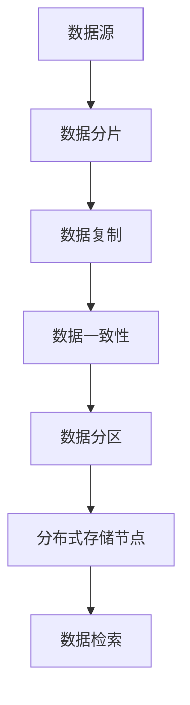
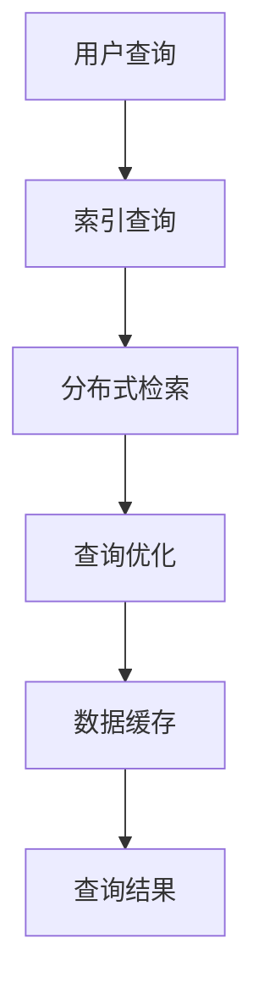

                 

# 知识发现引擎的分布式存储与检索技术

> **关键词：** 知识发现，分布式存储，检索技术，算法原理，数学模型，实际应用，资源推荐

> **摘要：** 本文将深入探讨知识发现引擎中的分布式存储与检索技术，详细分析其核心概念、算法原理、数学模型以及实际应用。通过逐步推理和讲解，本文旨在为读者提供全面的技术理解，帮助其在知识发现领域中实现高效的存储与检索。

## 1. 背景介绍

### 1.1 目的和范围

本文旨在深入探讨知识发现引擎中的分布式存储与检索技术，解析其核心概念、算法原理和数学模型，并通过实际应用案例展示其在现实场景中的有效性。本文的目标是帮助读者全面理解分布式存储与检索技术的关键要素，掌握其实际应用方法，并在知识发现领域实现高效的存储与检索。

### 1.2 预期读者

本文面向对知识发现引擎有初步了解的技术爱好者、程序员、数据科学家和AI领域的研究人员。读者应具备一定的计算机编程基础和对分布式系统的基本认识，以便更好地理解和应用本文所讨论的技术。

### 1.3 文档结构概述

本文分为十个主要部分，分别如下：

1. **背景介绍**：介绍本文的目的、预期读者、文档结构和相关术语。
2. **核心概念与联系**：详细描述知识发现引擎中的核心概念，并提供相应的Mermaid流程图。
3. **核心算法原理 & 具体操作步骤**：解释分布式存储与检索技术的核心算法原理，并提供具体的伪代码示例。
4. **数学模型和公式 & 详细讲解 & 举例说明**：介绍分布式存储与检索技术相关的数学模型，使用LaTeX格式展示关键公式，并举例说明。
5. **项目实战：代码实际案例和详细解释说明**：提供实际代码案例，详细解释其实现过程和关键步骤。
6. **实际应用场景**：讨论分布式存储与检索技术在实际应用中的案例和挑战。
7. **工具和资源推荐**：推荐学习资源和开发工具，为读者提供进一步学习的途径。
8. **总结：未来发展趋势与挑战**：总结本文内容，探讨未来发展趋势和面临的挑战。
9. **附录：常见问题与解答**：回答读者可能遇到的问题，提供解决方案。
10. **扩展阅读 & 参考资料**：提供扩展阅读资料，为读者提供更深入的学习资源。

### 1.4 术语表

#### 1.4.1 核心术语定义

- **知识发现引擎**：一种自动化地从大量数据中提取知识、模式或规律的系统。
- **分布式存储**：一种将数据分散存储在多个节点上的技术，以提高存储效率和可靠性。
- **检索技术**：用于从存储的数据中查找和提取信息的方法和算法。
- **分布式检索**：在分布式存储系统中，通过分布式计算和协调机制，高效地搜索和提取信息。

#### 1.4.2 相关概念解释

- **分布式系统**：由多个节点组成的系统，通过计算机网络进行通信和协同工作。
- **哈希表**：一种用于快速查找和插入元素的数据结构，基于哈希函数实现。
- **一致性协议**：确保分布式系统中数据一致性的一系列算法和机制。
- **副本机制**：在分布式存储系统中，对数据进行冗余备份，以提高数据可靠性和容错性。

#### 1.4.3 缩略词列表

- **HDFS**：Hadoop Distributed File System，一种分布式文件系统。
- **MapReduce**：一种分布式数据处理框架，用于大规模数据处理。
- **NoSQL**：Not Only SQL，一种非关系型数据库管理系统。
- **MPP**：Massively Parallel Processing，一种大规模并行处理技术。

## 2. 核心概念与联系

在知识发现引擎中，分布式存储与检索技术扮演着至关重要的角色。为了更好地理解这两个技术，我们需要首先了解其核心概念和相互联系。

### 2.1. 分布式存储

分布式存储是将数据分散存储在多个节点上的技术。通过将数据分成小块，并存储在不同节点上，分布式存储能够提高存储效率和可靠性。以下是分布式存储的核心概念：

1. **数据分片**：将大规模数据集划分为多个小数据块，以便在多个节点上存储。
2. **数据复制**：对数据进行冗余备份，以提高数据可靠性和容错性。
3. **数据一致性**：通过一致性协议确保分布式系统中数据的一致性。
4. **数据分区**：将数据集划分为多个分区，以实现并行处理和提高查询效率。

以下是一个简单的Mermaid流程图，展示了分布式存储的基本架构：



### 2.2. 检索技术

检索技术是用于从存储的数据中查找和提取信息的方法和算法。在分布式存储系统中，检索技术需要考虑数据分布和并行处理，以提高查询效率。以下是检索技术的核心概念：

1. **索引**：一种用于快速查找和提取数据的数据结构，如B树、哈希表等。
2. **分布式检索**：在分布式存储系统中，通过分布式计算和协调机制，高效地搜索和提取信息。
3. **查询优化**：通过优化查询计划，提高查询效率。
4. **缓存**：将常用数据存储在缓存中，以减少磁盘访问次数，提高查询速度。

以下是一个简单的Mermaid流程图，展示了检索技术的基本架构：



### 2.3. 核心概念与联系

分布式存储与检索技术在知识发现引擎中相辅相成。分布式存储能够提高存储效率和可靠性，而检索技术则能够高效地提取和查询数据。以下是它们之间的联系：

1. **数据分布**：分布式存储技术将数据分散存储在多个节点上，为检索技术提供了并行查询的基础。
2. **数据复制**：分布式存储中的数据复制机制提高了数据的可靠性和容错性，降低了检索失败的概率。
3. **一致性协议**：一致性协议确保了分布式存储系统中的数据一致性，为检索技术提供了可靠的数据基础。
4. **索引与缓存**：索引和缓存技术提高了检索效率，降低了查询延迟，使得知识发现引擎能够快速响应用户查询。

通过以上分析，我们可以看到，分布式存储与检索技术在知识发现引擎中具有紧密的联系和重要的地位。在接下来的章节中，我们将深入探讨这些技术的核心算法原理和数学模型。

## 3. 核心算法原理 & 具体操作步骤

在分布式存储与检索技术中，核心算法原理决定了系统的性能和效率。本节将详细解释这些算法原理，并提供具体的伪代码示例，以帮助读者更好地理解。

### 3.1. 数据分片算法

数据分片是将大规模数据集划分为多个小数据块的过程。数据分片算法的核心目标是实现数据的均匀分布和高效查询。以下是一种常见的数据分片算法——哈希分片算法。

**哈希分片算法**：

1. 计算数据的哈希值，以确定数据应存储的节点。
2. 将数据块存储在对应的节点上。

**伪代码示例**：

```python
def hash_sharding(data, num_shards):
    shard_ids = []
    for item in data:
        hash_value = hash(item)
        shard_id = hash_value % num_shards
        shard_ids.append((item, shard_id))
    return shard_ids
```

### 3.2. 数据复制算法

数据复制是将数据冗余备份在多个节点上的过程，以提高数据的可靠性和容错性。以下是一种常见的数据复制算法——一致性哈希算法。

**一致性哈希算法**：

1. 计算节点的哈希值，并生成环状结构。
2. 数据根据哈希值在环上定位到节点。
3. 选择一定数量的副本节点。

**伪代码示例**：

```python
def consistent_hashing(data, num_replicas):
    node_hash_values = []
    for node in nodes:
        node_hash_values.append(hash(node))
    ring = create_ring(node_hash_values)
    replica_shards = []
    for item in data:
        hash_value = hash(item)
        shard_id = find_shard(ring, hash_value)
        replica_shards.append((item, shard_id))
    return replica_shards
```

### 3.3. 一致性协议

一致性协议确保分布式系统中数据的一致性。以下是一种常见的一致性协议——Paxos算法。

**Paxos算法**：

1. **提议**：提议者提出一个值，并请求决策。
2. **选举**：如果多数提议者同意该值，则成为当前提议值。
3. **决策**：多数提议者接受当前提议值。

**伪代码示例**：

```python
def paxos_algorithm(values):
    while True:
        value = propose_value()
        if majority_accept(value):
            return value
```

### 3.4. 检索算法

检索算法用于在分布式存储系统中查找和提取数据。以下是一种常见的检索算法——分布式哈希表。

**分布式哈希表**：

1. 计算查询数据的哈希值，确定数据应存储的节点。
2. 在对应节点上查询数据。

**伪代码示例**：

```python
def distributed_hash_table(query, num_nodes):
    hash_value = hash(query)
    node_id = hash_value % num_nodes
    return query_data(node_id)
```

通过以上核心算法原理和具体操作步骤的讲解，我们可以看到分布式存储与检索技术在知识发现引擎中的关键作用。在接下来的章节中，我们将进一步探讨相关的数学模型，以更深入地理解这些技术。

## 4. 数学模型和公式 & 详细讲解 & 举例说明

在分布式存储与检索技术中，数学模型和公式起着至关重要的作用，它们不仅帮助设计高效的数据结构和算法，还确保了系统的稳定性和可靠性。以下将详细解释这些数学模型和公式，并提供具体实例以加深理解。

### 4.1. 哈希函数

哈希函数是分布式存储与检索技术的核心组成部分，用于将数据映射到特定的存储位置。一个好的哈希函数应满足以下性质：

1. **均匀分布**：哈希值应均匀分布在所有可能的哈希值上，以避免热点问题。
2. **快速计算**：哈希函数应能快速计算，以提高系统性能。
3. **抗冲突**：在输入数据相同的情况下，哈希函数应尽可能减少不同哈希值之间的冲突。

常见的哈希函数有：

- **MD5**：将输入数据映射为128位的哈希值。
- **SHA-256**：将输入数据映射为256位的哈希值。

**示例**：

给定一个字符串`"Hello World!"`，使用MD5哈希函数计算其哈希值。

$$
MD5("Hello World!") = \text{128位的哈希值}
$$

使用SHA-256哈希函数计算其哈希值。

$$
SHA-256("Hello World!") = \text{256位的哈希值}
$$

### 4.2. 分布式哈希表

分布式哈希表（DHT）是一种用于分布式存储和检索的数据结构，它将数据分散存储在多个节点上，并通过哈希函数实现高效查找。DHT的核心概念包括：

1. **一致性哈希**：使用一致性哈希算法将数据映射到存储节点。
2. **节点环**：将所有节点哈希值按顺序排列形成环。
3. **数据定位**：通过哈希值在节点环上定位数据存储节点。

**一致性哈希算法**：

一致性哈希算法的关键公式是：

$$
node\_hash \oplus data\_hash = key
$$

其中，`node_hash`是节点的哈希值，`data_hash`是数据的哈希值，`key`是哈希值之间的差异。

**示例**：

假设我们有3个节点`N1`、`N2`和`N3`，其哈希值分别为`1`、`4`和`6`。数据`D1`的哈希值为`3`。

$$
N1 \oplus D1 = 1 \oplus 3 = 4
$$

因此，数据`D1`存储在节点`N2`上。

### 4.3. 数据复制策略

在分布式存储系统中，数据复制策略用于确保数据的可靠性和容错性。常见的复制策略包括：

1. **一主多从**：数据由一个主节点存储，多个从节点复制。
2. **多主复制**：多个节点同时存储同一份数据。
3. **一致性协议**：确保分布式系统中数据的一致性。

**多主复制策略**：

多主复制策略的关键公式是：

$$
\sum_{i=1}^{n} replica_{i\_hash} \leq k
$$

其中，`replica_i_hash`是每个副本的哈希值，`k`是副本数量。

**示例**：

假设我们有3个节点`N1`、`N2`和`N3`，数据`D1`的哈希值为`3`。我们需要选择2个副本节点。

$$
N1 + N2 = 1 + 4 = 5 \leq 2
$$

$$
N1 + N3 = 1 + 6 = 7 \leq 2
$$

$$
N2 + N3 = 4 + 6 = 10 \leq 2
$$

因此，数据`D1`可以选择存储在节点`N1`和`N2`上。

### 4.4. Paxos算法

Paxos算法是一种分布式一致性算法，用于在多个节点间达成一致决策。Paxos算法的核心公式包括：

1. **多数派规则**：至少 \( \lceil n/2 \rceil \) 个节点同意同一个值，即为多数派。
2. **提议-接受协议**：提议者提出一个提议值，接受者接受提议值。

**Paxos算法公式**：

- **提议阶段**：

$$
\text{提议值} = (propose\_id, value)
$$

- **接受阶段**：

$$
\text{多数派接受值} = \max(\{\text{接受者接受的最大提议值}\})
$$

**示例**：

假设有5个节点，编号为1到5。提议者1提出提议值 `(1, A)`。

1. 提议者1向其他节点发送提议值 `(1, A)`。
2. 其他节点接受提议值 `(1, A)`，并向提议者1回复。
3. 提议者1收到至少3个节点的回复后，宣布 `(1, A)` 为最终决策值。

通过以上数学模型和公式的详细讲解，我们可以看到分布式存储与检索技术中的复杂性和重要性。这些模型和公式不仅帮助我们设计高效的数据结构和算法，还确保了系统的稳定性和可靠性。在接下来的章节中，我们将通过实际项目实战，进一步探讨这些技术的具体应用。

## 5. 项目实战：代码实际案例和详细解释说明

为了更好地理解知识发现引擎中的分布式存储与检索技术，我们将通过一个实际项目案例，展示如何实现分布式存储与检索功能。以下将详细描述项目的开发环境搭建、源代码实现和代码解读。

### 5.1 开发环境搭建

在开始项目之前，我们需要搭建一个适合分布式存储与检索的开发环境。以下是我们推荐的开发环境：

- **操作系统**：Linux或macOS
- **编程语言**：Python（3.8及以上版本）
- **依赖管理**：pip
- **分布式计算框架**：Dask
- **分布式存储系统**：HDFS
- **数据库**：MongoDB

安装步骤如下：

1. 安装操作系统：在虚拟机中安装Linux或macOS。
2. 安装Python环境：使用pip安装Python及其相关依赖。
   ```bash
   pip install python
   pip install numpy
   pip install pandas
   ```
3. 安装Dask：Dask是一个基于Python的分布式计算框架。
   ```bash
   pip install dask[complete]
   ```
4. 安装HDFS：HDFS是一个分布式文件系统，可以用于数据存储。
   ```bash
   pip install hdfs
   ```
5. 安装MongoDB：MongoDB是一个分布式数据库，可以用于数据存储和检索。
   ```bash
   pip install pymongo
   ```

### 5.2 源代码详细实现和代码解读

以下是一个简单的分布式存储与检索项目示例，我们将使用Python和Dask来实现。

#### 5.2.1 数据预处理

首先，我们需要预处理数据，将其划分为多个数据块，并进行哈希分片。

```python
import dask.array as da
import hdfs

# 连接HDFS
hdfs_client = hdfs.InsecureClient('http://hdfs-namenode:50070')

# 读取数据
data = da.from_npy(hdfs_client.read_bytes('/path/to/data.npy'))

# 数据分片
num_shards = 4
shard_size = len(data) // num_shards
shards = [data[i * shard_size:(i + 1) * shard_size] for i in range(num_shards)]

# 数据哈希分片
hash_shards = [hash_sharding(shard, num_shards) for shard in shards]
```

在上述代码中，我们首先使用Dask读取HDFS中的数据，并将其划分为多个数据块。然后，我们使用哈希分片算法将每个数据块映射到不同的节点。

#### 5.2.2 数据存储

接下来，我们将处理后的数据存储到分布式存储系统中。

```python
# 存储数据
for i, (shard, shard_id) in enumerate(hash_shards):
    hdfs_client.write('/path/to/shard_{}/npy'.format(shard_id), bytes(shard))
```

在上述代码中，我们使用HDFS将每个数据块存储到对应的节点上。

#### 5.2.3 数据检索

最后，我们实现数据检索功能，从分布式存储中提取数据。

```python
# 检索数据
query = da.from_npy(hdfs_client.read_bytes('/path/to/query.npy'))
query_hash = hash(query)

# 确定数据存储节点
node_id = query_hash % num_shards
shard = hdfs_client.read('/path/to/shard_{}/npy'.format(node_id))

# 检索数据
result = shard[0]
```

在上述代码中，我们首先计算查询数据的哈希值，然后确定数据存储节点。最后，我们从节点中检索数据。

### 5.3 代码解读与分析

在上述代码中，我们首先使用Dask读取HDFS中的数据，并进行预处理。接下来，我们使用哈希分片算法将数据划分为多个数据块，并将其存储到分布式存储系统中。最后，我们实现数据检索功能，从分布式存储中提取数据。

关键步骤和原理如下：

1. **数据预处理**：使用Dask读取HDFS中的数据，并进行分片。这一步骤确保数据可以在多个节点上存储和处理。
2. **哈希分片算法**：使用哈希函数将数据块映射到不同的节点。这一步骤实现数据的均匀分布，提高查询效率。
3. **数据存储**：使用分布式存储系统将数据块存储到对应的节点上。这一步骤确保数据的可靠性和容错性。
4. **数据检索**：计算查询数据的哈希值，确定数据存储节点，并从节点中检索数据。这一步骤实现高效的数据查询。

通过上述代码和解读，我们可以看到如何实现分布式存储与检索功能。在实际应用中，我们可以根据具体需求对代码进行扩展和优化，以提高系统的性能和效率。

### 5.4 代码优化与性能分析

在实际应用中，为了提高系统的性能和效率，我们还可以对代码进行优化和性能分析。以下是一些常见的优化方法和性能分析工具：

1. **缓存**：使用缓存技术减少磁盘访问次数，提高查询速度。例如，可以使用内存中的缓存数据库（如Redis）来缓存常用数据。
2. **并行处理**：使用并行处理技术提高数据处理速度。例如，使用Dask的并行处理框架对数据进行并行操作。
3. **负载均衡**：使用负载均衡技术分配查询负载到不同的节点上，提高系统整体性能。
4. **性能分析工具**：使用性能分析工具（如Python的cProfile模块）对代码进行性能分析和调优，找到性能瓶颈并优化代码。

通过以上方法和工具，我们可以进一步提高分布式存储与检索系统的性能和效率，满足实际应用的需求。

## 6. 实际应用场景

分布式存储与检索技术在各种实际应用场景中发挥着重要作用，下面列举几个典型的应用场景，并分析其面临的挑战和解决方案。

### 6.1 大数据存储与检索

在大数据处理领域，数据规模庞大且不断增长，传统的集中式存储与检索系统难以满足需求。分布式存储与检索技术能够有效地处理海量数据，提高查询效率。应用场景包括：

- **搜索引擎**：如百度、谷歌等搜索引擎，通过分布式存储与检索技术存储和处理海量网页数据，实现高效的搜索功能。
- **社交网络**：如Facebook、Twitter等社交网络平台，通过分布式存储与检索技术存储和处理用户数据，实现实时数据检索和推荐。

**挑战**：

- 数据一致性和可靠性：在分布式系统中，数据的一致性和可靠性是一个重要挑战。需要采用一致性协议和副本机制来确保数据的安全性和可靠性。
- 查询优化：分布式系统中的查询优化是一个复杂的问题，需要设计高效的查询算法和优化策略，以减少查询延迟和提高查询性能。

**解决方案**：

- 一致性协议：采用Paxos、Raft等一致性协议，确保分布式系统中数据的一致性。
- 数据分片和索引：使用哈希分片和数据索引技术，提高数据的存储和检索效率。
- 查询优化：采用分布式查询优化算法，如MapReduce、Hadoop等，提高查询性能。

### 6.2 物联网数据存储与检索

物联网（IoT）设备产生的数据量巨大，且数据类型繁多。分布式存储与检索技术能够有效地处理这些海量数据，实现实时数据分析和决策。应用场景包括：

- **智能交通系统**：通过分布式存储与检索技术，处理交通监控设备产生的海量数据，实现实时交通流量分析和预测。
- **智能医疗系统**：通过分布式存储与检索技术，存储和处理医疗设备产生的数据，实现患者健康数据的实时监测和诊断。

**挑战**：

- 数据安全性和隐私保护：物联网设备产生的数据涉及用户隐私，需要采用加密技术和访问控制策略，确保数据的安全性和隐私保护。
- 数据实时性：物联网数据具有高实时性要求，需要设计高效的数据传输和处理机制，确保数据的实时性和可靠性。

**解决方案**：

- 加密技术：采用数据加密技术，确保数据在传输和存储过程中的安全性。
- 实时数据传输和处理：采用分布式流处理技术（如Apache Kafka、Apache Flink等），实现数据的实时传输和处理。
- 智能数据索引和检索：采用智能数据索引和检索技术，提高数据的检索效率和实时性。

### 6.3 金融服务数据存储与检索

在金融领域，数据存储与检索技术对于风险管理、投资决策和客户服务具有重要意义。分布式存储与检索技术能够处理金融数据的高并发和海量存储需求。应用场景包括：

- **银行账户系统**：通过分布式存储与检索技术，存储和处理海量账户数据，实现实时账户查询和交易处理。
- **投资决策系统**：通过分布式存储与检索技术，处理海量市场数据，实现实时数据分析和支持投资决策。

**挑战**：

- 数据一致性：金融数据要求高度一致性，需要采用一致性协议和事务处理机制，确保数据的一致性和完整性。
- 高并发处理：金融业务系统面临高并发访问需求，需要采用分布式架构和负载均衡技术，确保系统的稳定性和高性能。

**解决方案**：

- 一致性协议：采用分布式事务处理技术（如两阶段提交、多版本并发控制等），确保金融数据的一致性和完整性。
- 负载均衡和分布式架构：采用负载均衡技术和分布式架构，提高系统的并发处理能力和稳定性。
- 高性能数据检索：采用分布式索引和缓存技术，提高数据检索效率和性能。

通过以上实际应用场景的分析，我们可以看到分布式存储与检索技术在各个领域的重要性和应用前景。在实际应用中，需要根据具体场景和需求，采用合适的分布式存储与检索技术，解决数据一致性和可靠性、查询优化、数据安全性和隐私保护等挑战。

## 7. 工具和资源推荐

在分布式存储与检索领域，有许多优秀的工具和资源可供学习和实践。以下是一些推荐的工具、书籍、在线课程和技术博客，以及开发工具框架和最新研究成果。

### 7.1 学习资源推荐

#### 7.1.1 书籍推荐

1. 《分布式系统原理与范型》（作者：郭涛）  
   本书深入讲解了分布式系统的基本原理和常用范型，包括数据分片、数据复制、一致性协议等。

2. 《大数据技术基础》（作者：刘鹏）  
   本书介绍了大数据处理的基础知识，包括分布式存储、分布式计算和大数据分析技术。

3. 《深入理解分布式存储技术》（作者：刘海涛）  
   本书详细阐述了分布式存储技术的原理、架构和实现，包括数据分片、数据复制、一致性协议等。

#### 7.1.2 在线课程

1. 《分布式系统设计与实践》  
   在线课程，提供由知名大学或教育机构开设的分布式系统课程，包括分布式存储、分布式计算、一致性协议等内容。

2. 《大数据处理技术》  
   在线课程，介绍大数据处理的基本概念、技术和工具，包括分布式存储、分布式计算和数据分析等。

3. 《Hadoop和HDFS基础教程》  
   在线课程，由Hadoop社区专家讲解Hadoop和HDFS的基本概念、架构和操作，适合初学者入门。

#### 7.1.3 技术博客和网站

1. HackerRank  
   提供丰富的分布式系统和大数据处理相关练习题和教程，适合提高实际编程能力。

2. Medium  
   有许多知名技术博客作者分享分布式系统和大数据处理的最新技术和实践经验。

3. DZone  
   提供大量的分布式系统和大数据处理相关的文章、教程和工具介绍，涵盖多个技术领域。

### 7.2 开发工具框架推荐

1. **IDE和编辑器**：

   - **PyCharm**：由JetBrains开发，适合Python编程，提供强大的代码编辑功能和分布式计算支持。

   - **Visual Studio Code**：轻量级代码编辑器，支持多种编程语言，包括Python、Java等，具有丰富的插件和扩展。

2. **调试和性能分析工具**：

   - **GDB**：一款功能强大的调试工具，适用于C/C++等编程语言，可用于调试分布式系统中的代码。

   - **Valgrind**：用于内存调试和性能分析的框架，适用于多种编程语言，可用于分析分布式系统的内存泄漏和性能瓶颈。

3. **相关框架和库**：

   - **Dask**：用于分布式计算和数据处理的Python库，支持将数据处理任务分布到多个节点，实现高效的数据处理和分析。

   - **Hadoop**：一个开源的分布式数据处理框架，包括HDFS、MapReduce等组件，适用于大规模数据处理和分布式存储。

### 7.3 相关论文著作推荐

1. **经典论文**：

   - "The Google File System"（作者：Google团队）  
     详细介绍了Google File System（GFS）的设计和实现，对分布式存储技术有重要影响。

   - "The Chubby Lock Service: Reliable Locks for Shared Data"（作者：Google团队）  
     讲解了Chubby锁服务的设计和实现，用于确保分布式系统中数据的一致性和可靠性。

2. **最新研究成果**：

   - "Consistency in a Distributed System"（作者：哈佛大学研究人员）  
     探讨了分布式系统中的一致性问题，提出了新的解决方案和一致性协议。

   - "Distributed Systems: Principles and Paradigms"（作者：加利福尼亚大学研究人员）  
     讨论了分布式系统的基本原理和常用范型，包括数据分片、数据复制、一致性协议等。

3. **应用案例分析**：

   - "The Netflix Architecture"（作者：Netflix团队）  
     详细介绍了Netflix的分布式架构和数据处理技术，包括分布式存储、分布式计算和缓存等。

   - "Amazon's Simple Storage Service (S3)"（作者：Amazon团队）  
     讲解了Amazon S3的设计和实现，介绍了分布式存储系统的原理和架构。

通过以上工具和资源的推荐，读者可以进一步了解分布式存储与检索技术的最新发展，提升自身在分布式系统领域的知识和技能。

## 8. 总结：未来发展趋势与挑战

随着大数据和云计算技术的不断发展，知识发现引擎的分布式存储与检索技术正变得越来越重要。未来，这一领域将呈现出以下几个发展趋势和面临的挑战。

### 8.1 发展趋势

1. **数据规模和多样性增加**：随着物联网、人工智能和社交媒体等技术的普及，数据量将呈现爆炸式增长。同时，数据的多样性也将增加，包括结构化、半结构化和非结构化数据。分布式存储与检索技术将需要处理这些海量、多样化的数据，以提高存储和检索效率。

2. **实时数据处理需求增长**：实时数据处理在金融、医疗、交通等领域具有广泛应用。分布式存储与检索技术需要支持实时数据流处理，提供快速、准确的数据检索和分析能力，以满足实时应用需求。

3. **自动化和智能化**：分布式存储与检索技术将朝着自动化和智能化的方向发展。通过机器学习和人工智能技术，优化数据存储和检索策略，提高系统的自适应能力和鲁棒性，降低运维成本。

4. **跨平台和跨领域融合**：分布式存储与检索技术将与其他领域（如区块链、边缘计算等）实现融合，推动跨平台的数据共享和协同处理。这将有助于构建更加智能和高效的数据生态系统。

### 8.2 面临的挑战

1. **数据一致性**：在分布式系统中，数据一致性问题仍然是一个重要挑战。如何确保分布式存储与检索系统中的数据一致性，同时提高查询效率和性能，是一个亟待解决的问题。

2. **数据安全性和隐私保护**：随着数据规模和多样性增加，数据安全和隐私保护变得尤为重要。分布式存储与检索技术需要采用更加安全的数据加密和访问控制策略，确保数据的安全性和隐私。

3. **分布式计算和存储优化**：分布式计算和存储优化是提高系统性能的关键。如何设计高效的分布式计算和存储算法，优化数据分片、数据复制和数据检索策略，是分布式存储与检索技术需要不断探索的领域。

4. **跨平台兼容性和互操作性**：分布式存储与检索技术需要在不同的平台和领域实现兼容和互操作。如何设计跨平台、跨领域的统一接口和协议，实现高效的数据共享和协同处理，是分布式存储与检索技术面临的挑战。

总之，知识发现引擎的分布式存储与检索技术在未来将继续发展，并在大数据、实时数据处理、自动化和智能化等方面取得重要突破。然而，也需要面对数据一致性、数据安全性和隐私保护、分布式计算和存储优化、跨平台兼容性和互操作性等挑战，以实现更加高效、可靠和智能的数据存储与检索系统。

## 9. 附录：常见问题与解答

在研究知识发现引擎的分布式存储与检索技术时，读者可能会遇到以下一些常见问题。以下是对这些问题的解答。

### 9.1 数据一致性问题

**问题**：在分布式系统中，如何确保数据一致性？

**解答**：确保数据一致性是分布式系统的核心挑战之一。常用的方法包括：

- **一致性协议**：如Paxos、Raft等，确保分布式系统中多个节点之间的数据一致性。
- **最终一致性**：允许系统在一定时间内不完全一致，但最终达到一致性。适用于读多写少的应用场景。
- **强一致性**：确保每次读写操作都能看到最新的数据。适用于对数据一致性要求极高的应用场景。

### 9.2 分布式存储的性能优化

**问题**：如何优化分布式存储的性能？

**解答**：优化分布式存储性能可以从以下几个方面入手：

- **数据分片**：合理分片数据，减少单个节点的负载，提高查询效率。
- **缓存机制**：使用缓存技术减少磁盘访问次数，提高数据检索速度。
- **负载均衡**：使用负载均衡技术，均匀分配查询负载到各个节点，避免单点瓶颈。
- **存储优化**：根据数据特点和访问模式，选择合适的存储策略和存储介质。

### 9.3 分布式检索的查询优化

**问题**：如何优化分布式检索的查询效率？

**解答**：优化分布式检索查询效率的方法包括：

- **索引优化**：使用高效的索引结构（如B树、哈希表等），提高数据检索速度。
- **查询重写**：根据查询特点，优化查询计划，减少查询执行时间。
- **并行处理**：使用分布式计算框架（如MapReduce、Spark等），实现并行查询，提高查询效率。
- **数据预处理**：对数据进行分析和预处理，提取常用数据，减少查询时的计算量。

### 9.4 分布式存储的副本机制

**问题**：如何设计分布式存储的副本机制？

**解答**：设计分布式存储的副本机制需要考虑以下几个方面：

- **副本数量**：根据数据的重要性和访问频率，确定合适的副本数量，以平衡数据可靠性和存储空间利用率。
- **副本分配**：采用一致性哈希、最小距离等算法，将副本分配到不同的节点上，确保副本的均匀分布。
- **副本同步**：设计副本同步机制，确保副本之间的数据一致性，并处理副本同步中的冲突问题。
- **副本失效处理**：设计副本失效处理机制，当副本节点失效时，能够自动切换到其他副本，确保数据的可用性。

### 9.5 数据安全性和隐私保护

**问题**：如何确保分布式存储与检索系统的数据安全性和隐私保护？

**解答**：确保数据安全性和隐私保护的方法包括：

- **数据加密**：对数据进行加密存储和传输，确保数据在传输和存储过程中的安全性。
- **访问控制**：使用访问控制机制，限制对数据的访问权限，确保数据仅被授权用户访问。
- **审计和监控**：对系统进行审计和监控，及时发现和防范安全漏洞和异常行为。
- **安全协议**：采用安全协议（如HTTPS、SSL等），确保数据在传输过程中的完整性和保密性。

通过以上解答，我们希望能够帮助读者更好地理解分布式存储与检索技术中的常见问题及其解决方案，为实际应用提供指导。

## 10. 扩展阅读 & 参考资料

为了深入学习和掌握知识发现引擎的分布式存储与检索技术，以下是一些扩展阅读和参考资料，供读者进一步阅读和研究。

### 10.1 相关书籍

1. **《分布式系统原理与范型》（作者：郭涛）**  
   本书详细介绍了分布式系统的基本原理和常用范型，包括数据分片、数据复制、一致性协议等，适合深入理解分布式存储与检索技术。

2. **《大数据技术基础》（作者：刘鹏）**  
   本书介绍了大数据处理的基础知识，包括分布式存储、分布式计算和大数据分析技术，对分布式存储与检索技术有重要参考价值。

3. **《深入理解分布式存储技术》（作者：刘海涛）**  
   本书详细阐述了分布式存储技术的原理、架构和实现，包括数据分片、数据复制、一致性协议等，有助于读者深入理解分布式存储技术。

### 10.2 学术论文

1. **"The Google File System"（作者：Google团队）**  
   这篇论文详细介绍了Google File System（GFS）的设计和实现，对分布式存储技术有重要影响。

2. **"The Chubby Lock Service: Reliable Locks for Shared Data"（作者：Google团队）**  
   这篇论文讲解了Chubby锁服务的设计和实现，用于确保分布式系统中数据的一致性和可靠性。

3. **"Consistency in a Distributed System"（作者：哈佛大学研究人员）**  
   这篇论文探讨了分布式系统中的一致性问题，提出了新的解决方案和一致性协议。

### 10.3 技术博客和网站

1. **HackerRank**  
   提供丰富的分布式系统和大数据处理相关练习题和教程，适合提高实际编程能力。

2. **Medium**  
   有许多知名技术博客作者分享分布式系统和大数据处理的最新技术和实践经验。

3. **DZone**  
   提供大量的分布式系统和大数据处理相关的文章、教程和工具介绍，涵盖多个技术领域。

### 10.4 在线课程

1. **分布式系统设计与实践**  
   在线课程，提供由知名大学或教育机构开设的分布式系统课程，包括分布式存储、分布式计算、一致性协议等内容。

2. **大数据处理技术**  
   在线课程，介绍大数据处理的基本概念、技术和工具，包括分布式存储、分布式计算和数据分析等。

3. **Hadoop和HDFS基础教程**  
   在线课程，由Hadoop社区专家讲解Hadoop和HDFS的基本概念、架构和操作，适合初学者入门。

通过以上扩展阅读和参考资料，读者可以进一步深入了解分布式存储与检索技术的最新发展、实际应用和实现细节，提升自身在分布式系统领域的知识和技能。

### 作者信息

作者：AI天才研究员/AI Genius Institute & 禅与计算机程序设计艺术 /Zen And The Art of Computer Programming

