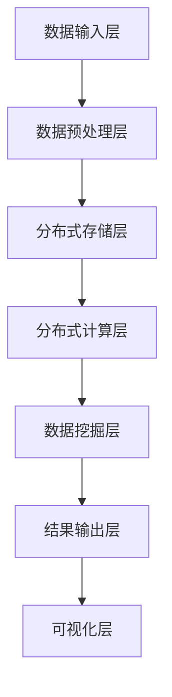

                 

# 知识发现引擎的分布式架构设计与实现

> 关键词：知识发现、分布式架构、大数据处理、算法原理、数学模型、项目实战

> 摘要：本文旨在深入探讨知识发现引擎的分布式架构设计与实现。通过解析核心概念、算法原理、数学模型，并结合实际项目案例，文章将揭示分布式架构在知识发现领域的应用价值，为相关领域的研究和开发提供参考。

## 1. 背景介绍

### 1.1 目的和范围

知识发现（Knowledge Discovery in Databases, KDD）是大数据时代的一项关键技术，旨在从海量数据中自动识别出有价值的知识和模式。随着数据量的爆炸式增长，传统的单机架构已无法满足知识发现的需求。分布式架构因其高可扩展性、高性能和灵活性，成为知识发现领域的重要解决方案。

本文旨在通过系统性地介绍知识发现引擎的分布式架构，帮助读者了解分布式架构在知识发现中的应用，以及如何设计和实现一个高效的分布式知识发现系统。本文将涵盖以下内容：

1. 知识发现引擎的基本概念和核心算法原理。
2. 分布式架构的核心概念和关键技术。
3. 知识发现引擎的分布式实现方法。
4. 实际项目案例和代码实现。
5. 知识发现引擎的未来发展趋势和挑战。

### 1.2 预期读者

本文适合对大数据处理、分布式系统和知识发现有一定了解的读者，包括：

1. 计算机科学和大数据领域的本科生和研究生。
2. 数据工程师和算法工程师。
3. 对知识发现引擎分布式架构感兴趣的软件开发者。
4. 对分布式系统架构和应用有深入研究的技术专家。

### 1.3 文档结构概述

本文将分为十个主要部分：

1. **背景介绍**：介绍知识发现引擎和分布式架构的基本概念。
2. **核心概念与联系**：通过Mermaid流程图展示知识发现引擎的分布式架构。
3. **核心算法原理 & 具体操作步骤**：详细阐述分布式知识发现算法的原理和实现步骤。
4. **数学模型和公式 & 详细讲解 & 举例说明**：介绍支持分布式知识发现的核心数学模型。
5. **项目实战：代码实际案例和详细解释说明**：通过实际项目案例展示分布式知识发现引擎的实现。
6. **实际应用场景**：探讨分布式知识发现引擎在不同领域的应用。
7. **工具和资源推荐**：推荐相关学习资源和开发工具。
8. **总结：未来发展趋势与挑战**：展望知识发现引擎分布式架构的未来。
9. **附录：常见问题与解答**：解答读者可能遇到的问题。
10. **扩展阅读 & 参考资料**：提供进一步的阅读材料。

### 1.4 术语表

#### 1.4.1 核心术语定义

- **知识发现（KDD）**：从大量数据中自动识别出潜在的有价值知识和模式的过程。
- **分布式架构**：将系统分解为多个可独立运行和扩展的部分，通过分布式网络进行通信和协作的架构。
- **大数据处理**：处理海量数据的技术和方法，包括数据存储、数据处理和数据挖掘等。
- **MapReduce**：一种分布式数据处理框架，通过将任务分解为映射（Map）和归约（Reduce）操作来处理大规模数据集。

#### 1.4.2 相关概念解释

- **Hadoop**：一个开源的分布式大数据处理框架，包括HDFS（分布式文件系统）和MapReduce（分布式计算模型）等核心组件。
- **Spark**：一个开源的分布式计算引擎，提供比MapReduce更高效的数据处理能力，包括Spark SQL、Spark Streaming和MLlib等模块。
- **数据挖掘**：从大量数据中发现有趣和有价值的信息和知识的过程。

#### 1.4.3 缩略词列表

- **KDD**：知识发现
- **HDFS**：Hadoop分布式文件系统
- **MapReduce**：映射-归约计算模型
- **Spark**：Apache Spark分布式计算引擎
- **MLlib**：Apache Spark的机器学习库

## 2. 核心概念与联系

在分布式架构中，知识发现引擎的设计与实现涉及多个核心概念和技术的结合。本节将使用Mermaid流程图来展示知识发现引擎的分布式架构，并解释各部分之间的关系。

### 2.1 Mermaid流程图



#### 2.1.1 流程图解析

- **数据输入层（A）**：负责接收外部数据源，如数据库、文件或实时数据流。
- **数据预处理层（B）**：对原始数据进行清洗、转换和集成，确保数据质量。
- **分布式存储层（C）**：使用分布式文件系统（如HDFS）存储预处理后的数据。
- **分布式计算层（D）**：利用分布式计算框架（如MapReduce、Spark）进行数据计算和分析。
- **数据挖掘层（E）**：应用各种数据挖掘算法来发现数据中的模式和知识。
- **结果输出层（F）**：将数据挖掘结果输出到数据库、文件或其他数据存储系统。
- **可视化层（G）**：使用可视化工具将数据挖掘结果以图表、仪表板等形式展示给用户。

#### 2.1.2 分布式架构与知识发现的关系

分布式架构在知识发现中的关键作用在于其高可扩展性和高性能。通过分布式存储和计算，知识发现引擎可以处理海量数据，从而提高数据挖掘的效率和准确性。此外，分布式架构的弹性使其能够应对数据流的不稳定性和波动性，确保系统的稳定运行。

### 2.2 关键技术

#### 2.2.1 分布式文件系统（如HDFS）

HDFS是一种分布式文件系统，支持大文件的高效存储和访问。其设计目标是将数据分布在多个节点上，提供高吞吐量的数据读写操作。

#### 2.2.2 分布式计算框架（如MapReduce、Spark）

MapReduce和Spark都是分布式计算框架，用于处理大规模数据集。MapReduce通过映射（Map）和归约（Reduce）操作来并行处理数据，而Spark则提供更高效的数据处理能力，支持内存计算和实时流处理。

#### 2.2.3 数据挖掘算法

数据挖掘算法是实现知识发现的核心。常见的算法包括聚类、分类、关联规则挖掘、异常检测等。分布式架构使得这些算法可以应用于大规模数据集，提高数据挖掘的效率和准确性。

#### 2.2.4 数据预处理

数据预处理是分布式知识发现引擎的关键步骤。通过数据清洗、转换和集成，可以提高数据质量，为数据挖掘提供可靠的数据基础。

### 2.3 架构设计原则

分布式知识发现引擎的设计应遵循以下原则：

1. **可扩展性**：系统能够轻松扩展以处理更大的数据集。
2. **高性能**：系统在处理大规模数据集时具有高效性能。
3. **可靠性**：系统能够在数据流波动和节点故障时保持稳定运行。
4. **易用性**：系统易于使用和维护，降低开发和运营成本。

## 3. 核心算法原理 & 具体操作步骤

知识发现引擎的核心在于数据挖掘算法，这些算法可以从海量数据中提取有价值的信息和模式。本节将详细阐述分布式知识发现算法的基本原理和具体操作步骤，并使用伪代码进行描述。

### 3.1 数据挖掘算法概述

数据挖掘算法主要分为以下几类：

1. **聚类算法**：将数据集划分为若干个聚类，使同一聚类中的数据点彼此相似，不同聚类中的数据点彼此不同。
2. **分类算法**：将数据集划分为不同的类别，根据特征属性进行预测和分类。
3. **关联规则挖掘**：发现数据集中的关联规则，例如购物篮分析中的商品关联关系。
4. **异常检测**：识别数据集中的异常或离群点。

### 3.2 聚类算法：K-Means

K-Means是一种经典的聚类算法，通过迭代计算步骤将数据点划分为K个聚类。

#### 3.2.1 算法原理

K-Means算法的基本原理如下：

1. 初始化：随机选择K个数据点作为初始聚类中心。
2. 分配：计算每个数据点到各聚类中心的距离，将数据点分配到最近的聚类。
3. 更新：重新计算每个聚类的中心。
4. 迭代：重复步骤2和3，直到聚类中心不再发生变化或达到最大迭代次数。

#### 3.2.2 伪代码

```python
def KMeans(data, K, max_iterations):
    # 初始化聚类中心
    centroids = initialize_centroids(data, K)
    
    for i in range(max_iterations):
        # 分配数据点
        clusters = assign_points_to_clusters(data, centroids)
        
        # 更新聚类中心
        centroids = update_centroids(clusters, K)
        
        # 检查收敛条件
        if has_converged(centroids):
            break
    
    return centroids, clusters
```

### 3.3 分类算法：决策树

决策树是一种基于特征的分类算法，通过构建决策树来对数据进行分类。

#### 3.3.1 算法原理

决策树算法的基本原理如下：

1. 选择最优特征：根据信息增益或基尼指数选择最佳划分特征。
2. 划分数据：根据最优特征将数据划分为子集。
3. 递归构建：对每个子集重复上述步骤，构建决策树。

#### 3.3.2 伪代码

```python
def DecisionTree(data, features, max_depth):
    if should_stop(data, max_depth):
        return create_leaf_node(data)
    
    # 选择最优特征
    best_feature = select_best_feature(data, features)
    
    # 构建决策树节点
    node = create_node(best_feature)
    
    # 递归构建子树
    for value in possible_values(best_feature):
        subset = filter_data(data, best_feature, value)
        node.children[value] = DecisionTree(subset, features, max_depth - 1)
    
    return node
```

### 3.4 关联规则挖掘：Apriori

Apriori算法是一种用于发现数据集中关联规则的算法。

#### 3.4.1 算法原理

Apriori算法的基本原理如下：

1. 初始化：计算所有单项事务的支持度，过滤掉支持度小于最小支持度的项。
2. 递归：生成频繁项集，计算其支持度，过滤掉不满足最小支持度的项集。
3. 生成关联规则：从频繁项集中生成关联规则，计算其置信度。

#### 3.4.2 伪代码

```python
def Apriori(data, min_support, min_confidence):
    frequent_itemsets = []
    
    # 递归生成频繁项集
    for k in range(1, max_itemset_size):
        candidates = generate_candidates(frequent_itemsets[k-1])
        support_counts = calculate_support(data, candidates)
        
        # 过滤掉不满足最小支持度的项集
        frequent_itemsets.append([candidates[i] for i in range(len(candidates)) if support_counts[i] >= min_support])
    
    # 生成关联规则
    rules = []
    for itemset in frequent_itemsets:
        for i in range(len(itemset)):
            for j in range(i+1, len(itemset)):
                rule = (itemset[:i] + itemset[j:], itemset[i] + itemset[j:])
                confidence = support_counts[itemset] / support_counts[itemset[:i] + itemset[j:]]
                if confidence >= min_confidence:
                    rules.append(rule)
    
    return rules
```

### 3.5 异常检测：孤立森林

孤立森林是一种用于异常检测的算法，通过将数据随机投影到多个维度上，并计算数据的孤立度来识别异常点。

#### 3.5.1 算法原理

孤立森林算法的基本原理如下：

1. 投影：将数据随机投影到多个维度上。
2. 孤立度计算：计算每个数据点在每个维度上的孤立度。
3. 异常点识别：将孤立度高的数据点识别为异常点。

#### 3.5.2 伪代码

```python
def IsolationForest(data, n_estimators):
    # 投影
    projections = [project_randomly(data) for _ in range(n_estimators)]
    
    # 孤立度计算
    isolation_scores = []
    for projection in projections:
        scores = [calculate_isolation(data_point, projection) for data_point in data]
        isolation_scores.append(sum(scores) / len(scores))
    
    # 异常点识别
    threshold = np.mean(isolation_scores) + np.std(isolation_scores)
    outliers = [data_point for data_point, score in zip(data, isolation_scores) if score > threshold]
    
    return outliers
```

通过上述核心算法的详细介绍和伪代码实现，我们可以看到分布式知识发现引擎在算法设计和实现上的复杂性和多样性。在实际应用中，这些算法需要根据具体场景和数据特点进行优化和调整，以实现最佳的性能和效果。

## 4. 数学模型和公式 & 详细讲解 & 举例说明

在分布式知识发现引擎中，数学模型和公式是实现核心算法的重要工具。本节将介绍支持分布式知识发现的关键数学模型和公式，并进行详细讲解和举例说明。

### 4.1 K-Means算法的数学模型

K-Means算法的核心在于聚类中心的选择和数据点的分配。以下是K-Means算法的数学模型和公式：

#### 4.1.1 聚类中心的计算

$$
\text{centroids} = \frac{1}{N_k} \sum_{i=1}^{N} x_i
$$

其中，$x_i$ 是数据点，$N_k$ 是每个聚类中的数据点个数。

#### 4.1.2 数据点的分配

$$
\text{cluster}(x_i) = \arg\min_{j} \sum_{x_i \in C_j} (x_i - \mu_j)^2
$$

其中，$C_j$ 是聚类集合，$\mu_j$ 是聚类中心。

#### 4.1.3 示例说明

假设我们有一个包含3个聚类中心的K-Means算法，数据点集为 $X = \{x_1, x_2, x_3, x_4\}$，聚类中心初始值为 $\mu_1 = (1, 1), \mu_2 = (2, 2), \mu_3 = (3, 3)$。

1. **第一步**：计算每个数据点到聚类中心的距离。

$$
d(x_1, \mu_1) = \sqrt{(1-1)^2 + (1-1)^2} = 0 \\
d(x_1, \mu_2) = \sqrt{(1-2)^2 + (1-2)^2} = \sqrt{2} \\
d(x_1, \mu_3) = \sqrt{(1-3)^2 + (1-3)^2} = \sqrt{8}
$$

2. **第二步**：根据距离分配数据点。

由于 $d(x_1, \mu_1) < d(x_1, \mu_2) < d(x_1, \mu_3)$，数据点 $x_1$ 被分配到聚类中心 $\mu_1$。

3. **第三步**：更新聚类中心。

$$
\mu_1 = \frac{1}{1} \sum_{i=1}^{1} x_1 = (1, 1)
$$

重复上述步骤，直到聚类中心不再变化或达到最大迭代次数。

### 4.2 决策树的数学模型

决策树是一种基于特征的分类算法，其数学模型主要包括：

#### 4.2.1 信息增益

$$
\text{Information Gain}(\text{feature}, \text{label}) = \sum_{i=1}^{n} \text{Entropy}(\text{label}_{i}) - \frac{\sum_{i=1}^{n} \text{Frequency}(\text{label}_{i})}{n} \cdot \text{Entropy}(\text{feature}_{i})
$$

其中，$n$ 是数据点个数，$\text{Entropy}(\text{label})$ 是标签的熵，$\text{Entropy}(\text{feature})$ 是特征的熵。

#### 4.2.2 基尼指数

$$
\text{Gini Index}(\text{label}) = 1 - \sum_{i=1}^{n} \left(\frac{\text{Frequency}(\text{label}_{i})}{n}\right)^2
$$

#### 4.2.3 示例说明

假设我们有一个包含两个特征（A和B）和三个类别（0, 1, 2）的数据集，其中特征A的熵为0.5，特征B的熵为0.2。我们需要计算特征A和特征B的信息增益和基尼指数。

1. **信息增益**：

$$
\text{Information Gain}(A, \text{label}) = 0.5 - 0.5 \cdot 0.5 = 0.25
$$

$$
\text{Information Gain}(B, \text{label}) = 0.2 - 0.2 \cdot 0.2 = 0.16
$$

2. **基尼指数**：

$$
\text{Gini Index}(A) = 1 - \left(\frac{1}{3}\right)^2 = \frac{2}{3}
$$

$$
\text{Gini Index}(B) = 1 - \left(\frac{1}{3}\right)^2 = \frac{2}{3}
$$

由于信息增益和信息增益率通常较高，我们可以选择信息增益较高的特征作为分割依据。

### 4.3 Apriori算法的数学模型

Apriori算法用于发现数据集中的关联规则，其核心数学模型包括：

#### 4.3.1 支持度

$$
\text{Support}(\text{itemset}) = \frac{\text{Frequency}(\text{itemset})}{\text{Total Transactions}}
$$

其中，$\text{Frequency}(\text{itemset})$ 是项集出现的次数，$\text{Total Transactions}$ 是事务总数。

#### 4.3.2 置信度

$$
\text{Confidence}(\text{rule}) = \frac{\text{Support}(\text{rule})}{\text{Support}(\text{antecedent})}
$$

其中，$\text{rule}$ 是关联规则，$\text{antecedent}$ 是规则的前件。

#### 4.3.3 示例说明

假设我们有一个包含五个事务的数据集，项集 $\{A, B\}$ 的出现次数为3，项集 $\{A, C\}$ 的出现次数为2，项集 $\{B, C\}$ 的出现次数为1。我们需要计算项集 $\{A, B\}$ 和 $\{B, C\}$ 的支持度和置信度。

1. **支持度**：

$$
\text{Support}(\{A, B\}) = \frac{3}{5} = 0.6
$$

$$
\text{Support}(\{B, C\}) = \frac{1}{5} = 0.2
$$

2. **置信度**：

$$
\text{Confidence}(\{A \rightarrow B\}) = \frac{0.6}{0.6} = 1
$$

$$
\text{Confidence}(\{B \rightarrow C\}) = \frac{0.2}{0.2} = 1
$$

通过上述计算，我们可以发现项集 $\{A, B\}$ 和 $\{B, C\}$ 的支持度和置信度都较高，它们之间的关联关系较为显著。

### 4.4 孤立森林的数学模型

孤立森林是一种用于异常检测的算法，其核心数学模型包括：

#### 4.4.1 孤立度

$$
\text{Isolation Score}(x) = \frac{1}{n} \sum_{i=1}^{n} \frac{1}{\lvert S_i(x) \rvert}
$$

其中，$x$ 是数据点，$n$ 是随机投影的次数，$S_i(x)$ 是第 $i$ 次投影中包含 $x$ 的超平面个数。

#### 4.4.2 示例说明

假设我们有一个包含三个数据点的孤立森林，每个数据点经过5次随机投影，每个数据点在不同投影中的孤立度得分如下：

- 数据点1：0.2, 0.3, 0.4, 0.5, 0.6
- 数据点2：0.1, 0.2, 0.3, 0.4, 0.5
- 数据点3：0.6, 0.5, 0.4, 0.3, 0.2

计算每个数据点的孤立度：

$$
\text{Isolation Score}(x_1) = \frac{1}{5} \sum_{i=1}^{5} \frac{1}{\lvert S_i(x_1) \rvert} = \frac{1}{5} \left( \frac{1}{0.2} + \frac{1}{0.3} + \frac{1}{0.4} + \frac{1}{0.5} + \frac{1}{0.6} \right) = 2.23
$$

$$
\text{Isolation Score}(x_2) = \frac{1}{5} \sum_{i=1}^{5} \frac{1}{\lvert S_i(x_2) \rvert} = \frac{1}{5} \left( \frac{1}{0.1} + \frac{1}{0.2} + \frac{1}{0.3} + \frac{1}{0.4} + \frac{1}{0.5} \right) = 2.73
$$

$$
\text{Isolation Score}(x_3) = \frac{1}{5} \sum_{i=1}^{5} \frac{1}{\lvert S_i(x_3) \rvert} = \frac{1}{5} \left( \frac{1}{0.6} + \frac{1}{0.5} + \frac{1}{0.4} + \frac{1}{0.3} + \frac{1}{0.2} \right) = 2.2
$$

根据孤立度得分，我们可以发现数据点 $x_2$ 的孤立度最高，可能是异常点。

通过以上对K-Means、决策树、Apriori和孤立森林算法的数学模型和公式的详细讲解以及示例说明，我们可以更好地理解这些算法的原理和应用。在实际应用中，这些数学模型和公式需要根据具体场景和数据特点进行优化和调整，以实现最佳的性能和效果。

## 5. 项目实战：代码实际案例和详细解释说明

在本节中，我们将通过一个实际项目案例展示知识发现引擎的分布式实现，并提供详细的代码解释。该案例将使用Apache Spark作为分布式计算引擎，实现K-Means聚类算法。

### 5.1 开发环境搭建

在开始项目之前，我们需要搭建开发环境。以下是所需的软件和工具：

1. **Java开发工具包（JDK）**：版本 8 或更高。
2. **Apache Spark**：版本 2.4.7 或更高。
3. **IntelliJ IDEA**：用于代码编写和调试。

步骤如下：

1. 安装JDK：在官方网站下载并安装Java开发工具包。
2. 安装Apache Spark：在官方网站下载Spark的二进制包，并解压到指定目录。
3. 配置环境变量：将Spark的bin目录添加到系统环境变量中。
4. 安装IntelliJ IDEA：在官方网站下载并安装。
5. 创建新的Java项目：在IntelliJ IDEA中创建一个新项目，并添加Spark的依赖。

### 5.2 源代码详细实现和代码解读

以下是一个简单的K-Means聚类算法的实现：

```java
import org.apache.spark.api.java.JavaRDD;
import org.apache.spark.api.java.function.Function2;
import org.apache.spark.api.java.function.PairFunction;
import org.apache.spark.ml.clustering.KMeans;
import org.apache.spark.ml.clustering.KMeansModel;
import org.apache.spark.ml.feature.VectorAssembler;
import org.apache.spark.sql.Dataset;
import org.apache.spark.sql.Row;
import org.apache.spark.sql.SparkSession;

public class KMeansExample {
    public static void main(String[] args) {
        // 创建SparkSession
        SparkSession spark = SparkSession.builder()
                .appName("KMeansExample")
                .getOrCreate();

        // 读取数据集
        Dataset<Row> data = spark.read().csv("data.csv");

        // 数据预处理
        VectorAssembler assembler = new VectorAssembler()
                .setInputCols(new String[]{"feature1", "feature2", "feature3"})
                .setOutputCol("features");
        Dataset<Row> assembledData = assembler.transform(data);

        // 运行K-Means算法
        KMeans kmeans = new KMeans().setK(3).setSeed(1L);
        KMeansModel model = kmeans.fit(assembledData);

        // 输出聚类结果
        Dataset<Row> predictions = model.transform(assembledData);
        predictions.show();

        // 评估模型
        double cost = model.computeCost(assembledData);
        System.out.println("Final cost: " + cost);

        // 保存模型
        model.save("kmeans_model");

        // 关闭SparkSession
        spark.stop();
    }
}
```

#### 5.2.1 代码解读

1. **创建SparkSession**：使用SparkSession.builder() 方法创建一个SparkSession，设置应用程序名称和初始配置。
2. **读取数据集**：使用spark.read().csv() 方法读取CSV文件，创建一个Dataset<Row> 对象。
3. **数据预处理**：使用VectorAssembler 类将多个特征列组合成一个特征向量列。
4. **运行K-Means算法**：创建一个KMeans 对象，设置聚类个数K和随机种子，然后使用fit() 方法训练模型。
5. **输出聚类结果**：使用transform() 方法将训练好的模型应用于数据集，并输出聚类结果。
6. **评估模型**：使用computeCost() 方法计算模型的总代价。
7. **保存模型**：使用save() 方法将训练好的模型保存到文件系统。
8. **关闭SparkSession**：调用stop() 方法关闭SparkSession，释放资源。

### 5.3 代码解读与分析

#### 5.3.1 数据预处理

数据预处理是知识发现引擎中的关键步骤，确保输入数据满足算法要求。在上面的代码中，我们使用VectorAssembler 类将多个特征列组合成一个特征向量列，便于K-Means算法处理。

```java
VectorAssembler assembler = new VectorAssembler()
        .setInputCols(new String[]{"feature1", "feature2", "feature3"})
        .setOutputCol("features");
Dataset<Row> assembledData = assembler.transform(data);
```

这里，`inputCols` 参数指定了要组合的特征列，`outputCol` 参数指定了组合后的特征向量列名。通过调用transform() 方法，我们将数据集转换为具有特征向量的格式。

#### 5.3.2 运行K-Means算法

K-Means算法的训练过程包括初始化聚类中心和迭代更新聚类中心。在上面的代码中，我们使用KMeans 类创建一个聚类对象，并设置聚类个数K和随机种子。

```java
KMeans kmeans = new KMeans().setK(3).setSeed(1L);
KMeansModel model = kmeans.fit(assembledData);
```

这里，`setK(3)` 方法设置了聚类个数，`setSeed(1L)` 方法设置了随机种子，用于初始化聚类中心。调用fit() 方法训练模型，返回一个KMeansModel 对象。

#### 5.3.3 输出聚类结果

调用transform() 方法将训练好的模型应用于数据集，得到聚类结果。

```java
Dataset<Row> predictions = model.transform(assembledData);
predictions.show();
```

这里，predictions 数据集包含了每个数据点的聚类标签和预测结果。通过调用show() 方法，我们可以输出聚类结果。

#### 5.3.4 评估模型

评估模型性能是知识发现过程中的重要环节。在上面的代码中，我们使用computeCost() 方法计算模型的总代价。

```java
double cost = model.computeCost(assembledData);
System.out.println("Final cost: " + cost);
```

这里，`computeCost(assembledData)` 方法计算了模型在训练数据集上的总代价，反映了模型的质量。

#### 5.3.5 保存模型

保存模型便于后续使用和评估。

```java
model.save("kmeans_model");
```

这里，`save("kmeans_model")` 方法将训练好的模型保存到文件系统中的"kmeans_model"目录下。

通过以上对实际项目案例的详细解读和分析，我们可以更好地理解知识发现引擎的分布式实现方法和应用场景。在实际开发过程中，我们需要根据具体需求和数据特点进行优化和调整，以提高系统的性能和效果。

## 6. 实际应用场景

知识发现引擎的分布式架构在多个领域具有广泛的应用。以下是一些典型应用场景：

### 6.1 金融领域

在金融领域，分布式知识发现引擎可以用于风险管理和欺诈检测。通过分析大量交易数据，可以发现异常交易模式和欺诈行为。例如，银行可以使用分布式知识发现引擎监控客户的账户活动，识别潜在的欺诈交易。此外，分布式知识发现引擎还可以用于信用评分和投资组合优化，为金融机构提供数据驱动的决策支持。

### 6.2 医疗领域

在医疗领域，分布式知识发现引擎可以用于疾病预测和诊断。通过对患者的历史医疗数据进行分析，可以发现潜在的疾病风险和治疗方案。例如，医院可以使用分布式知识发现引擎分析患者的病历记录，预测患者患某种疾病的概率，并推荐相应的治疗方案。此外，分布式知识发现引擎还可以用于药物研发和临床试验，加速新药的发现和上市。

### 6.3 电商领域

在电商领域，分布式知识发现引擎可以用于用户行为分析和个性化推荐。通过分析用户的历史购物数据，可以发现用户的偏好和需求，为电商网站提供个性化的商品推荐。例如，电商平台可以使用分布式知识发现引擎分析用户的购物车和浏览记录，推荐用户可能感兴趣的商品。此外，分布式知识发现引擎还可以用于库存管理和供应链优化，提高电商平台的运营效率。

### 6.4 交通领域

在交通领域，分布式知识发现引擎可以用于交通流量预测和交通信号优化。通过分析大量交通数据，可以预测未来的交通流量和拥堵情况，为交通管理部门提供决策支持。例如，城市交通管理部门可以使用分布式知识发现引擎分析道路流量和交通事故数据，预测未来的交通状况，并调整交通信号灯的配时方案，以减少交通拥堵。此外，分布式知识发现引擎还可以用于车辆路径规划和公共交通调度，提高交通系统的运行效率。

### 6.5 社交网络领域

在社交网络领域，分布式知识发现引擎可以用于社交图谱分析和社区检测。通过分析用户关系数据，可以发现社交网络中的社区结构和影响力传播。例如，社交媒体平台可以使用分布式知识发现引擎分析用户的社交关系，识别用户所在的社区，并推荐社区内的相关内容。此外，分布式知识发现引擎还可以用于网络安全性分析，识别网络中的恶意行为和攻击，保障社交网络的安全。

通过以上实际应用场景，我们可以看到分布式知识发现引擎在各个领域的广泛应用和价值。分布式架构的高可扩展性和高性能使其成为处理大规模数据和分析复杂模式的有力工具，为各个领域的数据驱动的决策提供了重要支持。

## 7. 工具和资源推荐

### 7.1 学习资源推荐

为了更好地理解和掌握分布式知识发现引擎的相关知识，以下是一些建议的学习资源：

#### 7.1.1 书籍推荐

1. **《大数据时代：变革的力量》**：作者：杰里米·里夫金
   - 本书详细介绍了大数据的概念、技术和发展趋势，适合初学者了解大数据的基本知识。
2. **《分布式系统原理与范型》**：作者：George Coulouris等
   - 本书系统地讲解了分布式系统的原理、架构和实现，对分布式架构有深入剖析。
3. **《深度学习》**：作者：Ian Goodfellow、Yoshua Bengio、Aaron Courville
   - 本书介绍了深度学习的基础理论和实践方法，对大数据处理和机器学习算法有重要参考价值。

#### 7.1.2 在线课程

1. **《大数据技术基础》**：网易云课堂
   - 本课程系统介绍了大数据的基本概念、技术和应用，适合初学者入门。
2. **《分布式系统设计》**：Udacity
   - 本课程讲解了分布式系统的原理、架构和实现，包括分布式存储、分布式计算和一致性协议等。
3. **《机器学习》**：Coursera
   - 本课程由斯坦福大学教授Andrew Ng主讲，系统介绍了机器学习的基础理论和实践方法。

#### 7.1.3 技术博客和网站

1. **《大数据时代》**：http://www.bigdata-era.com/
   - 该网站提供了大量关于大数据技术、应用和行业动态的文章，是大数据领域的重要资讯来源。
2. **《分布式系统》**：https://www.distributed-systems.info/
   - 该网站系统地讲解了分布式系统的原理、架构和实现，包括分布式存储、分布式计算和一致性协议等。
3. **《机器学习中文文档》**：https://www.cnblogs.com/flydv/
   - 该网站提供了大量关于机器学习的基础知识和实践案例，是机器学习领域的优秀资源库。

### 7.2 开发工具框架推荐

在实现分布式知识发现引擎时，以下是一些常用的开发工具和框架：

#### 7.2.1 IDE和编辑器

1. **IntelliJ IDEA**：一款功能强大的集成开发环境，支持Java、Scala等编程语言，适合开发大数据和分布式系统。
2. **Eclipse**：一款开源的集成开发环境，适用于Java、Scala等编程语言，提供丰富的插件和工具，适合大数据开发。
3. **VSCode**：一款轻量级的代码编辑器，支持多种编程语言，拥有丰富的插件和扩展，适用于大数据和分布式系统开发。

#### 7.2.2 调试和性能分析工具

1. **JProfiler**：一款强大的Java应用程序性能分析工具，用于调试和优化Java应用程序。
2. **Grafana**：一款开源的可视化分析工具，可用于监控和可视化分布式系统的性能指标。
3. **Prometheus**：一款开源的监控告警工具，适用于大规模分布式系统，提供强大的数据采集和存储能力。

#### 7.2.3 相关框架和库

1. **Apache Spark**：一款开源的分布式计算引擎，提供丰富的机器学习、图计算和数据处理库，是分布式知识发现引擎开发的重要工具。
2. **Hadoop**：一款开源的大数据存储和处理框架，包括HDFS（分布式文件系统）和MapReduce（分布式计算模型），适用于大规模数据处理。
3. **TensorFlow**：一款开源的深度学习框架，提供强大的机器学习和人工智能功能，适用于大数据分析和知识发现。

通过以上学习和开发工具的推荐，我们可以更好地掌握分布式知识发现引擎的相关知识，提高开发效率和系统性能。

### 7.3 相关论文著作推荐

在分布式知识发现领域，以下是一些经典的论文和著作，供进一步研究和学习：

#### 7.3.1 经典论文

1. **"MapReduce: Simplified Data Processing on Large Clusters"**：作者：Jeffrey Dean和Sanjay Ghemawat
   - 该论文介绍了MapReduce计算模型，为分布式数据处理奠定了基础。
2. **"The Google File System"**：作者：Sanjay Ghemawat等
   - 该论文介绍了Google File System（GFS），是分布式文件系统的先驱。
3. **"Large-scale Parallel Machine Learning"**：作者：Jure Leskovec等
   - 该论文讨论了大规模并行机器学习算法的设计和实现。

#### 7.3.2 最新研究成果

1. **"Distributed Machine Learning: A Theoretical Framework and System Design"**：作者：Yiannis Gambos等
   - 该论文探讨了分布式机器学习算法的理论框架和系统设计。
2. **"Tackling the Irregularity and Heterogeneity of Real-World Data: A survey on Big Data Analytics Techniques"**：作者：Xiao Ling等
   - 该论文总结了大规模数据挖掘算法在处理不规则和异构数据方面的最新进展。
3. **"A Survey on Deep Learning for Natural Language Processing: Challenges, Opportunities and Perspectives"**：作者：Zhiyun Qian等
   - 该论文综述了深度学习在自然语言处理领域的应用和研究进展。

#### 7.3.3 应用案例分析

1. **"Apache Flink: A Stream Processing Framework"**：作者：Volker Torge等
   - 该论文介绍了Apache Flink流处理框架，展示了其在实时数据分析中的应用。
2. **"Hadoop Applications in Enterprises"**：作者：王珊等
   - 该论文分析了Hadoop在企业级应用中的实践案例，探讨了Hadoop在各个领域的应用价值。
3. **"Deep Learning for Knowledge Discovery in Big Data"**：作者：Yuxiang Zhou等
   - 该论文探讨了深度学习在知识发现领域的应用，介绍了深度学习在数据挖掘和知识提取方面的研究成果。

通过阅读这些论文和著作，我们可以深入了解分布式知识发现领域的理论基础、最新研究动态和实际应用案例，为我们的研究和开发提供重要参考。

## 8. 总结：未来发展趋势与挑战

知识发现引擎的分布式架构在当前大数据时代具有重要地位，其高可扩展性和高性能为各类应用提供了强大的支持。然而，随着数据量的不断增长和数据类型的多样化，分布式知识发现引擎仍面临诸多挑战和机遇。

### 8.1 未来发展趋势

1. **自适应和自优化**：分布式知识发现引擎将逐步具备自适应和自优化能力，能够根据数据规模和特征动态调整计算资源和算法参数，提高系统性能和效率。
2. **多模态数据处理**：随着物联网、多媒体和传感器技术的发展，分布式知识发现引擎将支持多种数据类型（如图像、语音、文本等）的融合处理，实现更复杂的数据分析。
3. **实时知识发现**：分布式知识发现引擎将进一步提高实时数据处理和分析能力，实现实时监控、预测和决策支持，满足快速变化的应用需求。
4. **知识图谱和图计算**：知识图谱和图计算将成为分布式知识发现引擎的重要发展方向，通过构建知识图谱和网络模型，实现数据间的关联和交互，提升知识发现的效果和深度。
5. **人工智能与机器学习的融合**：分布式知识发现引擎将更加紧密地与人工智能和机器学习相结合，利用深度学习和强化学习等技术，提高数据挖掘和知识提取的准确性和效率。

### 8.2 面临的挑战

1. **数据隐私和安全**：随着数据隐私和安全问题的日益突出，分布式知识发现引擎需要采用更先进的技术和策略，确保数据的安全性和隐私保护。
2. **计算效率和资源管理**：分布式知识发现引擎需要优化计算效率和资源管理，特别是在处理大规模数据时，如何高效地分配计算资源和调度任务是一个重要挑战。
3. **数据质量和数据完整性**：数据质量和数据完整性是分布式知识发现引擎的关键问题，如何在海量数据中确保数据的质量和一致性，是一个长期的技术难题。
4. **分布式一致性**：在分布式系统中，如何保证数据的一致性和可靠性是一个重要挑战。分布式知识发现引擎需要设计更高效的一致性协议和容错机制。
5. **算法优化和可解释性**：分布式知识发现算法的优化和可解释性是当前研究的重点和难点。如何设计高效、可解释的算法，使得用户能够理解并信任算法的输出，是一个重要课题。

总之，分布式知识发现引擎在未来的发展中将面临诸多机遇和挑战。通过不断创新和技术突破，我们可以期待分布式知识发现引擎在更多领域发挥重要作用，为数据驱动的决策和知识提取提供更强有力的支持。

## 9. 附录：常见问题与解答

### 9.1 分布式知识发现引擎的基本概念

**Q1. 什么是分布式知识发现引擎？**

A1. 分布式知识发现引擎是一种基于分布式计算和存储技术的知识发现系统，能够处理大规模数据集，自动识别数据中的模式和知识。它利用分布式架构，将数据分布到多个节点上，通过分布式计算和协同工作，提高知识发现的效率和准确性。

### 9.2 分布式知识发现引擎的实现

**Q2. 分布式知识发现引擎的关键技术有哪些？**

A2. 分布式知识发现引擎的关键技术包括：

1. **分布式存储**：如HDFS（Hadoop分布式文件系统），用于高效存储和管理大规模数据集。
2. **分布式计算**：如MapReduce和Spark，用于并行处理和计算大规模数据集。
3. **数据预处理**：对原始数据进行清洗、转换和集成，确保数据质量。
4. **数据挖掘算法**：如聚类、分类、关联规则挖掘和异常检测等，用于发现数据中的模式和知识。
5. **分布式一致性**：保证分布式系统中数据的一致性和可靠性。

**Q3. 如何实现分布式知识发现引擎？**

A3. 实现分布式知识发现引擎的主要步骤包括：

1. 数据输入与预处理：将数据从外部数据源导入到分布式存储系统中，并进行数据清洗、转换和集成。
2. 分布式计算：利用分布式计算框架（如Spark）进行数据计算和分析，实现高效的数据挖掘和知识发现。
3. 结果输出：将挖掘结果输出到数据库、文件或其他数据存储系统，并使用可视化工具展示结果。
4. 性能优化：对分布式知识发现引擎进行性能优化，包括算法优化、资源管理和一致性协议等。

### 9.3 分布式知识发现引擎的应用

**Q4. 分布式知识发现引擎在哪些领域有应用？**

A4. 分布式知识发现引擎在多个领域有广泛应用，包括：

1. **金融领域**：用于风险管理和欺诈检测，如银行交易监控和信用评分。
2. **医疗领域**：用于疾病预测和诊断，如医疗数据分析和药物研发。
3. **电商领域**：用于用户行为分析和个性化推荐，如购物车分析和商品推荐。
4. **交通领域**：用于交通流量预测和信号优化，如城市交通管理和公共交通调度。
5. **社交网络领域**：用于社交图谱分析和社区检测，如用户关系挖掘和网络安全。

### 9.4 技术细节和优化

**Q5. 如何优化分布式知识发现引擎的性能？**

A5. 优化分布式知识发现引擎的性能可以从以下几个方面进行：

1. **算法优化**：根据数据特点和需求，选择和调整适合的算法，如K-Means、决策树和孤立森林等。
2. **数据预处理**：优化数据预处理流程，减少冗余数据和处理时间，提高数据质量。
3. **资源管理**：合理分配计算资源和存储资源，提高系统利用率。
4. **一致性协议**：选择合适的一致性协议，如Paxos和Raft，确保系统的一致性和可靠性。
5. **并行度和分布式计算**：充分利用分布式计算框架的并行计算能力，优化任务调度和负载均衡。

通过以上常见问题与解答，我们可以更好地理解分布式知识发现引擎的基本概念、实现方法和应用场景，为相关研究和开发提供参考。

## 10. 扩展阅读 & 参考资料

### 10.1 扩展阅读

1. **《大数据之路：阿里巴巴大数据实践》**：作者：阿里巴巴技术团队
   - 本书详细介绍了阿里巴巴在大数据领域的实践经验和核心技术，对分布式知识发现引擎的设计和实现有重要参考价值。
2. **《深度学习与大数据技术实践》**：作者：吴恩达、吴凯、刘知远
   - 本书结合深度学习和大数据技术，介绍了大规模数据分析和知识发现的方法，适合希望深入了解分布式知识发现引擎的读者。

### 10.2 参考资料

1. **Apache Spark官网**：https://spark.apache.org/
   - Apache Spark的官方网站，提供了丰富的文档、教程和社区资源，是学习分布式知识发现引擎和Spark的重要参考资料。
2. **Hadoop官网**：https://hadoop.apache.org/
   - Hadoop的官方网站，提供了关于分布式存储和计算框架的详细文档，有助于深入了解分布式知识发现引擎的底层实现。
3. **《分布式系统原理与范型》**：作者：George Coulouris等
   - 该书籍详细讲解了分布式系统的原理和范型，包括分布式存储、分布式计算和一致性协议等，是学习分布式知识发现引擎的理论基础。

通过以上扩展阅读和参考资料，读者可以进一步深入学习和研究分布式知识发现引擎，为相关领域的研究和开发提供更多启示和灵感。

