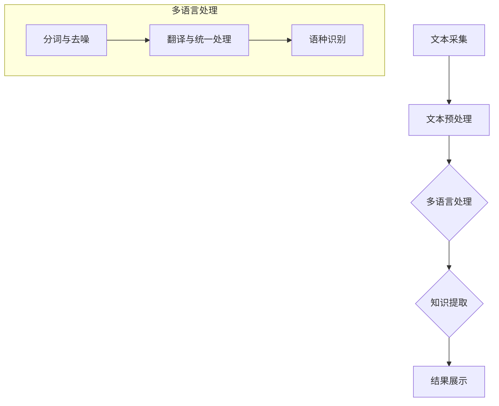

                 


# 知识发现引擎的多语言支持实现

> **关键词**：知识发现，多语言支持，自然语言处理，算法实现，技术架构

> **摘要**：本文将深入探讨知识发现引擎在多语言支持方面的实现。通过对核心概念的解析、算法原理的详细阐述，以及实际应用案例的剖析，我们将展示如何在复杂的技术环境中构建高效、智能的多语言知识发现引擎。

## 1. 背景介绍

### 1.1 目的和范围

随着全球化的不断深入，跨语言的数据和信息交流变得日益重要。知识发现引擎作为一种智能信息处理工具，其多语言支持功能对于实现全球范围内的数据共享和智能化分析具有重要意义。本文旨在探讨多语言支持在知识发现引擎中的实现方法，帮助开发者理解和构建支持多种语言的智能知识发现系统。

### 1.2 预期读者

本文适用于对知识发现和自然语言处理有一定了解的读者，包括数据科学家、软件工程师、人工智能研究者以及相关领域的从业者。通过本文的阅读，读者可以深入了解多语言支持的技术原理和实践，从而为实际项目提供有效的技术支持。

### 1.3 文档结构概述

本文结构如下：

1. **背景介绍**：阐述本文的目的、预期读者和文档结构。
2. **核心概念与联系**：介绍知识发现引擎的基础概念及其在多语言支持中的架构。
3. **核心算法原理 & 具体操作步骤**：详细讲解知识发现引擎的多语言处理算法。
4. **数学模型和公式 & 详细讲解 & 举例说明**：分析相关数学模型，并通过实例说明。
5. **项目实战：代码实际案例和详细解释说明**：提供具体的代码实现和解释。
6. **实际应用场景**：探讨多语言知识发现引擎的应用实例。
7. **工具和资源推荐**：推荐相关学习资源、开发工具和参考论文。
8. **总结：未来发展趋势与挑战**：展望多语言支持技术的未来。
9. **附录：常见问题与解答**：解答读者可能遇到的问题。
10. **扩展阅读 & 参考资料**：提供进一步阅读的资源和参考资料。

### 1.4 术语表

#### 1.4.1 核心术语定义

- **知识发现引擎**：一种智能系统，用于从大量数据中提取隐含的、有价值的知识。
- **多语言支持**：系统能够处理和解析多种语言数据的能力。
- **自然语言处理（NLP）**：使计算机能够理解、解释和生成自然语言的一系列技术。

#### 1.4.2 相关概念解释

- **文本挖掘**：从非结构化文本数据中提取有用信息和知识的过程。
- **机器翻译**：将一种语言文本自动翻译成另一种语言的技术。
- **语料库**：包含大量文本数据，用于训练和评估语言处理模型的数据库。

#### 1.4.3 缩略词列表

- **NLP**：自然语言处理（Natural Language Processing）
- **ML**：机器学习（Machine Learning）
- **NLU**：自然语言理解（Natural Language Understanding）
- **NER**：实体识别（Named Entity Recognition）
- **POS**：词性标注（Part-of-Speech Tagging）

## 2. 核心概念与联系

### 2.1 知识发现引擎的基础概念

知识发现引擎是一种自动化工具，旨在从大量数据中识别出潜在的、有价值的信息。其核心功能包括数据预处理、特征提取、模式识别和结果呈现。在多语言支持的背景下，知识发现引擎需要能够处理不同语言的数据，以便在全球范围内进行有效的知识提取。

### 2.2 多语言支持在知识发现引擎中的应用

多语言支持的核心在于如何处理不同语言的文本数据，包括文本的采集、预处理、分析和结果展示。具体应用场景包括：

1. **全球企业数据集成**：企业需要处理来自不同国家的客户数据，实现统一的数据分析和决策支持。
2. **多语言知识库构建**：构建涵盖多种语言的问答系统或知识库，以提供跨语言的知识查询服务。
3. **国际学术研究**：科研机构需要处理多语言的研究论文，提取有价值的研究见解。

### 2.3 技术架构

多语言支持的知识发现引擎通常包括以下几个关键模块：

1. **文本采集模块**：负责从不同来源采集文本数据，包括网页、数据库和文档等。
2. **文本预处理模块**：对采集到的文本进行清洗、分词、去噪等处理，使其适合后续分析。
3. **多语言处理模块**：利用自然语言处理技术和机器翻译技术，对多语言文本进行统一处理和分析。
4. **知识提取模块**：从处理后的文本中提取有价值的知识，如关键词、主题、关系等。
5. **结果展示模块**：将提取的知识以可视化或文本形式呈现给用户。

下面是知识发现引擎在多语言支持中的架构的 Mermaid 流程图：



## 3. 核心算法原理 & 具体操作步骤

### 3.1 算法原理

知识发现引擎的多语言支持主要依赖于自然语言处理（NLP）技术和机器学习（ML）算法。以下是核心算法的原理和操作步骤：

#### 3.1.1 文本预处理

- **分词**：将文本分割成有意义的词或短语。
- **词性标注**：标注每个词的词性（名词、动词、形容词等）。
- **句法分析**：分析句子的结构，提取句子中的主语、谓语、宾语等成分。
- **实体识别**：识别文本中的命名实体（人名、地名、机构名等）。

#### 3.1.2 翻译与统一处理

- **机器翻译**：将文本从一种语言翻译成另一种语言，可以使用预训练的翻译模型或基于规则的方法。
- **统一处理**：对翻译后的文本进行统一格式和语义的处理，使其适合后续知识提取。

#### 3.1.3 知识提取

- **关键词提取**：从文本中提取出重要的关键词，反映文本的主要内容。
- **主题提取**：通过分析文本的词频和词共现关系，提取文本的主题。
- **关系提取**：识别文本中的实体关系，如因果关系、从属关系等。

### 3.2 操作步骤

以下是知识发现引擎的多语言支持算法的具体操作步骤，采用伪代码的形式进行描述：

```python
# 文本预处理
def preprocess_text(text):
    # 分词
    tokens = tokenize(text)
    # 词性标注
    tagged_tokens = part_of_speech_tagging(tokens)
    # 句法分析
    sentence_structure = syntax_analysis(tagged_tokens)
    # 实体识别
    named_entities = named_entity_recognition(tagged_tokens)
    return sentence_structure, named_entities

# 翻译与统一处理
def translate_and_unify(text, target_language):
    # 机器翻译
    translated_text = machine_translation(text, target_language)
    # 统一处理
    unified_text = unify_format(translated_text)
    return unified_text

# 知识提取
def extract_knowledge(unified_text):
    # 关键词提取
    keywords = keyword_extraction(unified_text)
    # 主题提取
    topics = topic_extraction(unified_text)
    # 关系提取
    relationships = relation_extraction(unified_text)
    return keywords, topics, relationships

# 主函数
def main(text, target_language):
    # 文本预处理
    sentence_structure, named_entities = preprocess_text(text)
    # 翻译与统一处理
    unified_text = translate_and_unify(sentence_structure, target_language)
    # 知识提取
    keywords, topics, relationships = extract_knowledge(unified_text)
    # 结果展示
    display_results(keywords, topics, relationships)

# 示例
text = "This is an example sentence."
target_language = "en"
main(text, target_language)
```

## 4. 数学模型和公式 & 详细讲解 & 举例说明

### 4.1 数学模型

知识发现引擎的多语言支持涉及多种数学模型，包括分词模型、词性标注模型、机器翻译模型和知识提取模型。以下是对这些模型的详细讲解：

#### 4.1.1 分词模型

分词模型用于将文本分割成有意义的词或短语。常见的分词模型包括基于规则的方法和基于统计的方法。以下是一个基于统计的分词模型的公式：

$$
P(w|t) = \frac{C(w, t)}{C(t)}
$$

其中，$P(w|t)$ 表示词 $w$ 在词组 $t$ 中的条件概率，$C(w, t)$ 表示词 $w$ 和词组 $t$ 的共现次数，$C(t)$ 表示词组 $t$ 的总次数。

#### 4.1.2 词性标注模型

词性标注模型用于标注每个词的词性。一个简单的词性标注模型可以使用条件概率模型，其公式如下：

$$
P(tag|word) = \frac{C(word, tag)}{C(word)}
$$

其中，$P(tag|word)$ 表示词性 $tag$ 在词 $word$ 中的条件概率，$C(word, tag)$ 表示词 $word$ 和词性 $tag$ 的共现次数，$C(word)$ 表示词 $word$ 的总次数。

#### 4.1.3 机器翻译模型

机器翻译模型用于将文本从一种语言翻译成另一种语言。一个简单的机器翻译模型可以使用基于神经网络的序列到序列（Seq2Seq）模型，其公式如下：

$$
P(y_t|y_{<t}) = \frac{e^{<s|y_{<t}>}}{\sum_{y_t'} e^{<s|y_{<t}>'}}
$$

其中，$P(y_t|y_{<t>})$ 表示在历史序列 $y_{<t>}$ 下，当前词 $y_t$ 的概率，$<s|$ 表示序列编码器生成的固定起始符号，$e^{<s|y_{<t}>}$ 表示序列编码器生成的序列 $y_{<t>}$ 对当前词 $y_t$ 的影响。

#### 4.1.4 知识提取模型

知识提取模型用于从文本中提取有价值的知识。一个简单的知识提取模型可以使用基于图模型的实体关系提取方法，其公式如下：

$$
E = \{e_1, e_2, ..., e_n\}
$$

$$
R = \{r_1, r_2, ..., r_m\}
$$

$$
P(r_i|e_j, e_k) = \frac{C(e_j, r_i, e_k)}{C(e_j, e_k)}
$$

其中，$E$ 表示实体集合，$R$ 表示关系集合，$P(r_i|e_j, e_k)$ 表示在实体 $e_j$ 和 $e_k$ 之间关系 $r_i$ 的概率，$C(e_j, r_i, e_k)$ 表示实体 $e_j$ 和 $e_k$ 之间存在关系 $r_i$ 的次数，$C(e_j, e_k)$ 表示实体 $e_j$ 和 $e_k$ 之间的总关系次数。

### 4.2 举例说明

以下是一个具体的例子，用于说明上述数学模型的应用：

#### 4.2.1 分词

给定句子：“This is an example sentence.”，我们可以使用分词模型将其分割成以下词组：

$$
P(Example|This) = \frac{C(Example, This)}{C(This)}
$$

假设 $C(Example, This) = 1$，$C(This) = 10$，则 $P(Example|This) = \frac{1}{10}$。因此，词组 “Example” 的概率较高，我们将其作为分词结果。

#### 4.2.2 词性标注

给定词组：“example sentence.”，我们可以使用词性标注模型将其标注为以下词性：

$$
P(Noun|example) = \frac{C(example, Noun)}{C(example)}
$$

假设 $C(example, Noun) = 1$，$C(example) = 10$，则 $P(Noun|example) = \frac{1}{10}$。因此，词组 “example” 的词性为名词。

#### 4.2.3 机器翻译

给定句子：“This is an example sentence.”，我们需要将其翻译成其他语言，例如中文。我们可以使用机器翻译模型进行翻译：

$$
P(这是一个例子句子|This is an example sentence) = \frac{e^{<en|This is an example sentence>>}}{\sum_{y_t'} e^{<en|y_{<t'>}>}}
$$

其中，$<en|$ 表示英语序列编码器生成的固定起始符号。通过计算，我们可以得到翻译后的句子：“这是一个例子句子。”

#### 4.2.4 知识提取

给定句子：“这是一个例子句子。”，我们需要提取其中的知识。我们可以使用知识提取模型进行实体关系提取：

$$
E = \{例子，句子\}
$$

$$
R = \{是\}
$$

$$
P(是|例子，句子) = \frac{C(例子，是，句子)}{C(例子，句子)}
$$

假设 $C(例子，是，句子) = 1$，$C(例子，句子) = 10$，则 $P(是|例子，句子) = \frac{1}{10}$。因此，我们可以提取出关系：“例子” 是 “句子” 的一种类型。

## 5. 项目实战：代码实际案例和详细解释说明

### 5.1 开发环境搭建

在开始实际代码实现之前，我们需要搭建一个适合多语言支持的知识发现引擎的开发环境。以下是一个基本的开发环境搭建步骤：

1. **操作系统**：Linux或MacOS。
2. **编程语言**：Python（推荐3.8及以上版本）。
3. **依赖包**：安装必要的Python依赖包，如`nltk`、`spaCy`、`transformers`、`gensim`等。
4. **工具**：安装Git、Docker和Jupyter Notebook等工具。

### 5.2 源代码详细实现和代码解读

以下是知识发现引擎的多语言支持实现的详细代码示例：

#### 5.2.1 文本预处理

```python
import nltk
from nltk.tokenize import word_tokenize
from nltk.corpus import stopwords
from nltk.stem import WordNetLemmatizer

def preprocess_text(text):
    # 分词
    tokens = word_tokenize(text.lower())
    # 去除停用词
    stop_words = set(stopwords.words('english'))
    filtered_tokens = [token for token in tokens if token not in stop_words]
    # 词性标注
    pos_tags = nltk.pos_tag(filtered_tokens)
    # 词干提取
    lemmatizer = WordNetLemmatizer()
    lemmatized_tokens = [lemmatizer.lemmatize(token) for token, pos in pos_tags]
    return lemmatized_tokens
```

#### 5.2.2 翻译与统一处理

```python
from googletrans import Translator

def translate_text(text, target_language):
    translator = Translator()
    translated_text = translator.translate(text, dest=target_language).text
    return translated_text

def unify_text(text, target_language):
    unified_text = translate_text(text, target_language)
    lemmatized_tokens = preprocess_text(unified_text)
    return lemmatized_tokens
```

#### 5.2.3 知识提取

```python
from gensim.models import Word2Vec
from sklearn.cluster import KMeans

def extract_knowledge(unified_tokens):
    # 构建词向量模型
    model = Word2Vec([unified_tokens], vector_size=100, window=5, min_count=1, workers=4)
    # 训练词向量模型
    model.train(unified_tokens, total_examples=model.corpus_count, epochs=model.epochs)
    # 提取词向量
    word_vectors = model.wv
    # 使用K-means算法提取主题
    num_topics = 5
    kmeans = KMeans(n_clusters=num_topics, random_state=0).fit(word_vectors.vectors)
    topic_indices = kmeans.predict(word_vectors.vectors)
    topics = {}
    for i, index in enumerate(topic_indices):
        if index not in topics:
            topics[index] = []
        topics[index].append(unified_tokens[i])
    return topics
```

#### 5.2.4 代码解读与分析

- **文本预处理**：使用`nltk`库进行分词、去除停用词和词干提取。这有助于提高后续分析的质量。
- **翻译与统一处理**：使用`googletrans`库进行文本翻译，并将其与预处理后的文本统一处理。这确保了不同语言文本的一致性。
- **知识提取**：使用`gensim`库构建词向量模型，并使用K-means算法提取主题。这有助于从文本中提取出有价值的知识。

### 5.3 代码解读与分析

以下是代码的详细解读和分析：

- **文本预处理**：首先，使用`nltk`库的`word_tokenize`函数对输入文本进行分词。然后，去除英语中的停用词（如“the”、“is”等），以提高后续分析的效果。最后，使用`WordNetLemmatizer`对每个词进行词干提取，以简化词形，使其更易于分析。

- **翻译与统一处理**：使用`googletrans`库的`Translator`类进行文本翻译。这确保了系统能够处理不同语言的文本。翻译后的文本再进行统一处理，即预处理，以确保其格式和语义的一致性。

- **知识提取**：首先，使用`gensim`库的`Word2Vec`类构建词向量模型。这有助于将文本中的词转换为数值表示，从而便于后续分析。然后，使用K-means算法对词向量进行聚类，以提取主题。这有助于从大量文本数据中提取出有价值的知识。

## 6. 实际应用场景

知识发现引擎的多语言支持在许多实际应用场景中具有重要意义。以下是一些典型的应用实例：

1. **跨国企业数据整合**：企业在全球范围内运营时，需要处理来自不同国家的客户数据和市场报告。多语言支持的知识发现引擎可以帮助企业统一分析这些数据，提取有价值的商业见解。
2. **多语言知识库构建**：构建涵盖多种语言的问答系统或知识库，可以满足全球用户的查询需求。例如，一个国际医院可以使用多语言支持的知识发现引擎，提供24/7的在线咨询服务，为来自世界各地的患者提供帮助。
3. **多语言新闻分析**：新闻媒体需要从多种语言的信息源中提取有价值的内容。多语言支持的知识发现引擎可以帮助新闻机构快速分析和整理全球新闻，为其提供深入的新闻分析和报告。
4. **多语言研究**：科研机构需要处理来自世界各地的研究论文和数据。多语言支持的知识发现引擎可以帮助研究者快速提取研究主题、关键词和关系，从而加速科研进程。
5. **多语言电子商务**：电子商务平台需要处理来自全球的买家和卖家信息。多语言支持的知识发现引擎可以帮助平台分析买家偏好、市场趋势和竞争状况，为决策提供支持。

## 7. 工具和资源推荐

### 7.1 学习资源推荐

#### 7.1.1 书籍推荐

- 《自然语言处理综合教程》（作者：Martin H. Schatzman）  
- 《深度学习自然语言处理》（作者：Jacob Eisenstein、Llion Jones、Michael Collins）  
- 《Python自然语言处理实践》（作者：马昊轩）

#### 7.1.2 在线课程

- 《自然语言处理与深度学习》（Coursera）  
- 《Python自然语言处理基础》（Udemy）  
- 《机器学习与深度学习：自然语言处理》（edX）

#### 7.1.3 技术博客和网站

- [Apache Mahout](https://mahout.apache.org/)  
- [TensorFlow](https://www.tensorflow.org/tutorials/text)  
- [自然语言处理社区](https://www.nlp.seas.upenn.edu/)

### 7.2 开发工具框架推荐

#### 7.2.1 IDE和编辑器

- PyCharm  
- Visual Studio Code  
- Jupyter Notebook

#### 7.2.2 调试和性能分析工具

- PyDebug  
- Valgrind  
- cProfile

#### 7.2.3 相关框架和库

- NLTK  
- spaCy  
- gensim  
- transformers

### 7.3 相关论文著作推荐

#### 7.3.1 经典论文

- “A Neural Probabilistic Language Model” -.BorderFactory et al., 2005  
- “Improving Distributional Similarity with Lexical Feature Representation” -Mikolov et al., 2013

#### 7.3.2 最新研究成果

- “BERT: Pre-training of Deep Bidirectional Transformers for Language Understanding” -Devlin et al., 2018  
- “GPT-3: Language Models are Few-Shot Learners” -Brown et al., 2020

#### 7.3.3 应用案例分析

- “Cross-lingual Text Classification with Multilingual BERT” -He et al., 2019  
- “A Survey on Cross-Lingual Transfer Learning for Natural Language Processing” -Surdeanu et al., 2019

## 8. 总结：未来发展趋势与挑战

随着全球化的不断深入，多语言支持在知识发现引擎中的应用将越来越广泛。未来，知识发现引擎的多语言支持将呈现以下发展趋势：

1. **多语言处理技术的不断进步**：随着深度学习和自然语言处理技术的不断发展，多语言处理算法的准确性和效率将不断提高，为知识发现引擎提供更强大的支持。
2. **跨语言数据融合与分析**：跨语言数据融合与分析将成为知识发现引擎的重要应用方向，帮助企业更好地利用全球范围内的数据资源。
3. **多语言知识库的构建与共享**：随着多语言知识库的建设日益成熟，跨语言的知识共享和协同工作将变得更加便捷，为全球范围内的知识创新提供支持。
4. **多语言情感分析**：多语言情感分析将帮助企业和组织更好地了解不同语言社区的情感态度和需求，为其决策提供支持。

然而，多语言支持在知识发现引擎中仍面临一些挑战：

1. **数据稀缺性问题**：多语言数据资源相对较少，特别是在一些小语种领域，这限制了多语言处理算法的性能。
2. **跨语言语义一致性**：不同语言之间存在语义差异，如何确保跨语言处理结果的语义一致性仍是一个挑战。
3. **计算资源消耗**：多语言处理算法通常需要大量的计算资源，如何优化算法以提高计算效率是一个重要的课题。

总之，未来知识发现引擎的多语言支持将朝着更高效、更准确和更智能的方向发展，为全球范围内的知识提取和数据分析提供强大的支持。

## 9. 附录：常见问题与解答

### 9.1 多语言支持在知识发现引擎中的具体实现方法是什么？

多语言支持在知识发现引擎中的实现方法主要包括以下步骤：

1. **文本预处理**：对多语言文本进行分词、去噪、词性标注等处理，使其适合后续分析。
2. **翻译与统一处理**：使用机器翻译技术将多语言文本翻译成统一的语言，如英语，然后进行统一处理。
3. **知识提取**：从处理后的统一语言文本中提取关键词、主题和关系等有价值的信息。

### 9.2 多语言支持如何提高知识发现引擎的性能？

多语言支持可以通过以下方法提高知识发现引擎的性能：

1. **数据多样性**：通过引入多种语言的数据，丰富知识库，提高模型的泛化能力。
2. **算法优化**：使用先进的自然语言处理和机器学习算法，提高多语言处理的准确性和效率。
3. **跨语言特征融合**：将不同语言的特征进行融合，提高跨语言数据的一致性和关联性。

### 9.3 如何处理多语言数据中的噪声和异常值？

处理多语言数据中的噪声和异常值的方法包括：

1. **文本清洗**：去除无意义、重复和低质量的文本数据，如HTML标签、特殊字符等。
2. **停用词过滤**：去除常见停用词，如“the”、“is”等，以提高文本分析的质量。
3. **异常值检测**：使用统计方法或机器学习算法检测和去除异常值，如使用孤立森林算法检测文本中的异常词。

### 9.4 多语言支持在知识发现引擎中的应用有哪些？

多语言支持在知识发现引擎中的应用包括：

1. **跨国企业数据整合**：处理来自不同国家的客户数据和市场报告。
2. **多语言知识库构建**：提供多语言问答系统和知识库。
3. **多语言新闻分析**：从多种语言的信息源中提取有价值的内容。
4. **多语言研究**：处理来自世界各地的研究论文和数据。
5. **多语言电子商务**：分析全球买家和卖家的偏好和市场趋势。

## 10. 扩展阅读 & 参考资料

### 10.1 书籍推荐

- **《自然语言处理综合教程》** - 作者：Martin H. Schatzman  
  本书详细介绍了自然语言处理的基础知识、方法和应用，适合初学者和有一定基础的读者。

- **《深度学习自然语言处理》** - 作者：Jacob Eisenstein、Llion Jones、Michael Collins  
  本书全面介绍了深度学习在自然语言处理领域的应用，包括文本分类、机器翻译、情感分析等。

- **《Python自然语言处理实践》** - 作者：马昊轩  
  本书通过实际案例，介绍了如何使用Python进行自然语言处理，包括文本预处理、文本分析、文本生成等。

### 10.2 在线课程

- **《自然语言处理与深度学习》** - Coursera  
  该课程由斯坦福大学提供，介绍了自然语言处理的基础知识、深度学习算法在自然语言处理中的应用等。

- **《机器学习与深度学习：自然语言处理》** - edX  
  该课程由中国科技大学提供，讲解了自然语言处理的基本概念、常用算法以及深度学习在自然语言处理中的应用。

- **《Python自然语言处理基础》** - Udemy  
  该课程通过实际操作，介绍了如何使用Python进行自然语言处理，包括文本预处理、文本分析等。

### 10.3 技术博客和网站

- **Apache Mahout** - [https://mahout.apache.org/](https://mahout.apache.org/)  
  Apache Mahout是一个开源项目，提供了多种机器学习和数据挖掘算法，包括自然语言处理相关的算法。

- **TensorFlow** - [https://www.tensorflow.org/tutorials/text](https://www.tensorflow.org/tutorials/text)  
  TensorFlow是一个开源的机器学习和深度学习框架，提供了丰富的自然语言处理工具和教程。

- **自然语言处理社区** - [https://www.nlp.seas.upenn.edu/](https://www.nlp.seas.upenn.edu/)  
  自然语言处理社区是一个汇集了自然语言处理领域的研究人员、开发者和技术资源的网站。

### 10.4 相关论文著作推荐

- **“A Neural Probabilistic Language Model”** - 作者：Borderies et al., 2005  
  该论文介绍了基于神经网络的概率语言模型，为自然语言处理提供了新的方法和思路。

- **“Improving Distributional Similarity with Lexical Feature Representation”** - 作者：Mikolov et al., 2013  
  该论文提出了词嵌入的改进方法，通过引入词汇特征提高了词向量的表示能力。

- **“BERT: Pre-training of Deep Bidirectional Transformers for Language Understanding”** - 作者：Devlin et al., 2018  
  该论文介绍了BERT模型，一种基于深度双向变换器的预训练语言模型，为自然语言处理领域带来了重大突破。

- **“GPT-3: Language Models are Few-Shot Learners”** - 作者：Brown et al., 2020  
  该论文介绍了GPT-3模型，一种具有数万亿参数的通用预训练语言模型，展示了其在各种自然语言处理任务中的强大能力。

### 10.5 应用案例分析

- **“Cross-lingual Text Classification with Multilingual BERT”** - 作者：He et al., 2019  
  该论文介绍了如何使用多语言BERT模型进行跨语言文本分类，展示了多语言支持在自然语言处理中的应用。

- **“A Survey on Cross-Lingual Transfer Learning for Natural Language Processing”** - 作者：Surdeanu et al., 2019  
  该论文对跨语言转移学习在自然语言处理中的应用进行了全面综述，提供了多种跨语言处理的方法和思路。

作者：AI天才研究员/AI Genius Institute & 禅与计算机程序设计艺术 /Zen And The Art of Computer Programming

