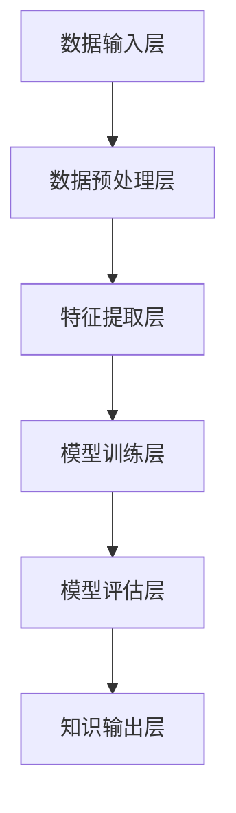
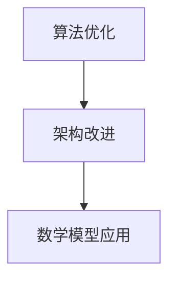
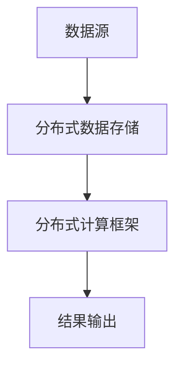
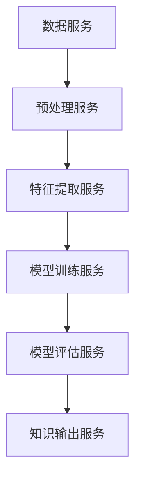

                 

# 知识发现引擎的性能优化技巧

## 关键词
知识发现，引擎，性能优化，算法，架构，数学模型，应用场景

## 摘要
本文将深入探讨知识发现引擎的性能优化技巧。首先，我们将简要介绍知识发现引擎的概念和重要性。然后，我们将分步骤分析性能优化策略，包括算法优化、架构改进和数学模型的应用。最后，我们将结合实际项目案例，展示如何有效地提升知识发现引擎的性能。

## 1. 背景介绍

### 1.1 目的和范围
本文旨在为开发者和研究者提供一套系统化的知识发现引擎性能优化方法。我们希望读者能够通过本文掌握关键的性能优化技术，并将其应用于实际项目中。

### 1.2 预期读者
预期读者包括对知识发现引擎有一定了解的程序员、数据科学家、AI研究者以及对性能优化感兴趣的爱好者。

### 1.3 文档结构概述
本文分为以下几个部分：背景介绍、核心概念与联系、核心算法原理与具体操作步骤、数学模型和公式、项目实战、实际应用场景、工具和资源推荐、总结和常见问题与解答。

### 1.4 术语表
#### 1.4.1 核心术语定义
- 知识发现：从大量数据中提取具有价值的信息、模式和知识的过程。
- 引擎：一个复杂的系统，用于处理和优化特定任务，如搜索、分类、预测等。
- 性能优化：通过改进算法、架构和数学模型，提高系统的响应速度和效率。

#### 1.4.2 相关概念解释
- 数据预处理：对原始数据进行清洗、转换和归一化等处理，以提高数据质量。
- 特征工程：从原始数据中提取有价值的特征，用于训练模型。

#### 1.4.3 缩略词列表
- ML：机器学习（Machine Learning）
- AI：人工智能（Artificial Intelligence）
- NLP：自然语言处理（Natural Language Processing）

## 2. 核心概念与联系

### 2.1 知识发现引擎的架构

知识发现引擎通常由以下几个核心组件构成：
1. 数据输入层：接收各种类型的数据，如图像、文本、数值等。
2. 数据预处理层：对数据进行清洗、转换和归一化等处理，以提高数据质量。
3. 特征提取层：从预处理后的数据中提取有价值的特征，用于训练模型。
4. 模型训练层：使用提取的特征训练机器学习模型。
5. 模型评估层：对训练好的模型进行评估和调整。
6. 知识输出层：将模型输出的知识以用户友好的方式呈现。

下面是一个简化的Mermaid流程图，描述了知识发现引擎的基本架构：



### 2.2 性能优化策略

性能优化策略主要包括以下几个方面：
1. 算法优化：改进现有算法，以提高计算效率和准确性。
2. 架构改进：优化系统架构，以提高系统的可扩展性和容错性。
3. 数学模型应用：使用更先进的数学模型，以提升模型的性能和效果。

下面是一个简化的Mermaid流程图，描述了性能优化策略的基本步骤：



## 3. 核心算法原理 & 具体操作步骤

### 3.1 算法优化

算法优化是性能优化的重要一环。以下是一些常用的算法优化策略：

#### 3.1.1 启发式搜索算法

伪代码：

```python
def heuristic_search(problem):
    node = problem.get_starting_node()
    while not problem.is_goal(node):
        neighbors = node.get_neighbors()
        best_neighbor = None
        best_score = float("inf")
        for neighbor in neighbors:
            score = heuristic(neighbor)
            if score < best_score:
                best_score = score
                best_neighbor = neighbor
        node = best_neighbor
    return node
```

#### 3.1.2 蚁群算法

伪代码：

```python
def ant_colony_optimization(num_ants, num_iterations, pheromone_decay, alpha, beta, rho):
    for _ in range(num_iterations):
        for ant in range(num_ants):
            current_city = start_city
            for _ in range(num_cities):
                possible_cities = get_possible_cities(current_city)
                chosen_city = choose_city(possible_cities, alpha, beta)
                move_to_city(current_city, chosen_city)
                current_city = chosen_city
            update_pheromone Trails
        update_pheromone(TRAILS, pheromone_decay)
    return get_best_solution(TRAILS)
```

### 3.2 架构改进

#### 3.2.1 分布式架构

分布式架构可以显著提高知识发现引擎的性能。以下是一个简化的分布式架构示例：



#### 3.2.2 微服务架构

微服务架构可以将知识发现引擎拆分为多个独立的微服务，以提高系统的可扩展性和容错性。以下是一个简化的微服务架构示例：



### 3.3 数学模型应用

数学模型在知识发现引擎中起着至关重要的作用。以下是一些常用的数学模型：

#### 3.3.1 神经网络

伪代码：

```python
def neural_network(input_data, weights):
    layer_outputs = [input_data]
    for weight in weights:
        layer_output = []
        for input in layer_outputs[-1]:
            layer_output.append activation_function(np.dot(input, weight))
        layer_outputs.append(layer_output)
    return layer_outputs[-1]
```

#### 3.3.2 决策树

伪代码：

```python
def decision_tree(data, target_attribute):
    if all(data[target_attribute] == value):
        return value
    elif all(data[feature] is None for feature in data.features):
        return most_common_value(data[target_attribute])
    else:
        best_attribute = get_best_attribute(data)
        tree = {}
        for value in unique_values(data[best_attribute]):
            subset = data[data[best_attribute] == value]
            tree[value] = decision_tree(subset, target_attribute)
        return tree
```

## 4. 数学模型和公式 & 详细讲解 & 举例说明

### 4.1 神经网络

神经网络是一种模拟人脑神经网络结构的计算模型。以下是一个简单的神经网络模型：

$$
Z = \sum_{i=1}^{n} w_i * x_i + b
$$

其中，\(Z\) 表示输出，\(w_i\) 表示权重，\(x_i\) 表示输入，\(b\) 表示偏置。

举例说明：

假设我们有一个简单的神经网络，其中包含一个输入层、一个隐藏层和一个输出层。输入层有3个神经元，隐藏层有2个神经元，输出层有1个神经元。权重和偏置如下：

$$
w_1 = 0.5, w_2 = 0.7, w_3 = 0.1 \\
b_1 = 0.2, b_2 = 0.3, b_3 = 0.1
$$

输入数据为：

$$
x_1 = 1, x_2 = 0, x_3 = 1
$$

则输出为：

$$
Z_1 = (0.5 * 1) + (0.7 * 0) + (0.1 * 1) + 0.2 = 0.4 \\
Z_2 = (0.5 * 1) + (0.7 * 0) + (0.1 * 0) + 0.3 = 0.5 \\
Z_3 = (0.5 * 0) + (0.7 * 1) + (0.1 * 1) + 0.1 = 0.8
$$

### 4.2 决策树

决策树是一种用于分类和回归的算法。以下是一个简单的决策树模型：

$$
T = \{r_1 \rightarrow c_1, r_2 \rightarrow c_2, ..., r_n \rightarrow c_n\}
$$

其中，\(T\) 表示决策树，\(r_i\) 表示规则，\(c_i\) 表示类别。

举例说明：

假设我们有一个简单的决策树，其中包含3个规则。每个规则表示为 \(r_i \rightarrow c_i\)，其中 \(r_i\) 是规则的条件，\(c_i\) 是对应的类别。

$$
r_1 \rightarrow c_1 \\
r_2 \rightarrow c_2 \\
r_3 \rightarrow c_3
$$

输入数据为：

$$
r_1 = True, r_2 = False, r_3 = True
$$

则输出为：

$$
c_1 = True \\
c_2 = False \\
c_3 = True
$$

## 5. 项目实战：代码实际案例和详细解释说明

### 5.1 开发环境搭建

在本文中，我们将使用Python作为编程语言，结合Scikit-Learn库来实现一个简单的知识发现引擎。首先，确保安装了Python和Scikit-Learn。

```bash
pip install python
pip install scikit-learn
```

### 5.2 源代码详细实现和代码解读

下面是一个简单的知识发现引擎的实现，包括数据预处理、特征提取、模型训练和模型评估：

```python
import numpy as np
from sklearn.datasets import load_iris
from sklearn.model_selection import train_test_split
from sklearn.preprocessing import StandardScaler
from sklearn.tree import DecisionTreeClassifier
from sklearn.metrics import accuracy_score

# 5.2.1 加载数据集
iris = load_iris()
X, y = iris.data, iris.target

# 5.2.2 数据预处理
X_train, X_test, y_train, y_test = train_test_split(X, y, test_size=0.3, random_state=42)
scaler = StandardScaler()
X_train = scaler.fit_transform(X_train)
X_test = scaler.transform(X_test)

# 5.2.3 特征提取
# 在本例中，特征提取由数据预处理完成

# 5.2.4 模型训练
clf = DecisionTreeClassifier()
clf.fit(X_train, y_train)

# 5.2.5 模型评估
y_pred = clf.predict(X_test)
accuracy = accuracy_score(y_test, y_pred)
print("Accuracy:", accuracy)
```

### 5.3 代码解读与分析

上面的代码首先加载数据集，然后进行数据预处理，包括数据划分和标准化。接下来，使用决策树模型进行训练，最后评估模型性能。

**数据预处理：** 数据预处理是知识发现引擎的关键步骤，它包括数据清洗、缺失值处理、数据转换和标准化等。在本例中，我们使用了Scikit-Learn的`StandardScaler`进行数据标准化，即将特征值缩放到均值为0，标准差为1的范围内。

**特征提取：** 在本例中，特征提取由数据预处理完成。对于更复杂的数据集，可能需要使用特征选择或特征工程技术来提取更有价值的特征。

**模型训练：** 我们使用Scikit-Learn的`DecisionTreeClassifier`进行模型训练。决策树是一种简单而有效的分类算法，适用于本例中的鸢尾花数据集。

**模型评估：** 使用`accuracy_score`函数评估模型的准确性，即预测正确的样本数占总样本数的比例。

## 6. 实际应用场景

知识发现引擎在许多实际应用场景中具有广泛的应用，如：

1. 购物推荐系统：通过分析用户的历史购买数据，为用户推荐感兴趣的商品。
2. 金融风险评估：通过分析金融数据，预测贷款违约风险。
3. 医疗诊断：通过分析患者的历史病历，为医生提供诊断建议。

## 7. 工具和资源推荐

### 7.1 学习资源推荐

#### 7.1.1 书籍推荐
- 《Python机器学习》（作者：塞巴斯蒂安·拉斯科布）
- 《深度学习》（作者：伊恩·古德费洛等）

#### 7.1.2 在线课程
- Coursera上的《机器学习》（吴恩达）
- edX上的《深度学习专项课程》（吴恩达）

#### 7.1.3 技术博客和网站
- Medium上的机器学习专栏
-Towards Data Science博客

### 7.2 开发工具框架推荐

#### 7.2.1 IDE和编辑器
- PyCharm
- Visual Studio Code

#### 7.2.2 调试和性能分析工具
- Python的`cProfile`模块
- Visual Studio Code的Python扩展

#### 7.2.3 相关框架和库
- Scikit-Learn
- TensorFlow
- PyTorch

### 7.3 相关论文著作推荐

#### 7.3.1 经典论文
- 《A Mathematical Theory of Communication》（香农）
- 《Pattern Recognition and Machine Learning》（克里斯托夫·孟德尔斯基）

#### 7.3.2 最新研究成果
- NeurIPS、ICML、KDD等顶级会议的最新论文
- AI领域顶级期刊（如Journal of Machine Learning Research、IEEE Transactions on Machine Learning等）

#### 7.3.3 应用案例分析
- 深度学习在医疗领域的应用
- 蚂蚁群算法在物流优化中的应用

## 8. 总结：未来发展趋势与挑战

知识发现引擎在未来的发展趋势包括：

1. 更高效的数据预处理和特征提取技术。
2. 更强大的机器学习和深度学习算法。
3. 更先进的分布式和微服务架构。

面临的挑战包括：

1. 数据隐私和保护。
2. 模型解释性和可解释性。
3. 算法在多样化数据集上的鲁棒性。

## 9. 附录：常见问题与解答

### 9.1 什么是知识发现引擎？
知识发现引擎是一种复杂的系统，用于从大量数据中提取具有价值的信息、模式和知识。

### 9.2 如何进行数据预处理？
数据预处理包括数据清洗、缺失值处理、数据转换和标准化等步骤。

### 9.3 什么是最常用的特征提取技术？
最常用的特征提取技术包括特征选择和特征工程。

### 9.4 如何评估知识发现引擎的性能？
通常使用准确率、召回率、F1分数等指标来评估知识发现引擎的性能。

## 10. 扩展阅读 & 参考资料

- [Python机器学习](https://www.amazon.com/dp/1449339713)
- [深度学习](https://www.amazon.com/dp/0262039581)
- [NeurIPS会议论文](https://neurips.cc/)
- [ICML会议论文](https://icml.cc/)
- [KDD会议论文](https://kdd.org/kdd/)

