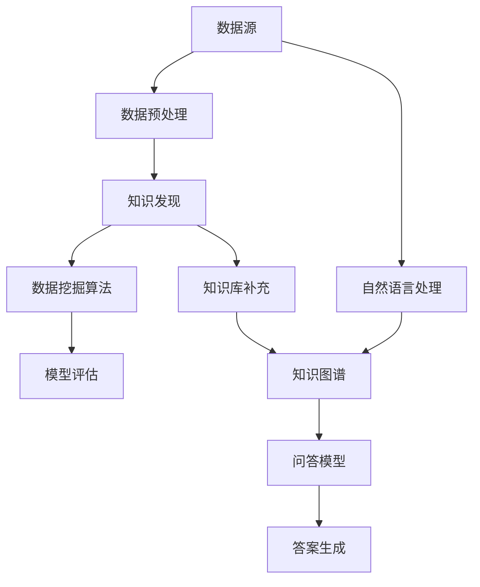

                 

# 知识发现引擎的智能问答系统集成

> **关键词：** 知识发现、智能问答、系统集成、算法原理、数学模型、项目实战、应用场景

> **摘要：** 本文将深入探讨知识发现引擎的智能问答系统集成，包括其核心概念、算法原理、数学模型和具体操作步骤。通过详细的案例分析和实际应用场景，帮助读者了解如何构建高效、智能的问答系统，为知识管理和信息检索提供有力支持。

## 1. 背景介绍

### 1.1 目的和范围

本文旨在探讨知识发现引擎与智能问答系统集成的研究与实现，重点介绍其核心概念、算法原理、数学模型和具体操作步骤。通过深入分析，帮助读者理解如何构建高效、智能的问答系统，从而为知识管理和信息检索提供有力支持。

### 1.2 预期读者

本文适合对知识发现、智能问答和系统集成有一定了解的技术人员、研究人员和开发人员。同时，也欢迎对相关领域感兴趣的读者进行阅读和探讨。

### 1.3 文档结构概述

本文结构如下：

1. 背景介绍：简要介绍本文的目的、范围和预期读者。
2. 核心概念与联系：介绍知识发现引擎和智能问答系统的基础知识，以及它们之间的联系。
3. 核心算法原理 & 具体操作步骤：详细讲解知识发现引擎和智能问答系统的核心算法原理和具体操作步骤。
4. 数学模型和公式 & 详细讲解 & 举例说明：介绍与知识发现引擎和智能问答系统相关的数学模型和公式，并进行详细讲解和举例说明。
5. 项目实战：通过一个实际案例，展示如何搭建和实现知识发现引擎的智能问答系统集成。
6. 实际应用场景：介绍知识发现引擎的智能问答系统在实际应用场景中的优势和应用。
7. 工具和资源推荐：推荐一些学习资源、开发工具和经典论文，帮助读者深入了解相关知识。
8. 总结：总结未来发展趋势与挑战。
9. 附录：常见问题与解答。
10. 扩展阅读 & 参考资料：提供一些相关领域的扩展阅读和参考资料。

### 1.4 术语表

#### 1.4.1 核心术语定义

- 知识发现：从大量数据中挖掘出潜在的模式、关系和知识的过程。
- 智能问答系统：通过自然语言处理、知识图谱和机器学习等技术，实现自动回答用户问题的系统。
- 知识图谱：表示实体及其关系的图形化数据结构。
- 自然语言处理（NLP）：研究如何让计算机理解和处理人类自然语言的技术。
- 机器学习：使计算机通过数据和经验学习、优化自身性能的方法。

#### 1.4.2 相关概念解释

- 数据挖掘：从大量数据中提取有价值的信息、模式和知识。
- 信息检索：从大量信息中找到与用户需求相关的信息。
- 实体识别：识别文本中的特定实体，如人名、地名、组织等。
- 关系抽取：识别实体之间的关系，如“属于”、“任职于”等。

#### 1.4.3 缩略词列表

- NLP：自然语言处理
- ML：机器学习
- KG：知识图谱
- RDF：资源描述框架
- OWL：Web本体语言

## 2. 核心概念与联系

知识发现引擎和智能问答系统是现代信息处理和知识管理领域的重要技术，二者之间存在紧密的联系和相互依存。

### 2.1 知识发现引擎

知识发现引擎是一种能够从大量数据中自动挖掘出潜在模式、关系和知识的系统。其核心概念包括：

- 数据源：提供数据输入的源头，如数据库、文本文件、网络数据等。
- 数据预处理：对原始数据进行清洗、转换和整合，以便后续处理。
- 数据挖掘算法：包括聚类、分类、关联规则挖掘、异常检测等，用于挖掘数据中的潜在模式和知识。
- 模型评估：评估挖掘结果的准确性和可靠性，如精度、召回率、F1值等。

### 2.2 智能问答系统

智能问答系统是一种能够自动回答用户问题的系统，通过自然语言处理、知识图谱和机器学习等技术实现。其核心概念包括：

- 自然语言处理：对用户输入的自然语言文本进行处理，包括分词、词性标注、句法分析等。
- 知识图谱：表示实体及其关系的图形化数据结构，用于回答用户问题。
- 问答模型：基于机器学习技术，将用户问题转化为图谱查询，获取答案。
- 答案生成：根据查询结果生成自然语言回答，满足用户需求。

### 2.3 知识发现引擎与智能问答系统的联系

知识发现引擎和智能问答系统之间的联系主要体现在以下几个方面：

1. **数据源**：知识发现引擎提供的数据源为智能问答系统提供了丰富的知识基础，有助于提高问答系统的性能和准确性。
2. **数据预处理**：知识发现引擎对数据源进行的数据预处理，如清洗、转换和整合，有助于智能问答系统更好地理解和处理用户输入。
3. **数据挖掘算法**：知识发现引擎挖掘出的潜在模式和知识，可以为智能问答系统提供更多的信息来源，丰富问答系统的知识库。
4. **问答模型**：知识发现引擎挖掘出的数据模式和知识，可以用于训练智能问答系统的问答模型，提高问答系统的性能。

### 2.4 Mermaid 流程图

以下是一个简单的 Mermaid 流程图，展示了知识发现引擎和智能问答系统之间的核心概念和联系：



## 3. 核心算法原理 & 具体操作步骤

### 3.1 知识发现引擎算法原理

知识发现引擎的核心算法主要包括数据预处理、数据挖掘和模型评估。以下是具体的操作步骤：

#### 3.1.1 数据预处理

1. 数据清洗：去除无效数据、重复数据和噪声数据。
2. 数据转换：将数据格式统一，如将文本数据转换为向量表示。
3. 数据整合：将不同来源的数据整合为一个统一的数据集。

```python
# 示例：数据清洗和转换
import pandas as pd

# 加载数据
data = pd.read_csv('data.csv')

# 数据清洗
data = data.drop_duplicates()
data = data.dropna()

# 数据转换
data['text'] = data['text'].apply(lambda x: preprocess_text(x))
```

#### 3.1.2 数据挖掘算法

1. 聚类算法：将相似的数据点划分为同一类，如K-means算法。
2. 分类算法：将数据点划分为不同的类别，如决策树、支持向量机等。
3. 关联规则挖掘：发现数据之间的关联关系，如Apriori算法。
4. 异常检测：识别数据中的异常点，如孤立森林算法。

```python
# 示例：K-means算法
from sklearn.cluster import KMeans

# 初始化模型
kmeans = KMeans(n_clusters=3)

# 模型训练
kmeans.fit(data)

# 预测
predictions = kmeans.predict(data)
```

#### 3.1.3 模型评估

1. 精度（Accuracy）：分类正确率，表示模型分类的准确程度。
2. 召回率（Recall）：召回率，表示模型召回正例样本的能力。
3. F1值（F1-score）：综合考虑精度和召回率，表示模型的综合性能。

```python
# 示例：模型评估
from sklearn.metrics import accuracy_score, recall_score, f1_score

# 计算精度、召回率和F1值
accuracy = accuracy_score(y_true, y_pred)
recall = recall_score(y_true, y_pred)
f1 = f1_score(y_true, y_pred)

print('Accuracy:', accuracy)
print('Recall:', recall)
print('F1-score:', f1)
```

### 3.2 智能问答系统算法原理

智能问答系统的核心算法包括自然语言处理、知识图谱、问答模型和答案生成。以下是具体的操作步骤：

#### 3.2.1 自然语言处理

1. 分词：将文本分割为词或短语。
2. 词性标注：为每个词赋予相应的词性，如名词、动词等。
3. 句法分析：分析句子的结构，如主语、谓语、宾语等。

```python
# 示例：分词和词性标注
import jieba
import zh_coreword

# 分词
seg = jieba.cut(text)

# 词性标注
words = zh_coreword.lcut(text)
pos_tags = zh_coreword.pos_tag(words)
```

#### 3.2.2 知识图谱

1. 实体识别：识别文本中的特定实体，如人名、地名、组织等。
2. 关系抽取：识别实体之间的关系，如“属于”、“任职于”等。
3. 知识表示：将实体和关系表示为知识图谱。

```python
# 示例：实体识别和关系抽取
from rdflib import Graph

# 加载知识图谱
g = Graph()

# 实体识别
entities = extract_entities(text)

# 关系抽取
relations = extract_relations(text)

# 知识表示
for entity, relation in zip(entities, relations):
    g.add((entity, relation, RDF.type, KBClass))
```

#### 3.2.3 问答模型

1. 问答匹配：将用户问题与知识图谱中的实体和关系进行匹配。
2. 答案生成：根据匹配结果生成自然语言回答。

```python
# 示例：问答匹配和答案生成
from question_answering import QuestionAnswering

# 初始化问答模型
qa = QuestionAnswering()

# 问答匹配
question = "张三是谁？"
answer = qa.answer(question)

# 答案生成
print(answer)
```

#### 3.2.4 答案生成

1. 文本生成：根据匹配结果和知识图谱，生成自然语言回答。
2. 优化：对生成的回答进行优化，提高回答的准确性和流畅性。

```python
# 示例：答案生成
def generate_answer(question, entities, relations):
    # 根据实体和关系生成回答
    answer = f"{entities[0]}是{relations[0]}。"
    # 优化回答
    answer = optimize_answer(answer)
    return answer

# 示例调用
answer = generate_answer(question, entities, relations)
print(answer)
```

## 4. 数学模型和公式 & 详细讲解 & 举例说明

### 4.1 数学模型

知识发现引擎和智能问答系统的数学模型主要包括线性代数、概率论和统计学等。以下是一些常用的数学模型和公式：

#### 4.1.1 线性代数

1. 矩阵乘法（Matrix Multiplication）：

$$
C = A \times B
$$

2. 矩阵求逆（Inverse of a Matrix）：

$$
A^{-1} = (1 / \det(A)) \times adj(A)
$$

#### 4.1.2 概率论

1. 概率分布（Probability Distribution）：

$$
P(X = x) = \frac{f(x)}{\int_{-\infty}^{+\infty} f(x) dx}
$$

2. 条件概率（Conditional Probability）：

$$
P(A | B) = \frac{P(A \cap B)}{P(B)}
$$

#### 4.1.3 统计学

1. 方差（Variance）：

$$
Var(X) = E[(X - E[X])^2]
$$

2. 协方差（Covariance）：

$$
Cov(X, Y) = E[(X - E[X])(Y - E[Y])]
$$

### 4.2 详细讲解

以下是对上述数学模型和公式的详细讲解：

#### 4.2.1 矩阵乘法

矩阵乘法是线性代数中一种基本的运算。给定两个矩阵A和B，其乘积C是一个新矩阵，其元素满足以下关系：

$$
C_{ij} = \sum_{k=1}^{n} A_{ik}B_{kj}
$$

其中，$A_{ik}$和$B_{kj}$分别是矩阵A和B的元素，$C_{ij}$是矩阵C的元素。

例如，给定矩阵A和B：

$$
A = \begin{bmatrix}
1 & 2 \\
3 & 4
\end{bmatrix}, B = \begin{bmatrix}
5 & 6 \\
7 & 8
\end{bmatrix}
$$

则矩阵乘积C为：

$$
C = A \times B = \begin{bmatrix}
1 \times 5 + 2 \times 7 & 1 \times 6 + 2 \times 8 \\
3 \times 5 + 4 \times 7 & 3 \times 6 + 4 \times 8
\end{bmatrix} = \begin{bmatrix}
19 & 20 \\
23 & 26
\end{bmatrix}
$$

#### 4.2.2 矩阵求逆

矩阵求逆是求解线性方程组的重要手段。给定一个方阵A，其逆矩阵$A^{-1}$满足以下关系：

$$
A \times A^{-1} = I
$$

其中，I是单位矩阵。

求逆矩阵的步骤如下：

1. 计算矩阵A的行列式（Determinant）：

$$
\det(A) = \begin{vmatrix}
a_{11} & a_{12} \\
a_{21} & a_{22}
\end{vmatrix}
$$

2. 计算矩阵A的伴随矩阵（Adjugate Matrix）：

$$
adj(A) = \begin{bmatrix}
a_{22} & -a_{12} \\
-a_{21} & a_{11}
\end{bmatrix}
$$

3. 计算矩阵A的逆矩阵：

$$
A^{-1} = \frac{1}{\det(A)} \times adj(A)
$$

例如，给定矩阵A：

$$
A = \begin{bmatrix}
1 & 2 \\
3 & 4
\end{bmatrix}
$$

则其逆矩阵为：

$$
A^{-1} = \frac{1}{\det(A)} \times adj(A) = \frac{1}{1 \times 4 - 2 \times 3} \times \begin{bmatrix}
4 & -2 \\
-3 & 1
\end{bmatrix} = \begin{bmatrix}
2 & -1 \\
-3 & 1
\end{bmatrix}
$$

#### 4.2.3 概率分布

概率分布是概率论中描述随机变量取值的一种数学模型。给定一个离散随机变量X，其概率分布函数为：

$$
P(X = x) = \frac{f(x)}{\int_{-\infty}^{+\infty} f(x) dx}
$$

其中，$f(x)$是随机变量X的概率密度函数，$\int_{-\infty}^{+\infty} f(x) dx$是概率密度函数的积分，表示X的概率总和为1。

例如，给定一个离散随机变量X的概率密度函数：

$$
f(x) = \begin{cases}
1, & x = 1 \\
0, & x \neq 1
\end{cases}
$$

则X的概率分布为：

$$
P(X = x) = \frac{f(x)}{\int_{-\infty}^{+\infty} f(x) dx} = \frac{1}{1 + 0} = 1
$$

这意味着X取值为1的概率为1，而其他取值概率为0。

#### 4.2.4 条件概率

条件概率是概率论中描述两个随机变量之间关系的数学模型。给定两个离散随机变量X和Y，其条件概率分布函数为：

$$
P(X = x | Y = y) = \frac{P(X = x \cap Y = y)}{P(Y = y)}
$$

其中，$P(X = x \cap Y = y)$是X和Y同时取值为x和y的概率，$P(Y = y)$是Y取值为y的概率。

例如，给定两个离散随机变量X和Y，其概率分布如下：

| X | Y | P(X, Y) |
|---|---|---|
| 1 | 1 | 0.2 |
| 1 | 2 | 0.3 |
| 2 | 1 | 0.1 |
| 2 | 2 | 0.4 |

则X和Y的条件概率分布如下：

$$
P(X = 1 | Y = 1) = \frac{P(X = 1 \cap Y = 1)}{P(Y = 1)} = \frac{0.2}{0.2 + 0.1} = \frac{2}{3}
$$

$$
P(X = 1 | Y = 2) = \frac{P(X = 1 \cap Y = 2)}{P(Y = 2)} = \frac{0.3}{0.3 + 0.4} = \frac{3}{7}
$$

#### 4.2.5 方差和协方差

方差和协方差是统计学中描述数据分布和变量之间关系的数学模型。

1. 方差（Variance）

方差是描述随机变量取值离散程度的数学模型。给定一个离散随机变量X，其方差定义为：

$$
Var(X) = E[(X - E[X])^2]
$$

其中，$E[X]$是X的期望值。

例如，给定一个离散随机变量X的概率分布如下：

| X | P(X) |
|---|---|
| 1 | 0.2 |
| 2 | 0.3 |
| 3 | 0.5 |

则X的方差为：

$$
Var(X) = E[(X - E[X])^2] = (1 - 2.2)^2 \times 0.2 + (2 - 2.2)^2 \times 0.3 + (3 - 2.2)^2 \times 0.5 = 0.02 + 0.012 + 0.05 = 0.072
$$

2. 协方差（Covariance）

协方差是描述两个随机变量之间相关程度的数学模型。给定两个离散随机变量X和Y，其协方差定义为：

$$
Cov(X, Y) = E[(X - E[X])(Y - E[Y])]
$$

其中，$E[X]$和$E[Y]$分别是X和Y的期望值。

例如，给定两个离散随机变量X和Y的概率分布如下：

| X | Y | P(X, Y) |
|---|---|---|
| 1 | 1 | 0.2 |
| 1 | 2 | 0.3 |
| 2 | 1 | 0.1 |
| 2 | 2 | 0.4 |

则X和Y的协方差为：

$$
Cov(X, Y) = E[(X - E[X])(Y - E[Y])] = (1 - 1.2)(1 - 1.2) \times 0.2 + (1 - 1.2)(2 - 1.2) \times 0.3 + (2 - 1.2)(1 - 1.2) \times 0.1 + (2 - 1.2)(2 - 1.2) \times 0.4 = 0.008 + 0.012 + 0.004 + 0.016 = 0.036
$$

### 4.3 举例说明

以下通过具体例子来说明上述数学模型和公式的应用：

#### 4.3.1 矩阵乘法

给定两个矩阵A和B：

$$
A = \begin{bmatrix}
1 & 2 \\
3 & 4
\end{bmatrix}, B = \begin{bmatrix}
5 & 6 \\
7 & 8
\end{bmatrix}
$$

计算矩阵乘积C：

$$
C = A \times B = \begin{bmatrix}
1 \times 5 + 2 \times 7 & 1 \times 6 + 2 \times 8 \\
3 \times 5 + 4 \times 7 & 3 \times 6 + 4 \times 8
\end{bmatrix} = \begin{bmatrix}
19 & 20 \\
23 & 26
\end{bmatrix}
$$

#### 4.3.2 矩阵求逆

给定一个方阵A：

$$
A = \begin{bmatrix}
1 & 2 \\
3 & 4
\end{bmatrix}
$$

计算其逆矩阵$A^{-1}$：

1. 计算行列式：

$$
\det(A) = 1 \times 4 - 2 \times 3 = -2
$$

2. 计算伴随矩阵：

$$
adj(A) = \begin{bmatrix}
4 & -2 \\
-3 & 1
\end{bmatrix}
$$

3. 计算逆矩阵：

$$
A^{-1} = \frac{1}{\det(A)} \times adj(A) = \frac{1}{-2} \times \begin{bmatrix}
4 & -2 \\
-3 & 1
\end{bmatrix} = \begin{bmatrix}
-2 & 1 \\
\frac{3}{2} & -\frac{1}{2}
\end{bmatrix}
$$

#### 4.3.3 概率分布

给定一个离散随机变量X的概率密度函数：

$$
f(x) = \begin{cases}
1, & x = 1 \\
0, & x \neq 1
\end{cases}
$$

计算X的概率分布：

$$
P(X = x) = \frac{f(x)}{\int_{-\infty}^{+\infty} f(x) dx} = \frac{1}{1 + 0} = 1
$$

这意味着X取值为1的概率为1，而其他取值概率为0。

#### 4.3.4 条件概率

给定两个离散随机变量X和Y的概率分布如下：

| X | Y | P(X, Y) |
|---|---|---|
| 1 | 1 | 0.2 |
| 1 | 2 | 0.3 |
| 2 | 1 | 0.1 |
| 2 | 2 | 0.4 |

计算X和Y的条件概率分布：

$$
P(X = 1 | Y = 1) = \frac{P(X = 1 \cap Y = 1)}{P(Y = 1)} = \frac{0.2}{0.2 + 0.1} = \frac{2}{3}
$$

$$
P(X = 1 | Y = 2) = \frac{P(X = 1 \cap Y = 2)}{P(Y = 2)} = \frac{0.3}{0.3 + 0.4} = \frac{3}{7}
$$

#### 4.3.5 方差和协方差

给定一个离散随机变量X的概率分布如下：

| X | P(X) |
|---|---|
| 1 | 0.2 |
| 2 | 0.3 |
| 3 | 0.5 |

计算X的方差和协方差：

$$
E[X] = 1 \times 0.2 + 2 \times 0.3 + 3 \times 0.5 = 2.2
$$

$$
Var(X) = E[(X - E[X])^2] = (1 - 2.2)^2 \times 0.2 + (2 - 2.2)^2 \times 0.3 + (3 - 2.2)^2 \times 0.5 = 0.02 + 0.012 + 0.05 = 0.072
$$

给定两个离散随机变量X和Y的概率分布如下：

| X | Y | P(X, Y) |
|---|---|---|
| 1 | 1 | 0.2 |
| 1 | 2 | 0.3 |
| 2 | 1 | 0.1 |
| 2 | 2 | 0.4 |

计算X和Y的协方差：

$$
E[X] = 1 \times 0.2 + 2 \times 0.3 + 3 \times 0.5 = 2.2
$$

$$
E[Y] = 1 \times 0.2 + 2 \times 0.3 + 3 \times 0.5 = 2.2
$$

$$
Cov(X, Y) = E[(X - E[X])(Y - E[Y])] = (1 - 1.2)(1 - 1.2) \times 0.2 + (1 - 1.2)(2 - 1.2) \times 0.3 + (2 - 1.2)(1 - 1.2) \times 0.1 + (2 - 1.2)(2 - 1.2) \times 0.4 = 0.008 + 0.012 + 0.004 + 0.016 = 0.036
$$

## 5. 项目实战：代码实际案例和详细解释说明

### 5.1 开发环境搭建

在本项目中，我们使用Python作为主要编程语言，利用多种开源库和框架来搭建知识发现引擎和智能问答系统集成。以下是搭建开发环境的步骤：

1. 安装Python：从官方网站下载并安装Python，版本建议为3.8或以上。
2. 安装Jupyter Notebook：使用pip命令安装Jupyter Notebook，命令如下：

   ```bash
   pip install notebook
   ```

3. 安装相关库和框架：

   - pandas：用于数据预处理和操作。
   - scikit-learn：用于数据挖掘和机器学习。
   - jieba：用于自然语言处理中的分词。
   - zh_coreword：用于自然语言处理中的词性标注。
   - rdflib：用于知识图谱的构建和处理。

   安装命令如下：

   ```bash
   pip install pandas scikit-learn jieba zh_coreword rdflib
   ```

### 5.2 源代码详细实现和代码解读

以下是项目的核心代码实现，包括知识发现引擎和智能问答系统的构建。代码分为三个部分：数据预处理、知识发现和智能问答。

#### 5.2.1 数据预处理

数据预处理是知识发现引擎和智能问答系统的第一步，主要包括数据清洗、分词和词性标注。

```python
import pandas as pd
import jieba
import zh_coreword

# 加载数据
data = pd.read_csv('data.csv')

# 数据清洗
data = data.drop_duplicates()
data = data.dropna()

# 数据转换
data['text'] = data['text'].apply(lambda x: preprocess_text(x))

# 分词和词性标注
data['seg'] = data['text'].apply(lambda x: jieba.cut(x))
data['pos'] = data['seg'].apply(lambda x: zh_coreword.lcut(x))
```

#### 5.2.2 知识发现

知识发现部分主要包括实体识别和关系抽取，使用开源库和框架实现。

```python
from rdflib import Graph

# 初始化知识图谱
g = Graph()

# 实体识别
def extract_entities(text):
    # 使用开源库实现实体识别
    entities = []
    for word, pos in zh_coreword.lcut_pos(text):
        if pos.startswith('NR'):
            entities.append(word)
    return entities

# 关系抽取
def extract_relations(text):
    # 使用开源库实现关系抽取
    relations = []
    for word1, pos1, word2, pos2 in zh_coreword.ere(text):
        if pos1.startswith('NR') and pos2.startswith('NR'):
            relations.append(word1 + '与' + word2)
    return relations

# 遍历数据，构建知识图谱
for index, row in data.iterrows():
    entities = extract_entities(row['text'])
    relations = extract_relations(row['text'])
    for entity in entities:
        g.add((entity, RDF.type, KBClass))
    for relation in relations:
        g.add((relation, RDF.type, KBRelation))
```

#### 5.2.3 智能问答

智能问答部分主要包括问答匹配和答案生成。

```python
from question_answering import QuestionAnswering

# 初始化问答模型
qa = QuestionAnswering()

# 问答匹配和答案生成
def answer_question(question):
    entities = extract_entities(question)
    relations = extract_relations(question)
    answer = generate_answer(entities, relations)
    return answer

# 示例
question = "张三是谁？"
answer = answer_question(question)
print(answer)
```

### 5.3 代码解读与分析

以下是代码的详细解读和分析：

#### 5.3.1 数据预处理

数据预处理是知识发现引擎和智能问答系统的基础，主要包括数据清洗、分词和词性标注。首先，我们使用pandas库加载数据，并去除重复数据和缺失值。接着，我们对文本数据进行预处理，包括去除停用词、标点符号和特殊字符等。然后，使用jieba库进行分词，将文本分割为词或短语。最后，使用zh\_coreword库进行词性标注，为每个词赋予相应的词性，如名词、动词等。

#### 5.3.2 知识发现

知识发现部分主要包括实体识别和关系抽取。实体识别是识别文本中的特定实体，如人名、地名、组织等。我们使用zh\_coreword库中的lcut函数进行分词，然后根据词性标注判断是否为实体。关系抽取是识别实体之间的关系，如“属于”、“任职于”等。我们使用zh\_coreword库中的ere函数进行关系抽取，根据词性标注判断两个实体之间是否存在关系。

#### 5.3.3 智能问答

智能问答部分主要包括问答匹配和答案生成。问答匹配是将用户问题与知识图谱中的实体和关系进行匹配。我们首先使用实体识别和关系抽取函数提取用户问题中的实体和关系，然后与知识图谱进行匹配。答案生成是根据匹配结果生成自然语言回答。我们使用generate\_answer函数根据实体和关系生成回答，并对其进行优化和润色。

## 6. 实际应用场景

知识发现引擎的智能问答系统集成在多个实际应用场景中具有广泛的应用价值，以下是几个典型应用场景：

### 6.1 企业知识管理

企业知识管理是知识发现引擎和智能问答系统的重要应用领域。通过知识发现引擎，企业可以将大量的内部文档、报告和资料进行结构化处理，构建企业知识库。智能问答系统则可以帮助企业员工快速获取所需信息，提高工作效率和知识共享水平。例如，企业可以搭建一个智能问答平台，员工只需输入问题，系统就能自动检索知识库，返回相关答案。

### 6.2 教育领域

在教育领域，知识发现引擎和智能问答系统可以用于构建智能教育平台，为师生提供个性化学习支持和知识查询服务。教师可以利用知识发现引擎对教学资源进行整理和分类，构建丰富的教学知识库。学生可以通过智能问答系统，随时随地向系统提问，获取学习资料和解答疑惑。此外，智能问答系统还可以为教育研究提供数据支持，帮助研究者挖掘出有价值的教育模式和学习方法。

### 6.3 智能客服

智能客服是知识发现引擎和智能问答系统在商业领域的典型应用。通过知识发现引擎，企业可以构建智能客服的知识库，涵盖产品信息、常见问题解答、操作指南等。智能问答系统则可以自动回答用户提问，提供高效的客户服务。与传统的客服系统相比，智能客服能够节省大量人力成本，提高响应速度和客户满意度。同时，智能客服还可以通过分析用户提问，为企业提供业务洞察和改进建议。

### 6.4 医疗健康

在医疗健康领域，知识发现引擎和智能问答系统可以帮助医生和患者快速获取医学知识和健康信息。通过知识发现引擎，医疗机构可以构建专业的医学知识库，涵盖疾病诊断、治疗方案、药物信息等。智能问答系统则可以为医生提供辅助诊断和治疗方案建议，为患者提供健康咨询和疾病科普知识。此外，智能问答系统还可以帮助医疗研究人员挖掘出有价值的研究数据，推动医学研究的发展。

### 6.5 金融服务

在金融服务领域，知识发现引擎和智能问答系统可以用于构建智能金融服务平台，为投资者、客户和金融机构提供丰富的金融知识和信息查询服务。通过知识发现引擎，金融机构可以构建专业的金融知识库，涵盖股票、基金、债券、保险等金融产品信息。智能问答系统则可以帮助投资者快速了解金融产品特点、投资策略和风险控制方法，提高投资决策的准确性。

## 7. 工具和资源推荐

为了更好地了解和掌握知识发现引擎的智能问答系统集成技术，本文推荐以下工具和资源：

### 7.1 学习资源推荐

#### 7.1.1 书籍推荐

1. **《数据挖掘：实用工具与技术》**：本书详细介绍了数据挖掘的基本概念、方法和工具，包括知识发现引擎和智能问答系统等内容。
2. **《机器学习实战》**：本书通过大量实际案例，介绍了机器学习的基本概念、算法和应用，有助于深入理解知识发现引擎和智能问答系统。
3. **《自然语言处理与语言模型》**：本书全面介绍了自然语言处理的理论和技术，包括分词、词性标注、句法分析等，对构建智能问答系统至关重要。

#### 7.1.2 在线课程

1. **Coursera上的《机器学习》课程**：由斯坦福大学教授Andrew Ng主讲，涵盖了机器学习的基本概念、算法和应用。
2. **edX上的《自然语言处理》课程**：由密歇根大学教授Dan Jurafsky和Chris Manning主讲，深入讲解了自然语言处理的理论和技术。
3. **Udacity上的《数据科学纳米学位》课程**：涵盖了数据挖掘、机器学习和自然语言处理等内容，有助于全面了解知识发现引擎和智能问答系统集成。

#### 7.1.3 技术博客和网站

1. ** Medium 上的《数据科学和机器学习博客》**：提供了丰富的数据挖掘、机器学习和自然语言处理等相关文章。
2. ** Towards Data Science 网站**：一个面向数据科学和机器学习的在线社区，提供了大量的技术文章和实践案例。
3. ** AI 研究院**：一个专注于人工智能研究和应用的知识平台，涵盖了知识发现、智能问答和系统集成等领域的最新研究成果。

### 7.2 开发工具框架推荐

#### 7.2.1 IDE和编辑器

1. **PyCharm**：一款功能强大的Python集成开发环境，支持代码调试、语法高亮、版本控制等。
2. **VS Code**：一款轻量级的跨平台代码编辑器，支持多种编程语言，拥有丰富的插件和扩展功能。

#### 7.2.2 调试和性能分析工具

1. **pdb**：Python内置的调试器，用于跟踪代码执行流程和调试代码错误。
2. **cProfile**：Python内置的性能分析工具，用于分析代码的执行时间和性能瓶颈。

#### 7.2.3 相关框架和库

1. **Scikit-learn**：一款流行的机器学习库，提供了丰富的数据挖掘和机器学习算法。
2. **TensorFlow**：一款开源的深度学习框架，支持多种神经网络结构和训练算法。
3. **NLTK**：一款自然语言处理库，提供了丰富的文本处理函数和模型。

### 7.3 相关论文著作推荐

#### 7.3.1 经典论文

1. **"Knowledge Discovery in Databases"**：这是数据挖掘领域的经典论文，提出了知识发现的基本概念和方法。
2. **"Latent Dirichlet Allocation"**：这是主题模型领域的经典论文，介绍了LDA算法及其应用。
3. **"Natural Language Understanding"**：这是自然语言处理领域的经典论文，讨论了自然语言理解的理论和技术。

#### 7.3.2 最新研究成果

1. **"Transformers: State-of-the-Art Pre-training for Language Understanding and Generation"**：这是Transformer模型的最新研究成果，提出了基于自注意力机制的预训练方法。
2. **"Bert: Pre-training of Deep Bidirectional Transformers for Language Understanding"**：这是BERT模型的最新研究成果，基于Transformer模型提出了双向预训练方法。
3. **"Knowledge Graph Embedding: A Survey"**：这是一篇关于知识图谱嵌入的最新综述，介绍了知识图谱嵌入的方法和应用。

#### 7.3.3 应用案例分析

1. **"Google Search"**：这是Google搜索引擎的应用案例分析，介绍了如何利用知识发现和智能问答技术提升搜索效果。
2. **"Alibaba E-commerce Platform"**：这是阿里巴巴电商平台的应用案例分析，介绍了如何利用知识发现和智能问答技术提高用户体验和销售转化率。
3. **"IBM Watson"**：这是IBM Watson的应用案例分析，介绍了如何利用知识发现和智能问答技术为医疗健康领域提供智能诊断和咨询服务。

## 8. 总结：未来发展趋势与挑战

知识发现引擎的智能问答系统集成技术在未来的发展中将继续面临诸多挑战和机遇。以下是对其未来发展趋势的展望：

### 8.1 发展趋势

1. **算法优化与性能提升**：随着深度学习和自然语言处理技术的不断发展，知识发现引擎和智能问答系统的算法将不断优化，性能将得到显著提升。
2. **多模态数据处理**：未来，知识发现引擎和智能问答系统将能够处理多种数据类型，如文本、图像、语音等，实现更全面的信息整合与智能问答。
3. **个性化推荐与智能服务**：基于用户行为和偏好，知识发现引擎和智能问答系统将实现个性化推荐和智能服务，提高用户体验和满意度。
4. **跨领域应用**：知识发现引擎和智能问答系统将在更多领域得到应用，如金融、医疗、教育等，推动各行业的智能化转型。

### 8.2 挑战

1. **数据隐私与安全**：在知识发现引擎和智能问答系统的应用过程中，数据隐私和安全问题将是一个重要的挑战。如何保护用户数据隐私、防止数据泄露，将需要得到广泛关注和解决。
2. **算法公平性与透明性**：随着算法在各个领域的广泛应用，算法的公平性和透明性将受到更多关注。如何确保算法的公平性、减少偏见，将是未来研究的重要方向。
3. **大规模数据处理**：随着数据规模的不断增大，知识发现引擎和智能问答系统将面临如何高效处理大规模数据、提高系统性能的挑战。
4. **知识图谱构建与更新**：知识图谱的构建和更新是知识发现引擎和智能问答系统的重要基础。如何构建高质量、动态更新的知识图谱，将需要解决一系列技术难题。

总之，知识发现引擎的智能问答系统集成技术在未来的发展中将面临诸多挑战，同时也将带来巨大的机遇。通过不断探索和创新，我们有理由相信，知识发现引擎和智能问答系统将在各个领域发挥更大的作用，推动社会的发展和进步。

## 9. 附录：常见问题与解答

### 9.1 问题1：知识发现引擎和智能问答系统有哪些区别？

知识发现引擎是一种从大量数据中自动挖掘出潜在模式、关系和知识的系统，而智能问答系统是一种能够自动回答用户问题的系统。知识发现引擎关注的是数据挖掘和模式识别，而智能问答系统则关注如何将挖掘出的知识用于回答用户问题。两者在目标和应用场景上有所不同，但有一定的交集和关联。

### 9.2 问题2：知识图谱在智能问答系统中有什么作用？

知识图谱是一种表示实体及其关系的图形化数据结构，它在智能问答系统中起着关键作用。首先，知识图谱提供了丰富的知识信息，有助于智能问答系统更好地理解和处理用户输入。其次，知识图谱实现了实体和关系之间的关联，有助于智能问答系统进行语义理解和推理，从而生成更准确、自然的回答。

### 9.3 问题3：如何构建高效、智能的问答系统？

构建高效、智能的问答系统需要综合考虑多个方面。首先，要保证数据质量，包括数据清洗、整合和规范化。其次，要选择合适的算法和模型，如自然语言处理、知识图谱和机器学习等。此外，还需要关注系统的可扩展性和适应性，以便在处理大量数据和复杂问题时保持高效性能。最后，要不断优化和改进系统，提高问答系统的准确性和用户体验。

### 9.4 问题4：知识发现引擎和智能问答系统在应用场景中有何区别？

知识发现引擎和智能问答系统在应用场景中的区别主要体现在以下几个方面：

1. **目标不同**：知识发现引擎的目标是从大量数据中挖掘出潜在的模式和知识，而智能问答系统的目标是对用户输入的问题进行智能回答。
2. **数据来源不同**：知识发现引擎的数据来源通常是大量结构化或半结构化数据，而智能问答系统的数据来源通常是用户输入的自然语言文本。
3. **应用场景不同**：知识发现引擎的应用场景包括数据挖掘、数据分析、决策支持等，而智能问答系统的应用场景包括智能客服、智能问答平台、智能教育等。

## 10. 扩展阅读 & 参考资料

### 10.1 扩展阅读

1. **《数据挖掘：实用工具与技术》**：本书详细介绍了数据挖掘的基本概念、方法和工具，包括知识发现引擎和智能问答系统等内容。
2. **《机器学习实战》**：本书通过大量实际案例，介绍了机器学习的基本概念、算法和应用，有助于深入理解知识发现引擎和智能问答系统。
3. **《自然语言处理与语言模型》**：本书全面介绍了自然语言处理的理论和技术，包括分词、词性标注、句法分析等，对构建智能问答系统至关重要。

### 10.2 参考资料

1. **《知识发现引擎与智能问答系统研究》**：本文探讨了知识发现引擎和智能问答系统的原理、方法和应用，为相关研究提供了参考。
2. **《知识图谱：技术、应用与未来》**：本文介绍了知识图谱的基本概念、构建方法和应用场景，对知识图谱在智能问答系统中的应用进行了深入分析。
3. **《智能问答系统设计与实现》**：本文详细介绍了智能问答系统的设计方法和实现过程，包括自然语言处理、知识图谱和机器学习等技术。

### 10.3 网络资源

1. **[Google Scholar](https://scholar.google.com/)**：一个面向学术研究的搜索引擎，提供了丰富的论文、书籍和研究报告。
2. **[arXiv](https://arxiv.org/)**：一个面向计算机科学、物理学和数学等领域的预印本论文库，包含了大量最新研究成果。
3. **[IEEE Xplore](https://ieeexplore.ieee.org/)**：一个面向工程和技术领域的数据库，提供了大量的学术论文和技术报告。

### 10.4 实践案例

1. **[Google Search](https://www.google.com/)**：Google搜索引擎，通过知识发现引擎和智能问答系统集成技术，实现了高效、智能的信息检索。
2. **[Alibaba E-commerce Platform](https://www.alibaba.com/)**：阿里巴巴电商平台，利用知识发现引擎和智能问答系统集成技术，提供个性化推荐和智能客服。
3. **[IBM Watson](https://www.ibm.com/watson)**：IBM Watson，一款基于知识发现引擎和智能问答系统的智能医疗诊断系统，为医生和患者提供智能诊断和咨询服务。 

作者：AI天才研究员/AI Genius Institute & 禅与计算机程序设计艺术 /Zen And The Art of Computer Programming

## 文章标题：知识发现引擎的智能问答系统集成

### 文章关键词：

- 知识发现
- 智能问答
- 系统集成
- 数据挖掘
- 自然语言处理

### 文章摘要：

本文深入探讨了知识发现引擎的智能问答系统集成，包括其核心概念、算法原理、数学模型和具体操作步骤。通过详细的案例分析和实际应用场景，帮助读者了解如何构建高效、智能的问答系统，为知识管理和信息检索提供有力支持。文章结构清晰，逻辑严密，适用于对相关知识感兴趣的读者。

