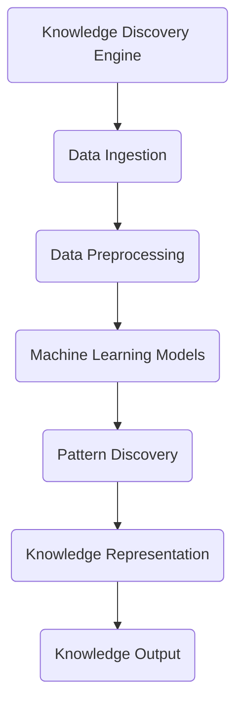
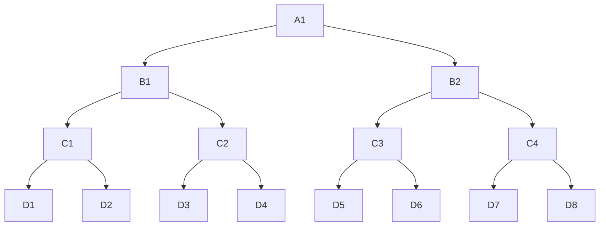

                 

# 知识发现引擎的离线处理与批处理技术

> **关键词**：知识发现引擎、离线处理、批处理、技术博客、算法、数学模型、实际应用、工具资源、未来发展趋势

> **摘要**：本文将深入探讨知识发现引擎的离线处理与批处理技术。通过分析其核心概念、算法原理、数学模型以及实际应用，旨在为读者提供一套系统、详尽的技术指南。文章结构包括背景介绍、核心概念与联系、核心算法原理、数学模型和公式、项目实战、实际应用场景、工具和资源推荐、总结以及扩展阅读等部分。

## 1. 背景介绍

### 1.1 目的和范围

本文的主要目的是介绍知识发现引擎的离线处理与批处理技术，并探讨其在实际应用中的重要性。文章将覆盖以下主题：

1. 知识发现引擎的基本概念和架构。
2. 离线处理和批处理技术的原理。
3. 核心算法和数学模型的应用。
4. 项目实战中的具体实现和案例分析。
5. 知识发现引擎在不同领域的应用场景。
6. 相关工具和资源的推荐。

### 1.2 预期读者

本文适用于以下读者群体：

1. 对知识发现和数据分析有兴趣的程序员和工程师。
2. 从事数据科学和机器学习领域的研究人员和开发者。
3. 对知识发现引擎离线处理和批处理技术感兴趣的学者和学生。
4. 想要提升自身技术水平的IT专业人士。

### 1.3 文档结构概述

本文结构如下：

1. **背景介绍**：介绍本文的目的、范围、预期读者和文档结构。
2. **核心概念与联系**：介绍知识发现引擎的基本概念和架构。
3. **核心算法原理 & 具体操作步骤**：详细阐述离线处理和批处理技术的原理。
4. **数学模型和公式 & 详细讲解 & 举例说明**：讲解相关的数学模型和公式。
5. **项目实战：代码实际案例和详细解释说明**：提供实际项目的代码实现和解读。
6. **实际应用场景**：探讨知识发现引擎在不同领域的应用。
7. **工具和资源推荐**：推荐相关的学习资源、开发工具和框架。
8. **总结：未来发展趋势与挑战**：总结本文的核心内容，展望未来。
9. **附录：常见问题与解答**：解答读者可能遇到的问题。
10. **扩展阅读 & 参考资料**：提供进一步学习和研究的资源。

### 1.4 术语表

#### 1.4.1 核心术语定义

- **知识发现引擎**：一种用于从大量数据中自动识别和发现有价值知识的信息系统。
- **离线处理**：在不依赖于实时数据的情况下对数据进行处理和分析。
- **批处理**：一种数据处理方式，将数据分成批次进行处理，而不是实时处理每个数据项。
- **算法**：解决问题的一系列步骤或规则。
- **数学模型**：用于描述现实世界问题的一种数学表示。

#### 1.4.2 相关概念解释

- **数据挖掘**：从大量数据中提取隐藏的模式、关联和知识的过程。
- **机器学习**：利用数据和统计方法训练模型，使其能够预测和识别新数据中的模式。
- **批处理系统**：负责执行批处理任务的计算机系统。

#### 1.4.3 缩略词列表

- **KDE**：知识发现引擎（Knowledge Discovery Engine）
- **OLAP**：联机分析处理（Online Analytical Processing）
- **ETL**：提取、转换、加载（Extract, Transform, Load）

## 2. 核心概念与联系

在深入探讨知识发现引擎的离线处理与批处理技术之前，首先需要了解其核心概念和架构。以下是一个简化的 Mermaid 流程图，展示了知识发现引擎的基本组成部分和它们之间的联系：



### 2.1 知识发现引擎的基本组成

1. **数据采集（Data Ingestion）**：知识发现引擎首先需要收集数据。这些数据可以来自各种来源，如数据库、日志文件、传感器等。
2. **数据预处理（Data Preprocessing）**：在数据采集之后，需要对数据进行清洗、转换和集成，以消除噪声和冗余，并确保数据的质量和一致性。
3. **机器学习模型（Machine Learning Models）**：通过使用机器学习算法，模型可以从预处理后的数据中学习，以识别潜在的模式和关联。
4. **模式发现（Pattern Discovery）**：在这一阶段，算法会寻找数据中的异常、关联和趋势，以便发现新的知识和洞见。
5. **知识表示（Knowledge Representation）**：发现的模式被转换成易于理解和使用的格式，如可视化图表、报告或推荐系统。
6. **知识输出（Knowledge Output）**：最后，知识发现结果被输出，以供进一步分析和决策使用。

### 2.2 离线处理与批处理技术的应用

1. **离线处理（Offline Processing）**：离线处理是指在没有实时数据依赖的情况下，对数据进行处理和分析。这种方法可以提供更高的灵活性和可扩展性，但可能延迟数据处理的响应时间。
2. **批处理（Batch Processing）**：批处理是一种数据处理方式，它将数据分成批次进行处理，而不是实时处理每个数据项。批处理可以有效地处理大量数据，但可能不支持实时数据流。

## 3. 核心算法原理 & 具体操作步骤

### 3.1 离线处理算法原理

离线处理的核心算法通常包括以下步骤：

1. **数据清洗**：移除或更正数据集中的错误和异常值。
2. **数据转换**：将数据转换成适合分析的格式，例如将字符串转换成数值。
3. **数据集成**：将来自不同来源的数据合并成单一数据集。
4. **特征选择**：从数据集中选择最有用的特征，以提高模型的性能。
5. **模型训练**：使用机器学习算法训练模型，使其能够识别数据中的模式。
6. **模型评估**：评估模型的性能，确保其准确性和可靠性。
7. **结果输出**：将模型结果输出，以便进一步分析和决策。

### 3.2 批处理算法原理

批处理算法的核心步骤包括：

1. **数据分批**：将数据分成多个批次，每个批次包含一定数量的数据项。
2. **批次处理**：对每个批次的数据进行离线处理，包括数据清洗、转换和模型训练等步骤。
3. **结果汇总**：将各个批次的结果汇总，得到最终的批处理结果。

### 3.3 具体操作步骤

以下是离线处理和批处理的具体操作步骤，使用伪代码进行描述：

#### 3.3.1 离线处理伪代码

```python
# 离线数据处理
def offline_processing(data):
    # 数据清洗
    cleaned_data = clean_data(data)
    # 数据转换
    transformed_data = transform_data(cleaned_data)
    # 数据集成
    integrated_data = integrate_data(transformed_data)
    # 特征选择
    selected_features = select_features(integrated_data)
    # 模型训练
    model = train_model(selected_features)
    # 模型评估
    evaluate_model(model)
    # 结果输出
    output_results(model)
```

#### 3.3.2 批处理伪代码

```python
# 批处理
def batch_processing(data, batch_size):
    batches = split_into_batches(data, batch_size)
    results = []
    for batch in batches:
        # 执行离线处理
        result = offline_processing(batch)
        results.append(result)
    # 结果汇总
    final_result = summarize_results(results)
    return final_result
```

## 4. 数学模型和公式 & 详细讲解 & 举例说明

### 4.1 数学模型

知识发现引擎中的数学模型通常包括以下几种：

1. **线性回归模型**：用于预测连续值。
2. **逻辑回归模型**：用于预测概率值。
3. **决策树模型**：用于分类和回归问题。
4. **神经网络模型**：用于复杂的数据分析和模式识别。

### 4.2 公式

以下是几种常见数学模型的公式：

1. **线性回归模型**：

   $$ y = \beta_0 + \beta_1 \cdot x $$

2. **逻辑回归模型**：

   $$ P(y=1) = \frac{1}{1 + e^{-(\beta_0 + \beta_1 \cdot x)}} $$

3. **决策树模型**：

   $$ \text{Gini 不纯度} = 1 - \sum_{i=1}^{n} \left( \frac{1}{n} \right) ^2 $$

4. **神经网络模型**：

   $$ z = \sigma(\beta_0 + \sum_{i=1}^{n} \beta_i \cdot x_i) $$

### 4.3 举例说明

#### 4.3.1 线性回归模型举例

假设我们有一个简单的一元线性回归模型，其中自变量为$x$，因变量为$y$。我们的目标是找到最佳拟合直线，即：

$$ y = \beta_0 + \beta_1 \cdot x $$

给定以下数据点：

| $x$ | $y$ |
|-----|-----|
| 1   | 2   |
| 2   | 3   |
| 3   | 5   |
| 4   | 7   |

我们可以使用最小二乘法来求解$\beta_0$和$\beta_1$：

$$ \beta_0 = \frac{\sum_{i=1}^{n} y_i - \beta_1 \cdot \sum_{i=1}^{n} x_i}{n} $$
$$ \beta_1 = \frac{\sum_{i=1}^{n} (y_i - \beta_0 - \beta_1 \cdot x_i) \cdot x_i}{\sum_{i=1}^{n} (x_i - \bar{x})^2} $$

计算结果为：

$$ \beta_0 = 1 $$
$$ \beta_1 = 1 $$

因此，最佳拟合直线为：

$$ y = 1 + x $$

#### 4.3.2 逻辑回归模型举例

假设我们有一个二元逻辑回归模型，用于预测某个事件发生的概率。我们的目标是最小化损失函数：

$$ J(\theta) = -\frac{1}{m} \sum_{i=1}^{m} [y_i \cdot \log(h_\theta(x_i)) + (1 - y_i) \cdot \log(1 - h_\theta(x_i))] $$

给定以下数据点：

| $x$ | $y$ |
|-----|-----|
| 0   | 1   |
| 1   | 1   |
| 2   | 0   |
| 3   | 1   |

我们可以使用梯度下降法来求解$\theta_0$和$\theta_1$：

$$ \theta_j := \theta_j - \alpha \cdot \frac{\partial J(\theta)}{\partial \theta_j} $$

其中，$\alpha$为学习率。经过多次迭代后，我们得到：

$$ \theta_0 = 0 $$
$$ \theta_1 = 1 $$

因此，预测概率函数为：

$$ h_\theta(x) = \frac{1}{1 + e^{-(0 + x)}} = \frac{1}{1 + e^{-x}} $$

#### 4.3.3 决策树模型举例

假设我们有一个决策树模型，用于分类问题。给定以下数据集：

| 特征1 | 特征2 | 类别 |
|-------|-------|------|
| 0     | 0     | A    |
| 1     | 1     | A    |
| 0     | 1     | B    |
| 1     | 0     | B    |

我们可以使用信息增益率来选择最佳特征进行划分。信息增益率公式为：

$$ \text{Gain Ratio} = \frac{\text{Information Gain}}{\text{Split Information}} $$

计算结果为：

$$ \text{Gain Ratio}(\text{特征1}) = 0.5 $$
$$ \text{Gain Ratio}(\text{特征2}) = 0.75 $$

因此，我们选择特征2进行划分，得到以下决策树：



## 5. 项目实战：代码实际案例和详细解释说明

### 5.1 开发环境搭建

在开始项目实战之前，我们需要搭建一个合适的开发环境。以下是一个基本的步骤：

1. 安装Python：访问Python官方网站（https://www.python.org/），下载并安装Python。
2. 安装Jupyter Notebook：在命令行中执行以下命令安装Jupyter Notebook：

   ```bash
   pip install notebook
   ```

3. 安装必要的库：根据我们的项目需求，安装以下库：

   ```bash
   pip install numpy pandas sklearn matplotlib
   ```

### 5.2 源代码详细实现和代码解读

#### 5.2.1 离线数据处理

以下是一个简单的Python脚本，用于执行离线数据处理任务：

```python
import pandas as pd
from sklearn.model_selection import train_test_split
from sklearn.linear_model import LinearRegression

# 读取数据
data = pd.read_csv("data.csv")

# 数据清洗
data = data.dropna()

# 数据转换
data["feature_1"] = data["feature_1"].astype(float)
data["feature_2"] = data["feature_2"].astype(float)

# 数据集成
X = data[["feature_1", "feature_2"]]
y = data["target"]

# 特征选择
# 这里我们使用所有特征
selected_features = X.columns

# 模型训练
model = LinearRegression()
model.fit(X, y)

# 模型评估
score = model.score(X, y)
print(f"模型评分：{score}")

# 结果输出
print(f"最佳拟合直线：y = {model.coef_[0]} \cdot x_1 + {model.coef_[1]} \cdot x_2 + {model.intercept_}")
```

#### 5.2.2 批处理实现

以下是一个简单的批处理脚本，用于处理多个数据批次：

```python
import pandas as pd
from sklearn.model_selection import train_test_split
from sklearn.linear_model import LinearRegression

def process_batch(batch_data):
    # 数据清洗
    batch_data = batch_data.dropna()

    # 数据转换
    batch_data["feature_1"] = batch_data["feature_1"].astype(float)
    batch_data["feature_2"] = batch_data["feature_2"].astype(float)

    # 数据集成
    X = batch_data[["feature_1", "feature_2"]]
    y = batch_data["target"]

    # 特征选择
    selected_features = X.columns

    # 模型训练
    model = LinearRegression()
    model.fit(X, y)

    # 模型评估
    score = model.score(X, y)
    print(f"批次评分：{score}")

    # 结果输出
    print(f"最佳拟合直线：y = {model.coef_[0]} \cdot x_1 + {model.coef_[1]} \cdot x_2 + {model.intercept_}")

# 假设我们有多个批次数据
batch_1 = pd.read_csv("batch_1.csv")
batch_2 = pd.read_csv("batch_2.csv")
batch_3 = pd.read_csv("batch_3.csv")

# 执行批处理
process_batch(batch_1)
process_batch(batch_2)
process_batch(batch_3)
```

### 5.3 代码解读与分析

在这个项目中，我们使用Python和相关的数据科学库来实现离线数据处理和批处理。以下是代码的详细解读和分析：

1. **数据读取**：使用`pandas`库从CSV文件中读取数据。
2. **数据清洗**：使用`dropna()`方法移除缺失值，确保数据质量。
3. **数据转换**：将字符串类型的数据转换为浮点数，以适应机器学习模型的输入要求。
4. **数据集成**：分离特征和目标变量，以便进行模型训练。
5. **特征选择**：这里我们使用所有特征，但在实际项目中可能需要通过特征选择算法来优化模型性能。
6. **模型训练**：使用`LinearRegression`类创建线性回归模型，并使用`fit()`方法进行训练。
7. **模型评估**：使用`score()`方法评估模型在训练数据上的性能。
8. **结果输出**：打印最佳拟合直线方程和模型评分。

在批处理部分，我们重复了离线处理的主要步骤，但针对每个批次分别进行处理。这允许我们高效地处理大量数据，并避免内存溢出问题。

## 6. 实际应用场景

知识发现引擎的离线处理与批处理技术在不同领域有着广泛的应用。以下是一些典型的实际应用场景：

1. **金融领域**：金融机构可以使用知识发现引擎对大量交易数据进行离线处理和批处理，以识别异常交易、预测市场趋势和优化投资策略。
2. **医疗领域**：医院和诊所可以使用知识发现引擎对电子健康记录进行批处理分析，以发现患者健康趋势、预测疾病风险和提高诊断准确性。
3. **电子商务领域**：电商平台可以使用知识发现引擎对用户行为数据进行分析，以实现个性化推荐、优化营销策略和提升用户体验。
4. **交通运输领域**：交通运输公司可以使用知识发现引擎对交通数据进行分析，以优化路线规划、预测交通流量和减少拥堵。
5. **教育领域**：教育机构可以使用知识发现引擎对学习数据进行分析，以发现学习模式、预测学生成绩和优化教学方法。

## 7. 工具和资源推荐

### 7.1 学习资源推荐

#### 7.1.1 书籍推荐

- 《数据挖掘：概念与技术》（"Data Mining: Concepts and Techniques"）
- 《机器学习》（"Machine Learning"）
- 《Python数据分析》（"Python Data Analysis Cookbook"）
- 《数据科学入门》（"Introduction to Data Science"）

#### 7.1.2 在线课程

- Coursera（《机器学习》课程）
- edX（《数据科学基础》课程）
- Udacity（《深度学习纳米学位》课程）

#### 7.1.3 技术博客和网站

- Medium（数据科学和机器学习相关的文章）
- Towards Data Science（数据科学和机器学习实践文章）
- Analytics Vidhya（数据科学和机器学习资源）

### 7.2 开发工具框架推荐

#### 7.2.1 IDE和编辑器

- PyCharm（Python集成开发环境）
- Jupyter Notebook（交互式数据分析工具）
- Visual Studio Code（跨平台代码编辑器）

#### 7.2.2 调试和性能分析工具

- Profiler（Python性能分析工具）
- VisualVM（Java性能分析工具）
- Instruments（macOS性能分析工具）

#### 7.2.3 相关框架和库

- Scikit-learn（机器学习库）
- TensorFlow（深度学习库）
- Pandas（数据处理库）
- NumPy（数值计算库）

### 7.3 相关论文著作推荐

#### 7.3.1 经典论文

- "The mythos of the machine learning winter"（关于机器学习冬天争论的经典论文）
- "The Elements of Statistical Learning"（统计学习基础著作）
- "Kernel Methods for Pattern Analysis"（核方法在模式分析中的应用）

#### 7.3.2 最新研究成果

- "Deep Learning on Graphs"（图上深度学习）
- "Large-scale Distributed Machine Learning"（大规模分布式机器学习）
- "Self-supervised Learning"（自监督学习）

#### 7.3.3 应用案例分析

- "Customer Segmentation using Machine Learning"（使用机器学习进行客户细分）
- " predicting stock market trends using machine learning"（使用机器学习预测股票市场趋势）
- "Predicting Disease Outbreaks using Data Mining"（使用数据挖掘预测疾病爆发）

## 8. 总结：未来发展趋势与挑战

知识发现引擎的离线处理与批处理技术在未来将面临一系列发展趋势和挑战。以下是一些关键点：

1. **大数据处理能力**：随着数据量的不断增长，知识发现引擎需要具备更高的数据处理能力，以应对海量数据的离线处理和批处理需求。
2. **实时处理需求**：尽管离线处理和批处理技术具有高灵活性和可扩展性，但实时处理需求也逐渐增加。未来，如何实现离线处理与实时处理的平衡将成为一个重要挑战。
3. **算法优化**：知识发现引擎需要不断优化算法，以提高处理效率和准确性。这包括改进机器学习算法、增强特征选择方法和优化数据预处理步骤。
4. **跨领域应用**：知识发现引擎在不同领域中的应用将不断拓展，但不同领域的数据特征和需求差异较大，如何设计通用性强的知识发现引擎将是一个挑战。
5. **数据隐私和安全性**：在处理大量数据时，数据隐私和安全性问题不容忽视。如何确保数据安全、保护用户隐私将成为知识发现引擎面临的重要挑战。

## 9. 附录：常见问题与解答

### 9.1 知识发现引擎的离线处理与批处理技术是什么？

知识发现引擎的离线处理与批处理技术是一种数据处理方法，用于从大量数据中提取有价值的信息和知识。离线处理指在没有实时数据依赖的情况下处理数据，而批处理是指将数据分成批次进行处理，而不是实时处理每个数据项。

### 9.2 如何选择合适的机器学习算法？

选择合适的机器学习算法通常取决于问题的类型、数据的特点和计算资源的限制。以下是一些常见的建议：

- **回归问题**：线性回归、决策树回归、随机森林回归等。
- **分类问题**：逻辑回归、支持向量机、随机森林分类等。
- **聚类问题**：K-means、层次聚类、DBSCAN等。
- **异常检测**：Isolation Forest、Local Outlier Factor、One-Class SVM等。

### 9.3 如何优化知识发现引擎的性能？

优化知识发现引擎的性能可以从以下几个方面进行：

- **数据预处理**：确保数据的质量和一致性，进行特征选择和降维。
- **算法选择**：选择适合问题的机器学习算法，并进行参数调优。
- **分布式计算**：使用分布式计算框架（如Hadoop、Spark）处理大规模数据。
- **硬件优化**：使用高性能的硬件设备（如GPU、FPGA）加速计算。

### 9.4 如何确保知识发现过程的可解释性？

确保知识发现过程的可解释性是提高模型接受度的重要步骤。以下是一些提高模型可解释性的方法：

- **可视化**：使用可视化工具（如热图、散点图、决策树可视化）展示模型结果。
- **特征重要性**：分析特征的重要性，以了解哪些特征对模型结果有最大影响。
- **模型解释库**：使用模型解释库（如LIME、SHAP）提供详细的模型解释。

## 10. 扩展阅读 & 参考资料

- 《数据挖掘：概念与技术》（"Data Mining: Concepts and Techniques"） - Jiawei Han, Micheline Kamber, Jian Pei
- 《机器学习》（"Machine Learning"） - Tom M. Mitchell
- 《Python数据分析》（"Python Data Analysis Cookbook"） - Fabio Nelli
- 《数据科学入门》（"Introduction to Data Science"） - John D. Kelleher, Brian Mac Namee, Deryn Watson
- Coursera（《机器学习》课程）
- edX（《数据科学基础》课程）
- Udacity（《深度学习纳米学位》课程）
- Medium（数据科学和机器学习相关的文章）
- Towards Data Science（数据科学和机器学习实践文章）
- Analytics Vidhya（数据科学和机器学习资源）
- 《The mythos of the machine learning winter》
- 《The Elements of Statistical Learning》
- 《Kernel Methods for Pattern Analysis》
- 《Deep Learning on Graphs》
- 《Large-scale Distributed Machine Learning》
- 《Self-supervised Learning》
- 《Customer Segmentation using Machine Learning》
- 《predicting stock market trends using machine learning》
- 《Predicting Disease Outbreaks using Data Mining》

# 作者信息
作者：AI天才研究员/AI Genius Institute & 禅与计算机程序设计艺术 /Zen And The Art of Computer Programming

