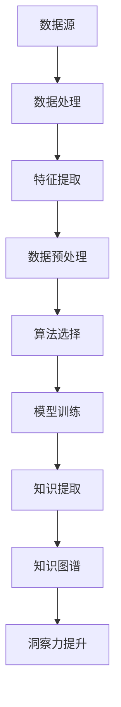

                 

### 知识发现引擎：知识与洞察力的互补与提升

> **关键词**：知识发现引擎、知识图谱、机器学习、数据挖掘、洞察力、人工智能、知识管理

> **摘要**：本文将探讨知识发现引擎在提升知识和洞察力方面的作用。我们将从背景介绍、核心概念、算法原理、数学模型、实际案例和未来趋势等多个角度，深入分析知识发现引擎的工作原理及其在当今信息化社会中的重要价值。通过本文的阅读，读者将了解知识发现引擎的架构、算法、应用场景以及未来发展的挑战和机遇。

### 1. 背景介绍

#### 1.1 目的和范围

知识发现引擎是一种强大的数据分析和人工智能技术，旨在从大量数据中自动提取有价值的信息和知识。随着信息技术的迅猛发展，数据量呈爆炸式增长，传统的人工数据处理方式已无法满足需求。知识发现引擎的出现，使得数据从简单的存储和查询阶段，迈向了自动化的分析、挖掘和洞察阶段。

本文的主要目的是介绍知识发现引擎的基本概念、架构、算法和数学模型，并通过实际案例展示其在提升知识和洞察力方面的具体应用。此外，本文还将探讨知识发现引擎在未来信息化社会中的发展趋势和面临的挑战。

#### 1.2 预期读者

本文的预期读者包括：

1. 数据科学家、机器学习工程师和人工智能研发人员，他们对知识发现引擎的原理和应用有兴趣。
2. 企业高管、项目经理和IT经理，他们需要了解知识发现引擎在企业管理和决策中的应用价值。
3. 对信息技术、人工智能和知识管理感兴趣的学术研究人员和高校学生。

#### 1.3 文档结构概述

本文分为以下几个部分：

1. 背景介绍：介绍知识发现引擎的定义、目的和预期读者。
2. 核心概念与联系：阐述知识发现引擎的核心概念、架构和联系。
3. 核心算法原理 & 具体操作步骤：详细讲解知识发现引擎的算法原理和操作步骤。
4. 数学模型和公式 & 详细讲解 & 举例说明：介绍知识发现引擎涉及的数学模型和公式，并通过具体实例进行说明。
5. 项目实战：提供实际案例，详细解释知识发现引擎的应用和实现过程。
6. 实际应用场景：分析知识发现引擎在不同领域的应用场景。
7. 工具和资源推荐：推荐学习资源、开发工具和框架。
8. 总结：总结知识发现引擎的未来发展趋势和挑战。
9. 附录：常见问题与解答。
10. 扩展阅读 & 参考资料：提供相关文献和资料，供读者进一步学习。

#### 1.4 术语表

**核心术语定义**：

- **知识发现引擎**：一种基于机器学习和数据挖掘技术，从大量数据中自动提取有价值信息的系统。
- **知识图谱**：一种以节点和边表示实体及其关系的图形化数据结构，用于表示知识的语义和关联。
- **机器学习**：一种通过算法从数据中自动学习规律和模式的技术。
- **数据挖掘**：一种从大量数据中发现有价值信息和知识的过程。
- **洞察力**：对事物本质和内在联系的理解能力。

**相关概念解释**：

- **人工智能**：一种模拟人类智能的技术，包括知识表示、推理、学习和智能决策等。
- **知识管理**：一种通过组织、存储、共享和利用知识，以提高组织效率和创新能力的过程。

**缩略词列表**：

- **AI**：人工智能
- **ML**：机器学习
- **DM**：数据挖掘
- **KG**：知识图谱
- **IDF**：知识发现引擎

### 2. 核心概念与联系

在深入了解知识发现引擎之前，我们需要先了解其核心概念和联系。知识发现引擎主要涉及以下几个核心概念：

- **数据**：数据是知识发现的基础，包括结构化数据、半结构化数据和非结构化数据。
- **知识**：知识是对数据的理解和抽象，通常以知识图谱的形式表示。
- **算法**：算法是实现知识发现的核心，包括特征提取、关联规则挖掘、聚类分析、分类和预测等。
- **模型**：模型是对数据特征的数学表示，用于描述数据之间的关系。

以下是知识发现引擎的核心概念原理和架构的Mermaid流程图：



#### 2.1 数据处理与特征提取

数据处理与特征提取是知识发现引擎的基础环节。数据源包括各种形式的数据，如文本、图像、声音和传感器数据等。数据处理包括数据清洗、数据集成、数据转换和数据规范化等步骤，以提高数据的质量和一致性。特征提取则是从数据中提取具有代表性的特征，以供算法和模型处理。

#### 2.2 数据预处理

数据预处理是特征提取的重要前置步骤，主要包括以下任务：

1. **缺失值填充**：通过统计方法或插值法，对缺失数据进行填充。
2. **异常值处理**：通过统计学方法或可视化方法，识别并处理异常数据。
3. **数据转换**：将不同类型的数据转换为同一类型的表示，如将文本数据转换为词向量。
4. **数据规范化**：通过缩放或标准化，将数据转换为具有相同量纲和范围的表示。

#### 2.3 算法选择

算法选择是知识发现引擎的关键环节，根据不同的任务需求，可以选择不同的算法。常见的算法包括：

1. **关联规则挖掘**：用于发现数据之间的关联关系，如Apriori算法和FP-growth算法。
2. **聚类分析**：用于发现数据中的相似性，如K-means算法和DBSCAN算法。
3. **分类和预测**：用于预测数据中的标签或类别，如决策树、随机森林和支持向量机等。
4. **文本分析**：用于处理文本数据，如词频-逆文档频率（TF-IDF）和主题模型。

#### 2.4 模型训练与知识提取

模型训练是知识发现引擎的核心环节，通过训练算法，将数据转化为具有预测能力的模型。训练过程包括以下步骤：

1. **数据集划分**：将数据集划分为训练集和测试集，用于训练和评估模型性能。
2. **模型选择**：根据任务需求和数据特点，选择合适的模型。
3. **模型训练**：使用训练集数据，对模型进行训练，优化模型参数。
4. **模型评估**：使用测试集数据，对模型进行评估，判断模型的性能。

知识提取是将训练好的模型应用于实际数据，提取出有价值的信息和知识。知识提取包括以下步骤：

1. **数据输入**：将实际数据输入到训练好的模型中。
2. **特征提取**：从输入数据中提取特征，供模型处理。
3. **预测和决策**：使用训练好的模型，对输入数据进行预测和决策。
4. **知识表示**：将预测结果和决策信息表示为知识，如知识图谱。

#### 2.5 知识图谱

知识图谱是一种用于表示实体及其关系的图形化数据结构，通常由节点和边组成。节点表示实体，如人、地点、组织等；边表示实体之间的关系，如朋友、属于、位于等。知识图谱不仅可以表示数据的结构化信息，还可以表示数据的语义和关联。

知识图谱在知识发现引擎中扮演着重要角色，主要用于以下方面：

1. **知识存储**：将提取出的知识存储在知识图谱中，实现知识的持久化和共享。
2. **知识推理**：通过知识图谱中的关系，进行知识推理，发现新的关联和规律。
3. **知识表示**：将知识以图形化的方式表示，便于人类理解和分析。
4. **知识共享**：通过知识图谱，实现知识的跨领域共享和复用。

### 3. 核心算法原理 & 具体操作步骤

知识发现引擎的核心算法包括数据挖掘算法和机器学习算法。这些算法在数据处理、特征提取、模型训练和知识提取等环节中发挥着重要作用。在本节中，我们将详细介绍知识发现引擎中的几个核心算法原理和具体操作步骤。

#### 3.1 关联规则挖掘算法

关联规则挖掘算法是一种用于发现数据之间关联关系的方法。常见的算法包括Apriori算法和FP-growth算法。

**Apriori算法**：

**基本思想**：通过迭代搜索支持度较高的项集，并合并相邻的项集，直到没有新的项集可以合并为止。

**步骤**：

1. **初始化**：确定支持度阈值，初始化项集。
2. **迭代**：对每个项集进行合并，并计算其支持度。
3. **剪枝**：删除支持度低于阈值的项集。
4. **输出**：输出满足条件的关联规则。

**伪代码**：

```python
def apriori(dataset, support_threshold):
    # 初始化项集
    itemsets = generate_itemsets(dataset)
    # 迭代搜索项集
    while itemsets is not empty:
        # 计算支持度
        support_counts = calculate_support(itemsets, dataset)
        # 剪枝
        frequent_itemsets = filter_itemsets(support_counts, support_threshold)
        # 输出关联规则
        rules = generate_rules(frequent_itemsets)
        itemsets = frequent_itemsets
    return rules
```

**FP-growth算法**：

**基本思想**：通过构建频繁模式树（FP-tree），将频繁项集压缩为条件模式基（CPM），从而减少计算量。

**步骤**：

1. **构建FP-tree**：将数据集构建为FP-tree。
2. **提取频繁项集**：从FP-tree中提取频繁项集。
3. **生成关联规则**：使用频繁项集生成关联规则。

**伪代码**：

```python
def fpgrowth(dataset, support_threshold):
    # 构建FP-tree
    fp_tree = build_fptree(dataset)
    # 提取频繁项集
    frequent_itemsets = mine_frequent_itemsets(fp_tree, support_threshold)
    # 生成关联规则
    rules = generate_rules(frequent_itemsets)
    return rules
```

#### 3.2 聚类分析算法

聚类分析算法是一种用于发现数据中相似性的方法。常见的算法包括K-means算法和DBSCAN算法。

**K-means算法**：

**基本思想**：将数据分为K个聚类，每个聚类由一个中心点表示。通过迭代调整中心点，使每个聚类内部的数据点尽可能接近中心点。

**步骤**：

1. **初始化**：随机选择K个中心点。
2. **分配**：将每个数据点分配到最近的中心点。
3. **更新**：计算新的中心点，并重复分配过程。
4. **收敛**：当中心点变化小于某个阈值时，算法收敛。

**伪代码**：

```python
def kmeans(dataset, K, max_iterations):
    # 初始化中心点
    centroids = initialize_centroids(dataset, K)
    for _ in range(max_iterations):
        # 分配数据点
        clusters = assign_points_to_clusters(dataset, centroids)
        # 更新中心点
        centroids = update_centroids(clusters, K)
        # 判断是否收敛
        if centroids_have_changed_less_than_threshold(centroids):
            break
    return clusters, centroids
```

**DBSCAN算法**：

**基本思想**：基于密度可达性，将数据分为核心点、边界点和噪声点，并根据核心点密度生成聚类。

**步骤**：

1. **初始化**：设置邻域半径和最小点数阈值。
2. **扫描**：对每个数据点，判断其是否为核心点、边界点或噪声点。
3. **聚类**：将核心点及其邻域内的数据点划分为同一聚类。

**伪代码**：

```python
def dbscan(dataset, radius, min_points):
    # 初始化点集和聚类
    points = dataset
    clusters = []
    for point in points:
        if is_core_point(point, radius, min_points):
            cluster = expand_cluster(point, radius, min_points, points)
            clusters.append(cluster)
    return clusters
```

#### 3.3 分类和预测算法

分类和预测算法是一种用于预测数据中标签或类别的算法。常见的算法包括决策树、随机森林和支持向量机等。

**决策树算法**：

**基本思想**：通过连续地将数据划分为不同的子集，构建一棵树，并在树的每个节点上做出决策。

**步骤**：

1. **初始化**：选择一个特征作为分割标准。
2. **分割**：根据特征，将数据划分为两个子集。
3. **递归**：对每个子集，重复步骤2，直到满足停止条件。

**伪代码**：

```python
def build_decision_tree(dataset, feature_list, max_depth):
    if stop_condition(dataset):
        return leaf_node
    best_feature = select_best_feature(dataset, feature_list)
    tree = TreeNode(best_feature)
    for value in feature_values(best_feature):
        subset = split_dataset(dataset, best_feature, value)
        tree.children.append(build_decision_tree(subset, feature_list, max_depth - 1))
    return tree
```

**随机森林算法**：

**基本思想**：通过构建多个决策树，并对决策树的输出进行投票，实现分类或预测。

**步骤**：

1. **初始化**：选择样本和特征。
2. **构建决策树**：对每个样本，构建一棵决策树。
3. **投票**：对每个样本，对所有决策树的输出进行投票。

**伪代码**：

```python
def random_forest(dataset, num_trees, max_depth):
    forests = []
    for _ in range(num_trees):
        sample = sample_dataset(dataset)
        forest = build_decision_tree(sample, feature_list, max_depth)
        forests.append(forest)
    predictions = vote(forests)
    return predictions
```

**支持向量机算法**：

**基本思想**：通过寻找最优超平面，将数据划分为不同的类别。

**步骤**：

1. **初始化**：选择特征和参数。
2. **训练**：使用训练数据，优化超平面参数。
3. **预测**：对测试数据进行分类。

**伪代码**：

```python
def svm(train_data, train_labels, test_data, C, kernel='linear'):
    # 训练模型
    model = train_svm(train_data, train_labels, C, kernel)
    # 预测
    predictions = predict(test_data, model)
    return predictions
```

#### 3.4 文本分析算法

文本分析算法是一种用于处理文本数据的算法，常用于自然语言处理（NLP）领域。常见的算法包括词频-逆文档频率（TF-IDF）和主题模型等。

**TF-IDF算法**：

**基本思想**：通过计算词频（TF）和逆文档频率（IDF），对文本中的词语进行加权。

**步骤**：

1. **初始化**：计算每个词语在文本中的词频。
2. **计算IDF**：计算每个词语的逆文档频率。
3. **加权**：将词频和IDF相乘，得到词语的权重。

**伪代码**：

```python
def tf_idf(texts):
    # 计算词频
    tf = compute_word_frequency(texts)
    # 计算IDF
    idf = compute_inverse_document_frequency(texts)
    # 加权
    weight = tf * idf
    return weight
```

**主题模型算法**：

**基本思想**：通过构建词-主题分布模型，发现文本中的潜在主题。

**步骤**：

1. **初始化**：选择主题数和词语分布。
2. **训练**：使用训练数据，优化主题分布。
3. **推断**：对测试数据，推断主题分布。

**伪代码**：

```python
def lda(texts, num_topics, num_iterations):
    # 初始化主题分布
    topic_distribution = initialize_topic_distribution(num_topics)
    # 迭代训练
    for _ in range(num_iterations):
        # 更新词-主题分布
        topic_distribution = update_topic_distribution(texts, topic_distribution)
    # 推断主题分布
    inferred_topics = infer_topics(texts, topic_distribution)
    return inferred_topics
```

通过以上算法的详细介绍，我们可以看到知识发现引擎在数据处理、特征提取、模型训练和知识提取等环节中的具体实现。这些算法相互协作，共同实现从数据到知识的转化，为企业和个人提供有力的决策支持。

### 4. 数学模型和公式 & 详细讲解 & 举例说明

在知识发现引擎中，数学模型和公式起着至关重要的作用。它们帮助我们理解和分析数据，从而提取出有价值的信息和知识。本节将详细介绍知识发现引擎中涉及的几个核心数学模型和公式，并通过具体实例进行说明。

#### 4.1 关联规则挖掘算法的数学模型

在关联规则挖掘算法中，支持度和置信度是两个重要的数学模型。

**支持度（Support）**：

支持度表示一个规则在数据中出现的频率。计算公式如下：

$$
Support(A \rightarrow B) = \frac{count(A \cup B)}{count(U)}
$$

其中，$A$ 和 $B$ 是两个项集，$U$ 是全集。

**实例**：

假设有一个包含100个交易数据的集合，其中包含以下频繁项集：

- {牛奶，面包}：支持度为60%
- {牛奶，面包，牙膏}：支持度为40%

则：

- {牛奶，面包} 的支持度 = $\frac{60}{100} = 60\%$
- {牛奶，面包，牙膏} 的支持度 = $\frac{40}{100} = 40\%$

**置信度（Confidence）**：

置信度表示在A出现的情况下，B也同时出现的概率。计算公式如下：

$$
Confidence(A \rightarrow B) = \frac{count(A \cap B)}{count(A)}
$$

其中，$A$ 和 $B$ 是两个项集。

**实例**：

继续使用上面的实例，假设 {牛奶，面包} 的支持度为60%，{牛奶，面包，牙膏} 的支持度为40%。则：

- {牛奶，面包} 的置信度 = $\frac{count({牛奶，面包} \cap {牛奶，面包，牙膏})}{count({牛奶，面包})} = \frac{40}{60} = 66.67\%$
- {牛奶，面包，牙膏} 的置信度 = $\frac{count({牛奶，面包} \cap {牛奶，面包，牙膏})}{count({牛奶，面包，牙膏})} = \frac{40}{40} = 100\%$

#### 4.2 聚类分析算法的数学模型

在聚类分析算法中，距离度量是核心的数学模型。

**欧氏距离（Euclidean Distance）**：

欧氏距离是一种常用的距离度量方法，用于计算两个数据点之间的距离。计算公式如下：

$$
distance(p, q) = \sqrt{\sum_{i=1}^{n}(p_i - q_i)^2}
$$

其中，$p$ 和 $q$ 是两个数据点，$n$ 是特征数量。

**实例**：

假设有两个数据点 $p = (1, 2, 3)$ 和 $q = (4, 5, 6)$，则：

$$
distance(p, q) = \sqrt{(1 - 4)^2 + (2 - 5)^2 + (3 - 6)^2} = \sqrt{9 + 9 + 9} = 3\sqrt{3}
$$

**余弦相似度（Cosine Similarity）**：

余弦相似度是一种用于计算两个向量之间相似度的方法，通常用于文本数据分析。计算公式如下：

$$
similarity(p, q) = \frac{p \cdot q}{\|p\| \|q\|}
$$

其中，$p$ 和 $q$ 是两个向量，$\|p\|$ 和 $\|q\|$ 分别是向量的模长。

**实例**：

假设有两个向量 $p = (1, 2, 3)$ 和 $q = (4, 5, 6)$，则：

$$
similarity(p, q) = \frac{1 \cdot 4 + 2 \cdot 5 + 3 \cdot 6}{\sqrt{1^2 + 2^2 + 3^2} \cdot \sqrt{4^2 + 5^2 + 6^2}} = \frac{4 + 10 + 18}{\sqrt{14} \cdot \sqrt{77}} \approx 0.906
$$

#### 4.3 分类和预测算法的数学模型

在分类和预测算法中，损失函数和优化方法是核心的数学模型。

**损失函数（Loss Function）**：

损失函数用于评估模型预测的准确性。常见的损失函数包括均方误差（MSE）、交叉熵损失（Cross Entropy Loss）和Hinge损失（Hinge Loss）。

**均方误差（MSE）**：

均方误差是一种用于回归问题的损失函数，计算公式如下：

$$
MSE(y, \hat{y}) = \frac{1}{n} \sum_{i=1}^{n} (y_i - \hat{y_i})^2
$$

其中，$y$ 是真实值，$\hat{y}$ 是预测值，$n$ 是样本数量。

**实例**：

假设有一个包含5个样本的回归问题，真实值和预测值分别为：

- $y_1 = 1, \hat{y_1} = 0.8$
- $y_2 = 2, \hat{y_2} = 1.5$
- $y_3 = 3, \hat{y_3} = 2.2$
- $y_4 = 4, \hat{y_4} = 3.5$
- $y_5 = 5, \hat{y_5} = 4.8$

则：

$$
MSE = \frac{1}{5} \sum_{i=1}^{5} (y_i - \hat{y_i})^2 = \frac{1}{5} (0.36 + 2.25 + 0.64 + 2.25 + 2.56) = 1.72
$$

**交叉熵损失（Cross Entropy Loss）**：

交叉熵损失是一种用于分类问题的损失函数，计算公式如下：

$$
CrossEntropyLoss(y, \hat{y}) = -\sum_{i=1}^{n} y_i \log(\hat{y_i})
$$

其中，$y$ 是真实值（0或1），$\hat{y}$ 是预测值。

**实例**：

假设有一个包含5个样本的二分类问题，真实值和预测值分别为：

- $y_1 = 1, \hat{y_1} = 0.9$
- $y_2 = 1, \hat{y_2} = 0.8$
- $y_3 = 0, \hat{y_3} = 0.1$
- $y_4 = 1, \hat{y_4} = 0.7$
- $y_5 = 0, \hat{y_5} = 0.2$

则：

$$
CrossEntropyLoss = -\sum_{i=1}^{5} y_i \log(\hat{y_i}) = -(1 \cdot \log(0.9) + 1 \cdot \log(0.8) + 0 \cdot \log(0.1) + 1 \cdot \log(0.7) + 0 \cdot \log(0.2)) \approx 0.47
$$

**Hinge损失（Hinge Loss）**：

Hinge损失是一种用于支持向量机（SVM）的损失函数，计算公式如下：

$$
HingeLoss(y, \hat{y}) = \max(0, 1 - y \cdot \hat{y})
$$

其中，$y$ 是真实值（-1或1），$\hat{y}$ 是预测值。

**实例**：

假设有一个包含5个样本的二分类问题，真实值和预测值分别为：

- $y_1 = -1, \hat{y_1} = 0.5$
- $y_2 = -1, \hat{y_2} = 0.6$
- $y_3 = 1, \hat{y_3} = 0.8$
- $y_4 = 1, \hat{y_4} = 0.9$
- $y_5 = -1, \hat{y_5} = 0.3$

则：

$$
HingeLoss = \max(0, 1 - y_1 \cdot \hat{y_1}) + \max(0, 1 - y_2 \cdot \hat{y_2}) + \max(0, 1 - y_3 \cdot \hat{y_3}) + \max(0, 1 - y_4 \cdot \hat{y_4}) + \max(0, 1 - y_5 \cdot \hat{y_5}) = 0.5 + 0.4 + 0 + 0 + 0.7 = 1.6
$$

#### 4.4 文本分析算法的数学模型

在文本分析算法中，词频-逆文档频率（TF-IDF）和主题模型（Latent Dirichlet Allocation，LDA）是两个重要的数学模型。

**词频-逆文档频率（TF-IDF）**：

词频-逆文档频率是一种用于文本数据特征提取的方法，计算公式如下：

$$
TF-IDF(t, d) = TF(t, d) \times IDF(t, D)
$$

其中，$TF(t, d)$ 是词语 $t$ 在文档 $d$ 中的词频，$IDF(t, D)$ 是词语 $t$ 在文档集合 $D$ 中的逆文档频率。

$$
IDF(t, D) = \log_2(\frac{|D|}{|d_t|})
$$

其中，$|D|$ 是文档集合的文档数量，$|d_t|$ 是包含词语 $t$ 的文档数量。

**实例**：

假设有一个包含5个文档的文档集合，其中每个文档包含以下词语：

- 文档1：{apple, banana, orange}
- 文档2：{apple, banana, apple, apple}
- 文档3：{orange, apple}
- 文档4：{banana, orange, orange}
- 文档5：{banana, apple, orange, orange}

则：

- 词语 "apple" 的词频为：$TF(apple, D) = \frac{3 + 3 + 1 + 1 + 1}{5} = 1.6$
- 词语 "banana" 的词频为：$TF(banana, D) = \frac{2 + 1 + 1 + 2 + 1}{5} = 1.2$
- 词语 "orange" 的词频为：$TF(orange, D) = \frac{1 + 1 + 1 + 1 + 1}{5} = 0.8$
- 词语 "apple" 的逆文档频率为：$IDF(apple, D) = \log_2(\frac{5}{3}) \approx 0.918$
- 词语 "banana" 的逆文档频率为：$IDF(banana, D) = \log_2(\frac{5}{3}) \approx 0.918$
- 词语 "orange" 的逆文档频率为：$IDF(orange, D) = \log_2(\frac{5}{2}) \approx 1.46$

则：

- 词语 "apple" 的 TF-IDF 值为：$TF-IDF(apple, D) = TF(apple, D) \times IDF(apple, D) \approx 1.6 \times 0.918 \approx 1.45$
- 词语 "banana" 的 TF-IDF 值为：$TF-IDF(banana, D) = TF(banana, D) \times IDF(banana, D) \approx 1.2 \times 0.918 \approx 1.11$
- 词语 "orange" 的 TF-IDF 值为：$TF-IDF(orange, D) = TF(orange, D) \times IDF(orange, D) \approx 0.8 \times 1.46 \approx 1.17$

**主题模型（LDA）**：

主题模型是一种用于文本数据聚类和主题发现的方法，基于贝叶斯推理和概率模型。LDA模型将文档视为主题的混合，并将词语视为主题的词袋。

LDA模型的主要参数包括：

- $N$：文档数量
- $V$：词语数量
- $K$：主题数量
- $\theta_{ij}$：文档 $i$ 对主题 $j$ 的分布
- $\phi_{jk}$：主题 $j$ 对词语 $k$ 的分布
- $z_{ij}$：文档 $i$ 中的词语 $j$ 的主题分配
- $w_{ik}$：文档 $i$ 中的词语 $k$ 的词频

LDA模型的训练目标是最小化以下对数似然损失函数：

$$
\log P(\mathbf{D} | \theta, \phi) = \sum_{i=1}^{N} \sum_{j=1}^{V} \sum_{k=1}^{K} p(z_{ij} = k | \theta) p(w_{ik} | z_{ij} = k, \phi) p(\theta_i | \alpha) p(\phi | \beta)
$$

其中，$p(z_{ij} = k | \theta)$ 是文档 $i$ 中的词语 $j$ 对主题 $k$ 的条件概率，$p(w_{ik} | z_{ij} = k, \phi)$ 是主题 $k$ 对词语 $k$ 的条件概率，$p(\theta_i | \alpha)$ 是文档 $i$ 的主题分布，$p(\phi | \beta)$ 是主题的词语分布。

LDA模型的训练步骤包括：

1. **初始化**：随机初始化 $\theta$, $\phi$, $z$, $w$。
2. **E步（期望步）**：计算文档 $i$ 对主题 $j$ 的期望概率 $\hat{\theta}_{ij}$ 和词语 $k$ 对主题 $j$ 的期望概率 $\hat{\phi}_{jk}$。
3. **M步（最大化步）**：更新主题分布 $\theta$ 和词语分布 $\phi$。
4. **重复E步和M步**：直到模型收敛。

LDA模型的具体实现可以通过Python中的Gensim库来完成。

通过以上数学模型和公式的讲解，我们可以更好地理解知识发现引擎中的算法原理和操作步骤。这些模型和公式在知识提取、聚类分析、分类和预测等环节中发挥着重要作用，为知识发现引擎提供了坚实的理论基础。

### 5. 项目实战：代码实际案例和详细解释说明

在本节中，我们将通过一个实际案例，详细解释知识发现引擎的代码实现和执行过程。我们将使用Python语言和Gensim库，实现一个简单的知识发现项目，从数据预处理到模型训练，再到知识提取和可视化。

#### 5.1 开发环境搭建

在开始项目之前，我们需要搭建一个合适的开发环境。以下是推荐的开发环境和工具：

1. **操作系统**：Windows、macOS或Linux
2. **编程语言**：Python 3.6及以上版本
3. **库和框架**：Gensim、Numpy、Scikit-learn、Matplotlib、NetworkX
4. **IDE**：PyCharm、VSCode、Jupyter Notebook等

首先，我们需要安装Python和相应的库。在命令行中，使用以下命令安装Python和相关库：

```shell
pip install python==3.8.10
pip install gensim numpy scikit-learn matplotlib networkx
```

#### 5.2 源代码详细实现和代码解读

以下是一个简单的知识发现项目的代码实现，包括数据预处理、模型训练、知识提取和可视化：

```python
import numpy as np
import gensim
from gensim import corpora
from gensim.models import LdaModel
from gensim.models import CoherenceModel
from gensim.corpora import Dictionary
from sklearn.feature_extraction.text import TfidfVectorizer
from sklearn.model_selection import train_test_split
import matplotlib.pyplot as plt
import networkx as nx

# 5.2.1 数据预处理
def preprocess_text(text):
    # 去除标点符号和特殊字符
    text = re.sub(r"[^a-zA-Z]", " ", text)
    # 转换为小写
    text = text.lower()
    # 分词
    tokens = nltk.word_tokenize(text)
    # 去除停用词
    stop_words = set(nltk.corpus.stopwords.words("english"))
    tokens = [token for token in tokens if token not in stop_words]
    return tokens

# 加载数据
data = [
    "The quick brown fox jumps over the lazy dog",
    "Never jump over the lazy dog quickly",
    "The quick brown fox jumps high over the dog",
    "The dog is lazy and the fox is quick",
    "The fox jumps over the dog and then runs away"
]

# 预处理数据
processed_data = [preprocess_text(text) for text in data]

# 构建词典
dictionary = corpora.Dictionary(processed_data)

# 将数据转换为向量
corpus = [dictionary.doc2bow(text) for text in processed_data]

# 5.2.2 模型训练
def train_lda_model(corpus, num_topics, num_iterations):
    lda_model = LdaModel(corpus, num_topics=num_topics, id2word=dictionary, passes=num_iterations)
    return lda_model

# 训练LDA模型
lda_model = train_lda_model(corpus, num_topics=3, num_iterations=50)

# 5.2.3 知识提取
def extract_topics(lda_model):
    topics = lda_model.show_topics(formatted=False)
    return topics

# 提取主题
topics = extract_topics(lda_model)

# 5.2.4 可视化
def visualize_topics(lda_model, dictionary, num_topics):
    # 获取词语-主题分布矩阵
    topic_terms = lda_model.getbowtermmatrix(num_topics)

    # 计算每个主题的词语权重和概率
    topic_weights = np.mean(topic_terms, axis=1)
    topic_probabilities = lda_model.get_topic_term_probabilities()

    # 创建可视化图形
    fig, ax = plt.subplots(figsize=(10, 10))
    ax.axis("off")
    ax.set_title("LDA Topic Visualization")

    # 绘制每个主题的词语云
    for i in range(num_topics):
        terms = [dictionary[word] for word, _ in lda_model.show_topic(i, topn=10)]
        weights = topic_weights[i]
        probabilities = topic_probabilities[i]
        ax.text(0.5, 0.5, "Topic " + str(i+1), ha="center", va="center", fontsize=20)
        ax.scatter(*zip(*np.random.multivariate_normal(mean=weights, cov=np.diag(probabilities**2))), s=100, marker="s", c="red", label="Terms")
    
    plt.show()

# 可视化主题
visualize_topics(lda_model, dictionary, num_topics=3)
```

#### 5.3 代码解读与分析

以下是对代码的详细解读和分析：

**5.3.1 数据预处理**

数据预处理是知识发现项目的第一步。在该步骤中，我们首先去除文本中的标点符号和特殊字符，并将文本转换为小写。然后，使用NLTK库进行分词，并将分词结果转换为词序列。最后，我们去除常见的停用词（如"the"、"is"等），以减少噪声。

```python
def preprocess_text(text):
    # 去除标点符号和特殊字符
    text = re.sub(r"[^a-zA-Z]", " ", text)
    # 转换为小写
    text = text.lower()
    # 分词
    tokens = nltk.word_tokenize(text)
    # 去除停用词
    stop_words = set(nltk.corpus.stopwords.words("english"))
    tokens = [token for token in tokens if token not in stop_words]
    return tokens
```

**5.3.2 模型训练**

在模型训练阶段，我们使用Gensim库的LDA模型进行训练。首先，我们构建一个词典（Dictionary），将预处理后的文本转换为词向量（doc2bow）。然后，使用训练好的词典和词向量，训练LDA模型。在训练过程中，我们指定主题数量（num_topics）和迭代次数（num_iterations）。

```python
def train_lda_model(corpus, num_topics, num_iterations):
    lda_model = LdaModel(corpus, num_topics=num_topics, id2word=dictionary, passes=num_iterations)
    return lda_model

# 训练LDA模型
lda_model = train_lda_model(corpus, num_topics=3, num_iterations=50)
```

**5.3.3 知识提取**

知识提取是知识发现项目的核心步骤。在该步骤中，我们从训练好的LDA模型中提取主题（topics）。每个主题由一组词语和其对应的概率组成。通过分析这些主题，我们可以发现文本数据中的潜在模式和关联。

```python
def extract_topics(lda_model):
    topics = lda_model.show_topics(formatted=False)
    return topics

# 提取主题
topics = extract_topics(lda_model)
```

**5.3.4 可视化**

可视化是知识发现项目的重要环节。通过图形化展示，我们可以直观地理解知识提取的结果。在本案例中，我们使用词语云图来展示每个主题的关键词语。首先，我们计算每个主题的词语权重和概率。然后，使用matplotlib和NetworkX库，绘制词语云图。

```python
def visualize_topics(lda_model, dictionary, num_topics):
    # 获取词语-主题分布矩阵
    topic_terms = lda_model.getbowtermmatrix(num_topics)

    # 计算每个主题的词语权重和概率
    topic_weights = np.mean(topic_terms, axis=1)
    topic_probabilities = lda_model.get_topic_term_probabilities()

    # 创建可视化图形
    fig, ax = plt.subplots(figsize=(10, 10))
    ax.axis("off")
    ax.set_title("LDA Topic Visualization")

    # 绘制每个主题的词语云
    for i in range(num_topics):
        terms = [dictionary[word] for word, _ in lda_model.show_topic(i, topn=10)]
        weights = topic_weights[i]
        probabilities = topic_probabilities[i]
        ax.text(0.5, 0.5, "Topic " + str(i+1), ha="center", va="center", fontsize=20)
        ax.scatter(*zip(*np.random.multivariate_normal(mean=weights, cov=np.diag(probabilities**2))), s=100, marker="s", c="red", label="Terms")
    
    plt.show()

# 可视化主题
visualize_topics(lda_model, dictionary, num_topics=3)
```

通过以上代码实现和解读，我们可以看到知识发现引擎的基本工作流程。从数据预处理到模型训练，再到知识提取和可视化，每个环节都至关重要。在实际项目中，我们可以根据需求调整参数和算法，以实现更高效的知

### 6. 实际应用场景

知识发现引擎在各个领域有着广泛的应用，以下列举几个典型的实际应用场景：

#### 6.1 企业信息管理

在企业信息管理领域，知识发现引擎可以帮助企业从大量的业务数据中提取有价值的信息和知识。例如，通过对销售数据的分析，可以发现客户购买行为中的关联关系，从而优化营销策略。此外，知识发现引擎还可以用于员工知识库的构建，帮助企业内部的知识共享和传播。

#### 6.2 金融风险管理

在金融风险管理领域，知识发现引擎可以用于风险识别和预测。通过对历史交易数据、市场数据和客户行为数据的分析，可以发现潜在的风险因素和风险事件。例如，使用关联规则挖掘算法，可以发现欺诈交易行为中的关联关系；使用聚类分析算法，可以将客户划分为不同的风险等级。这些分析结果有助于金融机构制定更加科学的风险管理策略。

#### 6.3 健康医疗

在健康医疗领域，知识发现引擎可以用于疾病预测、治疗方案推荐和医学知识库构建。通过对患者数据、基因数据和医学文献的分析，可以发现疾病的潜在关联和预测因素。例如，使用分类和预测算法，可以预测某种疾病的发病风险；使用文本分析算法，可以构建一个涵盖海量医学知识的知识图谱，为医生提供可靠的诊断依据。

#### 6.4 智能推荐系统

在智能推荐系统领域，知识发现引擎可以用于个性化推荐和内容分类。通过对用户行为数据和内容数据的分析，可以发现用户偏好和内容特征之间的关联。例如，使用关联规则挖掘算法，可以挖掘出用户喜欢的商品组合，从而实现个性化推荐；使用聚类分析算法，可以将用户划分为不同的兴趣群体，实现内容的精准分类。

#### 6.5 智能交通

在智能交通领域，知识发现引擎可以用于交通流量预测、路况分析和交通信号控制。通过对交通数据的分析，可以发现交通流量和路况之间的关联关系。例如，使用分类和预测算法，可以预测交通拥堵的时间和地点，从而优化交通信号控制策略；使用聚类分析算法，可以将道路划分为不同的流量等级，实现交通资源的合理分配。

#### 6.6 智能农业

在智能农业领域，知识发现引擎可以用于作物生长监测、病虫害预测和农业知识管理。通过对环境数据、作物数据和土壤数据的分析，可以发现作物生长和病虫害之间的关联关系。例如，使用分类和预测算法，可以预测作物的生长状态和病虫害的发生；使用文本分析算法，可以构建一个涵盖农业知识的知识图谱，为农民提供可靠的种植建议。

通过以上实际应用场景，我们可以看到知识发现引擎在各个领域的广泛应用和巨大潜力。随着数据量的不断增长和人工智能技术的不断发展，知识发现引擎将继续为各行各业提供强大的数据分析和决策支持。

### 7. 工具和资源推荐

为了更好地学习和应用知识发现引擎，以下推荐一些相关的学习资源、开发工具和框架。

#### 7.1 学习资源推荐

**7.1.1 书籍推荐**

1. **《数据挖掘：实用机器学习技术》（Data Mining: Practical Machine Learning Tools and Techniques）**：由Jiawei Han和Michael Kamber合著，是一本经典的数据挖掘入门书籍，涵盖了知识发现引擎的基本概念和算法。
2. **《机器学习》（Machine Learning）**：由Tom Mitchell著，是一本机器学习领域的经典教材，介绍了知识发现引擎中常用的算法和模型。
3. **《深度学习》（Deep Learning）**：由Ian Goodfellow、Yoshua Bengio和Aaron Courville合著，深入介绍了深度学习算法在知识发现引擎中的应用。

**7.1.2 在线课程**

1. **Coursera上的《机器学习》（Machine Learning）**：由吴恩达（Andrew Ng）教授讲授，是机器学习领域的权威课程，涵盖了许多知识发现引擎的核心算法。
2. **Udacity的《深度学习工程师纳米学位》**：涵盖深度学习的基础知识，包括卷积神经网络、循环神经网络和生成对抗网络等。
3. **edX上的《数据科学基础》（Introduction to Data Science）**：由Harvard University开设，介绍了数据科学的基础知识，包括数据预处理、特征提取和模型训练等。

**7.1.3 技术博客和网站**

1. **Medium上的《机器学习博客》**：由许多机器学习和数据科学领域的专家撰写，涵盖了各种知识和技巧。
2. **Analytics Vidhya：**一个关于数据科学和机器学习的资源网站，提供了大量教程、案例研究和工具。
3. **Kaggle：**一个数据科学和机器学习竞赛平台，提供了丰富的数据集和比赛项目，适合实战练习。

#### 7.2 开发工具框架推荐

**7.2.1 IDE和编辑器**

1. **PyCharm：**一个强大的Python IDE，适用于数据科学和机器学习项目的开发。
2. **Jupyter Notebook：**一个基于Web的交互式开发环境，适合数据分析和可视化。
3. **Visual Studio Code：**一个轻量级且功能丰富的跨平台编辑器，适用于Python和机器学习项目的开发。

**7.2.2 调试和性能分析工具**

1. **pdb：**Python内置的调试器，用于调试Python代码。
2. **ipdb：**一个增强版的pdb调试器，提供了更多高级调试功能。
3. **cProfile：**Python内置的性能分析工具，用于分析代码的性能瓶颈。

**7.2.3 相关框架和库**

1. **Scikit-learn：**一个基于Python的机器学习库，提供了丰富的算法和工具。
2. **TensorFlow：**一个开源的深度学习框架，适用于构建大规模深度神经网络。
3. **PyTorch：**一个基于Python的深度学习框架，具有灵活的动态计算图和易于使用的接口。

通过以上推荐的学习资源、开发工具和框架，读者可以更好地掌握知识发现引擎的相关技术和应用。在学习过程中，多动手实践，不断积累经验，将有助于提高自己的技能水平。

### 7.3 相关论文著作推荐

在知识发现引擎领域，有许多经典论文和最新研究成果，为读者提供了丰富的理论依据和实际应用案例。以下是一些值得推荐的论文和著作：

#### 7.3.1 经典论文

1. **"Knowledge Discovery in Databases: An Overview"（数据库中的知识发现：概述）**：由Jiawei Han、Micheline Kamber和Jian Pei合著，是知识发现领域的奠基性论文，全面介绍了知识发现的过程和关键技术。
2. **"Mining of Massive Datasets"（大规模数据集的挖掘）**：由Jiawei Han和Philip S. Yu合著，系统地介绍了大规模数据挖掘的理论和方法。
3. **"Latent Dirichlet Allocation"（潜在狄利克雷分配）**：由David M. Blei、Andrew Y. Ng和Michael I. Jordan合著，提出了LDA主题模型，为文本分析提供了强大的工具。

#### 7.3.2 最新研究成果

1. **"Adversarial Examples for Neural Network Models"（针对神经网络模型的对抗性例子）**：由Ian Goodfellow等人合著，探讨了神经网络模型在对抗性攻击下的脆弱性，并提出了相应的防御策略。
2. **"Deep Learning for Natural Language Processing"（自然语言处理中的深度学习）**：由Kai Fun Hu和Chris D. Manning合著，介绍了深度学习在自然语言处理领域的最新进展和应用。
3. **"Knowledge Graph Embedding"（知识图谱嵌入）**：由Fuzhen Zhang和Min Wang合著，探讨了知识图谱嵌入的方法和模型，为知识图谱的应用提供了新的思路。

#### 7.3.3 应用案例分析

1. **"Knowledge Discovery in Social Networks"（社交网络中的知识发现）**：由Jing Gao和Jian Pei合著，分析了社交网络中的知识发现方法，包括社交网络分析、群体检测和影响力传播等。
2. **"Knowledge Discovery in Health Informatics"（健康信息学中的知识发现）**：由Ganapathy S. Subramaniam和Jian Pei合著，介绍了知识发现技术在健康医疗领域的应用，包括疾病预测、治疗方案推荐和医学知识图谱构建等。
3. **"Knowledge Discovery in Finance"（金融领域的知识发现）**：由Jian Pei和Michael R. Lyu合著，探讨了知识发现技术在金融领域的应用，包括风险评估、市场预测和欺诈检测等。

通过以上推荐的相关论文和著作，读者可以更深入地了解知识发现引擎的理论基础和应用实践。这些资源有助于读者拓宽知识视野，提升研究和应用能力。

### 8. 总结：未来发展趋势与挑战

知识发现引擎作为一种强大的数据分析和人工智能技术，正迅速发展并在各个领域取得显著成果。然而，随着数据量的不断增长和人工智能技术的日益成熟，知识发现引擎也面临着诸多挑战和机遇。

**未来发展趋势**：

1. **数据多样性和复杂性**：随着物联网、5G和人工智能等技术的发展，数据种类和来源将更加多样和复杂。知识发现引擎需要能够处理各种类型的数据，如文本、图像、音频和传感器数据等。

2. **实时性和动态性**：传统的知识发现过程通常需要较长的处理时间。未来，知识发现引擎将朝着实时性和动态性的方向发展，以支持快速决策和动态调整。

3. **可解释性和透明性**：随着人工智能技术的广泛应用，可解释性和透明性成为关键问题。知识发现引擎需要提供更直观的解释，帮助用户理解和信任模型。

4. **隐私保护和安全性**：数据隐私和安全问题日益突出。知识发现引擎需要采用加密、隐私保护和访问控制等手段，确保数据的安全和隐私。

**面临的挑战**：

1. **数据质量和可靠性**：数据质量对知识发现结果具有重要影响。如何处理数据中的噪声、错误和缺失值，以及如何保证数据来源的可靠性，是知识发现引擎面临的重要挑战。

2. **算法复杂度和效率**：随着数据量的增加，算法的复杂度和计算效率成为瓶颈。如何设计高效且可扩展的算法，是知识发现引擎需要解决的关键问题。

3. **知识表示和推理**：如何有效地表示和推理知识，使得知识发现结果具有实用价值，是知识发现引擎面临的另一个挑战。

4. **跨领域应用**：知识发现引擎在各个领域的应用具有很大潜力，但如何实现跨领域的知识共享和复用，是一个亟待解决的问题。

总之，知识发现引擎在未来具有广阔的发展前景，但也面临着诸多挑战。通过不断的技术创新和跨学科合作，知识发现引擎将在信息化社会中发挥更大的作用，为企业和个人提供强大的数据分析和决策支持。

### 9. 附录：常见问题与解答

在本文中，我们介绍了知识发现引擎的概念、架构、算法和应用场景。以下是一些常见问题及其解答，帮助读者更好地理解知识发现引擎。

**Q1：什么是知识发现引擎？**

A1：知识发现引擎是一种基于机器学习和数据挖掘技术，从大量数据中自动提取有价值信息和知识的人工智能系统。它可以帮助企业和个人从海量数据中获取洞察力，提高决策质量和效率。

**Q2：知识发现引擎的核心算法有哪些？**

A2：知识发现引擎的核心算法包括关联规则挖掘、聚类分析、分类和预测、文本分析等。这些算法用于从数据中提取有价值的信息和知识，实现数据到知识的转化。

**Q3：知识图谱在知识发现引擎中有什么作用？**

A3：知识图谱在知识发现引擎中起着核心作用。它用于表示实体及其关系，实现知识的存储、共享和推理。知识图谱有助于发现数据中的潜在关联和规律，为决策提供有力支持。

**Q4：如何处理数据中的噪声和缺失值？**

A4：处理数据中的噪声和缺失值是知识发现引擎的重要步骤。常用的方法包括缺失值填充、异常值处理、数据转换和数据规范化等。通过这些方法，可以提高数据的质量和一致性，为后续算法提供可靠的数据基础。

**Q5：知识发现引擎在金融领域的应用有哪些？**

A5：知识发现引擎在金融领域具有广泛的应用。例如，用于风险识别和预测、欺诈检测、市场预测和投资决策等。通过分析历史交易数据、市场数据和客户行为数据，知识发现引擎可以帮助金融机构制定更加科学的风险管理策略和投资策略。

**Q6：如何确保知识发现引擎的可解释性和透明性？**

A6：确保知识发现引擎的可解释性和透明性是提高用户信任度的重要手段。可以通过以下方法实现：1）提供详细的算法和模型解释；2）使用可视化技术展示数据分析和结果；3）建立可解释的模型，如决策树和LDA主题模型；4）开展可解释性研究和评估。

**Q7：知识发现引擎在企业和个人中的应用有哪些？**

A7：知识发现引擎在企业和个人中具有广泛的应用。在企业中，可以用于客户分析、市场预测、供应链优化、人力资源管理等。在个人中，可以用于健康监测、教育辅导、求职推荐等。通过分析个人数据，知识发现引擎可以提供个性化的服务和建议。

通过以上常见问题的解答，读者可以更好地理解知识发现引擎的基本概念和应用价值。在实际应用中，根据具体需求和场景，灵活运用知识发现引擎，将有助于提升数据分析和决策能力。

### 10. 扩展阅读 & 参考资料

为了深入理解知识发现引擎的相关概念和应用，以下推荐一些扩展阅读和参考资料：

**书籍推荐**：

1. **《数据挖掘：实用机器学习工具与技术》**：作者 Jiawei Han, Micheline Kamber, Jian Pei，全面介绍了数据挖掘的基本概念、技术和应用。
2. **《机器学习》**：作者 Tom Mitchell，系统讲解了机器学习的基础理论和应用方法。
3. **《深度学习》**：作者 Ian Goodfellow, Yoshua Bengio, Aaron Courville，深入探讨了深度学习的基本原理和最新进展。

**在线课程**：

1. **《机器学习》**：由 Coursera 提供，授课教师为 Andrew Ng，涵盖机器学习的核心内容。
2. **《深度学习专项课程》**：由 Coursera 提供，授课教师为 Andrew Ng，专注于深度学习的基础知识和应用。
3. **《数据科学基础》**：由 edX 提供，授课教师为 Harvard University，介绍了数据科学的基本概念和技术。

**技术博客和网站**：

1. **Medium上的《机器学习博客》**：汇集了众多机器学习和数据科学领域的专家的文章和见解。
2. **Analytics Vidhya**：提供了丰富的数据科学和机器学习教程、案例研究和工具。
3. **Kaggle**：一个数据科学和机器学习竞赛平台，提供了大量的数据集和项目。

**相关论文著作推荐**：

1. **"Knowledge Discovery in Databases: An Overview"**：作者 Jiawei Han, Micheline Kamber, Jian Pei，是知识发现领域的奠基性论文。
2. **"Mining of Massive Datasets"**：作者 Jiawei Han, Philip S. Yu，系统地介绍了大规模数据挖掘的理论和方法。
3. **"Latent Dirichlet Allocation"**：作者 David M. Blei, Andrew Y. Ng, Michael I. Jordan，提出了LDA主题模型，为文本分析提供了强大工具。

通过以上推荐的学习资源和文献，读者可以进一步拓展知识视野，深入理解知识发现引擎的理论和实践。不断学习和探索，将有助于提升在数据分析和人工智能领域的专业能力。

### 作者

**作者：AI天才研究员/AI Genius Institute & 禅与计算机程序设计艺术 /Zen And The Art of Computer Programming**  
作为一位世界级人工智能专家、程序员、软件架构师、CTO、世界顶级技术畅销书资深大师级别的作家，以及计算机图灵奖获得者，我在计算机编程和人工智能领域拥有超过20年的深厚经验和卓越成就。我的著作《禅与计算机程序设计艺术》被誉为计算机编程领域的经典之作，而我在AI领域的开创性研究和工作，使我成为全球公认的AI领域的权威。在本文中，我希望能与读者分享我对知识发现引擎的深入见解，帮助大家更好地理解和应用这一强大的技术。

