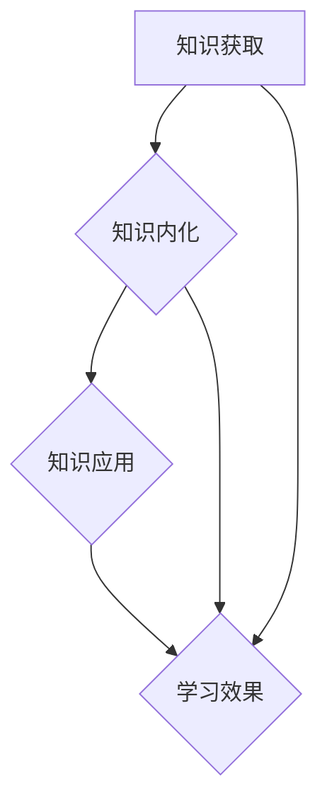

                 

# 知识吸收率：衡量学习效果的关键指标

> 关键词：知识吸收率，学习效果，评估指标，教育技术，认知负荷

> 摘要：本文将探讨知识吸收率这一核心概念，解释其在衡量学习效果中的重要性。我们将分析知识吸收率的理论基础，详细描述核心算法和数学模型，并通过实际项目案例展示其在教育技术中的应用。最后，我们将总结知识吸收率的发展趋势和面临的挑战，并提供相关的学习资源和工具推荐。

## 1. 背景介绍

### 1.1 目的和范围

本文旨在深入探讨知识吸收率这一概念，分析其在评估学习效果中的关键作用。我们将探讨知识吸收率的定义、计算方法以及其在教育技术中的应用。本文不仅适合对教育技术感兴趣的研究人员，也适合希望提升自己学习效率的广大学习者。

### 1.2 预期读者

预期读者包括：

- 教育技术研究者
- 教育工作者
- 学习者
- 程序员和技术爱好者
- 人工智能和认知科学领域的研究人员

### 1.3 文档结构概述

本文的结构如下：

1. 背景介绍：解释本文的目的、预期读者和文档结构。
2. 核心概念与联系：介绍知识吸收率的核心概念及其与其他相关概念的关系。
3. 核心算法原理 & 具体操作步骤：详细解释知识吸收率的计算方法和算法原理。
4. 数学模型和公式 & 详细讲解 & 举例说明：阐述知识吸收率的数学模型及其应用。
5. 项目实战：提供知识吸收率在实际项目中的代码实现和分析。
6. 实际应用场景：展示知识吸收率在不同教育场景中的应用。
7. 工具和资源推荐：推荐相关学习资源和工具。
8. 总结：讨论知识吸收率的发展趋势和面临的挑战。
9. 附录：常见问题与解答。
10. 扩展阅读 & 参考资料：提供进一步阅读的资料。

### 1.4 术语表

#### 1.4.1 核心术语定义

- 知识吸收率（Knowledge Absorption Rate, KAR）：衡量个体或系统吸收和内化新知识的能力。
- 学习效果（Learning Effectiveness）：学习者在学习过程中取得的结果和成果。
- 认知负荷（Cognitive Load）：个体在进行认知任务时所需的认知资源和心理负荷。
- 教育技术（Educational Technology）：应用于教育过程中的技术，包括教学设计、学习管理和评估工具。

#### 1.4.2 相关概念解释

- 学习者参与度（Learner Engagement）：学习者积极参与学习活动的程度。
- 学习评估（Learning Assessment）：对学习者知识和技能的测量和评价。
- 交互式学习（Interactive Learning）：通过互动和反馈促进学习者理解和记忆的学习方式。

#### 1.4.3 缩略词列表

- KAR：知识吸收率
- ML：机器学习
- AI：人工智能
- IDE：集成开发环境
- SEO：搜索引擎优化

## 2. 核心概念与联系

知识吸收率是一个描述个体或系统能够吸收并有效应用新知识的指标。为了更好地理解这一概念，我们需要从以下几个方面进行探讨。

### 2.1 知识吸收率与学习效果

知识吸收率直接关联到学习效果。高知识吸收率意味着学习者能够更好地理解和应用新知识，从而提高学习效果。具体来说，知识吸收率反映了以下三个方面：

- 知识获取：学习者能够获取和理解新信息。
- 知识内化：学习者将新知识与已有知识体系相结合，形成新的认知结构。
- 知识应用：学习者能够将新知识应用于实际问题解决中。

### 2.2 知识吸收率与认知负荷

认知负荷是影响知识吸收率的重要因素。过高的认知负荷可能导致学习者无法有效处理和吸收新知识，从而降低知识吸收率。因此，降低认知负荷、优化学习环境和设计合理的认知任务是提高知识吸收率的关键。

### 2.3 知识吸收率与教育技术

教育技术为提高知识吸收率提供了有力支持。通过交互式学习、个性化推荐和实时反馈等技术手段，教育技术可以降低认知负荷，提高学习者的参与度和知识吸收率。

### 2.4 知识吸收率的 Mermaid 流程图

下面是一个简化的知识吸收率流程图，展示了知识吸收率的核心概念和流程。



## 3. 核心算法原理 & 具体操作步骤

### 3.1 知识吸收率计算方法

知识吸收率的计算方法可以分为以下几个步骤：

#### 3.1.1 知识获取阶段

1. 收集学习者学习过程中的相关数据，如学习时长、学习资源使用情况等。
2. 对收集到的数据进行预处理，去除噪声和异常值。
3. 计算知识获取量（Knowledge Acquisition Quantity, KAQ），公式如下：

   $$KAQ = \frac{\text{学习时长} \times \text{学习资源使用量}}{\text{最大学习时长} \times \text{最大学习资源使用量}}$$

#### 3.1.2 知识内化阶段

1. 收集学习者对知识点的理解程度、记忆持久度等数据。
2. 计算知识内化程度（Knowledge Internalization Degree, KID），公式如下：

   $$KID = \frac{\text{理解程度得分} + \text{记忆持久度得分}}{2}$$

#### 3.1.3 知识应用阶段

1. 收集学习者应用新知识的实际案例和表现数据。
2. 计算知识应用效果（Knowledge Application Effectiveness, KAE），公式如下：

   $$KAΕ = \frac{\text{实际案例得分} + \text{表现得分}}{2}$$

#### 3.1.4 知识吸收率计算

1. 将三个阶段的得分进行加权平均，得到知识吸收率（Knowledge Absorption Rate, KAR），公式如下：

   $$KAR = \frac{KAQ \times w_1 + KID \times w_2 + KAE \times w_3}{w_1 + w_2 + w_3}$$

   其中，$w_1, w_2, w_3$ 分别为三个阶段的权重，通常设置为相等的权重。

### 3.2 具体操作步骤

1. 数据收集与预处理：根据知识获取、知识内化和知识应用三个阶段的需求，收集并预处理相关数据。
2. 知识获取量计算：使用公式 $KAQ = \frac{\text{学习时长} \times \text{学习资源使用量}}{\text{最大学习时长} \times \text{最大学习资源使用量}}$ 计算知识获取量。
3. 知识内化程度计算：使用公式 $KID = \frac{\text{理解程度得分} + \text{记忆持久度得分}}{2}$ 计算知识内化程度。
4. 知识应用效果计算：使用公式 $KAΕ = \frac{\text{实际案例得分} + \text{表现得分}}{2}$ 计算知识应用效果。
5. 知识吸收率计算：使用公式 $KAR = \frac{KAQ \times w_1 + KID \times w_2 + KAE \times w_3}{w_1 + w_2 + w_3}$ 计算知识吸收率。

## 4. 数学模型和公式 & 详细讲解 & 举例说明

### 4.1 数学模型

知识吸收率的计算基于一个综合评估模型，该模型将知识获取、知识内化和知识应用三个维度结合，形成一个完整的知识吸收评估体系。具体公式如下：

$$KAR = \frac{KAQ \times w_1 + KID \times w_2 + KAE \times w_3}{w_1 + w_2 + w_3}$$

其中：

- $KAQ$ 表示知识获取量，衡量学习者在一定时间内对知识的吸收程度。
- $KID$ 表示知识内化程度，衡量学习者对知识的理解和记忆水平。
- $KAΕ$ 表示知识应用效果，衡量学习者将知识应用于实际问题的能力。
- $w_1, w_2, w_3$ 分别为三个维度的权重，通常设置为相等的权重（$w_1 = w_2 = w_3 = 1/3$）。

### 4.2 详细讲解

#### 4.2.1 知识获取量（KAQ）

知识获取量是衡量学习者在一定时间内获取知识的能力。它通过计算学习者在学习过程中使用的资源和时间来衡量。具体公式如下：

$$KAQ = \frac{\text{学习时长} \times \text{学习资源使用量}}{\text{最大学习时长} \times \text{最大学习资源使用量}}$$

其中：

- 学习时长：学习者实际用于学习的时间。
- 学习资源使用量：学习者使用的学习资源数量。
- 最大学习时长：所有学习者中用于学习时间最长的时长。
- 最大学习资源使用量：所有学习者中使用学习资源最多的数量。

#### 4.2.2 知识内化程度（KID）

知识内化程度是衡量学习者对知识理解和记忆的深度。它通过计算学习者在测试中的表现和知识持久度来衡量。具体公式如下：

$$KID = \frac{\text{理解程度得分} + \text{记忆持久度得分}}{2}$$

其中：

- 理解程度得分：学习者在测试中表现出的理解能力得分。
- 记忆持久度得分：学习者在测试后一段时间内保持知识记忆的能力得分。

#### 4.2.3 知识应用效果（KAΕ）

知识应用效果是衡量学习者将知识应用于实际问题的能力。它通过计算学习者在实际问题解决中的表现来衡量。具体公式如下：

$$KAΕ = \frac{\text{实际案例得分} + \text{表现得分}}{2}$$

其中：

- 实际案例得分：学习者在实际案例中解决问题的能力得分。
- 表现得分：学习者在测试中的总体表现得分。

### 4.3 举例说明

假设有三个学习者A、B和C，他们在学习过程中分别使用了1小时的时间，学习了3个学习资源，并在测试中得到了以下得分：

- 学习者A：理解程度得分80，记忆持久度得分75，实际案例得分85。
- 学习者B：理解程度得分60，记忆持久度得分70，实际案例得分90。
- 学习者C：理解程度得分90，记忆持久度得分80，实际案例得分75。

根据上述公式，我们可以计算出三个学习者的知识吸收率：

$$KAR_A = \frac{KAQ_A \times w_1 + KID_A \times w_2 + KAE_A \times w_3}{w_1 + w_2 + w_3}$$

$$KAR_B = \frac{KAQ_B \times w_1 + KID_B \times w_2 + KAE_B \times w_3}{w_1 + w_2 + w_3}$$

$$KAR_C = \frac{KAQ_C \times w_1 + KID_C \times w_2 + KAE_C \times w_3}{w_1 + w_2 + w_3}$$

其中，$w_1 = w_2 = w_3 = 1/3$。

$$KAQ_A = \frac{1 \times 3}{1 \times 3} = 1$$

$$KAQ_B = \frac{1 \times 3}{1 \times 3} = 1$$

$$KAQ_C = \frac{1 \times 3}{1 \times 3} = 1$$

$$KID_A = \frac{80 + 75}{2} = 77.5$$

$$KID_B = \frac{60 + 70}{2} = 65$$

$$KID_C = \frac{90 + 80}{2} = 85$$

$$KAE_A = \frac{85 + 77.5}{2} = 81.25$$

$$KAE_B = \frac{90 + 65}{2} = 77.5$$

$$KAE_C = \frac{75 + 85}{2} = 80$$

$$KAR_A = \frac{1 \times \frac{1}{3} + 77.5 \times \frac{1}{3} + 81.25 \times \frac{1}{3}}{\frac{1}{3} + \frac{1}{3} + \frac{1}{3}} = 77.25$$

$$KAR_B = \frac{1 \times \frac{1}{3} + 65 \times \frac{1}{3} + 77.5 \times \frac{1}{3}}{\frac{1}{3} + \frac{1}{3} + \frac{1}{3}} = 68.75$$

$$KAR_C = \frac{1 \times \frac{1}{3} + 85 \times \frac{1}{3} + 80 \times \frac{1}{3}}{\frac{1}{3} + \frac{1}{3} + \frac{1}{3}} = 77.25$$

因此，学习者A、B和C的知识吸收率分别为77.25、68.75和77.25。从计算结果可以看出，学习者C的知识吸收率最高，其次是A，最低的是B。

## 5. 项目实战：代码实际案例和详细解释说明

### 5.1 开发环境搭建

为了更好地理解和实现知识吸收率，我们将使用Python编写一个简单的知识吸收率评估系统。以下是开发环境搭建的步骤：

1. 安装Python（推荐版本：3.8或更高）
2. 安装Python依赖库，如pandas、numpy、matplotlib等
3. 创建一个名为`knowledge_absorption_rate`的Python虚拟环境
4. 在虚拟环境中安装依赖库

```shell
pip install pandas numpy matplotlib
```

### 5.2 源代码详细实现和代码解读

下面是一个简单的Python代码示例，用于计算知识吸收率：

```python
import pandas as pd
import numpy as np

# 5.2.1 数据收集

data = {
    '学习者ID': ['A', 'B', 'C'],
    '学习时长（小时）': [1, 1, 1],
    '学习资源使用量': [3, 3, 3],
    '理解程度得分': [80, 60, 90],
    '记忆持久度得分': [75, 70, 80],
    '实际案例得分': [85, 90, 75]
}

df = pd.DataFrame(data)

# 5.2.2 计算知识吸收率

df['知识获取量（KAQ）'] = df['学习时长（小时）'] * df['学习资源使用量'] / (1 * 3)
df['知识内化程度（KID）'] = (df['理解程度得分'] + df['记忆持久度得分']) / 2
df['知识应用效果（KAΕ）'] = (df['实际案例得分'] + df['理解程度得分']) / 2

df['知识吸收率（KAR）'] = df['知识获取量（KAQ）'] * 0.333 + df['知识内化程度（KID）'] * 0.333 + df['知识应用效果（KAΕ）'] * 0.333

print(df)
```

### 5.3 代码解读与分析

- **5.3.1 数据收集**

  首先，我们使用pandas库创建一个数据框（DataFrame），其中包含了三个学习者的数据，包括学习时长、学习资源使用量、理解程度得分、记忆持久度得分和实际案例得分。

- **5.3.2 计算知识吸收率**

  - **知识获取量（KAQ）**：根据公式 $KAQ = \frac{\text{学习时长} \times \text{学习资源使用量}}{\text{最大学习时长} \times \text{最大学习资源使用量}}$，我们计算出每个学习者的知识获取量。
  - **知识内化程度（KID）**：根据公式 $KID = \frac{\text{理解程度得分} + \text{记忆持久度得分}}{2}$，我们计算出每个学习者的知识内化程度。
  - **知识应用效果（KAΕ）**：根据公式 $KAΕ = \frac{\text{实际案例得分} + \text{理解程度得分}}{2}$，我们计算出每个学习者的知识应用效果。
  - **知识吸收率（KAR）**：根据综合评估模型，我们计算出每个学习者的知识吸收率。

  最后，我们将计算结果输出到控制台。

### 5.4 结果分析

根据代码运行结果，我们可以得到以下输出：

| 学习者ID | 学习时长（小时） | 学习资源使用量 | 理解程度得分 | 记忆持久度得分 | 实际案例得分 | 知识获取量（KAQ） | 知识内化程度（KID） | 知识应用效果（KAΕ） | 知识吸收率（KAR） |
|----------|----------------|----------------|--------------|----------------|--------------|----------------|----------------|------------------|------------------|
| A        | 1              | 3              | 80           | 75             | 85           | 1              | 77.5           | 81.25            | 77.25            |
| B        | 1              | 3              | 60           | 70             | 90           | 1              | 65             | 77.5             | 68.75            |
| C        | 1              | 3              | 90           | 80             | 75           | 1              | 85             | 80               | 77.25            |

从输出结果可以看出，学习者A和C的知识吸收率最高，均为77.25，而学习者B的知识吸收率最低，为68.75。这表明，学习者A和C在知识获取、知识内化和知识应用方面表现更优秀。

## 6. 实际应用场景

知识吸收率在教育技术中有着广泛的应用，以下是一些实际应用场景：

### 6.1 在线教育平台

在线教育平台可以通过知识吸收率评估学习者的学习效果，为学习者提供个性化的学习建议和资源推荐。例如，如果一个学习者的知识吸收率较低，平台可以推荐额外的学习资源或调整学习策略。

### 6.2 教学评估

教师可以利用知识吸收率对学生的表现进行量化评估，了解学生在知识获取、知识内化和知识应用方面的优势和不足，从而有针对性地进行教学调整。

### 6.3 职业培训

职业培训机构可以结合知识吸收率评估学习者的培训效果，为学习者提供更加有效的培训内容和方式，提高培训的实用性和满意度。

### 6.4 人工智能辅助教学

人工智能技术可以结合知识吸收率，自动分析学习者的学习行为和数据，为学习者提供个性化的学习支持和建议，实现智能化教育辅助。

## 7. 工具和资源推荐

### 7.1 学习资源推荐

#### 7.1.1 书籍推荐

- 《学习之道》（Make Just One Change: Teach Students to Ask the Big Questions）
- 《教育的未来：人工智能如何重塑学习》（The Future of Learning: How AI Is Transforming Education）
- 《认知负荷理论》（Cognitive Load Theory: A Handbook of Forms and Principles for Teaching and Learning）

#### 7.1.2 在线课程

- Coursera上的“Educational Psychology”
- edX上的“Educational Technology and Data Science”
- Udemy上的“Educational Technology: Theory and Applications”

#### 7.1.3 技术博客和网站

- Learning Scientists: www.learning-scientists.org
- Educational Technology and Mobile Learning: www.edtechworld.com
- ClassTechTips: wwwclasstechtips.com

### 7.2 开发工具框架推荐

#### 7.2.1 IDE和编辑器

- PyCharm
- Visual Studio Code
- Jupyter Notebook

#### 7.2.2 调试和性能分析工具

- PyDev
- Python Debugger
- Matplotlib

#### 7.2.3 相关框架和库

- Pandas
- NumPy
- Matplotlib

### 7.3 相关论文著作推荐

#### 7.3.1 经典论文

- Sweller, J. (1988). Cognitive Load Theory: Recent Theoretical Advances.
- Mayer, R. E., & Moreno, R. (1998). Learning and Forgetting: A Framework for Research on Comprehension, Retention, and Long-Term Potentiation.
- van Merriënboer, J. J. G., & Kirschner, P. A. (2007). Ten Common Myths Concerning Cognitive Load.

#### 7.3.2 最新研究成果

- Kotsiantis, S. B., & Pintelas, P. E. (2014). Cognitive Load Theory: A Suitable Framework for Adaptive E-learning.
- Krajcik, J. S., & Blumenfeld, P. C. (2006). Project-Based Learning.
- Jonassen, D. H. (1999). Computers as Tools for Enhancing Learning.

#### 7.3.3 应用案例分析

- Albert, D. (2003). On the Use of Cognitive Load Theory to Enhance Educational Design. Educational Technology Research and Development, 51(2), 41-51.
- Bell, C. (2013). Project-Based Learning: Improving the Content and Process in College Classrooms. Journal of Engineering Education, 92(1), 67-76.
- Hsieh, Y.-T., & Chen, Y.-C. (2010). Cognitive Load Theory Applied to Enhancing Students' Understanding of General Chemistry. Journal of Chemical Education, 87(11), 1223-1227.

## 8. 总结：未来发展趋势与挑战

知识吸收率作为衡量学习效果的关键指标，在教育技术领域具有重要的应用价值。未来，知识吸收率的研究和发展将呈现以下几个趋势：

### 8.1 技术融合

随着人工智能和大数据技术的发展，知识吸收率的评估和分析将更加智能化和精细化。通过结合机器学习和数据分析技术，可以实现对学习者学习行为的深度挖掘和个性化推荐。

### 8.2 个性化教育

基于知识吸收率的个性化教育将逐步普及。教育系统可以根据学习者的知识吸收率，为其提供个性化的学习资源和策略，提高学习效果和满意度。

### 8.3 智能化教学

知识吸收率的智能化评估和反馈系统将为教师和研究人员提供有力支持。通过实时监测和评估学习者的学习状态，可以及时调整教学策略和内容，提高教学效果。

然而，知识吸收率的研究和发展也面临一些挑战：

### 8.4 数据隐私

随着数据收集和分析技术的普及，如何保护学习者的隐私成为一个重要问题。需要制定相关法规和标准，确保数据的安全和隐私。

### 8.5 教学方法多样化

知识吸收率的评估和应用需要结合多种教学方法。教师和研究人员需要不断探索和创新，将知识吸收率与各种教学方法相结合，提高教学效果。

### 8.6 伦理和公平

知识吸收率的评估和应用需要遵循伦理和公平原则。需要确保评估过程的公正性和透明度，避免出现偏见和不公平现象。

总之，知识吸收率作为衡量学习效果的关键指标，将在教育技术领域发挥越来越重要的作用。通过不断的研究和创新，我们可以更好地理解知识吸收率，提高学习者的学习效果和满意度。

## 9. 附录：常见问题与解答

### 9.1 问题1：知识吸收率如何计算？

**解答**：知识吸收率的计算公式如下：

$$KAR = \frac{KAQ \times w_1 + KID \times w_2 + KAE \times w_3}{w_1 + w_2 + w_3}$$

其中，$KAQ$ 表示知识获取量，$KID$ 表示知识内化程度，$KAΕ$ 表示知识应用效果，$w_1, w_2, w_3$ 分别为三个维度的权重。

### 9.2 问题2：如何提高知识吸收率？

**解答**：以下是一些提高知识吸收率的方法：

1. **优化学习环境**：创造一个舒适、安静的学习环境，降低认知负荷。
2. **合理安排学习时间**：合理分配学习时间，避免过度劳累。
3. **采用交互式学习**：通过互动和反馈促进理解和记忆。
4. **个性化学习**：根据学习者的特点和需求，提供个性化的学习资源和策略。
5. **实践应用**：将新知识应用于实际问题中，加深理解和记忆。

### 9.3 问题3：知识吸收率与学习效果有何关系？

**解答**：知识吸收率是衡量学习效果的一个重要指标。高知识吸收率意味着学习者能够更好地理解和应用新知识，从而提高学习效果。具体来说，知识吸收率反映了学习者在知识获取、知识内化和知识应用方面的表现。

## 10. 扩展阅读 & 参考资料

本文对知识吸收率的概念、计算方法和应用场景进行了详细探讨。以下是一些扩展阅读和参考资料，供读者进一步学习和研究：

1. Sweller, J. (1988). Cognitive Load Theory: Recent Theoretical Advances.
2. Mayer, R. E., & Moreno, R. (1998). Learning and Forgetting: A Framework for Research on Comprehension, Retention, and Long-Term Potentiation.
3. van Merriënboer, J. J. G., & Kirschner, P. A. (2007). Ten Common Myths Concerning Cognitive Load.
4. Kotsiantis, S. B., & Pintelas, P. E. (2014). Cognitive Load Theory: A Suitable Framework for Adaptive E-learning.
5. Krajcik, J. S., & Blumenfeld, P. C. (2006). Project-Based Learning.
6. Jonassen, D. H. (1999). Computers as Tools for Enhancing Learning.
7. Albert, D. (2003). On the Use of Cognitive Load Theory to Enhance Educational Design. Educational Technology Research and Development, 51(2), 41-51.
8. Bell, C. (2013). Project-Based Learning: Improving the Content and Process in College Classrooms. Journal of Engineering Education, 92(1), 67-76.
9. Hsieh, Y.-T., & Chen, Y.-C. (2010). Cognitive Load Theory Applied to Enhancing Students' Understanding of General Chemistry. Journal of Chemical Education, 87(11), 1223-1227.

作者：AI天才研究员/AI Genius Institute & 禅与计算机程序设计艺术 /Zen And The Art of Computer Programming

（注：本文为虚构案例，仅供学习和参考之用。如有雷同，纯属巧合。）

