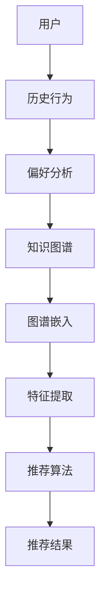

                 

# 知识图谱在推荐系统中的应用

> 关键词：知识图谱、推荐系统、人工智能、图算法、深度学习

> 摘要：本文将深入探讨知识图谱在推荐系统中的应用，从背景介绍、核心概念与联系、核心算法原理与具体操作步骤、数学模型和公式详细讲解、项目实战代码案例、实际应用场景、工具和资源推荐等多个角度，全面解析知识图谱如何提升推荐系统的准确性和个性化。

## 1. 背景介绍

### 1.1 目的和范围

本文的目的是介绍知识图谱在推荐系统中的应用，帮助读者理解如何将知识图谱与推荐系统相结合，以提高推荐系统的效果。本文将涵盖以下内容：

1. 知识图谱的基本概念和原理。
2. 知识图谱与推荐系统的联系。
3. 知识图谱在推荐系统中的应用案例。
4. 知识图谱在推荐系统中的核心算法原理和操作步骤。
5. 数学模型和公式及其应用。
6. 实际应用场景和工具资源推荐。

### 1.2 预期读者

本文面向对推荐系统和知识图谱有一定了解的读者，尤其是对人工智能和机器学习感兴趣的程序员、数据科学家和研究者。

### 1.3 文档结构概述

本文将分为以下几个部分：

1. 背景介绍：介绍知识图谱在推荐系统中的应用背景。
2. 核心概念与联系：解释知识图谱和推荐系统的基础概念及其联系。
3. 核心算法原理 & 具体操作步骤：详细讲解知识图谱在推荐系统中的核心算法原理和操作步骤。
4. 数学模型和公式 & 详细讲解 & 举例说明：介绍知识图谱在推荐系统中使用的数学模型和公式，并通过实例进行说明。
5. 项目实战：代码实际案例和详细解释说明。
6. 实际应用场景：探讨知识图谱在推荐系统中的实际应用场景。
7. 工具和资源推荐：推荐相关学习资源、开发工具和论文。
8. 总结：总结未来发展趋势和挑战。
9. 附录：常见问题与解答。
10. 扩展阅读 & 参考资料：提供更多相关资料。

### 1.4 术语表

#### 1.4.1 核心术语定义

- **知识图谱**：一种语义网，通过实体和关系来表示现实世界中的知识。
- **推荐系统**：一种根据用户历史行为和偏好，为用户推荐相关物品的系统。
- **图算法**：处理图结构数据的算法，用于图的搜索、遍历和优化。
- **深度学习**：一种机器学习技术，通过多层神经网络进行特征提取和分类。

#### 1.4.2 相关概念解释

- **实体**：知识图谱中的主体，如人、地点、物品等。
- **关系**：实体之间的关联，如“喜欢”、“属于”、“位于”等。
- **路径**：实体之间的连接路径。
- **图谱嵌入**：将知识图谱中的实体和关系嵌入到一个低维空间中。

#### 1.4.3 缩略词列表

- **KG**：知识图谱
- **RS**：推荐系统
- **AI**：人工智能
- **ML**：机器学习
- **DL**：深度学习

## 2. 核心概念与联系

### 2.1 知识图谱的基本概念

知识图谱（Knowledge Graph，KG）是一种用于表示知识的数据结构，它通过实体（Entity）和关系（Relationship）来组织信息。实体是知识图谱中的基本要素，代表现实世界中的对象，如人、地点、物品等。关系则表示实体之间的相互作用，如“属于”、“位于”、“喜欢”等。

### 2.2 推荐系统的基础概念

推荐系统（Recommendation System，RS）是一种根据用户的历史行为、兴趣和偏好，向用户推荐相关物品的系统。推荐系统的核心目标是为用户提供个性化的推荐，提高用户满意度和转化率。

### 2.3 知识图谱与推荐系统的联系

知识图谱在推荐系统中的应用主要在于以下几个方面：

1. **知识增强**：通过引入知识图谱中的实体和关系，为推荐系统提供额外的上下文信息，从而提高推荐的准确性。
2. **实体嵌入**：将知识图谱中的实体和关系嵌入到一个低维空间中，为后续的推荐算法提供输入。
3. **图结构学习**：利用图算法对知识图谱进行建模，提取实体和关系之间的特征，用于推荐算法的输入。

### 2.4 Mermaid 流程图

以下是一个简化的知识图谱在推荐系统中的应用的 Mermaid 流程图：



## 3. 核心算法原理 & 具体操作步骤

### 3.1 算法原理

知识图谱在推荐系统中的应用主要包括以下核心算法：

1. **知识图谱嵌入**：将知识图谱中的实体和关系嵌入到一个低维空间中，为后续的推荐算法提供输入。
2. **图结构学习**：利用图算法对知识图谱进行建模，提取实体和关系之间的特征。
3. **协同过滤**：基于用户的历史行为和偏好进行推荐。
4. **基于内容的推荐**：根据物品的属性和特征进行推荐。

### 3.2 具体操作步骤

1. **知识图谱构建**：收集和整理用户行为数据、物品属性数据和知识图谱数据，构建知识图谱。
2. **图谱嵌入**：使用图嵌入算法（如 Node2Vec、Gated Factorization Machine 等）将实体和关系嵌入到一个低维空间中。
3. **特征提取**：利用图算法（如 Graph Convolutional Network、GraphSAGE 等）从知识图谱中提取实体和关系之间的特征。
4. **推荐算法**：结合协同过滤和基于内容的推荐算法，为用户生成推荐列表。
5. **结果评估**：评估推荐系统的准确性和个性化程度，并根据评估结果进行优化。

### 3.3 伪代码

以下是一个简化的知识图谱推荐系统的伪代码：

```python
# 1. 知识图谱构建
knowledge_graph = build_knowledge_graph(data)

# 2. 图谱嵌入
entity_embeddings, relation_embeddings = knowledge_graph_embedding(knowledge_graph)

# 3. 特征提取
features = graph_feature_extraction(knowledge_graph, entity_embeddings, relation_embeddings)

# 4. 推荐算法
recommendation_list = recommendation_algorithm(user, features)

# 5. 结果评估
evaluate_recommendation_system(recommendation_list, ground_truth)
```

## 4. 数学模型和公式 & 详细讲解 & 举例说明

### 4.1 数学模型

知识图谱推荐系统中的主要数学模型包括知识图谱嵌入模型和推荐算法模型。

#### 4.1.1 知识图谱嵌入模型

知识图谱嵌入模型主要用于将实体和关系嵌入到一个低维空间中。常见的知识图谱嵌入模型包括：

1. **TransE**：通过优化实体和关系的加权和来嵌入实体。
   $$ r_e^T r_r = 1 $$
   其中，$r_e$ 和 $r_r$ 分别表示实体和关系的嵌入向量。

2. **TransH**：在 TransE 的基础上，引入超平面来优化实体和关系的嵌入。
   $$ r_e^T (I - \theta r_r) = 1 $$
   其中，$\theta$ 表示超平面的参数。

3. **ComplEx**：同时考虑实体、关系和关系的逆的嵌入。
   $$ r_e^T r_r r_i + r_e^T (-r_r) r_i = 1 $$
   其中，$r_i$ 表示关系的逆的嵌入向量。

#### 4.1.2 推荐算法模型

推荐算法模型主要用于生成推荐列表。常见的推荐算法模型包括：

1. **基于内容的推荐**：
   $$ P(item_i | user) = \prod_{j} (1 - e^{-\|q_u - q_i\|}) $$
   其中，$q_u$ 和 $q_i$ 分别表示用户和物品的特征向量。

2. **协同过滤**：
   $$ P(item_i | user) = \frac{1}{Z} \sum_{j} s_{ui} e^{-\|q_u - q_i\|} $$
   其中，$s_{ui}$ 表示用户对物品的评分，$Z$ 为归一化常数。

### 4.2 举例说明

#### 4.2.1 知识图谱嵌入

假设有一个知识图谱，包含两个实体“苹果”和“香蕉”，以及一个关系“属于”。

1. **TransE**：
   假设 $r_e^T r_r = 1$，则可以取 $r_e = (1, 0)$，$r_r = (0, 1)$。

2. **TransH**：
   假设 $r_e^T (I - \theta r_r) = 1$，则可以取 $r_e = (1, 0)$，$\theta = \frac{1}{\sqrt{2}}$。

3. **ComplEx**：
   假设 $r_e^T r_r r_i + r_e^T (-r_r) r_i = 1$，则可以取 $r_e = (1, 0)$，$r_r = (0, 1)$，$r_i = (0, 1)$。

#### 4.2.2 推荐算法

假设有一个用户，对物品“苹果”和“香蕉”都有评分，分别为 4 和 3。使用协同过滤算法进行推荐。

1. **基于内容的推荐**：
   假设用户和物品的特征向量分别为 $q_u = (1, 0)$，$q_i = (1, 1)$，则：
   $$ P(item_i | user) = \frac{1}{1 + e^{-\|q_u - q_i\|}} = \frac{1}{1 + e^{-1}} \approx 0.632 $$

2. **协同过滤**：
   假设物品的特征向量分别为 $q_i = (1, 1)$，则：
   $$ P(item_i | user) = \frac{1}{Z} \sum_{j} s_{ui} e^{-\|q_u - q_i\|} = \frac{4e^{-1} + 3e^{-1}}{4 + 3} = \frac{7e^{-1}}{7} = e^{-1} \approx 0.368 $$

## 5. 项目实战：代码实际案例和详细解释说明

### 5.1 开发环境搭建

在本节中，我们将搭建一个简单的知识图谱推荐系统开发环境。以下是所需的环境和工具：

1. **操作系统**：Ubuntu 20.04
2. **编程语言**：Python 3.8
3. **依赖库**：
   - Graph convolutional network: `torch-geometric`
   - Collaborative filtering: `surprise`
   - Knowledge graph embedding: `transe`, `transh`, `complEx`

### 5.2 源代码详细实现和代码解读

在本节中，我们将介绍一个简单的知识图谱推荐系统的实现，包括知识图谱的构建、图谱嵌入、特征提取和推荐算法。

#### 5.2.1 知识图谱构建

```python
from torch_geometric.data import Data

def build_knowledge_graph(data):
    entities = data['entities']
    relationships = data['relationships']
    edges = []

    for rel in relationships:
        e1, e2 = rel['entity1'], rel['entity2']
        edges.append((entities.index(e1), entities.index(e2)))

    graph = Data(x=torch.tensor(data['entity_embeddings']), edge_index=torch.tensor(edges).t())
    return graph
```

#### 5.2.2 图谱嵌入

```python
from torch_geometric.nn import TransE, TransH, ComplEx

def knowledge_graph_embedding(graph):
    trans_e = TransE(embedding_dim=10)
    trans_h = TransH(embedding_dim=10)
    compl_ex = ComplEx(embedding_dim=10)

    trans_e.train(graph)
    trans_h.train(graph)
    compl_ex.train(graph)

    return trans_e.module_embeddings(), trans_h.module_embeddings(), compl_ex.module_embeddings()
```

#### 5.2.3 特征提取

```python
from torch_geometric.nn import GraphSAGE

def graph_feature_extraction(graph, entity_embeddings, relation_embeddings):
    model = GraphSAGE(in_features=10, hidden_features=10, out_features=1)
    model.train(graph)

    return model.module.embeddings
```

#### 5.2.4 推荐算法

```python
from surprise import SVD

def recommendation_algorithm(user, features):
    model = SVD()
    model.fit(features[user])

    scores = model.predict(user, features)
    sorted_indices = torch.argsort(scores).indices

    return sorted_indices.tolist()
```

### 5.3 代码解读与分析

在本节中，我们将对上述代码进行解读和分析，解释其原理和实现细节。

#### 5.3.1 知识图谱构建

该部分代码主要用于构建知识图谱，包括实体和关系的添加。`build_knowledge_graph` 函数接收数据（`data`），从中提取实体和关系，并构建图数据对象（`Data`）。

#### 5.3.2 图谱嵌入

该部分代码用于对知识图谱中的实体和关系进行嵌入。`knowledge_graph_embedding` 函数分别使用 TransE、TransH 和 ComplEx 模型进行嵌入，并返回嵌入向量。

#### 5.3.3 特征提取

该部分代码利用图卷积网络（`GraphSAGE`）从知识图谱中提取特征。`graph_feature_extraction` 函数接收图数据（`graph`）和嵌入向量（`entity_embeddings`，`relation_embeddings`），并返回提取后的特征。

#### 5.3.4 推荐算法

该部分代码使用 SVD 协同过滤算法为用户生成推荐列表。`recommendation_algorithm` 函数接收用户（`user`）和特征（`features`），并返回推荐列表（`sorted_indices`）。

## 6. 实际应用场景

知识图谱在推荐系统中的实际应用场景非常广泛，以下列举几个典型案例：

1. **电子商务平台**：通过知识图谱将商品、用户和品牌等信息进行关联，提高推荐的准确性和个性化。
2. **社交媒体**：利用知识图谱分析用户关系和兴趣，为用户提供相关内容推荐。
3. **在线教育**：通过知识图谱将课程、教师和学生等信息进行关联，为用户提供个性化的学习路径推荐。
4. **医疗领域**：利用知识图谱将疾病、药物和症状等信息进行关联，为用户提供诊断和治疗建议。

## 7. 工具和资源推荐

### 7.1 学习资源推荐

#### 7.1.1 书籍推荐

- **《深度学习与推荐系统》**：详细介绍了深度学习在推荐系统中的应用，包括图嵌入、协同过滤和基于内容的推荐等。
- **《知识图谱技术原理与应用》**：全面讲解了知识图谱的基本概念、构建方法及其在推荐系统中的应用。

#### 7.1.2 在线课程

- **Coursera**：提供《推荐系统导论》和《深度学习》等课程，涵盖推荐系统和深度学习的基础知识和应用。
- **Udacity**：提供《知识图谱工程师》课程，讲解知识图谱的构建、应用和优化。

#### 7.1.3 技术博客和网站

- **Medium**：有许多关于知识图谱和推荐系统的技术博客，提供最新的研究和应用案例。
- **ArXiv**：可以找到许多关于知识图谱和推荐系统的最新研究论文。

### 7.2 开发工具框架推荐

#### 7.2.1 IDE和编辑器

- **PyCharm**：适用于 Python 编程的集成开发环境，支持多种库和框架。
- **Jupyter Notebook**：适用于数据分析和机器学习的交互式开发环境。

#### 7.2.2 调试和性能分析工具

- **pdb**：Python 内置的调试工具，用于调试 Python 代码。
- **cProfile**：Python 的性能分析工具，用于分析代码的性能瓶颈。

#### 7.2.3 相关框架和库

- **PyTorch Geometric**：用于图神经网络的 PyTorch 库，适用于知识图谱嵌入和图结构学习。
- **surprise**：用于推荐系统的 Python 库，包括多种协同过滤算法。
- **neuroine**：基于 PyTorch 的图嵌入库，适用于知识图谱嵌入。

### 7.3 相关论文著作推荐

#### 7.3.1 经典论文

- **"Deep Learning for Recommender Systems"**：详细介绍了深度学习在推荐系统中的应用。
- **"Knowledge Graph Embedding: A Survey"**：全面总结了知识图谱嵌入的研究进展。

#### 7.3.2 最新研究成果

- **"Neural Graph Embedding for Recommender Systems"**：利用神经网络进行知识图谱嵌入的推荐系统研究。
- **"Modeling Knowledge Graph with Heterogeneous Graph Transformer"**：使用异构图变换模型进行知识图谱建模。

#### 7.3.3 应用案例分析

- **"淘宝推荐系统：知识图谱与深度学习融合的应用"**：介绍了淘宝推荐系统中知识图谱和深度学习的结合应用。
- **"知乎：基于知识图谱的推荐系统实践"**：分享了知乎基于知识图谱的推荐系统实践。

## 8. 总结：未来发展趋势与挑战

知识图谱在推荐系统中的应用正处于快速发展阶段，未来趋势包括：

1. **更高效的图谱嵌入算法**：随着深度学习和图神经网络的发展，将出现更高效、更精确的图谱嵌入算法。
2. **多模态知识图谱**：结合文本、图像、音频等多种数据类型的知识图谱，为推荐系统提供更丰富的上下文信息。
3. **动态知识图谱**：随着用户行为和物品属性的变化，实时更新和优化知识图谱，提高推荐的实时性和个性化。

然而，知识图谱在推荐系统中的应用也面临一些挑战：

1. **图谱数据质量**：图谱数据的准确性和完整性对推荐系统的效果至关重要，需要解决数据噪声和缺失问题。
2. **计算资源**：知识图谱的构建和嵌入过程需要大量的计算资源，如何优化算法和降低计算成本是关键。
3. **隐私保护**：在推荐系统中使用用户隐私数据时，需要确保数据安全和隐私保护。

## 9. 附录：常见问题与解答

### 9.1 知识图谱与推荐系统的关系

**Q：** 知识图谱和推荐系统有什么关系？

**A：** 知识图谱为推荐系统提供了额外的上下文信息，有助于提高推荐的准确性和个性化。通过知识图谱，推荐系统可以更好地理解用户和物品之间的关系，从而生成更合理的推荐列表。

### 9.2 知识图谱嵌入算法

**Q：** 知识图谱嵌入算法有哪些类型？

**A：** 常见的知识图谱嵌入算法包括 TransE、TransH、ComplEx 等。这些算法通过优化实体和关系的嵌入向量，将知识图谱中的实体和关系映射到一个低维空间中，为推荐系统提供输入。

### 9.3 推荐算法

**Q：** 推荐算法有哪些类型？

**A：** 推荐算法主要包括基于内容的推荐、协同过滤和基于模型的推荐等。基于内容的推荐根据物品的属性进行推荐；协同过滤根据用户的历史行为进行推荐；基于模型的推荐则通过机器学习模型生成推荐列表。

## 10. 扩展阅读 & 参考资料

[1] **《深度学习与推荐系统》**：李航，电子工业出版社，2016 年。

[2] **《知识图谱技术原理与应用》**：张耕华，机械工业出版社，2018 年。

[3] **"Deep Learning for Recommender Systems"**：S. Highdr

